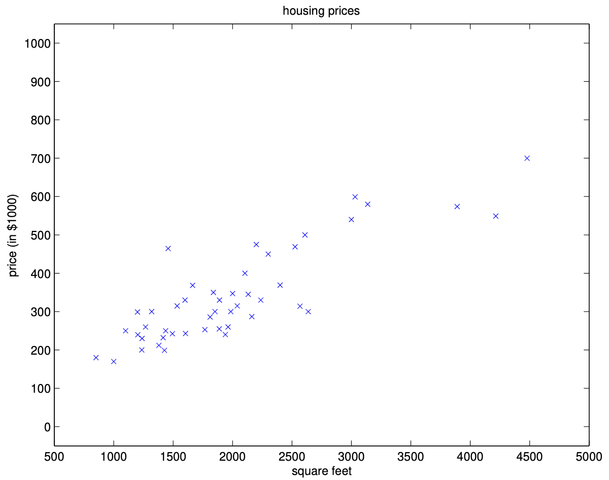
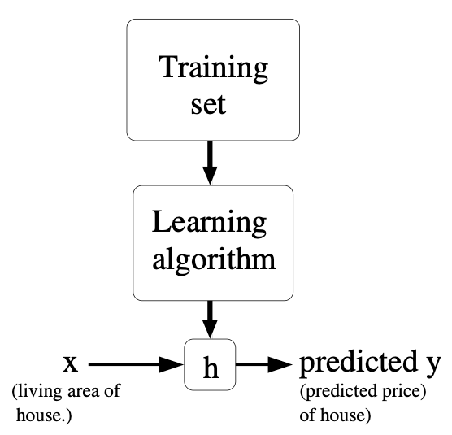

# Linear Regression: Introduction

Linear regression is one of the most fundamental algorithms in supervised learning. It is used to model the relationship between a scalar dependent variable (target) and one or more explanatory variables (features). The goal is to learn a function that maps input features to the target variable, based on observed data. This approach is widely used in fields such as economics, biology, engineering, and social sciences, wherever we want to predict a continuous outcome from one or more input variables.

## What is Linear Regression?

At its core, linear regression assumes that there exists a **linear relationship** between the input features and the target variable. This means we believe that the target can be expressed as a weighted sum of the features, plus some constant term. Mathematically, for a single feature, this relationship is:

$$y = \theta_0 + \theta_1 x + \varepsilon$$

where:
- $y$ is the target variable we want to predict
- $x$ is the input feature
- $\theta_0$ is the **intercept** (also called bias term) - the value of $y$ when $x = 0$
- $\theta_1$ is the **slope** - how much $y$ changes for a unit change in $x$
- $\varepsilon$ is the **error term** - captures the difference between our linear model and the true relationship

The key insight is that we're making a **simplifying assumption**: we believe the relationship is approximately linear, even though real-world relationships are often more complex. This assumption allows us to build interpretable models and serves as a foundation for more sophisticated methods.

## Supervised Learning Framework

Supervised learning refers to the class of machine learning problems where we are given a dataset consisting of input-output pairs, and the goal is to learn a mapping from inputs to outputs. In the context of linear regression, the inputs are the features (such as living area, number of bedrooms, etc.), and the output is the value we want to predict (such as house price).

### The Learning Process

1. **Data Collection**: We gather examples of input-output pairs
2. **Model Selection**: We choose a family of functions (linear functions in our case)
3. **Parameter Learning**: We find the best parameters within that family
4. **Prediction**: We use the learned function to make predictions on new data

This process is iterative and often involves evaluating the model's performance and refining our approach.

## Example: Predicting House Prices

Let's start by talking about a few examples of supervised learning problems. Suppose we have a dataset giving the living areas and prices of 47 houses from Portland, Oregon. Each data point represents a house, with its living area (in square feet) and its price (in thousands of dollars):

| Living area (ft²) | Price (1000$s) |
|------------------|---------------|
| 2104             | 400           |
| 1600             | 330           |
| 2400             | 369           |
| 1416             | 232           |
| 3000             | 540           |
| ...              | ...           |

This kind of data is typical in real-world applications, where we want to use measurable features to predict an outcome of interest. For example, a real estate agent might use such a model to estimate the value of a house based on its size.

### Understanding the Data

Looking at this data, we can observe some patterns:
- Generally, larger houses cost more (positive correlation)
- The relationship isn't perfectly linear (there's some scatter)
- There's variation in price for similar sizes (due to other factors like location, age, etc.)

We can plot this data to visualize the relationship between living area and price. The goal of linear regression is to find the best-fitting line through this data, which can then be used to predict the price of a house given its living area.

### Why Linear Regression?

You might wonder why we choose a linear model when the relationship might not be perfectly linear. There are several reasons:

1. **Simplicity**: Linear models are easy to understand and interpret
2. **Computational Efficiency**: They're fast to train and make predictions
3. **Robustness**: They're less prone to overfitting on small datasets
4. **Foundation**: They provide a baseline for more complex models
5. **Interpretability**: The coefficients have clear meanings

## The Supervised Learning Problem

Given data like this, how can we learn to predict the prices of other houses in Portland, as a function of the size of their living areas? This is the essence of supervised learning: using known examples to make predictions about new, unseen cases.

### Formal Problem Statement

To formalize this, we define:
- **Input features**: The variables we use to make predictions (e.g., living area), denoted as $x^{(i)}$ for the $i$-th example. In general, $x^{(i)}$ can be a vector if there are multiple features.
- **Target variable**: The value we want to predict (e.g., price), denoted as $y^{(i)}$ for the $i$-th example.
- **Training example**: A pair $(x^{(i)}, y^{(i)})$ representing the input and output for the $i$-th data point.
- **Training set**: The collection of all training examples, $\{(x^{(i)}, y^{(i)}) ; i = 1, \ldots, n\}$, where $n$ is the number of examples.

We use $\mathcal{X}$ to denote the space of input values and $\mathcal{Y}$ for the space of output values. In this example, $\mathcal{X} = \mathcal{Y} = \mathbb{R}$, meaning both inputs and outputs are real numbers. In more complex problems, $\mathcal{X}$ could be a higher-dimensional space.

### The Learning Objective

The goal of supervised learning is, given a training set, to learn a function $h : \mathcal{X} \to \mathcal{Y}$ so that $h(x)$ is a good predictor for the corresponding value of $y$. This function $h$ is called a **hypothesis**. The process of learning is to choose $h$ from a set of possible functions (the hypothesis space) so that it best fits the data.

### Understanding the Hypothesis Space

The hypothesis space is the set of all possible functions we consider. For linear regression, this space consists of all linear functions of the form:

$$h_\theta(x) = \theta_0 + \theta_1 x_1 + \theta_2 x_2 + \ldots + \theta_d x_d$$

where $\theta = [\theta_0, \theta_1, \ldots, \theta_d]^T$ is the parameter vector. The learning algorithm's job is to find the best values for these parameters.

### Notation Summary

- $x^{(i)}$: Input variable (feature) for the $i$-th training example (e.g., living area)
- $y^{(i)}$: Output variable (target) for the $i$-th training example (e.g., price)
- $(x^{(i)}, y^{(i)})$: The $i$-th training example
- $n$: Number of training examples
- Training set: $\{(x^{(i)}, y^{(i)}) ; i = 1, \ldots, n\}$
- $\mathcal{X}$: Space of input values (features)
- $\mathcal{Y}$: Space of output values (targets)
- $h$: Hypothesis function, $h : \mathcal{X} \to \mathcal{Y}$
- $\theta$: Parameter vector that defines the hypothesis

## Regression vs. Classification

Supervised learning problems can be broadly categorized into two types: regression and classification.

### Regression Problems

When the target variable that we're trying to predict is **continuous**, such as in our housing example, we call the learning problem a **regression** problem. Linear regression is the most common example, but there are many other regression algorithms.

**Examples of regression problems:**
- Predicting house prices from features
- Forecasting stock prices
- Estimating temperature from weather data
- Predicting student test scores from study hours

**Key characteristics:**
- Target variable is continuous (can take any real value)
- We typically use mean squared error or similar loss functions
- The output is a real number

### Classification Problems

When $y$ can take on only a small number of **discrete values** (such as if, given the living area, we wanted to predict if a dwelling is a house or an apartment), we call it a **classification** problem. Classification is used in tasks like spam detection, image recognition, and medical diagnosis.

**Examples of classification problems:**
- Spam vs. non-spam email detection
- Image classification (cat vs. dog)
- Medical diagnosis (healthy vs. sick)
- Credit card fraud detection

**Key characteristics:**
- Target variable is discrete (categorical)
- We typically use cross-entropy or similar loss functions
- The output is a class label

### Why the Distinction Matters

The distinction is important because it determines:
1. **Type of model**: Different algorithms are designed for different problem types
2. **Loss function**: We need different ways to measure prediction error
3. **Evaluation metrics**: Accuracy vs. mean squared error, for example
4. **Output interpretation**: Class probabilities vs. continuous predictions

In this section, we focus on regression, but many of the ideas carry over to classification with appropriate modifications.

## Linear Regression with Multiple Features

In many real-world problems, we have more than one feature. To make our housing example more interesting, let's consider a slightly richer dataset in which we also know the number of bedrooms in each house:

| Living area (ft²) | #bedrooms | Price (1000$s) |
|------------------|-----------|---------------|
| 2104             | 3         | 400           |
| 1600             | 3         | 330           |
| 2400             | 3         | 369           |
| 1416             | 2         | 232           |
| 3000             | 4         | 540           |
| ...              | ...       | ...           |

### Extending to Multiple Features

Here, the $x$'s are two-dimensional vectors in $\mathbb{R}^2$. For instance, $x_1^{(i)}$ is the living area of the $i$-th house in the training set, and $x_2^{(i)}$ is its number of bedrooms. In general, $x^{(i)}$ can be a vector of any length, depending on how many features we include.

**Why multiple features?**
- More information leads to better predictions
- Different features capture different aspects of the problem
- We can model more complex relationships

**Feature selection**—deciding which features to use—is an important part of building a good model, but for now, let's take the features as given.

### The Linear Model Assumption

The idea of linear regression is to approximate the target variable $y$ as a linear function of the input features $x$. This means we assume that the relationship between the features and the target can be captured by a straight line (or hyperplane in higher dimensions).

**Mathematical intuition**: We're assuming that each feature contributes independently to the target, and these contributions add up linearly. This is a strong assumption, but it's often a good starting point.

### The Hypothesis Function

To perform supervised learning, we must decide how we're going to represent functions/hypotheses $h$ in a computer. As an initial choice, let's say we decide to approximate $y$ as a linear function of $x$:

$$
h_\theta(x) = \theta_0 + \theta_1 x_1 + \theta_2 x_2
$$

Here, the $\theta$'s are the **parameters** (also called **weights**) parameterizing the space of linear functions mapping from $\mathcal{X}$ to $\mathcal{Y}$. Each $\theta_j$ determines how much the corresponding feature $x_j$ influences the prediction. 

**Understanding the parameters:**
- $\theta_0$ is called the **intercept** or **bias** term, and it allows the model to fit data that does not pass through the origin
- $\theta_1$ represents the change in price for a one-unit increase in living area (holding bedrooms constant)
- $\theta_2$ represents the change in price for a one-unit increase in bedrooms (holding living area constant)

### Vectorized Notation

When there is no risk of confusion, we will drop the $\theta$ subscript in $h_\theta(x)$, and write it more simply as $h(x)$. To simplify our notation, we also introduce the convention of letting $x_0 = 1$ (this is the **intercept term**), so that

$$
h(x) = \sum_{i=0}^d \theta_i x_i = \theta^T x,
$$

where on the right-hand side above we are viewing $\theta$ and $x$ both as vectors, and here $d$ is the number of input variables (not counting $x_0$). This vectorized notation is very convenient for both mathematical analysis and efficient computation in code.

**Benefits of vectorized notation:**
1. **Compactness**: The formula is much shorter
2. **Computational efficiency**: Matrix operations are optimized in most programming languages
3. **Mathematical elegance**: Many theoretical results are easier to derive
4. **Scalability**: The same formula works for any number of features

**Example**: For our housing problem with $x_0 = 1$, $x_1 = \text{living area}$, $x_2 = \text{bedrooms}$:
$$h(x) = \theta_0 \cdot 1 + \theta_1 \cdot x_1 + \theta_2 \cdot x_2 = \theta^T x$$

## The Cost Function

Now, given a training set, how do we pick, or learn, the parameters $\theta$? One reasonable method is to make $h(x)$ close to $y$, at least for the training examples we have. To formalize this, we define a function that measures, for each value of the $\theta$'s, how close the $h(x^{(i)})$'s are to the corresponding $y^{(i)}$'s. This function is called the **cost function** (or **loss function**), and for linear regression, it is defined as:

$$
J(\theta) = \frac{1}{2} \sum_{i=1}^n \left( h_\theta(x^{(i)}) - y^{(i)} \right)^2.
$$

### Understanding the Cost Function

The cost function measures how well our model fits the training data. Let's break down each component:

#### 1. Prediction Error
The term $\left( h_\theta(x^{(i)}) - y^{(i)} \right)$ is the **prediction error** for the $i$-th training example. It measures how far off our prediction is from the true value.

#### 2. Squared Error
We square the error: $\left( h_\theta(x^{(i)}) - y^{(i)} \right)^2$. This serves several purposes:
- **Eliminates sign**: Positive and negative errors are treated equally
- **Penalizes large errors**: Larger errors are penalized more heavily (due to the square)
- **Mathematical convenience**: Makes the function differentiable everywhere

#### 3. Sum Over All Examples
We sum over all $n$ training examples to get a measure of the total error across the entire dataset.

#### 4. Factor of $\frac{1}{2}$
The $\frac{1}{2}$ is included for mathematical convenience. When we take derivatives of $J(\theta)$ with respect to $\theta$ (as we do in optimization), the 2 from the square cancels the $\frac{1}{2}$, simplifying the gradient expression.

### Intuition and Explanation

- **Squared Error**: The term $\left( h_\theta(x^{(i)}) - y^{(i)} \right)^2$ measures how far off our prediction $h_\theta(x^{(i)})$ is from the true value $y^{(i)}$ for each training example. Squaring ensures that errors of different signs do not cancel out, and it penalizes larger errors more heavily.
- **Sum over all examples**: We sum this squared error over all $n$ training examples to get a measure of the total error for a given choice of parameters $\theta$.
- **Factor of $\frac{1}{2}$**: The $\frac{1}{2}$ is included for mathematical convenience. When we take derivatives of $J(\theta)$ with respect to $\theta$ (as we do in optimization), the 2 from the square cancels the $\frac{1}{2}$, simplifying the gradient expression.

### Geometric Interpretation

Minimizing $J(\theta)$ means we are finding the parameters $\theta$ that make the predictions $h_\theta(x)$ as close as possible to the actual values $y$ for all training examples. Geometrically, this corresponds to finding the line (or hyperplane, in higher dimensions) that best fits the data in the sense of minimizing the sum of squared vertical distances between the data points and the line.

**Visual intuition**: Imagine trying to draw a line through a scatter plot of points. The cost function measures the total squared vertical distance from each point to the line. We want to find the line that minimizes this total distance.

### Why Squared Error?

You might wonder why we use squared error instead of absolute error or other measures. Here are the key reasons:

1. **Differentiability**: The squared error function is differentiable everywhere, which is important for optimization algorithms like gradient descent
2. **Mathematical tractability**: It leads to closed-form solutions (normal equations)
3. **Statistical interpretation**: It corresponds to maximum likelihood estimation under Gaussian noise assumptions
4. **Penalty structure**: It penalizes large errors more heavily than small ones

### Vectorized Form and Mean Squared Error

We can also write the cost function in a more compact, vectorized form. Let $X$ be the $n \times (d+1)$ matrix of input features (including the intercept term), $\theta$ the parameter vector, and $y$ the vector of outputs. Then:

$$
J(\theta) = \frac{1}{2} \| X\theta - y \|^2
$$

where $\| \cdot \|$ denotes the Euclidean (L2) norm. This form is much more compact and computationally efficient.

Sometimes, the cost function is averaged over the number of examples, giving the **mean squared error (MSE)**:

$$
\text{MSE}(\theta) = \frac{1}{n} \sum_{i=1}^n \left( h_\theta(x^{(i)}) - y^{(i)} \right)^2
$$

**Relationship between $J(\theta)$ and MSE**:
$$J(\theta) = \frac{n}{2} \cdot \text{MSE}(\theta)$$

Since $n$ is constant, minimizing $J(\theta)$ is equivalent to minimizing MSE.

### The Optimization Problem

Our goal is to find the parameters $\theta$ that minimize the cost function:

$$\theta^* = \arg\min_\theta J(\theta)$$

This is an optimization problem, and there are several ways to solve it:
1. **Analytical solution**: Normal equations (for small to medium datasets)
2. **Iterative solution**: Gradient descent (for large datasets or when normal equations are computationally expensive)

Minimizing the cost function $J(\theta)$ (or equivalently, the MSE) leads to the best fit line or hyperplane for the data, according to the least-squares criterion.

---

**Next: [LMS Algorithm](02_lms_algorithm.md)** - Learn about gradient descent and the LMS algorithm for optimizing the cost function.

