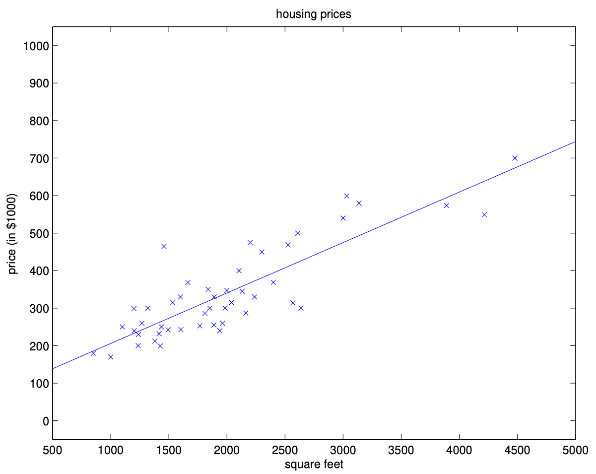

# LMS Algorithm

## Introduction and Context

The Least Mean Squares (LMS) algorithm is a foundational method in machine learning and signal processing, particularly for linear regression and adaptive filtering. Its goal is to find the parameter vector $\theta$ that minimizes a cost function $J(\theta)$, typically the mean squared error between predictions and observed values. LMS is closely related to the method of gradient descent, which is a general-purpose optimization technique used throughout machine learning.

LMS and its variants are widely used in applications such as system identification, adaptive noise cancellation, and online learning, where the model must adapt to new data in real time. The algorithm's simplicity, efficiency, and ability to handle streaming data make it a cornerstone of both classical and modern machine learning.

### Why Do We Need an Algorithm?

You might wonder why we need an iterative algorithm like gradient descent when we could potentially solve for the optimal parameters directly. There are several reasons:

1. **Computational Efficiency**: For large datasets, computing the exact solution (normal equations) can be computationally expensive
2. **Memory Constraints**: Direct methods may require storing large matrices in memory
3. **Online Learning**: When data arrives in a stream, we need to update our model incrementally
4. **Non-linear Extensions**: The same principles extend to more complex models like neural networks

## Gradient Descent: Mathematical and Geometric Intuition

Gradient descent is an iterative optimization algorithm that seeks to find the minimum of a function by moving in the direction of steepest descent, as defined by the negative of the gradient. For a cost function $J(\theta)$, the gradient $\nabla J(\theta)$ points in the direction of greatest increase; thus, moving in the opposite direction reduces the cost.

### Understanding the Gradient

The gradient of a function $J(\theta)$ at a point $\theta$ is a vector of partial derivatives:

$$\nabla J(\theta) = \left[ \frac{\partial J}{\partial \theta_0}, \frac{\partial J}{\partial \theta_1}, \ldots, \frac{\partial J}{\partial \theta_d} \right]^T$$

**Key properties of the gradient:**
1. **Direction**: Points in the direction of steepest ascent
2. **Magnitude**: Indicates how steep the function is in that direction
3. **Orthogonality**: The gradient is perpendicular to the level curves (contours) of the function

### Geometric Interpretation

Geometrically, if we imagine the cost function as a surface over the parameter space, gradient descent can be visualized as a ball rolling downhill, always moving in the direction that most rapidly decreases the height (cost). The step size is controlled by the learning rate $\alpha$.

**Visual analogy**: Imagine you're standing on a hill and want to get to the bottom. The gradient tells you which direction is steepest downhill. You take a step in that direction, and repeat until you reach the bottom.

### The Learning Rate

The learning rate $\alpha$ controls how big a step we take in each iteration:

$$\theta := \theta - \alpha \nabla J(\theta)$$

**Choosing the learning rate:**
- **Too small**: Convergence is slow, but stable
- **Too large**: May overshoot the minimum or even diverge
- **Just right**: Fast convergence to the minimum

**Rule of thumb**: Start with $\alpha = 0.01$ and adjust based on convergence behavior.

## Derivation of the Update Rule

Let's derive the update rule for linear regression step by step. This derivation is crucial for understanding why the algorithm works and how to extend it to other problems.

### 1. Hypothesis Function

The hypothesis for linear regression is a linear combination of the input features:

$$
h_\theta(x) = \theta^T x = \sum_{j=0}^d \theta_j x_j
$$

where $x_0 = 1$ for the intercept term.

**Understanding the hypothesis:**
- Each $\theta_j$ is a weight that determines how much feature $x_j$ influences the prediction
- $\theta_0$ is the bias term that allows the line to not pass through the origin
- The hypothesis is linear in the parameters $\theta$, which is why we call it linear regression

### 2. Cost Function

For a single training example $(x, y)$, the cost function is:

$$
J(\theta) = \frac{1}{2} (h_\theta(x) - y)^2
$$

The factor $\frac{1}{2}$ is included for convenience, as it cancels out when differentiating.

**Why squared error?**
- It penalizes large errors more heavily than small ones
- It's differentiable everywhere, which is important for gradient descent
- It corresponds to maximum likelihood estimation under Gaussian noise assumptions

### 3. Compute the Gradient

We want to compute the partial derivative of $J(\theta)$ with respect to $\theta_j$:

$$
\frac{\partial}{\partial \theta_j} J(\theta) = \frac{\partial}{\partial \theta_j} \left[ \frac{1}{2} (h_\theta(x) - y)^2 \right]
$$

**Step-by-step derivation:**

#### Step 1: Apply the chain rule
The chain rule tells us that if we have a composition of functions, we multiply their derivatives:

$$
= (h_\theta(x) - y) \cdot \frac{\partial}{\partial \theta_j} (h_\theta(x) - y)
$$

#### Step 2: Simplify the second term
Since $y$ does not depend on $\theta_j$:

$$
= (h_\theta(x) - y) \cdot \frac{\partial}{\partial \theta_j} (h_\theta(x))
$$

#### Step 3: Compute the derivative of the hypothesis
Recall $h_\theta(x) = \sum_{k=0}^d \theta_k x_k$, so:

$$
\frac{\partial}{\partial \theta_j} (h_\theta(x)) = \frac{\partial}{\partial \theta_j} \left( \sum_{k=0}^d \theta_k x_k \right) = x_j
$$

**Why does this derivative equal $x_j$?**
- When we take the partial derivative with respect to $\theta_j$, all terms $\theta_k x_k$ where $k \neq j$ become zero
- Only the term $\theta_j x_j$ remains, and its derivative is $x_j$

#### Step 4: Final gradient expression
Therefore:

$$
\frac{\partial}{\partial \theta_j} J(\theta) = (h_\theta(x) - y) x_j
$$

**Interpretation**: The gradient for parameter $\theta_j$ is the prediction error $(h_\theta(x) - y)$ multiplied by the corresponding feature value $x_j$.

### 4. Gradient Descent Update Rule

The general gradient descent update for $\theta_j$ is:

$$
\theta_j := \theta_j - \alpha \frac{\partial}{\partial \theta_j} J(\theta)
$$

Substitute the gradient:

$$
\theta_j := \theta_j - \alpha (h_\theta(x) - y) x_j
$$

Or, equivalently (by switching the sign inside the parenthesis):

$$
\theta_j := \theta_j + \alpha (y - h_\theta(x)) x_j
$$

**Understanding the update rule:**
- If our prediction is too high ($h_\theta(x) > y$), we decrease $\theta_j$ (negative gradient)
- If our prediction is too low ($h_\theta(x) < y$), we increase $\theta_j$ (positive gradient)
- The magnitude of the update depends on the error size and the feature value

This is the update rule for a single training example. For a dataset, the gradient is averaged (batch) or applied per example (stochastic/mini-batch).

### 5. Vectorized Update Rule

For all parameters simultaneously, we can write the update rule in vector form:

$$\theta := \theta + \alpha (y - h_\theta(x)) x$$

This is much more compact and computationally efficient than updating each parameter separately.

## Learning Rate and Convergence

The learning rate $\alpha$ is a critical hyperparameter that controls the optimization process.

### Choosing the Learning Rate

**Too small learning rate ($\alpha \ll 1$):**
- **Pros**: Stable convergence, won't overshoot
- **Cons**: Very slow convergence, may get stuck in flat regions
- **Visual**: Small, careful steps toward the minimum

**Too large learning rate ($\alpha \gg 1$):**
- **Pros**: Fast initial progress
- **Cons**: May overshoot the minimum, oscillate, or even diverge
- **Visual**: Large, erratic steps that may miss the minimum

**Optimal learning rate:**
- **Pros**: Fast convergence to the minimum
- **Cons**: Requires tuning
- **Visual**: Efficient steps that quickly reach the minimum

### Convergence Analysis

For convex cost functions (such as in linear regression), gradient descent is guaranteed to converge to the global minimum, provided $\alpha$ is sufficiently small.

**Convergence conditions:**
1. **Lipschitz continuity**: The gradient must not change too rapidly
2. **Convexity**: The cost function must be convex (bowl-shaped)
3. **Bounded gradient**: The gradient magnitude must be bounded

**Convergence rate:**
- For strongly convex functions: Linear convergence
- For general convex functions: Sublinear convergence
- The exact rate depends on the condition number of the Hessian matrix

### Learning Rate Scheduling

Sometimes, $\alpha$ is decreased over time (learning rate annealing) to allow for rapid initial progress and fine-tuning near the minimum.

**Common schedules:**
1. **Fixed**: $\alpha$ remains constant
2. **Step decay**: $\alpha$ is reduced by a factor every $k$ iterations
3. **Exponential decay**: $\alpha = \alpha_0 \cdot e^{-kt}$
4. **Adaptive**: Methods like AdaGrad, RMSprop, Adam automatically adjust $\alpha$

## Batch Gradient Descent

Batch gradient descent computes the gradient of the cost function with respect to the parameters $\theta$ by averaging over the entire training set:

$$
\theta := \theta + \alpha \sum_{i=1}^n (y^{(i)} - h_\theta(x^{(i)})) x^{(i)}
$$

### Understanding Batch Gradient Descent

**What happens in each iteration:**
1. Compute predictions for all training examples
2. Calculate errors for all examples
3. Average the gradients across all examples
4. Update all parameters using the average gradient

**Mathematical formulation:**
For a dataset with $n$ examples, the cost function becomes:

$$
J(\theta) = \frac{1}{2n} \sum_{i=1}^n (h_\theta(x^{(i)}) - y^{(i)})^2
$$

The gradient is:

$$
\nabla J(\theta) = \frac{1}{n} \sum_{i=1}^n (h_\theta(x^{(i)}) - y^{(i)}) x^{(i)}
$$

### Advantages and Disadvantages

**Advantages:**
- **Stable convergence**: Smooth, predictable updates
- **Theoretical guarantees**: Well-understood convergence properties
- **Deterministic**: Same result every time (given same initialization)

**Disadvantages:**
- **Computational cost**: Requires full pass through data for each update
- **Memory usage**: May need to store entire dataset in memory
- **Slow for large datasets**: Each iteration is expensive

### Geometric Interpretation

Batch gradient descent can be visualized as taking smooth, direct steps toward the minimum of the cost surface, following the direction of the average gradient over all data points.

The ellipses shown above are the contours of a quadratic function. Also shown is the trajectory taken by gradient descent, which was initialized at $(48, 30)$. The $x$'s in the figure (joined by straight lines) mark the successive values of $\theta$ that gradient descent went through.

**What the contours tell us:**
- Each ellipse represents points with the same cost value
- The center of the ellipses is the minimum
- The algorithm follows the steepest descent path toward the minimum

When we run batch gradient descent to fit $\theta$ on our previous dataset, to learn to predict housing price as a function of living area, we obtain $\theta_0 = 71.27$, $\theta_1 = 0.1345$. If we plot $h_\theta(x)$ as a function of $x$ (area), along with the training data, we obtain the following figure:

**Interpreting the results:**
- $\theta_0 = 71.27$: The base price (in thousands) when living area is zero
- $\theta_1 = 0.1345$: For each additional square foot, the price increases by $134.50
- The line fits the data reasonably well, capturing the general trend

## Stochastic Gradient Descent (SGD)

Stochastic gradient descent updates the parameters using only a single randomly chosen training example at each step:

$$
\theta := \theta + \alpha (y^{(i)} - h_\theta(x^{(i)})) x^{(i)}
$$

### Understanding SGD

**Key insight**: Instead of computing the exact gradient over all data, we use an unbiased estimate from a single example.

**Why "stochastic"?**
- The gradient estimate is random (depends on which example we choose)
- This randomness introduces noise into the optimization process
- The noise can actually be beneficial in some cases

### Algorithm Details

**For each iteration:**
1. Randomly select a training example $(x^{(i)}, y^{(i)})$
2. Compute the gradient for this single example
3. Update parameters using this gradient
4. Repeat until convergence

**Convergence behavior:**
- The parameter values oscillate around the minimum
- The oscillations decrease over time (if learning rate is decreased)
- May not settle exactly at the minimum due to noise

### Advantages and Disadvantages

**Advantages:**
- **Fast initial progress**: Can make rapid progress, especially for large datasets
- **Memory efficient**: Only needs one example at a time
- **Can escape local minima**: The noise can help escape shallow local minima in non-convex problems
- **Suitable for online learning**: Can update the model as new data arrives
- **Real-time adaptation**: Can adapt to changing data distributions

**Disadvantages:**
- **Noisy updates**: The parameter trajectory is not smooth
- **May not converge exactly**: Due to the noise, may oscillate around the minimum
- **Requires careful tuning**: Learning rate scheduling is more important
- **Less stable**: Results may vary between runs due to randomness

### When to Use SGD

SGD is particularly useful when:
- The dataset is very large
- You need real-time updates
- Memory is limited
- You're dealing with non-convex optimization problems

## Mini-batch Gradient Descent

Mini-batch gradient descent is a compromise between batch and stochastic methods. It updates the parameters using a small, randomly selected subset (mini-batch) of the training data at each step:

$$
\theta := \theta + \alpha \frac{1}{m} \sum_{k=1}^m (y^{(k)} - h_\theta(x^{(k)})) x^{(k)}
$$

where $m$ is the mini-batch size.

### Understanding Mini-batch Gradient Descent

**Key idea**: Use a small batch of examples to get a better gradient estimate than SGD, but avoid the computational cost of full batch gradient descent.

**Algorithm:**
1. Randomly sample $m$ examples from the training set
2. Compute the average gradient over these $m$ examples
3. Update parameters using this average gradient
4. Repeat until convergence

### Choosing Mini-batch Size

**Small mini-batches (m = 1-32):**
- More noise, faster initial progress
- Better for escaping local minima
- Less stable convergence

**Large mini-batches (m = 128-512):**
- Less noise, more stable convergence
- Better gradient estimates
- More computational cost per iteration

**Typical choices:**
- **Deep learning**: 16, 32, 64, 128, 256
- **Linear models**: 32, 64, 128
- **Small datasets**: Use batch gradient descent

### Advantages and Disadvantages

**Advantages:**
- **Balanced approach**: Combines benefits of both batch and SGD
- **Computational efficiency**: Can use vectorized operations effectively
- **Hardware friendly**: Works well with GPUs and parallel processing
- **Stable convergence**: Less noisy than SGD, faster than batch

**Disadvantages:**
- **Hyperparameter tuning**: Need to choose mini-batch size
- **Memory usage**: Requires storing mini-batch in memory
- **Complexity**: More complex than pure SGD or batch

### Practical Tips

- **Typical mini-batch sizes range from 16 to 512**, depending on the problem and hardware
- **Mini-batch methods allow for efficient use of vectorized operations** and parallel hardware (e.g., GPUs)
- **The optimal mini-batch size often depends on the specific problem and hardware constraints**
- **Larger mini-batches generally lead to more stable convergence but slower initial progress**

## Real-world Applications and Historical Context

The LMS algorithm was first introduced in the context of adaptive filters and signal processing (Widrow and Hoff, 1960). It remains a fundamental tool in these fields, as well as in modern machine learning. Variants of LMS and gradient descent are used in training neural networks, recommendation systems, and many other applications.

### Historical Development

**1960s**: Widrow and Hoff introduce the LMS algorithm for adaptive filtering
**1970s-1980s**: Development of various gradient descent variants
**1990s**: Application to neural networks and machine learning
**2000s-present**: Widespread use in deep learning and large-scale optimization

### Example Applications

**Predicting housing prices** from features such as area, number of bedrooms, etc.
- **Why gradient descent?**: Large datasets, real-time updates needed
- **Which variant?**: Mini-batch gradient descent for good balance

**Adaptive noise cancellation** in audio processing
- **Why gradient descent?**: Real-time adaptation to changing noise patterns
- **Which variant?**: Stochastic gradient descent for online learning

**Online recommendation systems** that update in real time as new data arrives
- **Why gradient descent?**: Need to adapt to changing user preferences
- **Which variant?**: Stochastic gradient descent for immediate updates

### Modern Extensions

**Adaptive methods**: AdaGrad, RMSprop, Adam automatically adjust learning rates
**Momentum**: Adds velocity to gradient updates for faster convergence
**Second-order methods**: Use curvature information (Hessian) for better updates
**Distributed optimization**: Scale to very large datasets across multiple machines

## Summary Table

| Method                   | Update per Step         | Memory Usage | Convergence | Use Case                  |
|-------------------------|------------------------|--------------|-------------|---------------------------|
| Batch Gradient Descent  | All examples           | High         | Smooth      | Small/medium datasets     |
| Stochastic Gradient Descent | Single example      | Low          | Noisy       | Large/streaming datasets  |
| Mini-batch Gradient Descent | Small batch         | Medium       | Less noisy  | Most deep learning tasks  |

### Key Takeaways

1. **Gradient descent is the foundation** of most optimization in machine learning
2. **Choose the variant based on your problem**: dataset size, computational constraints, convergence requirements
3. **Learning rate is crucial**: too small = slow, too large = unstable
4. **Mini-batch is often the best choice** for most practical problems
5. **The same principles extend** to more complex models like neural networks

---

**Previous: [Linear Regression](01_linear_regression.md)** - Introduction to linear regression and the cost function.

**Next: [Normal Equations](03_normal_equations.md)** - Learn about the closed-form solution to linear regression using normal equations.