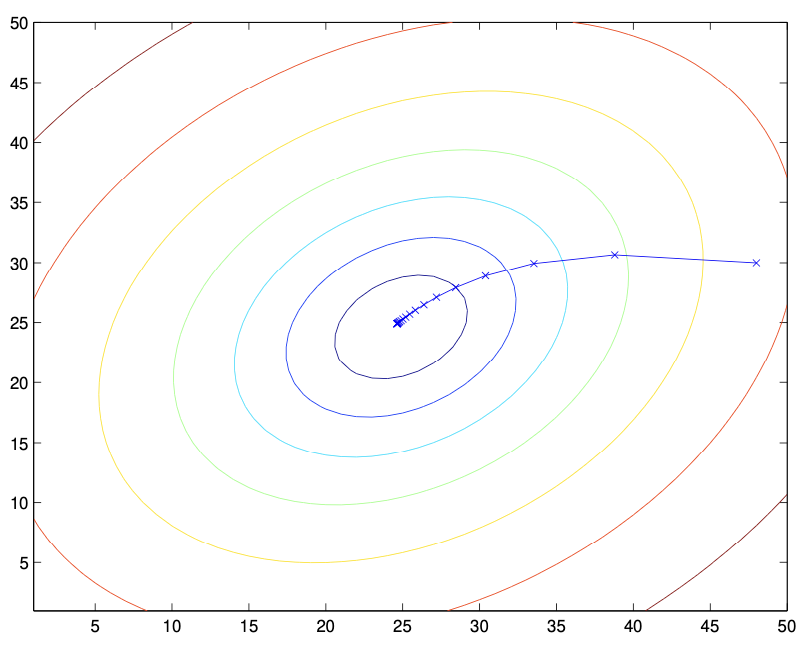

# LMS Algorithm

## Introduction and Context

The Least Mean Squares (LMS) algorithm is a foundational method in machine learning and signal processing, particularly for linear regression and adaptive filtering. Its goal is to find the parameter vector $\theta$ that minimizes a cost function $J(\theta)$, typically the mean squared error between predictions and observed values. LMS is closely related to the method of gradient descent, which is a general-purpose optimization technique used throughout machine learning.

LMS and its variants are widely used in applications such as system identification, adaptive noise cancellation, and online learning, where the model must adapt to new data in real time. The algorithm's simplicity, efficiency, and ability to handle streaming data make it a cornerstone of both classical and modern machine learning.

## Gradient Descent: Mathematical and Geometric Intuition

Gradient descent is an iterative optimization algorithm that seeks to find the minimum of a function by moving in the direction of steepest descent, as defined by the negative of the gradient. For a cost function $J(\theta)$, the gradient $\nabla J(\theta)$ points in the direction of greatest increase; thus, moving in the opposite direction reduces the cost.

Geometrically, if we imagine the cost function as a surface over the parameter space, gradient descent can be visualized as a ball rolling downhill, always moving in the direction that most rapidly decreases the height (cost). The step size is controlled by the learning rate $\alpha$.

## Derivation of the Update Rule

Let's derive the update rule for linear regression step by step.

### 1. Hypothesis Function

The hypothesis for linear regression is a linear combination of the input features:

$$
h_\theta(x) = \theta^T x = \sum_{j=0}^d \theta_j x_j
$$

where $x_0 = 1$ for the intercept term.

### 2. Cost Function

For a single training example $(x, y)$, the cost function is:

$$
J(\theta) = \frac{1}{2} (h_\theta(x) - y)^2
$$

The factor $\frac{1}{2}$ is included for convenience, as it cancels out when differentiating.

### 3. Compute the Gradient

We want to compute the partial derivative of $J(\theta)$ with respect to $\theta_j$:

$$
\frac{\partial}{\partial \theta_j} J(\theta) = \frac{\partial}{\partial \theta_j} \left[ \frac{1}{2} (h_\theta(x) - y)^2 \right]
$$

Apply the chain rule:

$$
= (h_\theta(x) - y) \cdot \frac{\partial}{\partial \theta_j} (h_\theta(x) - y)
$$

Since $y$ does not depend on $\theta_j$:

$$
= (h_\theta(x) - y) \cdot \frac{\partial}{\partial \theta_j} (h_\theta(x))
$$

Recall $h_\theta(x) = \sum_{k=0}^d \theta_k x_k$, so:

$$
\frac{\partial}{\partial \theta_j} (h_\theta(x)) = x_j
$$

Therefore:

$$
\frac{\partial}{\partial \theta_j} J(\theta) = (h_\theta(x) - y) x_j
$$

### 4. Gradient Descent Update Rule

The general gradient descent update for $\theta_j$ is:

$$
\theta_j := \theta_j - \alpha \frac{\partial}{\partial \theta_j} J(\theta)
$$

Substitute the gradient:

$$
\theta_j := \theta_j - \alpha (h_\theta(x) - y) x_j
$$

Or, equivalently (by switching the sign inside the parenthesis):

$$
\theta_j := \theta_j + \alpha (y - h_\theta(x)) x_j
$$

This is the update rule for a single training example. For a dataset, the gradient is averaged (batch) or applied per example (stochastic/mini-batch).

---

```python
# Step-by-step implementation for a single example
import numpy as np

def h_theta(theta, x):
    return np.dot(theta, x)

def cost_single(theta, x, y):
    return 0.5 * (h_theta(theta, x) - y) ** 2

def gradient_single(theta, x, y):
    # Step 1: Compute prediction
    prediction = h_theta(theta, x)
    # Step 2: Compute error
    error = prediction - y
    # Step 3: Compute gradient for each theta_j
    grad = error * x
    return grad

def update_theta_single(theta, x, y, alpha):
    grad = gradient_single(theta, x, y)
    return theta - alpha * grad
```

This update is performed for all $j$ simultaneously. For a dataset with $n$ examples, the cost function becomes:

$$
J(\theta) = \frac{1}{2n} \sum_{i=1}^n (h_\theta(x^{(i)}) - y^{(i)})^2
$$

```python
# Cost function for a dataset

def cost_batch(theta, X, y):
    predictions = X @ theta
    return 0.5 * np.mean((predictions - y) ** 2)
```

## Learning Rate and Convergence

The learning rate $\alpha$ is a critical hyperparameter. If $\alpha$ is too large, the algorithm may overshoot the minimum and diverge. If $\alpha$ is too small, convergence will be very slow. In practice, $\alpha$ is often chosen by experimentation or using adaptive methods. Sometimes, $\alpha$ is decreased over time (learning rate annealing) to allow for rapid initial progress and fine-tuning near the minimum.

For convex cost functions (such as in linear regression), gradient descent is guaranteed to converge to the global minimum, provided $\alpha$ is sufficiently small. For non-convex problems, it may converge to a local minimum or saddle point.

## Batch Gradient Descent

Batch gradient descent computes the gradient of the cost function with respect to the parameters $\theta$ by averaging over the entire training set:

$$
\theta := \theta + \alpha \sum_{i=1}^n (y^{(i)} - h_\theta(x^{(i)})) x^{(i)}
$$

This method is stable and produces smooth convergence, but can be computationally expensive for large datasets, as it requires a full pass through the data for each update.

**Geometric Interpretation:**
Batch gradient descent can be visualized as taking smooth, direct steps toward the minimum of the cost surface, following the direction of the average gradient over all data points.



The ellipses shown above are the contours of a quadratic function. Also shown is the trajectory taken by gradient descent, which was initialized at $(48, 30)$. The $x$'s in the figure (joined by straight lines) mark the successive values of $\theta$ that gradient descent went through.

When we run batch gradient descent to fit $\theta$ on our previous dataset, to learn to predict housing price as a function of living area, we obtain $\theta_0 = 71.27$, $\theta_1 = 0.1345$. If we plot $h_\theta(x)$ as a function of $x$ (area), along with the training data, we obtain the following figure:


## Stochastic Gradient Descent (SGD)

Stochastic gradient descent updates the parameters using only a single randomly chosen training example at each step:

$$
\theta := \theta + \alpha (y^{(i)} - h_\theta(x^{(i)})) x^{(i)}
$$

```python
# Stochastic gradient descent update

def stochastic_gradient_descent(theta, X, y, alpha, num_epochs):
    n = len(y)
    for epoch in range(num_epochs):
        for i in range(n):
            xi = X[i]
            yi = y[i]
            theta = theta + alpha * (yi - h_theta(theta, xi)) * xi
    return theta
```

This introduces noise into the optimization process, causing the parameter values to oscillate around the minimum. However, SGD can make rapid progress, especially for large datasets, and is well-suited for online and streaming data scenarios.

**Advantages:**
- Faster initial progress for large datasets
- Can escape shallow local minima in non-convex problems
- Suitable for online learning and real-time adaptation

**Disadvantages:**
- Noisy updates, may not settle exactly at the minimum
- Requires careful tuning of the learning rate

## Mini-batch Gradient Descent

Mini-batch gradient descent is a compromise between batch and stochastic methods. It updates the parameters using a small, randomly selected subset (mini-batch) of the training data at each step:

$$
\theta := \theta + \alpha \frac{1}{m} \sum_{k=1}^m (y^{(k)} - h_\theta(x^{(k)})) x^{(k)}
$$

```python
# Mini-batch gradient descent update

def minibatch_gradient_descent(theta, X, y, alpha, batch_size, num_epochs):
    n = len(y)
    for epoch in range(num_epochs):
        indices = np.random.permutation(n)
        X_shuffled = X[indices]
        y_shuffled = y[indices]
        for start in range(0, n, batch_size):
            end = start + batch_size
            xb = X_shuffled[start:end]
            yb = y_shuffled[start:end]
            predictions = xb @ theta
            gradient = xb.T @ (yb - predictions)
            theta = theta + alpha * gradient
    return theta
```

where $m$ is the mini-batch size. This approach combines the computational efficiency of SGD with the more stable convergence of batch gradient descent, and is the standard method in deep learning.

**Practical Tips:**
- Typical mini-batch sizes range from 16 to 512, depending on the problem and hardware
- Mini-batch methods allow for efficient use of vectorized operations and parallel hardware (e.g., GPUs)

## Real-world Applications and Historical Context

The LMS algorithm was first introduced in the context of adaptive filters and signal processing (Widrow and Hoff, 1960). It remains a fundamental tool in these fields, as well as in modern machine learning. Variants of LMS and gradient descent are used in training neural networks, recommendation systems, and many other applications.

**Example Applications:**
- Predicting housing prices from features such as area, number of bedrooms, etc.
- Adaptive noise cancellation in audio processing
- Online recommendation systems that update in real time as new data arrives

## Summary Table

| Method                   | Update per Step         | Memory Usage | Convergence | Use Case                  |
|-------------------------|------------------------|--------------|-------------|---------------------------|
| Batch Gradient Descent  | All examples           | High         | Smooth      | Small/medium datasets     |
| Stochastic Gradient Descent | Single example      | Low          | Noisy       | Large/streaming datasets  |
| Mini-batch Gradient Descent | Small batch         | Medium       | Less noisy  | Most deep learning tasks  |