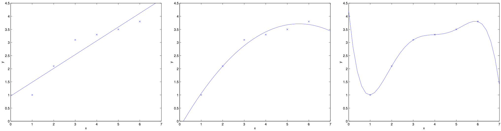

# 1.4 Locally weighted linear regression

Consider the problem of predicting $y$ from $x \in \mathbb{R}$. The leftmost figure below shows the result of fitting a $y = \theta_0 + \theta_1 x$ to a dataset. We see that the data doesn't really lie on a straight line, and so the fit is not very good.

## The Problem with Global Linear Models

In many real-world problems, the relationship between $x$ and $y$ is not strictly linear. For example, in predicting house prices, the effect of square footage on price may depend on the neighborhood or other local factors. A single global linear model may miss these local patterns, leading to poor predictions.

**Why global linear models fail:**
1. **Non-linear relationships**: The true relationship might be curved, not straight
2. **Local variations**: Different regions of the data might have different patterns
3. **Heterogeneous data**: The relationship might change across the feature space

**Examples where global linear models struggle:**
- **House prices**: Price per square foot varies by neighborhood
- **Temperature prediction**: Seasonal patterns create non-linear relationships
- **Economic data**: Relationships change over time or across regions
- **Biological data**: Dose-response curves are often non-linear

Locally weighted linear regression (LWR) addresses this by fitting a model that is tailored to the region around each query point. LWR is especially useful when the data shows local trends or nonlinearities, and when you have enough data to reliably fit local models. For instance, predicting house prices in different neighborhoods or modeling temperature as a function of time in different seasons are scenarios where LWR can excel.

## The Bias-Variance Trade-off in Model Complexity

Instead, if we had added an extra feature $x^2$, and fit $y = \theta_0 + \theta_1 x + \theta_2 x^2$, then we obtain a slightly better fit to the data (see middle figure). Naively, it might seem that the more features we add, the better. However, there is also a danger in adding too many features: The rightmost figure is the result of fitting a 5-th order polynomial $y = \sum_{j=0}^5 \theta_j x^j$. We see that even though the fitted curve passes through the data perfectly, we would not expect this to be a very good predictor of, say, housing prices ($y$) for different living areas ($x$).

### Understanding Model Complexity

**Underfitting (left figure):**
- **Problem**: Model is too simple to capture the data structure
- **Symptoms**: High bias, low variance
- **Solution**: Increase model complexity (add features, higher degree polynomials)

**Overfitting (right figure):**
- **Problem**: Model is too complex, fits noise in the data
- **Symptoms**: Low bias, high variance
- **Solution**: Decrease model complexity, add regularization, get more data

**Sweet spot (middle figure):**
- **Balance**: Captures true structure without fitting noise
- **Characteristics**: Moderate bias, moderate variance

Without formally defining what these terms mean, we'll say the figure on the left shows an instance of **underfitting**—in which the data clearly shows structure not captured by the model—and the figure on the right is an example of **overfitting**. (Later in this class, when we talk about learning theory we'll formalize some of these notions, and also define more carefully just what it means for a hypothesis to be good or bad.)

### The LWR Solution

LWR offers a compromise: it fits simple models, but only to local neighborhoods, allowing it to capture local structure without overfitting globally. Try plotting the data with a straight line, a high-degree polynomial, and an LWR fit to see the differences.

**Key insight**: Instead of choosing between simple (underfitting) and complex (overfitting) global models, fit simple models locally.

## The LWR Algorithm

As discussed previously, and as shown in the example above, the choice of features is important to ensuring good performance of a learning algorithm. (When we talk about model selection, we'll also see algorithms for automatically choosing a good set of features.) In this section, let us briefly talk about the locally weighted linear regression (LWR) algorithm which, assuming there is sufficient training data, makes the choice of features less critical. This treatment will be brief, since you'll get a chance to explore some of the properties of the LWR algorithm yourself in the homework.

### Comparison with Standard Linear Regression

In the original linear regression algorithm, to make a prediction at a query point $x$ (i.e., to evaluate $h(x)$ ), we would:

1. Fit $\theta$ to minimize $\sum_i (y^{(i)} - \theta^T x^{(i)})^2$.
2. Output $\theta^T x$.

**Key characteristics:**
- **Global fit**: Same $\theta$ for all predictions
- **One-time training**: Fit once, use everywhere
- **Memory efficient**: Only need to store $\theta$

In contrast, the locally weighted linear regression algorithm does the following:

1. Assigns a weight to each training example based on its distance to $x$.
2. Fits $\theta$ to minimize $\sum_i w^{(i)} (y^{(i)} - \theta^T x^{(i)})^2$.
3. Outputs $\theta^T x$.

**Key characteristics:**
- **Local fit**: Different $\theta$ for each query point
- **Per-query training**: Fit a new model for each prediction
- **Memory intensive**: Need to store all training data

### The Weighted Cost Function

The key innovation in LWR is the introduction of weights in the cost function:

$$J(\theta) = \sum_{i=1}^n w^{(i)} (y^{(i)} - \theta^T x^{(i)})^2$$

**Understanding the weights:**
- **$w^{(i)} > 0$**: How much we care about the $i$-th training example
- **$w^{(i)} \approx 1$**: This example strongly influences the fit
- **$w^{(i)} \approx 0$**: This example is ignored in the fit

**Intuition**: "Pay more attention to training examples that are close to where we want to make a prediction."

### The Weighted Normal Equations

The solution for $\theta$ (if $X$ is the design matrix and $W$ is a diagonal matrix of weights) is:

$$
\theta = (X^T W X)^{-1} X^T W y
$$

**Derivation:**
1. **Weighted cost function**: $J(\theta) = (X\theta - y)^T W (X\theta - y)$
2. **Gradient**: $\nabla_\theta J(\theta) = 2X^T W (X\theta - y)$
3. **Set to zero**: $X^T W X \theta = X^T W y$
4. **Solve**: $\theta = (X^T W X)^{-1} X^T W y$

**Understanding the formula:**
- **$X^T W X$**: Weighted Gram matrix (correlations weighted by importance)
- **$X^T W y$**: Weighted correlation between features and target
- **$(X^T W X)^{-1}$**: Inverse of weighted Gram matrix

### The Gaussian Kernel

Here, the $w^{(i)}$'s are non-negative valued **weights**. Intuitively, if $w^{(i)}$ is large for a particular value of $i$, then in picking $\theta$, we'll try hard to make $(y^{(i)} - \theta^T x^{(i)})^2$ small. If $w^{(i)}$ is small, then the $(y^{(i)} - \theta^T x^{(i)})^2$ error term will be pretty much ignored in the fit. The most common choice for the weights is the Gaussian kernel:

$$
w^{(i)} = \exp\left( -\frac{(x^{(i)} - x)^2}{2\tau^2} \right)
$$

### Understanding the Gaussian Kernel

**Properties of the Gaussian kernel:**
1. **Range**: $0 < w^{(i)} \leq 1$ (always positive, maximum at 1)
2. **Symmetry**: $w^{(i)}$ depends only on distance $|x^{(i)} - x|$
3. **Decay**: Weight decreases exponentially with distance
4. **Smoothness**: Continuous and differentiable

**Mathematical interpretation:**
- **At $x^{(i)} = x$**: $w^{(i)} = 1$ (maximum weight)
- **As $|x^{(i)} - x| \to \infty$**: $w^{(i)} \to 0$ (negligible weight)
- **At $|x^{(i)} - x| = \tau$**: $w^{(i)} = e^{-1/2} \approx 0.61$ (moderate weight)

### The Bandwidth Parameter

The parameter $\tau$ controls how quickly the weight of a training example falls off with distance of its $x^{(i)}$ from the query point $x$; $\tau$ is called the **bandwidth** parameter. Small $\tau$ means only very close points influence the fit (can lead to high variance), while large $\tau$ means many points influence the fit (can lead to high bias). Use cross-validation to find the value that gives the best predictive performance, and try several values to see the effect.

**Choosing the bandwidth $\tau$:**

**Small $\tau$ (narrow bandwidth):**
- **Pros**: Captures fine local structure
- **Cons**: High variance, sensitive to noise
- **Use when**: Data is smooth, lots of training data

**Large $\tau$ (wide bandwidth):**
- **Pros**: Stable, smooth predictions
- **Cons**: May miss local structure
- **Use when**: Data is noisy, limited training data

**Rule of thumb**: Start with $\tau$ equal to the standard deviation of the feature values, then tune via cross-validation.

### The LWR Prediction Process

Note that the weights depend on the particular point $x$ at which we're trying to evaluate $x$. Moreover, if $|x^{(i)} - x|$ is small, then $w^{(i)}$ is close to 1; and if $|x^{(i)} - x|$ is large, then $w^{(i)}$ is small. Hence, $\theta$ is chosen giving a much higher "weight" to the (errors on) training examples close to the query point $x$. (Note also that while the formula for the weights takes a form that is cosmetically similar to the density of a Gaussian distribution, the $w^{(i)}$'s do not directly have anything to do with Gaussians, and in particular the $w^{(i)}$'s are not random variables, normally distributed or otherwise.)

**Step-by-step prediction process:**
1. **For each query point $x$**:
   - Compute weights $w^{(i)}$ for all training examples
   - Fit weighted linear regression: $\theta = (X^T W X)^{-1} X^T W y$
   - Make prediction: $\hat{y} = \theta^T x$

**Computational complexity:**
- **Per prediction**: $O(nd^2 + d^3)$ where $n$ is number of training examples, $d$ is number of features
- **Total for $m$ predictions**: $O(m(nd^2 + d^3))$

## Parametric vs. Non-parametric Learning

Locally weighted linear regression is the first example we're seeing of a **non-parametric** algorithm. The (unweighted) linear regression algorithm that we saw earlier is known as a **parametric** learning algorithm, because it has a fixed, finite number of parameters (the $\theta_i$'s), which are fit to the data. Once we've fit the $\theta_i$'s and stored them away, we no longer need to keep the training data around to make future predictions. In contrast, to make predictions using locally weighted linear regression, we need to keep the entire training set around. The term "non-parametric" (roughly) refers to the fact that the amount of stuff we need to keep in order to represent the hypothesis $h$ grows linearly with the size of the training set.

### Understanding Parametric vs. Non-parametric

**Parametric algorithms:**
- **Fixed model form**: $h(x) = \theta^T x$ (linear regression)
- **Finite parameters**: $\theta_1, \theta_2, \ldots, \theta_d$
- **Memory efficient**: Only store parameters
- **Fast prediction**: $O(d)$ per prediction
- **Examples**: Linear regression, logistic regression, neural networks

**Non-parametric algorithms:**
- **Flexible model form**: Adapts to local data structure
- **Growing parameters**: Number of "parameters" grows with data
- **Memory intensive**: Need to store training data
- **Slower prediction**: $O(nd^2 + d^3)$ per prediction
- **Examples**: LWR, k-nearest neighbors, kernel methods

### The "Non-parametric" Misnomer

**Why the term is confusing:**
- Non-parametric methods DO have parameters (like $\tau$ in LWR)
- The key difference is that the number of "effective parameters" grows with data size
- In LWR, each training example contributes to the prediction

**Better terminology:**
- **Parametric**: Fixed model complexity
- **Non-parametric**: Model complexity grows with data

## Comparison Summary

To summarize the difference:

|                | Parametric (OLS)         | Non-parametric (LWR)         |
|----------------|-------------------------|------------------------------|
| Model form     | Fixed, global            | Flexible, local              |
| Memory usage   | Low (just $\theta$)      | High (need all data)         |
| Prediction     | Fast                     | Slow (fit per query)         |
| Flexibility    | Limited                  | High (adapts to local data)  |
| Training       | One-time                 | Per prediction               |
| Scalability    | Scales well              | Limited by data size         |

### When to Use Each Method

**Use parametric methods when:**
- Data size is large
- Prediction speed is critical
- Memory is limited
- Global patterns are expected
- Model interpretability is important

**Use non-parametric methods when:**
- Data size is moderate
- Local patterns are important
- Prediction accuracy is more important than speed
- You have enough memory
- The relationship is complex and non-linear

## Practical Considerations

Once $\theta$ is learned in OLS, you can discard the data. In LWR, you need the data to make predictions. LWR is powerful for capturing local structure, but can be slow and memory-intensive for large datasets. The bandwidth $\tau$ is a key hyperparameter: too small leads to overfitting, too large to underfitting. LWR works best in low dimensions; in high dimensions, distances become less meaningful (curse of dimensionality). Use LWR when you have enough data, expect local patterns, and prediction speed is not critical.

### The Curse of Dimensionality

**Problem**: In high dimensions, distances become less meaningful
- **Example**: In 100D space, most points are roughly equidistant
- **Effect**: LWR weights become uniform, losing local structure
- **Solution**: Feature selection, dimensionality reduction, or use parametric methods

### Computational Optimizations

**For large datasets:**
1. **Approximate nearest neighbors**: Use k-d trees or ball trees
2. **Subsampling**: Use a subset of training data for each prediction
3. **Parallelization**: Fit multiple local models in parallel
4. **Caching**: Cache results for nearby query points

### Alternative Weighting Schemes

**Gaussian kernel**: $w^{(i)} = \exp\left( -\frac{(x^{(i)} - x)^2}{2\tau^2} \right)$
**Epanechnikov kernel**: $w^{(i)} = \max(0, 1 - \frac{(x^{(i)} - x)^2}{\tau^2})$
**Tricube kernel**: $w^{(i)} = \max(0, (1 - |x^{(i)} - x|^3/\tau^3)^3)$
**Uniform kernel**: $w^{(i)} = 1$ if $|x^{(i)} - x| < \tau$, 0 otherwise

### Extensions and Variants

**Locally weighted polynomial regression**: Fit higher-degree polynomials locally
**Locally weighted logistic regression**: For classification problems
**Multi-output LWR**: Predict multiple targets simultaneously
**Adaptive bandwidth**: Let $\tau$ vary with data density

## Summary

Locally weighted linear regression provides a powerful way to capture local structure in data while maintaining the interpretability of linear models. It's particularly useful when:

1. **The relationship is non-linear** but locally linear
2. **You have sufficient data** to fit local models reliably
3. **Prediction accuracy** is more important than speed
4. **Local patterns** are important for your application

The key trade-offs are:
- **Flexibility vs. computational cost**
- **Local accuracy vs. global interpretability**
- **Memory usage vs. prediction quality**

LWR serves as a bridge between simple parametric methods and more complex non-linear approaches, offering a principled way to adapt linear models to non-linear data.

