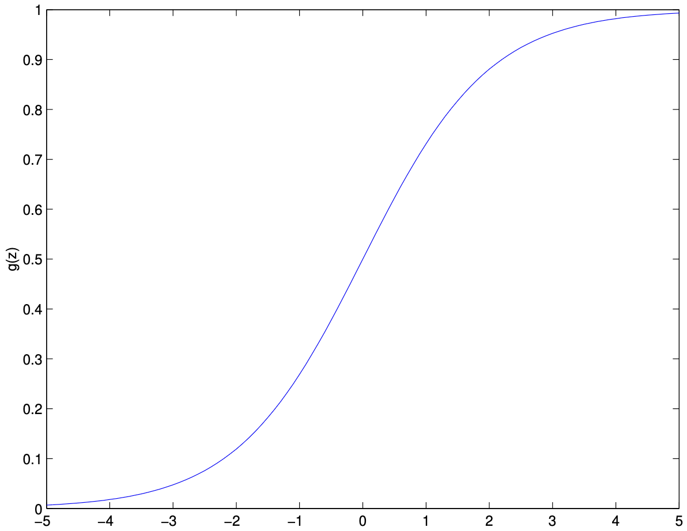

# Classification and Logistic Regression

## Introduction to Classification

Classification is a fundamental task in machine learning where the goal is to assign input data points to one of several predefined categories or classes. Unlike regression, where the output variable is continuous, classification deals with discrete outputs. In binary classification, there are only two possible classes, often labeled as 0 and 1 (or negative and positive). 

### Real-World Examples
- **Email spam detection:** Input features represent properties of an email (word frequency, sender information, etc.), output is 1 if spam, 0 if legitimate
- **Medical diagnosis:** Input features are patient symptoms and test results, output is 1 if disease present, 0 if healthy
- **Credit card fraud detection:** Input features are transaction characteristics, output is 1 if fraudulent, 0 if legitimate

The terms **negative class** and **positive class** are used to refer to these two categories, and the output variable is often called the **label** or **target variable**.

### Mathematical Framework
In binary classification, we have:
- **Input space:** $\mathcal{X} \subseteq \mathbb{R}^d$ (feature vectors)
- **Output space:** $\mathcal{Y} = \{0, 1\}$ (binary labels)
- **Training data:** $\{(x^{(1)}, y^{(1)}), (x^{(2)}, y^{(2)}), \ldots, (x^{(n)}, y^{(n)})\}$
- **Goal:** Learn a function $h: \mathcal{X} \rightarrow \mathcal{Y}$ that accurately predicts the class label

## 2.1 Logistic Regression

### Why Not Use Linear Regression for Classification?

At first glance, one might consider using linear regression for classification by thresholding its output. However, this approach has several fundamental problems:

#### Problem 1: Unbounded Outputs
Linear regression can produce predictions less than 0 or greater than 1:
- For $h_\theta(x) = \theta^T x$, if $\theta^T x = 2.5$, we get $h_\theta(x) = 2.5$
- If $\theta^T x = -1.2$, we get $h_\theta(x) = -1.2$
- These values don't make sense as probabilities, which must be between 0 and 1

#### Problem 2: Linear Relationship Assumption
Linear regression assumes a linear relationship between features and the target. However, the relationship between features and class probability is often nonlinear, especially when:
- Classes are not linearly separable
- The decision boundary is curved
- There are complex interactions between features

#### Problem 3: Sensitivity to Outliers
Linear regression is sensitive to outliers because it tries to minimize squared error. In classification, outliers can dramatically affect the decision boundary.

**Example:** Consider a dataset with mostly class 0 examples and a few extreme class 1 examples. Linear regression might predict negative values for many class 0 examples to accommodate the outliers.

### The Logistic (Sigmoid) Function

The **logistic function**, also known as the **sigmoid function**, solves these problems by providing a smooth, bounded mapping from real numbers to probabilities:

$$
g(z) = \frac{1}{1 + e^{-z}}
$$

#### Key Properties of the Sigmoid Function

1. **Bounded Output:** $0 < g(z) < 1$ for all $z \in \mathbb{R}$
2. **Symmetric around 0:** $g(-z) = 1 - g(z)$
3. **Monotonic:** $g'(z) > 0$ for all $z$ (always increasing)
4. **Smooth:** Infinitely differentiable
5. **Asymptotic Behavior:** 
   - As $z \to \infty$, $g(z) \to 1$
   - As $z \to -\infty$, $g(z) \to 0$

#### Intuitive Understanding

The sigmoid function transforms any real number into a probability:
- When $z = 0$, $g(0) = \frac{1}{1 + e^0} = \frac{1}{2} = 0.5$ (uncertainty)
- When $z$ is large positive, $g(z) \approx 1$ (high confidence in class 1)
- When $z$ is large negative, $g(z) \approx 0$ (high confidence in class 0)

#### Visual Interpretation

The S-shaped curve of the sigmoid function allows for:
- **Gradual transitions:** Small changes in input lead to small changes in probability near the center
- **Sharp decisions:** Large changes in input lead to small changes in probability near the extremes
- **Nonlinear modeling:** Can capture complex decision boundaries

### The Logistic Regression Model

In logistic regression, we model the probability that $y = 1$ given $x$ as:

$$
h_\theta(x) = g(\theta^T x) = \frac{1}{1 + e^{-\theta^T x}}
$$

where $\theta = [\theta_0, \theta_1, \ldots, \theta_d]^T$ is the parameter vector.

#### Parameter Interpretation

- **$\theta_0$ (intercept):** Controls the baseline probability when all features are zero
- **$\theta_j$ (feature weights):** Controls how much feature $j$ influences the probability
  - Positive $\theta_j$: Feature $j$ increases probability of class 1
  - Negative $\theta_j$: Feature $j$ decreases probability of class 1
  - Large $|\theta_j|$: Feature $j$ has strong influence
  - Small $|\theta_j|$: Feature $j$ has weak influence

#### Decision Boundary

The decision boundary is where $h_\theta(x) = 0.5$, which occurs when $\theta^T x = 0$:

$$
\theta_0 + \theta_1 x_1 + \theta_2 x_2 + \ldots + \theta_d x_d = 0
$$

This defines a hyperplane in the feature space that separates the two classes.

### Theoretical Justification: Generalized Linear Models

The choice of the logistic function is not arbitrary. It emerges naturally from the framework of **Generalized Linear Models (GLMs)**:

1. **Exponential Family:** The logistic function is the canonical link function for the Bernoulli distribution
2. **Maximum Entropy:** It maximizes entropy subject to the constraint that the expected value matches the data
3. **Convexity:** The resulting optimization problem is convex, ensuring global optimality

#### Alternative Functions

While other functions can map to [0,1], the logistic function has unique advantages:
- **Probit function:** $\Phi(z)$ (cumulative normal distribution) - similar properties but less computationally convenient
- **Tanh function:** $\tanh(z)$ - maps to [-1,1], requires rescaling
- **ReLU-based:** $\max(0, \min(1, z))$ - not smooth, harder to optimize

### Derivative of the Sigmoid Function

The derivative of the sigmoid function has an elegant form that greatly simplifies gradient computation:

$$
\begin{align*}
g'(z) &= \frac{d}{dz} \frac{1}{1 + e^{-z}} \\
      &= \frac{d}{dz} (1 + e^{-z})^{-1} \\
      &= -(1 + e^{-z})^{-2} \cdot (-e^{-z}) \\
      &= \frac{e^{-z}}{(1 + e^{-z})^2} \\
      &= \frac{1}{1 + e^{-z}} \cdot \frac{e^{-z}}{1 + e^{-z}} \\
      &= \frac{1}{1 + e^{-z}} \cdot \left(1 - \frac{1}{1 + e^{-z}}\right) \\
      &= g(z)(1 - g(z))
\end{align*}
$$

#### Why This Matters

This result is crucial because:
1. **Computational Efficiency:** We can compute the derivative using only the function value
2. **Numerical Stability:** Avoids computing exponentials twice
3. **Gradient Simplification:** Leads to simple gradient expressions in optimization

### Probabilistic Interpretation

Logistic regression provides a probabilistic framework for classification. We interpret the output as the probability that the label is 1 given the input features:

$$
\begin{align*}
P(y = 1 \mid x; \theta) &= h_\theta(x) = \frac{1}{1 + e^{-\theta^T x}} \\
P(y = 0 \mid x; \theta) &= 1 - h_\theta(x) = \frac{e^{-\theta^T x}}{1 + e^{-\theta^T x}}
\end{align*}
$$

#### Advantages of Probabilistic Interpretation

1. **Uncertainty Quantification:** We get not just predictions but confidence levels
2. **Statistical Framework:** Can use maximum likelihood estimation and Bayesian methods
3. **Calibration:** Probabilities can be calibrated to match true frequencies
4. **Decision Making:** Can incorporate costs/benefits of different decisions

#### Example: Medical Diagnosis

In medical diagnosis, knowing the probability is crucial:
- **High probability (0.9):** Strong evidence for disease, consider treatment
- **Medium probability (0.5):** Uncertain, order more tests
- **Low probability (0.1):** Likely healthy, but monitor

### Likelihood and Log-Likelihood

#### Likelihood Function

Given a dataset of $n$ independent training examples, the likelihood of the parameters $\theta$ is the probability of observing the data given the model:

$$
L(\theta) = \prod_{i=1}^n P(y^{(i)} \mid x^{(i)}; \theta)
$$

For logistic regression, this becomes:

$$
L(\theta) = \prod_{i=1}^n (h_\theta(x^{(i)}))^{y^{(i)}} (1 - h_\theta(x^{(i)}))^{1 - y^{(i)}}
$$

#### Intuitive Understanding

The likelihood measures how well our model explains the observed data:
- **High likelihood:** Model assigns high probability to observed outcomes
- **Low likelihood:** Model assigns low probability to observed outcomes
- **Perfect model:** Likelihood = 1 (assigns probability 1 to all observed outcomes)

#### Log-Likelihood

Maximizing the likelihood is equivalent to maximizing the log-likelihood:

$$
\ell(\theta) = \log L(\theta) = \sum_{i=1}^n y^{(i)} \log h_\theta(x^{(i)}) + (1 - y^{(i)}) \log(1 - h_\theta(x^{(i)}))
$$

#### Why Use Log-Likelihood?

1. **Numerical Stability:** Products of small numbers can underflow, sums don't
2. **Mathematical Convenience:** Derivatives of sums are easier than derivatives of products
3. **Connection to Information Theory:** Related to cross-entropy and KL divergence

#### Example Calculation

Consider a single example with $x = [1, 2]$, $y = 1$, and $\theta = [0.5, 0.3]$:
- $h_\theta(x) = \frac{1}{1 + e^{-(0.5 + 0.3 \cdot 2)}} = \frac{1}{1 + e^{-1.1}} \approx 0.75$
- Contribution to log-likelihood: $1 \cdot \log(0.75) + 0 \cdot \log(0.25) = \log(0.75) \approx -0.29$

### Gradient Ascent for Logistic Regression

#### Optimization Objective

We want to find the parameters $\theta$ that maximize the log-likelihood:

$$
\theta^* = \arg\max_\theta \ell(\theta)
$$

Since we're maximizing (not minimizing), we use **gradient ascent**:

$$
\theta_j := \theta_j + \alpha \frac{\partial}{\partial \theta_j} \ell(\theta)
$$

where $\alpha$ is the learning rate.

#### Gradient Derivation

For a single training example, the gradient is:

$$
\begin{align*}
\frac{\partial}{\partial \theta_j} \ell(\theta) &= \frac{\partial}{\partial \theta_j} \left[y \log h_\theta(x) + (1 - y) \log(1 - h_\theta(x))\right] \\
&= y \frac{1}{h_\theta(x)} \frac{\partial h_\theta(x)}{\partial \theta_j} + (1 - y) \frac{1}{1 - h_\theta(x)} \frac{\partial (1 - h_\theta(x))}{\partial \theta_j} \\
&= y \frac{1}{h_\theta(x)} h_\theta(x)(1 - h_\theta(x))x_j + (1 - y) \frac{1}{1 - h_\theta(x)} (-h_\theta(x)(1 - h_\theta(x))x_j) \\
&= y(1 - h_\theta(x))x_j - (1 - y)h_\theta(x)x_j \\
&= (y - h_\theta(x))x_j
\end{align*}
$$

#### Intuitive Understanding

The gradient $(y - h_\theta(x))x_j$ has a clear interpretation:
- **$y - h_\theta(x)$:** Prediction error (how far off our prediction is)
- **$x_j$:** Feature value (how much this feature contributes)
- **Positive gradient:** Increase $\theta_j$ to improve prediction
- **Negative gradient:** Decrease $\theta_j$ to improve prediction

#### Stochastic Gradient Ascent

For large datasets, we can use stochastic gradient ascent, updating parameters after each example:

$$
\theta_j := \theta_j + \alpha \left(y^{(i)} - h_\theta(x^{(i)})\right)x_j^{(i)}
$$

#### Comparison with Linear Regression

Interestingly, the update rule looks identical to linear regression's LMS rule, but with different $h_\theta(x)$:
- **Linear regression:** $h_\theta(x) = \theta^T x$ (linear)
- **Logistic regression:** $h_\theta(x) = \frac{1}{1 + e^{-\theta^T x}}$ (nonlinear)

This similarity is not coincidental - it emerges from the mathematical structure of both models.

### The Logistic Loss and Logit

#### Logistic Loss Function

The **logistic loss** (or log-loss) is another way to express the cost function:

$$
\ell_{\text{logistic}}(t, y) = y \log(1 + \exp(-t)) + (1 - y) \log(1 + \exp(t))
$$

where $t = \theta^T x$ is called the **logit**.

#### Properties of Logistic Loss

1. **Convex:** Has a unique global minimum
2. **Smooth:** Infinitely differentiable
3. **Well-behaved:** No exploding gradients
4. **Calibrated:** Minimizing it leads to well-calibrated probabilities

#### Logit Interpretation

The logit $t = \theta^T x$ represents the "raw score" before applying the sigmoid:
- **Large positive logit:** High confidence in class 1
- **Large negative logit:** High confidence in class 0
- **Logit near 0:** Uncertainty

#### Connection to Log-Likelihood

The negative log-likelihood equals the logistic loss:

$$
-\ell(\theta) = \ell_{\text{logistic}}(\theta^T x, y)
$$

This shows that minimizing logistic loss is equivalent to maximizing log-likelihood.

#### Gradient of Logistic Loss

$$
\frac{\partial \ell_{\text{logistic}}(t, y)}{\partial t} = \frac{1}{1 + \exp(-t)} - y = h_\theta(x) - y
$$

This leads to the same gradient update as before, confirming the equivalence.

### Practical Considerations

#### Feature Scaling

Logistic regression is sensitive to feature scales:
- **Large features:** Can dominate the decision boundary
- **Small features:** May be ignored
- **Solution:** Standardize features to have mean 0 and variance 1

#### Regularization

To prevent overfitting, add regularization terms:
- **L2 regularization:** $\lambda \sum_{j=1}^d \theta_j^2$
- **L1 regularization:** $\lambda \sum_{j=1}^d |\theta_j|$
- **Elastic net:** Combination of L1 and L2

#### Convergence

Gradient ascent typically converges in 10-100 iterations:
- **Small learning rate:** Slower but more stable convergence
- **Large learning rate:** Faster but may oscillate
- **Adaptive learning rate:** Best of both worlds

#### Initialization

- **Zero initialization:** $\theta = 0$ works well
- **Random initialization:** Can help break symmetry in some cases
- **Warm start:** Use previous solution as starting point

### Summary and Further Reading

Logistic regression is a foundational algorithm for binary classification that combines ideas from linear models, probability theory, and optimization. Its probabilistic interpretation makes it a natural choice for many applications, and its loss function and gradient have elegant mathematical properties.

#### Key Takeaways

1. **Probabilistic Framework:** Outputs interpretable probabilities
2. **Convex Optimization:** Guaranteed to find global optimum
3. **Efficient Training:** Simple gradient-based updates
4. **Theoretical Foundation:** Well-grounded in statistics and GLMs
5. **Practical Versatility:** Works well in many real-world applications

#### Advanced Topics

For more advanced topics, see:
- **Regularization:** Preventing overfitting
- **Multiclass classification:** Extending to multiple classes
- **Generalized Linear Models:** Theoretical framework
- **Bayesian logistic regression:** Incorporating prior knowledge
- **Online learning:** Updating models with streaming data

