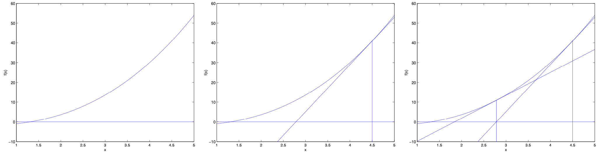

## 2.4 Newton's Method: Advanced Optimization for Logistic Regression

### Introduction and Motivation

Returning to logistic regression with $g(z)$ being the sigmoid function, let's now explore a different algorithm for maximizing the log-likelihood $\ell(\theta)$. While gradient ascent is simple and effective, Newton's method offers superior convergence properties in many cases.

## From First-Order to Second-Order Optimization

Throughout our exploration of classification methods - from binary logistic regression to multi-class softmax regression - we've relied on **gradient ascent** to find the optimal parameters. This first-order optimization method uses only gradient information to make parameter updates, which is simple and effective but has limitations.

Gradient methods can be slow to converge, requiring many iterations to reach high precision. They're also sensitive to the learning rate choice - too small and convergence is slow, too large and the algorithm may oscillate or diverge. Most importantly, gradient methods don't take advantage of the **curvature information** available in our models.

This motivates our exploration of **Newton's method**, a second-order optimization technique that uses both gradient and curvature (Hessian) information to make more informed parameter updates. Newton's method can achieve **quadratic convergence** - meaning the number of correct digits doubles with each iteration - which is dramatically faster than the linear convergence of gradient methods.

The transition from first-order to second-order optimization represents a natural progression in our understanding of machine learning optimization, moving from simple gradient methods to more sophisticated techniques that leverage the mathematical structure of our problems.

#### Why Newton's Method?

Gradient ascent has some limitations:
- **Linear convergence:** May require many iterations to reach high precision
- **Fixed step size:** Learning rate must be carefully tuned
- **No curvature information:** Doesn't account for the local geometry of the function

Newton's method addresses these issues by using second-order information (curvature) to make more informed updates.

### 1. Newton's Method: Intuition and Geometric Interpretation

#### Root Finding Problem

To understand Newton's method, let's start with the simpler problem of finding a zero of a function. Specifically, suppose we have some function $f : \mathbb{R} \mapsto \mathbb{R}$, and we wish to find a value of $\theta$ so that $f(\theta) = 0$. Here, $\theta \in \mathbb{R}$ is a real number.

Newton's method performs the following update:

$$
\theta := \theta - \frac{f(\theta)}{f'(\theta)}
$$

#### Geometric Intuition

**Step-by-step visualization:**

1. **Current Point:** Start at some initial guess $\theta$
2. **Tangent Line:** Draw the tangent line to $f$ at the current point
3. **Root of Tangent:** Find where this tangent line crosses the $x$-axis
4. **Next Guess:** Use this intersection point as the next guess

**Why this works:**
- The tangent line provides a linear approximation to $f$ near the current point
- If $f$ is well-behaved, the root of the tangent line is closer to the true root than the current guess
- Iterating this process converges to the true root

#### Visual Example

Here's a picture of Newton's method in action:



**Step-by-step breakdown:**
- **Leftmost figure:** We see the function $f$ plotted along with the line $y = 0$. We're trying to find $\theta$ so that $f(\theta) = 0$; the value of $\theta$ that achieves this is about $1.3$.
- **Middle figure:** Suppose we initialized the algorithm with $\theta = 4.5$. Newton's method then fits a straight line tangent to $f$ at $\theta = 4.5$, and solves for where that line evaluates to $0$. This gives us the next guess for $\theta$, which is about $2.8$.
- **Rightmost figure:** The result of running one more iteration, which then updates $\theta$ to about $1.8$. After a few more iterations, we rapidly approach $\theta = 1.3$.

#### Mathematical Derivation

The tangent line to $f$ at $\theta$ has equation:
$$
y = f(\theta) + f'(\theta)(x - \theta)
$$

Setting $y = 0$ and solving for $x$:
$$
0 = f(\theta) + f'(\theta)(x - \theta) \implies x = \theta - \frac{f(\theta)}{f'(\theta)}
$$

This gives us the Newton update rule.

### 2. Newton's Method for Maximization

#### From Root Finding to Optimization

Newton's method gives us a way of getting to $f(\theta) = 0$. What if we want to use it to maximize some function $\ell$?

The maxima of $\ell$ correspond to points where its first derivative $\ell'(\theta)$ is zero. So, by letting $f(\theta) = \ell'(\theta)$, we can use the same algorithm to maximize $\ell$, and we obtain the update rule:

$$
\theta := \theta - \frac{\ell'(\theta)}{\ell''(\theta)}
$$

#### Intuitive Understanding

- **$\ell'(\theta)$:** Gradient (slope) - tells us direction to move
- **$\ell''(\theta)$:** Second derivative (curvature) - tells us how far to move
- **Large curvature:** Small step (function changes rapidly)
- **Small curvature:** Large step (function changes slowly)

#### Example: Maximizing a Quadratic Function

Consider $\ell(\theta) = -(\theta - 3)^2 + 10$:
- $\ell'(\theta) = -2(\theta - 3)$
- $\ell''(\theta) = -2$

Newton update: $\theta := \theta - \frac{-2(\theta - 3)}{-2} = \theta + (\theta - 3) = 2\theta - 3$

Starting from $\theta = 0$:
- Iteration 1: $\theta = 2(0) - 3 = -3$
- Iteration 2: $\theta = 2(-3) - 3 = -9$
- Iteration 3: $\theta = 2(-9) - 3 = -21$

**Problem:** The function is concave ($\ell''(\theta) < 0$), so we're moving away from the maximum!

**Solution:** For maximization, we need $\ell''(\theta) < 0$ (concavity). For minimization, we need $\ell''(\theta) > 0$ (convexity).

> **Something to think about:** How would this change if we wanted to use Newton's method to minimize rather than maximize a function?

**Answer:** For minimization, the update is the same, but you want to ensure you are moving towards a minimum (where the second derivative is positive). In practice, the sign of the denominator (the curvature) determines whether you are at a minimum or maximum.

### 3. Advantages and Disadvantages of Newton's Method

#### Advantages

1. **Quadratic Convergence:** Near the optimum, the number of correct digits approximately doubles with each iteration
2. **Curvature-Aware:** Automatically adapts step size based on local geometry
3. **Fewer Iterations:** Often requires 5-10 iterations vs. 100-1000 for gradient descent
4. **No Learning Rate:** No need to tune step size parameters
5. **Theoretical Guarantees:** Well-understood convergence properties

#### Disadvantages

1. **Computational Cost:** Each iteration requires computing and inverting the Hessian matrix
2. **Memory Requirements:** Must store the full Hessian matrix ($O(d^2)$ memory)
3. **Global Convergence:** Not guaranteed to converge from arbitrary starting points
4. **Hessian Invertibility:** Requires the Hessian to be positive definite
5. **Numerical Issues:** Can be sensitive to ill-conditioned Hessians

#### When to Use Newton's Method

**Use Newton's method when:**
- Number of parameters is moderate ($d < 1000$)
- High precision is required
- Second derivatives are easy to compute
- Good initial guess is available
- Computational resources allow Hessian computation

**Use gradient descent when:**
- Number of parameters is large ($d > 1000$)
- Rough approximation is sufficient
- Computational resources are limited
- Starting point is far from optimum

### 4. Multidimensional Newton's Method and the Hessian

#### Vector-Valued Parameters

In our logistic regression setting, $\theta$ is vector-valued, so we need to generalize Newton's method to this setting. The generalization of Newton's method to this multidimensional setting (also called the Newton-Raphson method) is given by:

$$
\theta := \theta - H^{-1} \nabla_\theta \ell(\theta)
$$

Here, $\nabla_\theta \ell(\theta)$ is, as usual, the vector of partial derivatives of $\ell(\theta)$ with respect to the $\theta_i$'s; and $H$ is an $d$-by-$d$ matrix (actually, $d+1$-by-$d+1$, assuming that we include the intercept term) called the **Hessian**, whose entries are given by:

$$
H_{ij} = \frac{\partial^2 \ell(\theta)}{\partial \theta_i \partial \theta_j}
$$

#### Hessian Matrix Structure

For logistic regression, the Hessian has a special structure:

$$
H = -X^T D X
$$

where:
- $X$ is the design matrix (features)
- $D$ is a diagonal matrix with $D_{ii} = h_\theta(x^{(i)})(1 - h_\theta(x^{(i)}))$

#### Intuition for the Hessian

The Hessian captures the local curvature of the function:
- **Positive definite Hessian:** Function is locally convex (bowl-shaped)
- **Negative definite Hessian:** Function is locally concave (inverted bowl)
- **Singular Hessian:** Function is flat in some direction

In logistic regression, the Hessian is typically positive semi-definite, ensuring stable updates.

#### Geometric Interpretation in Higher Dimensions

In higher dimensions, Newton's method:
1. **Approximates** the function by a quadratic surface
2. **Finds** the minimum of this quadratic approximation
3. **Moves** to this minimum
4. **Repeats** until convergence

The quadratic approximation is:

$$
\ell(\theta + \Delta\theta) \approx \ell(\theta) + \nabla_\theta \ell(\theta)^T \Delta\theta + \frac{1}{2} \Delta\theta^T H \Delta\theta
$$

Setting the gradient to zero gives the Newton step.

### 5. Practical Tips and Fisher Scoring

#### Computational Considerations

Newton's method typically enjoys faster convergence than (batch) gradient descent, and requires many fewer iterations to get very close to the minimum. One iteration of Newton's can, however, be more expensive than one iteration of gradient descent, since it requires finding and inverting an `d-by-d` Hessian; but so long as $d$ is not too large, it is usually much faster overall.

#### When to Use Newton's Method

- **Moderate dimensionality:** When the number of parameters is moderate (so the Hessian is not too large to invert)
- **High precision:** When you need fast, high-precision convergence
- **Easy second derivatives:** When second derivatives are easy to compute (as in logistic regression)
- **Good initialization:** When you have a reasonable starting point

#### Regularization and Numerical Stability

**Hessian regularization:** Adding a small multiple of the identity matrix to the Hessian (i.e., $H + \lambda I$) can help if the Hessian is nearly singular:

$$
\theta := \theta - (H + \lambda I)^{-1} \nabla_\theta \ell(\theta)
$$

This is called **Levenberg-Marquardt regularization** or **damped Newton's method**.

**Benefits:**
- Prevents numerical issues with singular Hessians
- Provides interpolation between Newton's method and gradient descent
- Improves global convergence properties

#### Fisher Scoring

When Newton's method is applied to maximize the logistic regression log likelihood function $\ell(\theta)$, the resulting method is also called **Fisher scoring**. In Fisher scoring, the Hessian is replaced by its expected value (the Fisher information matrix), which can improve stability.

**Fisher information matrix:**
$$
I(\theta) = \mathbb{E}[H(\theta)] = X^T \text{diag}(h_\theta(x^{(i)})(1 - h_\theta(x^{(i)}))) X
$$

**Fisher scoring update:**
$$
\theta := \theta + I(\theta)^{-1} \nabla_\theta \ell(\theta)
$$

**Advantages of Fisher scoring:**
- More stable than Newton's method
- Better theoretical properties
- Often converges more reliably

### 6. Newton's Method vs. Gradient Descent: Detailed Comparison

#### Convergence Rates

| Method | Convergence Rate | Iterations Needed |
|--------|------------------|-------------------|
| **Gradient Descent** | Linear | $O(\log(1/\epsilon))$ |
| **Newton's Method** | Quadratic | $O(\log\log(1/\epsilon))$ |

**Example:** To achieve error $\epsilon = 10^{-6}$:
- Gradient descent: ~14 iterations
- Newton's method: ~3 iterations

#### Computational Complexity

| Method | Per-Iteration Cost | Memory Requirements |
|--------|-------------------|-------------------|
| **Gradient Descent** | $O(nd)$ | $O(d)$ |
| **Newton's Method** | $O(nd^2 + d^3)$ | $O(d^2)$ |

**Breakdown for Newton's method:**
- Compute gradient: $O(nd)$
- Compute Hessian: $O(nd^2)$
- Invert Hessian: $O(d^3)$
- Total: $O(nd^2 + d^3)$

#### Step Size Behavior

| Method | Step Size | Adaptation |
|--------|-----------|------------|
| **Gradient Descent** | Fixed or scheduled | Manual tuning required |
| **Newton's Method** | Adaptive | Automatic based on curvature |

#### Robustness

| Method | Global Convergence | Sensitivity to Initialization |
|--------|-------------------|------------------------------|
| **Gradient Descent** | More robust | Less sensitive |
| **Newton's Method** | Not guaranteed | More sensitive |

### 7. Implementation Considerations

#### Hessian Computation

For logistic regression, the Hessian can be computed efficiently:

```python
def hessian(theta, X):
    h = sigmoid(X @ theta)
    D = np.diag(h * (1 - h))
    return -X.T @ D @ X
```

#### Hessian Inversion

Instead of explicitly inverting the Hessian, solve the linear system:

```python
# Instead of: delta = np.linalg.inv(H) @ grad
delta = np.linalg.solve(H, grad)
```

This is more numerically stable and computationally efficient.

#### Line Search

For better global convergence, combine Newton's method with line search:

```python
def newton_with_line_search(theta, X, y, max_iter=20):
    for i in range(max_iter):
        grad = gradient(theta, X, y)
        H = hessian(theta, X)
        delta = np.linalg.solve(H, grad)
        
        # Line search for step size
        alpha = 1.0
        while alpha > 1e-10:
            theta_new = theta - alpha * delta
            if log_likelihood(theta_new, X, y) > log_likelihood(theta, X, y):
                theta = theta_new
                break
            alpha *= 0.5
```

#### Stopping Criteria

Common stopping criteria for Newton's method:
1. **Gradient norm:** $\|\nabla_\theta \ell(\theta)\| < \epsilon$
2. **Parameter change:** $\|\theta^{(t+1)} - \theta^{(t)}\| < \epsilon$
3. **Function change:** $|\ell(\theta^{(t+1)}) - \ell(\theta^{(t)})| < \epsilon$
4. **Maximum iterations:** Stop after $T$ iterations

### 8. Advanced Topics

#### Quasi-Newton Methods

Quasi-Newton methods approximate the Hessian without computing second derivatives:

**BFGS (Broyden-Fletcher-Goldfarb-Shanno):**
- Updates Hessian approximation using gradient differences
- Maintains positive definiteness
- Good balance of efficiency and robustness

**L-BFGS (Limited Memory BFGS):**
- Stores only a few vectors instead of full Hessian
- Memory efficient for high-dimensional problems
- Widely used in practice

#### Stochastic Newton's Method

For large datasets, use stochastic approximations:

**Stochastic Hessian:** Use a subset of data to estimate Hessian
**Stochastic Gradient:** Use a subset of data to estimate gradient

#### Second-Order Stochastic Methods

Modern methods combine the benefits of Newton's method with stochastic optimization:

- **AdaHessian:** Adaptive learning rates based on Hessian estimates
- **Shampoo:** Block-diagonal Hessian approximations
- **K-FAC:** Kronecker-factored approximate curvature

### Summary

Newton's method is a powerful optimization technique that leverages curvature information for rapid convergence, especially in problems like logistic regression where the Hessian is tractable. However, its computational cost can be prohibitive for very high-dimensional problems, where gradient descent or quasi-Newton methods (like BFGS) may be preferable.

#### Key Takeaways

1. **Quadratic Convergence:** Extremely fast convergence near the optimum
2. **Curvature Information:** Uses second derivatives for better step sizes
3. **Computational Trade-offs:** Higher per-iteration cost but fewer iterations
4. **Numerical Stability:** Requires careful implementation for robustness
5. **Dimensionality Limits:** Best for moderate-dimensional problems

#### When to Choose Newton's Method

**Choose Newton's method when:**
- High precision is required
- Number of parameters is moderate ($d < 1000$)
- Second derivatives are available
- Good initialization is available
- Computational resources allow Hessian computation

**Choose gradient descent when:**
- Rough approximation is sufficient
- Number of parameters is large ($d > 1000$)
- Computational resources are limited
- Starting point is far from optimum

#### Advanced Applications

Newton's method forms the foundation for many advanced optimization techniques:
- **Interior point methods** for constrained optimization
- **Trust region methods** for global convergence
- **Sequential quadratic programming** for nonlinear programming
- **Natural gradient descent** in information geometry

The principles learned from Newton's method continue to influence modern optimization algorithms in machine learning and beyond.

---

**Previous: [Multi-class Classification](03_multi-class_classification.md)** - Extend binary classification to multiple classes using softmax and cross-entropy.

**Next: [Hands-on Coding](05_hands-on_coding.md)** - Apply the classification concepts learned through practical coding exercises and implementations.

## From Theory to Practice: Hands-On Implementation

We've now completed a comprehensive theoretical journey through classification methods, from the probabilistic foundations of logistic regression to the geometric insights of the perceptron, from multi-class classification with softmax to advanced optimization with Newton's method. These theoretical concepts provide the foundation for understanding classification algorithms, but true mastery comes from **hands-on implementation**.

The transition from theory to practice is crucial in machine learning. While understanding the mathematical foundations is essential, implementing these algorithms helps develop intuition, reveals practical challenges, and builds the skills needed for real-world applications. Coding these algorithms from scratch forces us to confront the details that theory often abstracts away.

In the next section, we'll put our theoretical knowledge into practice through hands-on coding exercises. We'll implement each algorithm we've studied, experiment with real datasets, and develop the practical skills needed to apply these methods to real-world classification problems.

This hands-on approach will solidify our understanding and prepare us for the complex challenges that arise when applying machine learning in practice.