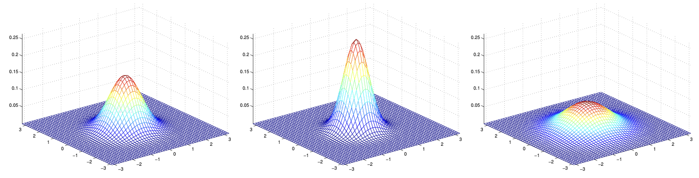
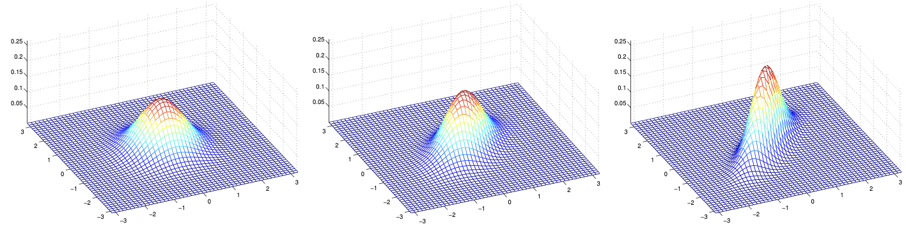
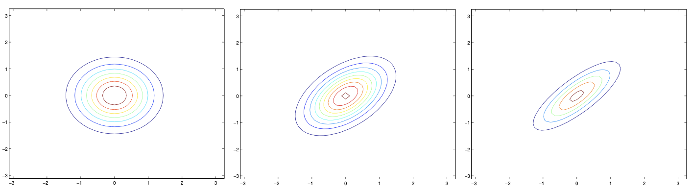
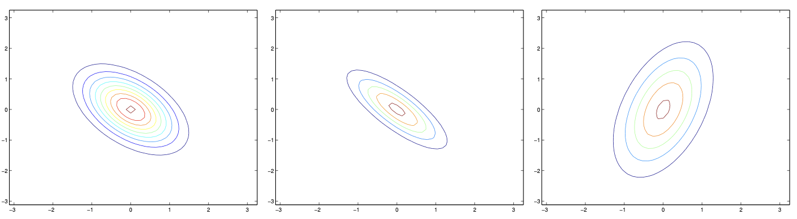
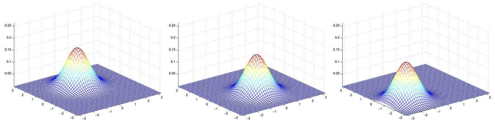
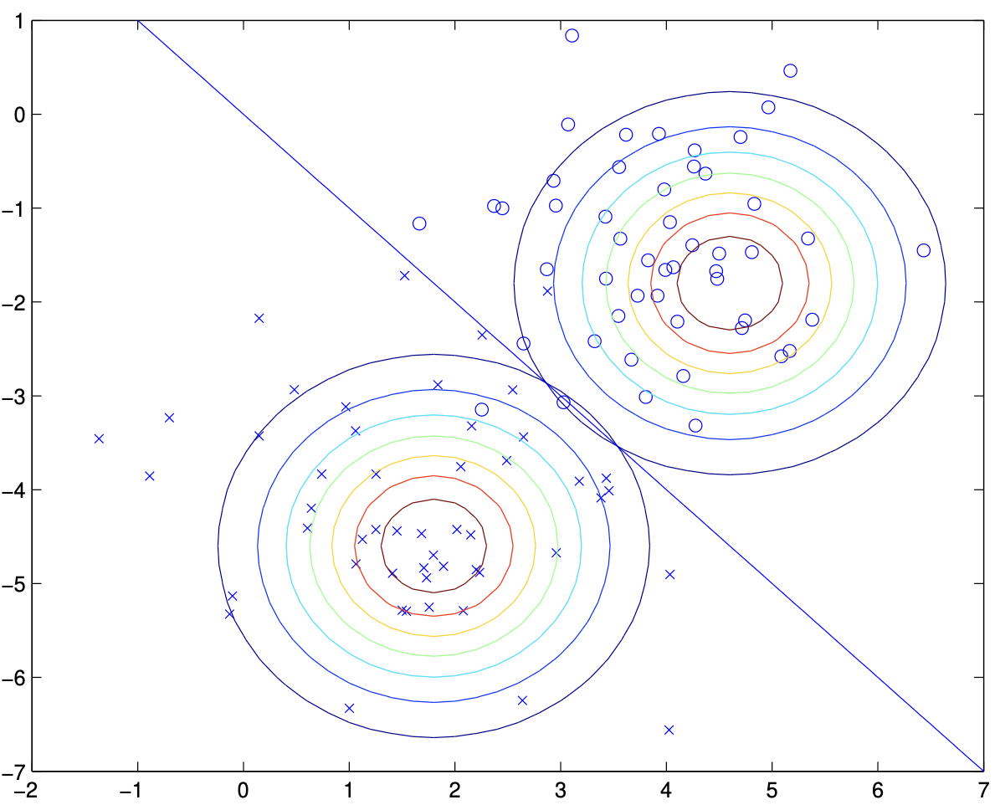

# Generative learning algorithms

So far, we've mainly been talking about learning algorithms that model
```math
p(y|x; \theta)
```
the conditional distribution of $y$ given $x$. For instance, logistic regression modeled $p(y|x; \theta)$ as $h_\theta(x) = g(\theta^T x)$ where $g$ is the sigmoid function. In these notes, we'll talk about a different type of learning algorithm.

**Discriminative vs. Generative Models**

- **Discriminative models** (like logistic regression, SVMs, neural networks) learn the boundary between classes by modeling $p(y|x)$ directly or learning a function $f(x)$ that maps inputs to labels. They focus on distinguishing between classes, often leading to better performance when model assumptions are not strictly met.
- **Generative models** (like Naive Bayes, GDA) model how the data is generated for each class by learning $p(x|y)$ and $p(y)$. This allows them to simulate or generate new data points, and they can be used for unsupervised tasks (e.g., clustering, anomaly detection) because they model the full data distribution, not just the boundary.
- **Intuition:** Generative models answer "How likely is this data under each class?" Discriminative models answer "Which class is more likely for this data?"

Consider a classification problem in which we want to learn to distinguish between elephants ($y = 1$) and dogs ($y = 0$), based on some features of an animal. Given a training set, an algorithm like logistic regression or the perceptron algorithm (basically) tries to find a straight line—that is, a decision boundary—that separates the elephants and dogs. Then, to classify a new animal as either an elephant or a dog, it checks on which side of the decision boundary it falls, and makes its prediction accordingly.

Here's a different approach. First, looking at elephants, we can build a model of what elephants look like. Then, looking at dogs, we can build a separate model of what dogs look like. Finally, to classify a new animal, we can match the new animal against the elephant model, and match it against the dog model, to see whether the new animal looks more like the elephants or more like the dogs we had seen in the training set.

Algorithms that try to learn $p(y|x)$ directly (such as logistic regression), or algorithms that try to learn mappings directly from the space of inputs $\mathcal{X}$ to the labels $\{0, 1\}$, (such as the perceptron algorithm) are called **discriminative** learning algorithms. Here, we'll talk about algorithms that instead try to model $p(x|y)$ (and $p(y)$). These algorithms are called **generative** learning algorithms. For instance, if $y$ indicates whether an example is a dog (0) or an elephant (1), then $p(x|y=0)$ models the distribution of dogs' features, and $p(x|y=1)$ models the distribution of elephants' features.

After modeling $p(y)$ (called the **class priors**) and $p(x|y)$, our algorithm can then use Bayes rule to derive the posterior distribution on $y$ given $x$:

```math
p(y|x) = \frac{p(x|y)p(y)}{p(x)}
```

**Bayes Rule and Decision Theory**

- **Interpretation:** Bayes rule allows us to update our beliefs about the class label $y$ after observing data $x$, combining prior knowledge ($p(y)$) and the likelihood ($p(x|y)$).
- **Decision Theory:** In practice, we often care about minimizing classification error, so we choose the class with the highest posterior probability (MAP decision rule):

```math
\arg\max_y p(y|x) = \arg\max_y p(x|y)p(y)
```

**Python: Bayes Rule for Posterior**
```python
import numpy as np

def bayes_posterior(px_y, py, px):
    # px_y: likelihood p(x|y) for each class (array)
    # py: prior p(y) for each class (array)
    # px: evidence p(x) (scalar or array)
    return (px_y * py) / px
```

## 4.1 Gaussian discriminant analysis

The first generative learning algorithm that we'll look at is Gaussian discriminant analysis (GDA). In this model, we'll assume that $p(x|y)$ is distributed according to a multivariate normal distribution. Let's talk briefly about the properties of multivariate normal distributions before moving on to the GDA model itself.

### 4.1.1 The multivariate normal distribution

The multivariate normal distribution in $d$-dimensions, also called the multivariate Gaussian distribution, is parameterized by a **mean vector** $\mu \in \mathbb{R}^d$ and a **covariance matrix** $\Sigma \in \mathbb{R}^{d \times d}$, where $\Sigma \geq 0$ is symmetric and positive semi-definite. Also written "$\mathcal{N}(\mu, \Sigma)$", its density is given by:

```math
p(x; \mu, \Sigma) = \frac{1}{(2\pi)^{d/2} |\Sigma|^{1/2}} \exp\left( -\frac{1}{2} (x-\mu)^T \Sigma^{-1} (x-\mu) \right)
```

In the equation above, "|\Sigma|" denotes the determinant of the matrix $\Sigma$.

For a random variable $X$ distributed $\mathcal{N}(\mu, \Sigma)$, the mean is (unsurprisingly) given by $\mu$:

```math
\mathbb{E}[X] = \int_x x\, p(x; \mu, \Sigma) dx = \mu
```

The **covariance** of a vector-valued random variable $Z$ is defined as $\mathrm{Cov}(Z) = \mathbb{E}[(Z - \mathbb{E}[Z])(Z - \mathbb{E}[Z])^T]$. This generalizes the notion of the variance of a real-valued random variable. The covariance can also be defined as $\mathrm{Cov}(Z) = \mathbb{E}[ZZ^T] - (\mathbb{E}[Z])(\mathbb{E}[Z])^T$. (You should be able to prove to yourself that these two definitions are equivalent.) If $X \sim \mathcal{N}(\mu, \Sigma)$, then

```math
\mathrm{Cov}(X) = \Sigma.
```

**Geometric Interpretation:**
- The mean $\mu$ is the center of the distribution.
- The covariance $\Sigma$ determines the shape, orientation, and spread. The eigenvectors of $\Sigma$ give the principal axes of the ellipsoid, and the eigenvalues determine their lengths.
- If $\Sigma$ is diagonal, the features are uncorrelated; if $\Sigma = \sigma^2 I$, the distribution is spherical.

Here are some examples of what the density of a Gaussian distribution looks like:



The left-most figure shows a Gaussian with mean zero (that is, the 2x1 zero-vector) and covariance matrix $\Sigma = I$ (the 2x2 identity matrix). A Gaussian with zero mean and identity covariance is also called the **standard normal distribution**. The middle figure shows the density of a Gaussian with zero mean and $\Sigma = 0.6I$; and the rightmost figure shows one with $\Sigma = 2I$. We see that as $\Sigma$ becomes larger, the Gaussian becomes more "spread-out," and as it becomes smaller, the distribution becomes more "compressed."

Let's look at some more examples.



The figures above show Gaussians with mean 0, and with covariance matrices respectively

```math
\Sigma = \begin{bmatrix} 1 & 0 \\ 0 & 1 \end{bmatrix} ; \quad
\Sigma = \begin{bmatrix} 1 & 0.5 \\ 0.5 & 1 \end{bmatrix} ; \quad
\Sigma = \begin{bmatrix} 1 & 0.8 \\ 0.8 & 1 \end{bmatrix} .
```

The leftmost figure shows the familiar standard normal distribution, and we see that as we increase the off-diagonal entry in $\Sigma$, the density becomes more "compressed" towards the $45^\circ$ line (given by $x_1 = x_2$). We can see this more clearly when we look at the contours of the same three densities:



**Visual Intuition:**
- The shape and orientation of the contours reflect the covariance structure. When the means are far apart and the covariance is small, the classes are easily separable.
- In GDA, the boundary is linear (for shared covariance) or quadratic (for class-specific covariance). In logistic regression, the boundary is always linear.

Here's one last set of examples generated by varying $\Sigma$:



The plots above used, respectively,

```math
\Sigma = \begin{bmatrix} 1 & -0.5 \\ -0.5 & 1 \end{bmatrix} ; \quad
\Sigma = \begin{bmatrix} 1 & -0.8 \\ -0.8 & 1 \end{bmatrix} ; \quad
\Sigma = \begin{bmatrix} 3 & 0.8 \\ 0.8 & 1 \end{bmatrix} .
```

From the leftmost and middle figures, we see that by decreasing the off-diagonal elements of the covariance matrix, the density now becomes "compressed" again, but in the opposite direction. Lastly, as we vary the parameters, more generally the contours will form ellipses (the rightmost figure showing an example).

As our last set of examples, fixing $\Sigma = I$, by varying $\mu$, we can also move the mean of the density around.



The figures above were generated using $\Sigma = I$, and respectively

```math
\mu = \begin{bmatrix} 1 \\ 0 \end{bmatrix} ; \quad
\mu = \begin{bmatrix} -0.5 \\ 0 \end{bmatrix} ; \quad
\mu = \begin{bmatrix} -1 \\ -1.5 \end{bmatrix} .
```

**Python: Multivariate Normal Density**
```python
from scipy.stats import multivariate_normal

def multivariate_normal_density(x, mu, Sigma):
    # x: data point (d-dimensional array)
    # mu: mean vector (d-dimensional array)
    # Sigma: covariance matrix (d x d array)
    return multivariate_normal.pdf(x, mean=mu, cov=Sigma)
```

#### 4.1.2 The Gaussian discriminant analysis model

When we have a classification problem in which the input features $x$ are continuous-valued random variables, we can then use the Gaussian Discriminant Analysis (GDA) model, which models $p(x|y)$ using a multivariate normal distribution. The model is:

```math
y \sim \mathrm{Bernoulli}(\phi)
x|y=0 \sim \mathcal{N}(\mu_0, \Sigma)
x|y=1 \sim \mathcal{N}(\mu_1, \Sigma)
```

**Assumptions and Extensions:**
- GDA assumes that the class-conditional densities are Gaussian with the same covariance matrix for all classes. This leads to linear decision boundaries.
- If you allow each class to have its own covariance matrix, you get Quadratic Discriminant Analysis (QDA), which leads to quadratic decision boundaries.

Writing out the distributions, this is:

```math
p(y) = \phi^y (1-\phi)^{1-y}
```
```math
p(x|y=0) = \frac{1}{(2\pi)^{d/2} |\Sigma|^{1/2}} \exp\left( -\frac{1}{2} (x-\mu_0)^T \Sigma^{-1} (x-\mu_0) \right)
```
```math
p(x|y=1) = \frac{1}{(2\pi)^{d/2} |\Sigma|^{1/2}} \exp\left( -\frac{1}{2} (x-\mu_1)^T \Sigma^{-1} (x-\mu_1) \right)
```

Here, the parameters of our model are $\phi$, $\Sigma$, $\mu_0$ and $\mu_1$. (Note that while there are two different mean vectors $\mu_0$ and $\mu_1$, this model is usually applied using only one covariance matrix $\Sigma$.) The log-likelihood of the data is given by

```math
\ell(\phi, \mu_0, \mu_1, \Sigma) = \log \prod_{i=1}^n p(x^{(i)}, y^{(i)}; \phi, \mu_0, \mu_1, \Sigma)
```
```math
= \log \prod_{i=1}^n p(x^{(i)}|y^{(i)}; \mu_0, \mu_1, \Sigma) p(y^{(i)}; \phi)
```

**Parameter Estimation:**
- The MLE for $\phi$, $\mu_0$, $\mu_1$, and $\Sigma$ can be derived by maximizing the log-likelihood:

```math
\phi = \frac{1}{n} \sum_{i=1}^n 1\{y^{(i)} = 1\}
```
```math
\mu_0 = \frac{\sum_{i=1}^n 1\{y^{(i)} = 0\} x^{(i)}}{\sum_{i=1}^n 1\{y^{(i)} = 0\}}
```
```math
\mu_1 = \frac{\sum_{i=1}^n 1\{y^{(i)} = 1\} x^{(i)}}{\sum_{i=1}^n 1\{y^{(i)} = 1\}}
```
```math
\Sigma = \frac{1}{n} \sum_{i=1}^n (x^{(i)} - \mu_{y^{(i)}})(x^{(i)} - \mu_{y^{(i)}})^T
```

Pictorially, what the algorithm is doing can be seen in as follows:



Shown in the figure are the training set, as well as the contours of the two Gaussian distributions that have been fit to the data in each of the two classes. Note that the two Gaussians have contours that are the same shape and orientation, since they share a covariance matrix $\Sigma$, but they have different means $\mu_0$ and $\mu_1$. Also shown in the figure is the straight line giving the decision boundary at which $p(y=1|x) = 0.5$. On one side of the boundary, we'll predict $y=1$ to be the most likely outcome, and on the other side, we'll predict $y=0$.

**Python: GDA Parameter Estimation**
```python
import numpy as np

def gda_fit(X, y):
    # X: n x d data matrix
    # y: n-dimensional label vector (0 or 1)
    n = X.shape[0]
    phi = np.mean(y == 1)
    mu0 = X[y == 0].mean(axis=0)
    mu1 = X[y == 1].mean(axis=0)
    Sigma = np.zeros((X.shape[1], X.shape[1]))
    for i in range(n):
        mu_yi = mu1 if y[i] == 1 else mu0
        diff = (X[i] - mu_yi).reshape(-1, 1)
        Sigma += diff @ diff.T
    Sigma /= n
    return phi, mu0, mu1, Sigma
```

**Python: GDA Prediction (Posterior and Class)**
```python
def gda_predict(X, phi, mu0, mu1, Sigma):
    # X: n x d data matrix
    # Returns: predicted class labels (0 or 1)
    from scipy.stats import multivariate_normal
    p0 = multivariate_normal.pdf(X, mean=mu0, cov=Sigma)
    p1 = multivariate_normal.pdf(X, mean=mu1, cov=Sigma)
    # Compute posteriors (unnormalized)
    post0 = p0 * (1 - phi)
    post1 = p1 * phi
    return (post1 > post0).astype(int)
```

### 4.1.3 Discussion: GDA and logistic regression

The GDA model has an interesting relationship to logistic regression. If we view the quantity $p(y=1|x; \phi, \mu_0, \mu_1, \Sigma)$ as a function of $x$, we'll find that it can be expressed in the form

```math
p(y=1|x; \phi, \Sigma, \mu_0, \mu_1) = \frac{1}{1 + \exp(-\theta^T x)}
```

where $\theta$ is some appropriate function of $\phi, \Sigma, \mu_0, \mu_1$. This is exactly the form that logistic regression—a discriminative algorithm—used to model $p(y=1|x)$.

**Theoretical Connection and Bias-Variance Tradeoff:**
- When the GDA assumptions hold, the posterior $p(y|x)$ is a logistic function of $x$, but the converse is not true.
- GDA has lower variance but higher bias (if the Gaussian assumption is wrong); logistic regression has higher variance but lower bias.
- GDA is **asymptotically efficient**: in the limit of very large training sets, no algorithm is strictly better at estimating $p(y|x)$ if the model assumptions are correct.
- Logistic regression is more **robust**: it makes fewer assumptions and is less sensitive to model misspecification.

When would we prefer one model over another? GDA and logistic regression will, in general, give different decision boundaries when trained on the same dataset. Which is better?

We just argued that if $p(x|y)$ is multivariate gaussian (with shared $\Sigma$), then $p(y|x)$ necessarily follows a logistic function. The converse, however, is not true; i.e., $p(y|x)$ being a logistic function does not imply $p(x|y)$ is multivariate gaussian. This shows that GDA makes **stronger** modeling assumptions about the data than does logistic regression. It turns out that when these modeling assumptions are correct, then GDA will find better fits to the data, and is a better model. Specifically, when $p(x|y)$ is indeed gaussian (with shared $\Sigma$), then GDA is **asymptotically efficient**. Informally, this means that in the limit of very large training sets (large $n$), there is no algorithm that is strictly better than GDA (in terms of, say, how accurately they estimate $p(y|x)$). In particular, it can be shown that in this setting, GDA will be a better algorithm than logistic regression; and more generally, even for small training set sizes, we would generally expect GDA to better.

In contrast, by making significantly weaker assumptions, logistic regression is also more **robust** and less sensitive to incorrect modeling assumptions. There are many different sets of assumptions that would lead to $p(y|x)$ taking the form of a logistic function. For example, if $x|y=0 \sim \mathrm{Poisson}(\lambda_0)$, and $x|y=1 \sim \mathrm{Poisson}(\lambda_1)$, then $p(y|x)$ will be logistic. Logistic regression will also work well on Poisson data like this. But if we were to use GDA on such data—and fit Gaussian distributions to such non-Gaussian data—then the results will be less predictable, and GDA may (or may not) do well.

To summarize: GDA makes stronger modeling assumptions, and is more data efficient (i.e., requires less training data to learn "well") when the modeling assumptions are correct or at least approximately correct. Logistic regression makes weaker assumptions, and is significantly more robust to deviations from modeling assumptions. Specifically, when the data is indeed non-Gaussian, then in the limit of large datasets, logistic regression will almost always do better than GDA. For this reason, in practice logistic regression is used more often than GDA. (Some related considerations about discriminative vs. generative models also apply for the Naive Bayes algorithm that we discuss next, but the Naive Bayes algorithm is still considered a very good, and is certainly also a very popular, classification algorithm.)

**Python: Logistic Regression Form (for comparison)**
```python
def sigmoid(z):
    return 1 / (1 + np.exp(-z))

def logistic_regression_predict(X, theta):
    # X: n x d data matrix
    # theta: d-dimensional parameter vector
    return sigmoid(X @ theta)
```