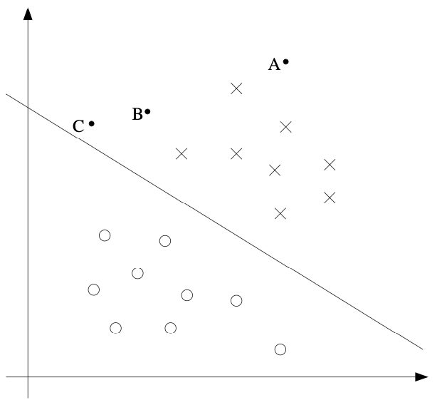
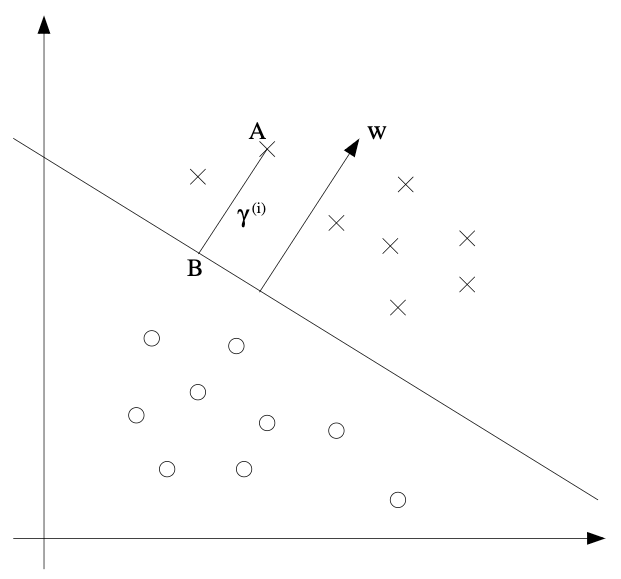

# 6 Support Vector Machines

## Introduction

This set of notes presents the Support Vector Machine (SVM) learning algorithm. SVMs are among the best (and many believe are indeed the best) "off-the-shelf" supervised learning algorithms. To tell the SVM story, we'll need to first talk about margins and the idea of separating data with a large "gap." Next, we'll talk about the optimal margin classifier, which will lead us into a digression on Lagrange duality. We'll also see kernels, which give a way to apply SVMs efficiently in very high dimensional (such as infinite-dimensional) feature spaces, and finally, we'll close off the story with the SMO algorithm, which gives an efficient implementation of SVMs.

**Why SVMs Matter**:
- **Theoretical Foundation**: Based on solid statistical learning theory
- **Practical Performance**: Often achieve state-of-the-art results
- **Kernel Flexibility**: Can handle non-linear problems efficiently
- **Interpretability**: Support vectors provide insights into the model

## From Kernel Foundations to Margin Optimization

We've now established the mathematical foundations of kernel methods - understanding what makes a function a valid kernel through positive semi-definiteness and Mercer's theorem. This theoretical framework provides the rigor needed to design and validate kernel functions.

However, kernels are most powerful when applied to specific algorithms that can leverage their computational efficiency. **Support Vector Machines (SVMs)** represent the perfect marriage of kernel methods with a powerful classification algorithm that naturally benefits from the kernel trick.

The key insight that connects kernels to SVMs is the concept of **margins** - the distance between the decision boundary and the closest data points. SVMs seek to maximize this margin, leading to robust classifiers that generalize well. The kernel trick allows SVMs to find large-margin decision boundaries in high-dimensional feature spaces without explicitly computing the features.

The transition from kernel properties to SVM margins represents the bridge from mathematical foundations to practical algorithms - taking the theoretical understanding of kernels and applying it to build powerful, robust classifiers.

In this section, we'll explore how margins provide both geometric intuition and theoretical guarantees for classification, setting the stage for the optimal margin classifier that will naturally lead to the dual formulation and kernelization.

## 6.1 Margins: Intuition

### The Concept of Margin

We'll start our story on SVMs by talking about margins. This section will give the intuitions about margins and about the "confidence" of our predictions; these ideas will be made formal in Section 6.3.

**What is a Margin?**
A margin is the distance between the decision boundary and the closest data points. It measures how "confident" our classifier is in its predictions.

### Intuition from Logistic Regression

Consider logistic regression, where the probability $p(y = 1|x; \theta)$ is modeled by $h_\theta(x) = g(\theta^T x)$. We then predict "1" on an input $x$ if and only if $h_\theta(x) \geq 0.5$, or equivalently, if and only if $\theta^T x \geq 0$. 

**The Confidence Interpretation**:
Consider a positive training example ($y = 1$). The larger $\theta^T x$ is, the larger also is $h_\theta(x) = p(y = 1|x; \theta)$, and thus also the higher our degree of "confidence" that the label is 1. Thus, informally we can think of our prediction as being very confident that $y = 1$ if $\theta^T x \gg 0$. Similarly, we think of logistic regression as confidently predicting $y = 0$, if $\theta^T x \ll 0$.

**The Goal**: Given a training set, again informally it seems that we'd have found a good fit to the training data if we can find $\theta$ so that $\theta^T x^{(i)} \gg 0$ whenever $y^{(i)} = 1$, and $\theta^T x^{(i)} \ll 0$ whenever $y^{(i)} = 0$, since this would reflect a very confident (and correct) set of classifications for all the training examples. This seems to be a nice goal to aim for, and we'll soon formalize this idea using the notion of functional margins.

### Geometric Intuition

For a different type of intuition, consider the following figure, in which x's represent positive training examples, o's denote negative training examples, a decision boundary (this is the line given by the equation $\theta^T x = 0$, and is also called the **separating hyperplane**) is also shown, and three points have also been labeled A, B and C.

**The Margin Intuition**:
Notice that the point A is very far from the decision boundary. If we are asked to make a prediction for the value of $y$ at A, it seems we should be quite confident that $y = 1$ there. Conversely, the point C is very close to the decision boundary, and while it's on the side of the decision boundary on which we would predict $y = 1$, it seems likely that just a small change to the decision boundary could easily have caused our prediction to be $y = 0$. Hence, we're much more confident about our prediction at A than at C. The point B lies in-between these two cases, and more broadly, we see that if a point is far from the separating hyperplane, then we may be significantly more confident in our predictions.

**The Key Insight**: Again, informally we think it would be nice if, given a training set, we manage to find a decision boundary that allows us to make all correct and confident (meaning far from the decision boundary) predictions on the training examples. We'll formalize this later using the notion of geometric margins.

**Why Margins Matter**:
- **Robustness**: Large margins make the classifier robust to small perturbations
- **Generalization**: Large margins often lead to better generalization
- **Confidence**: Points far from the boundary have high prediction confidence

## 6.2 Notation

### The SVM Notation Convention

To make our discussion of SVMs easier, we'll first need to introduce a new notation for talking about classification. We will be considering a linear classifier for a binary classification problem with labels $y$ and features $x$. From now, we'll use $y \in \{-1, 1\}$ (instead of $\{0, 1\}$) to denote the class labels. Also, rather than parameterizing our linear classifier with the vector $\theta$, we will use parameters $w, b$, and write our classifier as

$$
h_{w,b}(x) = g(w^T x + b).
$$

*Implementation details are provided in the accompanying Python examples file.*

**The Decision Function**:
Here, $g(z) = 1$ if $z \geq 0$, and $g(z) = -1$ otherwise. This "$w, b$" notation allows us to explicitly treat the intercept term $b$ separately from the other parameters. (We also drop the convention we had previously of letting $x_0 = 1$ be an extra coordinate in the input feature vector.) Thus, $b$ takes the role of what was previously $\theta_0$, and $w$ takes the role of $[\theta_1 \ldots \theta_d]^T$.

**Why This Notation?**:
- **Separation of concerns**: $w$ controls the direction, $b$ controls the position
- **Geometric interpretation**: $w$ is normal to the hyperplane
- **Margin calculation**: Makes margin calculations more intuitive

**The Decision Rule**:
Note also that, from our definition of $g$ above, our classifier will directly predict either $1$ or $-1$ (cf. the perceptron algorithm), without first going through the intermediate step of estimating $p(y = 1)$ (which is what logistic regression does).

**Comparison with Other Methods**:
- **Logistic Regression**: Outputs probability, then threshold
- **SVM**: Direct binary prediction
- **Perceptron**: Same as SVM but without margin optimization

## 6.3 Functional and Geometric Margins

### Formalizing the Margin Concepts

Let's formalize the notions of the functional and geometric margins. Given a training example $(x^{(i)}, y^{(i)})$, we define the **functional margin** of $(w, b)$ with respect to the training example as

$$
\hat{\gamma}^{(i)} = y^{(i)} (w^T x^{(i)} + b).
$$

*Implementation details are provided in the accompanying Python examples file.*

### Understanding the Functional Margin

**Intuition**: The functional margin measures how "correct" and "confident" our prediction is.

**Case Analysis**:
- **If $y^{(i)} = 1$**: For the functional margin to be large (i.e., for our prediction to be confident and correct), we need $w^T x^{(i)} + b$ to be a large positive number.
- **If $y^{(i)} = -1$**: For the functional margin to be large, we need $w^T x^{(i)} + b$ to be a large negative number.

**The Sign Matters**: Moreover, if $y^{(i)} (w^T x^{(i)} + b) > 0$, then our prediction on this example is correct. (Check this yourself.) Hence, a large functional margin represents a confident and correct prediction.

**Properties**:
- **Positive**: Indicates correct classification
- **Large**: Indicates confident classification
- **Scale-dependent**: Changes if we scale $w$ and $b$

### The Functional Margin of the Training Set

Given a training set $S = \{(x^{(i)}, y^{(i)}); i = 1, \ldots, n\}$, we also define the function margin of $(w, b)$ with respect to $S$ as the smallest of the functional margins of the individual training examples. Denoted by $\hat{\gamma}$, this can therefore be written:

$$
\hat{\gamma} = \min_{i=1,\ldots,n} \hat{\gamma}^{(i)}.
$$

*Implementation details are provided in the accompanying Python examples file.*

**Why the Minimum?**:
- **Weakest link**: The classifier is only as good as its worst prediction
- **Robustness**: Ensures all points are well-classified
- **Optimization target**: We want to maximize this minimum margin

### Geometric Margins: The Real Distance

Next, let's talk about **geometric margins**. Consider the picture below:

**The Geometric Setup**:
The decision boundary corresponding to $(w, b)$ is shown, along with the vector $w$. Note that $w$ is orthogonal (at 90°) to the separating hyperplane. (You should convince yourself that this must be the case.) Consider the point at A, which represents the input $x^{(i)}$ of some training example with label $y^{(i)} = 1$. Its distance to the decision boundary, $\gamma^{(i)}$, is given by the line segment AB.

**Why $w$ is Orthogonal**:
The decision boundary is defined by $w^T x + b = 0$. For any two points $x_1$ and $x_2$ on this boundary:
- $w^T x_1 + b = 0$
- $w^T x_2 + b = 0$
- Subtracting: $w^T (x_1 - x_2) = 0$

This means $w$ is orthogonal to any vector in the hyperplane, so $w$ is the normal vector.

### Computing the Geometric Margin

**The Calculation**:
How can we find the value of $\gamma^{(i)}$? Well, $w/\|w\|$ is a unit-length vector pointing in the same direction as $w$. Since A represents $x^{(i)}$, we therefore find that the point $B$ is given by $x^{(i)} - \gamma^{(i)} \cdot w/\|w\|$. But this point lies on the decision boundary, and all points $x$ on the decision boundary satisfy the equation $w^T x + b = 0$. Hence,

$$
w^T \left( x^{(i)} - \gamma^{(i)} \frac{w}{\|w\|} \right) + b = 0.
$$

**Solving for the Margin**:
Solving for $\gamma^{(i)}$ yields

$$
\gamma^{(i)} = \frac{w^T x^{(i)} + b}{\|w\|} = \left( \frac{w}{\|w\|} \right)^T x^{(i)} + \frac{b}{\|w\|}.
$$

*Implementation details are provided in the accompanying Python examples file.*

**The Formula Explained**:
- **Numerator**: $w^T x^{(i)} + b$ is the signed distance (functional margin)
- **Denominator**: $\|w\|$ normalizes by the length of $w$
- **Result**: The actual geometric distance to the boundary

### The General Geometric Margin

This was worked out for the case of a positive training example at A in the figure, where being on the "positive" side of the decision boundary is good. More generally, we define the geometric margin of $(w, b)$ with respect to a training example $(x^{(i)}, y^{(i)})$ to be

$$
\gamma^{(i)} = y^{(i)} \left( \left( \frac{w}{\|w\|} \right)^T x^{(i)} + \frac{b}{\|w\|} \right).
$$

**The Key Insight**: The geometric margin is the actual distance from the point to the decision boundary, taking into account the correct side.

**Properties of Geometric Margins**:
- **Scale invariance**: If we replace $w$ with $2w$ and $b$ with $2b$, then the geometric margin does not change
- **Interpretability**: Direct geometric meaning
- **Optimization friendly**: Can be used in optimization problems

**The Relationship**: Note that if $\|w\| = 1$, then the functional margin equals the geometric margin—this thus gives us a way of relating these two different notions of margin. Also, the geometric margin is invariant to rescaling of the parameters; i.e., if we replace $w$ with $2w$ and $b$ with $2b$, then the geometric margin does not change. This will in fact come in handy later. Specifically, because of this invariance to the scaling of the parameters, when trying to fit $w$ and $b$ to training data, we can impose an arbitrary scaling constraint on $w$ without changing anything important; for instance, we can demand that $|w_1| = 1$, or $\|w\| = 5$, or $|w_1 + b| + |w_2| = 2$, and any of these can be satisfied simply by rescaling $w$ and $b$.

### The Geometric Margin of the Training Set

Finally, given a training set $S = \{(x^{(i)}, y^{(i)}); i = 1, \ldots, n\}$, we also define the geometric margin of $(w, b)$ with respect to $S$ to be the smallest of the geometric margins on the individual training examples:

$$
\gamma = \min_{i=1,\ldots,n} \gamma^{(i)}.
$$

*Implementation details are provided in the accompanying Python examples file.*

**The Optimization Target**: This is what we want to maximize - the minimum geometric margin over all training points.

## 6.4 The Optimal Margin Classifier

### The Optimization Problem

Given a training set, it seems from our previous discussion that a natural desideratum is to try to find a decision boundary that maximizes the (geometric) margin, since this would reflect a very confident set of predictions on the training set and a good "fit" to the training data. Specifically, this will result in a classifier that separates the positive and the negative training examples with a "gap" (geometric margin).

**The Goal**: Find the hyperplane that maximizes the minimum distance to any training point.

For now, we will assume that we are given a training set that is linearly separable; i.e., that it is possible to separate the positive and negative examples using some separating hyperplane. How will we find the one that achieves the maximum geometric margin? We can pose the following optimization problem:

$$
\max_{\gamma, w, b} \quad \gamma \\
\text{s.t.} \quad y^{(i)} (w^T x^{(i)} + b) \geq \gamma, \quad i = 1, \ldots, n \\
\|w\| = 1.
$$

**Understanding the Problem**:
- **Objective**: Maximize the geometric margin $\gamma$
- **Constraints**: Each training example must have functional margin at least $\gamma$
- **Normalization**: $\|w\| = 1$ ensures functional margin equals geometric margin

I.e., we want to maximize $\gamma$, subject to each training example having functional margin at least $\gamma$. The $\|w\| = 1$ constraint moreover ensures that the functional margin equals the geometric margin, so we are also guaranteed that all the geometric margins are at least $\gamma$. Thus, solving this problem will result in $(w, b)$ with the largest possible geometric margin with respect to the training set.

### The Problem with the Original Formulation

If we could solve the optimization problem above, we'd be done. But the "$|w\| = 1$" constraint is a nasty (non-convex) one, and this problem certainly isn't in any format that we can plug into standard optimization software to solve. So, let's try transforming the problem into a nicer one.

**Why $\|w\| = 1$ is Problematic**:
- **Non-convex**: The constraint $\|w\| = 1$ defines a non-convex set
- **Non-differentiable**: The norm function is not differentiable at zero
- **Difficult optimization**: Standard optimization methods struggle with this constraint

### The First Transformation

Consider:

$$
\max_{\gamma, w, b} \quad \frac{\hat{\gamma}}{\|w\|} \\
\text{s.t.} \quad y^{(i)} (w^T x^{(i)} + b) \geq \hat{\gamma}, \quad i = 1, \ldots, n
$$

**The Improvement**:
Here, we're going to maximize $\hat{\gamma}/\|w\|$, subject to the functional margins all being at least $\hat{\gamma}$. Since the geometric and functional margins are related by $\gamma = \hat{\gamma}/\|w\|$, this will give us the answer we want. Moreover, we've gotten rid of the constraint $\|w\| = 1$ that we didn't like.

**The Remaining Problem**: The downside is that we now have a nasty (again, non-convex) objective $\hat{\gamma}/\|w\|$ function; and, we still don't have any off-the-shelf software that can solve this form of an optimization problem.

### The Final Transformation

Let's keep going. Recall our earlier discussion that we can add an arbitrary scaling constraint on $w$ and $b$ without changing anything. This is the key idea we'll use now. We will introduce the scaling constraint that the functional margin of $w, b$ with respect to the training set must be 1:

$$
\hat{\gamma} = 1.
$$

**The Scaling Insight**: Since multiplying $w$ and $b$ by some constant results in the functional margin being multiplied by that same constant, this is indeed a scaling constraint, and can be satisfied by rescaling $w, b$. 

**The Final Problem**: Plugging this into our problem above, and noting that maximizing $\hat{\gamma}/\|w\| = 1/\|w\|$ is the same thing as minimizing $\|w\|^2$, we now have the following optimization problem:

$$
\min_{w, b} \quad \frac{1}{2} \|w\|^2 \\
\text{s.t.} \quad y^{(i)} (w^T x^{(i)} + b) \geq 1, \quad i = 1, \ldots, n
$$

*Implementation details are provided in the accompanying Python examples file.*

**Why This Works**:
- **Convex**: The objective $\frac{1}{2} \|w\|^2$ is convex
- **Linear constraints**: All constraints are linear
- **Standard form**: This is a quadratic programming problem
- **Efficient solvers**: Many efficient algorithms exist for this problem

We've now transformed the problem into a form that can be efficiently solved. The above is an optimization problem with a convex quadratic objective and only linear constraints. Its solution gives us the **optimal margin classifier**. This optimization problem can be solved using commercial quadratic programming (QP) code.

### The Solution and Beyond

While we could call the problem solved here, what we will instead do is take a digression to talk about Lagrange duality. This will lead us to our optimization problem's dual form, which will play a key role in allowing us to use kernels to get optimal margin classifiers to work efficiently in very high dimensional spaces. The dual form will also allow us to derive an efficient algorithm for solving the above optimization problem that will typically do much better than generic QP software.

**Why the Dual Form Matters**:
- **Kernelization**: Enables the use of kernels
- **Efficiency**: Often more efficient than primal methods
- **Insights**: Provides insights into the structure of the solution
- **Support vectors**: Naturally identifies the important training points

## 6.5 Lagrange Duality

### Introduction to Constrained Optimization

Let's temporarily put aside SVMs and maximum margin classifiers, and talk about solving constrained optimization problems.

Consider a problem of the following form:

$$
\min_w \quad f(w) \\
\text{s.t.} \quad h_i(w) = 0, \quad i = 1, \ldots, l.
$$

*Implementation details are provided in the accompanying Python examples file.*

**The Lagrangian Method**: Some of you may recall how the method of Lagrange multipliers can be used to solve it. (Don't worry if you haven't seen it before.) In this method, we define the **Lagrangian** to be

$$
\mathcal{L}(w, \beta) = f(w) + \sum_{i=1}^l \beta_i h_i(w)
$$

Here, the $\beta_i$'s are called the **Lagrange multipliers**. We would then find and set $\mathcal{L}$'s partial derivatives to zero:

$$
\frac{\partial \mathcal{L}}{\partial w_j} = 0; \quad \frac{\partial \mathcal{L}}{\partial \beta_j} = 0,
$$

and solve for $w$ and $\beta$.

### The Generalized Lagrangian

In this section, we will generalize this to constrained optimization problems in which we may have inequality as well as equality constraints. Due to time constraints, we won't really be able to do the theory of Lagrange duality justice in this class, but we will give the main ideas and results, which we will then apply to our optimal margin classifier's optimization problem.

Consider the following, which we'll call the **primal optimization problem**:

$$
\min_w \quad f(w) \\
\text{s.t.} \quad g_i(w) \leq 0, \quad i = 1, \ldots, k \\
\quad \;\;\;\; h_i(w) = 0, \quad i = 1, \ldots, l.
$$

**The Problem Types**:
- **Equality constraints**: $h_i(w) = 0$ (must be satisfied exactly)
- **Inequality constraints**: $g_i(w) \leq 0$ (must be satisfied with slack)

To solve it, we start by defining the **generalized Lagrangian**

$$
\mathcal{L}(w, \alpha, \beta) = f(w) + \sum_{i=1}^k \alpha_i g_i(w) + \sum_{i=1}^l \beta_i h_i(w).
$$

*Implementation details are provided in the accompanying Python examples file.*

Here, the $\alpha_i$'s and $\beta_i$'s are the Lagrange multipliers. 

**The Lagrangian Intuition**:
- **Objective**: $f(w)$ - what we want to minimize
- **Inequality penalties**: $\alpha_i g_i(w)$ - penalize violation of $g_i(w) \leq 0$
- **Equality penalties**: $\beta_i h_i(w)$ - penalize violation of $h_i(w) = 0$

### The Primal and Dual Problems

Consider the quantity

$$
\theta_P(w) = \max_{\alpha \succeq 0, \beta} \mathcal{L}(w, \alpha, \beta).
$$

Here, the "P" subscript stands for "primal." Let some $w$ be given. If $w$ violates any of the primal constraints (i.e., if either $g_i(w) > 0$ or $h_i(w) \neq 0$ for some $i$), then you should be able to verify that

$$
\theta_P(w) = \max_{\alpha \succeq 0, \beta} f(w) + \sum_{i=1}^k \alpha_i g_i(w) + \sum_{i=1}^l \beta_i h_i(w) = \infty.
$$

**Why This Happens**:
- If $g_i(w) > 0$, we can set $\alpha_i \to \infty$ to make the Lagrangian $\to \infty$
- If $h_i(w) \neq 0$, we can set $\beta_i$ to make the Lagrangian $\to \infty$

Conversely, if the constraints are indeed satisfied for a particular value of $w$, then $\theta_P(w) = f(w)$. Hence,

$$
\theta_P(w) = \begin{cases} f(w) & \text{if $w$ satisfies primal constraints} \\ \infty & \text{otherwise.} \end{cases}
$$

**The Primal Problem**: Thus, $\theta_P$ takes the same value as the objective in our problem for all values of $w$ that satisfies the primal constraints, and is positive infinity if the constraints are violated. Hence, if we consider the minimization problem

$$
\min_w \theta_P(w) = \min_w \max_{\alpha \succeq 0, \beta} \mathcal{L}(w, \alpha, \beta),
$$

we see that it is the same problem (i.e., and has the same solutions as) our original primal problem. For later use, we also define the optimal value of the objective to be $p^* = \min_w \theta_P(w)$; we call this the **value of the primal problem**.

### The Dual Problem

Now, let's look at a slightly different problem. We define

$$
\theta_D(\alpha, \beta) = \min_w \mathcal{L}(w, \alpha, \beta).
$$

Here, the "D" subscript stands for "dual." Note also that whereas in the definition of $\theta_P$ we were optimizing (maximizing) with respect to $\alpha, \beta$, here we are minimizing with respect to $w$.

We can now pose the **dual optimization problem**:

$$
\max_{\alpha \succeq 0, \beta} \theta_D(\alpha, \beta) = \max_{\alpha \succeq 0, \beta} \min_w \mathcal{L}(w, \alpha, \beta).
$$

This is exactly the same as our primal problem shown above, except that the order of the "max" and the "min" are now exchanged. We also define the optimal value of the dual problem's objective to be $d^* = \max_{\alpha \succeq 0, \beta} \theta_D(\alpha, \beta)$.

### The Relationship Between Primal and Dual

How do the primal and the dual problems relate? (It can easily be shown that

$$
d^* = \max_{\alpha \succeq 0, \beta} \min_w \mathcal{L}(w, \alpha, \beta) \leq \min_w \max_{\alpha \succeq 0, \beta} \mathcal{L}(w, \alpha, \beta) = p^*.
$$

(You should convince yourself of this; this follows from the "max min" of a function always being less than or equal to the "min max." However, under certain conditions, we will have

$$
d^* = p^*,
$$

so that we can solve the dual problem in lieu of the primal problem. Let's see what these conditions are.

### The KKT Conditions

Suppose $f$ and the $g_i$'s are convex, and the $h_i$'s are affine. Suppose further that the constraints $g_i$ are (strictly) feasible; this means that there exists some $w$ so that $g_i(w) < 0$ for all $i$.

Under our above assumptions, there must exist $w^*, \alpha^*, \beta^*$ so that $w^*$ is the solution to the primal problem, $\alpha^*, \beta^*$ are the solution to the dual problem, and moreover $p^* = d^* = \mathcal{L}(w^*, \alpha^*, \beta^*)$. Moreover, $w^*, \alpha^*$ and $\beta^*$ satisfy the **Karush-Kuhn-Tucker (KKT) conditions**, which are as follows:

$$
\frac{\partial}{\partial w_j} \mathcal{L}(w^*, \alpha^*, \beta^*) = 0, \quad i = 1, \ldots, d \tag{6.3}
$$
$$
\frac{\partial}{\partial \beta_j} \mathcal{L}(w^*, \alpha^*, \beta^*) = 0, \quad i = 1, \ldots, l \tag{6.4}
$$
$$
\alpha_i^* g_i(w^*) = 0, \quad i = 1, \ldots, k \tag{6.5}
$$
$$
g_i(w^*) \leq 0, \quad i = 1, \ldots, k \tag{6.6}
$$
$$
\alpha^* \succeq 0, \quad i = 1, \ldots, k \tag{6.7}
$$

**Understanding the KKT Conditions**:

1. **Stationarity** (6.3): The gradient of the Lagrangian with respect to $w$ is zero
2. **Primal feasibility** (6.6): The original constraints are satisfied
3. **Dual feasibility** (6.7): The Lagrange multipliers are non-negative
4. **Complementary slackness** (6.5): Either the constraint is tight ($g_i(w^*) = 0$) or the multiplier is zero ($\alpha_i^* = 0$)

We draw attention to Equation (6.5), which is called the **KKT dual complementarity** condition. Specifically, it implies that if $\alpha_i^* > 0$, then $g_i(w^*) = 0$. (I.e., the "$g_i(w) \leq 0$" constraint is active, meaning it holds with equality rather than with inequality.) Later on, this will be key for showing that the SVM has only a small number of "support vectors"; the KKT dual complementarity condition will also give us our convergence test when we talk about the SMO algorithm.

**The Support Vector Connection**: This condition tells us that only the training points that lie exactly on the margin (where $g_i(w^*) = 0$) will have non-zero $\alpha_i^*$ values. These are the support vectors!

## From Margin Intuition to Optimal Classification

We've now explored the geometric and mathematical foundations of **margins** in support vector machines - understanding how margins provide both intuitive confidence measures and theoretical guarantees for robust classification. The concept of maximizing the margin between classes leads naturally to the question of how to find the **optimal margin classifier**.

The key insight from our margin analysis is that large margins lead to better generalization and more robust classifiers. However, we need a systematic approach to find the hyperplane that maximizes the margin while correctly classifying all training points.

This motivates our exploration of the **optimal margin classifier** - the mathematical formulation that finds the hyperplane with the largest possible margin. This optimization problem will lead us to the dual formulation, which naturally incorporates kernels and reveals the fundamental role of support vectors.

The transition from margin concepts to optimal margin classification represents the bridge from geometric intuition to mathematical optimization - taking our understanding of why margins matter and turning it into a concrete algorithm for finding the best possible classifier.

In the next section, we'll derive the optimal margin classifier and see how it naturally leads to the dual formulation that enables kernelization and reveals the elegant structure of support vectors.

---

**Previous: [Kernel Properties](02_kernel_properties.md)** - Understand the mathematical foundations that make kernels valid and learn how to design new kernels.

**Next: [Optimal Margin Classifiers](04_svm_optimal_margin.md)** - Derive the optimal margin classifier and understand the dual formulation that enables kernelization.