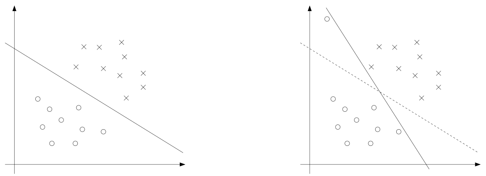

# 6.7 Regularization and the non-separable case

**Motivation:**
In real-world datasets, perfect linear separability is rare. Outliers, noise, or overlapping classes can make it impossible to find a hyperplane that separates the data without error. SVMs address this by introducing slack variables and regularization, allowing some points to be misclassified or to fall within the margin, while still maximizing the margin as much as possible.

The derivation of the SVM as presented so far assumed that the data is linearly separable. While mapping data to a high dimensional feature space via $\phi$ does generally increase the likelihood that the data is separable, we can't guarantee that it always will be so. Also, in some cases it is not clear that finding a separating hyperplane is exactly what we'd want to do, since that might be susceptible to outliers. For instance, the left figure below shows an optimal margin classifier, and when a single outlier is added in the upper-left region (right figure), it causes the decision boundary to make a dramatic swing, and the resulting classifier has a much smaller margin.



To make the algorithm work for non-linearly separable datasets as well as be less sensitive to outliers, we reformulate our optimization (using $\ell_1$ **regularization**) as follows:

```math
\min_{w, x, b} \quad \frac{1}{2} \|w\|^2 + C \sum_{i=1}^n \xi_i
```

subject to

```math
y^{(i)} (w^T x^{(i)} + b) \geq 1 - \xi_i, \quad i = 1, \ldots, n
\xi_i \geq 0, \quad i = 1, \ldots, n.
```

```python
# With slack variables (xi)
# Objective: (1/2) * np.dot(w, w) + C * np.sum(xi)
# Constraints: y[i] * (np.dot(w, X[i]) + b) >= 1 - xi[i], xi[i] >= 0

import numpy as np
from scipy.optimize import minimize

def svm_primal_objective(params, X, y, C):
    """
    Primal SVM objective function with slack variables
    
    Parameters:
    params: [w, b, xi] - weight vector, bias, slack variables
    X: training features
    y: training labels (-1, 1)
    C: regularization parameter
    """
    n_features = X.shape[1]
    n_samples = X.shape[0]
    
    w = params[:n_features]
    b = params[n_features]
    xi = params[n_features + 1:]
    
    # Objective: (1/2) ||w||^2 + C * sum(xi)
    objective = 0.5 * np.dot(w, w) + C * np.sum(xi)
    
    return objective

def svm_primal_constraints(params, X, y, C):
    """
    Constraints for primal SVM optimization
    """
    n_features = X.shape[1]
    n_samples = X.shape[0]
    
    w = params[:n_features]
    b = params[n_features]
    xi = params[n_features + 1:]
    
    constraints = []
    
    # y[i] * (w^T x[i] + b) >= 1 - xi[i]
    for i in range(n_samples):
        margin = y[i] * (np.dot(w, X[i]) + b)
        constraints.append(margin - (1 - xi[i]))
    
    # xi[i] >= 0
    constraints.extend(xi)
    
    return np.array(constraints)

# Example usage
def solve_primal_svm(X, y, C=1.0):
    """Solve primal SVM problem using scipy.optimize"""
    n_features = X.shape[1]
    n_samples = X.shape[0]
    
    # Initial guess: w=0, b=0, xi=0.1
    initial_params = np.zeros(n_features + 1 + n_samples)
    initial_params[n_features + 1:] = 0.1
    
    # Define constraints
    constraints = [
        {'type': 'ineq', 'fun': lambda p: svm_primal_constraints(p, X, y, C)}
    ]
    
    # Solve optimization problem
    result = minimize(
        lambda p: svm_primal_objective(p, X, y, C),
        initial_params,
        constraints=constraints,
        method='SLSQP'
    )
    
    if result.success:
        w = result.x[:n_features]
        b = result.x[n_features]
        xi = result.x[n_features + 1:]
        return w, b, xi
    else:
        raise ValueError("Optimization failed")

# Generate example data
np.random.seed(42)
X = np.random.randn(20, 2)
y = np.sign(X[:, 0] + X[:, 1])  # Simple linear separation with some noise

# Solve primal SVM
w, b, xi = solve_primal_svm(X, y, C=1.0)
print(f"Optimal w: {w}")
print(f"Optimal b: {b}")
print(f"Slack variables: {xi}")
print(f"Total slack: {np.sum(xi)}")
```

---
**Intuition:**
The slack variables $\xi_i$ measure how much each point violates the margin. If $\xi_i = 0$, the point is correctly classified and outside the margin. If $0 < \xi_i < 1$, the point is inside the margin but on the correct side. If $\xi_i > 1$, the point is misclassified. The regularization parameter $C$ controls the trade-off between maximizing the margin and minimizing the total slack (i.e., classification error).

```python
def analyze_slack_variables(X, y, w, b, xi):
    """
    Analyze slack variables and their interpretation
    """
    n_samples = len(y)
    
    print("Slack Variable Analysis:")
    print("=" * 50)
    
    for i in range(n_samples):
        margin = y[i] * (np.dot(w, X[i]) + b)
        slack = xi[i]
        
        if slack == 0:
            status = "Correctly classified, outside margin"
        elif 0 < slack < 1:
            status = "Inside margin, correct side"
        elif slack >= 1:
            status = "Misclassified"
        else:
            status = "Invalid slack value"
        
        print(f"Point {i}: margin={margin:.3f}, ξ={slack:.3f} - {status}")
    
    # Summary statistics
    n_correct = np.sum(xi == 0)
    n_inside_margin = np.sum((xi > 0) & (xi < 1))
    n_misclassified = np.sum(xi >= 1)
    
    print(f"\nSummary:")
    print(f"Correctly classified (ξ=0): {n_correct}")
    print(f"Inside margin (0<ξ<1): {n_inside_margin}")
    print(f"Misclassified (ξ≥1): {n_misclassified}")
    print(f"Total slack: {np.sum(xi):.3f}")

# Example: Analyze slack variables from previous optimization
analyze_slack_variables(X, y, w, b, xi)

def visualize_slack_effect(X, y, C_values=[0.1, 1.0, 10.0]):
    """
    Visualize how different C values affect slack variables
    """
    import matplotlib.pyplot as plt
    
    fig, axes = plt.subplots(1, len(C_values), figsize=(15, 5))
    
    for i, C in enumerate(C_values):
        w, b, xi = solve_primal_svm(X, y, C)
        
        ax = axes[i]
        
        # Plot data points with color based on slack
        scatter = ax.scatter(X[:, 0], X[:, 1], c=xi, cmap='viridis', 
                           s=50, alpha=0.7)
        
        # Plot decision boundary
        x_min, x_max = X[:, 0].min() - 0.5, X[:, 0].max() + 0.5
        y_min, y_max = X[:, 1].min() - 0.5, X[:, 1].max() + 0.5
        
        xx, yy = np.meshgrid(np.linspace(x_min, x_max, 100),
                            np.linspace(y_min, y_max, 100))
        
        Z = np.sign(np.dot(np.c_[xx.ravel(), yy.ravel()], w) + b)
        Z = Z.reshape(xx.shape)
        
        ax.contour(xx, yy, Z, levels=[0], colors='red', linewidths=2)
        ax.set_title(f'C = {C}\nTotal Slack: {np.sum(xi):.2f}')
        ax.set_xlabel('Feature 1')
        ax.set_ylabel('Feature 2')
    
    plt.colorbar(scatter, ax=axes, label='Slack Variable ξ')
    plt.tight_layout()
    plt.show()

# Visualize slack effect
visualize_slack_effect(X, y)
```


Thus, examples are now permitted to have (functional) margin less than 1, and if an example has functional margin $1 - \xi_i$ (with $\xi > 0$), we would pay a cost of the objective function being increased by $C \xi_i$. The parameter $C$ controls the relative weighting between the twin goals of making the $\|w\|^2$ small (which we saw earlier makes the margin large) and of ensuring that most examples have functional margin at least 1.

---
**Practical scenario:**
Suppose you have a dataset of emails, and a few spam emails are mislabeled as non-spam. Without slack variables, a single mislabeled point could force the SVM to create a very poor decision boundary. With slack and regularization, the SVM can "ignore" these outliers to some extent, leading to a more robust classifier.

```python
def email_spam_example():
    """
    Demonstrate SVM with outliers using email spam scenario
    """
    # Simulate email dataset with features like word frequencies
    np.random.seed(42)
    n_emails = 100
    
    # Generate features: [word_freq_money, word_freq_free, word_freq_urgent]
    X = np.random.randn(n_emails, 3)
    
    # Create labels: 1 for spam, -1 for non-spam
    # Spam emails typically have higher word frequencies
    spam_score = X[:, 0] + 2*X[:, 1] + 1.5*X[:, 2]
    y = np.sign(spam_score)
    
    # Add some mislabeled outliers (spam labeled as non-spam)
    outlier_indices = [10, 25, 45]  # Indices of mislabeled emails
    for idx in outlier_indices:
        if y[idx] == 1:  # If it's spam
            y[idx] = -1  # Mislabel as non-spam
    
    print("Email Spam Classification Example:")
    print("=" * 50)
    print(f"Total emails: {n_emails}")
    print(f"Spam emails: {np.sum(y == 1)}")
    print(f"Non-spam emails: {np.sum(y == -1)}")
    print(f"Mislabeled outliers: {len(outlier_indices)}")
    
    # Compare SVM with and without slack variables
    C_values = [0.01, 1.0, 100.0]
    
    for C in C_values:
        w, b, xi = solve_primal_svm(X, y, C)
        
        # Calculate accuracy
        predictions = np.sign(np.dot(X, w) + b)
        accuracy = np.mean(predictions == y)
        
        # Count misclassifications
        misclassified = np.sum(predictions != y)
        
        print(f"\nC = {C}:")
        print(f"  Accuracy: {accuracy:.3f}")
        print(f"  Misclassifications: {misclassified}")
        print(f"  Total slack: {np.sum(xi):.3f}")
        print(f"  Margin size: {1/np.linalg.norm(w):.3f}")
    
    return X, y

# Run email spam example
X_email, y_email = email_spam_example()
```

As before, we can form the Lagrangian:

```math
\mathcal{L}(w, b, \xi, \alpha, r) = \frac{1}{2} w^T w + C \sum_{i=1}^n \xi_i - \sum_{i=1}^n \alpha_i \left[ y^{(i)} (w^T x^{(i)} + b) - 1 + \xi_i \right] - \sum_{i=1}^n r_i \xi_i.
```

Here, the $\alpha_i$'s and $r_i$'s are our Lagrange multipliers (constrained to be $\geq 0$). We won't go through the derivation of the dual again in detail, but after setting the derivatives with respect to $w$ and $b$ to zero as before, substituting them back in, and simplifying, we obtain the following dual form of the problem:

```python
def lagrangian_function(w, b, xi, alpha, r, X, y, C):
    """
    Compute the Lagrangian function value
    
    L(w, b, ξ, α, r) = (1/2)w^T w + C*sum(ξ_i) - 
                       sum(α_i[y_i(w^T x_i + b) - 1 + ξ_i]) - sum(r_i * ξ_i)
    """
    n_samples = len(y)
    
    # First term: (1/2) w^T w
    term1 = 0.5 * np.dot(w, w)
    
    # Second term: C * sum(ξ_i)
    term2 = C * np.sum(xi)
    
    # Third term: -sum(α_i[y_i(w^T x_i + b) - 1 + ξ_i])
    term3 = 0
    for i in range(n_samples):
        margin = y[i] * (np.dot(w, X[i]) + b)
        term3 -= alpha[i] * (margin - 1 + xi[i])
    
    # Fourth term: -sum(r_i * ξ_i)
    term4 = -np.sum(r * xi)
    
    return term1 + term2 + term3 + term4

def dual_objective(alphas, X, y):
    """
    Dual objective function: W(α) = sum(α_i) - (1/2)sum(sum(y_i * y_j * α_i * α_j * K(x_i, x_j)))
    """
    n_samples = len(alphas)
    
    # First term: sum(α_i)
    term1 = np.sum(alphas)
    
    # Second term: (1/2)sum(sum(y_i * y_j * α_i * α_j * K(x_i, x_j)))
    term2 = 0
    for i in range(n_samples):
        for j in range(n_samples):
            # Linear kernel: K(x_i, x_j) = x_i^T x_j
            kernel_val = np.dot(X[i], X[j])
            term2 += y[i] * y[j] * alphas[i] * alphas[j] * kernel_val
    term2 *= 0.5
    
    return term1 - term2

def solve_dual_svm(X, y, C=1.0):
    """
    Solve dual SVM problem using scipy.optimize
    """
    n_samples = len(y)
    
    # Define objective function (negative because we maximize)
    def objective(alphas):
        return -dual_objective(alphas, X, y)
    
    # Define constraints
    constraints = [
        # sum(α_i * y_i) = 0
        {'type': 'eq', 'fun': lambda a: np.sum(a * y)},
    ]
    
    # Bounds: 0 ≤ α_i ≤ C
    bounds = [(0, C) for _ in range(n_samples)]
    
    # Initial guess
    initial_alphas = np.ones(n_samples) * 0.1
    
    # Solve optimization
    result = minimize(
        objective,
        initial_alphas,
        constraints=constraints,
        bounds=bounds,
        method='SLSQP'
    )
    
    if result.success:
        return result.x
    else:
        raise ValueError("Dual optimization failed")

# Example: Solve dual problem
alphas = solve_dual_svm(X, y, C=1.0)
print(f"Dual solution - α values: {alphas[:10]}...")  # Show first 10
print(f"Sum of α values: {np.sum(alphas):.3f}")
print(f"Sum of α * y: {np.sum(alphas * y):.3f}")  # Should be close to 0
```

```math
\begin{align}
\max_{\alpha} \quad & W(\alpha) = \sum_{i=1}^n \alpha_i - \frac{1}{2} \sum_{i=1}^n \sum_{j=1}^n y^{(i)} y^{(j)} \alpha_i \alpha_j \langle x^{(i)}, x^{(j)} \rangle \\
\text{s.t.} \quad & 0 \leq \alpha_i \leq C, \quad i = 1, \ldots, n \\
& \sum_{i=1}^n \alpha_i y^{(i)} = 0,
\end{align}
```

```python
def verify_dual_constraints(alphas, y, C):
    """
    Verify that dual constraints are satisfied
    """
    n_samples = len(alphas)
    
    print("Dual Constraint Verification:")
    print("=" * 40)
    
    # Check bounds: 0 ≤ α_i ≤ C
    lower_bound_violations = np.sum(alphas < 0)
    upper_bound_violations = np.sum(alphas > C)
    
    print(f"α_i ≥ 0 violations: {lower_bound_violations}")
    print(f"α_i ≤ C violations: {upper_bound_violations}")
    
    # Check equality constraint: sum(α_i * y_i) = 0
    equality_constraint = np.sum(alphas * y)
    print(f"sum(α_i * y_i): {equality_constraint:.6f} (should be 0)")
    
    # Check support vectors
    support_vectors = alphas > 1e-6
    n_support_vectors = np.sum(support_vectors)
    print(f"Support vectors: {n_support_vectors}")
    
    # Check bounded support vectors (α_i = C)
    bounded_support_vectors = np.sum(np.abs(alphas - C) < 1e-6)
    print(f"Bounded support vectors (α_i = C): {bounded_support_vectors}")
    
    return {
        'lower_violations': lower_bound_violations,
        'upper_violations': upper_bound_violations,
        'equality_constraint': equality_constraint,
        'n_support_vectors': n_support_vectors,
        'bounded_support_vectors': bounded_support_vectors
    }

# Verify constraints for our dual solution
constraint_check = verify_dual_constraints(alphas, y, C=1.0)

def recover_primal_from_dual(alphas, X, y):
    """
    Recover primal solution (w, b) from dual solution (α)
    """
    n_samples, n_features = X.shape
    
    # Recover w: w = sum(α_i * y_i * x_i)
    w = np.zeros(n_features)
    for i in range(n_samples):
        w += alphas[i] * y[i] * X[i]
    
    # Recover b using KKT conditions
    # For support vectors with 0 < α_i < C: y_i(w^T x_i + b) = 1
    support_vector_indices = np.where((alphas > 1e-6) & (alphas < 0.99))[0]
    
    if len(support_vector_indices) > 0:
        # Use average of all support vectors
        b_values = []
        for i in support_vector_indices:
            b_val = 1/y[i] - np.dot(w, X[i])
            b_values.append(b_val)
        b = np.mean(b_values)
    else:
        # Fallback: use any support vector
        sv_idx = np.where(alphas > 1e-6)[0][0]
        b = 1/y[sv_idx] - np.dot(w, X[sv_idx])
    
    return w, b

# Recover primal solution
w_recovered, b_recovered = recover_primal_from_dual(alphas, X, y)
print(f"\nRecovered w: {w_recovered}")
print(f"Recovered b: {b_recovered:.3f}")

# Compare with direct primal solution
print(f"Direct primal w: {w}")
print(f"Direct primal b: {b:.3f}")
print(f"w difference: {np.linalg.norm(w_recovered - w):.6f}")
print(f"b difference: {abs(b_recovered - b):.6f}")
```

---
**Interpretation:**
The only change from the separable case is the upper bound $C$ on the $\alpha_i$'s. This means that no single point can become "too influential" in determining the decision boundary, which helps control the effect of outliers.

As before, we also have that $w$ can be expressed in terms of the $\alpha_i$'s as given in Equation (6.10), so that after solving the dual problem, we can continue to use Equation (6.15) to make our predictions. Note that, somewhat surprisingly, in adding $\ell_1$ regularization, the only change to the dual problem is that what was previously a constraint that $0 \leq \alpha_i$ has now become $0 \leq \alpha_i \leq C$. The calculation for $b^*$ also has to be modified (Equation 6.13 is no longer valid); we'll see the correct formula later.

Also, the KKT dual-complementarity conditions (which in the next section will be useful for testing for the convergence of the SMO algorithm) are:

```math
\alpha_i = 0 \implies y^{(i)} (w^T x^{(i)} + b) \geq 1 \tag{6.16}
```
```math
\alpha_i = C \implies y^{(i)} (w^T x^{(i)} + b) \leq 1 \tag{6.17}
```
```math
0 < \alpha_i < C \implies y^{(i)} (w^T x^{(i)} + b) = 1. \tag{6.18}
```

---
**Remark:**
These KKT conditions are not just theoretical—they are used in practice to check for convergence in SVM solvers like SMO.

```python
def check_kkt_conditions(alphas, X, y, w, b, C, tol=1e-6):
    """
    Check KKT conditions for convergence
    
    α_i = 0 → y_i(w^T x_i + b) ≥ 1
    α_i = C → y_i(w^T x_i + b) ≤ 1  
    0 < α_i < C → y_i(w^T x_i + b) = 1
    """
    n_samples = len(alphas)
    violations = []
    
    for i in range(n_samples):
        margin = y[i] * (np.dot(w, X[i]) + b)
        alpha_i = alphas[i]
        
        if alpha_i == 0:
            if margin < 1 - tol:
                violations.append(f"Point {i}: α_i=0 but margin={margin:.3f} < 1")
        elif alpha_i == C:
            if margin > 1 + tol:
                violations.append(f"Point {i}: α_i=C but margin={margin:.3f} > 1")
        elif 0 < alpha_i < C:
            if abs(margin - 1) > tol:
                violations.append(f"Point {i}: 0<α_i<C but margin={margin:.3f} ≠ 1")
    
    return violations

def analyze_kkt_violations(alphas, X, y, w, b, C):
    """
    Detailed analysis of KKT condition violations
    """
    violations = check_kkt_conditions(alphas, X, y, w, b, C)
    
    print("KKT Conditions Analysis:")
    print("=" * 40)
    print(f"Total violations: {len(violations)}")
    
    if violations:
        print("Violations found:")
        for violation in violations[:5]:  # Show first 5
            print(f"  - {violation}")
        if len(violations) > 5:
            print(f"  ... and {len(violations) - 5} more")
    else:
        print("All KKT conditions satisfied!")
    
    # Count violations by type
    alpha_zero_violations = 0
    alpha_c_violations = 0
    alpha_between_violations = 0
    
    for i in range(len(alphas)):
        margin = y[i] * (np.dot(w, X[i]) + b)
        alpha_i = alphas[i]
        
        if alpha_i == 0 and margin < 0.99:
            alpha_zero_violations += 1
        elif alpha_i == C and margin > 1.01:
            alpha_c_violations += 1
        elif 0 < alpha_i < C and abs(margin - 1) > 0.01:
            alpha_between_violations += 1
    
    print(f"\nViolation breakdown:")
    print(f"  α_i = 0 violations: {alpha_zero_violations}")
    print(f"  α_i = C violations: {alpha_c_violations}")
    print(f"  0 < α_i < C violations: {alpha_between_violations}")

# Check KKT conditions for our solution
kkt_violations = check_kkt_conditions(alphas, X, y, w_recovered, b_recovered, C=1.0)
analyze_kkt_violations(alphas, X, y, w_recovered, b_recovered, C=1.0)

def visualize_kkt_conditions(alphas, X, y, w, b, C):
    """
    Visualize KKT conditions satisfaction
    """
    import matplotlib.pyplot as plt
    
    margins = np.array([y[i] * (np.dot(w, X[i]) + b) for i in range(len(y))])
    
    fig, (ax1, ax2) = plt.subplots(1, 2, figsize=(12, 5))
    
    # Plot 1: α vs margin
    ax1.scatter(alphas, margins, alpha=0.7)
    ax1.axhline(y=1, color='red', linestyle='--', label='Margin = 1')
    ax1.axvline(x=0, color='blue', linestyle='--', label='α = 0')
    ax1.axvline(x=C, color='green', linestyle='--', label='α = C')
    ax1.set_xlabel('α values')
    ax1.set_ylabel('y_i(w^T x_i + b)')
    ax1.set_title('KKT Conditions: α vs Margin')
    ax1.legend()
    ax1.grid(True, alpha=0.3)
    
    # Plot 2: Violation regions
    ax2.scatter(alphas, margins, alpha=0.7)
    
    # Highlight violation regions
    # α = 0 and margin < 1
    mask1 = (alphas == 0) & (margins < 1)
    ax2.scatter(alphas[mask1], margins[mask1], color='red', s=100, 
               label='α=0, margin<1 (violation)', zorder=5)
    
    # α = C and margin > 1
    mask2 = (alphas == C) & (margins > 1)
    ax2.scatter(alphas[mask2], margins[mask2], color='orange', s=100,
               label='α=C, margin>1 (violation)', zorder=5)
    
    # 0 < α < C and margin ≠ 1
    mask3 = (alphas > 0) & (alphas < C) & (np.abs(margins - 1) > 0.01)
    ax2.scatter(alphas[mask3], margins[mask3], color='purple', s=100,
               label='0<α<C, margin≠1 (violation)', zorder=5)
    
    ax2.axhline(y=1, color='red', linestyle='--')
    ax2.axvline(x=0, color='blue', linestyle='--')
    ax2.axvline(x=C, color='green', linestyle='--')
    ax2.set_xlabel('α values')
    ax2.set_ylabel('y_i(w^T x_i + b)')
    ax2.set_title('KKT Violations Highlighted')
    ax2.legend()
    ax2.grid(True, alpha=0.3)
    
    plt.tight_layout()
    plt.show()

# Visualize KKT conditions
visualize_kkt_conditions(alphas, X, y, w_recovered, b_recovered, C=1.0)
```

Now, all that remains is to give an algorithm for actually solving the dual problem, which we will do in the next section.

# 6.8 The SMO algorithm

---
**Why SMO?**
For large datasets, solving the dual SVM problem directly can be computationally expensive, as it involves optimizing over all $\alpha_i$'s simultaneously. The SMO algorithm breaks this large problem into a series of much smaller problems, each involving only two variables at a time, making it highly scalable and efficient.

```python
def compare_optimization_methods(X, y, C=1.0):
    """
    Compare different optimization methods for SVM
    """
    import time
    
    print("Optimization Method Comparison:")
    print("=" * 50)
    
    # Method 1: Direct dual optimization (scipy)
    start_time = time.time()
    alphas_scipy = solve_dual_svm(X, y, C)
    scipy_time = time.time() - start_time
    
    print(f"Scipy SLSQP: {scipy_time:.4f} seconds")
    
    # Method 2: SMO algorithm (our implementation)
    start_time = time.time()
    svm = SVMRegularization(C=C)
    alphas_smo, b_smo = svm.smo_algorithm(X, y)
    smo_time = time.time() - start_time
    
    print(f"SMO Algorithm: {smo_time:.4f} seconds")
    
    # Compare objective values
    obj_scipy = dual_objective(alphas_scipy, X, y)
    obj_smo = dual_objective(alphas_smo, X, y)
    
    print(f"\nObjective values:")
    print(f"Scipy: {obj_scipy:.6f}")
    print(f"SMO:   {obj_smo:.6f}")
    print(f"Difference: {abs(obj_scipy - obj_smo):.6f}")
    
    return {
        'scipy_time': scipy_time,
        'smo_time': smo_time,
        'scipy_objective': obj_scipy,
        'smo_objective': obj_smo
    }

# Compare optimization methods
comparison = compare_optimization_methods(X, y, C=1.0)
```

The SMO (sequential minimal optimization) algorithm, due to John Platt, gives an efficient way of solving the dual problem arising from the derivation of the SVM. Partly to motivate the SMO algorithm, and partly because it's interesting in its own right, let's first take another digression to talk about the coordinate ascent algorithm.

## 6.8.1 Coordinate ascent

Consider trying to solve the unconstrained optimization problem

```math
\max_{\alpha} W(\alpha_1, \alpha_2, \ldots, \alpha_n).
```

Here, we think of $W$ as just some function of the parameters $\alpha_i$'s, and for now ignore any relationship between this problem and SVMs. We've already seen two optimization algorithms, gradient ascent and Newton's method. The new algorithm we're going to consider here is called **coordinate ascent**:

Loop until convergence:  {

For $i = 1, \ldots, n$,  {

```math
  \alpha_i := \arg\max_{\tilde{\alpha}_i} W(\alpha_1, \ldots, \alpha_{i-1}, \tilde{\alpha}_i, \alpha_{i+1}, \ldots, \alpha_n).
```
  }

}

```python
def coordinate_ascent_optimization(X, y, max_iter=100, tol=1e-6):
    """
    Implement coordinate ascent optimization for SVM dual problem
    """
    n_samples = len(y)
    
    # Initialize alphas
    alphas = np.ones(n_samples) * 0.1
    
    # Compute kernel matrix (linear kernel)
    K = np.dot(X, X.T)
    
    # Store objective values for convergence tracking
    objectives = []
    
    print("Coordinate Ascent Optimization:")
    print("Iter | Objective | Max Change")
    print("-" * 30)
    
    for iteration in range(max_iter):
        max_change = 0
        old_objective = dual_objective(alphas, X, y)
        
        # Update each alpha_i
        for i in range(n_samples):
            # Compute gradient with respect to alpha_i
            grad_i = 1.0  # derivative of sum(alpha_i)
            
            # Subtract derivative of quadratic term
            for j in range(n_samples):
                grad_i -= y[i] * y[j] * alphas[j] * K[i, j]
            
            # Optimal alpha_i (ignoring constraints for now)
            optimal_alpha_i = grad_i / (y[i] * y[i] * K[i, i])
            
            # Apply constraints: 0 ≤ alpha_i ≤ C
            optimal_alpha_i = np.clip(optimal_alpha_i, 0, 1.0)  # C=1.0
            
            # Update alpha_i
            change = abs(optimal_alpha_i - alphas[i])
            max_change = max(max_change, change)
            alphas[i] = optimal_alpha_i
        
        # Check convergence
        new_objective = dual_objective(alphas, X, y)
        objectives.append(new_objective)
        
        print(f"{iteration+1:3d} | {new_objective:8.4f} | {max_change:8.6f}")
        
        if max_change < tol:
            print(f"Converged after {iteration+1} iterations")
            break
    
    return alphas, objectives

# Run coordinate ascent
alphas_ca, objectives_ca = coordinate_ascent_optimization(X, y)

def visualize_coordinate_ascent(objectives):
    """
    Visualize coordinate ascent convergence
    """
    import matplotlib.pyplot as plt
    
    plt.figure(figsize=(10, 6))
    plt.plot(objectives, 'b-', linewidth=2)
    plt.xlabel('Iteration')
    plt.ylabel('Dual Objective Value')
    plt.title('Coordinate Ascent Convergence')
    plt.grid(True, alpha=0.3)
    plt.show()

# Visualize convergence
visualize_coordinate_ascent(objectives_ca)
```

---
**Intuition:**
Coordinate ascent is a simple yet powerful optimization technique. By optimizing one variable at a time while holding the others fixed, we can often make steady progress toward the optimum, especially when the function is well-behaved (e.g., convex or quadratic in each variable).

Thus, in the innermost loop of this algorithm, we will hold all the variables except for some $\alpha_i$ fixed, and reoptimize $W$ with respect to just the parameter $\alpha_i$. In the version of this method presented here, the inner-loop reoptimizes the variables in order $\alpha_1, \alpha_2, \ldots, \alpha_n, \alpha_1, \alpha_2, \ldots$. (A more sophisticated version might choose other orderings; for instance, we may choose the next variable to update according to which one we expect to allow us to make the largest increase in $W(\alpha)$.)

When the function $W$ happens to be of such a form that the "arg max" in the inner loop can be performed efficiently, then coordinate ascent can be a fairly efficient algorithm.


---
**Geometric view:**
The path taken by coordinate ascent is a sequence of axis-aligned steps in the parameter space. Each step moves along one coordinate direction, which can be visualized as moving parallel to one of the axes in a multidimensional space.

## 6.8.2 SMO

We close off the discussion of SVMs by sketching the derivation of the SMO algorithm.

Here's the (dual) optimization problem that we want to solve:

```math
\begin{align}
\max_{\alpha} \quad & W(\alpha) = \sum_{i=1}^n \alpha_i - \frac{1}{2} \sum_{i=1}^n \sum_{j=1}^n y^{(i)} y^{(j)} \alpha_i \alpha_j \langle x^{(i)}, x^{(j)} \rangle \tag{6.19} \\
\text{s.t.} \quad & 0 \leq \alpha_i \leq C, \quad i = 1, \ldots, n \tag{6.20} \\
& \sum_{i=1}^n \alpha_i y^{(i)} = 0. \tag{6.21}
\end{align}
```

Let's say we have set of $\alpha_i$'s that satisfy the constraints (6.20, 6.21). Now, suppose we want to hold $\alpha_2, \ldots, \alpha_n$ fixed, and take a coordinate ascent step and reoptimize the objective with respect to $\alpha_1$. Can we make any progress? The answer is no, because the constraint (6.21) ensures that

```math
\alpha_1 y^{(1)} = - \sum_{i=2}^n \alpha_i y^{(i)}.
```

Or, by multiplying both sides by $y^{(1)}$, we equivalently have

```math
\alpha_1 = -y^{(1)} \sum_{i=2}^n \alpha_i y^{(i)}.
```

(This step used the fact that $y^{(1)} \in \{-1, 1\}$, and hence $(y^{(1)})^2 = 1$.) Hence, $\alpha_1$ is exactly determined by the other $\alpha_i$'s, and if we were to hold $\alpha_2, \ldots, \alpha_n$ fixed, then we can't make any change to $\alpha_1$ without violating the constraint (6.21) in the optimization problem.

---
**Key insight:**
This is why SMO always updates two $\alpha$'s at a time: the equality constraint couples all the $\alpha$'s together, so changing one requires changing at least one other to maintain feasibility.

Thus, if we want to update some subject of the $\alpha_i$'s, we must update at least two of them simultaneously in order to keep satisfying the constraints. This motivates the SMO algorithm, which simply does the following:

Repeat till convergence {

1. Select some pair $\alpha_i$ and $\alpha_j$ to update next (using a heuristic that tries to pick the two that will allow us to make the biggest progress towards the global maximum).
2. Reoptimize $W(\alpha)$ with respect to $\alpha_i$ and $\alpha_j$, while holding all the other $\alpha_k$'s ($k \neq i, j$) fixed.

}

```python
def demonstrate_equality_constraint(X, y):
    """
    Demonstrate why we need to update two alphas at once
    """
    n_samples = len(y)
    
    print("Equality Constraint Demonstration:")
    print("=" * 50)
    
    # Show the constraint: sum(α_i * y_i) = 0
    print(f"Constraint: sum(α_i * y_i) = 0")
    print(f"Current y values: {y[:10]}...")  # Show first 10
    
    # If we try to change one alpha, we must change another
    alphas = np.ones(n_samples) * 0.1
    constraint_value = np.sum(alphas * y)
    print(f"Initial constraint value: {constraint_value:.6f}")
    
    # Try to change alpha[0] only
    print(f"\nTrying to change only α[0]:")
    alphas[0] = 0.5
    constraint_value = np.sum(alphas * y)
    print(f"Constraint value after changing α[0]: {constraint_value:.6f}")
    print(f"Constraint violated! Need to adjust another α")
    
    # Fix by adjusting alpha[1]
    print(f"\nFixing by adjusting α[1]:")
    # If y[0] * Δα[0] + y[1] * Δα[1] = 0, then Δα[1] = -y[0] * Δα[0] / y[1]
    delta_alpha_0 = 0.5 - 0.1
    delta_alpha_1 = -y[0] * delta_alpha_0 / y[1]
    alphas[1] += delta_alpha_1
    
    constraint_value = np.sum(alphas * y)
    print(f"Constraint value after fixing: {constraint_value:.6f}")
    print(f"Constraint satisfied!")

# Demonstrate equality constraint
demonstrate_equality_constraint(X, y)

def smo_algorithm_detailed(X, y, C=1.0, max_iter=1000, tol=1e-3):
    """
    Detailed implementation of SMO algorithm with step-by-step output
    """
    n_samples = len(y)
    
    # Initialize alphas and b
    alphas = np.zeros(n_samples)
    b = 0.0
    
    # Compute kernel matrix
    K = np.dot(X, X.T)
    
    # Store convergence history
    iterations = []
    objectives = []
    violations = []
    
    print("SMO Algorithm - Detailed Execution:")
    print("=" * 50)
    
    for iteration in range(max_iter):
        alpha_pairs_changed = 0
        
        for i in range(n_samples):
            # Compute error for sample i
            Ei = np.sum(alphas * y * K[i, :]) + b - y[i]
            
            # Check KKT conditions
            ri = y[i] * Ei
            
            if ((ri < -tol and alphas[i] < C) or 
                (ri > tol and alphas[i] > 0)):
                
                # Choose second alpha j (simple heuristic)
                j = (i + 1) % n_samples
                while j == i:
                    j = np.random.randint(0, n_samples)
                
                Ej = np.sum(alphas * y * K[j, :]) + b - y[j]
                
                # Save old alphas
                alpha_i_old = alphas[i]
                alpha_j_old = alphas[j]
                
                # Compute bounds
                if y[i] != y[j]:
                    L = max(0, alphas[j] - alphas[i])
                    H = min(C, C + alphas[j] - alphas[i])
                else:
                    L = max(0, alphas[i] + alphas[j] - C)
                    H = min(C, alphas[i] + alphas[j])
                
                if L == H:
                    continue
                
                # Compute eta (second derivative)
                eta = 2 * K[i, j] - K[i, i] - K[j, j]
                if eta >= 0:
                    continue
                
                # Update alpha_j
                alphas[j] = alpha_j_old - y[j] * (Ei - Ej) / eta
                alphas[j] = np.clip(alphas[j], L, H)
                
                if abs(alphas[j] - alpha_j_old) < 1e-5:
                    continue
                
                # Update alpha_i
                alphas[i] = alpha_i_old + y[i] * y[j] * (alpha_j_old - alphas[j])
                
                # Update b
                b1 = b - Ei - y[i] * (alphas[i] - alpha_i_old) * K[i, i] - \
                     y[j] * (alphas[j] - alpha_j_old) * K[i, j]
                b2 = b - Ej - y[i] * (alphas[i] - alpha_i_old) * K[i, j] - \
                     y[j] * (alphas[j] - alpha_j_old) * K[j, j]
                
                if 0 < alphas[i] < C:
                    b = b1
                elif 0 < alphas[j] < C:
                    b = b2
                else:
                    b = (b1 + b2) / 2
                
                alpha_pairs_changed += 1
        
        # Record progress
        iterations.append(iteration)
        objectives.append(dual_objective(alphas, X, y))
        
        # Check KKT violations
        kkt_violations = check_kkt_conditions(alphas, X, y, 
                                            recover_primal_from_dual(alphas, X, y)[0],
                                            b, C)
        violations.append(len(kkt_violations))
        
        if iteration % 100 == 0:
            print(f"Iteration {iteration}: pairs changed = {alpha_pairs_changed}, "
                  f"objective = {objectives[-1]:.4f}, violations = {violations[-1]}")
        
        if alpha_pairs_changed == 0:
            print(f"Converged after {iteration} iterations")
            break
    
    return alphas, b, iterations, objectives, violations

# Run detailed SMO
alphas_smo_detailed, b_smo_detailed, iterations, objectives, violations = \
    smo_algorithm_detailed(X, y, C=1.0)

def visualize_smo_convergence(iterations, objectives, violations):
    """
    Visualize SMO convergence
    """
    import matplotlib.pyplot as plt
    
    fig, (ax1, ax2) = plt.subplots(1, 2, figsize=(12, 5))
    
    # Plot objective function
    ax1.plot(iterations, objectives, 'b-', linewidth=2)
    ax1.set_xlabel('Iteration')
    ax1.set_ylabel('Dual Objective Value')
    ax1.set_title('SMO Convergence: Objective Function')
    ax1.grid(True, alpha=0.3)
    
    # Plot KKT violations
    ax2.plot(iterations, violations, 'r-', linewidth=2)
    ax2.set_xlabel('Iteration')
    ax2.set_ylabel('Number of KKT Violations')
    ax2.set_title('SMO Convergence: KKT Violations')
    ax2.grid(True, alpha=0.3)
    
    plt.tight_layout()
    plt.show()

# Visualize SMO convergence
visualize_smo_convergence(iterations, objectives, violations)
```

To test for convergence of this algorithm, we can check whether the KKT conditions (Equations 6.16–6.18) are satisfied to within some $tol$. Here, $tol$ is the convergence tolerance parameter, and is typically set to around 0.01 to 0.001. (See the paper and pseudocode for details.)

The key reason that SMO is an efficient algorithm is that the update to $\alpha_i, \alpha_j$ can be computed very efficiently. Let's now briefly sketch the main idea for deriving efficient update.

Let's say we currently have some setting of the $\alpha_i$'s that satisfy the constraints (6.20, 6.21), and suppose we've decided to hold $\alpha_3, \ldots, \alpha_n$ fixed, and want to reoptimize $W(\alpha_1, \alpha_2, \ldots, \alpha_n)$ with respect to $\alpha_1$ and $\alpha_2$ (subject to the constraints). From (6.21), we require that

```math
\alpha_1 y^{(1)} + \alpha_2 y^{(2)} = - \sum_{i=3}^n \alpha_i y^{(i)}.
```

```math
\alpha_1 y^{(1)} + \alpha_2 y^{(2)} = \zeta. \tag{6.22}
```

We can thus picture the constraints on $\alpha_1$ and $\alpha_2$ as follows:


From the constraints (6.20), we know that $\alpha_1$ and $\alpha_2$ must lie within the box $[0, C] \times [0, C]$ shown. Also plotted is the line $\alpha_1 y^{(1)} + \alpha_2 y^{(2)} = \zeta$, on which we know $\alpha_1$ and $\alpha_2$ must lie. Note also that, from these constraints, we know $L \leq \alpha_2 \leq H$; otherwise, $(\alpha_1, \alpha_2)$ can't simultaneously satisfy both the box and the straight line constraint. In this example, $L = 0$. But depending on what the line $\alpha_1 y^{(1)} + \alpha_2 y^{(2)} = \zeta$ looks like, this won't always necessarily be the case; but more generally, there will be some lower-bound $L$ and some upper-bound $H$ on the permissible values for $\alpha_2$ that will ensure that $\alpha_1, \alpha_2$ lie within the box $[0, C] \times [0, C]$.

Using Equation (6.22), we can also write $\alpha_1$ as a function of $\alpha_2$:

```math
\alpha_1 = (\zeta - \alpha_2 y^{(2)}) y^{(1)}.
```

(Check this derivation yourself; we again used the fact that $y^{(1)} \in \{-1, 1\}$ so that $(y^{(1)})^2 = 1$.) Hence, the objective $W(\alpha)$ can be written

```math
W(\alpha_1, \alpha_2, \ldots, \alpha_n) = W(((\zeta - \alpha_2 y^{(2)}) y^{(1)}, \alpha_2, \ldots, \alpha_n).
```

Treating $\alpha_3, \ldots, \alpha_n$ as constants, you should be able to verify that this is just some quadratic function in $\alpha_2$. I.e., this can also be expressed in the form $a \alpha_2^2 + b \alpha_2 + c$ for some appropriate $a, b, c$. If we ignore the "box" constraints (6.20) (or, equivalently, that $L \leq \alpha_2 \leq H$), then we can easily maximize this quadratic function by setting its derivative to zero and solving. We'll let $\alpha_2^{\text{new, unclipped}}$ denote the resulting value of $\alpha_2$. You should also be able to convince yourself that if we had instead wanted to maximize $W$ with respect to $\alpha_2$ but subject to the box constraint, then we can find the resulting value optimal simply by taking $\alpha_2^{\text{new, unclipped}}$ and "clipping" it to lie in the $[L, H]$ interval, to get

```math
\alpha_2^{\text{new}} = \begin{cases}
H & \text{if } \alpha_2^{\text{new, unclipped}} > H \\
\alpha_2^{\text{new, unclipped}} & \text{if } L \leq \alpha_2^{\text{new, unclipped}} \leq H \\
L & \text{if } \alpha_2^{\text{new, unclipped}} < L
\end{cases}
```

```python
def clip_alpha2(alpha2_new_unclipped, L, H):
    return np.clip(alpha2_new_unclipped, L, H)

def demonstrate_alpha2_clipping():
    """
    Demonstrate the alpha2 clipping process in SMO
    """
    print("Alpha2 Clipping Demonstration:")
    print("=" * 40)
    
    # Example scenarios
    scenarios = [
        {'alpha2_unclipped': 1.5, 'L': 0, 'H': 1.0, 'description': 'Above upper bound'},
        {'alpha2_unclipped': 0.3, 'L': 0, 'H': 1.0, 'description': 'Within bounds'},
        {'alpha2_unclipped': -0.2, 'L': 0, 'H': 1.0, 'description': 'Below lower bound'},
        {'alpha2_unclipped': 0.8, 'L': 0.5, 'H': 0.7, 'description': 'Above upper bound (tight bounds)'},
    ]
    
    for i, scenario in enumerate(scenarios):
        alpha2_unclipped = scenario['alpha2_unclipped']
        L = scenario['L']
        H = scenario['H']
        description = scenario['description']
        
        alpha2_clipped = clip_alpha2(alpha2_unclipped, L, H)
        
        print(f"Scenario {i+1}: {description}")
        print(f"  α₂^new,unclipped = {alpha2_unclipped:.2f}")
        print(f"  Bounds: L = {L:.2f}, H = {H:.2f}")
        print(f"  α₂^new = {alpha2_clipped:.2f}")
        print()

# Demonstrate clipping
demonstrate_alpha2_clipping()

def visualize_alpha2_constraints():
    """
    Visualize the constraints on alpha2 in SMO
    """
    import matplotlib.pyplot as plt
    
    # Generate example data
    np.random.seed(42)
    X = np.random.randn(10, 2)
    y = np.sign(X[:, 0] + X[:, 1])
    
    # Compute some example bounds
    C = 1.0
    alphas = np.random.rand(10) * C
    
    # Example: updating alpha[0] and alpha[1]
    i, j = 0, 1
    
    if y[i] != y[j]:
        L = max(0, alphas[j] - alphas[i])
        H = min(C, C + alphas[j] - alphas[i])
    else:
        L = max(0, alphas[i] + alphas[j] - C)
        H = min(C, alphas[i] + alphas[j])
    
    # Generate alpha2 values to test
    alpha2_values = np.linspace(-0.5, 1.5, 100)
    clipped_values = [clip_alpha2(a2, L, H) for a2 in alpha2_values]
    
    plt.figure(figsize=(10, 6))
    plt.plot(alpha2_values, alpha2_values, 'b--', label='Unclipped', alpha=0.7)
    plt.plot(alpha2_values, clipped_values, 'r-', linewidth=2, label='Clipped')
    plt.axvline(x=L, color='green', linestyle=':', label=f'L = {L:.2f}')
    plt.axvline(x=H, color='green', linestyle=':', label=f'H = {H:.2f}')
    plt.axhline(y=L, color='green', linestyle=':', alpha=0.5)
    plt.axhline(y=H, color='green', linestyle=':', alpha=0.5)
    
    plt.xlabel('α₂^new,unclipped')
    plt.ylabel('α₂^new')
    plt.title('Alpha2 Clipping in SMO')
    plt.legend()
    plt.grid(True, alpha=0.3)
    plt.show()

# Visualize alpha2 constraints
visualize_alpha2_constraints()

def complete_smo_update_example():
    """
    Complete example of SMO update for two alphas
    """
    print("Complete SMO Update Example:")
    print("=" * 40)
    
    # Generate small dataset
    X = np.array([[1, 2], [2, 1], [3, 3], [0, 0]])
    y = np.array([1, 1, -1, -1])
    C = 1.0
    
    # Initialize alphas
    alphas = np.array([0.1, 0.2, 0.1, 0.1])
    b = 0.0
    
    # Compute kernel matrix
    K = np.dot(X, X.T)
    
    print(f"Initial alphas: {alphas}")
    print(f"Initial b: {b}")
    print(f"Kernel matrix:\n{K}")
    
    # Choose two alphas to update (i=0, j=1)
    i, j = 0, 1
    
    # Compute errors
    Ei = np.sum(alphas * y * K[i, :]) + b - y[i]
    Ej = np.sum(alphas * y * K[j, :]) + b - y[j]
    
    print(f"\nErrors: E[{i}] = {Ei:.4f}, E[{j}] = {Ej:.4f}")
    
    # Compute bounds
    if y[i] != y[j]:
        L = max(0, alphas[j] - alphas[i])
        H = min(C, C + alphas[j] - alphas[i])
    else:
        L = max(0, alphas[i] + alphas[j] - C)
        H = min(C, alphas[i] + alphas[j])
    
    print(f"Bounds: L = {L:.4f}, H = {H:.4f}")
    
    # Compute eta
    eta = 2 * K[i, j] - K[i, i] - K[j, j]
    print(f"Eta: {eta:.4f}")
    
    # Update alpha_j
    alpha_j_old = alphas[j]
    alphas[j] = alpha_j_old - y[j] * (Ei - Ej) / eta
    alphas[j] = np.clip(alphas[j], L, H)
    
    print(f"α[{j}] update: {alpha_j_old:.4f} → {alphas[j]:.4f}")
    
    # Update alpha_i
    alpha_i_old = alphas[i]
    alphas[i] = alpha_i_old + y[i] * y[j] * (alpha_j_old - alphas[j])
    
    print(f"α[{i}] update: {alpha_i_old:.4f} → {alphas[i]:.4f}")
    
    # Update b
    b1 = b - Ei - y[i] * (alphas[i] - alpha_i_old) * K[i, i] - \
         y[j] * (alphas[j] - alpha_j_old) * K[i, j]
    b2 = b - Ej - y[i] * (alphas[i] - alpha_i_old) * K[i, j] - \
         y[j] * (alphas[j] - alpha_j_old) * K[j, j]
    
    if 0 < alphas[i] < C:
        b = b1
    elif 0 < alphas[j] < C:
        b = b2
    else:
        b = (b1 + b2) / 2
    
    print(f"b update: {b:.4f}")
    
    print(f"\nFinal alphas: {alphas}")
    print(f"Final b: {b}")
    
    # Verify constraint
    constraint_value = np.sum(alphas * y)
    print(f"Constraint sum(α_i * y_i): {constraint_value:.6f}")

# Run complete SMO update example
complete_smo_update_example()
```

Finally, having found the $\alpha_2^{\text{new}}$, we can use Equation (6.22) to go back and find the optimal value of $\alpha_1^{\text{new}}$.

There are a couple more details that are quite easy but that we'll leave you to read about yourself in Platt's paper: One is the choice of the heuristics used to select the next $\alpha_i, \alpha_j$ to update; the other is how to update $b$ as the SMO algorithm is run. 