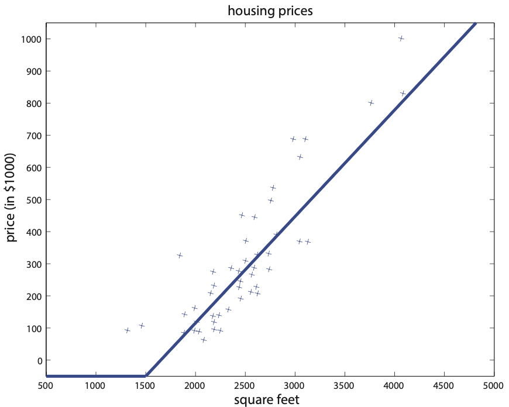
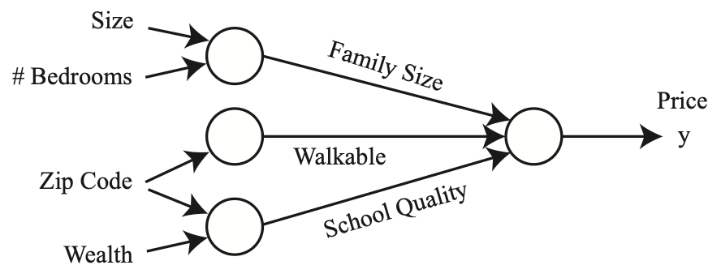
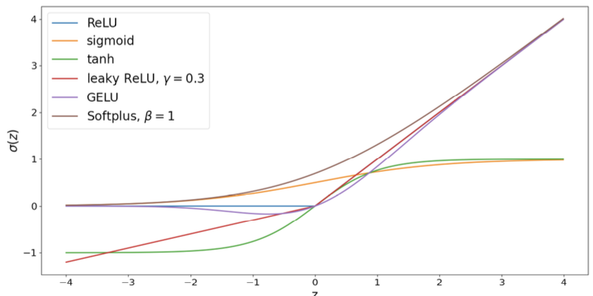

# 7.2 Neural Networks

Neural networks are a powerful class of models that can represent a wide variety of non-linear relationships between inputs and outputs. At their core, neural networks are built from simple mathematical operations—primarily matrix multiplications and non-linear functions—stacked together in layers. This layered structure allows neural networks to learn complex patterns in data that are difficult or impossible for traditional linear models to capture.

To unify the treatment of regression and classification problems, we consider the output of a neural network as $`\hat{h}_\theta(x)`$. For regression, $`h_\theta(x) = \hat{h}_\theta(x)`$ is the predicted value. For classification, $`\hat{h}_\theta(x)`$ is often called the "logits" and is passed through a non-linear function (like the sigmoid or softmax) to produce probabilities:

```math
h_\theta(x) = \frac{1}{1+\exp(-\hat{h}_\theta(x))} \quad \text{(binary classification)}
```

```math
h_\theta(x) = \text{softmax}(\hat{h}_\theta(x)) \quad \text{(multi-class classification)}
```

We will start with the simplest possible neural network and gradually build up to more complex architectures, providing intuition and practical code along the way.

## A Neural Network with a Single Neuron

Let's revisit the classic housing price regression problem: given the size of a house, predict its price. In traditional linear regression, we fit a straight line to the data. However, this can lead to nonsensical predictions, such as negative house prices. To address this, we can use a simple neural network with a single neuron and a non-linear activation function.

**Conceptual Intuition:**
- Think of a single neuron as a tiny decision-maker. It takes the input (e.g., house size), multiplies it by a weight, adds a bias, and then applies a non-linear function (activation) to produce the output.
- The non-linearity (e.g., ReLU) allows the neuron to model relationships that aren't just straight lines. For example, it can "clip" negative predictions to zero, which makes sense for prices.

**Mathematical Formulation:**

```math
\hat{h}_\theta(x) = \max(wx + b, 0), \quad \text{where } \theta = (w, b),\; \theta \in \mathbb{R}^2
```

Here, $`w`$ is the weight (how much the input matters), and $`b`$ is the bias (the baseline prediction). The $`\max`$ function is called the ReLU (Rectified Linear Unit) activation, which outputs zero for negative values and the input itself for positive values.

When the input $`x \in \mathbb{R}^d`$ has multiple dimensions, a neural network with a single neuron can be written as:

```math
\hat{h}_\theta(x) = \text{ReLU}(w^\top x + b), \quad \text{where } w \in \mathbb{R}^d,\; b \in \mathbb{R},\; \theta = (w, b)
```



*Figure 7.1: Housing prices with a "kink" in the graph.*

**Practical Code Example (Single Neuron Regression with ReLU):**

```python
import numpy as np
import matplotlib.pyplot as plt

# Generate some example data: house sizes and prices
np.random.seed(0)
x = np.linspace(500, 3500, 50)  # house sizes
true_w, true_b = 0.3, 50
noise = np.random.normal(0, 30, size=x.shape)
y = np.maximum(true_w * x + true_b + noise, 0)  # true prices, clipped at 0

# Initialize parameters
w, b = 0.1, 0.0
learning_rate = 1e-7

# Training loop (simple gradient descent)
for epoch in range(1000):
    y_pred = np.maximum(w * x + b, 0)  # ReLU activation
    error = y_pred - y
    grad_w = np.mean(error * (x * (y_pred > 0)))
    grad_b = np.mean(error * (y_pred > 0))
    w -= learning_rate * grad_w
    b -= learning_rate * grad_b

# Plot results
plt.scatter(x, y, label='Data')
plt.plot(x, np.maximum(w * x + b, 0), color='red', label='Single Neuron Fit')
plt.xlabel('House Size')
plt.ylabel('Price')
plt.legend()
plt.title('Single Neuron Regression with ReLU')
plt.show()
```

**Key Takeaways:**
- A single neuron with a non-linear activation can already model more realistic relationships than a plain linear model.
- The parameters $`w`$ and $`b`$ are learned from data using optimization (e.g., gradient descent).
- The activation function (like ReLU) is crucial for introducing non-linearity and making the model more flexible.

## Stacking Neurons: Building More Complex Networks

While a single neuron can model simple non-linear relationships, real-world data often requires more complex models. By stacking neurons—connecting the output of one neuron as the input to another—we can build networks that learn much richer functions.

**Conceptual Intuition:**
- Think of stacking neurons like stacking Lego bricks: each layer can build on the features learned by the previous layer, allowing the network to capture more complex patterns.
- The first layer might learn simple features (e.g., "size" or "number of bedrooms"), while the next layer can combine these to learn more abstract features (e.g., "family size" or "walkability").
- Each neuron in a new layer can use all outputs from the previous layer, enabling the network to mix and match features in creative ways.

**Mathematical Example:**
Suppose we have four input features: size, number of bedrooms, zip code, and wealth. We can define intermediate features (hidden neurons):

```math
a_1 = \text{ReLU}(\theta_1 x_1 + \theta_2 x_2 + \theta_3)
a_2 = \text{ReLU}(\theta_4 x_3 + \theta_5)
a_3 = \text{ReLU}(\theta_6 x_3 + \theta_7 x_4 + \theta_8)
```

The final output is:

```math
\hat{h}_\theta(x) = \theta_9 a_1 + \theta_{10} a_2 + \theta_{11} a_3 + \theta_{12}
```



*Figure 7.2: Diagram of a small neural network for predicting housing prices.*

**Why does stacking help?**
- A single neuron with a non-linear activation can only create a single "kink" or threshold in the data (like a piecewise linear function with one bend).
- By stacking layers, the network can create multiple bends, curves, and more intricate shapes, allowing it to fit much more complex data.

**Practical Code Example (Two-Layer Neural Network in Numpy):**

```python
import numpy as np
import matplotlib.pyplot as plt

# Example data: house size, bedrooms, zip code, wealth (4 features)
np.random.seed(1)
X = np.random.rand(100, 4)  # 100 houses, 4 features each
true_w1 = np.array([2.0, 1.5, 0.5, 1.0])
true_b1 = 0.5
hidden = np.maximum(X @ true_w1 + true_b1, 0)  # First layer (ReLU)
true_w2 = 3.0
true_b2 = 2.0
y = true_w2 * hidden + true_b2 + np.random.normal(0, 0.5, size=hidden.shape)  # Output

# Initialize parameters for a two-layer network
w1 = np.random.randn(4)
b1 = 0.0
w2 = 1.0
b2 = 0.0
lr = 0.05

# Training loop
for epoch in range(500):
    # Forward pass
    z1 = X @ w1 + b1
    a1 = np.maximum(z1, 0)  # ReLU
    y_pred = w2 * a1 + b2
    # Compute loss (MSE)
    loss = np.mean((y_pred - y) ** 2)
    # Backpropagation (manual gradients)
    grad_y_pred = 2 * (y_pred - y) / len(y)
    grad_w2 = np.sum(grad_y_pred * a1)
    grad_b2 = np.sum(grad_y_pred)
    grad_a1 = grad_y_pred * w2
    grad_z1 = grad_a1 * (z1 > 0)
    grad_w1 = grad_z1.T @ X
    grad_b1 = np.sum(grad_z1)
    # Update parameters
    w1 -= lr * grad_w1
    b1 -= lr * grad_b1
    w2 -= lr * grad_w2
    b2 -= lr * grad_b2
    if epoch % 100 == 0:
        print(f"Epoch {epoch}, Loss: {loss:.4f}")

# Visualize predictions vs. true values
plt.scatter(y, y_pred)
plt.xlabel('True Price')
plt.ylabel('Predicted Price')
plt.title('Two-Layer Neural Network Predictions')
plt.plot([y.min(), y.max()], [y.min(), y.max()], 'r--')
plt.show()
```

**Key Takeaways:**
- Stacking neurons (layers) allows the network to learn more complex, hierarchical features.
- Each layer transforms the data, enabling the next layer to build on top of previous features.
- Even with just two layers, the network can fit much more complicated relationships than a single neuron.

## Inspiration from Biological Neural Networks

Neural networks are inspired by the structure and function of the human brain, but with important differences. Understanding this connection can help demystify why neural networks are called "neural" and why certain design choices are made.

**Conceptual Intuition:**
- In the brain, a neuron receives signals from other neurons, processes them, and sends an output signal to other neurons. The strength of these connections (synapses) can change, allowing the brain to learn.
- In artificial neural networks, each "neuron" is a mathematical function that takes inputs, multiplies them by weights (analogous to synapse strengths), adds a bias, and applies a non-linear activation function. The output is then passed to other neurons in the next layer.
- Learning in neural networks means adjusting the weights and biases so that the network produces the correct output for given inputs—just as the brain strengthens or weakens synapses based on experience.

**Practical Analogy:**
- Imagine a group of people (neurons) working together to solve a problem. Each person receives information from others, processes it in their own way, and passes their conclusion to the next group. Over time, the group learns to solve the problem more efficiently by adjusting how much they trust each other's input (changing the weights).

**Key Points:**
- The "neurons" in artificial neural networks are much simpler than biological neurons, but the inspiration comes from the idea of learning by adjusting connections.
- The activation function (like ReLU) in artificial neurons is a simplified version of how biological neurons "fire" only when their input exceeds a certain threshold.
- While the analogy is helpful, modern neural networks are designed for mathematical convenience and computational efficiency, not to perfectly mimic the brain.

**Why This Matters:**
- Understanding the biological inspiration can help you remember why neural networks are structured in layers and why learning involves adjusting weights.
- However, don't get too caught up in the analogy—artificial neural networks are powerful because of their mathematical properties and ability to approximate complex functions, not because they are perfect models of the brain.

## Two-layer Fully-Connected Neural Networks

A two-layer fully-connected neural network is the simplest example of a "deep" neural network. It consists of an input layer, one hidden layer (with multiple neurons), and an output layer. Each neuron in the hidden layer receives all the input features, and the output neuron receives all the hidden layer outputs.

**Mathematical Formulation:**

```math
a_1 = \text{ReLU}(w_1^\top x + b_1), \quad w_1 \in \mathbb{R}^4, b_1 \in \mathbb{R}
a_2 = \text{ReLU}(w_2^\top x + b_2), \quad w_2 \in \mathbb{R}^4, b_2 \in \mathbb{R}
a_3 = \text{ReLU}(w_3^\top x + b_3), \quad w_3 \in \mathbb{R}^4, b_3 \in \mathbb{R}
```

The output is:

```math
\hat{h}_\theta(x) = w^{[2]}_1 a_1 + w^{[2]}_2 a_2 + w^{[2]}_3 a_3 + b^{[2]}
```

For a general two-layer network with $`m`$ hidden units and $`d`$-dimensional input $`x \in \mathbb{R}^d`$:

```math
\forall j \in [1, ..., m], \quad z_j = {w_j^{[1]}}^\top x + b_j^{[1]}, \quad w_j^{[1]} \in \mathbb{R}^d, b_j^{[1]} \in \mathbb{R}
a_j = \text{ReLU}(z_j)
a = [a_1, \ldots, a_m]^\top \in \mathbb{R}^m
\hat{h}_\theta(x) = {w^{[2]}}^\top a + b^{[2]}, \quad w^{[2]} \in \mathbb{R}^m, b^{[2]} \in \mathbb{R}
```

**Practical Code Example (Two-Layer Fully-Connected Network in Numpy):**

```python
import numpy as np
import matplotlib.pyplot as plt

# Example data: 4 input features, 1 output
np.random.seed(42)
X = np.random.rand(200, 4)
true_W1 = np.array([[1.2, -0.7, 0.5, 2.0],
                   [0.3, 1.5, -1.0, 0.7],
                   [2.0, 0.1, 0.3, -0.5]])  # 3 hidden neurons
true_b1 = np.array([0.5, -0.2, 0.1])
H = np.maximum(X @ true_W1.T + true_b1, 0)  # Hidden layer (ReLU)
true_W2 = np.array([1.0, -2.0, 0.5])
true_b2 = 0.3
y = H @ true_W2 + true_b2 + np.random.normal(0, 0.2, size=H.shape[0])

# Initialize parameters
W1 = np.random.randn(3, 4)
b1 = np.zeros(3)
W2 = np.random.randn(3)
b2 = 0.0
lr = 0.05

# Training loop
for epoch in range(600):
    # Forward pass
    Z1 = X @ W1.T + b1
    A1 = np.maximum(Z1, 0)  # ReLU
    y_pred = A1 @ W2 + b2
    # Loss (MSE)
    loss = np.mean((y_pred - y) ** 2)
    # Backpropagation
    grad_y_pred = 2 * (y_pred - y) / len(y)
    grad_W2 = A1.T @ grad_y_pred
    grad_b2 = np.sum(grad_y_pred)
    grad_A1 = np.outer(grad_y_pred, W2)
    grad_Z1 = grad_A1 * (Z1 > 0)
    grad_W1 = grad_Z1.T @ X
    grad_b1 = np.sum(grad_Z1, axis=0)
    # Update
    W1 -= lr * grad_W1
    b1 -= lr * grad_b1
    W2 -= lr * grad_W2
    b2 -= lr * grad_b2
    if epoch % 100 == 0:
        print(f"Epoch {epoch}, Loss: {loss:.4f}")

# Visualize predictions vs. true values
plt.scatter(y, y_pred, alpha=0.6)
plt.xlabel('True Value')
plt.ylabel('Predicted Value')
plt.title('Two-Layer Fully-Connected Neural Network')
plt.plot([y.min(), y.max()], [y.min(), y.max()], 'r--')
plt.show()
```

**Key Takeaways:**
- A two-layer fully-connected network can learn to extract useful features from raw data, without hand-crafting them.
- Each neuron in the hidden layer acts as a feature detector, and the output layer combines these features to make predictions.
- This approach is much more flexible and powerful than manually designing features, especially for complex or high-dimensional data.

## Vectorization: Efficient Computation for Neural Networks

We vectorize the two-layer fully-connected neural network as below. We define a weight matrix $`W^{[1]}`$ in $`\mathbb{R}^{m \times d}`$ as the concatenation of all the vectors $`w_j^{[1]}`$'s in the following way:

```math
W^{[1]} = \begin{bmatrix}
  - {w_1^{[1]}}^\top - \\
  - {w_2^{[1]}}^\top - \\
  \vdots \\
  - {w_m^{[1]}}^\top -
\end{bmatrix} \in \mathbb{R}^{m \times d}
```

Now by the definition of matrix vector multiplication, we can write $`z = [z_1, \ldots, z_m]^\top \in \mathbb{R}^m`$ as

```math
\begin{bmatrix}
  z_1 \\
  \vdots \\
  z_m
\end{bmatrix}
= 
\begin{bmatrix}
  - {w_1^{[1]}}^\top - \\
  - {w_2^{[1]}}^\top - \\
  \vdots \\
  - {w_m^{[1]}}^\top -
\end{bmatrix}
\begin{bmatrix}
  x_1 \\
  x_2 \\
  \vdots \\
  x_d
\end{bmatrix}
+
\begin{bmatrix}
  b_1^{[1]} \\
  b_2^{[1]} \\
  \vdots \\
  b_m^{[1]}
\end{bmatrix}
```

Or succinctly,

```math
z = W^{[1]} x + b^{[1]}
```

Computing the activations $`a \in \mathbb{R}^m`$ from $`z \in \mathbb{R}^m`$ involves an element-wise non-linear application of the ReLU function:

```math
a = \text{ReLU}(z)
```

Define $`W^{[2]} = \left[w^{[2]}\right]^\top \in \mathbb{R}^{1 \times m}`$ similarly. Then, the model can be summarized as:

```math
a = \text{ReLU}(W^{[1]}x + b^{[1]})
\hat{h}_\theta(x) = W^{[2]}a + b^{[2]}
```

**Practical Code Example: For-loop vs. Vectorized Layer**

```python
import numpy as np

# Example: 1000 data points, 4 input features, 3 output neurons
np.random.seed(0)
X = np.random.rand(1000, 4)
W = np.random.randn(3, 4)
b = np.random.randn(3)

# For-loop implementation (slow)
outputs_loop = np.zeros((1000, 3))
for i in range(1000):
    for j in range(3):
        outputs_loop[i, j] = np.dot(W[j], X[i]) + b[j]

# Vectorized implementation (fast)
outputs_vec = X @ W.T + b  # shape: (1000, 3)

# Check that the results are (almost) the same
print('Difference:', np.abs(outputs_loop - outputs_vec).max())
```

## Multi-layer Fully-Connected Neural Networks (Deep Learning)

A multi-layer (or "deep") fully-connected neural network is simply a stack of several layers, where each layer learns to transform the data in increasingly abstract ways. This is the foundation of deep learning.

**Mathematical Formulation:**

For a network with $`r`$ layers:

```math
a^{[1]} = \text{ReLU}(W^{[1]}x + b^{[1]})
a^{[2]} = \text{ReLU}(W^{[2]}a^{[1]} + b^{[2]})
\ldots
a^{[r-1]} = \text{ReLU}(W^{[r-1]}a^{[r-2]} + b^{[r-1]})
\hat{h}_\theta(x) = W^{[r]}a^{[r-1]} + b^{[r]}
```

Or recursively:

```math
a^{[k]} = \text{ReLU}(W^{[k]}a^{[k-1]} + b^{[k]}), \forall k = 1, \ldots, r-1
```

**Practical Code Example (Multi-layer Neural Network in Numpy):**

```python
import numpy as np
import matplotlib.pyplot as plt

# Example: 4 input features, 2 hidden layers (5 and 3 neurons), 1 output
np.random.seed(123)
X = np.random.rand(300, 4)
true_W1 = np.random.randn(5, 4)
true_b1 = np.random.randn(5)
true_W2 = np.random.randn(3, 5)
true_b2 = np.random.randn(3)
true_W3 = np.random.randn(3)
true_b3 = 0.5

# True function (unknown to the network)
H1 = np.maximum(X @ true_W1.T + true_b1, 0)
H2 = np.maximum(H1 @ true_W2.T + true_b2, 0)
y = H2 @ true_W3 + true_b3 + np.random.normal(0, 0.2, size=H2.shape[0])

# Initialize parameters
W1 = np.random.randn(5, 4)
b1 = np.zeros(5)
W2 = np.random.randn(3, 5)
b2 = np.zeros(3)
W3 = np.random.randn(3)
b3 = 0.0
lr = 0.03

# Training loop
for epoch in range(800):
    # Forward pass
    Z1 = X @ W1.T + b1
    A1 = np.maximum(Z1, 0)
    Z2 = A1 @ W2.T + b2
    A2 = np.maximum(Z2, 0)
    y_pred = A2 @ W3 + b3
    # Loss (MSE)
    loss = np.mean((y_pred - y) ** 2)
    # Backpropagation
    grad_y_pred = 2 * (y_pred - y) / len(y)
    grad_W3 = A2.T @ grad_y_pred
    grad_b3 = np.sum(grad_y_pred)
    grad_A2 = np.outer(grad_y_pred, W3)
    grad_Z2 = grad_A2 * (Z2 > 0)
    grad_W2 = grad_Z2.T @ A1
    grad_b2 = np.sum(grad_Z2, axis=0)
    grad_A1 = grad_Z2 @ W2
    grad_Z1 = grad_A1 * (Z1 > 0)
    grad_W1 = grad_Z1.T @ X
    grad_b1 = np.sum(grad_Z1, axis=0)
    # Update
    W1 -= lr * grad_W1
    b1 -= lr * grad_b1
    W2 -= lr * grad_W2
    b2 -= lr * grad_b2
    W3 -= lr * grad_W3
    b3 -= lr * grad_b3
    if epoch % 200 == 0:
        print(f"Epoch {epoch}, Loss: {loss:.4f}")

# Visualize predictions vs. true values
plt.scatter(y, y_pred, alpha=0.6)
plt.xlabel('True Value')
plt.ylabel('Predicted Value')
plt.title('Multi-layer (Deep) Neural Network')
plt.plot([y.min(), y.max()], [y.min(), y.max()], 'r--')
plt.show()
```

**Key Takeaways:**
- Deep (multi-layer) networks can learn highly complex, hierarchical representations of data.
- Each additional layer allows the network to build on previous features, enabling it to solve more difficult problems.
- In practice, most state-of-the-art models in vision, language, and speech are deep neural networks with many layers.

## Other Activation Functions

The activation function is a crucial component of a neural network. It introduces non-linearity, allowing the network to learn complex relationships. While ReLU is the most popular, there are many other activation functions, each with its own strengths and weaknesses.

**Common Activation Functions:**

```math
\sigma(z) = \frac{1}{1 + e^{-z}} \quad \text{(sigmoid)}
```

```math
\sigma(z) = \frac{e^{z} - e^{-z}}{e^{z} + e^{-z}} \quad \text{(tanh)}
```

```math
\sigma(z) = \max\{z, \gamma z\},\; \gamma \in (0, 1) \quad \text{(leaky ReLU)}
```

```math
\sigma(z) = \frac{z}{2} \left[1 + \operatorname{erf}\left(\frac{z}{\sqrt{2}}\right)\right] \quad \text{(GELU)}
```

```math
\sigma(z) = \frac{1}{\beta} \log(1 + \exp(\beta z)),\; \beta > 0 \quad \text{(Softplus)}
```



*Figure 7.3: Activation functions in deep learning.*

**Practical Code Example: Comparing Activation Functions**

```python
import numpy as np
import matplotlib.pyplot as plt
from scipy.special import erf

z = np.linspace(-4, 4, 200)
relu = np.maximum(0, z)
sigmoid = 1 / (1 + np.exp(-z))
tanh = np.tanh(z)
leaky_relu = np.where(z > 0, z, 0.1 * z)
gelu = 0.5 * z * (1 + erf(z / np.sqrt(2)))
softplus = np.log(1 + np.exp(z))

plt.figure(figsize=(8, 5))
plt.plot(z, relu, label='ReLU')
plt.plot(z, sigmoid, label='Sigmoid')
plt.plot(z, tanh, label='Tanh')
plt.plot(z, leaky_relu, label='Leaky ReLU')
plt.plot(z, gelu, label='GELU')
plt.plot(z, softplus, label='Softplus')
plt.legend()
plt.title('Common Activation Functions')
plt.xlabel('z')
plt.ylabel('Activation')
plt.grid(True)
plt.show()
```

**When to use which activation?**
- **ReLU:** Default for hidden layers in most modern networks. Simple and effective.
- **Sigmoid:** Use for binary classification output (last layer only).
- **Tanh:** Sometimes used in hidden layers, but less common than ReLU.
- **Leaky ReLU:** Use if you notice "dead" neurons with ReLU (outputs stuck at zero).
- **GELU:** Preferred in some state-of-the-art NLP models.
- **Softplus:** Rarely used, but can be helpful if you want a smooth version of ReLU.

**Key Takeaways:**
- The activation function is what makes neural networks powerful and flexible.
- Try ReLU first for hidden layers, and experiment with others if you run into issues like vanishing gradients or dead neurons.

## Connection to the Kernel Method

Neural networks and kernel methods both aim to model complex, non-linear relationships between inputs and outputs. However, they do so in fundamentally different ways.

**Mathematical Formulation:**

Suppose $`\sigma(z) = z`$, then for a two-layer neural network, we have:

```math
\hat{h}_\theta(x) = W^{[2]}a^{[1]}
= W^{[2]}z^{[1]}
= W^{[2]}W^{[1]}x
= \tilde{W}x, \quad \text{where } \tilde{W} = W^{[2]}W^{[1]}
```

This shows that without non-linear activation functions, the neural network simply performs linear regression.

**Practical Code Example: Fixed Kernel vs. Learned Features**

```python
import numpy as np
import matplotlib.pyplot as plt
from sklearn.svm import SVC
from sklearn.neural_network import MLPClassifier
from sklearn.datasets import make_circles

# Generate a toy dataset
X, y = make_circles(n_samples=300, factor=0.5, noise=0.1, random_state=0)

# Kernel method: SVM with RBF kernel (fixed feature map)
svm = SVC(kernel='rbf', gamma=2)
svm.fit(X, y)

# Neural network: learns its own feature map
mlp = MLPClassifier(hidden_layer_sizes=(10, 10), activation='relu', max_iter=2000)
mlp.fit(X, y)

# Plot decision boundaries
xx, yy = np.meshgrid(np.linspace(-1.5, 1.5, 200), np.linspace(-1.5, 1.5, 200))
Z_svm = svm.predict(np.c_[xx.ravel(), yy.ravel()]).reshape(xx.shape)
Z_mlp = mlp.predict(np.c_[xx.ravel(), yy.ravel()]).reshape(xx.shape)

plt.figure(figsize=(12, 5))
plt.subplot(1, 2, 1)
plt.contourf(xx, yy, Z_svm, alpha=0.3)
plt.scatter(X[:, 0], X[:, 1], c=y, cmap='bwr', edgecolor='k')
plt.title('SVM with RBF Kernel (Fixed Feature Map)')
plt.subplot(1, 2, 2)
plt.contourf(xx, yy, Z_mlp, alpha=0.3)
plt.scatter(X[:, 0], X[:, 1], c=y, cmap='bwr', edgecolor='k')
plt.title('Neural Network (Learned Feature Map)')
plt.show()
```

**Key Takeaways:**
- Kernel methods rely on hand-crafted feature maps, while neural networks learn the feature map from data.
- Neural networks can adapt to new data and tasks more easily, making them more powerful for many real-world problems.
- However, kernel methods can still be very effective for small datasets or when you have strong domain knowledge about the right features.
