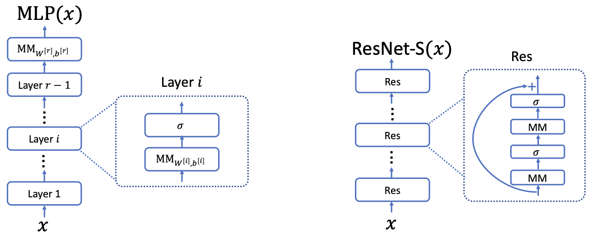

# 7.3 Modules in Modern Neural Networks

The multi-layer neural network introduced in equation $`7.22`$ of Section $`7.2`$ is often called multi-layer perceptron (MLP) these days. Modern neural networks used in practice are often much more complex and consist of multiple building blocks or multiple layers of building blocks. In this section, we will introduce some of the other building blocks and discuss possible ways to combine them.

First, each matrix multiplication can be viewed as a building block. Consider a matrix multiplication operation with parameters $`(W, b)`$ where $`W`$ is the weight matrix and $`b`$ is the bias vector, operating on an input $`z`$,

```math
\mathrm{MM}_{W, b}(z) = Wz + b. \tag{7.35}
```

Note that we implicitly assume all the dimensions are chosen to be compatible. We will also drop the subscripts under MM when they are clear in the context or just for convenience when they are not essential to the discussion.

Then, the MLP can be written as a composition of multiple matrix multiplication modules and nonlinear activation modules (which can also be viewed as a building block):

```math
\mathrm{MLP}(x) = \mathrm{MM}_{W^{[L]}, b^{[L]}}(\sigma(\mathrm{MM}_{W^{[L-1]}, b^{[L-1]}}(\cdots \mathrm{MM}_{W^{[1]}, b^{[1]}}(x))\cdots)). \tag{7.36}
```

Alternatively, when we drop the subscripts that indicate the parameters for convenience, we can write

```math
\mathrm{MLP}(x) = \mathrm{MM}(\sigma(\mathrm{MM}(\cdots \mathrm{MM}(x)))). \tag{7.37}
```

Note that in this lecture notes, by default, all the modules have different sets of parameters, and the dimensions of the parameters are chosen such that the composition is meaningful.

Larger modules can be defined via smaller modules as well, e.g., one activation layer $`\sigma`$ and a matrix multiplication layer MM are often combined and called a "layer" in many papers. People often draw the architecture with the blocks in the figure by indicating the dependency between these modules. E.g., see an illustration of an MLP in Figure $`7.4`$ (Left).

**Residual connections.** One of the very influential neural network architecture for vision application is ResNet, which uses the residual connections that are essentially used in almost all large-scale deep learning architectures these days. Using our notation above, a very much simplified residual block can be defined as

```math
\mathrm{Res}(z) = z + \sigma(\mathrm{MM}_1(\sigma(\mathrm{MM}_2(z)))). \tag{7.38}
```

A much simplified ResNet is a composition of many residual blocks followed by a matrix multiplication,

```math
\mathrm{ResNet}\text{-}\mathcal{S}(x) = \mathrm{MM}(\mathrm{Res}(\mathrm{Res}(\cdots \mathrm{Res}(x)))). \tag{7.39}
```



Figure 7.4: Illustrative Figures for Architecture. **Left:** An MLP with $`r`$ layers. **Right:** A residual network.

We also draw the dependency of these modules in Figure $`7.4`$, Right.

We note that the ResNet-S is still not the same as the ResNet architecture introduced in the seminal paper [He et al., 2016] because ResNet uses convolution layers instead of vanilla matrix multiplication, and adds batch normalization between convolutions and activations. We will introduce convolutional layers and some variants of batch normalization below. ResNet-S and layer normalization are part of the Transformer architecture that are widely used in modern large language models.

## Layer normalization

Layer normalization, denoted by LN in this text, is a module that maps a vector $`z \in \mathbb{R}^m`$ to a more normalized vector $`\mathrm{LN}(z) \in \mathbb{R}^m`$. It is oftentimes used after the nonlinear activations.

We first define a sub-module of the layer normalization, denoted by LN-S.

```math
\mathrm{LN\text{-}S}(z) = \begin{bmatrix}
\frac{z_1 - \hat{\mu}}{\hat{\sigma}} \\
\frac{z_2 - \hat{\mu}}{\hat{\sigma}} \\
\vdots \\
\frac{z_m - \hat{\mu}}{\hat{\sigma}}
\end{bmatrix}, \tag{7.40}
```

where $`\hat{\mu} = \frac{\sum_{i=1}^m z_i}{m}`$ is the empirical mean of the vector $`z`$ and $`\hat{\sigma} = \sqrt{\frac{\sum_{i=1}^m (z_i - \hat{\mu})^2}{m}}`$ is the empirical standard deviation of the entries of $`z`$. Intuitively, $`\mathrm{LN\text{-}S}(z)`$ is a vector that is normalized to having empirical mean zero and empirical standard deviation $`1`$.

> Note that we divide by $`m`$ instead of $`m-1`$ in the empirical standard deviation here because we are interested in making the output of $`\mathrm{LN\text{-}S}(z)`$ have sum of squares equal to $`1`$ (as opposed to estimating the standard deviation in statistics.)

Oftentimes zero mean and standard deviation $`1`$ is not the most desired normalization scheme, and thus layernorm introduces to parameters learnable scalars $`\beta`$ and $`\gamma`$ as the desired mean and standard deviation, and use an affine transformation to turn the output of $`\mathrm{LN\text{-}S}(z)`$ into a vector with mean $`\beta`$ and standard deviation $`\gamma`$.

```math
\mathrm{LN}(z) = \beta + \gamma \cdot \mathrm{LN\text{-}S}(z) = \begin{bmatrix}
\beta + \gamma \left(\frac{z_1 - \hat{\mu}}{\hat{\sigma}}\right) \\
\beta + \gamma \left(\frac{z_2 - \hat{\mu}}{\hat{\sigma}}\right) \\
\vdots \\
\beta + \gamma \left(\frac{z_m - \hat{\mu}}{\hat{\sigma}}\right)
\end{bmatrix}. \tag{7.41}
```

Here the first occurrence of $`\beta`$ should be technically interpreted as a vector with all the entries being $`\beta`$. We also note that if $`\beta`$ and $`\gamma`$ are also functions of $`z`$ and shouldn't be treated as constants when computing the derivatives of layernorm. Moreover, $`\beta`$ and $`\gamma`$ are learnable parameters and thus layernorm is a parameterized module (as opposed to the activation layer which doesn't have any parameters).

### Scaling-invariant property

One important property of layer normalization is that it will make the model invariant to scaling of the parameters in the following sense. Suppose we consider composing LN with matrix multiplication and get a subnetwork $`\mathrm{LN}(\mathrm{MM}_{W, b}(z))`$. Then, we have that the output of this subnetwork does not change when only the parameter in $`\mathrm{MM}_{W, b}`$ is scaled:

```math
\mathrm{LN}(\mathrm{MM}_{aW, ab}(z)) = \mathrm{LN}(\mathrm{MM}_{W, b}(z)), \forall a \neq 0. \tag{7.42}
```

To see this, we first know that LN-S($`\cdot`$) is scale-invariant:

```math
\mathrm{LN\text{-}S}(\alpha z) = \begin{bmatrix}
\frac{\alpha z_1 - \alpha \hat{\mu}}{\alpha \hat{\sigma}} \\
\frac{\alpha z_2 - \alpha \hat{\mu}}{\alpha \hat{\sigma}} \\
\vdots \\
\frac{\alpha z_m - \alpha \hat{\mu}}{\alpha \hat{\sigma}}
\end{bmatrix} = \begin{bmatrix}
\frac{z_1 - \hat{\mu}}{\hat{\sigma}} \\
\frac{z_2 - \hat{\mu}}{\hat{\sigma}} \\
\vdots \\
\frac{z_m - \hat{\mu}}{\hat{\sigma}}
\end{bmatrix} = \mathrm{LN\text{-}S}(z). \tag{7.43}
```

**Explanation:**
- Multiplying all elements of $`z`$ by a constant $`\alpha`$ also multiplies the mean $`\hat{\mu}`$ and standard deviation $`\hat{\sigma}`$ by $`\alpha`$.
- In the normalization formula, $`\alpha`$ cancels out in the numerator and denominator, so the output is unchanged.
- This shows that LN-S is invariant to scaling of its input.

Then we have:

```math
\begin{align*}
\mathrm{LN}(\mathrm{MM}_{aW, ab}(z)) &= \beta + \gamma \mathrm{LN\text{-}S}(\mathrm{MM}_{aW, ab}(z)) \tag{7.44} \\
&= \beta + \gamma \mathrm{LN\text{-}S}(a\mathrm{MM}_{W, b}(z)) \tag{7.45} \\
&= \beta + \gamma \mathrm{LN\text{-}S}(\mathrm{MM}_{W, b}(z)) \tag{7.46} \\
&= \mathrm{LN}(\mathrm{MM}_{W, b}(z)). \tag{7.47}
\end{align*}
```

**Explanation:**
- (7.44): Apply LN to a matrix multiplication with weights scaled by $`a`$ and bias by $`a`$.
- (7.45): Factor out $`a`$ from the matrix multiplication.
- (7.46): Use the scale-invariance property of LN-S (from 7.43) to remove $`a`$.
- (7.47): The result is the same as applying LN to the unscaled matrix multiplication.
- **Intuition:** Scaling the weights and biases before layer normalization does not affect the output, so the network is robust to such rescaling.

Due to this property, most of the modern DL architectures for large-scale computer vision and language applications have the following scale-invariant property w.r.t. all the weights that are not at the last layer. Suppose the network $`f`$ has last layer' weights $`W_{\text{last}}`$, and all the rest of the weights are denote by $`W`$. Then, we have $`f_{W_{\text{last}}, aW}(x) = f_{W_{\text{last}}, W}(x)`$ for all $`a > 0`$. Here, the last layers weights are special because there are typically no layernorm or batchnorm after the last layer's weights.

### Other normalization layers

There are several other normalization layers that aim to normalize the intermediate layers of the neural networks to a more fixed and controllable scaling, such as batch-normalization, and group normalization. Batch normalization and group normalization are more often used in computer vision applications whereas layer norm is used more often in language applications.

## Convolutional Layers

Convolutional Neural Networks are neural networks that consist of convolution layers (and many other modules), and are particularly useful for computer vision applications. For the simplicity of exposition, we focus on 1-D convolution in this text and only briefly mention 2-D convolution informally at the end of this subsection. (2-D convolution is more suitable for images which have two dimensions. 1-D convolution is also used in natural language processing.)

We start by introducing a simplified version of the 1-D convolution layer, denoted by Conv1D-S($`\cdot`$) which is a type of matrix multiplication layer with a special structure. The parameters of Conv1D-S are a filter vector $`w \in \mathbb{R}^k`$ where $`k`$ is called the filter size (oftentimes $`k \ll m`$), and a bias scalar $`b`$. Oftentimes the filter is also called a kernel (but it does not have much to do with the kernel in kernel method). For simplicity, we assume $`k = 2\ell + 1`$ is an odd number. We first pad zeros to the input vector $`x`$ in the sense that we let $`z_{-\ell} = z_{-\ell+1} = \ldots = z_0 = 0`$ and $`z_{m+1} = z_{m+2} = \ldots = z_{m+\ell} = 0`$, and treat $`z`$ as an $`(m + 2\ell)`$-dimension vector. Conv1D-S outputs a vector of dimension $`\mathbb{R}^m`$ where each output dimension is a linear combination of subsets of $`z_j`$'s with coefficients from $`w`$,

```math
\mathrm{Conv1D\text{-}S}(z)_i = w_1 z_{i-\ell} + w_2 z_{i-\ell+1} + \cdots + w_{2\ell+1} z_{i+\ell} = \sum_{j=1}^{2\ell+1} w_j z_{i-\ell+(j-1)}. \tag{7.48}
```

Therefore, one can view Conv1D-S as a matrix multiplication with shared weights.

The parameters: Conv1D-S($`z`$) = $`Qz`$, where

```math
Q = \begin{bmatrix}
w_1 & \cdots & w_{2\ell+1} & 0 & \cdots & 0 & 0 \\
0 & w_1 & \cdots & w_{2\ell+1} & 0 & \cdots & 0 \\
\vdots & & & & & & \vdots \\
0 & \cdots & 0 & w_1 & \cdots & w_{2\ell+1}
\end{bmatrix} \tag{7.49}
```

**Explanation:**
- $`Q`$ is a special matrix that implements the convolution operation as a matrix multiplication.
- Each row of $`Q`$ contains the filter weights $`w_1, \ldots, w_{2\ell+1}`$, shifted to align with the appropriate input positions.
- The structure $`Q_{i,j} = Q_{i-1,j-1}`$ means the same filter is applied at every position (parameter sharing).
- This reduces the number of parameters from $`m^2`$ (for a generic matrix) to $`k`$ (the filter size), making convolution much more efficient.

Note that $`Q_{i,j} = Q_{i-1,j-1}`$ for all $`i, j \in \{2, \ldots, m\}`$, and thus convolution is a matrix multiplication with parameter sharing. We also note that computing the convolution only takes $`O(km)`$ times but computing a generic matrix multiplication takes $`O(m^2)`$ time. Convolution has $`k`$ parameters but generic matrix multiplication will have $`m^2`$ parameters. Thus convolution is supposed to be much more efficient than a generic matrix multiplication (as long as the additional structure imposed does not hurt the flexibility of the model to fit the data).

We also note that in practice there are many variants of the convolutional layers that we define here, e.g., there are other ways to pad zeros or sometimes the dimension of the output of the convolutional layers could be different from the input. We omit some of this subtleties here for simplicity.

The convolutional layers used in practice have also many "channels" and the simplified version above corresponds to the 1-channel version. Formally, Conv1D takes in $`C`$ vectors $`z_1, \ldots, z_C \in \mathbb{R}^m`$ as inputs, where $`C`$ is referred to as the number of channels. In other words, the more general version, denoted by Conv1D, takes in a matrix as input, which is the concatenation of $`z_1, \ldots, z_C`$ and has dimension $`m \times C`$. It can output $`C'`$ vectors of dimension $`m`$, denoted by Conv1D($`z_1`$), ..., Conv1D($`z_{C'}`$), where $`C'`$ is referred to as the output channel, or equivalently a matrix of dimension $`m \times C'`$. Each of the output is a sum of the simplified convolutions applied on various channels.

```math
\forall i \in [C'], \ \mathrm{Conv1D}(z)_i = \sum_{j=1}^C \mathrm{Conv1D\text{-}S}_{i,j}(z_j). \tag{7.50}
```

**Explanation:**
- $`z_1, \ldots, z_C`$ are the input channels (e.g., color channels in an image).
- For each output channel $`i`$, the output is a sum of convolutions of each input channel $`j`$ with its own filter (Conv1D-S $`_{i,j}`$).
- Each Conv1D-S $`_{i,j}`$ has its own parameters, so the total number of parameters is $`k \times C \times C'`$.
- This is much less than a fully connected layer, which would have $`m^2CC'`$ parameters.

Note that each Conv1D-S $`_{i,j}`$ are modules with different parameters, and thus the total number of parameters is $`k`$ (the number of parameters in a Conv1D-S) $`\times CC'`$ (the number of Conv1D-S $`_{i,j}`$'s) $`= kCC'`$. In contrast, a generic linear mapping from $`\mathbb{R}^{m \times C}`$ and $`\mathbb{R}^{m \times C'}`$ has $`m^2CC'`$ parameters. The parameters can also be represented as a three-dimensional tensor of dimension $`k \times C \times C'`$.

### 2-D convolution (brief)

A 2-D convolution with one channel, denoted by Conv2D-S, is analogous to the Conv1D-S, but takes a 2-dimensional input $`z \in \mathbb{R}^{m \times m}`$ and applies a filter of size $`k \times k`$, and outputs Conv2D-S($`z`$) $`\in \mathbb{R}^{m \times m}`$. The full 2-D convolutional layer, denoted by Conv2D, takes in a sequence of matrices $`z_1, \ldots, z_C \in \mathbb{R}^{m \times m}`$, or equivalently a 3-D tensor $`z = (z_1, \ldots, z_C) \in \mathbb{R}^{m \times m \times C}`$ and outputs a sequence of matrices, Conv2D($`z_1`$), ..., Conv2D($`z_{C'}`$) $`\in \mathbb{R}^{m \times m}`$, which can also be viewed as a 3D tensor in $`\mathbb{R}^{m \times m \times C'}`$. Each channel of the output is sum of the outcomes of applying Conv2D-S layers on all the input channels.

```math
\forall i \in [C'], \ \mathrm{Conv2D}(z)_i = \sum_{j=1}^C \mathrm{Conv2D\text{-}S}_{i,j}(z_j). \tag{7.51}
```

**Explanation:**
- $`z_1, \ldots, z_C`$ are 2D input channels (e.g., RGB image channels).
- Each output channel $`i`$ is a sum of 2D convolutions of each input channel $`j`$ with its own 2D filter.
- Each Conv2D-S $`_{i,j}`$ has $`k^2`$ parameters (for a $`k \times k`$ filter), so the total number of parameters is $`CC'k^2`$.
- The parameters can be viewed as a 4D tensor: input channels $`\times`$ output channels $`\times`$ filter height $`\times`$ filter width.

Because there are $`CC'`$ number of Conv2D-S modules and each of the Conv2D-S module has $`k^2`$ parameters, the total number of parameters is $`CC'k^2`$. The parameters can also be viewed as a 4D tensor of dimension $`C \times C' \times k \times k`$.

**Python implementation:**
```python
import numpy as np

def ln_s(z):
    """Layer normalization submodule LN-S: normalize to mean 0, std 1."""
    mu = np.mean(z)
    sigma = np.std(z, ddof=0)  # population std (divide by m)
    return (z - mu) / sigma
```

**Example usage:**
```python
# Example for ln_s
z = np.array([1.0, 2.0, 3.0, 4.0])
print("LN-S(z):", ln_s(z))
```

**Python implementation:**
```python
def ln(z, beta=0.0, gamma=1.0):
    """Layer normalization LN: affine transform after normalization."""
    return beta + gamma * ln_s(z)
```

**Example usage:**
```python
# Example for ln
z = np.array([1.0, 2.0, 3.0, 4.0])
beta = 0.5
gamma = 2.0
print("LN(z):", ln(z, beta, gamma))
```

**Python implementation:**
```python
def mm(x, W, b):
    """Matrix multiplication with bias: MM_{W, b}(x) = Wx + b."""
    return W @ x + b
```

**Example usage:**
```python
# Example for mm
x = np.array([1.0, 2.0])
W = np.array([[1.0, 0.5], [0.5, 1.0]])
b = np.array([0.1, -0.2])
print("MM_{W, b}(x):", mm(x, W, b))
```

**Python implementation:**
```python
def conv1d_s(z, w):
    """1D convolution (valid, zero-padded): filter w over input z."""
    k = len(w)
    l = (k - 1) // 2
    z_padded = np.pad(z, (l, l), mode='constant')
    m = len(z)
    out = np.zeros(m)
    for i in range(m):
        out[i] = np.dot(w, z_padded[i:i+k])
    return out
```

**Example usage:**
```python
# Example for conv1d_s
z = np.array([1.0, 2.0, 3.0, 4.0, 5.0])
w = np.array([0.2, 0.5, 0.2])
print("Conv1D-S(z):", conv1d_s(z, w))
```

**Python implementation:**
```python
def conv1d(z_list, w, C_out):
    """General 1D convolution with multiple input/output channels.
    z_list: list of C input arrays (each length m)
    w: weight tensor of shape (C_out, C_in, k)
    C_out: number of output channels
    Returns: list of C_out output arrays (each length m)
    """
    C_in = len(z_list)
    m = len(z_list[0])
    k = w.shape[2]
    out_list = []
    for i in range(C_out):
        out = np.zeros(m)
        for j in range(C_in):
            out += conv1d_s(z_list[j], w[i, j])
        out_list.append(out)
    return out_list
```

**Example usage:**
```python
# Example for conv1d
z_list = [np.array([1.0, 2.0, 3.0, 4.0]), np.array([0.5, 1.5, 2.5, 3.5])]
w = np.random.randn(2, 2, 3)  # (C_out=2, C_in=2, k=3)
C_out = 2
out_list = conv1d(z_list, w, C_out)
for i, out in enumerate(out_list):
    print(f"Conv1D output channel {i}: {out}")
```

**Python implementation:**
```python
def conv2d_s(z, w):
    """2D convolution (valid, zero-padded): filter w over input z."""
    k = w.shape[0]
    l = (k - 1) // 2
    z_padded = np.pad(z, ((l, l), (l, l)), mode='constant')
    m = z.shape[0]
    out = np.zeros((m, m))
    for i in range(m):
        for j in range(m):
            out[i, j] = np.sum(w * z_padded[i:i+k, j:j+k])
    return out
```

**Example usage:**
```python
# Example for conv2d_s
z = np.array([[1, 2, 3], [4, 5, 6], [7, 8, 9]])
w = np.array([[1, 0, -1], [1, 0, -1], [1, 0, -1]])
print("Conv2D-S(z):\n", conv2d_s(z, w))
```

**Python implementation:**
```python
def conv2d(z_list, w, C_out):
    """General 2D convolution with multiple input/output channels.
    z_list: list of C input matrices (each m x m)
    w: weight tensor of shape (C_out, C_in, k, k)
    C_out: number of output channels
    Returns: list of C_out output matrices (each m x m)
    """
    C_in = len(z_list)
    m = z_list[0].shape[0]
    k = w.shape[2]
    out_list = []
    for i in range(C_out):
        out = np.zeros((m, m))
        for j in range(C_in):
            out += conv2d_s(z_list[j], w[i, j])
        out_list.append(out)
    return out_list
```

**Example usage:**
```python
# Example for conv2d
z_list = [np.random.randn(5, 5), np.random.randn(5, 5)]  # C_in=2
w = np.random.randn(3, 2, 3, 3)  # (C_out=3, C_in=2, k=3, k=3)
C_out = 3
out_list = conv2d(z_list, w, C_out)
for i, out in enumerate(out_list):
    print(f"Conv2D output channel {i}:\n{out}\n")
```
