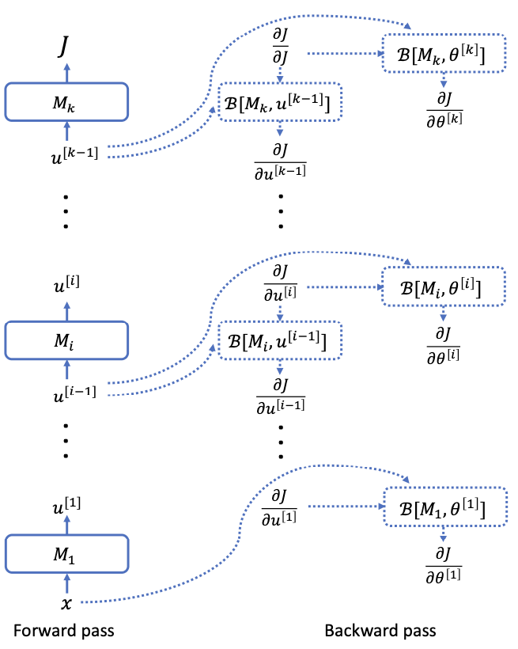

# 7.4 Backpropagation

In this section, we introduce backpropagation or auto-differentiation, which computes the gradient of the loss $`\nabla J(\theta)`$ efficiently. We will start with an informal theorem that states that as long as a *real-valued function* $`f`$ can be efficiently computed/evaluated by a differentiable network or circuit, then its gradient can be efficiently computed in a similar time. We will then show how to do this concretely for neural networks.

Because the formality of the general theorem is not the main focus here, we will introduce the terms with informal definitions. By a differentiable circuit or a differentiable network, we mean a composition of a sequence of differentiable arithmetic operations (additions, subtraction, multiplication, divisions, etc) and elementary differentiable functions (ReLU, exp, log, sin, cos, etc.). Let the size of the circuit be the total number of such operations and elementary functions. We assume that each of the operations and functions, and their derivatives or partial derivatives can be computed in $`O(1)`$ time.

> **Theorem 7.4.1**: [backpropagation or auto-differentiation, informally stated] Suppose a differentiable circuit of size $`N`$ computes a real-valued function $`f : \mathbb{R}^k \to \mathbb{R}`$. Then, the gradient $`\nabla f`$ can be computed in time $`O(N)`$, by a circuit of size $`O(N)`$.

We note that the loss function $`J^j(\theta)`$ for $`j`$-th example can be indeed computed by a sequence of operations and functions involving additions, subtraction, multiplications, and non-linear activations. Thus the theorem suggests that we should be able to compute the $`\nabla J^j(\theta)`$ in a similar time to that for computing $`J^j(\theta)`$ itself. This does not only apply to the fully-connected neural network introduced in Section 7.2, but also many other types of neural networks that use more advanced modules.

We remark that auto-differentiation or backpropagation is already implemented in all the deep learning packages such as tensorflow and pytorch, and thus in practice, in most of cases a researcher does not need to write their backpropagation algorithms. However, understanding it is very helpful for gaining insights into the working of deep learning.

**Organization of the rest of the section.** In Section 7.4.1, we will start reviewing the basic Chain rule with a new perspective that is particularly useful for understanding backpropagation. Section 7.4.2 will introduce the general strategy for backpropagation. Section 7.4.3 will discuss how to compute the so-called backward function for basic modules used in neural networks, and Section 7.4.4 will put everything together to get a concrete backprop algorithm for MLPs.

## 7.4.1 Preliminaries on partial derivatives

Suppose a *scalar variable* $`J`$ depend on some variables $`z`$ (which could be a scalar, matrix, or high-order tensor), we write $`\frac{\partial J}{\partial z}`$ as the partial derivatives of $`J`$ w.r.t to the variable $`z`$. We stress that the convention here is that $`\frac{\partial J}{\partial z}`$ has exactly the same dimension as $`z`$ itself. For example, if $`z \in \mathbb{R}^{m \times n}`$, then $`\frac{\partial J}{\partial z} \in \mathbb{R}^{m \times n}`$, and the $`(i, j)`$-entry of $`\frac{\partial J}{\partial z}`$ is equal to $`\frac{\partial J}{\partial z_{ij}}`$.

> **Remark 7.4.2**: When both $`J`$ and $`z`$ are not scalars, the partial derivatives of $`J`$ w.r.t $`z`$ becomes either a matrix or tensor and the notation becomes more complex. Besides the mathematical or notational challenges in dealing with tensors, if the function $`f`$ does not depend on some coordinate of $`z`$, then when we set by default the gradient w.r.t that coordinate to zero. Setting to NaN is not recommended, as it can be more error prone in accounting schemes. This is why, when $`z \in \mathbb{R}^N`$, we can compute the gradient in $`O(N)`$ time, which might be potentially even much smaller than the size of the full Jacobian, which is $`O(N^2)`$ time.

### Chain rule

We review the chain rule in calculus but with a perspective and notions that are more relevant for auto-differentiation.

Consider a scalar variable $`J`$ which is obtained by the composition of $`f`$ and $`g`$ on some variable $`z`$,

```math
z \in \mathbb{R}^m \\
u = g(z) \in \mathbb{R}^n \\
J = f(u) \in \mathbb{R}.
```
(7.52)

```python
# Example: composition of functions in numpy
def g(z):
    # Example: elementwise square
    return z ** 2

def f(u):
    # Example: sum of elements
    return np.sum(u)

z = np.array([1.0, 2.0, 3.0])
u = g(z)
J = f(u)
print('u:', u)
print('J:', J)
```

The same derivations below can be easily extended to the cases when $`z`$ and $`u`$ are matrices or tensors, but we insist that the final variable $`J`$ is a scalar. (See also Remark 7.4.2.) Let $`u = (u_1, \ldots, u_n)`$ and let $`g(z) = (g_1(z), \cdots, g_n(z))`$. Then, the standard chain rule gives us that

```math
\forall i \in \{1, \ldots, m\}, \quad \frac{\partial J}{\partial z_i} = \sum_{j=1}^n \frac{\partial J}{\partial u_j} \frac{\partial g_j}{\partial z_i}.
```
(7.53)

```python
# Chain rule for vector functions
dJ_du = np.ones_like(u)  # dJ/du for f(u) = sum(u) is 1 for each element
# For g(z) = z**2, dg_j/dz_i = 2*z[i] if i==j else 0 (diagonal)
dg_dz = np.diag(2 * z)
dJ_dz = dg_dz @ dJ_du
print('dJ/dz:', dJ_dz)
```

Alternatively, when $`z`$ and $`u`$ are both vectors, in a vectorized notation:

```math
\frac{\partial J}{\partial z} = \begin{bmatrix}
\frac{\partial u_1}{\partial z_1} & \cdots & \frac{\partial u_n}{\partial z_1} \\
\vdots & \ddots & \vdots \\
\frac{\partial u_1}{\partial z_m} & \cdots & \frac{\partial u_n}{\partial z_m}
\end{bmatrix} \frac{\partial J}{\partial u}.
```
(7.54)

In other words, the backward function is always a linear map from $`\frac{\partial J}{\partial u}`$, though note that the mapping itself can depend on $`z`$ in complex ways. The matrix on the RHS of (7.54) is actually the transpose of the Jacobian matrix of the function $`g`$. However, we do not discuss in-depth about Jacobian matrices to avoid complications. Part of the reason is that when $`z`$ is a matrix (or tensor), to write an analog of equation (7.54), one has to either flatten $`z`$ into a vector or introduce additional notations on tensor-matrix product. In this sense, equation (7.53) is more convenient and effective to use in all cases. For example, when $`z \in \mathbb{R}^{k \times s}`$ is a matrix, we can easily rewrite equation (7.53) to

```math
\forall i, k, \quad \frac{\partial J}{\partial z_{ik}} = \sum_{j=1}^n \frac{\partial J}{\partial u_j} \frac{\partial g_j}{\partial z_{ik}}.
```
(7.55)

which will indeed be used in some of the derivations in Section 7.4.3.

**Key interpretation of the chain rule.** We can view the formula above (equation (7.53) or (7.54)) as a way to compute $`\frac{\partial J}{\partial z}`$ from $`\frac{\partial J}{\partial u}`$. Consider the following abstract problem. Suppose $`J`$ depends on $`z`$ via $`u`$ as defined in equation (7.52). However, suppose the function $`f`$ is not given or the function $`f`$ is complex, but we are given the value of $`\frac{\partial J}{\partial u_j}`$ for each $`j`$. Then, the formula in equation (7.54) gives us a way to compute $`\frac{\partial J}{\partial z}`$ from $`\frac{\partial J}{\partial u}`$:

```math
\frac{\partial J}{\partial u} \xrightarrow[\text{chain rule, formula (7.54) only requires info about } g(z) \text{ and } z]{\phantom{chain rule}} \frac{\partial J}{\partial z}.
```
(7.56)

Moreover, this formula only involves knowledge about $`g`$ (more precisely $`\frac{\partial g_j}{\partial z_i}`$). We will repeatedly use this fact in situations where $`g`$ is a building block of a complex network $`f`$.

Empirically, it is often useful to modularize the mapping in (7.53) or (7.54) into a black-box, and mathematically it's also convenient to define a notation for it. We use $`[Bg, z]`$ to define the function that maps $`\frac{\partial J}{\partial u}`$ to $`\frac{\partial J}{\partial z}`$.

```math
\frac{\partial J}{\partial z} = \mathcal{B}[g, z]\left( \frac{\partial J}{\partial u} \right).
```
(7.57)

We call $`\mathcal{B}[g, z]`$ the **backward function** for the module $`g`$. Note that when $`z`$ is fixed, $`\mathcal{B}[g, z]`$ is merely a linear map from $`\mathbb{R}^n`$ to $`\mathbb{R}^m`$. Using equation (7.53), we have

```math
(\mathcal{B}[g, z](v))_i = \sum_{j=1}^n \frac{\partial g_j}{\partial z_i} \cdot v_j.
```
(7.58)

Or in vectorized notation, using (7.54), we have

```math
\mathcal{B}[g, z](v) =
\begin{bmatrix}
\frac{\partial g_1}{\partial z_1} & \cdots & \frac{\partial g_n}{\partial z_1} \\
\vdots & \ddots & \vdots \\
\frac{\partial g_1}{\partial z_m} & \cdots & \frac{\partial g_n}{\partial z_m}
\end{bmatrix}
\cdot v.
```
(7.59)

and therefore $`\mathcal{B}[g, z]`$ can be viewed as a matrix. However, in reality, $`z`$ will be changing and thus the backward mapping has to be recomputed for different $`z`$'s while $`g`$ is often fixed. Thus, empirically, the backward function $`\mathcal{B}[g, z](v)`$ is often viewed as a function which takes in $`z`$ (the input to $`g`$) and $`v`$ (a vector that is supposed to be the gradient of some variable $`J`$ w.r.t to the output of $`g`$) as the inputs, and outputs a vector that is supposed to be the gradient of $`J`$ w.r.t to $`z`$.

## 7.4.2 General strategy of backpropagation

We discuss the general strategy of auto-differentiation in this section to build a high-level understanding. Then, we will instantiate the approach to concrete neural networks. We take the viewpoint that neural networks are completely compositions of small building blocks such as MM, σ, Conv2D, LN, etc., defined in Section 7.3. Note that the losses (e.g., mean-squared loss, or the cross-entropy loss) can also be abstractly viewed as additional modules. Thus, we can abstractly write the loss function $`J`$ (on a single example $`(x, y)`$) as a composition of many modules:

```math
J = M_k(M_{k-1}(\cdots M_1(x))).
```
(7.60)

For example, for a binary classification problem with a MLP $`\hat{h}_\theta(x)`$ (defined in equation (7.36) and (7.37)), the loss function has been written in the form of equation (7.60) with $`M_1 = \text{MM}[W^{[1]}, b^{[1]}]`$, $`M_2 = \sigma`$, $`M_3 = \text{MM}[W^{[2]}, b^{[2]}]`$, ..., and $`M_{k-1} = \text{MM}[W^{[r]}, b^{[r]}]`$ and $`M_k = \ell_\text{logistic}`$.

We emphasize that some modules involve parameters, and other modules might only involve a fixed set of operations. For generality, we assume that each $`M_i`$ involves a set of parameters $`\theta^{[i]}`$, though $`\theta^{[i]}`$ could also be an empty set when $`M_i`$ is a fixed operation such as the nonlinear activation. We will discuss more on the granularity of the modularization, but for now assume all the modules $`M_i`$ are simple enough.

We introduce the intermediate variables for the computation in (7.60).

```math
u^{[0]} = x \\
u^{[1]} = M_1(u^{[0]}) \\
u^{[2]} = M_2(u^{[1]}) \\
\vdots \\
J = u^{[k]} = M_k(u^{[k-1]}).
```
(F)

Backpropagation consists of two passes, the forward pass and backward pass. In the forward pass, the algorithm simply computes $`u^{[1]}, \ldots, u^{[k]}`$ from $`i = 1, \ldots, k`$, sequentially using the definition in (F), and **save all the intermediate variables $`u^{[i]}`$ in the memory**.

In the **backward pass**, we first compute the derivatives w.r.t to the intermediate variables, that is, $`\frac{\partial J}{\partial u^{[k-1]}}, \ldots, \frac{\partial J}{\partial u^{[1]}}`$, sequentially in this backward order, and then compute the derivatives of the parameters $`\frac{\partial J}{\partial \theta^{[1]}}`$ through $`\frac{\partial J}{\partial \theta^{[k]}}`$ and $`u^{[i-1]}`$. These two type of computations can also be interleaved with each other because $`\frac{\partial J}{\partial \theta^{[i]}}`$ only depends on $`\frac{\partial J}{\partial u^{[i]}}`$ and $`u^{[i-1]}`$ but not any $`\frac{\partial J}{\partial u^{[l]}}`$ with $`l < i`$.

We first see why $`\frac{\partial J}{\partial u^{[i-1]}}`$ can be computed efficiently from $`\frac{\partial J}{\partial u^{[i]}}`$ and $`u^{[i-1]}`$ by invoking the discussion in Section 7.4.1 on the chain rule. We instantiate the discussion by setting $`u = u^{[i]}`$ and $`z = u^{[i-1]}`$, and $`f(u) = M_k(M_{k-1}(\cdots M_{i+1}(u)))`$, and $`g(z) = M_i(\cdot)`$. Note that $`f`$ is very complex but we don't need any concrete information about $`f`$. Then, the conclusive equation (7.56) corresponds to

```math
\frac{\partial J}{\partial u^{[i-1]}} \xrightarrow[\text{chain rule, only requires info about } M_i(\cdot) \text{ and } u^{[i-1]}]{\phantom{chain rule}} \frac{\partial J}{\partial u^{[i]}}.
```
(7.61)

More precisely, we can write, following equation (7.57)

```math
\frac{\partial J}{\partial u^{[i-1]}} = \mathcal{B}[M_i, u^{[i-1]}]\left( \frac{\partial J}{\partial u^{[i]}} \right).
```
(B1)

Instantiating the chain rule with $`z = \theta^{[i]}`$ and $`u = u^{[i]}`$, we also have

```math
\frac{\partial J}{\partial \theta^{[i]}} = \mathcal{B}[M_i, \theta^{[i]}]\left( \frac{\partial J}{\partial u^{[i]}} \right).
```
(B2)

See Figure 7.5 for an illustration of the algorithm.



Figure 7.5: Back-propagation.

**Remark 7.4.3:** [Computational efficiency and granularity of the modules]
The main underlying purpose of treating a complex network as compositions of small modules is that small modules tend to have efficiently implementable backward function. In fact, the backward functions of all the atomic modules such as addition, multiplication and ReLU can be computed as efficiently as the evaluation of these modules (up to multiplicative constant factor). Using this fact, we can prove Theorem 7.4.1 by viewing neural networks as compositions of many atomic operations, and invoking the backpropagation discussed above. However, in practice, it's oftentimes more convenient to modularize the networks using modules on the level of matrix multiplication, layernorm, etc. As we will see, naive implementation of these operations' backward functions also have the same runtime as the evaluation of these functions.

## 7.4.3 Backward functions for basic modules

Using the general strategy in Section 7.4.2, it suffices to compute the backward function for all modules $M_i$ used in the networks. We compute the backward function for the basic module MM, activations, and loss functions in this section.

**Backward function for MM.** Suppose $`\mathrm{MM}_{W,b}(z) = Wz + b`$ is a matrix multiplication module where $`z \in \mathbb{R}^n`$ and $`W \in \mathbb{R}^{m \times n}`$. Then, using equation (7.59), we have for $`v \in \mathbb{R}^m`$:

```math
\mathcal{B}[\mathrm{MM}, z](v) =
\begin{bmatrix}
\frac{\partial (Wz + b)_1}{\partial z_1} & \cdots & \frac{\partial (Wz + b)_m}{\partial z_1} \\
\vdots & \ddots & \vdots \\
\frac{\partial (Wz + b)_1}{\partial z_n} & \cdots & \frac{\partial (Wz + b)_m}{\partial z_n}
\end{bmatrix} v.
```
(7.62)

Using the fact that $`\forall i \in [m], j \in [n], \frac{\partial (Wz)_i}{\partial z_j} = W_{ij}`$, we have

```math
\mathcal{B}[\mathrm{MM}, z](v) = W^\top v \in \mathbb{R}^n.
```
(7.63)

In the derivation above, we have treated MM as a function of $`z`$. If we treat MM as a function of $`W`$ and $`b`$, then we can also compute the backward function for the parameter variables $`W`$ and $`b`$. It's less convenient to use equation (7.59) because the variable $`W`$ is a matrix and the matrix in (7.59) will be a 4th order tensor that is challenging for us to mathematically write down. We use (7.58) instead:

```math
\mathcal{B}[\mathrm{MM}, W](v) = \sum_{j=1}^n \frac{\partial (Wz + b)_i}{\partial W_{ij}} v_i = \sum_{j=1}^n \frac{\partial^2 S}{\partial W_{ij} \partial z_j} v_i = v z^\top.
```
(7.64)

In vectorized notation, we have

```math
\mathcal{B}[\mathrm{MM}, W](v) = v z^\top \in \mathbb{R}^{m \times n}.
```
(7.65)

Using equation (7.59) for the variable $`b`$, we have

```math
\mathcal{B}[\mathrm{MM}, b](v) =
\begin{bmatrix}
\frac{\partial (Wz + b)_1}{\partial b_1} & \cdots & \frac{\partial (Wz + b)_m}{\partial b_1} \\
\vdots & \ddots & \vdots \\
\frac{\partial (Wz + b)_1}{\partial b_m} & \cdots & \frac{\partial (Wz + b)_m}{\partial b_m}
\end{bmatrix} v = v.
```
(7.66)

Here we used that $`\frac{\partial (Wz + b)_i}{\partial b_j} = 0`$ when $`i \neq j`$ and $`\frac{\partial (Wz + b)_i}{\partial b_i} = 1`$ if $`i = j`$.

The computational efficiency for computing the backward function is $`O(mn)`$, the same as evaluating the result of matrix multiplication up to constant factor.

```python
# Backward for matrix multiplication
W = np.array([[1, 2], [3, 4]])
z = np.array([5, 6])
v = np.array([1, 1])
# Forward: MM = W @ z
# Backward: dJ/dz = W.T @ v
backward_z = W.T @ v
print('Backward for MM, dJ/dz:', backward_z)
```

**Backward function for the activations.** Suppose $`M(z) = \sigma(z)`$ where $`\sigma`$ is an element-wise activation function and $`z \in \mathbb{R}^n`$. Then, using equation (7.59), we have

```math
\mathcal{B}[\sigma, z](v) =
\begin{bmatrix}
\frac{\partial \sigma_1(z)}{\partial z_1} & \cdots & \frac{\partial \sigma_n(z)}{\partial z_1} \\
\vdots & \ddots & \vdots \\
\frac{\partial \sigma_1(z)}{\partial z_n} & \cdots & \frac{\partial \sigma_n(z)}{\partial z_n}
\end{bmatrix} v
```
(7.67)

```math
= \operatorname{diag}(\sigma'(z_1), \ldots, \sigma'(z_n)) v
```
(7.68)

```math
= \sigma'(z) \odot v \in \mathbb{R}^n.
```
(7.69)

Here, we used the fact that $`\frac{\partial \sigma_i(z)}{\partial z_j} = 0`$ when $`i \neq j`$; $`\operatorname{diag}(\lambda_1, \ldots, \lambda_n)`$ denotes the diagonal matrix with $`\lambda_1, \ldots, \lambda_n`$ on the diagonal, and $`\odot`$ denotes the element-wise product of two vectors with the same dimension, and $`\sigma'(z)`$ is the element-wise application of the derivative of the activation function $`\sigma(\cdot)`$.

Regarding computational efficiency, we note that at the first sight, equation (7.69) appears to indicate the backward function takes $`O(n^2)`$ time, but since the diagonal matrix is sparse, it is $`O(n)`$ time in practice.

```python
# Backward for ReLU activation
def relu(z):
    return np.maximum(0, z)
def relu_prime(z):
    return (z > 0).astype(float)
z = np.array([-1.0, 2.0, 3.0])
v = np.array([0.5, 0.5, 0.5])
dJ_dz = relu_prime(z) * v
print('Backward for ReLU, dJ/dz:', dJ_dz)
```

**Backward function for loss functions.** When a module $`M`$ takes in a vector $`z`$ and outputs a scalar, by equation (7.59), the backward function takes in a scalar and outputs a vector with entries $`[\mathcal{B}[M, z](v)]_i = \frac{\partial M}{\partial z_i} v`$.

Recall that squared loss $`\ell_{\text{sq}}(z, y) = \frac{1}{2}(z - y)^2`$. Thus, $`\mathcal{B}[\ell_{\text{sq}}, z](v) = (z - y) v`$.

For logistic loss, by equation 2.6, we have

```math
\mathcal{B}[\ell_{\text{logistic}}, t](v) = \frac{\partial \ell_{\text{logistic}}}{\partial t} v = (\sigma(t) - y) v.
```
(7.70)

For cross-entropy loss, by equation 2.17, we have

```math
\mathcal{B}[\ell_{\text{ce}}, t](v) = \frac{\partial \ell_{\text{ce}}}{\partial t} v = (\hat{y} - y) \cdot v, \quad \hat{y} = \operatorname{softmax}(t).
```
(7.71)

```python
# Backward for logistic loss
def sigmoid(t):
    return 1 / (1 + np.exp(-t))
t = np.array([0.2, -1.0, 0.5])
y = np.array([1, 0, 1])
v = np.ones_like(t)
dJ_dt = (sigmoid(t) - y) * v
print('Backward for logistic loss, dJ/dt:', dJ_dt)
```

## 7.4.4 Back-propagation for MLPs

Given the backward functions for every module needed in evaluating the loss of an MLP, we follow the strategy in Section 7.4.2 to compute the gradient of the loss w.r.t. to the hidden activations and the parameters.

We consider an $`r`$-layer MLP with a logistic loss. The loss function can be computed via a sequence of operations (that is, the forward pass),

```math
a^{[1]} = \mathrm{MM}_{W^{[1]}, b^{[1]}}(x), \
a^{[2]} = \sigma(a^{[1]}), \
a^{[3]} = \mathrm{MM}_{W^{[2]}, b^{[2]}}(a^{[2]}), \
a^{[4]} = \sigma(a^{[3]}), \
\vdots \
a^{[r]} = \mathrm{MM}_{W^{[r]}, b^{[r]}}(a^{[r-1]}), \
J = \ell_{\text{logistic}}(a^{[r]}, y).
```
(7.72)

We apply the backward function sequentially in a backward order. First, we have that

```math
\frac{\partial J}{\partial a^{[r]}} = \mathcal{B}[\ell_{\text{logistic}}, a^{[r]}](1) = (1/(1 + \exp(-a^{[r]})) - y).
```
(7.73)

Then, we iteratively compute $\frac{\partial J}{\partial a^{[k]}}$ and $\frac{\partial J}{\partial a^{[k-1]}}$ by repeatedly invoking the chain rule (equation (7.58)):

```math
\frac{\partial J}{\partial a^{[k-1]}} = \mathcal{B}[\mathrm{MM}, a^{[k-1]}]\left( \frac{\partial J}{\partial a^{[k]}} \right)
```
```math
\frac{\partial J}{\partial a^{[k]}} = \mathcal{B}[\sigma, a^{[k]}]\left( \frac{\partial J}{\partial a^{[k+1]}} \right)
```
(7.74)

Numerically, we compute these quantities by repeatedly invoking equations (7.69) and (7.65) with different choices of variables. We note that the intermediate values of $a^{[k]}$ and $a^{[k-1]}$ are used in the backpropagation equation (7.74), and so therefore these values need to be stored in the memory after the forward pass.

Next, we compute the gradient of the parameters by invoking equations (7.65) and (7.66):

```math
\frac{\partial J}{\partial W^{[k]}} = \mathcal{B}[\mathrm{MM}, W^{[k]}]\left( \frac{\partial J}{\partial a^{[k]}} \right)
```
```math
\frac{\partial J}{\partial b^{[k]}} = \mathcal{B}[\mathrm{MM}, b^{[k]}]\left( \frac{\partial J}{\partial a^{[k]}} \right)
```
(7.75)

We also note that the block of computations in equations (7.75) can be interleaved with the block of computation in equations (7.74), because the $a^{[k]}$ and $\frac{\partial J}{\partial a^{[k]}}$ are computed as soon as one is computing the equations. Using all of these together, and explicitly invoking the equations (7.72), (7.74), and (7.75), we have the following algorithm (Algorithm 8).

**Algorithm 3: Back-propagation for multi-layer neural networks.**

This algorithm describes how to compute gradients for all parameters in a multi-layer perceptron (MLP) using the chain rule and the backward functions for each module. Below, each step is explained in detail to clarify the reasoning and intuition behind the calculations.

1. **Forward pass.** Compute and store the values of $a^{[k]}$'s, $z^{[k]}$'s, and $J$ using the equations (7.72).
   - **Explanation:**
     - The forward pass computes the activations and pre-activations for each layer, starting from the input $x$ and proceeding through all layers to the output.
     - $a^{[k]}$ denotes the activation (output) of the $k$-th layer, while $z^{[k]}$ is the pre-activation (input to the activation function) for the $k$-th layer.
     - $J$ is the final loss value, computed from the output of the last layer and the true label $y$.
     - All intermediate values are stored because they are needed for the backward pass.

2. **Backward pass.** Compute the gradient of loss $J$ with respect to $z^{[r]}$ (the pre-activation of the last layer):

```math
\frac{\partial J}{\partial z^{[r]}} = \mathcal{B}[\ell_{\text{logistic}}, z^{[r]}](1) = (1/(1 + \exp(-z^{[r]})) - y).
```
(7.76)
   - **Explanation:**
     - The backward pass starts by computing the gradient of the loss with respect to the output of the network (the logits $z^{[r]}$).
     - For logistic loss, this is the difference between the predicted probability (after applying the sigmoid function) and the true label $y$.
     - The notation $\mathcal{B}[\ell_{\text{logistic}}, z^{[r]}](1)$ means we apply the backward function for the logistic loss to the scalar $1$ (since $J$ is a scalar).

3. **for** $k = r \to 1$ **do**
   1. Compute the gradient with respect to parameters $W^{[k+1]}$ and $b^{[k+1]}$:

```math
\frac{\partial J}{\partial W^{[k+1]}} = \mathcal{B}[\mathrm{MM}, W^{[k+1]}]\left( \frac{\partial J}{\partial z^{[k+1]}} \right)
```
(7.77)
   - **Explanation:**
     - This computes the gradient of the loss with respect to the weight matrix $W^{[k+1]}$ of layer $k+1$.
     - The backward function for matrix multiplication ($\mathrm{MM}$) takes the upstream gradient $\frac{\partial J}{\partial z^{[k+1]}}$ and computes $a^{[k]} \cdot (\frac{\partial J}{\partial z^{[k+1]}})^T$ (or $v z^T$ in general), which is the gradient of the loss with respect to the weights.
     - This is a direct application of the chain rule for the linear transformation.

```math
\frac{\partial J}{\partial b^{[k+1]}} = \mathcal{B}[\mathrm{MM}, b^{[k+1]}]\left( \frac{\partial J}{\partial z^{[k+1]}} \right)
```
(7.78)
   - **Explanation:**
     - This computes the gradient of the loss with respect to the bias vector $b^{[k+1]}$ of layer $k+1$.
     - The backward function for the bias is simply the upstream gradient $\frac{\partial J}{\partial z^{[k+1]}}$, since the derivative of $z$ with respect to $b$ is $1$.

   2. When $k \geq 1$, compute the gradient with respect to $z^{[k]}$ and $a^{[k]}$:

```math
\frac{\partial J}{\partial z^{[k]}} = W^{[k+1] \top} \frac{\partial J}{\partial a^{[k+1]}}
```
(7.79)
   - **Explanation:**
     - This computes the gradient of the loss with respect to the pre-activation $z^{[k]}$ of layer $k$.
     - The upstream gradient $\frac{\partial J}{\partial a^{[k+1]}}$ is multiplied by the transpose of the weight matrix $W^{[k+1]}$ to propagate the gradient backward through the linear transformation.
     - This is a direct application of the chain rule for the linear layer.

```math
\frac{\partial J}{\partial a^{[k]}} = \mathcal{B}[\sigma, a^{[k]}]\left( \frac{\partial J}{\partial z^{[k]}} \right) = \sigma'(z^{[k]}) \odot \frac{\partial J}{\partial z^{[k]}}
```
(7.80)
   - **Explanation:**
     - This computes the gradient of the loss with respect to the activation $a^{[k]}$ of layer $k$.
     - The backward function for the activation function $\sigma$ is the elementwise product of the upstream gradient $\frac{\partial J}{\partial z^{[k]}}$ and the derivative of the activation function $\sigma'(z^{[k]})$.
     - $\odot$ denotes elementwise multiplication.
     - This step applies the chain rule to the nonlinearity.

**Summary:**
- The algorithm alternates between applying the chain rule for linear layers (matrix multiplication) and nonlinearities (activation functions), propagating gradients backward from the output to the input.
- At each step, the required intermediate values from the forward pass are used to compute the gradients efficiently.
- The process is repeated for each layer, and the gradients with respect to all parameters are accumulated for use in optimization (e.g., gradient descent).

## Example: Full Forward and Backward Pass for a Simple MLP

Below is a Python example (using NumPy) that demonstrates the forward and backward pass for a simple 2-layer MLP, matching the equations in the MLP backpropagation section. This code shows how to compute all intermediate values and gradients step by step.

```python
import numpy as np

def relu(z):
    return np.maximum(0, z)
def relu_prime(z):
    return (z > 0).astype(float)
def sigmoid(z):
    return 1 / (1 + np.exp(-z))
def sigmoid_prime(z):
    s = sigmoid(z)
    return s * (1 - s)

# Forward pass
x = np.array([1.0, 2.0])
W1 = np.array([[0.1, 0.2], [0.3, 0.4]])
b1 = np.array([0.0, 0.0])
W2 = np.array([[0.5, -0.5]])
b2 = np.array([0.0])
y_true = np.array([1.0])

# Layer 1
z1 = W1 @ x + b1
print('z1:', z1)
a1 = relu(z1)
print('a1:', a1)
# Layer 2
z2 = W2 @ a1 + b2
print('z2:', z2)
a2 = sigmoid(z2)
print('a2:', a2)
# Loss (mean squared error for demonstration)
loss = 0.5 * (a2 - y_true) ** 2
print('loss:', loss)

# Backward pass
# dL/da2
dloss_da2 = a2 - y_true
# dL/dz2
dloss_dz2 = dloss_da2 * sigmoid_prime(z2)
# dL/dW2
dloss_dW2 = dloss_dz2 * a1
print('dloss/dW2:', dloss_dW2)
# dL/db2
dloss_db2 = dloss_dz2
print('dloss/db2:', dloss_db2)
# dL/da1
dloss_da1 = W2.T @ dloss_dz2
# dL/dz1
dloss_dz1 = dloss_da1 * relu_prime(z1)
# dL/dW1
dloss_dW1 = np.outer(dloss_dz1, x)
print('dloss/dW1:', dloss_dW1)
# dL/db1
dloss_db1 = dloss_dz1
print('dloss/db1:', dloss_db1)
```

This code demonstrates:
- How to perform the forward pass, storing all intermediate activations and pre-activations.
- How to compute the backward pass, step by step, using the chain rule and the backward functions for each module (matrix multiplication, activation, and loss).
- How to compute gradients for all weights and biases in the network.

You can extend this code to more layers or different activation/loss functions by following the same pattern as in the equations above.