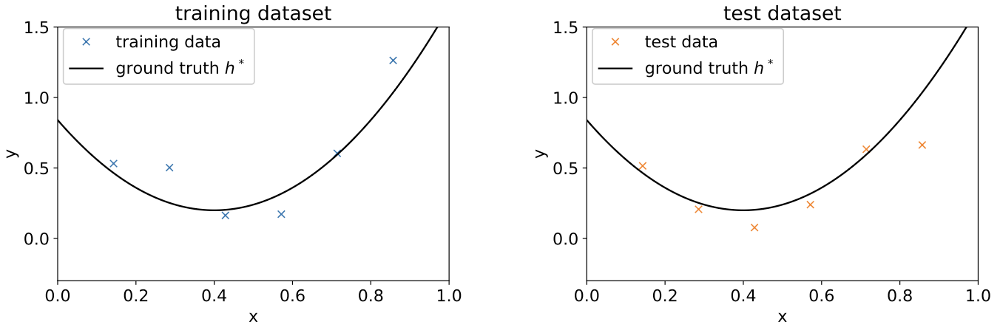
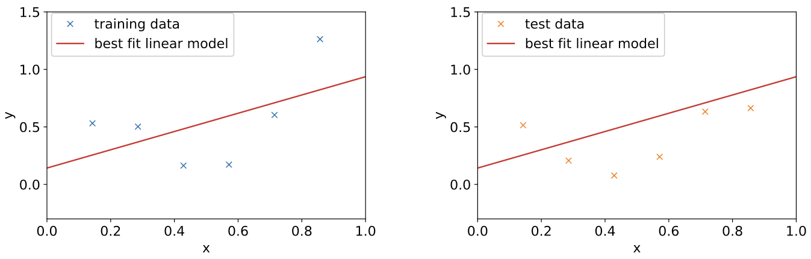
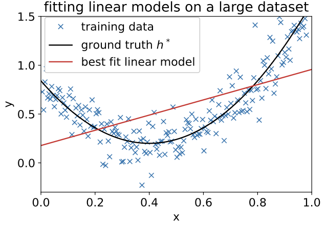
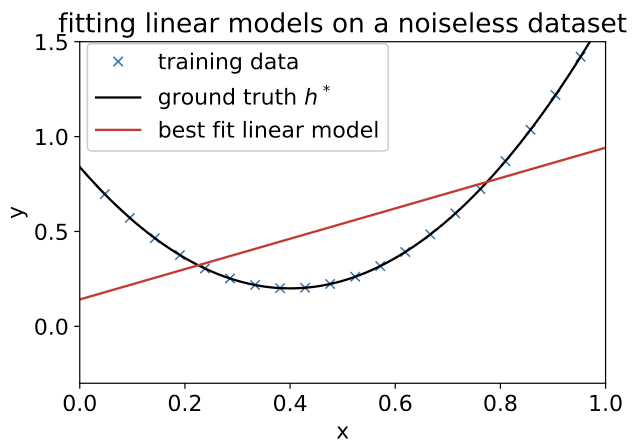
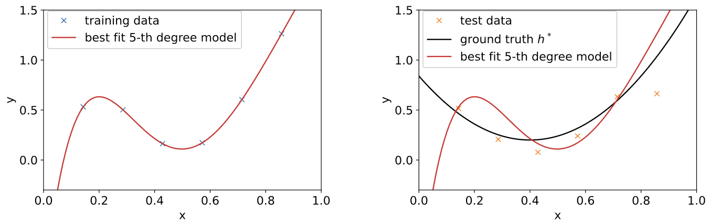
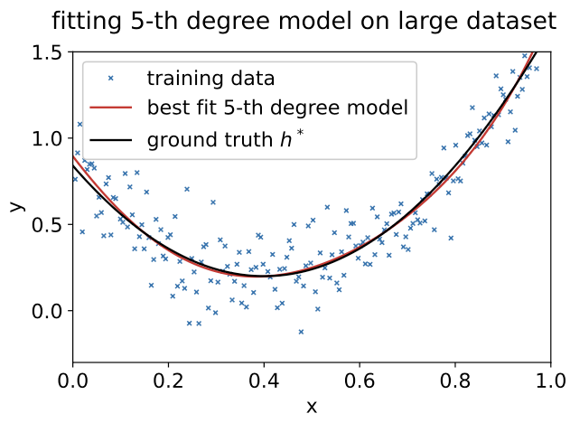
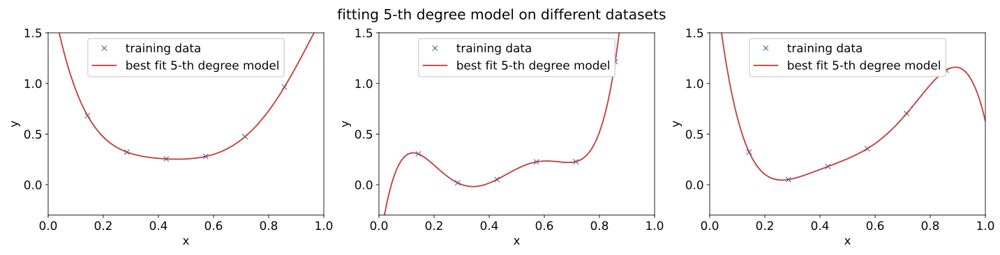
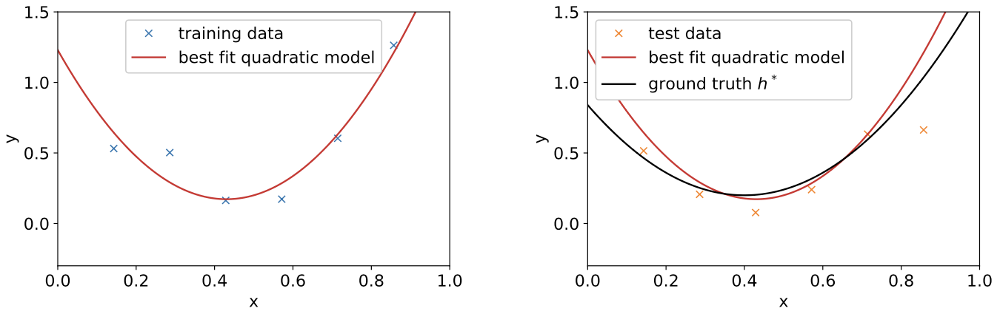
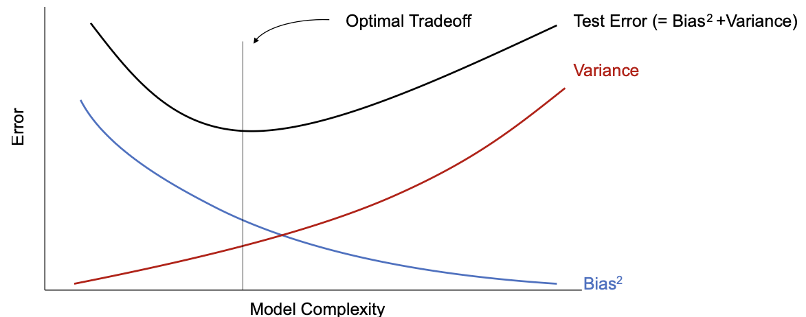

# Generalization and the Bias-Variance Tradeoff: The Fundamental Challenge of Machine Learning

## Introduction: The Core Problem of Machine Learning

This chapter addresses one of the most fundamental questions in machine learning: **How well will our model perform on new, unseen data?** This question lies at the heart of what we call **generalization**—the ability of a model to make accurate predictions on data it has never seen before.

### The Training vs. Test Error Distinction: Why This Matters

In supervised learning, we are given a training dataset $\{(x^{(i)}, y^{(i)})\}_{i=1}^n$ where each example consists of an input $x^{(i)}$ and its corresponding output $y^{(i)}$. Our goal is to learn a model $h_\theta$ that can predict outputs for new inputs.

**Training Process:** We learn the model by minimizing a loss function $J(\theta)$ on the training data. For example, with mean squared error loss:
$$
J(\theta) = \frac{1}{n} \sum_{i=1}^n (y^{(i)} - h_\theta(x^{(i)}))^2
$$

**The Key Insight:** Minimizing training error is not our ultimate goal—it's just our strategy for learning. The real measure of success is how well the model performs on **unseen test examples**.

**Real-World Analogy: The Student Exam Problem**
Think of machine learning like a student preparing for an exam:
- **Training data**: Practice problems and study materials
- **Training error**: How well the student does on practice problems
- **Test data**: The actual exam with new questions
- **Test error**: How well the student performs on the real exam

**The Critical Question:** Can the student solve new problems they've never seen before, or did they just memorize the practice problems?

### Formal Definition of Test Error: The Mathematical Foundation

Consider a test example $(x, y)$ drawn from the same underlying distribution $\mathcal{D}$ as our training data. The test error for this example is the squared difference between our prediction and the true value: $(h_\theta(x) - y)^2$.

The **expected test error** (also called generalization error) is:
$$
L(\theta) = \mathbb{E}_{(x, y) \sim \mathcal{D}}[(y - h_\theta(x))^2]
$$

**Understanding the Notation:**
- $\mathbb{E}_{(x, y) \sim \mathcal{D}}$: Expectation over all possible test examples from distribution $\mathcal{D}$
- In practice, we approximate this by averaging over a large test dataset
- The key difference: training examples are "seen" by the learning algorithm, while test examples are "unseen"

**Visual Analogy: The Dart Throwing Game**
Think of prediction like throwing darts at a target:
- **Training**: Practice throwing at a specific target
- **Test**: Throw at a new target (same distance, same size, but different location)
- **Generalization**: Can you hit the new target as well as you hit the practice target?

### The Generalization Gap: The Core Challenge

A critical observation is that **training error and test error can be very different**, even when both datasets come from the same distribution. This difference is called the **generalization gap**.

**Two Failure Modes:**

1. **Overfitting:** Small training error, large test error
   - The model memorizes the training data but fails to capture the underlying pattern
   - **Example**: A student who memorizes exam questions but can't solve similar problems
   - **Visual**: Like memorizing the exact answers to practice problems without understanding the concepts

2. **Underfitting:** Large training error, large test error  
   - The model is too simple to capture the underlying pattern in the data
   - **Example**: Trying to fit a straight line to clearly curved data
   - **Visual**: Like trying to solve calculus problems with only basic arithmetic

**The Goldilocks Principle:**
- **Too simple**: Model can't capture the pattern (underfitting)
- **Too complex**: Model memorizes the noise (overfitting)
- **Just right**: Model captures the pattern without memorizing noise (good generalization)

### What This Chapter Covers: A Roadmap to Understanding

This chapter provides tools to understand and control the generalization gap by:
1. **Decomposing test error** into bias and variance components
2. **Understanding the tradeoff** between model complexity and generalization
3. **Exploring modern phenomena** like double descent (Section 8.2)
4. **Providing theoretical foundations** for generalization (Section 8.3)

**Learning Objectives:**
- Understand why models fail to generalize
- Learn to diagnose overfitting vs underfitting
- Master the bias-variance decomposition
- Apply these concepts to real-world problems

---

## The Bias-Variance Tradeoff: A Deep Dive into the Fundamental Tension

### Setting Up Our Running Example: A Concrete Foundation

To make the bias-variance tradeoff concrete, let's work through a detailed example that will illustrate all the key concepts.



**Figure 8.1:** Our running example shows the true underlying function $h^*(x)$ (solid line) and noisy training data points. The goal is to recover the true function from noisy observations.

**Data Generation Process:**
- **True function:** $h^*(x) = ax^2 + bx + c$ (a quadratic function)
- **Training data:** $y^{(i)} = h^*(x^{(i)}) + \xi^{(i)}$ where $\xi^{(i)} \sim \mathcal{N}(0, \sigma^2)$
- **Test data:** Same process, but different noise realizations

**Key Insight:** The noise $\xi^{(i)}$ is unpredictable by definition, so our goal is to recover the underlying function $h^*(x)$, not to predict the noise.

**Why This Example Works:**
- **Simple enough**: Easy to visualize and understand
- **Rich enough**: Shows all the key phenomena
- **Realistic**: Captures the essence of real-world problems
- **Controllable**: We can vary model complexity systematically

### Case Study 1: Linear Model (Underfitting) - When Simplicity is a Vice

Let's start by trying to fit a linear model: $h_\theta(x) = \theta_0 + \theta_1 x$



**Figure 8.2:** A linear model trying to fit quadratic data. The model fails to capture the curvature, resulting in high errors on both training and test sets.

**What's happening:**
- The linear model cannot represent the quadratic relationship
- Even with perfect optimization, the best linear fit will have high error
- This is a fundamental limitation of the model family, not the learning algorithm

**Key Observation:** Adding more training data doesn't help!

 

**Figure 8.3:** Even with much more training data, the linear model still has high error because it fundamentally cannot represent the true function.


 
**Figure 8.4:** Even with noiseless data, the linear model fails because it's the wrong model family.

**The Bias Concept:** We define the **bias** of a model as the error it would have even with infinite training data. The linear model has **high bias** because it cannot represent the true function, regardless of how much data we have.

**Real-World Analogy: The Wrong Tool Problem**
Think of this like trying to solve a problem with the wrong tool:
- **Problem**: Need to cut a piece of wood
- **Wrong tool**: Using a screwdriver (linear model)
- **Right tool**: Using a saw (quadratic model)
- **Result**: No matter how skilled you are with the screwdriver, you can't cut wood effectively

**Mathematical Intuition:**
The bias is the systematic error that remains even with perfect optimization and infinite data. For the linear model:
$$
\text{Bias} = \mathbb{E}[(h^*(x) - h_{\text{linear}}(x))^2]
$$

This is large because $h_{\text{linear}}(x)$ can never equal $h^*(x)$ for a quadratic function.

### Case Study 2: 5th-Degree Polynomial (Overfitting) - When Complexity is a Vice

Now let's try a much more complex model: $h_\theta(x) = \theta_0 + \theta_1 x + \theta_2 x^2 + \theta_3 x^3 + \theta_4 x^4 + \theta_5 x^5$



**Figure 8.5:** A 5th-degree polynomial fits the training data perfectly (zero training error) but has high test error. This is classic overfitting.

**What's happening:**
- The model is complex enough to fit every training point exactly
- It's fitting the noise in the training data, not the underlying pattern
- On new data, the noise is different, so predictions are poor

**Key Insight:** The bias is actually low! With infinite data, a 5th-degree polynomial could represent the quadratic function perfectly (by setting $\theta_3 = \theta_4 = \theta_5 = 0$).



**Figure 8.6:** With a huge amount of data, the 5th-degree polynomial nearly recovers the true function, confirming that bias is low.

**Real-World Analogy: The Memorization Problem**
Think of this like a student who memorizes everything:
- **Training**: Student memorizes all practice problems perfectly
- **Test**: Student sees new problems and struggles
- **Problem**: Student learned the noise (specific problem details) instead of the pattern (problem-solving method)

**The Variance Concept:**
Variance measures how much the learned model changes when we train on different datasets from the same distribution. High variance means the model is very sensitive to the particular training data it sees.

### Understanding Variance Through Multiple Datasets: The Sensitivity Test

The key insight about variance comes from considering what happens when we train on different datasets from the same distribution.



**Figure 8.7:** Three different training datasets (same distribution, different noise) lead to very different 5th-degree polynomial fits. This high variability indicates high variance.

**What's happening:**
- Each dataset has different noise realizations
- The complex model fits the specific noise pattern in each dataset
- Different noise patterns lead to very different models
- This high sensitivity to the training data is what we call **high variance**

**Visual Analogy: The Weather Forecast Problem**
Think of variance like weather forecasting:
- **High variance model**: Very sensitive to small changes in input data
- **Low variance model**: Predictions are stable across different inputs
- **Example**: A model that predicts "sunny" if temperature > 20°C, "rainy" otherwise (low variance) vs. a model that uses 100 different weather variables (high variance)

**Mathematical Intuition:**
Variance is the expected squared difference between the model's prediction and its average prediction:
$$
\text{Variance} = \mathbb{E}[(\hat{h}_S(x) - \mathbb{E}[\hat{h}_S(x)])^2]
$$

For the 5th-degree polynomial, this is large because different training sets lead to very different models.

### The Sweet Spot: Quadratic Model - Finding the Right Balance

Let's try the "just right" model: $h_\theta(x) = \theta_0 + \theta_1 x + \theta_2 x^2$



**Figure 8.9:** The quadratic model achieves a good balance: it can represent the true function (low bias) but isn't so complex that it overfits the noise (low variance).

**Why this works:**
- **Low bias:** The quadratic model can represent the true quadratic function
- **Low variance:** It's not complex enough to fit the noise patterns
- **Good generalization:** It captures the underlying pattern without memorizing noise

**Real-World Analogy: The Goldilocks Solution**
Think of this like finding the right level of detail:
- **Too simple**: Like using a blurry camera (misses important details)
- **Too complex**: Like using a microscope for landscape photography (captures irrelevant details)
- **Just right**: Like using the right lens for the job (captures what matters)

**The Optimal Complexity Principle:**
The best model complexity is the one that minimizes the sum of bias and variance. This is the fundamental principle of model selection.

### The Classic Bias-Variance Tradeoff: The U-Shaped Curve



**Figure 8.8:** The classic U-shaped curve showing the bias-variance tradeoff. As model complexity increases, bias decreases but variance increases.

**Understanding the Tradeoff:**

1. **Simple models (left side):**
   - **High bias**: Can't represent complex patterns
   - **Low variance**: Predictions are stable across datasets
   - **Result**: Underfitting
   - **Example**: Linear model trying to fit quadratic data

2. **Complex models (right side):**
   - **Low bias**: Can represent complex patterns
   - **High variance**: Very sensitive to training data
   - **Result**: Overfitting
   - **Example**: High-degree polynomial fitting noisy data

3. **Optimal complexity (middle):**
   - **Balanced bias and variance**: Best generalization performance
   - **Example**: Quadratic model fitting quadratic data

**Practical Implications:**
- **Model selection** is about finding the sweet spot
- **Cross-validation** helps estimate the optimal complexity
- **Regularization** can help control variance without increasing bias

**The Total Error Decomposition:**
$$
\text{Total Error} = \text{Bias}^2 + \text{Variance} + \text{Irreducible Error}
$$

This equation is the foundation of understanding generalization in machine learning.

---

## Mathematical Foundation: The Bias-Variance Decomposition

Now we'll derive the mathematical foundation that formalizes our intuitive understanding. This decomposition is one of the most important theoretical results in machine learning.

### Setup and Notation: The Mathematical Framework

Consider the following setup:
- **Data generation:** $y = h^*(x) + \xi$ where $\xi \sim \mathcal{N}(0, \sigma^2)$
- **Training:** We draw a training set $S = \{(x^{(i)}, y^{(i)})\}_{i=1}^n$ and learn a model $\hat{h}_S$
- **Evaluation:** We want to predict at a fixed point $x$

The **mean squared error (MSE)** at point $x$ is:
$$
\mathrm{MSE}(x) = \mathbb{E}_{S, \xi}[(y - \hat{h}_S(x))^2]
$$

This expectation is over:
- The randomness in drawing training set $S$
- The randomness in the test noise $\xi$

**Understanding the Setup:**
- $h^*(x)$ is the true function we want to learn
- $\xi$ is irreducible noise (cannot be predicted)
- $\hat{h}_S(x)$ is our model's prediction after training on dataset $S$
- The expectation is over all possible training sets and noise realizations

### Key Mathematical Tool: The Independence Lemma

**Claim 8.1.1:** If $A$ and $B$ are independent random variables with $\mathbb{E}[A] = 0$, then:
$$
\mathbb{E}[(A + B)^2] = \mathbb{E}[A^2] + \mathbb{E}[B^2]
$$

**Proof:** Expand the square and use independence:
$$
\mathbb{E}[(A + B)^2] = \mathbb{E}[A^2 + 2AB + B^2] = \mathbb{E}[A^2] + 2\mathbb{E}[AB] + \mathbb{E}[B^2]
$$

Since $A$ and $B$ are independent, $\mathbb{E}[AB] = \mathbb{E}[A]\mathbb{E}[B] = 0$, giving us the result.

**Intuition:** When two independent random variables are added, their variances add (not their standard deviations). This is why we get the squared terms in the bias-variance decomposition.

### Step 1: Separating Noise from Model Error

First, we separate the irreducible noise from the model's prediction error:

$$
\mathrm{MSE}(x) = \mathbb{E}_{S, \xi}[(y - \hat{h}_S(x))^2] = \mathbb{E}_{S, \xi}[(\xi + (h^*(x) - \hat{h}_S(x)))^2] \tag{8.3}
$$

**Explanation:** We rewrite $y = h^*(x) + \xi$ and group terms.

Now apply Claim 8.1.1 with $A = \xi$ and $B = h^*(x) - \hat{h}_S(x)$:

$$
= \mathbb{E}[\xi^2] + \mathbb{E}[(h^*(x) - \hat{h}_S(x))^2] \quad \text{(by Claim 8.1.1)} \tag{8.4}
$$

**Explanation:** The noise $\xi$ is independent of the model error, and $\mathbb{E}[\xi] = 0$.

Since $\mathbb{E}[\xi^2] = \sigma^2$ (the noise variance):

$$
= \sigma^2 + \mathbb{E}[(h^*(x) - \hat{h}_S(x))^2]
$$

**Interpretation:** The MSE decomposes into:
1. **Irreducible error** ($\sigma^2$): Error due to noise in the data
2. **Model error** ($\mathbb{E}[(h^*(x) - \hat{h}_S(x))^2]$): Error due to the model's predictions

**Key Insight:** The irreducible error sets a fundamental limit on how well any model can perform. This is why we can't achieve perfect predictions even with the best possible model.

### Step 2: Introducing the Average Model

To further decompose the model error, we introduce a key concept: the **average model**.

**Definition:** $h_{avg}(x) = \mathbb{E}_S[\hat{h}_S(x)]$

This is the prediction we would get if we could train on infinitely many datasets and average the results. While we can't compute this in practice, it's a useful theoretical construct.

**Intuition:** The average model represents what our learning algorithm "wants" to learn, averaged over all possible training sets. It's the systematic component of our predictions.

**Visual Analogy: The Dart Throwing Game Revisited**
Think of the average model like the center of a dart cluster:
- **Individual throws**: Different models trained on different datasets
- **Center of cluster**: The average model
- **Spread of cluster**: The variance
- **Distance from target**: The bias

### Step 3: The Bias-Variance Decomposition

Now we decompose the model error by adding and subtracting $h_{avg}(x)$:

$$
h^*(x) - \hat{h}_S(x) = (h^*(x) - h_{avg}(x)) + (h_{avg}(x) - \hat{h}_S(x))
$$

The first term is constant (doesn't depend on the training set), and the second term has mean zero (by definition of $h_{avg}(x)$). Applying Claim 8.1.1 again:

$$
\mathrm{MSE}(x) = \sigma^2 + \mathbb{E}[(h^*(x) - \hat{h}_S(x))^2] \tag{8.5}
$$

$$
= \sigma^2 + (h^*(x) - h_{avg}(x))^2 + \mathbb{E}[(h_{avg}(x) - \hat{h}_S(x))^2] \tag{8.6}
$$

$$
= \underbrace{\sigma^2}_{\text{irreducible error}} + \underbrace{(h^*(x) - h_{avg}(x))^2}_{\text{bias}^2} + \underbrace{\mathrm{var}(\hat{h}_S(x))}_{\text{variance}} \tag{8.7}
$$

**The Fundamental Result:** This is the bias-variance decomposition, one of the most important equations in machine learning.

### Understanding Each Component: The Three Sources of Error

1. **Irreducible Error ($\sigma^2$):**
   - **Definition**: Due to noise in the data generation process
   - **Properties**: Cannot be reduced by any model
   - **Example**: Measurement noise, inherent randomness in the system
   - **Implication**: Sets a fundamental limit on prediction accuracy

2. **Bias Squared ($(h^*(x) - h_{avg}(x))^2$):**
   - **Definition**: Measures how far the average model is from the true function
   - **Properties**: Reflects systematic error due to model assumptions
   - **Behavior**: Decreases as model complexity increases
   - **Example**: Linear model trying to fit quadratic data

3. **Variance ($\mathrm{var}(\hat{h}_S(x))$):**
   - **Definition**: Measures how much predictions vary across different training sets
   - **Properties**: Reflects sensitivity to the particular training data
   - **Behavior**: Increases as model complexity increases
   - **Example**: High-degree polynomial fitting noisy data

**Visual Summary:**
```
Total Error = Irreducible Error + Bias² + Variance
     ↑              ↑              ↑        ↑
   What we    Can't control   Model's    Model's
   measure    (noise)        systematic  sensitivity
                                    error    to data
```

### Practical Implications: Applying the Theory

**For Model Selection:**
- **Simple models**: High bias, low variance
- **Complex models**: Low bias, high variance
- **Optimal model**: Balances bias and variance

**For Data Collection:**
- **More data**: Reduces variance (but not bias)
- **Better features**: Can reduce bias
- **Understanding the decomposition**: Helps prioritize improvements

**For Algorithm Design:**
- **Regularization**: Reduces variance
- **Ensemble methods**: Reduce variance
- **Feature engineering**: Reduces bias

**Practical Example:**

See the complete implementation in [`code/bias_variance_tradeoff_demo.py`](code/bias_variance_tradeoff_demo.py) which demonstrates:

- **Basic Bias-Variance Tradeoff**: Polynomial regression with different degrees showing the U-shaped curve
- **Bias-Variance Decomposition**: Individual components (bias², variance, irreducible error) and their relationship
- **Overfitting vs Underfitting**: Concrete examples with linear, quadratic, and high-degree polynomial models
- **Visual Analysis**: Plots showing training vs test error, generalization gaps, and model predictions
- **Quantitative Results**: Detailed error analysis for each model complexity level

The code shows how model complexity affects the bias-variance tradeoff, demonstrating the fundamental principle that simple models have high bias but low variance, while complex models have low bias but high variance. The optimal model complexity balances these competing factors.

### Limitations and Modern Extensions: Beyond Classical Theory

While the bias-variance tradeoff is fundamental, modern machine learning has revealed more complex phenomena:

1. **Double Descent:** In some cases, increasing model complexity beyond the interpolation threshold can actually improve generalization (Section 8.2)

2. **Implicit Regularization:** Modern optimizers (like gradient descent) provide implicit regularization that can mitigate the variance increase

3. **Feature Learning:** Deep learning models can learn features that reduce both bias and variance simultaneously

**The Modern Challenge:**
The classical bias-variance tradeoff assumes that:
- Model complexity is the primary factor affecting generalization
- More complex models always have higher variance
- The U-shaped curve is universal

Modern deep learning challenges these assumptions, leading to phenomena like:
- **Double descent**: A second descent after the classical U-shape
- **Implicit regularization**: Optimization algorithms that provide regularization
- **Feature learning**: Models that can learn better representations

**The Bias-Variance Decomposition Remains Fundamental:**
Despite these modern developments, the bias-variance decomposition remains a cornerstone of understanding generalization. It provides:
- **Intuition**: Clear understanding of why models fail to generalize
- **Diagnostics**: Tools to identify overfitting vs underfitting
- **Guidance**: Principles for model selection and algorithm design
- **Foundation**: Base for understanding more complex phenomena

---

## From Classical Wisdom to Modern Phenomena

We've now explored the **bias-variance tradeoff** - the fundamental framework that explains how model complexity affects generalization through the decomposition of error into bias and variance components. This classical understanding provides the foundation for model selection and regularization strategies.

However, while the bias-variance tradeoff represents classical wisdom about generalization, recent research has revealed more complex and fascinating phenomena that challenge our traditional understanding. Modern machine learning models, especially deep neural networks, often achieve excellent generalization despite being highly overparameterized - a fact that the classical bias-variance framework cannot fully explain.

This motivates our exploration of the **double descent phenomenon** - a modern discovery that reveals a more nuanced relationship between model complexity and generalization. We'll see how the classical U-shaped curve is often followed by a second descent, where very complex models can generalize well despite fitting training data perfectly.

The transition from bias-variance tradeoff to double descent represents the bridge from classical theory to modern understanding - taking our foundational knowledge of generalization and extending it to explain the behavior of contemporary machine learning systems.

In the next section, we'll explore how double descent challenges classical wisdom and provides insights into why modern models can achieve excellent generalization despite being highly overparameterized.

---

**Next: [Double Descent](02_double_descent.md)** - Understand how modern machine learning challenges classical bias-variance wisdom.

