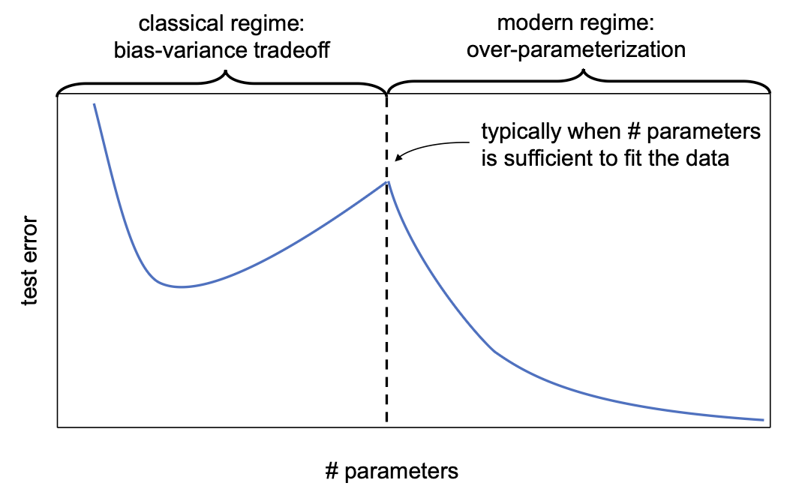
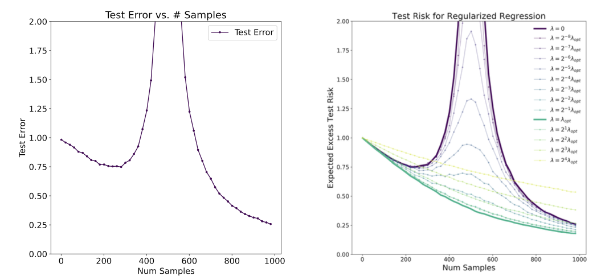
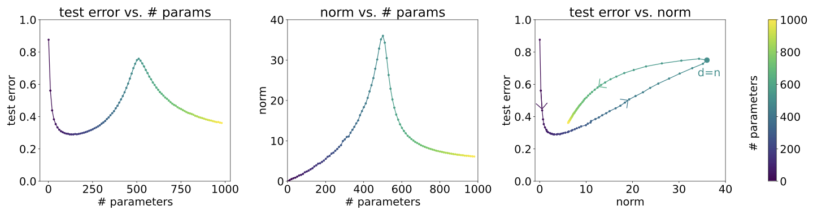

# 8.2 The Double Descent Phenomenon: Beyond the Classic Bias-Variance Tradeoff

## Introduction: Challenging Classical Wisdom

The bias-variance tradeoff we discussed in Section 8.1 represents classical wisdom about model complexity and generalization. However, recent research has revealed a more complex and fascinating phenomenon: **double descent**. This discovery challenges our traditional understanding and provides insights into why modern machine learning models—especially deep neural networks—can achieve excellent generalization despite being highly overparameterized.

### The Classical View vs. Modern Reality

**Classical Wisdom (Bias-Variance Tradeoff):**
- As model complexity increases, test error follows a U-shaped curve
- Simple models have high bias, low variance
- Complex models have low bias, high variance
- There's a sweet spot of optimal complexity

**Modern Reality (Double Descent):**
- The U-shaped curve is often followed by a second descent
- Very complex models can generalize well despite fitting training data perfectly
- The relationship between complexity and generalization is more nuanced

## From Classical Wisdom to Modern Phenomena

We've now explored the **bias-variance tradeoff** - the fundamental framework that explains how model complexity affects generalization through the decomposition of error into bias and variance components. This classical understanding provides the foundation for model selection and regularization strategies.

However, while the bias-variance tradeoff represents classical wisdom about generalization, recent research has revealed more complex and fascinating phenomena that challenge our traditional understanding. Modern machine learning models, especially deep neural networks, often achieve excellent generalization despite being highly overparameterized - a fact that the classical bias-variance framework cannot fully explain.

This motivates our exploration of the **double descent phenomenon** - a modern discovery that reveals a more nuanced relationship between model complexity and generalization. We'll see how the classical U-shaped curve is often followed by a second descent, where very complex models can generalize well despite fitting training data perfectly.

The transition from bias-variance tradeoff to double descent represents the bridge from classical theory to modern understanding - taking our foundational knowledge of generalization and extending it to explain the behavior of contemporary machine learning systems.

In this section, we'll explore how double descent challenges classical wisdom and provides insights into why modern models can achieve excellent generalization despite being highly overparameterized.

## 8.2.1 Model-Wise Double Descent: The First Discovery

### What is Model-Wise Double Descent?

**Model-wise double descent** occurs when we plot test error against model complexity (typically measured by the number of parameters). Instead of the classic U-shaped curve, we observe a more complex pattern:

1. **First descent:** Test error decreases as complexity increases (classical regime)
2. **First ascent:** Test error increases as complexity increases (overfitting regime)
3. **Second descent:** Test error decreases again as complexity increases further (overparameterized regime)



**Figure 8.10:** A typical model-wise double descent curve. The test error first decreases, then increases to a peak around the interpolation threshold (where the model can fit all training data), then decreases again in the overparameterized regime.

### Understanding the Three Regimes

**Regime 1: Underparameterized (Classical)**
- Number of parameters < Number of training examples
- Model cannot fit all training data perfectly
- Follows classical bias-variance tradeoff
- Example: Linear regression with few features

**Regime 2: Interpolation Threshold**
- Number of parameters ≈ Number of training examples
- Model can just barely fit all training data
- This is where the peak in test error occurs
- High sensitivity to noise and data perturbations

**Regime 3: Overparameterized (Modern)**
- Number of parameters > Number of training examples
- Model can fit training data perfectly (zero training error)
- Surprisingly, test error can decrease again
- This is the regime where modern deep learning operates

### Why Does Double Descent Occur?

The key insight is that **not all solutions that fit the training data are created equal**. In the overparameterized regime, there are infinitely many models that achieve zero training error, but the learning algorithm doesn't choose randomly among them.

**Implicit Regularization:** Modern optimizers (like gradient descent) tend to find "simple" solutions even when more complex ones exist. For example:
- **Linear models:** Gradient descent finds the minimum norm solution
- **Neural networks:** Gradient descent finds solutions with certain geometric properties
- **Random forests:** The ensemble averaging provides regularization

**The Role of Algorithm Choice:** The specific learning algorithm matters. Different algorithms will find different solutions in the overparameterized regime, leading to different generalization behavior.

### Historical Context

The double descent phenomenon was first observed by Opper in the 1990s but gained widespread attention with the work of Belkin et al. (2019) and Hastie et al. (2019). The discovery coincided with the rise of deep learning, where models routinely have millions of parameters but only thousands of training examples.

**Key Papers:**
- Opper (1995, 2001): Early observations in statistical physics
- Belkin et al. (2019): "Reconciling modern machine learning practice and the classical bias-variance trade-off"
- Hastie et al. (2019): "Surprises in high-dimensional ridgeless least squares interpolation"

## 8.2.2 Sample-Wise Double Descent: A Related Phenomenon

### What is Sample-Wise Double Descent?

**Sample-wise double descent** occurs when we fix the model complexity and vary the number of training examples. Surprisingly, more data doesn't always help—there can be a regime where adding training examples actually increases test error.



**Figure 8.11:** **Left:** Sample-wise double descent for linear models. **Right:** The effect of regularization on mitigating the peak. The optimal regularization (green curve) smooths out the double descent phenomenon.

### Understanding the Sample-Wise Pattern

**The Peak at n ≈ d:** The test error peaks when the number of training examples ($`n`$) is approximately equal to the number of parameters ($`d`$). This is the same interpolation threshold we saw in model-wise double descent.

**Why More Data Can Hurt:**
1. **Just-determined systems:** When $`n \approx d`$, the system is just barely determined
2. **High sensitivity:** Small changes in training data lead to large changes in the learned model
3. **Noise amplification:** The model fits the noise in the training data very precisely
4. **Instability:** The solution is highly sensitive to perturbations

**The Recovery:** As $`n`$ increases beyond $`d`$, the system becomes overdetermined, and the solution becomes more stable.

### Practical Implications

**Data Collection Strategy:** If you observe that adding more data increases test error, you might be in the $`n \approx d`$ regime. In this case:
- Consider using regularization
- Try collecting even more data (beyond the peak)
- Use a different model architecture

**Model Selection:** The sample-wise double descent suggests that the relationship between data size and model complexity is more nuanced than previously thought.

## 8.2.3 Mitigating Double Descent: The Role of Regularization

### How Regularization Helps

Regularization can dramatically improve performance in the problematic $`n \approx d`$ regime by:
1. **Stabilizing solutions:** Making the learned model less sensitive to training data
2. **Reducing variance:** Preventing overfitting to noise
3. **Improving generalization:** Finding solutions that generalize better


**Figure 8.11 (Right):** Different regularization strengths show how optimal regularization (green curve) can eliminate the peak in test error.

### Types of Regularization

**Explicit Regularization:**
- **L2 regularization (Ridge):** Adds penalty for large weights
- **L1 regularization (Lasso):** Promotes sparsity
- **Dropout:** Randomly deactivates neurons during training
- **Data augmentation:** Artificially increases training data

**Implicit Regularization:**
- **Gradient descent:** Tends to find minimum norm solutions
- **Early stopping:** Prevents overfitting by stopping training early
- **Architecture choice:** Certain architectures have built-in regularization

### Optimal Regularization Strategy

The key insight is that **different amounts of regularization are optimal at different points**:
- **Underparameterized regime:** Little regularization needed
- **Interpolation threshold:** Strong regularization beneficial
- **Overparameterized regime:** Moderate regularization often optimal

## 8.2.4 Theoretical Understanding: Why Overparameterized Models Work

### The Minimum Norm Solution

For linear models, gradient descent with zero initialization converges to the **minimum norm solution** that fits the training data. This solution has special properties:

**Mathematical Formulation:**
```math
\hat{\beta} = \arg\min_{\beta} \|\beta\|_2^2 \quad \text{subject to} \quad X\beta = y
```

**Why This Works:**
- The minimum norm solution tends to generalize well
- It avoids overfitting to noise by preferring simple solutions
- It has good geometric properties in high dimensions

### The Role of Data Geometry

In high dimensions, the geometry of the data becomes important:
- **Random features:** In high dimensions, random vectors tend to be nearly orthogonal
- **Concentration of measure:** Most of the volume in high-dimensional spaces is near the surface
- **Blessing of dimensionality:** Certain phenomena become more favorable in high dimensions

### Modern Optimization Theory

Recent theoretical work has shown that:
- **Gradient descent dynamics:** The optimization trajectory matters, not just the final solution
- **Implicit bias:** The algorithm choice affects which solution is found
- **Feature learning:** Neural networks can learn useful representations during training

## 8.2.5 Beyond Parameter Count: Alternative Complexity Measures

### The Limitations of Parameter Count

The number of parameters is not always the best measure of model complexity. Consider these examples:

**Linear Models with Different Parameterizations:**
- Standard form: $`h_\theta(x) = \theta_0 + \theta_1 x_1 + \cdots + \theta_d x_d`$ ($`d+1`$ parameters)
- Squared form: $`h_{u,v}(x) = (u_0^2 - v_0^2) + (u_1^2 - v_1^2)x_1 + \cdots + (u_d^2 - v_d^2)x_d`$ ($`2d+2`$ parameters)

Both represent the same set of functions, but have different parameter counts!

### Alternative Complexity Measures

**Model Norm:** The magnitude of the learned parameters often better predicts generalization than parameter count.



**Figure 8.12:** **Left:** Double descent when plotting against parameter count. **Middle:** The norm of the learned model peaks around $`n \approx d`$. **Right:** When plotting against model norm, the double descent disappears and the relationship is more monotonic.

**Other Measures:**
- **Rademacher complexity:** Measures the richness of the function class
- **VC dimension:** Measures the capacity to shatter points
- **Effective degrees of freedom:** Accounts for regularization effects
- **Sharpness:** Measures sensitivity to parameter perturbations

### Practical Implications

**For Model Analysis:**
- Consider multiple complexity measures
- Model norm often better predicts generalization than parameter count
- The relationship between complexity and generalization depends on the measure used

**For Deep Learning:**
- Parameter count is particularly misleading for neural networks
- Architecture choices matter more than raw parameter count
- Training dynamics affect the effective complexity

## 8.2.6 Double Descent in Practice: Real-World Examples

### Linear Models

Double descent is clearly visible in linear regression and classification:
- **Ridge regression:** Shows classic U-shaped curve
- **Unregularized least squares:** Shows double descent
- **Random features:** Demonstrates the phenomenon clearly

### Neural Networks

Deep neural networks exhibit double descent in various forms:
- **Width scaling:** Increasing network width can show double descent
- **Depth scaling:** Very deep networks can generalize well
- **Training dynamics:** The optimization trajectory affects generalization

### Other Models

Double descent has been observed in:
- **Random forests:** As the number of trees increases
- **Support vector machines:** With different kernel choices
- **Ensemble methods:** As ensemble size increases

## 8.2.7 Implications for Machine Learning Practice

### Model Selection

**Traditional Approach:** Choose model complexity to minimize validation error
**Modern Approach:** Consider the possibility of double descent
- Don't automatically avoid overparameterized models
- Consider using regularization to mitigate peaks
- Test multiple complexity levels, including very high ones

### Data Collection

**When to Collect More Data:**
- If you're in the underparameterized regime: more data helps
- If you're at the interpolation threshold: consider regularization first
- If you're in the overparameterized regime: more data may not help much

### Algorithm Choice

**Optimization Matters:**
- Different optimizers can lead to different generalization
- Implicit regularization varies by algorithm
- Consider the optimization trajectory, not just the final solution

### Regularization Strategy

**Adaptive Regularization:**
- Use stronger regularization when $`n \approx d`$
- Consider implicit regularization from optimization
- Monitor both training and validation performance

## 8.2.8 Open Questions and Future Directions

### Theoretical Challenges

**Unified Theory:** We still lack a complete theoretical understanding of:
- When double descent occurs
- How to predict the optimal model complexity
- The role of different complexity measures

**Deep Learning:** The theory is particularly incomplete for:
- Neural networks with feature learning
- The interaction between architecture and optimization
- The role of initialization and training dynamics

### Practical Challenges

**Model Selection:** How to choose model complexity when double descent is possible:
- Cross-validation may not capture the phenomenon
- Need for better complexity measures
- Role of domain knowledge

**Interpretability:** Overparameterized models can be harder to interpret:
- Balancing performance and interpretability
- Understanding what the model has learned
- Extracting meaningful insights

### Research Directions

**Active Areas:**
- Understanding implicit regularization in different algorithms
- Developing better complexity measures
- Connecting double descent to other phenomena (e.g., adversarial robustness)
- Practical guidelines for model selection

## Summary: The New Landscape of Generalization

The double descent phenomenon has fundamentally changed our understanding of generalization in machine learning:

**Key Takeaways:**
1. **Classical bias-variance tradeoff is incomplete**—there's more to the story
2. **Overparameterized models can generalize well**—don't automatically avoid them
3. **Regularization is crucial**—especially around the interpolation threshold
4. **Algorithm choice matters**—implicit regularization affects generalization
5. **Complexity measures matter**—parameter count isn't always the best measure

**Practical Advice:**
- Consider the full complexity spectrum, including overparameterized models
- Use regularization to mitigate peaks in test error
- Monitor both training and validation performance carefully
- Don't rely solely on cross-validation for model selection
- Consider the specific algorithm and optimization method

The double descent phenomenon represents a paradigm shift in our understanding of machine learning. While the classical bias-variance tradeoff remains important, it's now part of a richer theoretical landscape that continues to evolve with modern machine learning practice.

## From Empirical Observations to Theoretical Foundations

We've now explored the **double descent phenomenon** - a modern discovery that challenges classical wisdom about model complexity and generalization. We've seen how the relationship between complexity and generalization is more nuanced than the traditional U-shaped curve, with very complex models often achieving excellent generalization despite being highly overparameterized.

However, while empirical observations and intuitive explanations help us understand these phenomena, we need **theoretical foundations** that provide rigorous mathematical guarantees about generalization. Understanding why these phenomena occur and when we can expect them requires deeper mathematical analysis.

This motivates our exploration of **sample complexity bounds** - the theoretical tools that provide rigorous mathematical guarantees about generalization. We'll see how theoretical results help us understand the fundamental limits of learning, the relationship between training error and generalization error, and how model complexity affects the required sample size.

The transition from empirical phenomena to theoretical foundations represents the bridge from observation to understanding - taking our knowledge of how generalization works in practice and providing the mathematical framework to explain why.

In the next section, we'll explore the mathematical tools and theoretical results that form the foundation of statistical learning theory.

---

**Previous: [Bias-Variance Tradeoff](01_bias-variance_tradeoff.md)** - Understand the fundamental decomposition of error into bias and variance components.

**Next: [Complexity Bounds](03_complexity_bounds.md)** - Learn the theoretical foundations that provide rigorous guarantees about generalization.

