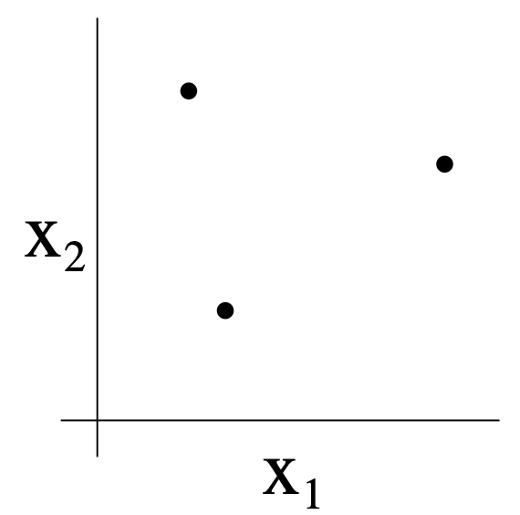
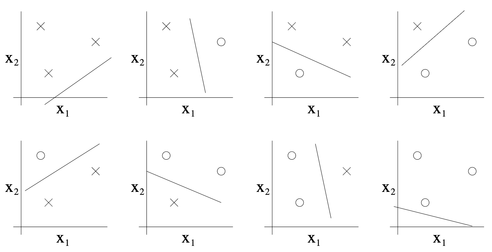
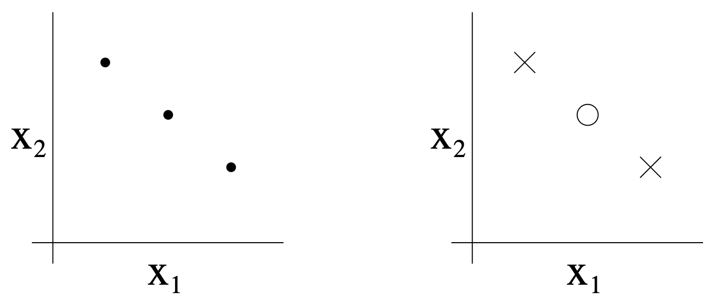

# 8.3 Sample complexity bounds (optional readings)

## 8.3.1 Preliminaries

*This section introduces foundational ideas in learning theory, focusing on how many training examples are needed to ensure that a learning algorithm generalizes well to new data. We will build up from basic probability tools to powerful results about generalization and model complexity.*

In this set of notes, we begin our foray into learning theory. Apart from being interesting and enlightening in its own right, this discussion will also help us hone our intuitions and derive rules of thumb about how to best apply learning algorithms in different settings. We will also seek to answer a few questions:
- **Can we make formal the bias/variance tradeoff?**
- **How does training error relate to generalization error?**
- **How many training examples do we need to guarantee good performance?**

We start with two simple but very useful lemmas.

**Lemma. (The union bound)**

*Intuition:* The union bound is a basic but powerful tool in probability. It says that the probability that at least one of several events happens is at most the sum of their individual probabilities. This is useful for controlling the chance of any "bad event" happening among many possibilities.

Let $`A_1, A_2, \ldots, A_k`$ be $`k`$ different events (that may not be independent). Then

```math
P(A_1 \cup \cdots \cup A_k) \leq P(A_1) + \ldots + P(A_k).
```

In probability theory, the union bound is usually stated as an axiom (and thus we won't try to prove it), but it also makes intuitive sense: The probability of any one of $`k`$ events happening is at most the sum of the probabilities of the $`k`$ different events. This is especially useful when $k$ is large but each event is rare.

**Lemma. (Hoeffding inequality / Chernoff bound)**

*Intuition:* This result tells us that the average of many independent random variables (like coin flips) is very likely to be close to the true mean, as long as we have enough samples. The probability of a large deviation drops off exponentially with the number of samples.

Let $`Z_1, \ldots, Z_n`$ be $`n`$ independent and identically distributed (iid) random variables drawn from a Bernoulli($`\phi`$) distribution. I.e., $`P(Z_i = 1) = \phi`$, and $`P(Z_i = 0) = 1 - \phi`$. Let $`\hat{\phi} = (1/n) \sum_{i=1}^n Z_i`$ be the mean of these random variables, and let any $`\gamma > 0`$ be fixed. Then

```math
P(|\phi - \hat{\phi}| > \gamma) \leq 2 \exp(-2 \gamma^2 n)
```

*Why does this matter?* If you flip a biased coin $n$ times, the fraction of heads you observe will be very close to the true probability of heads, with high probability, as $n$ grows. This is the foundation for why averages over samples are reliable estimates.

Using just these two lemmas, we will be able to prove some of the deepest and most important results in learning theory.

To simplify our exposition, let's restrict our attention to binary classification in which the labels are $`y \in \{0, 1\}`$. Everything we'll say here generalizes to other problems, including regression and multi-class classification.

We assume we are given a training set $`S = \{(x^{(i)}, y^{(i)}); i = 1, \ldots, n\}`$ of size $`n`$, where the training examples $`(x^{(i)}, y^{(i)})`$ are drawn iid from some probability distribution $`\mathcal{D}`$. For a hypothesis $`h`$, we define the **training error** (also called the **empirical risk** or **empirical error** in learning theory) to be

```math
\hat{\varepsilon}(h) = \frac{1}{n} \sum_{i=1}^n 1\{h(x^{(i)}) \neq y^{(i)}\}.
```

This is just the fraction of training examples that $`h`$ misclassifies. When we want to make explicit the dependence of $`\hat{\varepsilon}(h)`$ on the training set $`S`$, we may also write this as $`\hat{\varepsilon}_S(h)`$. We also define the **generalization error** to be

```math
\varepsilon(h) = P_{(x, y) \sim \mathcal{D}}(h(x) \neq y).
```

I.e. this is the probability that, if we now draw a new example $`(x, y)`$ from the distribution $`\mathcal{D}`$, $`h`$ will misclassify it.

Note that we have assumed that the training data was drawn from the **same** distribution $`\mathcal{D}`$ with which we're going to evaluate our hypotheses (in the definition of generalization error). This is sometimes also referred to as one of the **PAC assumptions**.$`^{9}`$

Consider the setting of linear classification, and let $`h_\theta(x) = 1\{\theta^T x \geq 0\}`$. What's a reasonable way of fitting the parameters $`\theta`$? One approach is to try to minimize the training error, and pick

```math
\hat{\theta} = \arg\min_{\theta} \hat{\varepsilon}(h_\theta).
```

We call this process **empirical risk minimization** (ERM), and the resulting hypothesis output by the learning algorithm is $`\hat{h} = h_{\hat{\theta}}`$. We think of ERM as the most "basic" learning algorithm, and it will be this algorithm that we focus on in these notes. (Algorithms such as logistic regression can also be viewed as approximations to empirical risk minimization.)

In our study of learning theory, it will be useful to abstract away from the specific parameterization of hypotheses and from issues such as whether we're using a linear classifier. We define the **hypothesis class** $`\mathcal{H}`$ used by a learning algorithm to be the set of all classifiers considered by it. For linear classification, $`\mathcal{H} = \{h_\theta : h_\theta(x) = 1\{\theta^T x \geq 0\}, \theta \in \mathbb{R}^{d+1}\}`$ is thus the set of all classifiers over $`\mathcal{X}`$ (the domain of the inputs) where the decision boundary is linear. More broadly, if we were studying, say, neural networks, then we could let $`\mathcal{H}`$ be the set of all classifiers representable by some neural network architecture.

Empirical risk minimization can now be thought of as a minimization over the class of functions $`\mathcal{H}`$, in which the learning algorithm picks the hypothesis:

```math
\hat{h} = \arg\min_{h \in \mathcal{H}} \hat{\varepsilon}(h)
```

### 8.3.2 The case of finite $\mathcal{H}$

Let's start by considering a learning problem in which we have a finite hypothesis class $`\mathcal{H} = \{h_1, \ldots, h_k\}`$ consisting of $`k`$ hypotheses. Thus, $`\mathcal{H}`$ is just a set of $`k`$ functions mapping from $`\mathcal{X}`$ to $`\{0, 1\}`$, and empirical risk minimization selects $`\hat{h}`$ to be whichever of these $`k`$ functions has the smallest training error.

We would like to give guarantees on the generalization error of $`\hat{h}`$. Our strategy for doing so will be in two parts: First, we will show that $`\hat{\varepsilon}(h)`$ is a reliable estimate of $`\varepsilon(h)`$ for all $`h`$. Second, we will show that this implies an upper-bound on the generalization error of $`\hat{h}`$.

Take any one, fixed, $`h_i \in \mathcal{H}`$. Consider a Bernoulli random variable $`Z`$ whose distribution is defined as follows. We're going to sample $`(x, y) \sim \mathcal{D}`$. Then, we set $`Z = 1\{h_i(x) \neq y\}`$. I.e., we're going to draw one example, and let $`Z`$ indicate whether $`h_i`$ misclassifies it. Similarly, we also define $`Z_j = 1\{h_i(x^{(j)}) \neq y^{(j)}\}`$. Since our training set was drawn iid from $`\mathcal{D}`$, $`Z`$ and the $`Z_j`$'s have the same distribution.

We see that the misclassification probability on a randomly drawn example—that is, $`\varepsilon(h)`$—is exactly the expected value of $`Z`$ (and $`Z_j`$). Moreover, the training error can be written

```math
\hat{\varepsilon}(h_i) = \frac{1}{n} \sum_{j=1}^n Z_j.
```

Thus, $`\hat{\varepsilon}(h_i)`$ is exactly the mean of the $`n`$ random variables $`Z_j`$ that are drawn iid from a Bernoulli distribution with mean $`\varepsilon(h_i)`$. Hence, we can apply the Hoeffding inequality, and obtain

```math
P(|\varepsilon(h_i) - \hat{\varepsilon}(h_i)| > \gamma) \leq 2 \exp(-2\gamma^2 n).
```

This shows that, for our particular $`h_i`$, training error will be close to generalization error with high probability, assuming $`n`$ is large. But we don't just want to guarantee that $`\varepsilon(h_i)`$ will be close to $`\hat{\varepsilon}(h_i)`$ (with high probability) for just only one particular $`h_i`$. We want to prove that this will be true simultaneously for all $`h \in \mathcal{H}`$. To do so, let $`A_i`$ denote the event that $`|\varepsilon(h_i) - \hat{\varepsilon}(h_i)| > \gamma`$. We've already shown that, for any particular $`A_i`$, it holds true that $`P(A_i) \leq 2 \exp(-2\gamma^2 n)`$. Thus, using the union bound, we have

```math
P(\exists h \in \mathcal{H}: |\varepsilon(h_i) - \hat{\varepsilon}(h_i)| > \gamma) = P(A_1 \cup \cdots \cup A_k)
\leq \sum_{i=1}^k P(A_i)
\leq \sum_{i=1}^k 2 \exp(-2\gamma^2 n)
= 2k \exp(-2\gamma^2 n)
```

If we subtract both sides from 1, we find that

```math
P(\neg \exists h \in \mathcal{H}: |\varepsilon(h_i) - \hat{\varepsilon}(h_i)| > \gamma)
= P(\forall h \in \mathcal{H}: |\varepsilon(h_i) - \hat{\varepsilon}(h_i)| \leq \gamma)
\geq 1 - 2k \exp(-2\gamma^2 n)
```

(The "$neg$" symbol means "not.") So, with probability at least $`1 - 2k \exp(-2\gamma^2 n)`$, we have that $`\varepsilon(h)`$ will be within $`\gamma`$ of $`\hat{\varepsilon}(h)`$ for all $`h \in \mathcal{H}`$. This is called a **uniform convergence** result, because this is a bound that holds simultaneously for all (as opposed to just one) $`h \in \mathcal{H}`$.

In the discussion above, what we did was, for particular values of $`n`$ and $`\gamma`$, give a bound on the probability that for some $`h \in \mathcal{H}`$, $`|\varepsilon(h) - \hat{\varepsilon}(h)| > \gamma`$. There are three quantities of interest here: $`n`$, $`\gamma`$, and the probability of error; we can bound either one in terms of the other two.

For instance, we can ask the following question: Given $`\gamma`$ and some $`\delta > 0`$, how large must $`n`$ be before we can guarantee that with probability at least $`1 - \delta`$, training error will be within $`\gamma`$ of generalization error? By setting $`\delta = 2k \exp(-2\gamma^2 n)`$ and solving for $`n`$, [you should convince yourself this is the right thing to do!], we find that if

```math
n \geq \frac{1}{2\gamma^2} \log \frac{2k}{\delta},
```

then with probability at least $`1 - \delta`$, we have that $`|\varepsilon(h) - \hat{\varepsilon}(h)| \leq \gamma`$ for all $`h \in \mathcal{H}`$. (Equivalently, this shows that the probability that $`|\varepsilon(h) - \hat{\varepsilon}(h)| > \gamma`$ for some $`h \in \mathcal{H}`$ is at most $`\delta`$.) This bound tells us how many training examples we need in order make a guarantee. The training set size $`n`$ that a certain method or algorithm requires in order to achieve a certain level of performance is also called the algorithm's **sample complexity**.

The key property of the bound above is that the number of training examples needed to make this guarantee is only *logarithmic* in $`k`$, the number of hypotheses in $`\mathcal{H}`$. This will be important later.

Similarly, we can also hold $`n`$ and $`\delta`$ fixed and solve for $`\gamma`$ in the previous equation, and show [again, convince yourself that this is right!] that with probability $`1 - \delta`$, we have that for all $`h \in \mathcal{H}`$,

```math
|\hat{\varepsilon}(h) - \varepsilon(h)| \leq \sqrt{\frac{1}{2n} \log \frac{2k}{\delta}}.
```

Now, let's assume that uniform convergence holds, i.e., that $`|\varepsilon(h) - \hat{\varepsilon}(h)| \leq \gamma`$ for all $`h \in \mathcal{H}`$. What can we prove about the generalization of our learning algorithm that picked $`\hat{h} = \arg\min_{h \in \mathcal{H}} \hat{\varepsilon}(h)`$?

Define $`h^* = \arg\min_{h \in \mathcal{H}} \varepsilon(h)`$ to be the best possible hypothesis in $`\mathcal{H}`$. Note that $`h^*`$ is the best that we could possibly do given that we are using $`\mathcal{H}`$, so it makes sense to compare our performance to that of $`h^*`$. We have:

```math
\varepsilon(\hat{h}) \leq \hat{\varepsilon}(\hat{h}) + \gamma \\
\leq \hat{\varepsilon}(h^*) + \gamma \\
\leq \varepsilon(h^*) + 2\gamma
```

The first line used the fact that $`|\varepsilon(h) - \hat{\varepsilon}(h)| \leq \gamma`$ (by our uniform convergence assumption). The second used the fact that $`\hat{h}`$ was chosen to minimize $`\hat{\varepsilon}(h)`$, and hence $`\hat{\varepsilon}(\hat{h}) \leq \hat{\varepsilon}(h)`$ for all $`h`$, and in particular $`\hat{\varepsilon}(\hat{h}) \leq \hat{\varepsilon}(h^*)`$. The third line used the uniform convergence assumption again, to show that $`\hat{\varepsilon}(h^*) \leq \varepsilon(h^*) + \gamma`$. So, what we've shown is the following: If uniform convergence occurs, then the generalization error of $`\hat{h}`$ is at most $`2\gamma`$ worse than the best possible hypothesis in $`\mathcal{H}`$!

Let's put all this together into a theorem.

**Theorem.** Let $`|\mathcal{H}| = k`$, and let any $`n, \delta`$ be fixed. Then with probability at least $`1 - \delta`$, we have that

```math
\varepsilon(\hat{h}) \leq \left( \min_{h \in \mathcal{H}} \varepsilon(h) \right) + 2 \sqrt{\frac{1}{2n} \log \frac{2k}{\delta}}.
```

This is proved by letting $`\gamma`$ equal the $\sqrt{\cdot}$ term, using our previous argument that uniform convergence occurs with probability at least $`1 - \delta`$, and then noting that uniform convergence implies $`\varepsilon(h)`$ is at most $`2\gamma`$ higher than $`\varepsilon(h^*) = \min_{h \in \mathcal{H}} \varepsilon(h)`$ (as we showed previously).

This also quantifies what we were saying previously about the bias/variance tradeoff in model selection. Specifically, suppose we have some hypothesis class $`\mathcal{H}`$, and are considering switching to some much larger hypothesis class $`\mathcal{H}' \supseteq \mathcal{H}`$. If we switch to $`\mathcal{H}'`$, then the first term $`\min_{h \in \mathcal{H}} \varepsilon(h)`$ can only decrease (since we'd then be taking a min over a larger set of functions). Hence, by learning using a larger hypothesis class, our "bias" can only decrease. However, if $`k`$ increases, then the second $`2\sqrt{\cdot}`$ term would also increase. This increase corresponds to our "variance" increasing when we use a larger hypothesis class.

By holding $`\gamma`$ and $`\delta`$ fixed and solving for $`n`$ like we did before, we can also obtain the following sample complexity bound:

**Corollary.** Let $`|\mathcal{H}| = k`$, and let any $`\delta, \gamma`$ be fixed. Then for $`\varepsilon(\hat{h}) \leq \min_{h \in \mathcal{H}} \varepsilon(h) + 2\gamma`$ to hold with probability at least $`1 - \delta`$, it suffices that

```math
n \geq \frac{1}{2\gamma^2} \log \frac{2k}{\delta}
= O\left(\frac{1}{\gamma^2} \log \frac{k}{\delta}\right),
```

### 8.3.3 The case of infinite $\mathcal{H}$

We have proved some useful theorems for the case of finite hypothesis classes. But many hypothesis classes, including any parameterized by real numbers (as in linear classification) actually contain an infinite number of functions. Can we prove similar results for this setting?

Let's start by going through something that is *not* the "right" argument. *Better and more general arguments exist*, but this will be useful for honing our intuitions about the domain.

Suppose we have an $\mathcal{H}$ that is parameterized by $d$ real numbers. Since we are using a computer to represent real numbers, and IEEE double-precision floating point (`double's in C) uses 64 bits to represent a floating point number, this means that our learning algorithm, assuming we're using double-precision floating point, is parameterized by $64d$ bits. Thus, our hypothesis class really consists of at most $k = 2^{64d}$ different hypotheses. From the Corollary at the end of the previous section, we therefore find that, to guarantee

```math
\varepsilon(\hat{h}) \leq \varepsilon(h^*) + 2\gamma,
```

with to hold with probability at least $`1 - \delta`$, it suffices that

```math
n \geq O\left(\frac{1}{\gamma^2} \log \frac{2^{64d}}{\delta}\right) = O\left(\frac{d}{\gamma^2} \log \frac{1}{\delta}\right) = O_{\gamma,\delta}(d).
```

(The $\gamma, \delta$ subscripts indicate that the last big-$O$ is hiding constants that may depend on $\gamma$ and $\delta$.) Thus, the number of training examples needed is at most *linear* in the parameters of the model.

The fact that we relied on 64-bit floating point makes this argument not entirely satisfying, but the conclusion is nonetheless roughly correct: If what we try to do is minimize training error, then in order to learn "well" using a hypothesis class that has $d$ parameters, generally we're going to need on the order of a linear number of training examples in $d$.

(At this point, it's worth noting that these results were proved for an algorithm that uses empirical risk minimization. Thus, while the linear dependence of sample complexity on $d$ does generally hold for most discriminative learning algorithms that try to minimize training error or some approximation to training error, these conclusions do not always apply as readily to non-discriminative learning algorithms. Giving good theoretical guarantees for many non-ERM learning algorithms is still an area of active research.)

The other part of our previous argument that's slightly unsatisfying is that it relies on the parameterization of $\mathcal{H}$. Intuitively, this doesn't seem like it should matter: We'd written the class of linear classifiers as $h_\theta(x) = 1\{\theta_0 + \theta_1 x_1 + \ldots + \theta_d x_d \geq 0\}$, with $n + 1$ parameters $\theta_0, \ldots, \theta_d$. But it could also be written $h_{u,v}(x) = 1\{(u_0^2 - v_0^2) + (u_1^2 - v_1^2)x_1 + \cdots + (u_d^2 - v_d^2)x_d \geq 0\}$ with $2d + 2$ parameters $u_i, v_i$. Yet, both of these are just defining the same set of functions $\mathcal{H}$. The set of real numbers we use is a dimensionless set.

To derive a more satisfying argument, let's define a few more things.

Given a set $`S = \{x^{(i)}, \ldots, x^{(D)}\}`$ (no relation to the training set) of points $`x^{(i)} \in \mathcal{X}`$, we say that $`\mathcal{H}`$ **shatters** $`S`$ if $`\mathcal{H}`$ can realize any labeling on $`S`$. I.e., if for any set of labels $`\{y^{(1)}, \ldots, y^{(D)}\}`$, there exists some $`h \in \mathcal{H}`$ so that $`h(x^{(i)}) = y^{(i)}`$ for all $`i = 1, \ldots, D`$.

Given a hypothesis class $`\mathcal{H}`$, we then define its **Vapnik-Chervonenkis dimension**, written $`\mathrm{VC}(\mathcal{H})`$, to be the size of the largest set that is shattered by $`\mathcal{H}`$. (If $`\mathcal{H}`$ can shatter arbitrarily large sets, then $`\mathrm{VC}(\mathcal{H}) = \infty`$.)

For instance, consider the following set of three points:



Can the set $`\mathcal{H}`$ of linear classifiers in two dimensions ($`h(x) = 1\{\theta_0 + \theta_1 x_1 + \theta_2 x_2 \geq 0\}`$) shatter the set above? The answer is yes. Specifically, we see that, for any of the eight possible labelings of these points, we can find a linear classifier that obtains "zero training error" on them:



Moreover, it is possible to show that there is no set of 4 points that this hypothesis class can shatter. Thus, the largest set that $`\mathcal{H}`$ can shatter is of size 3, and hence $`\mathrm{VC}(\mathcal{H}) = 3`$.

Note that the VC dimension of $`\mathcal{H}`$ here is 3 even though there may be sets of size 3 that it cannot shatter. For instance, if we had a set of three points lying in a straight line (left figure), then there is no way to find a linear separator for the labeling of the three points shown below (right figure):



In order words, under the definition of the VC dimension, in order to prove that $`\mathrm{VC}(\mathcal{H})`$ is at least $`D`$, we need to show only that there's at least *one* set of size $`D`$ that $`\mathcal{H}`$ can shatter.

The following theorem, due to Vapnik, can then be shown. (This is, many would argue, the most important theorem in all of learning theory.)

**Theorem.** Let $`\mathcal{H}`$ be given, and let $`D = \mathrm{VC}(\mathcal{H})`$. Then with probability at least $`1 - \delta`$, we have that for all $`h \in \mathcal{H}`$,

```math
|\varepsilon(h) - \hat{\varepsilon}(h)| \leq O\left( \sqrt{\frac{D}{n} \log \frac{n}{D}} + \frac{1}{n} \log \frac{1}{\delta} \right).
```

Thus, with probability at least $`1 - \delta`$, we also have that:

```math
\varepsilon(\hat{h}) \leq \varepsilon(h^*) + O\left( \sqrt{\frac{D}{n} \log \frac{n}{D}} + \frac{1}{n} \log \frac{1}{\delta} \right).
```

In other words, if a hypothesis class has finite VC dimension, then uniform convergence occurs as $`n`$ becomes large. As before, this allows us to give a bound on $`\varepsilon(h)`$ in terms of $`\varepsilon(h^*)`$. We also have the following corollary:

**Corollary.** For $`|\varepsilon(h) - \hat{\varepsilon}(h)| \leq \gamma`$ to hold for all $`h \in \mathcal{H}`$ (and hence $`\varepsilon(\hat{h}) \leq \varepsilon(h^*) + 2\gamma`$) with probability at least $`1 - \delta`$, it suffices that $`n = O_{\gamma,\delta}(D)`$.

In other words, the number of training examples needed to learn "well" using $`\mathcal{H}`$ is linear in the VC dimension of $`\mathcal{H}`$. It turns out that, for "most" hypothesis classes, the VC dimension (assuming a "reasonable" parameterization) is also roughly linear in the number of parameters. Putting these together, we conclude that for a given hypothesis class $`\mathcal{H}`$ (and for an algorithm that tries to minimize training error), the number of training examples needed to achieve generalization error close to that of the optimal classifier is usually roughly linear in the number of parameters of $`\mathcal{H}`$.

---

*Summary:*
- The union bound and Hoeffding/Chernoff inequalities let us control the probability of large deviations.
- Uniform convergence means that training error is close to generalization error for all hypotheses, with high probability.
- Sample complexity for finite classes grows logarithmically with the number of hypotheses.
- For infinite classes, VC dimension gives a more meaningful measure of complexity, and sample complexity is linear in VC dimension (and thus, often, in the number of parameters).
- These results explain why more complex models need more data, and why overfitting is a risk when the number of parameters is large relative to the number of training examples.

---

## Python Code: Sample Complexity Bounds and Generalization

Below are Python code snippets that demonstrate the key concepts and calculations from this section. You can run these examples to see the union bound, Hoeffding/Chernoff bound, empirical risk, generalization error, sample complexity, and VC dimension in action.

### Hoeffding/Chernoff Bound Demonstration
```python
import numpy as np
from scipy.stats import bernoulli

# Parameters
phi = 0.6  # True probability
n = 100    # Number of samples
gamma = 0.1
n_trials = 10000
np.random.seed(42)
deviations = []
for _ in range(n_trials):
    samples = bernoulli.rvs(phi, size=n)
    phat = np.mean(samples)
    deviations.append(abs(phat - phi) > gamma)
empirical_prob = np.mean(deviations)
hoeffding_bound = 2 * np.exp(-2 * gamma**2 * n)
print(f"Empirical P(|phat - phi| > {gamma}): {empirical_prob:.4f}")
print(f"Hoeffding bound: {hoeffding_bound:.4f}")
```

### Union Bound Demonstration
```python
# Probability of at least one of k rare events
p_single = 0.01
k = 10
prob_union = 1 - (1 - p_single) ** k
union_bound = k * p_single
print(f"True probability of at least one event: {prob_union:.4f}")
print(f"Union bound: {union_bound:.4f}")
```

### Empirical Risk and Generalization Error Simulation
```python
# Simulate empirical risk (training error) and generalization error for a Bernoulli classifier
phi = 0.7
n = 50
n_test = 10000
np.random.seed(0)
y_train = bernoulli.rvs(phi, size=n)
y_test = bernoulli.rvs(phi, size=n_test)
h = lambda x: 1  # Always predicts 1
train_error = np.mean(h(y_train) != y_train)
test_error = np.mean(h(y_test) != y_test)
print(f"Empirical risk (train error): {train_error:.4f}")
print(f"Generalization error (test error): {test_error:.4f}")
```

### Sample Complexity Bound Visualization
```python
import matplotlib.pyplot as plt
# Plot the sample complexity bound n >= (1/(2*gamma^2)) * log(2k/delta) as a function of k
gamma = 0.1
delta = 0.05
ks = np.arange(1, 1001)
n_bound = (1/(2*gamma**2)) * np.log(2*ks/delta)
plt.figure(figsize=(7,4))
plt.plot(ks, n_bound)
plt.xlabel('Number of Hypotheses (k)')
plt.ylabel('Required n for uniform convergence')
plt.title('Sample Complexity Bound vs. Number of Hypotheses')
plt.grid(True)
plt.show()
```

### VC Dimension Example: Linear Classifiers in 2D
```python
# Visualize shattering of 3 points in 2D by linear classifiers
points = np.array([[0,0], [1,1], [2,0]])
fig, axes = plt.subplots(2, 4, figsize=(12,6))
axes = axes.flatten()
for i, ax in enumerate(axes):
    labels = [(i >> j) & 1 for j in range(3)]
    for pt, lbl in zip(points, labels):
        ax.scatter(*pt, c='C0' if lbl else 'C1', s=80, marker='o' if lbl else 'x')
    ax.set_xlim(-0.5,2.5)
    ax.set_ylim(-0.5,1.5)
    ax.set_xticks([])
    ax.set_yticks([])
    ax.set_title(f'Labeling {i+1}')
plt.suptitle('All 8 Labelings of 3 Points (VC Dimension = 3)')
plt.tight_layout()
plt.show()
```

---

These code snippets allow you to:
- Simulate and visualize the union bound and Hoeffding/Chernoff bound.
- Compare empirical risk and generalization error.
- See how sample complexity depends on the number of hypotheses.
- Understand VC dimension through a concrete example.
