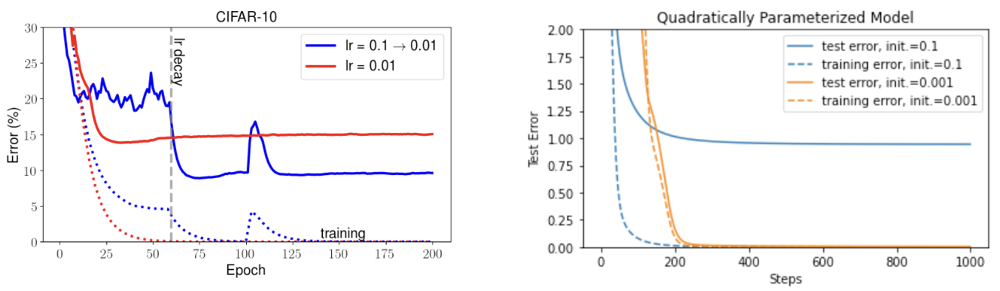

# Regularization and Model Selection

## Table of Contents
1. [Introduction to Regularization](#91-regularization)
2. [Mathematical Foundation](#mathematical-foundation)
3. [Types of Regularization](#types-of-regularization)
4. [Practical Considerations](#practical-considerations)
5. [Implicit Regularization](#92-implicit-regularization-effect)
6. [Advanced Topics](#advanced-topics)

---

## 9.1 Regularization

### What is Regularization?

Regularization is a fundamental technique in machine learning that helps prevent overfitting by adding constraints or penalties to the learning process. Think of it as a "guardian" that keeps your model from becoming too complex and memorizing the training data.

**The Core Problem:**
- **Overfitting**: When a model learns the noise in the training data instead of the underlying pattern
- **Underfitting**: When a model is too simple to capture the true relationship in the data
- **The Goal**: Find the sweet spot between these two extremes

### Why Do We Need Regularization?

Recall that as discussed in Section 8.1, overfitting is typically a result of using too complex models, and we need to choose a proper model complexity to achieve the optimal bias-variance tradeoff. Overfitting happens when a model learns not only the underlying pattern in the data but also the noise, leading to poor performance on new, unseen data. To prevent this, we want our models to be just complex enough to capture the true structure, but not so complex that they memorize the training data.

**Real-World Analogy:**
Imagine you're learning to play a musical instrument. If you practice the same piece over and over, you might memorize it perfectly but struggle with new pieces. This is like overfitting. Regularization is like learning music theory and technique—it helps you become a better musician overall, not just someone who can play one piece perfectly.

### Model Complexity: Beyond Parameter Count

When the model complexity is measured by the number of parameters, we can vary the size of the model (e.g., the width of a neural net). However, the correct, informative complexity measure of the models can be a function of the parameters (e.g., $`\ell_2`$ norm of the parameters), which may not necessarily depend on the number of parameters. For example, two neural networks might have the same number of parameters, but one might have much larger weights, making it more likely to overfit. In such cases, we will use regularization, an important technique in machine learning, to control the model complexity and prevent overfitting.

**Example:**
Consider two neural networks with identical architecture:
- Network A: All weights are small (e.g., between -0.1 and 0.1)
- Network B: All weights are large (e.g., between -10 and 10)

Both have the same number of parameters, but Network B is more complex and likely to overfit because large weights can create more complex decision boundaries.

---

## Mathematical Foundation

### The Regularization Framework

Regularization typically involves adding an additional term, called a regularizer and denoted by $`R(\theta)`$ here, to the training loss/cost function. The idea is to penalize models that are too complex, encouraging the learning algorithm to find simpler, more generalizable solutions:

```math
J_\lambda(\theta) = J(\theta) + \lambda R(\theta)
```

**Breaking Down the Equation:**

1. **$`J(\theta)`$**: The original loss function (e.g., mean squared error, cross-entropy)
2. **$`R(\theta)`$**: The regularizer - a function that measures model complexity
3. **$`\lambda`$**: The regularization parameter (also called hyperparameter) that controls the strength of regularization
4. **$`J_\lambda(\theta)`$**: The regularized loss function

### Understanding Each Component

**The Loss Function $`J(\theta)`$:**
- Measures how well the model fits the training data
- Examples:
  - For regression: $`J(\theta) = \frac{1}{n}\sum_{i=1}^n (y_i - h_\theta(x_i))^2`$ (Mean Squared Error)
  - For classification: $`J(\theta) = -\frac{1}{n}\sum_{i=1}^n [y_i \log(h_\theta(x_i)) + (1-y_i)\log(1-h_\theta(x_i))]`$ (Cross-Entropy)

**The Regularizer $`R(\theta)`$:**
- Measures the complexity of the model
- Should be non-negative: $`R(\theta) \geq 0`$
- Common choices: $`\|\theta\|_2^2`$, $`\|\theta\|_1`$, $`\|\theta\|_0`$

**The Regularization Parameter $`\lambda`$:**
- Controls the trade-off between fitting the data and keeping the model simple
- $`\lambda = 0`$: No regularization (original loss)
- $`\lambda \to \infty`$: Only care about simplicity (ignore data fitting)

### Intuitive Understanding

**The Trade-off:**
- **Small $`\lambda`$**: Model focuses on fitting the training data well
- **Large $`\lambda`$**: Model focuses on being simple and generalizable
- **Optimal $`\lambda`$**: Balances both objectives for best generalization

**Why This Works:**
- Without regularization, a model might fit the training data perfectly but fail to generalize to new data (overfitting)
- With regularization, the model is encouraged to be simpler, which often leads to better generalization

---

## Types of Regularization

### 1. L2 Regularization (Ridge Regression)

The most commonly used regularization is perhaps $`\ell_2`$ regularization, where:

```math
R(\theta) = \frac{1}{2} \|\theta\|_2^2 = \frac{1}{2} \sum_{j=1}^d \theta_j^2
```

**What it does:**
- Penalizes the sum of squared weights
- Encourages all weights to be small but not necessarily zero
- Also known as "weight decay" in deep learning

**Mathematical Properties:**
- **Convex**: The regularizer is convex, making optimization easier
- **Differentiable**: Smooth everywhere, allowing gradient-based optimization
- **Shrinkage**: All parameters are shrunk towards zero

**Why the factor of 1/2?**
The factor of $`\frac{1}{2}`$ is a convention that makes the gradient cleaner:
$`\nabla_\theta R(\theta) = \theta`$ instead of $`2\theta`$

**Deep Learning Connection:**
In deep learning, it's often referred to as **weight decay**, because gradient descent with learning rate $`\eta`$ on the regularized loss $`J_\lambda(\theta)`$ is equivalent to shrinking/decaying $`\theta`$ by a scalar factor of $`1 - \eta \lambda`$ each step alongside the standard gradient.

**Step-by-step derivation:**
1. The gradient of the regularized loss: $`\nabla_\theta J_\lambda(\theta) = \nabla_\theta J(\theta) + \lambda \theta`$
2. Gradient descent update: $`\theta_{t+1} = \theta_t - \eta \nabla_\theta J_\lambda(\theta_t)`$
3. Substituting: $`\theta_{t+1} = \theta_t - \eta \nabla_\theta J(\theta_t) - \eta \lambda \theta_t`$
4. Rearranging: $`\theta_{t+1} = (1 - \eta \lambda) \theta_t - \eta \nabla_\theta J(\theta_t)`$

The term $`(1 - \eta \lambda)`$ shows the weight decay effect.

### 2. L1 Regularization (LASSO)

L1 regularization uses the L1 norm of the parameters:

```math
R(\theta) = \|\theta\|_1 = \sum_{j=1}^d |\theta_j|
```

**What it does:**
- Penalizes the sum of absolute values of weights
- Encourages sparsity (many weights become exactly zero)
- Performs feature selection automatically

**Mathematical Properties:**
- **Convex**: The regularizer is convex
- **Non-differentiable at zero**: Creates sparsity
- **Feature selection**: Can set some parameters exactly to zero

**Why L1 creates sparsity:**
The L1 penalty creates "corners" in the optimization landscape at points where some parameters are exactly zero. The optimization algorithm is more likely to hit these corners, setting some parameters to exactly zero.

### 3. L0 "Regularization" (Sparsity)

L0 "norm" counts the number of non-zero parameters:

```math
R(\theta) = \|\theta\|_0 = \sum_{j=1}^d \mathbb{I}[\theta_j \neq 0]
```

**What it does:**
- Directly penalizes the number of non-zero parameters
- Encourages maximum sparsity
- **Problem**: Not continuous or differentiable

**Why L0 is problematic:**
- The L0 "norm" is not a true norm (doesn't satisfy triangle inequality)
- It's discontinuous and non-differentiable
- Optimization becomes NP-hard

**Solution: L1 as a surrogate**
Since L0 is intractable, we use L1 regularization as a continuous surrogate. There's rich theoretical work explaining why $`\|\theta\|_1`$ is a good surrogate for encouraging sparsity, but it's beyond the scope of this course. An intuition is: assuming the parameter is on the unit sphere, the parameter with smallest $`\ell_1`$ norm also tends to have the smallest number of non-zero elements.

### 4. Elastic Net

Elastic Net combines L1 and L2 regularization:

```math
R(\theta) = \alpha \|\theta\|_1 + (1-\alpha) \frac{1}{2} \|\theta\|_2^2
```

**Benefits:**
- Combines the sparsity of L1 with the stability of L2
- Useful when features are correlated
- $`\alpha`$ controls the balance between L1 and L2

---

## Practical Considerations

### Choosing the Regularization Parameter $`\lambda`$

**Cross-Validation Approach:**
1. Try different values of $`\lambda`$ (e.g., 0.001, 0.01, 0.1, 1, 10)
2. Use cross-validation to estimate performance for each $`\lambda`$
3. Choose the $`\lambda`$ that gives the best validation performance

**Grid Search Example:**
```python
# Pseudo-code for grid search
lambda_values = [0.001, 0.01, 0.1, 1, 10, 100]
best_lambda = None
best_score = -inf

for lambda_val in lambda_values:
    model = train_with_regularization(lambda_val)
    score = cross_validate(model, X, y)
    if score > best_score:
        best_score = score
        best_lambda = lambda_val
```

### When to Use Each Type

**L2 Regularization (Ridge):**
- ✅ When you want to prevent overfitting without feature selection
- ✅ When all features might be relevant
- ✅ When you want stable, well-behaved optimization
- ❌ When you need automatic feature selection

**L1 Regularization (LASSO):**
- ✅ When you suspect many features are irrelevant
- ✅ When you want automatic feature selection
- ✅ When you need interpretable models
- ❌ When features are highly correlated (can be unstable)

**Elastic Net:**
- ✅ When features are correlated
- ✅ When you want both sparsity and stability
- ✅ When you're unsure between L1 and L2

### Scaling and Preprocessing

**Important:** Always standardize your features before applying regularization!

**Why?**
- Regularization penalizes all parameters equally
- If features have different scales, some will be penalized more than others
- Example: If feature A ranges from 0-1 and feature B ranges from 0-1000, L2 regularization will penalize feature B much more heavily

**Solution:**
```python
# Standardize features
X_scaled = (X - X.mean()) / X.std()
```

---

## 9.2 Implicit Regularization Effect

### What is Implicit Regularization?

The implicit regularization effect of optimizers, or implicit bias or algorithmic regularization, is a new concept/phenomenon observed in the deep learning era. It largely refers to the fact that the optimizers can implicitly impose structures on parameters beyond what has been imposed by the regularized loss.

**Key Insight:**
Even if we don't explicitly add a regularization term, the way we train our models (the optimizer, learning rate, initialization, etc.) can still influence which solution we end up with. This is especially important in deep learning, where the loss surface is highly non-convex and there are many global minima.

### Why Does This Matter?

In most classical settings, the loss or regularized loss has a unique global minimum, and thus any reasonable optimizer should converge to that global minimum and cannot impose any additional preferences. However, in deep learning, oftentimes the loss or regularized loss has more than one (approximate) global minima, and different optimizers may converge to different global minima. Though these global minima have the same or similar training losses, they may be of different nature and have dramatically different generalization performance.

**The Problem:**
- Two models can have the same training loss but very different test performance
- The choice of optimizer affects which solution we find
- Some solutions generalize better than others, even with identical training performance

### Visualizing the Effect


**Figure 9.1:** An illustration that different global minima of the training loss can have different test performance. (The figure shows two global minima: one with both low training and test loss, and another with low training but higher test loss.)



**Figure 9.2:** **Left:** Performance of neural networks trained by two different learning rates schedules on the CIFAR-10 dataset. Although both experiments used exactly the same regularized losses and the optimizers fit the training data perfectly, the models' generalization performance differ much. **Right:** On a different synthetic dataset, optimizers with different initializations have the same training error but different generalization performance.

### Factors Affecting Implicit Regularization

**1. Learning Rate:**
- **Larger initial learning rate**: Often leads to flatter minima
- **Smaller learning rate**: May converge to sharper minima
- **Learning rate schedule**: Affects the path taken during optimization

**2. Initialization:**
- **Small initialization**: Often leads to simpler solutions
- **Large initialization**: May lead to more complex solutions
- **Different initialization schemes**: Can bias towards different types of solutions

**3. Batch Size:**
- **Smaller batch size**: More stochasticity, often leads to flatter minima
- **Larger batch size**: Less stochasticity, may converge to sharper minima

**4. Optimizer Choice:**
- **SGD**: Often finds flatter minima
- **Adam**: May converge to different types of solutions
- **Momentum**: Can affect the optimization trajectory

### Theoretical Understanding

**Flat Minima Hypothesis:**
A conjecture (that can be proven in certain simplified cases) is that stochasticity in the optimization process helps the optimizer to find flatter global minima (global minima where the curvature of the loss is small), and flat global minima tend to give more Lipschitz models and better generalization.

**Why Flat Minima Generalize Better:**
1. **Robustness**: Small changes in parameters don't drastically change the output
2. **Lipschitzness**: The function is less sensitive to input perturbations
3. **Stability**: The model is less likely to overfit to noise

### Practical Implications

**Key Takeaway:**
The choice of optimizer does not only affect minimizing the training loss, but also imposes implicit regularization and affects the generalization of the model. Even if your current optimizer already converges to a small training error perfectly, you may still need to tune your optimizer for a better generalization.

**Guidelines:**
- **For better generalization**: Try larger initial learning rates, smaller initializations, smaller batch sizes
- **For stability**: Use momentum and adaptive learning rates
- **For reproducibility**: Fix random seeds and document optimization settings

---

## Advanced Topics

### Regularization in Deep Learning

In deep learning, the most commonly used regularizer is $`\ell_2`$ regularization or weight decay. Other common ones include:

**1. Dropout:**
- Randomly sets a fraction of neurons to zero during training
- Prevents co-adaptation of neurons
- Acts as a form of ensemble learning

**2. Data Augmentation:**
- Expands the training set with modified data
- Increases effective dataset size
- Improves generalization without changing the model

**3. Spectral Normalization:**
- Regularizes the spectral norm of weight matrices
- Controls the Lipschitz constant of the network
- Improves training stability

**4. Lipschitz Regularization:**
- Directly regularizes the Lipschitz constant
- Ensures the model is robust to input perturbations
- Often used in adversarial training

### Research Directions

Characterizing the implicit regularization effect formally is still a challenging open research question. Researchers are actively investigating:

1. **Which optimizers prefer which types of solutions?**
2. **What properties make solutions generalize better?**
3. **How can we design optimizers with better implicit bias?**
4. **Can we quantify the implicit regularization effect?**

---

## Summary

**Key Concepts:**
1. **Regularization** adds penalties to prevent overfitting
2. **L2 regularization** encourages small weights (weight decay)
3. **L1 regularization** encourages sparsity (feature selection)
4. **Implicit regularization** comes from the optimization process itself
5. **Flat minima** often generalize better than sharp minima

**Practical Tips:**
- Always standardize features before regularization
- Use cross-validation to choose $`\lambda`$
- Consider both explicit and implicit regularization
- Document your optimization settings for reproducibility

**Next Steps:**
- Experiment with different regularization types on your datasets
- Try different optimization settings to see their implicit effects
- Learn about advanced regularization techniques for your specific domain

## From Regularization Techniques to Model Selection Strategies

We've now explored **regularization** - the fundamental techniques that help prevent overfitting by adding constraints or penalties to the learning process. We've seen how L1, L2, and Elastic Net regularization work, how implicit regularization affects optimization, and how these techniques help us find the sweet spot between underfitting and overfitting.

However, while regularization provides the tools to control model complexity, we still need systematic methods to **choose the right model** and **estimate its performance** reliably. Regularization tells us how to constrain a model, but it doesn't tell us which model to use or how to compare different options.

This motivates our exploration of **model selection** - the systematic process of choosing among different models, model complexities, and hyperparameters. We'll see how cross-validation provides reliable performance estimates, how Bayesian methods incorporate uncertainty and prior knowledge, and how to avoid common pitfalls in model selection.

The transition from regularization to model selection represents the bridge from technique to strategy - taking our knowledge of how to control model complexity and turning it into a systematic approach for building optimal models.

In the next section, we'll explore cross-validation techniques, Bayesian approaches, and practical guidelines for selecting the best model for any given problem.

---

**Next: [Model Selection](02_model_selection.md)** - Learn systematic approaches for choosing optimal models and estimating their performance.

## Footnotes

[^1]: The setting is the same as in Woodworth et al. (2020), HaoChen et al. (2020)

[^2]: For linear models, this means the model just uses a few coordinates of the inputs to make an accurate prediction.

[^3]: There has been a rich line of theoretical work that explains why $`\|\theta\|_1`$ is a good surrogate for encouraging sparsity, but it's beyond the scope of this course. An intuition is: assuming the parameter is on the unit sphere, the parameter with smallest $`\ell_1`$ norm also tends to have the smallest number of non-zero elements.