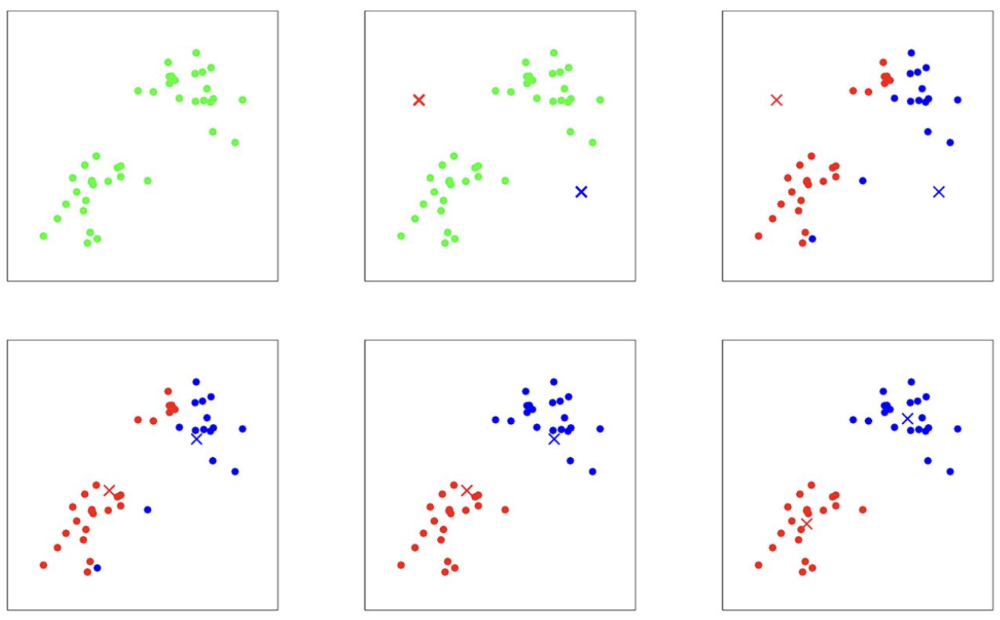

# Clustering and the $`k`$-means algorithm

In the clustering problem, we are given a training set $`\{x^{(1)}, \ldots, x^{(n)}\}`$, and want to group the data into a few cohesive "clusters." Here, $`x^{(i)} \in \mathbb{R}^d`$ as usual; but no labels $`y^{(i)}`$ are given. So, this is an unsupervised learning problem. In other words, we do not know in advance which data points belong together, and our goal is to discover natural groupings in the data based only on the features of the data points themselves.

## The $`k`$-means Clustering Algorithm

The $`k`$-means clustering algorithm is a popular and intuitive method for partitioning a dataset into $`k`$ distinct, non-overlapping clusters. The main idea is to define $`k`$ centroids, one for each cluster, and then assign each data point to the cluster whose centroid is closest. The centroids are then updated to be the mean of the points assigned to them, and the process repeats until the assignments no longer change.

Here is the algorithm in detail:

1. **Initialize cluster centroids** $`\mu_1, \mu_2, \ldots, \mu_k \in \mathbb{R}^d`$ randomly.
   - *Explanation*: The centroids $`\mu_j`$ represent the centers of the clusters. At the start, we do not know where the clusters are, so we pick $`k`$ points in the data space at random to serve as our initial guesses for the cluster centers. A common approach is to randomly select $`k`$ data points from the dataset as the initial centroids.

```python
import numpy as np

def initialize_centroids(X, k):
    """Randomly select k data points as initial centroids."""
    indices = np.random.choice(X.shape[0], k, replace=False)
    return X[indices]
```

2. **Repeat until convergence:**
- For every $`i`$, set

```math
c^{(i)} := \arg\min_j \|x^{(i)} - \mu_j\|^2.
```

*Explanation*: For each data point $`x^{(i)}`$, we compute the distance to each centroid $`\mu_j`$ and assign $`x^{(i)}`$ to the cluster whose centroid is closest. This step is called the "assignment step." The result is that each data point is assigned to exactly one cluster.

```python
def assign_clusters(X, centroids):
    """Assign each data point to the nearest centroid."""
    distances = np.linalg.norm(X[:, np.newaxis] - centroids, axis=2)
    return np.argmin(distances, axis=1)
```

- For each $`j`$, set

```math
\mu_j := \frac{\sum_{i=1}^n 1\{c^{(i)} = j\} x^{(i)}}{\sum_{i=1}^n 1\{c^{(i)} = j\}}.
```

*Explanation*: After all points have been assigned to clusters, we update each centroid $`\mu_j`$ to be the mean (average) of all the points assigned to cluster $`j`$. This is called the "update step." If a cluster ends up with no points assigned, a common strategy is to reinitialize its centroid randomly.

```python
def update_centroids(X, labels, k):
    """Update centroids as the mean of assigned points."""
    centroids = np.zeros((k, X.shape[1]))
    for j in range(k):
        points = X[labels == j]
        if len(points) > 0:
            centroids[j] = points.mean(axis=0)
        else:
            # Reinitialize centroid randomly if no points assigned
            centroids[j] = X[np.random.choice(X.shape[0])]
    return centroids
```

This process of assignment and update is repeated until the assignments no longer change, or until the centroids stop moving significantly. This means the algorithm has converged to a solution.

```python
def kmeans(X, k, max_iters=100, tol=1e-4):
    """Run the full k-means algorithm."""
    centroids = initialize_centroids(X, k)
    for _ in range(max_iters):
        labels = assign_clusters(X, centroids)
        new_centroids = update_centroids(X, labels, k)
        # Check for convergence (centroids do not change much)
        if np.allclose(centroids, new_centroids, atol=tol):
            break
        centroids = new_centroids
    return centroids, labels
```

In the algorithm above, $`k`$ (a parameter of the algorithm) is the number of clusters we want to find; and the cluster centroids $`\mu_j`$ represent our current guesses for the positions of the centers of the clusters. To initialize the cluster centroids (in step 1 of the algorithm above), we could choose $`k`$ training examples randomly, and set the cluster centroids to be equal to the values of these $`k`$ examples. (Other initialization methods are also possible, such as $`k`$-means++ which spreads out the initial centroids to improve convergence.)

```python
def kmeans_plus_plus_init(X, k):
    """k-means++ initialization for better starting centroids."""
    n_samples, n_features = X.shape
    centroids = np.empty((k, n_features))
    centroids[0] = X[np.random.choice(n_samples)]
    for i in range(1, k):
        distances = np.min(np.linalg.norm(X[:, np.newaxis] - centroids[:i], axis=2), axis=1)
        probs = distances ** 2
        probs /= probs.sum()
        centroids[i] = X[np.random.choice(n_samples, p=probs)]
    return centroids
```

The inner-loop of the algorithm repeatedly carries out two steps:
- (i) **Assigning** each training example $`x^{(i)}`$ to the closest cluster centroid $`\mu_j`$ (assignment step), and
- (ii) **Updating** each centroid $`\mu_j`$ to be the mean of the points assigned to it (update step).

This alternation between assignment and update is what drives the algorithm toward a set of clusters that best fit the data.

---



**Figure 10.1: K-means algorithm.** Training examples are shown as dots, and cluster centroids are shown as crosses. (a) Original dataset. (b) Random initial cluster centroids (in this instance, not chosen to be equal to two training examples). (c-f) Illustration of running two iterations of $`k`$-means. In each iteration, we assign each training example to the closest cluster centroid and update the centroids accordingly.

(ii) Moving each cluster centroid $`\mu_j`$ to the mean of the points assigned to it. Figure 10.1 shows an illustration of running $`k`$-means.

## Convergence and the Distortion Function

Is the $`k`$-means algorithm guaranteed to converge? Yes, in a certain sense. To understand this, we introduce the **distortion function** (also called the cost or objective function):

```math
J(c, \mu) = \sum_{i=1}^n \|x^{(i)} - \mu_{c^{(i)}}\|^2
```

- *Explanation*: $`J`$ measures the total squared distance between each data point and the centroid of the cluster to which it is assigned. The goal of $`k`$-means is to find cluster assignments and centroids that minimize this total distance. Intuitively, a lower $`J`$ means that points are closer to their cluster centers, indicating tighter, more cohesive clusters.

```python
def distortion(X, centroids, labels):
    """Compute the distortion (sum of squared distances)."""
    return np.sum((X - centroids[labels]) ** 2)
```

It can be shown that $`k`$-means is exactly **coordinate descent** on $`J`$. Specifically:
- In the assignment step, we minimize $`J`$ with respect to the assignments $`c`$ (holding the centroids $`\mu`$ fixed).
- In the update step, we minimize $`J`$ with respect to the centroids $`\mu`$ (holding the assignments $`c`$ fixed).

Each iteration of the algorithm either decreases $`J`$ or leaves it unchanged, so $`J`$ must monotonically decrease, and since there are only finitely many possible assignments, the value of $`J`$ must eventually converge. (Usually, this also means that $`c`$ and $`\mu`$ will converge too. In rare cases, $`k`$-means can oscillate between a few different clusterings that have exactly the same value of $`J`$, but this almost never happens in practice.)

## Local Optima and Practical Considerations

The distortion function $`J`$ is a **non-convex** function, which means it can have many local minima. As a result, coordinate descent on $`J`$ (i.e., the $`k`$-means algorithm) is not guaranteed to find the global minimum. In other words, the algorithm can get stuck in a solution that is not the best possible clustering for the data.

- *Practical note*: Despite this, $`k`$-means often works well in practice and finds good clusterings. However, to reduce the risk of getting stuck in a bad local minimum, it is common to run $`k`$-means multiple times with different random initializations for the centroids. After all runs, we select the clustering with the lowest distortion $`J(c, \mu)`$.

```python
def best_of_n_runs(X, k, n_runs=10):
    """Run k-means multiple times and return the best result."""
    best_J = float('inf')
    best_centroids, best_labels = None, None
    for _ in range(n_runs):
        centroids, labels = kmeans(X, k)
        J = distortion(X, centroids, labels)
        if J < best_J:
            best_J = J
            best_centroids, best_labels = centroids, labels
    return best_centroids, best_labels, best_J
```

- *Example*: Suppose you run $`k`$-means 10 times, each time starting with different random centroids. You may get slightly different clusterings each time. By comparing the final $`J`$ values, you can pick the clustering that best fits your data.

- *Initialization tip*: Using smarter initialization methods like $`k`$-means++ can help the algorithm find better solutions and converge faster by spreading out the initial centroids.

## Summary

- $`k`$-means is a simple and widely used clustering algorithm that partitions data into $`k`$ clusters by minimizing the sum of squared distances from each point to its assigned cluster centroid.
- The algorithm alternates between assigning points to the nearest centroid and updating centroids to the mean of their assigned points.
- The process is guaranteed to converge to a local minimum of the distortion function, but not necessarily the global minimum.
- Running the algorithm multiple times with different initializations and choosing the best result is a common practical strategy.
- Understanding the assignment and update steps, as well as the role of the distortion function, is key to mastering $`k`$-means clustering.

## Python Example Usage

Below is an example of how to use the k-means implementation in Python. This example generates a synthetic dataset, runs k-means, prints the centroids and distortion, and plots the results. For the full code, see `kmeans_examples.py`.

```python
import numpy as np
import matplotlib.pyplot as plt
from sklearn.datasets import make_blobs
from kmeans_examples import kmeans, distortion

# Generate synthetic data with 3 clusters
X, y_true = make_blobs(n_samples=300, centers=3, cluster_std=0.60, random_state=0)
k = 3

# Run k-means
centroids, labels = kmeans(X, k)
print("Centroids:\n", centroids)
print("Distortion:", distortion(X, centroids, labels))

# Plot the results
plt.scatter(X[:, 0], X[:, 1], c=labels, s=30, cmap='viridis')
plt.scatter(centroids[:, 0], centroids[:, 1], c='red', s=200, alpha=0.75, marker='X')
plt.title('K-means Clustering Results')
plt.show()
```