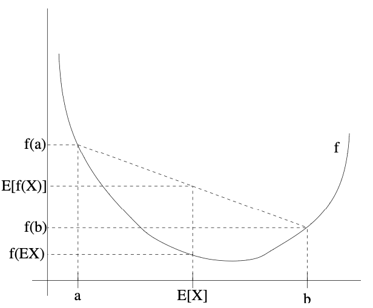

# EM algorithms

## EM for mixture of Gaussians

Suppose that we are given a training set $`\{x^{(1)}, \ldots, x^{(n)}\}`$ as usual. Since we are in the unsupervised learning setting, these points do not come with any labels. In other words, we have data but do not know which group or cluster each data point belongs to. Our goal is to discover the underlying structure in the data.

### The Mixture of Gaussians Model

We wish to model the data by specifying a joint distribution $`p(x^{(i)}, z^{(i)}) = p(x^{(i)}|z^{(i)})p(z^{(i)})`$. Here:
- $`z^{(i)}`$ is a latent (hidden) variable indicating which cluster or Gaussian component generated $`x^{(i)}`$.
- $`z^{(i)} \sim \text{Multinomial}(\phi)`$ means that $`z^{(i)}`$ is chosen according to probabilities $`\phi_j`$ for each cluster $`j`$ (with $`\sum_{j=1}^k \phi_j = 1`$).
- $`x^{(i)}|z^{(i)} = j \sim \mathcal{N}(\mu_j, \Sigma_j)`$ means that, given the cluster assignment, $`x^{(i)}`$ is drawn from a Gaussian with mean $`\mu_j`$ and covariance $`\Sigma_j`$.

This is called the **mixture of Gaussians** model. The $`z^{(i)}`$'s are not observed, which makes the estimation problem more challenging. The parameters of our model are $`\phi`$ (mixing proportions), $`\mu`$ (means), and $`\Sigma`$ (covariances).

### Likelihood and the Challenge of Estimation

To estimate the parameters, we write down the likelihood of our data:

```math
\ell(\phi, \mu, \Sigma) = \sum_{i=1}^n \log p(x^{(i)}; \phi, \mu, \Sigma)
```

This expands to:

```math
= \sum_{i=1}^n \log \sum_{z^{(i)}=1}^k p(x^{(i)}|z^{(i)}; \mu, \Sigma) p(z^{(i)}; \phi)
```

This formula sums over all possible assignments of $`z^{(i)}`$ for each data point, reflecting our uncertainty about which cluster generated each $`x^{(i)}`$. However, maximizing this likelihood directly is difficult because the sum is inside the log, making the derivatives hard to solve for.

If we **did** know the $`z^{(i)}`$'s (i.e., which cluster each point came from), the problem would be much easier. The likelihood would become:

```math
\ell(\phi, \mu, \Sigma) = \sum_{i=1}^n \log p(x^{(i)}|z^{(i)}; \mu, \Sigma) + \log p(z^{(i)}; \phi)
```

Maximizing this with respect to $`\phi`$, $`\mu`$, and $`\Sigma`$ gives the following closed-form solutions:

```math
\phi_j = \frac{1}{n} \sum_{i=1}^n 1\{z^{(i)} = j\}
```

```math
\mu_j = \frac{\sum_{i=1}^n 1\{z^{(i)} = j\} x^{(i)}}{\sum_{i=1}^n 1\{z^{(i)} = j\}}
```

```math
\Sigma_j = \frac{\sum_{i=1}^n 1\{z^{(i)} = j\} (x^{(i)} - \mu_j)(x^{(i)} - \mu_j)^T}{\sum_{i=1}^n 1\{z^{(i)} = j\}}
```

These formulas are intuitive: $`\phi_j`$ is the fraction of points in cluster $`j`$, $`\mu_j`$ is the mean of points in cluster $`j`$, and $`\Sigma_j`$ is the covariance of points in cluster $`j`$.

### The EM Algorithm: Intuition and Steps

In practice, we do **not** know the $`z^{(i)}`$'s. The EM (Expectation-Maximization) algorithm provides a way to estimate the parameters in the presence of hidden variables. The key idea is to alternate between:
- **E-step (Expectation):** Estimate the probability that each data point belongs to each cluster (i.e., "soft" assignments).
- **M-step (Maximization):** Update the parameters $`\phi`$, $`\mu`$, and $`\Sigma`$ as if these soft assignments were the true cluster memberships.

#### EM Algorithm for Mixture of Gaussians

Repeat until convergence:

**(E-step)** For each $`i, j`$, set

```math
w_j^{(i)} := p(z^{(i)} = j | x^{(i)}; \phi, \mu, \Sigma)
```

This $`w_j^{(i)}`$ is the probability (under the current parameters) that $`x^{(i)}`$ was generated by cluster $`j`$. These are called "soft" assignments because they are probabilities, not hard 0/1 assignments.

**(M-step)** Update the parameters:

```math
\phi_j := \frac{1}{n} \sum_{i=1}^n w_j^{(i)}
```

```math
\mu_j := \frac{\sum_{i=1}^n w_j^{(i)} x^{(i)}}{\sum_{i=1}^n w_j^{(i)}}
```

```math
\Sigma_j := \frac{\sum_{i=1}^n w_j^{(i)} (x^{(i)} - \mu_j)(x^{(i)} - \mu_j)^T}{\sum_{i=1}^n w_j^{(i)}}
```

In the E-step, we calculate the posterior probability for each cluster and each data point, using Bayes' rule:

```math
p(z^{(i)} = j | x^{(i)}; \phi, \mu, \Sigma) = \frac{p(x^{(i)}|z^{(i)} = j; \mu, \Sigma)p(z^{(i)} = j; \phi)}{\sum_{l=1}^k p(x^{(i)}|z^{(i)} = l; \mu, \Sigma)p(z^{(i)} = l; \phi)}
```

Here, $`p(x^{(i)}|z^{(i)} = j; \mu, \Sigma)`$ is the value of the Gaussian density for cluster $`j`$ at $`x^{(i)}`$, and $`p(z^{(i)} = j; \phi)`$ is just $`\phi_j`$. The $`w_j^{(i)}`$ values are our "soft" guesses for the cluster assignments.

#### Intuitive Comparison and Practical Notes

- When the $`z^{(i)}`$'s are known, the M-step formulas reduce to the simple cluster means, covariances, and proportions, just like in supervised learning.
- The EM algorithm is similar to K-means, but instead of hard assignments (each point belongs to one cluster), we use soft assignments (each point has a probability for each cluster).
- Like K-means, EM can get stuck in local optima, so it is a good idea to run it several times with different initializations and pick the best result.

The EM algorithm is a powerful and general approach for dealing with missing or hidden data in probabilistic models. It alternates between "guessing" the hidden variables and updating the parameters, and is widely used in machine learning and statistics.

## 11.2 Jensen's inequality

We begin our discussion with a very useful result called **Jensen's inequality**.

### What is Jensen's Inequality?

Let $`f`$ be a function whose domain is the set of real numbers. Recall that $`f`$ is a convex function if $`f''(x) \geq 0`$ (for all $`x \in \mathbb{R}`$). For vector-valued inputs, convexity means the Hessian $`H`$ is positive semi-definite ($`H \geq 0`$). If $`f''(x) > 0`$ for all $`x`$, then $`f`$ is **strictly** convex (or $`H > 0`$).

**Jensen's inequality** states:

```math
\mathbb{E}[f(X)] \geq f(\mathbb{E}[X])
```

where $`X`$ is a random variable and $`f`$ is convex. If $`f`$ is strictly convex, equality holds only if $`X`$ is constant (i.e., $`X = \mathbb{E}[X]`$ with probability 1).

#### Intuitive Explanation

Jensen's inequality says that the expected value of a convex function of a random variable is at least as large as the convex function of the expected value. In other words, "the function of the average is less than or equal to the average of the function" for convex functions.

Recall our convention of occasionally dropping the parentheses when writing expectations, so $`f(\mathbb{E}X) = f(\mathbb{E}[X])`$.



Here, $`f`$ is a convex function shown by the solid line. $`X`$ is a random variable that has a 0.5 chance of taking the value $`a`$ and a 0.5 chance of taking the value $`b`$ (on the $`x`$-axis). The expected value $`\mathbb{E}[X]`$ is the midpoint between $`a`$ and $`b`$. The values $`f(a)`$, $`f(b)`$, and $`f(\mathbb{E}[X])`$ are shown on the $`y`$-axis. The value $`\mathbb{E}[f(X)]`$ is the midpoint between $`f(a)`$ and $`f(b)`$ on the $`y`$-axis. Because $`f`$ is convex, $`\mathbb{E}[f(X)] \geq f(\mathbb{E}X)`$.

#### Practical Note

Many people have trouble remembering which way the inequality goes. Remembering a picture like the one above is a good way to quickly figure it out.

**Remark.** $`f`$ is [strictly] concave if and only if $`-f`$ is [strictly] convex (i.e., $`f''(x) \leq 0`$ or $`H \leq 0`$). Jensen's inequality also holds for concave functions $`f`$, but with the direction of the inequality reversed: $`\mathbb{E}[f(X)] \leq f(\mathbb{E}X)`$, etc.

## Python Implementation: EM for Mixture of Gaussians

Below is a full Python implementation of the EM algorithm for a mixture of Gaussians, as described above. This code is also available in `em_mog_examples.py`.

### Initialization
```python
import numpy as np
from scipy.stats import multivariate_normal
import matplotlib.pyplot as plt

def initialize_parameters(X, k, seed=None):
    """
    Randomly initialize the parameters for the mixture of Gaussians.
    Args:
        X: Data array of shape (n_samples, n_features)
        k: Number of clusters
        seed: Random seed (optional)
    Returns:
        phi: Mixing proportions (k,)
        mu: Means (k, n_features)
        Sigma: Covariances (k, n_features, n_features)
    """
    if seed is not None:
        np.random.seed(seed)
    n_samples, n_features = X.shape
    phi = np.ones(k) / k
    mu = X[np.random.choice(n_samples, k, replace=False)]
    Sigma = np.array([np.cov(X, rowvar=False) for _ in range(k)])
    return phi, mu, Sigma
```

### E-step
```python
def e_step(X, phi, mu, Sigma):
    """
    E-step: Compute responsibilities (soft assignments).
    Args:
        X: Data array (n_samples, n_features)
        phi: Mixing proportions (k,)
        mu: Means (k, n_features)
        Sigma: Covariances (k, n_features, n_features)
    Returns:
        w: Responsibilities (n_samples, k)
    """
    n_samples, n_features = X.shape
    k = phi.shape[0]
    w = np.zeros((n_samples, k))
    for j in range(k):
        rv = multivariate_normal(mean=mu[j], cov=Sigma[j], allow_singular=True)
        w[:, j] = phi[j] * rv.pdf(X)
    w_sum = w.sum(axis=1, keepdims=True)
    w = w / w_sum
    return w
```

### M-step
```python
def m_step(X, w):
    """
    M-step: Update parameters given responsibilities.
    Args:
        X: Data array (n_samples, n_features)
        w: Responsibilities (n_samples, k)
    Returns:
        phi: Updated mixing proportions (k,)
        mu: Updated means (k, n_features)
        Sigma: Updated covariances (k, n_features, n_features)
    """
    n_samples, n_features = X.shape
    k = w.shape[1]
    phi = w.sum(axis=0) / n_samples
    mu = (w.T @ X) / w.sum(axis=0)[:, None]
    Sigma = np.zeros((k, n_features, n_features))
    for j in range(k):
        X_centered = X - mu[j]
        weighted = w[:, j][:, None] * X_centered
        Sigma[j] = (weighted.T @ X_centered) / w[:, j].sum()
    return phi, mu, Sigma
```

### Log-likelihood
```python
def log_likelihood(X, phi, mu, Sigma):
    """
    Compute the log-likelihood of the data under the current parameters.
    """
    n_samples = X.shape[0]
    k = phi.shape[0]
    total = np.zeros(n_samples)
    for j in range(k):
        rv = multivariate_normal(mean=mu[j], cov=Sigma[j], allow_singular=True)
        total += phi[j] * rv.pdf(X)
    return np.sum(np.log(total))
```

### EM main loop
```python
def em_mog(X, k, max_iters=100, tol=1e-4, seed=None, verbose=False):
    """
    Run the EM algorithm for a mixture of Gaussians.
    Args:
        X: Data array (n_samples, n_features)
        k: Number of clusters
        max_iters: Maximum number of iterations
        tol: Convergence tolerance (on log-likelihood)
        seed: Random seed (optional)
        verbose: Print log-likelihood at each step
    Returns:
        phi, mu, Sigma: Estimated parameters
        w: Final responsibilities
        logliks: List of log-likelihoods
    """
    phi, mu, Sigma = initialize_parameters(X, k, seed=seed)
    logliks = []
    for i in range(max_iters):
        w = e_step(X, phi, mu, Sigma)
        phi, mu, Sigma = m_step(X, w)
        ll = log_likelihood(X, phi, mu, Sigma)
        logliks.append(ll)
        if verbose:
            print(f"Iteration {i+1}, log-likelihood: {ll:.4f}")
        if i > 0 and abs(logliks[-1] - logliks[-2]) < tol:
            break
    return phi, mu, Sigma, w, logliks
```

### Example usage
```python
if __name__ == "__main__":
    from sklearn.datasets import make_blobs

    # Generate synthetic data
    X, y_true = make_blobs(n_samples=400, centers=3, cluster_std=0.7, random_state=42)
    k = 3

    # Run EM for mixture of Gaussians
    phi, mu, Sigma, w, logliks = em_mog(X, k, max_iters=100, tol=1e-4, seed=42, verbose=True)

    print("Estimated mixing proportions (phi):", phi)
    print("Estimated means (mu):\n", mu)
    print("Estimated covariances (Sigma):\n", Sigma)

    # Assign each point to the most likely cluster
    labels = np.argmax(w, axis=1)

    # Plot the results
    plt.figure(figsize=(8, 6))
    plt.scatter(X[:, 0], X[:, 1], c=labels, cmap='viridis', s=30, alpha=0.6)
    plt.scatter(mu[:, 0], mu[:, 1], c='red', s=200, marker='X', label='Estimated Means')
    plt.title('EM for Mixture of Gaussians')
    plt.legend()
    plt.show()

    # Plot log-likelihood
    plt.figure()
    plt.plot(logliks, marker='o')
    plt.xlabel('Iteration')
    plt.ylabel('Log-likelihood')
    plt.title('EM Log-likelihood Convergence')
    plt.show()
```