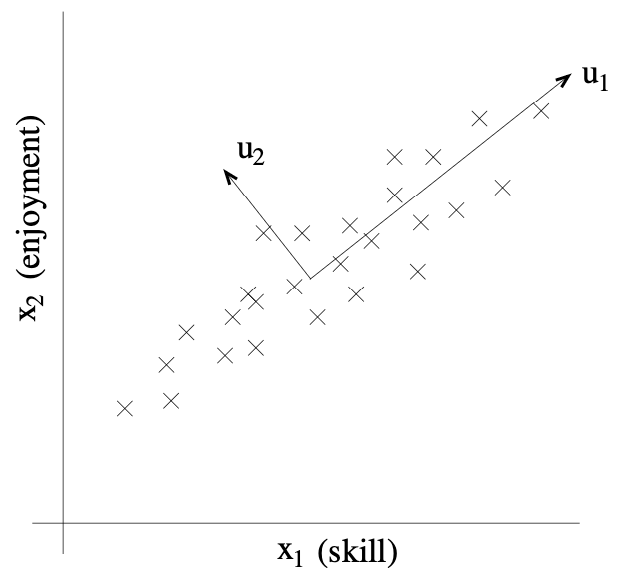
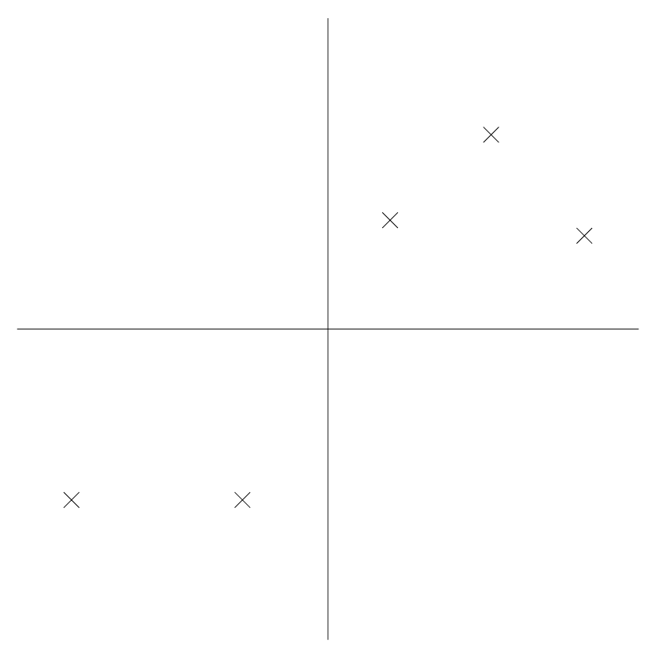
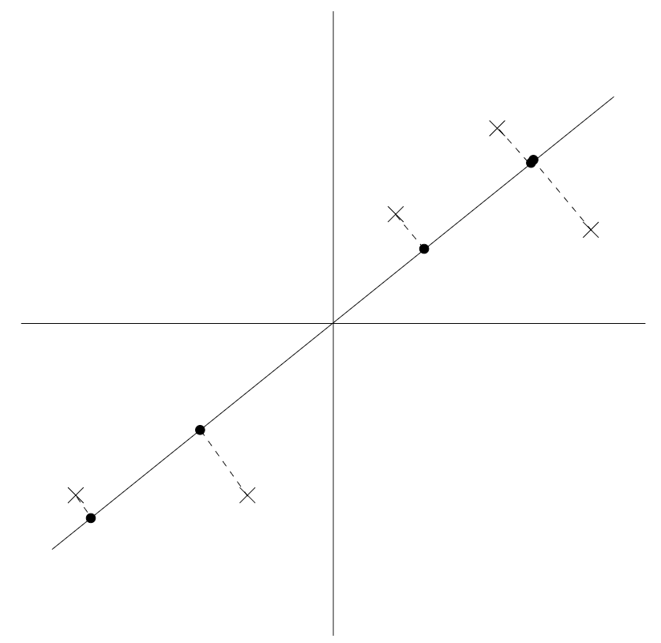
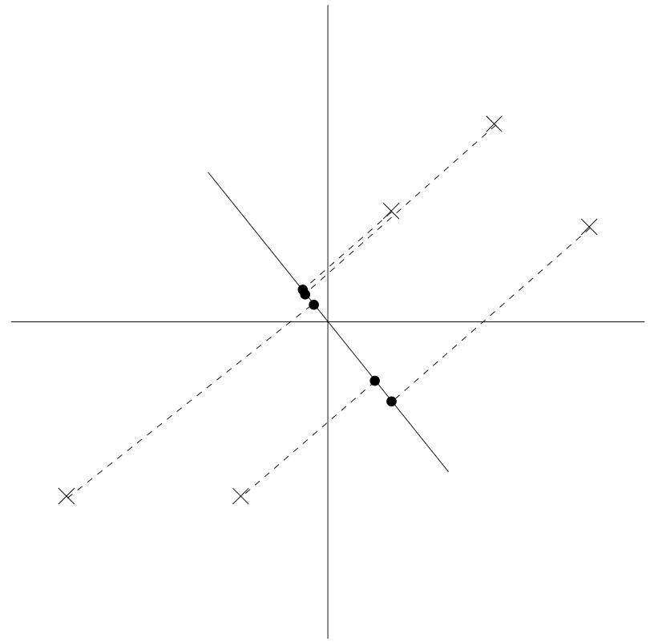

# Principal Components Analysis (PCA)

## Introduction and Motivation

In modern data analysis and machine learning, we often encounter datasets with a large number of features (dimensions). For example, an image with 100x100 pixels has 10,000 features, and a dataset of cars might record dozens of attributes for each vehicle. However, not all of these features are equally important or independent—many are correlated or even redundant. This can make data analysis, visualization, and modeling more difficult, a phenomenon sometimes called the **"curse of dimensionality."**

### What is the Curse of Dimensionality?

The curse of dimensionality refers to various phenomena that arise when analyzing and organizing data in high-dimensional spaces. As the number of dimensions increases, the volume of the space increases so fast that the available data becomes sparse. This sparsity is problematic for any method that requires statistical significance. In high dimensions, all data points become equidistant from each other, making distance-based algorithms less effective.

**Key problems:**
- **Data sparsity:** In high dimensions, data points become increasingly isolated
- **Computational complexity:** Many algorithms scale poorly with dimension
- **Overfitting:** Models can easily memorize noise in high-dimensional spaces
- **Visualization difficulty:** Humans can only easily visualize up to 3 dimensions

### What is PCA?

Principal Components Analysis (PCA) is a powerful technique for reducing the number of dimensions in a dataset while preserving as much of the original information (variance) as possible. By finding new axes (directions) in the data that capture the most variation, PCA allows us to:

- **Simplify complex datasets:** Make them easier to visualize and interpret
- **Remove redundancy and noise:** Eliminate correlated features
- **Speed up algorithms:** Reduce computational complexity
- **Reveal hidden patterns:** Uncover underlying structure in the data
- **Prevent overfitting:** Reduce model complexity

### Intuitive Understanding

**The 3D to 2D Analogy:** Imagine you have a cloud of points in 3D space, but all the points lie close to a flat plane. Instead of describing each point with three coordinates (x, y, z), you could describe it almost as well with just two coordinates on that plane. PCA finds the best-fitting plane (or line, or higher-dimensional subspace) for your data, so you can represent it with fewer numbers without losing much information.

**The Flashlight Analogy:** Think of your data as a cloud of points in space. If you shine a flashlight on this cloud, the shadow on the wall is a projection. PCA finds the direction to shine the flashlight so that the shadow is as spread out (has maximum variance) as possible.

### Mathematical Foundation

PCA is computationally efficient because it requires only an eigenvector calculation. The mathematical foundation rests on linear algebra, specifically:

1. **Eigenvalue decomposition** of the covariance matrix
2. **Orthogonal transformations** that preserve distances
3. **Variance maximization** under constraints

## Real-World Examples

### Example 1: Automobile Dataset

Suppose we are given a dataset $` x^{(i)}; i = 1, \ldots, n `$ of attributes of $` n `$ different types of automobiles, such as their maximum speed, turn radius, engine power, fuel efficiency, and so on. Let $` x^{(i)} \in \mathbb{R}^d `$ for each $` i `$ ($` d \ll n `$).

**The Redundancy Problem:** Unknown to us, two different attributes—some $` x_i `$ and $` x_j `$—respectively give a car's maximum speed measured in miles per hour, and the maximum speed measured in kilometers per hour. These two attributes are therefore almost linearly dependent, up to only small differences introduced by rounding off to the nearest mph or kph. Thus, the data really lies approximately on an $` d-1 `$ dimensional subspace.

**The Question:** How can we automatically detect, and perhaps remove, this redundancy?

### Example 2: RC Helicopter Pilots

Consider a dataset resulting from a survey of pilots for radio-controlled helicopters, where $` x_1^{(i)} `$ is a measure of the piloting skill of pilot $` i `$, and $` x_2^{(i)} `$ captures how much he/she enjoys flying.

**The Correlation:** Because RC helicopters are very difficult to fly, only the most committed students, ones that truly enjoy flying, become good pilots. So, the two attributes $` x_1 `$ and $` x_2 `$ are strongly correlated.

**The Latent Variable:** We might posit that the data actually lies along some diagonal axis (the $` u_1 `$ direction) capturing the intrinsic piloting "karma" of a person, with only a small amount of noise lying off this axis.

**The Question:** How can we automatically compute this $` u_1 `$ direction?



## Data Preprocessing: Normalization

Before applying PCA, it is standard practice to preprocess the data by normalizing each feature so that it has mean 0 and variance 1. This step is crucial for several reasons:

### Why Normalize?

1. **Equal footing for all features:** If one feature (e.g., height in centimeters) has much larger values than another (e.g., number of children), it can dominate the analysis, even if it is not more important. Normalization ensures that all features contribute equally.

2. **Removes bias from units:** Features measured in different units (e.g., miles per hour vs. kilometers per hour) are made comparable.

3. **Centers the data:** Subtracting the mean ensures that the data is centered at the origin, which is important for the mathematics of PCA.

4. **Variance scaling:** Dividing by the standard deviation ensures that each feature has unit variance, so PCA does not favor features with larger natural variability.

### Mathematical Definition

For a feature vector $` x = [x_1, x_2, \ldots, x_d]^T `$, the normalized version $` z = [z_1, z_2, \ldots, z_d]^T `$ is computed as:

```math
z_i = \frac{x_i - \mu_i}{\sigma_i}
```

where:
- $` \mu_i = \frac{1}{n} \sum_{j=1}^n x_i^{(j)} `$ is the mean of feature $` i `$
- $` \sigma_i = \sqrt{\frac{1}{n} \sum_{j=1}^n (x_i^{(j)} - \mu_i)^2} `$ is the standard deviation of feature $` i `$

### Step-by-step Example

Suppose we have a dataset with two features:

| Example | Height (cm) | Age (years) |
|---------|-------------|-------------|
| 1       | 170         | 30          |
| 2       | 160         | 25          |
| 3       | 180         | 35          |

**Step 1: Compute the mean of each feature**
- Mean height: $` \mu_h = \frac{170 + 160 + 180}{3} = 170 `$
- Mean age: $` \mu_a = \frac{30 + 25 + 35}{3} = 30 `$

**Step 2: Subtract the mean from each value (centering)**
- Centered heights: $` [0, -10, +10] `$
- Centered ages: $` [0, -5, +5] `$

**Step 3: Compute the standard deviation of each feature**
- Std height: $` \sigma_h = \sqrt{\frac{0^2 + (-10)^2 + 10^2}{3}} = \sqrt{\frac{200}{3}} \approx 8.16 `$
- Std age: $` \sigma_a = \sqrt{\frac{0^2 + (-5)^2 + 5^2}{3}} = \sqrt{\frac{50}{3}} \approx 4.08 `$

**Step 4: Divide each centered value by the standard deviation (scaling)**
- Normalized heights: $` [0, -1.23, 1.23] `$
- Normalized ages: $` [0, -1.23, 1.23] `$

After normalization, both features have mean 0 and variance 1, and are on the same scale. This prepares the data for PCA.

## The Core Problem: Finding Principal Components

Now, having normalized our data, how do we compute the "major axis of variation" $` u `$—that is, the direction on which the data approximately lies?

### Problem Formulation

We want to find the unit vector $` u `$ so that when the data is projected onto the direction corresponding to $` u `$, the variance of the projected data is maximized.

**Intuition:** The data starts off with some amount of variance/information in it. We would like to choose a direction $` u `$ so that if we were to approximate the data as lying in the direction/subspace corresponding to $` u `$, as much as possible of this variance is still retained.

### Visual Example

Consider the following dataset, on which we have already carried out the normalization steps:



**Good Direction:** Suppose we pick $` u `$ to correspond to the direction shown in the figure below. The circles denote the projections of the original data onto this line.



We see that the projected data still has a fairly large variance, and the points tend to be far from zero.

**Poor Direction:** In contrast, suppose we had instead picked the following direction:



Here, the projections have a significantly smaller variance, and are much closer to the origin.

### Mathematical Formulation

We want to automatically select the direction $` u `$ corresponding to the first case. To formalize this:

1. **Projection:** Given a unit vector $` u `$ and a point $` x `$, the length of the projection of $` x `$ onto $` u `$ is given by $` x^T u `$.

2. **Variance of Projections:** If $` x^{(i)} `$ is a point in our dataset, then its projection onto $` u `$ is distance $` x^{(i)T} u `$ from the origin.

3. **Objective Function:** To maximize the variance of the projections, we want to choose a unit-length $` u `$ so as to maximize:

```math
\frac{1}{n} \sum_{i=1}^n (x^{(i)T} u)^2 = \frac{1}{n} \sum_{i=1}^n u^T x^{(i)} x^{(i)T} u = u^T \left( \frac{1}{n} \sum_{i=1}^n x^{(i)} x^{(i)T} \right) u
```

4. **Covariance Matrix:** We recognize that $` \Sigma = \frac{1}{n} \sum_{i=1}^n x^{(i)} x^{(i)T} `$ is the empirical covariance matrix of the data (assuming it has zero mean).

5. **Optimization Problem:** We want to maximize $` u^T \Sigma u `$ subject to $` \|u\|_2 = 1 `$.

### Solution via Eigenvalue Decomposition

The maximizing $` u `$ subject to $` \|u\|_2 = 1 `$ gives the principal eigenvector of $` \Sigma `$.

**Derivation using Lagrange Multipliers:**

We want to maximize $` f(u) = u^T \Sigma u `$ subject to the constraint $` g(u) = u^T u - 1 = 0 `$.

The Lagrangian is:
```math
L(u, \lambda) = u^T \Sigma u - \lambda(u^T u - 1)
```

Taking the gradient with respect to $` u `$ and setting it to zero:
```math
\nabla_u L = 2\Sigma u - 2\lambda u = 0
```

This gives us:
```math
\Sigma u = \lambda u
```

This is the eigenvalue equation! The solution $` u `$ is an eigenvector of $` \Sigma `$ with eigenvalue $` \lambda `$.

**Key Insight:** The eigenvector corresponding to the largest eigenvalue gives us the direction of maximum variance.

## Extending to Multiple Dimensions

### Multiple Principal Components

To summarize, we have found that if we wish to find a 1-dimensional subspace with which to approximate the data, we should choose $` u `$ to be the principal eigenvector of $` \Sigma `$.

**Generalization:** If we wish to project our data into a $` k `$-dimensional subspace ($` k < d `$), we should choose $` u_1, \ldots, u_k `$ to be the top $` k `$ eigenvectors of $` \Sigma `$.

### Orthogonality Property

The $` u_i `$'s now form a new, orthogonal basis for the data. Because $` \Sigma `$ is symmetric, the $` u_i `$'s will (or always can be chosen to be) orthogonal to each other.

**Why Orthogonal?** This is a key property of symmetric matrices: their eigenvectors can always be chosen to be orthogonal. This means each principal component captures variance in a direction that is perpendicular to all previous components.

### Projection Formula

Then, to represent $` x^{(i)} `$ in this basis, we need only compute the corresponding vector:

```math
y^{(i)} = \begin{bmatrix}
    u_1^T x^{(i)} \\
    u_2^T x^{(i)} \\
    \vdots \\
    u_k^T x^{(i)}
\end{bmatrix} \in \mathbb{R}^k
```

### Dimensionality Reduction

Thus, whereas $` x^{(i)} \in \mathbb{R}^d `$, the vector $` y^{(i)} `$ now gives a lower, $` k `$-dimensional, approximation/representation for $` x^{(i)} `$. PCA is therefore also referred to as a **dimensionality reduction** algorithm.

The vectors $` u_1, \ldots, u_k `$ are called the first $` k `$ **principal components** of the data.

## Mathematical Properties and Guarantees

### Optimality Property

**Remark:** Although we have shown it formally only for the case of $` k = 1 `$, using well-known properties of eigenvectors it is straightforward to show that of all possible orthogonal bases $` u_1, \ldots, u_k `$, the one that we have chosen maximizes $` \sum_i \|y^{(i)}\|_2^2 `$.

**Interpretation:** Our choice of a basis preserves as much variability as possible in the original data.

### Alternative Derivation: Minimizing Reconstruction Error

PCA can also be derived by picking the basis that minimizes the approximation error arising from projecting the data onto the $` k `$-dimensional subspace spanned by them.

**Reconstruction Error:** If we project $` x^{(i)} `$ onto the subspace spanned by $` u_1, \ldots, u_k `$ to get $` \hat{x}^{(i)} `$, then the reconstruction error is:

```math
\sum_{i=1}^n \|x^{(i)} - \hat{x}^{(i)}\|_2^2
```

**Key Result:** The principal components minimize this reconstruction error.

### Explained Variance

The eigenvalues $` \lambda_1 \geq \lambda_2 \geq \ldots \geq \lambda_d `$ tell us how much variance each principal component captures.

**Explained Variance Ratio:** The fraction of total variance explained by the $` i `$-th principal component is:

```math
\frac{\lambda_i}{\sum_{j=1}^d \lambda_j}
```

**Cumulative Explained Variance:** The fraction of total variance explained by the first $` k `$ principal components is:

```math
\frac{\sum_{i=1}^k \lambda_i}{\sum_{j=1}^d \lambda_j}
```

## Applications of PCA

PCA has many applications across various domains:

### 1. Data Compression

**Compression:** Representing $` x^{(i)} `$'s with lower dimension $` y^{(i)} `$'s is an obvious application. This is particularly useful for:
- Image compression
- Audio compression
- Document compression

### 2. Data Visualization

**Visualization:** If we reduce high dimensional data to $` k = 2 `$ or 3 dimensions, then we can plot the $` y^{(i)} `$'s to visualize the data.

**Example:** If we were to reduce our automobiles data to 2 dimensions, then we can plot it (one point in our plot would correspond to one car type) to see what cars are similar to each other and what groups of cars may cluster together.

### 3. Preprocessing for Machine Learning

**Dimensionality Reduction:** Another standard application is to preprocess a dataset to reduce its dimension before running a supervised learning algorithm with the $` x^{(i)} `$'s as inputs.

**Benefits:**
- **Computational benefits:** Faster training and inference
- **Reduced complexity:** Lower dimensional input spaces have smaller VC dimension
- **Overfitting prevention:** Fewer parameters to learn

### 4. Noise Reduction

**Signal Processing:** As in our RC pilot example, we can also view PCA as a noise reduction algorithm. In our example it estimates the intrinsic "piloting karma" from the noisy measures of piloting skill and enjoyment.

### 5. Face Recognition: Eigenfaces

**Computer Vision:** In face recognition, each point $` x^{(i)} \in \mathbb{R}^{100 \times 100} `$ was a 10000 dimensional vector, with each coordinate corresponding to a pixel intensity value in a 100x100 image of a face.

**Process:**
1. Using PCA, we represent each image $` x^{(i)} `$ with a much lower-dimensional $` y^{(i)} `$
2. We hope that the principal components retain the interesting, systematic variations between faces that capture what a person really looks like
3. We discard the "noise" in the images introduced by minor lighting variations, slightly different imaging conditions, and so on
4. We measure distances between faces $` i `$ and $` j `$ by working in the reduced dimension, and computing $` \|y^{(i)} - y^{(j)}\|_2 `$

This resulted in a surprisingly good face-matching and retrieval algorithm.

## Variance Maximization and Geometric Intuition

After normalization, the next step in PCA is to find the direction in which the data varies the most. But what does this mean, and why do we care about variance?

### Intuitive Analogies

**Flashlight Analogy:** Imagine shining a flashlight on a cloud of points (your data) in a dark room. The shadow cast on the wall is the projection of your data onto a direction. If you want the shadow to be as "spread out" as possible, you would rotate the flashlight until the shadow is longest. This direction of maximum spread is what PCA seeks: the direction along which the data has the greatest variance.

**Pancake Analogy:** Think of your data as a pancake in 3D space. If you look at the pancake from different angles, it appears as different shapes. PCA finds the angle from which the pancake appears widest (has maximum variance).

### Why Maximize Variance?

1. **Information Preservation:** The direction of maximum variance captures the most "information" or "structure" in the data. If you had to summarize the data with a single number (its coordinate along a line), you would want to choose the line that preserves as much of the original variation as possible.

2. **Minimal Information Loss:** By projecting onto this direction, you lose the least amount of information about how the data points differ from each other.

3. **Signal vs. Noise:** High variance directions often correspond to signal, while low variance directions often correspond to noise.

### Geometric Interpretation

**Projection:** Projecting a point $` x `$ onto a direction $` u `$ means dropping a perpendicular from $` x `$ to the line defined by $` u `$.

**Projection Length:** The length of this projection is $` x^T u `$ (assuming $` u `$ is a unit vector).

**Variance Maximization:** If you project all your data points onto $` u `$ and look at how spread out the projections are (their variance), the direction $` u `$ that gives the largest variance is the first principal component.

### Visual Intuition

**Elongated Clouds:** If your data forms an elongated cloud, the first principal component points along the long axis of the cloud.

**Multiple Components:** The second principal component (if you want to keep two dimensions) is perpendicular to the first and points in the next most variable direction, and so on.

**Orthogonality:** Each subsequent principal component is orthogonal to all previous ones, ensuring that each captures variance in a new, independent direction.

## Covariance Matrix: The Foundation

The covariance matrix captures how each pair of features varies together. It is a key step in PCA, as its eigenvectors define the principal components.

### Definition

For a dataset $` X \in \mathbb{R}^{n \times d} `$ with $` n `$ samples and $` d `$ features, the covariance matrix $` \Sigma \in \mathbb{R}^{d \times d} `$ is defined as:

```math
\Sigma = \frac{1}{n} \sum_{i=1}^n (x^{(i)} - \mu)(x^{(i)} - \mu)^T
```

where $` \mu = \frac{1}{n} \sum_{i=1}^n x^{(i)} `$ is the mean vector.

### Properties

1. **Symmetric:** $` \Sigma = \Sigma^T `$
2. **Positive Semi-definite:** $` v^T \Sigma v \geq 0 `$ for all vectors $` v `$
3. **Diagonal Elements:** $` \Sigma_{ii} `$ is the variance of feature $` i `$
4. **Off-diagonal Elements:** $` \Sigma_{ij} `$ is the covariance between features $` i `$ and $` j `$

### Interpretation

- **Large diagonal values:** Features with high variance
- **Large off-diagonal values:** Highly correlated features
- **Small off-diagonal values:** Nearly independent features

## Eigen Decomposition: The Mathematical Engine

PCA finds the directions (principal components) by computing the eigenvectors and eigenvalues of the covariance matrix. The eigenvectors are the directions, and the eigenvalues tell us how much variance is captured by each direction.

### Eigenvalue Decomposition

For a symmetric matrix $` \Sigma `$, we can write:

```math
\Sigma = U \Lambda U^T
```

where:
- $` U = [u_1, u_2, \ldots, u_d] `$ is an orthogonal matrix whose columns are eigenvectors
- $` \Lambda = \text{diag}(\lambda_1, \lambda_2, \ldots, \lambda_d) `$ is a diagonal matrix of eigenvalues
- $` \lambda_1 \geq \lambda_2 \geq \ldots \geq \lambda_d \geq 0 `$ (ordered by magnitude)

### Key Properties

1. **Orthogonality:** $` u_i^T u_j = 0 `$ for $` i \neq j `$
2. **Unit Length:** $` \|u_i\|_2 = 1 `$ for all $` i `$
3. **Variance Capture:** $` \text{Var}(u_i^T X) = \lambda_i `$

### Algorithm

1. **Compute covariance matrix:** $` \Sigma = \frac{1}{n} X^T X `$ (assuming centered data)
2. **Find eigenvalues and eigenvectors:** $` \Sigma = U \Lambda U^T `$
3. **Sort by eigenvalues:** Order eigenvectors by decreasing eigenvalues
4. **Select top k:** Choose first $` k `$ eigenvectors as principal components

## Projection: Transforming the Data

To reduce dimensionality, we project the normalized data onto the top $` k `$ principal components (eigenvectors).

### Projection Matrix

The projection matrix $` W \in \mathbb{R}^{d \times k} `$ is formed by the first $` k `$ eigenvectors:

```math
W = [u_1, u_2, \ldots, u_k]
```

### Projection Formula

The projected data $` Y \in \mathbb{R}^{n \times k} `$ is computed as:

```math
Y = XW
```

or equivalently, for each data point:

```math
y^{(i)} = W^T x^{(i)}
```

### Reconstruction

To reconstruct the original data (approximately):

```math
\hat{X} = YW^T = XWW^T
```

**Note:** $` WW^T \neq I `$ unless $` k = d `$, so reconstruction is only approximate.

### Reconstruction Error

The mean squared reconstruction error is:

```math
\frac{1}{n} \sum_{i=1}^n \|x^{(i)} - \hat{x}^{(i)}\|_2^2 = \sum_{i=k+1}^d \lambda_i
```

This shows that the reconstruction error equals the sum of the discarded eigenvalues.

## Visualization: Understanding the Results

Visualization helps us understand how PCA separates the data. For 2D projections, we can plot the data along the first two principal components.

### Scatter Plots

The most common visualization is a scatter plot of the first two principal components:

- **X-axis:** First principal component (PC1)
- **Y-axis:** Second principal component (PC2)
- **Points:** Each point represents one data sample
- **Clusters:** Similar data points should cluster together

### Explained Variance Plot

Another useful visualization shows the cumulative explained variance:

- **X-axis:** Number of principal components
- **Y-axis:** Cumulative explained variance ratio
- **Elbow method:** Look for the "elbow" where adding more components provides diminishing returns

### Biplot

A biplot shows both the projected data points and the original feature directions:

- **Points:** Projected data samples
- **Arrows:** Original feature directions projected onto the principal components
- **Length:** Importance of each feature in the principal components

## Practical Considerations

### Choosing the Number of Components

**Methods for selecting $` k `$:**

1. **Explained Variance Threshold:** Choose $` k `$ so that cumulative explained variance exceeds a threshold (e.g., 95%)

2. **Elbow Method:** Plot explained variance vs. number of components and look for the "elbow"

3. **Cross-validation:** Use cross-validation to find the optimal $` k `$ for downstream tasks

4. **Scree Plot:** Plot eigenvalues and look for a sharp drop-off

### Computational Complexity

**Time Complexity:** $` O(nd^2 + d^3) `$
- $` O(nd^2) `$ for computing covariance matrix
- $` O(d^3) `$ for eigenvalue decomposition

**Space Complexity:** $` O(d^2) `$ for storing covariance matrix

### Limitations and Assumptions

**Linear Assumption:** PCA assumes that the important directions in the data are linear combinations of the original features.

**Gaussian Assumption:** PCA works best when the data is approximately Gaussian distributed.

**Orthogonality Constraint:** Principal components are constrained to be orthogonal, which may not always be desirable.

**Variance vs. Information:** PCA maximizes variance, but variance may not always correspond to the most important information.

## Advanced Topics

### Kernel PCA

For non-linear dimensionality reduction, we can use Kernel PCA, which applies PCA in a higher-dimensional feature space using the kernel trick.

### Sparse PCA

Sparse PCA adds sparsity constraints to the principal components, making them more interpretable by having fewer non-zero coefficients.

### Robust PCA

Robust PCA is designed to handle outliers and noise by decomposing the data matrix into low-rank and sparse components.

### Incremental PCA

For large datasets that don't fit in memory, incremental PCA processes the data in batches.

## Summary

Principal Components Analysis is a fundamental technique for dimensionality reduction that:

1. **Finds the directions of maximum variance** in the data
2. **Provides an optimal linear transformation** for dimensionality reduction
3. **Preserves as much information as possible** while reducing dimensions
4. **Has a solid mathematical foundation** based on eigenvalue decomposition
5. **Is computationally efficient** and widely applicable

The key insight is that by finding the eigenvectors of the covariance matrix, we discover the directions that capture the most variance in the data, allowing us to represent the data more efficiently while preserving its essential structure.

## From Variance Maximization to Statistical Independence

We've now explored **Principal Components Analysis (PCA)** - a fundamental technique for dimensionality reduction that finds directions of maximum variance in the data. We've seen how PCA works by performing eigenvalue decomposition on the covariance matrix, how it provides an optimal linear transformation for dimensionality reduction, and how it preserves as much information as possible while reducing dimensions.

However, while PCA is excellent for finding directions that maximize variance and decorrelate the data, it has limitations: it only finds **uncorrelated** components, not necessarily **statistically independent** ones. In many real-world scenarios, especially those involving mixed signals or source separation, we need to go beyond correlation to find truly independent components.

This motivates our exploration of **Independent Components Analysis (ICA)** - a technique that finds components that are statistically independent, not just uncorrelated. We'll see how ICA can separate mixed signals into their original sources, how it handles the cocktail party problem, and how it provides a more powerful approach for certain types of data analysis.

The transition from PCA to ICA represents the bridge from variance maximization to statistical independence - taking our understanding of linear dimensionality reduction and extending it to handle source separation and signal unmixing problems.

In the next section, we'll explore how ICA works, how it differs from PCA, and how it can be applied to problems like audio separation, brain signal processing, and financial data analysis.

---

**Next: [Independent Components Analysis](02_ica.md)** - Learn how to separate mixed signals into statistically independent sources.


