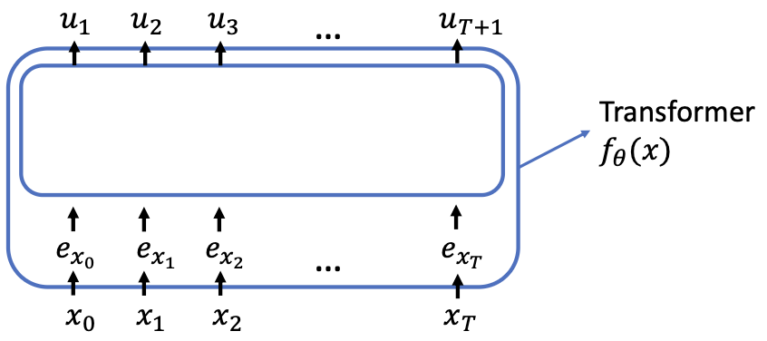

# 14.3 Pretrained large language models

Natural language processing is another area where pretraining models are particularly successful. In language problems, an example typically corresponds to a document or generally a sequence (or trunk) of words,[^5] denoted by $`x = (x_1, \cdots, x_T)`$ where $`T`$ is the length of the document/sequence, $`x_i \in \{1, \cdots, V\}`$ are words in the document, and $`V`$ is the vocabulary size.[^6]

A language model is a probabilistic model representing the probability of a document, denoted by $`p(x_1, \cdots, x_T)`$. This probability distribution is very complex because its support size is $`V^T`$—exponential in the length of the document. Instead of modeling the distribution of a document itself, we can apply the chain rule of conditional probability to decompose it as follows:

```math
p(x_1, \cdots, x_T) = p(x_1) p(x_2|x_1) \cdots p(x_T|x_1, \cdots, x_{T-1}).
```

Now the support size of each of the conditional probability $`p(x_t|x_1, \cdots, x_{t-1})`$ is $`V`$.

We will model the conditional probability $`p(x_t|x_1, \cdots, x_{t-1})`$ as a function of $`x_1, \ldots, x_{t-1}`$ parameterized by some parameter $`\theta`$.

A parameterized model takes in numerical inputs and therefore we first introduce embeddings or representations for the words. Let $`e_i \in \mathbb{R}^d`$ be the embedding of the word $`i \in \{1, 2, \cdots, V\}`$. We call $`[e_1, \cdots, e_V] \in \mathbb{R}^{d \times V}`$ the embedding matrix.

The most commonly used model is the Transformer [Vaswani et al., 2017]. In this subsection, we will introduce the input-output interface of a Transformer, but treat the intermediate computation in the Transformer as a blackbox. We refer the students to the transformer paper or more advanced courses for more details. As shown in Figure 14.1, given a document $`(x_1, \cdots, x_T)`$, we first translate the sequence of discrete variables into a sequence of corresponding word embeddings ($`e_{x_1}, \cdots, e_{x_T}`$).

We also introduce a fixed special token $`x_0 = \perp`$ in the vocabulary with corresponding embedding $`e_{x_0}`$ to mark the beginning of a document. Then, the word embeddings are passed into a Transformer model, which takes in a sequence of vectors ($`e_{x_0}, e_{x_1}, \cdots, e_{x_T}`$) and outputs a sequence of vectors ($`u_1, u_2, \cdots, u_{T+1}`$), where $`u_t \in \mathbb{R}^V`$ will be interpreted as the logits for the probability distribution of the next word.

Here we use the autoregressive version of the Transformer, which by design ensures $`u_t`$ only depends on $`x_1, \cdots, x_{t-1}`$ (note that this property does not hold in masked language models [Devlin et al., 2019] where the losses are also different). We view the whole mapping from $`x`$'s to $`u`$'s as a blackbox in this subsection and call it a Transformer, denoted it by $`f_\theta`$, where $`\theta`$ include both the parameters in the Transformer and the input embeddings. We write $`u_t = f_\theta(x_0, x_1, \ldots, x_{t-1})`$ where $`f_\theta`$ denotes the mapping from the input to the outputs.



**Figure 14.1 (description):** The inputs to the Transformer are the embeddings $`e_{x_0}, e_{x_1}, \ldots, e_{x_T}`$ corresponding to the tokens $`x_0, x_1, \ldots, x_T`$. The Transformer $`f_\theta(x)`$ outputs a sequence of vectors $`u_1, u_2, \ldots, u_{T+1}`$, each of which is used to predict the next token in the sequence.

The conditional probability $`p(x_t|x_1, \cdots, x_{t-1})`$ is the softmax of the logits:

```math
\begin{bmatrix}
p(x_t = 1|x_1 \cdots, x_{t-1}) \\
p(x_t = 2|x_1 \cdots, x_{t-1}) \\
\vdots \\
p(x_t = V|x_1 \cdots, x_{t-1})
\end{bmatrix}
= \mathrm{softmax}(u_t) \in \mathbb{R}^V \tag{14.6}
```

or equivalently,

```math
= \mathrm{softmax}(f_\theta(x_0, \ldots, x_{t-1})) \tag{14.7}
```

We train the Transformer parameter $`\theta`$ by minimizing the negative log-likelihood of seeing the data under the probabilistic model defined by $`\theta`$.

which is the cross-entropy loss on the logits.

```math
\text{loss}(\theta) = \frac{1}{T} \sum_{t=1}^T -\log(p_\theta(x_t|x_1, \ldots, x_{t-1})) \tag{14.8}
```

```math
= \frac{1}{T} \sum_{t=1}^T \ell_{ce}(f_\theta(x_0, x_1, \cdots, x_{t-1}), x_t)
```

```math
= \frac{1}{T} \sum_{t=1}^T -\log(\mathrm{softmax}(f_\theta(x_0, x_1, \cdots, x_{t-1}))_{x_t})
```

**Autoregressive text decoding / generation.** Given an autoregressive Transformer, we can simply sample text from it sequentially. Given a prefix $`x_1, \ldots, x_t`$, we generate text completion $`x_{t+1}, \ldots, x_T`$ sequentially using the conditional distribution.

```math
x_{t+1} \sim \mathrm{softmax}(f_\theta(x_0, x_1, \cdots, x_t)) \tag{14.9}
```
```math
x_{t+2} \sim \mathrm{softmax}(f_\theta(x_0, x_1, \cdots, x_{t+1})) \tag{14.10}
```
```math
\vdots \tag{14.11}
```
```math
x_T \sim \mathrm{softmax}(f_\theta(x_0, x_1, \cdots, x_{T-1})) \tag{14.12}
```

Note that each generated token is used as the input to the model when generating the following tokens. In practice, people often introduce a parameter $`\tau > 0`$ named *temperature* to further adjust the entropy/sharpness of the generated distribution,

```math
x_{t+1} \sim \mathrm{softmax}(f_\theta(x_0, x_1, \cdots, x_t)/\tau) \tag{14.13}
```
```math
x_{t+2} \sim \mathrm{softmax}(f_\theta(x_0, x_1, \cdots, x_{t+1})/\tau) \tag{14.14}
```
```math
\vdots \tag{14.15}
```
```math
x_T \sim \mathrm{softmax}(f_\theta(x_0, x_1, \cdots, x_{T-1})/\tau) \tag{14.16}
```

When $`\tau = 1`$, the text is sampled from the original conditional probability defined by the model. With a decreasing $`\tau`$, the generated text gradually becomes more "deterministic". $`\tau \to 0`$ reduces to greedy decoding, where we generate the most probable next token from the conditional probability.

### 14.3.1 Zero-shot learning and in-context learning

For language models, there are many ways to adapt a pretrained model to downstream tasks. In this notes, we discuss three of them: finetuning, zero-shot learning, and in-context learning.

**Finetuning** is not very common for the autoregressive language models that we introduced in Section 14.3 but much more common for other variants such as masked language models which has similar input-output interfaces but are pretrained differently [Devlin et al., 2019]. 

Finetuning means taking a model that has already learned a lot from a huge dataset (pretraining), and then continuing to train it on a smaller, task-specific dataset. Think of it like a student who has read many books (pretraining) and then studies specifically for a test (finetuning). The model adapts its knowledge to do well on the new task.

The finetuning method is the same as introduced generally in Section 14.1—the only question is how we define the prediction task with an additional linear head. One option is to treat $`c_{T+1} = \phi_\theta(x_1, \cdots, x_T)`$ as the representation and use $`w^\top c_{T+1} = w^\top \phi_\theta(x_1, \cdots, x_T)`$ to predict the task label. As described in Section 14.1, we initialize $`\theta`$ to the pretrained model $`\hat{\theta}`$ and then optimize both $`w`$ and $`\theta`$.

- **Why does this work?** The pretrained model already knows a lot about language, so it only needs to "tune" itself to the specifics of the new task. This is much faster and requires less data than training from scratch.
- **Tip:** Use finetuning when you have a moderate or large labeled dataset for your specific task, and you want the best possible performance.

---

**Zero-shot** adaptation or zero-shot learning is the setting where there is no input-output pairs from the downstream tasks. For language problems tasks, typically the task is formatted as a question or a cloze test form via natural language. 

- **Analogy:** Imagine you ask a well-read person a question they've never seen before, but they can answer it because they have broad general knowledge.
- **How does it work?** The model is given a prompt (like a question) and must generate the answer using only what it learned during pretraining. No additional training is done for the new task.

For example, we can format an example as a question:

$`x_{\text{task}} = (x_{\text{task},1}, \cdots, x_{\text{task},R}) = \text{"Is the speed of light a universal constant?"}`$

Then, we compute the most likely next word predicted by the language model given this question, that is, computing $`\operatorname{argmax}_{x_{T+1}} p(x_{T+1} \mid x_{\text{task},1}, \cdots, x_{\text{task},R})`$. In this case, if the most likely next word $`x_{T+1}`$ is "No", then we solve the task. (The speed of light is only a constant in vacuum.)

- **Why does this work?** During pretraining, the model has seen so many examples of language that it can often generalize to new questions or tasks, even if it has never seen them before.
- **Tip:** Zero-shot is useful when you have no labeled data for your task, or want to quickly test what a model can do "out of the box."

---

**In-context learning** is mostly used for few-shot settings where we have a few labeled examples $`(x^{(1)}_{\text{task}}, y^{(1)}_{\text{task}}), \cdots, (x^{(n_{\text{task}})}_{\text{task}}, y^{(n_{\text{task}})}_{\text{task}})`$. 

- **Analogy:** Imagine you show a person a few examples of a new kind of puzzle, and then ask them to solve a similar one. They use the examples as hints to figure out the pattern.
- **How does it work?** Given a test example $`x_{\text{test}}`$, we construct a document $`(x_1, \cdots, x_T)`$, which is more commonly called a "prompt" in this context, by concatenating the labeled examples and the test example in some format. The model is not retrained; instead, it "reads" the prompt and tries to continue it in a way that matches the pattern.

For example, we may construct the prompt as follows:

```math
\begin{align*}
x_1, \cdots, x_T \quad = \quad & \text{"Q: 2 ~ 3 = ?"} \quad x^{(1)}_{\text{task}} \\
& \text{A: 5} \quad y^{(1)}_{\text{task}} \\
& \text{Q: 6 ~ 7 = ?"} \quad x^{(2)}_{\text{task}} \\
& \text{A: 13} \quad y^{(2)}_{\text{task}} \\
& \cdots \\
& \text{Q: 15 ~ 2 = ?"} \quad x_{\text{test}}
\end{align*}
```

Then, we let the pretrained model generate the most likely $`x_{T+1}, x_{T+2}, \cdots`$. In this case, if the model can "learn" that the symbol $`\sim`$ means addition from the few examples, we will obtain the following which suggests the answer is 17.

```math
x_{T+1}, x_{T+2}, \cdots = \text{"A: 17"}.
```

- **Why does this work?** The model has learned to pick up on patterns in the prompt, even if it is not explicitly trained for the new task. This is a powerful way to use large language models for new problems with very little data.
- **Tip:** In-context learning is great for rapid prototyping and for tasks where you have only a handful of labeled examples.

---

**Summary:**
- **Finetuning:** Best when you have a moderate/large labeled dataset and want top performance. The model is retrained for your task.
- **Zero-shot:** No labeled data needed. The model uses its general knowledge to answer new questions.
- **In-context learning:** Give the model a few examples in the prompt. The model "figures out" the pattern and applies it to the new example, without retraining.

These methods make large language models extremely flexible and powerful for a wide range of tasks.

[^5]: In the practical implementations, typically all the data are concatenated into a single sequence in some order, and each example typically corresponds a sub-sequence of consecutive words which may correspond to a subset of a document or may span across multiple documents.
[^6]: Technically, words may be decomposed into tokens which could be words or sub-words (combinations of letters), but this note omits this technicality. In fact most common words are a single token themselves.


