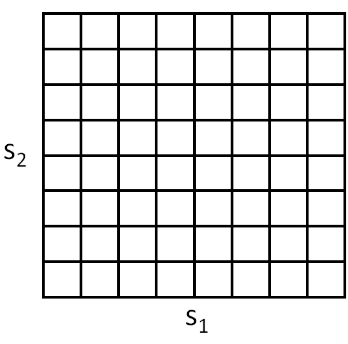
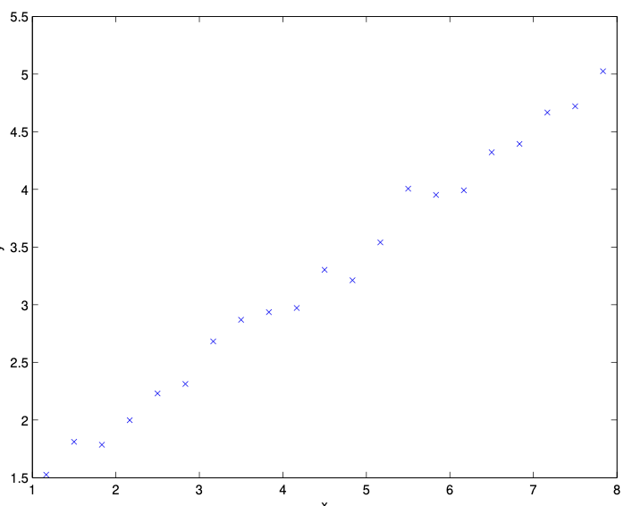
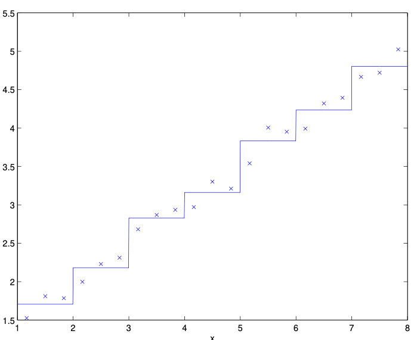

# 15.4 MDPs with Infinite or Continuous State Spaces

This section explores how to handle Markov Decision Processes (MDPs) when the state space is infinite or continuous—a common scenario in robotics, control, and real-world applications. The focus is on building intuition, understanding the math, and learning practical strategies.

---

## Why Continuous State Spaces Matter

In many real-world problems, the state of a system is described by continuous variables (like position, velocity, or angle), not just a small set of discrete states. For example:
- A car's state: $(x, y, \theta, \dot{x}, \dot{y}, \dot{\theta})$ (position, orientation, velocities)
- A robot arm: joint angles and velocities
- A drone: 3D position, orientation, and velocities

**Key challenge:**
- You can't enumerate all possible states—there are infinitely many!
- Standard dynamic programming algorithms for finite MDPs don't scale to this setting.

---

## 15.4.1 Discretization

**Discretization** is the simplest way to handle continuous states:
- Chop up the continuous space into a grid of small, finite cells.
- Treat each cell as a single "state" in a standard MDP.

**Example:**
- For 2D states $(s_1, s_2)$, use a grid:

  

- Each grid cell $\bar{s}$ is a discrete state.
- Approximate the continuous MDP by a discrete one $(\bar{S}, A, \{P_{sa}\}, \gamma, R)$.
- Use value or policy iteration to solve for $V^\ast(\bar{s})$ and $\pi^\ast(\bar{s})$.
- When the real system is in a continuous state $s$, map it to the nearest grid cell $\bar{s}$ and use $\pi^*(\bar{s})$.

**Intuitive analogy:**
- Imagine overlaying graph paper on a map and treating each square as a city. You plan routes between cities, not every possible point.

**Limitations:**
- The value function is assumed to be constant within each cell (piecewise constant).
- This can be a poor approximation for smooth functions.
- You need a very fine grid for good accuracy, which quickly becomes impractical.

**Visual example:**
- Fitting a smooth curve with a staircase (piecewise constant) approximation:

  
  

- The more steps you use, the closer you get, but it's never as smooth as the real thing.

**Curse of dimensionality:**
- If $S = \mathbb{R}^d$ and you discretize each dimension into $k$ values, you get $k^d$ states.
- For $d=10$ and $k=100$, that's $10^{20}$ states—impossible to store or compute!

**Rule of thumb:**
- Discretization is great for 1D or 2D problems, sometimes 3D or 4D if you're clever.
- For higher dimensions, it's infeasible.

---

## 15.4.2 Value Function Approximation

To handle large or continuous state spaces, we use **value function approximation**:
- Instead of a table of values for each state, learn a function $V(s)$ that predicts the value for any state $s$.
- This is similar to regression in supervised learning.

**Why is this powerful?**
- The function can generalize to unseen states.
- You can use linear regression, neural networks, or other function approximators.

### Using a Model or Simulator

Assume you have a **model** or **simulator** for the MDP:
- A black box that takes $(s_t, a_t)$ and outputs $s_{t+1}$ sampled from $P_{s_t a_t}$.
- You can get such a model from physics, engineering, or by learning from data.

**Practical note:**
- Simulators are widely used in robotics and control, because they let you test and learn policies without risking real hardware.

**Learning a model from data:**
- Run $n$ trials, each for $T$ timesteps, recording $(s_t, a_t, s_{t+1})$.
- Fit a model (e.g., linear regression):

  $s_{t+1} = A s_t + B a_t$

- Or, for more complex systems, use non-linear models or neural networks.

---

### Fitted Value Iteration

**Fitted value iteration** is a powerful algorithm for approximating the value function in continuous state MDPs.

**Key idea:**
- Use supervised learning to fit $V(s)$ to targets computed from the Bellman update.
- Repeat this process until convergence.

**Algorithm:**
1. Randomly sample $n$ states $s^{(1)}, \ldots, s^{(n)}$ from $S$.
2. Initialize $\theta := 0$ (parameters of $V$).
3. Repeat:
    - For each $i = 1, \ldots, n$:
        - Compute $y^{(i)} := R(s^{(i)}) + \gamma \max_a \mathbb{E}_{s' \sim P_{s^{(i)} a}} [V(s')]$.
    - Fit $\theta$ by minimizing the squared error:

      $\min_{\theta} \sum_{i=1}^n (\theta^T \phi(s^{(i)}) - y^{(i)})^2$

    - (Here, $\phi(s)$ is a feature mapping of the state.)

**Intuitive explanation:**
- This is like using regression to fit a function to a set of data points, except here the data points are states and their "target values" are computed using the Bellman update.
- The process is a loop: use your current value function to generate targets, fit a new value function to those targets, and repeat.

**Why does this work?**
- The function approximator generalizes across the state space.
- You can use more powerful models (e.g., neural networks) for better generalization.

**Practical note:**
- The better your function approximator, the better your value function will generalize to unseen states. This is why deep learning is often used in modern RL.

**Caveats:**
- Fitted value iteration does not always converge, but in practice it often works well.
- The choice of features $\phi$ and the regression algorithm is crucial.

---

## Policy Extraction in Continuous Spaces

Once you have an approximate value function $V(s)$, you can extract a policy:

```math
\pi(s) = \arg\max_a \mathbb{E}_{s' \sim P_{sa}} [V(s')]
```

- For each action $a$, sample possible next states $s'$ using the model, compute $V(s')$, and pick the action with the highest expected value.
- If the model is deterministic, you can just use $V(f(s, a))$ where $f$ is the deterministic transition function.

**Practical tip:**
- In high dimensions, sampling all actions and next states can be expensive. Use approximations or restrict the action space if needed.

---

## Connections to Supervised Learning

- Value function approximation is essentially a regression problem.
- The targets are computed using the Bellman update, but the fitting step is just like supervised learning.
- This connection is why modern RL often uses deep learning: neural networks are powerful function approximators.

---

## Summary and Best Practices

- Discretization is simple but suffers from the curse of dimensionality.
- Value function approximation enables RL in large or continuous state spaces.
- Fitted value iteration is a practical and powerful algorithm, but requires careful choice of features and models.
- Always leverage simulators or models when available—they make RL much more tractable.
- Use deep learning for complex, high-dimensional problems, but start with simple models to build intuition.

**Analogy:**
- Think of value function approximation as learning to predict the value of a chess position: you can't memorize every possible position, but you can learn a function that generalizes from experience.

