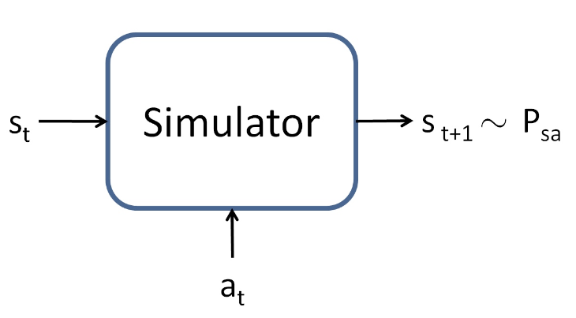

# 15.4 MDPs with Infinite or Continuous State Spaces

So far, we've focused our attention on MDPs with a finite number of states. We now discuss algorithms for MDPs that may have an infinite number of states. For example, for a car, we might represent the state as $`(x, y, \theta, \dot{x}, \dot{y}, \dot{\theta})`$, comprising its position $`(x, y)`$; orientation $`\theta`$; velocity in the $`x`$ and $`y`$ directions $`\dot{x}`$ and $`\dot{y}`$; and angular velocity $`\dot{\theta}`$. Hence, $`S = \mathbb{R}^6`$ is an infinite set of states, because there is an infinite number of possible positions and orientations for the car.[^3]

> **Intuition:** In real-world problems, the state of a system is often described by continuous variables (like position, velocity, or angle), not just a small set of discrete states. This makes the problem much more complex, because you can't just enumerate all possible states.

Similarly, the inverted pendulum you saw in PS4 has states $`(x, \theta, \dot{x}, \dot{\theta})`$, where $`\theta`$ is the angle of the pole. And, a helicopter flying in 3d space has states of the form $`(x, y, z, \phi, \theta, \psi, \dot{x}, \dot{y}, \dot{z}, \dot{\phi}, \dot{\theta}, \dot{\psi})`$, where here the roll $`\phi`$, pitch $`\theta`$, and yaw $`\psi`$ angles specify the 3d orientation of the helicopter.

In this section, we will consider settings where the state space is $`S = \mathbb{R}^d`$, and describe ways for solving such MDPs.

## 15.4.1 Discretization

Perhaps the simplest way to solve a continuous-state MDP is to discretize the state space, and then to use an algorithm like value iteration or policy iteration, as described previously.

> **Intuitive explanation:** Discretization means chopping up a continuous space into a grid of small, finite cells. Each cell is treated as a single "state" in a standard MDP. This makes the problem tractable, because you can now use algorithms designed for finite state spaces.

For example, if we have 2d states $`(s_1, s_2)`$, we can use a grid to discretize the state space:


Here, each grid cell represents a separate discrete state $\bar{s}$. We can then approximate the continuous-state MDP via a discrete-state one $\left(\bar{S}, A, \{P_{sa}\}, \gamma, R\right)$, where $\bar{S}$ is the set of discrete states, $\{P_{sa}\}$ are our state transition probabilities over the discrete states, and so on. We can then use value iteration or policy iteration to solve for the $V^*(\bar{s})$ and $\pi^*(\bar{s})$ in the discrete state MDP $\left(\bar{S}, A, \{P_{sa}\}, \gamma, R\right)$. When our actual system is in some continuous-valued state $s \in S$ and we need to pick an action to execute, we compute the corresponding discretized state $\bar{s}$, and execute action $\pi^*(\bar{s})$.

> **Practical note:** This approach is simple and often works well for low-dimensional problems. However, it can become impractical as the number of dimensions increases.

This discretization approach can work well for many problems. However, there are two downsides. First, it uses a fairly naive representation for $V^*$ (and $\pi^*$). Specifically, it assumes that the value function takes a constant value over each of the discretization intervals (i.e., that the value function is piecewise constant in each of the gridcells).

To better understand the limitations of such a representation, consider a *supervised learning* problem of fitting a function to this dataset:


Clearly, linear regression would do fine on this problem. However, if we instead discretize the $`x`$-axis, and then use a representation that is piecewise constant in each of the discretization intervals, then our fit to the data would look like this:


This piecewise constant representation just isn't a good representation for many smooth functions. It results in little smoothing over the inputs, and no generalization over the different grid cells. Using this sort of representation, we would also need a very fine discretization (very small grid cells) to get a good approximation.

> **Intuitive explanation:** Imagine trying to approximate a smooth curve with a staircase. The more steps you use, the closer you get, but it's never as smooth as the real thing. This is what happens when you discretize a continuous function too coarsely.

A second downside of this representation is called the **curse of dimensionality**. Suppose $`S = \mathbb{R}^d`$, and we discretize each of the $`d`$ dimensions of the state into $`k`$ values. Then the total number of discrete states we have is $`k^d`$. This grows exponentially quickly in the dimension of the state space $`d`$, and thus does not scale well to large problems. For example, with a 10d state, if we discretize each state variable into 100 values, we would have $`100^{10} = 10^{20}`$ discrete states, which is far too many to represent even on a modern desktop computer.

> **Rule of thumb:** Discretization is great for 1d or 2d problems, and sometimes works for 3d or 4d if you're clever. For higher dimensions, it quickly becomes infeasible.

## 15.4.2 Value function approximation

We now describe an alternative method for finding policies in continuous-state MDPs, in which we approximate $`V^*`$ directly, without resorting to discretization. This approach, called **value function approximation**, has been successfully applied to many RL problems.

> **Intuitive explanation:** Instead of chopping up the state space into a grid, we try to learn a function that can predict the value for any state, even ones we haven't seen before. This is similar to how regression works in supervised learning.

### Using a model or simulator

To develop a value function approximation algorithm, we will assume that we have a **model**, or **simulator**, for the MDP. Informally, a simulator is a black-box that takes as input any (continuous-valued) state $`s_t`$ and action $`a_t`$, and outputs a next-state $`s_{t+1}`$ sampled according to the state transition probabilities $`P_{s_t a_t}`$:



There are several ways that one can get such a model. One is to use physics simulation. For example, the simulator for the inverted pendulum in PS4 was obtained by using the laws of physics to calculate what position and orientation the cart/pole will be in at time $`t+1`$, given the current state at time $`t`$ and the action $`a`$ taken, assuming that we know all the parameters of the system such as the length of the pole, the mass of the pole, and so on. Alternatively, one can also use an off-the-shelf physics simulation software package which takes as input a complete physical description of a mechanical system, the current state $`s_t`$ and action $`a_t`$, and computes the state $`s_{t+1}`$ of the system a small fraction of a second into the future.[^4]

> **Practical note:** Simulators are widely used in robotics and control, because they let us test and learn policies without risking real hardware.

An alternative way to get a model is to **learn one from data** collected in the MDP. For example, suppose we execute $`n`$ **trials** in which we repeatedly take actions in an MDP, each trial for $`T`$ timesteps. This can be done picking actions at random, executing some specific policy, or via some other way of choosing actions. We would then observe $`n`$ state sequences like the following:

```math
\begin{align*}
s_0^{(1)} \xrightarrow{a_0^{(1)}} s_1^{(1)} \xrightarrow{a_1^{(1)}} s_2^{(1)} \xrightarrow{a_2^{(1)}} \cdots \xrightarrow{a_{T-1}^{(1)}} s_T^{(1)} \\
s_0^{(2)} \xrightarrow{a_0^{(2)}} s_1^{(2)} \xrightarrow{a_1^{(2)}} s_2^{(2)} \xrightarrow{a_2^{(2)}} \cdots \xrightarrow{a_{T-1}^{(2)}} s_T^{(2)} \\
\qquad \vdots \\
s_0^{(n)} \xrightarrow{a_0^{(n)}} s_1^{(n)} \xrightarrow{a_1^{(n)}} s_2^{(n)} \xrightarrow{a_2^{(n)}} \cdots \xrightarrow{a_{T-1}^{(n)}} s_T^{(n)}
\end{align*}
```

> **Intuitive explanation:** This is like running a bunch of experiments, recording what happens at each step, and then using that data to learn how the system works.

We can then apply a learning algorithm to predict $`s_{t+1}`$ as a function of $`s_t`$ and $`a_t`$.

For example, one may choose to learn a **linear model** of the form

```math
s_{t+1} = A s_t + B a_t,
```
**(15.6)**

using an algorithm similar to linear regression. Here, the parameters of the model are the matrices $`A`$ and $`B`$, and we can estimate them using the data collected from our $`n`$ trials, by picking

```math
\underset{A, B}{\arg\min} \sum_{i=1}^n \sum_{t=0}^{T-1} \left\| s_{t+1}^{(i)} - \left( A s_t^{(i)} + B a_t^{(i)} \right) \right\|_2^2.
```

> **Practical note:** You can use other loss functions too, and non-linear models if the system is more complex.

Having learned $`A`$ and $`B`$, one option is to build a **deterministic** model, in which given an input $`s_t`$ and $`a_t`$, the output $`s_{t+1}`$ is exactly determined. Specifically, we always compute $`s_{t+1}`$ according to Equation **(15.6)**. Alternatively, we may also build a **stochastic** model, in which $`s_{t+1}`$ is a random function of the inputs, by modeling it as

```math
s_{t+1} = A s_t + B a_t + \epsilon_t,
```

where here $`\epsilon_t`$ is a noise term, usually modeled as $`\epsilon_t \sim \mathcal{N}(0, \Sigma)`$. (The covariance matrix $`\Sigma`$ can also be estimated from data in a straightforward way.)

Here, we've written the next-state $`s_{t+1}`$ as a linear function of the current state and action; but of course, non-linear functions are also possible. Specifically, one can learn a model $`s_{t+1} = A \phi_s(s_t) + B \phi_a(a_t)`$, where $`\phi_s`$ and $`\phi_a`$ are some non-linear feature mappings of the states and actions. Alternatively, one can also use non-linear learning algorithms, such as locally weighted linear regression, to learn to estimate $`s_{t+1}`$ as a function of $`s_t`$ and $`a_t`$. These approaches can also be used to build either deterministic or stochastic simulators of an MDP.

> **Summary:** The better your model, the better your planning and learning will be. In practice, model learning is a major area of research in RL.

---

### Fitted value iteration

We now describe the **fitted value iteration** algorithm for approximating the value function of a continuous state MDP. In the sequel, we will assume that the problem has a continuous state space $`S = \mathbb{R}^d`$, but that the action space $`A`$ is small and discrete.[^5]

Recall that in value iteration, we would like to perform the update

```math
V(s) := R(s) + \gamma \max_a \int_{s'} P_{sa}(s') V(s') ds'
```
**(15.7)**

```math
= R(s) + \gamma \max_a \mathbb{E}_{s' \sim P_{sa}} [V(s')]
```
**(15.8)**

(In Section 15.2, we had written the value iteration update with a summation $`V(s) := R(s) + \gamma \max_a \sum_{s'} P_{sa}(s') V(s')`$ rather than an integral over states; the new notation reflects that we are now working in continuous states rather than discrete states.)

> **Intuitive explanation:** In continuous spaces, we can't sum over all possible next states, so we use integrals or expectations instead.

The main idea of fitted value iteration is that we are going to approximately carry out this step, over a finite sample of states $`s^{(1)}, \ldots, s^{(n)}`$. Specifically, we will use a supervised learning algorithm—linear regression in our description below—to approximate the value function as a linear or non-linear function of the states:

```math
V(s) = \theta^T \phi(s).
```

Here, $`\phi`$ is some appropriate feature mapping of the states.

> **Intuitive explanation:** This is like using regression to fit a function to a set of data points, except here the data points are states and their "target values" are computed using the Bellman update.

For each state $`s`$ in our finite sample of $`n`$ states, fitted value iteration will first compute a quantity $`y^{(i)}`$, which will be our approximation to $`R(s) + \gamma \max_a \mathbb{E}_{s' \sim P_{sa}}[V(s')]`$ (the right hand side of Equation **(15.8)**). Then, it will apply a supervised learning algorithm to try to get $`V(s)`$ close to $`R(s) + \gamma \max_a \mathbb{E}_{s' \sim P_{sa}}[V(s')]`$ (or, in other words, to try to get $`V(s)`$ close to $`y^{(i)}`$).

In detail, the algorithm is as follows:

1. Randomly sample $`n`$ states $`s^{(1)}, s^{(2)}, \ldots, s^{(n)} \in S`$.
2. Initialize $`\theta := 0`$.
3. Repeat {
    
    For $`i = 1, \ldots, n`$ {
        - Compute $`y^{(i)} := R(s^{(i)}) + \gamma \max_a \mathbb{E}_{s' \sim P_{s^{(i)} a}} [V(s')]`$.
    }
    - Fit $`\theta`$ by minimizing the squared error:

    ```math
    \min_{\theta} \sum_{i=1}^n \left( \theta^T \phi(s^{(i)}) - y^{(i)} \right)^2
    ```
}

This process is repeated until convergence.

> **Summary:** Fitted value iteration is a loop: use your current value function to generate targets, fit a new value function to those targets, and repeat. This is a powerful way to handle large or continuous state spaces.

The key idea is that we use supervised learning to fit the value function to the targets $`y^{(i)}`$, which are themselves computed using the current estimate of the value function. This allows us to approximate the value function for continuous state spaces without discretizing the state space.

In practice, the choice of feature mapping $`\phi`$ and the supervised learning algorithm (e.g., linear regression, neural networks, or other function approximators) can have a significant impact on the quality of the resulting value function approximation. Fitted value iteration is a powerful approach because it leverages the strengths of supervised learning to handle large or continuous state spaces, making it possible to solve problems that would be intractable with naive discretization.

> **Practical note:** The better your function approximator, the better your value function will generalize to unseen states. This is why deep learning is often used in modern RL.

Above, we had written out fitted value iteration using linear regression as the algorithm to try to make $`V(s^{(i)})`$ close to $`y^{(i)}`$. That step of the algorithm is completely analogous to a standard supervised learning (regression) problem in which we have a training set $`(x^{(1)}, y^{(1)}), (x^{(2)}, y^{(2)}), \ldots, (x^{(n)}, y^{(n)})`$, and want to learn a function mapping from $`x`$ to $`y`$; the only difference is that here $`s`$ plays the role of $`x`$. Even though our description above used linear regression, clearly other regression algorithms (such as locally weighted linear regression) can also be used.

Unlike value iteration over a discrete set of states, fitted value iteration cannot be proved to always to converge. However, in practice, it often does converge (or approximately converge), and works well for many problems. Note also that if we are using a deterministic simulator/model of the MDP, then fitted value iteration can be simplified by setting $`k = 1`$ in the algorithm. This is because the expectation in Equation **(15.8)** becomes an expectation over a deterministic distribution, and so a single example is sufficient to exactly compute that expectation. Otherwise, in the algorithm above, we had to draw $`k`$ samples, and average to try to approximate that expectation (see the definition of $`q(a)`$, in the algorithm pseudo-code).

---

Finally, fitted value iteration outputs $`V`$, which is an approximation to $`V^*`$. This implicitly defines our policy. Specifically, when our system is in some state $`s`$, and we need to choose an action, we would like to choose the action

```math
\arg\max_a \mathbb{E}_{s' \sim P_{sa}} [V(s')]
```
**(15.9)**

The process for computing/approximating this is similar to the inner-loop of fitted value iteration, where for each action, we sample $`s'_1, \ldots, s'_k \sim P_{sa}`$ to approximate the expectation. (And again, if the simulator is deterministic, we can set $`k = 1`$.)

In practice, there are often other ways to approximate this step as well. For example, one very common case is if the simulator is of the form $`s_{t+1} = f(s_t, a_t) + \epsilon_t`$, where $`f`$ is some deterministic function of the states (such as $`f(s_t, a_t) = A s_t + B a_t`$), and $`\epsilon`$ is zero-mean Gaussian noise. In this case, we can pick the action given by

```math
\arg\max_a V(f(s, a)).
```

In other words, here we are just setting $`\epsilon_t = 0`$ (i.e., ignoring the noise in the simulator), and setting $`k = 1`$. Equivalent, this can be derived from Equation **(15.9)** using the approximation

```math
\mathbb{E}_{s'}[V(s')] \approx V(\mathbb{E}_{s'}[s'])
```
**(15.10)**

```math
= V(f(s, a)),
```
**(15.11)**

where here the expectation is over the random $`s' \sim P_{sa}`$. So long as the noise terms $`\epsilon_t`$ are small, this will usually be a reasonable approximation.

However, for problems that don't lend themselves to such approximations, having to sample $`k|A|`$ states using the model, in order to approximate the expectation above, can be computationally expensive.

---

## 15.5 Connections between Policy and Value Iteration

In the policy iteration, line 3 of Algorithm 5, we typically use linear system solver to compute $`V^{\pi}`$. Alternatively, one can also do the iterative Bellman updates, similarly to the value iteration, to evaluate $`V^{\pi}`$, as in the Procedure VE($\cdot$) in Line 1 of Algorithm 6 below. Here if we take option 1 in Line 2 of the Procedure VE, then the difference between the Procedure VE from the

**Algorithm 6: Variant of Policy Iteration**

1. **procedure** VE($\pi$, $k$)  ▷ To evaluate $V^{\pi}$
2. &nbsp;&nbsp;&nbsp;Option 1: initialize $V(s) := 0$; Option 2: Initialize from the current $V$ in the main algorithm.
3. &nbsp;&nbsp;&nbsp;**for** $i = 0$ to $k-1$ **do**
4. &nbsp;&nbsp;&nbsp;&nbsp;&nbsp;&nbsp;**For every state** $s$, update

```math
V(s) := R(s) + \gamma \sum_{s'} P_{s\pi(s)}(s') V(s').
```
**(15.12)**

**return** $V$

5. **Require:** hyperparameter $k$.
6. Initialize $\pi$ randomly.
7. **for** until convergence **do**
8. &nbsp;&nbsp;&nbsp;Let $V = \text{VE}(\pi, k)$.
9. &nbsp;&nbsp;&nbsp;For each state $s$, let

```math
\pi(s) := \arg\max_{a \in A} \sum_{s'} P_{sa}(s') V(s').
```
    **(15.13)**

The difference between this procedure and value iteration (Algorithm 4) is that on line 4, the procedure is using the action from $\pi$ instead of the greedy action.

> **Intuitive explanation:** This variant of policy iteration lets you interpolate between pure value iteration ($k=1$) and pure policy iteration ($k=\infty$). The choice of $k$ controls how much you "trust" your current policy before updating it.

Using the Procedure VE, we can build Algorithm 6, which is a variant of policy iteration that serves an intermediate algorithm that connects policy iteration and value iteration. Here we are going to use option 2 in VE to maximize the re-use of knowledge learned before. One can verify indeed that if we take $`k = 1`$ and use option 2 in Line 2 in Algorithm 6, then Algorithm 6 is semantically equivalent to value iteration (Algorithm 4). In other words, both Algorithm 6 and value iteration interleave the updates in (15.13) and (15.12). Algorithm 6 alternates between $k$ steps of update (15.12) and one step of (15.13), whereas value iteration alternates between 1 step of update (15.12) and one step of (15.13). Therefore generally Algorithm 6 should not be faster than value iteration, because assuming that update (15.12) and (15.13) are equally useful and time-consuming, then the optimal balance of the update frequencies could be just $k = 1$ or $k \approx 1$.

On the other hand, if $k$ steps of update (15.12) can be done much faster than $k$ times a single step of (15.12), then taking additional steps of equation (15.12) in group might be useful. This is what policy iteration is leveraging—the linear system solver can give us the result of Procedure VE with $k = \infty$ much faster than using the Procedure VE for a large $k$. On the flip side, when such a speeding-up effect no longer exists, e.g., when the state space is large and linear system solver is also not fast, then value iteration is more preferable.

> **Summary:** The connection between policy iteration and value iteration is not just theoretical—by tuning $k$, you can design algorithms that interpolate between the two extremes, and pick the best tradeoff for your problem.

[^3]: Technically, $`\theta`$ is an orientation and so the range of $`\theta`$ is better written $`\theta \in [-\pi, \pi)`$ than $`\theta \in \mathbb{R}`$; but for our purposes, this distinction is not important.

[^4]: Off-the-shelf simulators include software like MuJoCo, PyBullet, or Gazebo, which are widely used in robotics and reinforcement learning research.

[^5]: In practice, most MDPs have much smaller action spaces than state spaces. E.g., a car has a 6d state space, and a 2d action space (steering and velocity controls); the inverted pendulum has a 4d state space, and a 1d action space; a helicopter has a 12d state space, and a 4d action space. So, discretizing this set of actions is usually less of a problem than discretizing the state space would have been.

