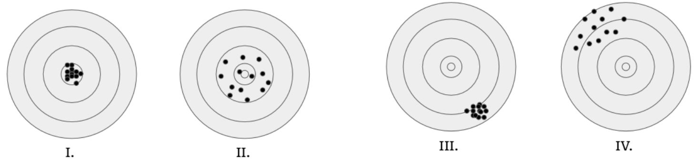
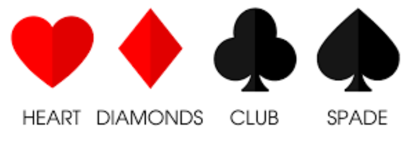

# Practice 1 Solutions

## Problem 1

Scientists tell us that there is a 10% probability that a person will have the flu this winter. Meanwhile, the CDC reports that 30% of the population will experience flu-like symptoms and that 60% of people with the flu will be symptomatic. What's the probability that Sarah has the flu given that she has flu-like symptoms?

(A) 60%

(B) 20%

(C) 30%

(D) 10%

**Solution:** The solution is (B).

**Explanation:**

This is a classic Bayes' theorem problem. Let's define the events:

- **F** = "person has the flu" (P(F) = 0.10)
- **S** = "person has flu-like symptoms" (P(S) = 0.30)  
- **P(S|F)** = 0.60 (60% of people with flu are symptomatic)

We need to find **P(F|S)**, the probability Sarah has the flu given she has symptoms.

**Using Bayes' theorem:**

$P(F|S) = \frac{P(S|F) \times P(F)}{P(S)}$

$P(F|S) = \frac{0.60 \times 0.10}{0.30} = \frac{0.06}{0.30} = 0.20 = 20\%$

**Intuition:** Even though 60% of flu cases show symptoms, only 10% of people have the flu, while 30% of people show symptoms. So among symptomatic people, only 20% actually have the flu.

## Problem 2

True/False: The variance of a model typically decreases as the number of features increases.

(A) True

(B) False

**Solution:** The solution is (B).

**Explanation:**

This statement is **false**. In fact, the variance of a model typically **increases** as the number of features increases. This is known as the **"curse of dimensionality"** and is a fundamental concept in machine learning.

**Here's why:**

**1. More parameters to estimate**
With more features, we have more parameters to estimate from the same amount of data, leading to higher estimation variance.

**2. Sparse data**
In high-dimensional spaces, data becomes sparse, making it harder to find reliable patterns.

**3. Overfitting risk**
More features increase the risk of overfitting, which manifests as high variance.

**Practical implications:** This is why regularization techniques (like L1/L2 regularization) and dimensionality reduction methods (like PCA) are so important in practice.

## Problem 3

Assume you're given two independent random variables X and Y. X is uniformly distributed on the interval [1, 3], whereas Y follows a normal distribution with mean 3 and standard deviation 1. What is $(E[XY])^2 – E[X]E[Y]$?

(A) 3

(B) 30

(C) 6

(D) 0

**Solution:** The solution is (B).

**Explanation:**

For independent random variables **X** and **Y**, we have **E[XY] = E[X]E[Y]**. Let's calculate each component:

- **X ~ Uniform[1,3]**: $E[X] = \frac{1+3}{2} = 2$
- **Y ~ N(3,1)**: $E[Y] = 3$

Since X and Y are independent: $E[XY] = E[X]E[Y] = 2 \times 3 = 6$

Now we need to calculate: $(E[XY])^2 - E[X]E[Y] = 6^2 - 6 = 36 - 6 = 30$

**Key insight:** For independent random variables, $E[XY] = E[X]E[Y]$, but $(E[XY])^2 \neq E[X]E[Y]$.

## Problem 4

True/False: If the columns of A are orthogonal, then $A^TA$ is diagonal.

(A) True

(B) False

**Solution:** The answer is (A).

**Explanation:**

This is **true**. If the columns of matrix **A** are orthogonal, then **$A^T A$** is diagonal.

**Here's why:**

Let **A = [a₁, a₂, ..., aₙ]** where each aᵢ is a column vector. Then:

$A^T A$ = $[a₁^T; a₂^T; ...; aₙ^T] × [a₁, a₂, ..., aₙ]$


The **(i,j)** entry of $A^T$ A is **$aᵢ^T aⱼ$**. Since the columns are orthogonal:

- **$aᵢ^T aⱼ = 0$** for i ≠ j (orthogonality)
- **$aᵢ^T aᵢ = ||aᵢ||²$** for i = j (norm squared)

**Therefore:** $A^T A$ is a diagonal matrix with diagonal entries **$||aᵢ||²$**.

## Problem 5

True/False: Assume we train a model on a given dataset. If we were to remove 50% of samples from the dataset and re-train the model from scratch, the new model will be more likely to overfit to its training data than the old one.

(A) True

(B) False

**Solution:** The solution is (A).

**Explanation:**

This is **true**. When we reduce the training dataset size by 50%, the model becomes more likely to overfit because:

**1. Less data for learning**
With fewer training examples, the model has less information to learn the true underlying patterns in the data.

**2. Higher variance**
Smaller datasets lead to higher variance in parameter estimates, making the model more sensitive to the specific training examples.

**3. Reduced regularization effect**
More training data naturally provides regularization by averaging out noise. With less data, this effect is diminished.

**4. Easier to memorize**
The model can more easily memorize the training data when there are fewer examples to remember.

**Practical implications:** This is why data augmentation and collecting more training data are common strategies to reduce overfitting.

## Problem 6

True/False: If $\{v_1, v_2, \dots, v_n\}$ and $\{w_1, w_2, \dots, w_n\}$ are linearly independent, then $\{v_1 + w_1, v_2 + w_2, \dots, v_n + w_n\}$ are linearly independent.

(A) True

(B) False

**Solution:** The answer is (B).

**Explanation:**

This is **false**. The sum of linearly independent sets is **not necessarily** linearly independent.

**Counterexample:**
Consider the vectors in $\mathbb{R}^2$:
- $v_1 = (1, 0)$, $v_2 = (0, 1)$ - linearly independent
- $w_1 = (-1, 0)$, $w_2 = (0, -1)$ - linearly independent

But $v_1 + w_1 = (0, 0)$ and $v_2 + w_2 = (0, 0)$, so the set $\{v_1 + w_1, v_2 + w_2\} = \{(0, 0), (0, 0)\}$ is **linearly dependent**.

**Key insight:** Linear independence is **not preserved** under vector addition. The sum of independent sets can create dependent vectors.

## Problem 7

True/False: $E[\epsilon\epsilon^T] = I$ where $\epsilon_i \sim N(0, \sigma^2)$ such that $\epsilon$ is a column vector: $\epsilon \in \mathbb{R}^d$.

(A) True

(B) False

**Solution:** The answer is (B).

**Explanation:**

This is **false**. The statement **E[εε^T] = I** is incorrect.

For a random vector $\varepsilon \sim N(0, \sigma^2I)$ where $\varepsilon \in \mathbb{R}^d$, we have:
$E[\varepsilon\varepsilon^T] = \sigma^2I$, not $I$.

**Here's why:**

The **(i,j)** entry of $E[\varepsilon\varepsilon^T]$ is $E[\varepsilon_i\varepsilon_j]$. Since $\varepsilon_i \sim N(0, \sigma^2)$ and the components are independent:

- $E[\varepsilon_i\varepsilon_j] = 0$ for $i \neq j$ (independence)
- $E[\varepsilon_i^2] = \text{Var}(\varepsilon_i) = \sigma^2$ for $i = j$

**Therefore:** $E[\varepsilon\varepsilon^T] = \sigma^2I$, which equals $I$ only when $\sigma^2 = 1$.



Figure 1: The following graphic will be used as a representation of bias and variance. Imagine that a true/correct model is one that always predicts a location at the center of each target (being farther away from the center of the target indicates that a model's predictions are worse). We retrain a model multiple times, and make a prediction with each trained model. For each of the targets, determine whether the bias and variance is low or high with respect to the true model.

## Problem 8

In Figure 1, subplot I, how are bias and variance related to the true model?

(A) High bias, High variance

(B) High bias, Low variance

(C) Low bias, High variance

(D) Low bias, Low variance

**Solution:** The solution is (D).

**Explanation:**

In **subplot I**, we see that the predictions are clustered tightly around the center of the target (**low variance**) and the center of the cluster is very close to the true target center (**low bias**). 

This represents the **ideal scenario** where the model has both low bias and low variance - it's both **accurate** and **consistent** across different training runs.

## Problem 9

In Figure 1, subplot II, how are bias and variance related to the true model?

(A) High bias, High variance

(B) High bias, Low variance

(C) Low bias, High variance

(D) Low bias, Low variance

**Solution:** The solution is (C).

**Explanation:**

In **subplot II**, we see that the predictions are scattered widely around the target (**high variance**) but the average of all predictions is close to the true target center (**low bias**). 

This represents a model that is **accurate on average** but **inconsistent** - it has low bias but high variance. This is typical of **complex models** that can fit the true function well but are sensitive to the specific training data.

## Problem 10

In Figure 1, subplot III, how are bias and variance related to the true model?

(A) High bias, High variance

(B) High bias, Low variance

(C) Low bias, High variance

(D) Low bias, Low variance

**Solution:** The solution is (B).

**Explanation:**

In **subplot III**, we see that the predictions are clustered tightly together (**low variance**) but the center of the cluster is far from the true target center (**high bias**). 

This represents a model that is **consistent** but **inaccurate** - it has high bias but low variance. This is typical of **simple models** that are stable but may not capture the true underlying relationship.

## Problem 11

In Figure 1, subplot IV, how are bias and variance related to the true model?

(A) High bias, High variance

(B) High bias, Low variance

(C) Low bias, High variance

(D) Low bias, Low variance

**Solution:** The solution is (A).

**Explanation:**

In **subplot IV**, we see that the predictions are both scattered widely (**high variance**) and the center of the cluster is far from the true target center (**high bias**). 

This represents the **worst scenario** where the model is both **inaccurate** and **inconsistent** - it has both high bias and high variance. This can happen with very **complex models** trained on insufficient data or with poor initialization.

## Problem 12

Let $x_1, x_2 \in \mathbb{R}$ be sampled from the distribution $N(\mu, 1)$, where $\mu \in \mathbb{R}$ is an unknown variable. Remember that the PDF of the normal distribution is $f(x) = \frac{1}{\sqrt{2\pi}}e^{-\frac{(x-\mu)^2}{2}}$. Using the log-likelihood, find the maximum likelihood estimation of $\mu$ in terms of $x_1, x_2$.

(A) $\frac{2}{x_1+x_2}$

(B) $\log \left(\frac{e^{x_1}+e^{x_2}}{2}\right)$

(C) $\frac{\log(x_1)+\log(x_2)}{2}$

(D) $\frac{x_1+x_2}{2}$

**Solution:** The answer is (D).

**Explanation:**

For **maximum likelihood estimation** of μ, we need to maximize the log-likelihood function.

**The likelihood function:**
```
L(\mu) = f(x_1|\mu) \times f(x_2|\mu) = \left(\frac{1}{\sqrt{2\pi}}\right)^2 \times e^{-\frac{(x_1-\mu)^2}{2}} \times e^{-\frac{(x_2-\mu)^2}{2}}
```

**Taking the log:**
```
\log L(\mu) = -\log(2\pi) - \frac{(x_1-\mu)^2}{2} - \frac{(x_2-\mu)^2}{2}
```

**To find the maximum:** We take the derivative with respect to μ and set it to zero:
```
\frac{d}{d\mu}[\log L(\mu)] = (x_1-\mu) + (x_2-\mu) = x_1 + x_2 - 2\mu = 0
```

**Solving:** $2\mu = x_1 + x_2$, so $\mu = \frac{x_1 + x_2}{2}$

This is the **sample mean**, which is the MLE for the mean of a normal distribution.

## Problem 13

Suppose our data distribution has the property that $y_i = \beta x_i + c + \epsilon_i$ for $x_i, \beta \in \mathbb{R}^d$, $c \in \mathbb{R}$, $\epsilon_i \sim N(0, \sigma^2)$. Suppose we learn a model $\hat{\beta} = \operatorname{argmin}_{\gamma} ||\gamma X - y||_2^2$. True/False: $\hat{\beta}$ is an unbiased estimate of $\beta$.

(A) True

(B) False

**Solution:** The answer is (B).

**Explanation:**

This is **false**. The OLS estimator β̂ is **biased** when there's a non-zero intercept term c.

**Here's why:**

The OLS estimator is $\hat{\beta} = (X^T X)^{-1} X^T y$

Substituting $y = X\beta + c + \varepsilon$:
```
\hat{\beta} = (X^T X)^{-1} X^T (X\beta + c + \varepsilon) = \beta + (X^T X)^{-1} X^T c + (X^T X)^{-1} X^T \varepsilon
```

Taking expectation:
```
E[\hat{\beta}] = \beta + (X^T X)^{-1} X^T c + (X^T X)^{-1} X^T E[\varepsilon] = \beta + (X^T X)^{-1} X^T c
```

**The bias term:** $(X^T X)^{-1} X^T c \neq 0$ when $c \neq 0$

**Key insight:** The estimator is unbiased **only if c = 0** (no intercept) or if X^T c = 0. Since the problem includes a non-zero intercept c, the estimator is **biased**.

## Problem 14

How will regularizing the weights in a linear regression model change the bias and variance (relative to the same model with no regularization)?

(A) Increase bias, increase variance

(B) Increase bias, decrease variance

(C) Decrease bias, increase variance

(D) Decrease bias, decrease variance

**Solution:** The solution is (B).

**Explanation:**

Regularization **increases bias** and **decreases variance**. Here's why:

**1. Increased Bias**
Regularization constrains the model parameters, preventing them from fitting the training data as closely. This means the model may not capture all the true underlying patterns, leading to higher bias.

**2. Decreased Variance**
By constraining the parameters, regularization makes the model less sensitive to the specific training data, reducing overfitting and thus decreasing variance.

**Key insight:** This is the fundamental **bias-variance tradeoff** - regularization sacrifices some accuracy (bias) for stability (variance). The optimal amount of regularization balances these competing objectives.

## Problem 15

True/False: Given a fixed training set, the training loss is never larger in a polynomial regression of degree $d + 1$ than in one of degree $d$, where ($d \ge 1$).

(A) True

(B) False

**Solution:** The solution is (A).

**Explanation:**

This is **true**. A polynomial of degree **d+1** can always fit the training data at least as well as a polynomial of degree **d**, because the degree d+1 polynomial can simply set the coefficient of the highest degree term to zero, effectively becoming a degree d polynomial.

**Mathematically:** If $p_d(x)$ is the best degree d polynomial fit, then:
```
p_{d+1}(x) = p_d(x) + 0 \cdot x^{d+1}
```
will achieve the same training loss. The degree d+1 polynomial can only do better, never worse.

**Key insight:** This is why training loss **monotonically decreases** as model complexity increases.

## Problem 16

True/False: Given both a train and test set, the test loss is always lower in a polynomial regression of degree $d + 1$ than in one of degree $d$, where ($d \ge 1$).

(A) True

(B) False

**Solution:** The solution is (B).

**Explanation:**

This is **false**. While a higher degree polynomial can always achieve lower training loss, this doesn't guarantee lower test loss due to **overfitting**.

**Why this happens:**
Higher degree polynomials can fit the training data more closely, but they may capture **noise** rather than the true underlying pattern, leading to poor generalization on unseen data. This is the classic overfitting problem where increased model complexity hurts test performance.

**Key insight:** The test loss typically follows a **U-shaped curve** - it decreases initially as model complexity increases, but then increases again as the model becomes too complex and overfits.

## Problem 17

On which factor does the value of irreducible error depend in linear regression?

(A) n, the number of observations in the training set

(B) m, the dimension of features in the training set

(C) $\sigma^2$, the variance of the noise

(D) None of those

**Solution:** The solution is (C).

**Explanation:**

The irreducible error depends on **σ²**, the variance of the noise in the data. This is because irreducible error represents the **inherent uncertainty** in the data that cannot be reduced by any model, no matter how good.

**Mathematical definition:**
```
E[(y - f^*(x))^2] \text{ where } f^*(x) \text{ is the true function}
```

Since $y = f^*(x) + \varepsilon$ where $\varepsilon \sim N(0, \sigma^2)$, the irreducible error is:
```
E[\varepsilon^2] = \text{Var}(\varepsilon) = \sigma^2
```

**Key insight:** This error is independent of the number of observations (n), feature dimensions (m), or any model parameters - it's a **fundamental property** of the data generation process.

## Problem 18

How does the irreducible error change if we increase the regularization coefficient $\lambda$ in ridge regression?

(A) Increase

(B) Decrease

(C) Not change

(D) The answer depends on the dataset $X$ and true weights $w^*$.

**Solution:** The solution is (C).

**Explanation:**

The irreducible error **does not change** when we increase the regularization coefficient λ in ridge regression. This is because irreducible error is a property of the **data generation process**, not the model.

**Why this happens:**
The irreducible error $\sigma^2$ represents the variance of the noise $\varepsilon$ in the true relationship $y = f^*(x) + \varepsilon$. This noise is **inherent to the data** and cannot be reduced by any modeling choice, including regularization.

**Key insight:** Regularization affects the bias and variance of the model, but it cannot change the **fundamental uncertainty** in the data itself. The irreducible error remains constant regardless of the regularization strength.

## Problem 19

True/False: k-fold cross-validation with $k = 100$ is computationally more expensive (slower) than "leave-one-out" cross validation. (Assume that there are enough data points to divide the dataset evenly by $k$.)

(A) True

(B) False

**Solution:** The solution is (B).

**Explanation:** This is false. k-fold cross-validation with k=100 is actually less computationally expensive than leave-one-out cross-validation (LOOCV).

Here's why:
- LOOCV requires training n models (where n is the number of data points)
- k-fold CV with k=100 requires training 100 models

Since we typically have n > 100 data points, LOOCV requires more model training iterations than 100-fold CV.

However, the computational cost also depends on the size of each training set:
- LOOCV trains on n-1 points each time
- 100-fold CV trains on approximately n-1 points each time (since n/100 ≈ 1)

So while 100-fold CV requires fewer iterations, each iteration is similar in cost, making the overall computational cost roughly similar.

## Problem 20

Assume we have a data matrix $X$. Which of the following is a true statement when comparing leave-one-out cross validation (LOOCV) error with the true error?

(A) LOOCV error is typically a slight underestimation of the true error of a model trained on $X$.

(B) LOOCV error is typically a slight overestimation of the true error of a model trained on $X$.

(C) LOOCV error is an unbiased estimator of the true error of a model trained on $X$.

**Solution:** The solution is (B).

**Explanation:** LOOCV error is typically a slight overestimation of the true error. This happens because:

1. **Smaller training sets**: Each LOOCV fold trains on n-1 data points instead of the full n points, so the model has less data to learn from.

2. **Higher variance**: With less training data, the model estimates have higher variance, leading to worse performance.

3. **Conservative estimate**: LOOCV provides a conservative (pessimistic) estimate of model performance, which is actually desirable for model evaluation.

This slight overestimation is generally acceptable and often preferred to underestimation, as it gives a more realistic picture of how the model will perform on unseen data.

## Problem 21

True/False: LASSO is a convex optimization problem.

(A) True

(B) False

**Solution:** The answer is (A).

**Explanation:** LASSO is indeed a convex optimization problem. The LASSO objective function is:

$\min \|y - X\beta\|^2 + \lambda\|\beta\|_1$

This is convex because:
1. The squared loss term $\|y - X\beta\|^2$ is a convex function (quadratic)
2. The L1 penalty term $\|\beta\|_1$ is a convex function (sum of absolute values)
3. The sum of convex functions is convex
4. The constraint set is convex (unconstrained)

Since LASSO is convex, it has a unique global minimum and can be solved efficiently using various optimization algorithms like coordinate descent or proximal gradient methods.

## Problem 22

In LASSO regression, if the regularization parameter $\lambda = 0$, then which of the following is true?

(A) This LASSO model can be used for feature selection.

(B) The loss function is as same as the ridge regression loss function.

(C) The loss function is as same as the ordinary least square loss function.

(D) Large coefficients are penalized.

**Solution:** No solution is provided for this question.

**Explanation:**

When **λ = 0** in LASSO, the regularization term disappears, and the objective function becomes:

```
\min \|y - X\beta\|^2
```

This is exactly the same as **ordinary least squares (OLS)** regression. The LASSO model reduces to standard linear regression without any regularization.

**Therefore:** Option (C) is correct - the loss function becomes the same as the ordinary least squares loss function.

## Problem 23

In a LASSO Regression, if the regularization parameter $\lambda$ is very high, which of the following is true?

(A) The model can shrink the coefficients of uninformative features to exactly 0

(B) The loss function is as same as the ordinary least square loss function.

(C) The loss function is as same as the ridge regression loss function

(D) The bias of the model is no lower than the bias of the model with a smaller $\lambda$.

**Solution:** The intended solution was (A), but (D) also accepted.

**Explanation:**

When **λ is very high** in LASSO, the L1 penalty term dominates the objective function, causing many coefficients to be shrunk to **exactly zero**. This is the key feature of LASSO that enables **feature selection**.

**Both (A) and (D) are correct:**

- **(A):** LASSO can shrink coefficients to exactly 0, which is its defining characteristic
- **(D):** With very high λ, the model becomes very simple (many zero coefficients), which increases bias

**Key insight:** The high λ forces the model to be **sparse**, making it more interpretable but potentially underfitting the data.

## Problem 24

True/False: In LASSO regression, if the regularization parameter $\lambda$ is very large and two informative features are highly collinear (i.e., that there exists an $\alpha$ such that $x_{ij} \approx \alpha x_{ij'}$ for all $i \in [n]$), then LASSO will assign one of those coefficients to zero while ridge regression never will.

(A) True

(B) False

**Solution:** The solution is (A).

**Explanation:** This is true. LASSO has the property of variable selection - it can set coefficients to exactly zero, while ridge regression only shrinks coefficients toward zero but never exactly to zero.

When two features are highly collinear and λ is very large:
- LASSO will typically select one feature and set the other's coefficient to zero
- Ridge regression will assign similar (but non-zero) coefficients to both features

This is because the L1 penalty in LASSO creates "corners" in the constraint region that can touch the axes, allowing coefficients to be exactly zero, while the L2 penalty in ridge regression creates a smooth constraint region that never touches the axes.

## Problem 25

For ridge regression, if the regularization parameter is too large, which of the following is true?

(A) Large coefficients will not be penalized

(B) The model will underfit the data

(C) The loss function will be the as same as the ordinary least square loss function

(D) The model will overfit the data

**Solution:** The solution is (B).

**Explanation:** When the regularization parameter λ is too large in ridge regression, the model will underfit the data. This happens because:

1. **Excessive constraint**: A very large λ heavily penalizes large coefficients, forcing them to be very small
2. **High bias**: The model becomes too simple and cannot capture the true underlying relationship in the data
3. **Poor performance**: Both training and test error will be high due to underfitting

The model essentially becomes a constant predictor (all coefficients close to zero) when λ approaches infinity, which is clearly underfitting.

## Problem 26

True/False: For any convex function $f: \mathbb{R} \to \mathbb{R}$, for any $x \in \mathbb{R}$, any $\lambda \in (0, 1)$ we have that:

$f(\lambda x_1 + (1 - \lambda)x_2) \le (1-\lambda)f(x_1) + \lambda f(x_2)$

(A) True

(B) False

**Solution:** The answer is (B).

**Explanation:** This is false. The inequality shown is incorrect for the definition of convexity. The correct definition of a convex function is:

$f(\lambda x_1 + (1-\lambda)x_2) \leq \lambda f(x_1) + (1-\lambda)f(x_2)$

The given inequality has λ and (1-λ) swapped on the right-hand side. For a convex function, the function value at a convex combination of points should be less than or equal to the convex combination of the function values.

This is the fundamental property that defines convex functions and ensures that local minima are global minima.

## Problem 27

True/False: All local minimizers for a convex function $f$ are global minimizers for $f$.

(A) True

(B) False

**Solution:** The answer is (A).

**Explanation:** This is true. For convex functions, all local minimizers are global minimizers. This is one of the key properties that makes convex optimization so powerful.

Here's why: If f is convex and x* is a local minimizer, then for any point y in the domain, the function value at any convex combination of x* and y must be at least f(x*). This means that f(y) ≥ f(x*) for all y, making x* a global minimizer.

This property is why convex optimization problems are much easier to solve than non-convex ones - any local minimum you find is guaranteed to be the global minimum.

## Problem 28

Which function is not a convex function?

(A) Sigmoid/Logistic function: $f(x) = 1/(1+e^{-x})$

(B) Linear function: $f(x) = 3x$

(C) Square function: $f(x) = x^2$

(D) ReLU function: $f(x) = \max\{x, 0\}$

**Solution:** The answer is (A).

**Explanation:** The sigmoid/logistic function f(x) = 1/(1+e^(-x)) is not convex. To verify this, we can check its second derivative:

f'(x) = e^(-x)/(1+e^(-x))²
f''(x) = e^(-x)(e^(-x)-1)/(1+e^(-x))³

The second derivative is negative for x > 0, making the function concave (not convex) in that region.

The other functions are convex:
- Linear function: f(x) = 3x (second derivative = 0, so convex)
- Square function: f(x) = x² (second derivative = 2 > 0, so convex)
- ReLU function: f(x) = max{x, 0} (convex as the maximum of convex functions)

## Problem 29

Which of the following is not a convex set?

(A) Unit ball: $\{x \in \mathbb{R}^2 | ||x||_2 \le 1\}$

(B) Unit sphere: $\{x \in \mathbb{R}^2 | ||x||_2 = 1\}$

(C) Unit cube: $\{x \in \mathbb{R}^2 | 0 \le x_1 \le 1, 0 \le x_2 \le 1\}$

(D) Line: $\{x \in \mathbb{R}^2 | x_1 + x_2 = 1\}$

**Solution:** No solution is provided for this question.

**Explanation:** The unit sphere $\{x \in \mathbb{R}^2 \mid \|x\|_2 = 1\}$ is not a convex set. A set is convex if for any two points in the set, the line segment connecting them is also in the set.

For the unit sphere, consider two points on the boundary: (1,0) and (-1,0). The midpoint of the line segment connecting them is (0,0), which has $\|(0,0)\|_2 = 0 \neq 1$, so it's not in the unit sphere.

The other sets are convex:
- Unit ball: contains all convex combinations of points within the ball
- Unit cube: a convex polytope
- Line: a convex set (any line segment on a line is still on the line)

## Problem 30

True/False: We use stochastic gradient descent instead of gradient descent in order to speed up per-iteration computation at the expense of more variance.

(A) True

(B) False

**Solution:** The answer is (A).

**Explanation:** This is true. Stochastic gradient descent (SGD) is used to speed up per-iteration computation at the expense of increased variance.

Here's why:
1. **Faster per-iteration**: SGD uses only a subset of data (mini-batch) per iteration, making each update much faster than full gradient descent
2. **Higher variance**: Using only a subset of data introduces noise in the gradient estimate, leading to more variance in the optimization path
3. **Trade-off**: This is a fundamental trade-off in optimization - speed vs. stability

SGD is particularly useful for large datasets where computing the full gradient would be computationally expensive.

## Problem 31



Figure 2

Which of the shapes shown in Figure 2 is a convex shape?

(A) Heart

(B) Diamonds

(C) Club

(D) Spade

**Solution:** The answer is (B).

**Explanation:** Looking at Figure 2, the diamond shape is convex. A shape is convex if for any two points within the shape, the line segment connecting them is also entirely within the shape.

The diamond satisfies this property - any line segment between two points inside the diamond stays within the diamond.

The other shapes (heart, club, spade) are not convex because they have "indentations" or concave regions where a line segment between two points inside the shape would pass outside the shape.

## Problem 32

Which of the following is *not* a true statement about gradient descent (GD) vs. stochastic gradient descent (SGD)?

(A) Both provide unbiased estimates of the true gradient at each step.

(B) The memory and compute requirements of a single update step for both methods scales linearly with the number of features.

(C) The memory and compute requirements of a single update step for both methods scales linearly with the number of data points.

(D) GD is likely to converge in fewer updates/iterations than SGD, with a properly selected learning rate.

**Solution:** The solution is (C).

**Explanation:** Statement (C) is false. The memory and compute requirements of a single update step for both GD and SGD scale linearly with the number of features, not the number of data points.

Here's why:
- **GD**: Computes gradient using all n data points, so cost is O(n × d) where d is number of features
- **SGD**: Computes gradient using only a mini-batch, so cost is O(b × d) where b is batch size

The key difference is that GD scales with the number of data points, while SGD scales with the batch size (which is typically much smaller than n).

The other statements are true:
- (A): Both provide unbiased gradient estimates
- (B): Both scale linearly with number of features
- (D): GD typically converges in fewer iterations than SGD

## Problem 33

Which of the following is a true statement about gradient descent (GD)?

(A) When training, we should not update the bias (aka offset, or intercept) term using GD.

(B) Decreasing the learning rate, keeping all other hyperparameters fixed, guarantees that the error of our estimated parameters will decrease.

(C) GD can be expensive to run on datasets with a large number of samples.

(D) An advantage of GD over SGD is that GD requires only a single update step to converge.

**Solution:** The solution is (C).

**Explanation:** This is true. Gradient descent can be expensive to run on datasets with a large number of samples because:

1. **Full gradient computation**: GD requires computing the gradient over the entire dataset at each iteration
2. **Computational cost**: Each iteration costs O(n × d) where n is the number of samples and d is the number of features
3. **Memory requirements**: GD needs to store and process all data points simultaneously

This is why SGD and mini-batch gradient descent are preferred for large datasets - they use only a subset of data per iteration, making them much more computationally efficient.

## Problem 34

True/False: The bias of a model is defined as the expected difference between the prediction $\hat{y}$ and the true value $y$.

(A) True

(B) False

**Solution:** In Autumn 2022, we accepted either answer due to ambiguity in the question.

**Explanation:** The question is ambiguous because it doesn't specify whether we're talking about the bias of the model's predictions or the bias of the model's parameters.

If we interpret bias as the expected prediction error: E[ŷ - y], then this could be either true or false depending on the specific case.

If we interpret bias as the difference between the expected prediction and the true function: E[ŷ] - f*(x), then this is generally true because having more features can only reduce (or keep the same) the bias.

The ambiguity led to accepting both answers in the original exam.

## Problem 35

True/False: Consider the sets of features $S \subseteq S'$. True or false: the bias of the model trained on features in $S'$ is no larger than the bias of the model trained on features in $S$.

(A) True

(B) False

**Solution:** The solution is (A).

**Explanation:** This is true. When we have more features (S ⊆ S'), the model trained on S' can always achieve bias no larger than the model trained on S.

Here's why:
1. **Nested hypothesis spaces**: The model with features S is a special case of the model with features S' (by setting the extra coefficients to zero)
2. **Optimality**: The model with more features can always match or improve upon the performance of the simpler model
3. **Monotonicity**: Adding features can only reduce (or keep the same) the bias, never increase it

This is why feature engineering is important - more informative features generally lead to better model performance.

## Problem 36

True/False: The cross-validation error is a better estimate of the true error than the training error.

(A) True

(B) False

**Solution:** The solution is (A).

**Explanation:** This is true. Cross-validation error is a better estimate of the true error than training error because:

1. **Unbiased estimate**: Cross-validation provides an unbiased estimate of how well the model will generalize to unseen data
2. **Accounts for overfitting**: Training error is typically optimistic because the model has seen the training data, while CV error estimates performance on held-out data
3. **More realistic**: CV error better reflects the actual performance we can expect in practice

Training error tends to underestimate the true error, especially for complex models that may overfit the training data. Cross-validation gives us a more honest assessment of model performance.

## Problem 37

True/False: If a model is trained with "leave-one-out" cross validation, then the expected error of the model on unseen data is equal to the training error of the model.

(A) True

(B) False

**Solution:** The solution is (B).

**Explanation:** This is false. The expected error of a model on unseen data is not equal to the training error, even when using leave-one-out cross-validation.

Here's why:
1. **Training error is optimistic**: The model has seen all the training data, so training error underestimates the true generalization error
2. **LOOCV estimates generalization**: LOOCV provides an estimate of how well the model generalizes, but this is still an estimate, not the actual training error
3. **Different quantities**: Training error measures performance on data the model has seen, while LOOCV error estimates performance on unseen data

The LOOCV error is typically higher than the training error because it better reflects the model's true generalization performance.

## Problem 38

Write down a closed form solution for the optimal parameters $w$ that minimize the loss function

$L(w) = \sum_{i=1}^{n}(y_i - x_i^T w)^2$

in terms of the $n \times d$ matrix $X$ whose $i$-th row is $x_i^T$ and the $n$ by $1$ vector $y$ whose $i$-th entry is $y_i$. (You may assume that any relevant matrix is invertible.)

(A) $\hat{w} = 2(X^T X)^{-1}X^T y$

(B) $\hat{w} = (X^T X)^{-1}X^T y$

(C) $\hat{w} = (X^T X)^{-1}X y$

(D) $\hat{w} = (X X^T)^{-1}X^T y$

**Solution:** The solution is (B).

**Explanation:** This is the normal equation for linear regression. To derive it, we minimize the loss function L(w) = ||y - Xw||².

Taking the gradient with respect to w and setting it to zero:
$\nabla L(w) = -2X^T(y - Xw) = 0$

This gives: $X^T X w = X^T y$

Solving for w: $w = (X^T X)^{-1} X^T y$

This is the closed-form solution for the optimal parameters that minimize the squared error loss. The matrix (X^T X)^(-1) X^T is called the Moore-Penrose pseudoinverse of X.

## Problem 39

True/False: Let $x_1, \dots, x_n \in \mathbb{R}^+$ be sampled i.i.d. from the distribution $\text{Exp}(\theta) = \theta e^{-\theta x}$, where $\theta \in \mathbb{R}^+$ is an unknown variable. By analyzing the log-likelihood, what is the maximum likelihood estimation of $\theta$ (in terms of the samples)?

(A) $\frac{1}{n} \prod_{i=1}^{n} x_i$

(B) $\frac{1}{n} \sum_{i=1}^{n} x_i$

(C) $n / (\sum_{i=1}^{n} x_i)$

(D) $-n / (\sum_{i=1}^{n} x_i)$

**Solution:** The answer is (C).

**Explanation:** For the exponential distribution Exp(θ) = θe^(-θx), we need to find the MLE of θ.

The likelihood function is: $L(\theta) = \prod_{i=1}^{n} \theta e^{-\theta x_i} = \theta^n e^{-\theta\sum_{i=1}^{n} x_i}$

Taking the log: $\log L(\theta) = n \log \theta - \theta\sum_{i=1}^{n} x_i$

Taking the derivative with respect to θ and setting to zero:
$\frac{d}{d\theta}[\log L(\theta)] = \frac{n}{\theta} - \sum_{i=1}^{n} x_i = 0$

Solving: $\frac{n}{\theta} = \sum_{i=1}^{n} x_i$, so $\theta = \frac{n}{\sum_{i=1}^{n} x_i}$

This is the reciprocal of the sample mean, which is the MLE for the exponential distribution parameter.

## Problem 40

True/False: In the least-squares linear regression setting, if we double the data matrix $X$, we double the resulting least squares solution $\hat{w}$.

(A) True

(B) False

**Solution:** The answer is (B).

**Explanation:** This is false. Doubling the data matrix X does not double the least squares solution ŵ.

Here's why: The least squares solution is $\hat{w} = (X^T X)^{-1} X^T y$

If we double X to 2X, the solution becomes:
$\hat{w}_{\text{new}} = ((2X)^T (2X))^{-1} (2X)^T y = (4X^T X)^{-1} (2X^T y) = \frac{1}{4}(X^T X)^{-1} (2X^T y) = \frac{1}{2}(X^T X)^{-1} X^T y = \frac{1}{2}\hat{w}$

So doubling X actually halves the solution, not doubles it. This makes sense because if we scale the features by 2, the coefficients need to be scaled by 1/2 to maintain the same predictions.

