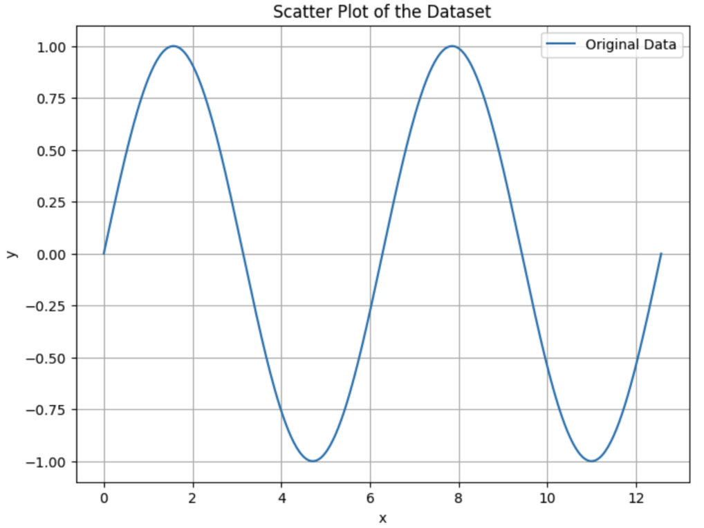
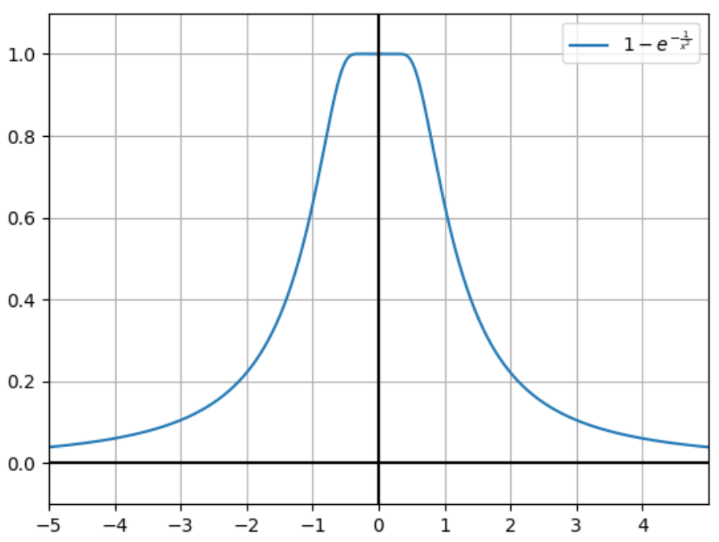

# Practice 2 Solutions

**Problem 1. Which of the following is the definition of irreducible error in machine learning?**

(a) The error that cannot be eliminated by any model

(b) The error that is caused by overfitting to the training data

(c) The error that is caused by underfitting to the testing data

(d) All of the above

**Correct answers:** (a)

**Explanation:**

**Irreducible error** is the fundamental uncertainty in the data that **cannot be eliminated** by any model, no matter how sophisticated. This error represents the inherent noise or randomness in the data generation process.

**Key characteristics:**
- **Independent of model choice** - no algorithm can reduce this error
- **Represents data uncertainty** - comes from measurement errors, natural variability, or missing information
- **Lower bound on performance** - sets the theoretical limit for model accuracy

**Examples of irreducible error:**
- Measurement noise in sensors
- Natural variability in biological systems
- Unpredictable external factors affecting the outcome

**Why other options are incorrect:**
- **(b)** Overfitting error can be reduced with regularization or more data
- **(c)** Underfitting error can be reduced with more complex models
- **(d)** Not all errors are irreducible

**Problem 2. What is the general model for $P(Y = 1|X = x,\theta)$ in logistic regression, where $X = (X_0, X_1,..., X_n)$ is the features, $Y$ is the predictions, and $\theta$ is the parameters? Assume that a bias term has already been appended to $X$ (i.e., $X_0 = 1$).**

(a) $P(Y = 1|X = x, \theta) = \frac{1}{1+e^{-\theta^T x}}$

(b) $P(Y = 1|X = x, \theta) = \theta^T x$

(c) $P(Y = 1|X = x, \theta) = \log(1 + e^{-\theta^T x})$

(d) $P(Y = 1|X = x, \theta) = \log(1 + e^{\theta^T x})$

**Correct answers:** (a)

**Explanation:**

The **sigmoid function** (also called logistic function) is the core of logistic regression:

$P(Y = 1|X = x, \theta) = \sigma(\theta^T x) = \frac{1}{1 + e^{-\theta^T x}}$

**Key properties:**
- **Output range:** [0, 1] - perfect for probability interpretation
- **Smooth and differentiable** - enables gradient-based optimization
- **Symmetric around 0.5** - when $θ^T x = 0$, $P(Y = 1) = 0.5$

**Mathematical intuition:**
- When $\theta^T x \to \infty$, $P(Y = 1) \to 1$
- When $\theta^T x \to -\infty$, $P(Y = 1) \to 0$
- When $\theta^T x = 0$, $P(Y = 1) = 0.5$

**Why other options are incorrect:**
- **(b)** Linear function can output values outside [0,1]
- **(c)** and **(d)** Log functions don't output probabilities

**Problem 3. Two realtors are creating machine learning models to predict house costs based on house traits (i.e. house size, neighborhood, school district, etc.) trained on the same set of houses, using the same model hyperparameters. Realtor A includes 30 different housing traits in their model. Realtor B includes 5 traits in their model. Which of the following outcomes is most likely?**
*   (a) Realtor B's model has higher variance and lower bias than Realtor A's model
*   (b) Realtor A's model has higher variance than Realtor B's model and without additional information, we cannot know which model has a higher bias
*   (c) Realtor A's model has higher variance and lower bias than Realtor B's model
*   (d) Realtor A's model has higher variance and higher bias than Realtor B's model

**Correct answers:** (b)

**Explanation:**

This is a classic **bias-variance tradeoff** problem. More features generally lead to **higher variance** but the effect on bias is **uncertain**.

**Why Realtor A has higher variance:**
- **More parameters to estimate** from the same amount of data
- **Higher risk of overfitting** to noise in the training data
- **Curse of dimensionality** - data becomes sparse in high-dimensional spaces

**Why bias is uncertain:**
- **Depends on feature relevance** - if the extra 25 features are informative, bias decreases
- **Depends on feature quality** - if the extra features are noise, bias might increase
- **Depends on model capacity** - whether the model can effectively use all features

**Key insight:** More features **always** increase variance, but bias can go either way depending on feature quality and relevance.

**Problem 4. When $L(w,b) = \sum_{i=1}^{n}(y_i - (w^T x_i + b))^2$ is used as a loss function to train a model, which of the following is true?**
*   (a) It minimizes the sum of the absolute differences between observed and predicted values.
*   (b) It maximizes the correlation coefficient between the independent and dependent variables.
*   (c) It requires the use of gradient descent optimization to find the best-fit line.
*   (d) It minimizes the sum of the squared difference between observed and predicted values.

**Correct answers:** (d)

**Explanation:**

This is the **Mean Squared Error (MSE)** loss function, which is the standard loss function for **linear regression**.

**Mathematical form:**

$L(w,b) = \sum_{i=1}^{n} (y_i - (w^T x_i + b))^2$

**Key properties:**
- **Squared differences** - penalizes large errors more heavily than small ones
- **Differentiable** - enables gradient-based optimization
- **Convex** - guarantees global minimum
- **Maximum likelihood** - equivalent to MLE under Gaussian noise assumption

**Why other options are incorrect:**
- **(a)** This describes Mean Absolute Error (MAE), not MSE
- **(b)** Correlation maximization is not the goal of this loss function
- **(c)** MSE can be solved analytically (normal equations), not just with gradient descent

**Problem 5. True/False: As the value of the regularization term coefficient in Ridge Regression increases, the sensitivity of predictions to inputs decreases.**
*   (a) True
*   (b) False

**Correct answers:** (a)

**Explanation:**

This is **true**. As the regularization coefficient λ increases in Ridge Regression, the model becomes **less sensitive** to input changes.

**Mathematical intuition:**
The Ridge Regression objective is:

$\min \|y - Xw\|^2 + \lambda\|w\|^2$

**Why sensitivity decreases:**
- **Smaller coefficients** - λ penalizes large weights, forcing them toward zero
- **Smoother predictions** - the model becomes more conservative
- **Reduced overfitting** - less responsive to noise in the training data

**Practical effect:**
- **Higher λ** → smaller coefficients → less sensitive to input variations
- **Lower λ** → larger coefficients → more sensitive to input variations

**Key insight:** This is the fundamental **regularization effect** - trading sensitivity for stability and generalization.

**Problem 6. Which of the following statements about logistic regression is true?**
*   (a) The loss function of logistic regression without regularization is convex, and the loss function of logistic regression with L2 regularization is convex.
*   (b) Neither the loss function of logistic regression without regularization is convex nor the loss function of logistic regression with L2 regularization is convex.
*   (c) The loss function of logistic regression without regularization is convex, but the loss function of logistic regression with L2 regularization is non-convex.
*   (d) The loss function of logistic regression without regularization is non-convex, but the loss function of logistic regression with L2 regularization is convex.

**Correct answers:** (a)

**Explanation:**

Both logistic regression loss functions are **convex**, which guarantees convergence to the global minimum.

**Logistic regression without regularization:**

$L(\theta) = -\sum_i [y_i \log(\sigma(\theta^T x_i)) + (1-y_i) \log(1-\sigma(\theta^T x_i))]$

**Logistic regression with L2 regularization:**

$L(\theta) = -\sum_i [y_i \log(\sigma(\theta^T x_i)) + (1-y_i) \log(1-\sigma(\theta^T x_i))] + \lambda\|\theta\|^2$

**Why both are convex:**
- **Log-likelihood term** - convex (logistic function is log-concave)
- **L2 penalty term** - convex (quadratic function)
- **Sum of convex functions** - remains convex

**Key insight:** Adding L2 regularization **preserves convexity** and actually makes the optimization more stable.

**Problem 7. Which of the following is NOT an assumption of logistic regression?**
*   (a) The output target is binary.
*   (b) The input features can be continuous or categorical.
*   (c) The residual errors are normally distributed.

**Correct answers:** (c)

**Explanation:**

**Unbiased MLE estimates** for a Gaussian distribution require the **n-1 denominator** for variance.

**Correct formulas:**

$\hat{\mu}_{\text{MLE}} = \bar{x}$ (sample mean)

$\hat{\sigma}^2_{\text{MLE}} = \frac{1}{n-1} \sum_i(x_i - \hat{\mu}_{\text{MLE}})^2$

**Why n-1 instead of n:**

**1. Bias correction:**
- **n denominator** gives the MLE estimate (biased)
- **n-1 denominator** gives the unbiased estimate
- This is called **Bessel's correction**

**2. Degrees of freedom:**
- We lose one degree of freedom by estimating μ from the data
- The n-1 denominator accounts for this estimation

**3. Mathematical justification:**
- $E[\hat{\sigma}^2_{\text{MLE}}] = \sigma^2$ (unbiased)
- $E[\frac{1}{n}\sum_i(x_i - \bar{x})^2] = \frac{n-1}{n}\sigma^2$ (biased)

**Why other options are incorrect:**
- **(a)** Uses n in denominator (biased)
- **(b)** Uses n in denominator (biased)
- **(d)** Incorrectly scales the mean

**Key insight:** **Unbiased estimation** requires **Bessel's correction** (n-1 denominator).

**Explanation:**

**Logistic regression assumptions:**

**✓ Valid assumptions:**
- **(a)** Binary output (though multi-class extensions exist)
- **(b)** Features can be continuous or categorical

**✗ NOT an assumption:**
- **(c)** Normal distribution of residuals - this is a **linear regression** assumption

**Key differences from linear regression:**
- **Logistic regression:** Models probability, uses Bernoulli/binomial distribution
- **Linear regression:** Models continuous values, assumes normal residuals

**Why normal residuals don't apply:**
- Logistic regression predicts **probabilities** (bounded between 0 and 1)
- The response follows a **Bernoulli distribution**, not normal
- Residuals are not normally distributed in logistic regression

**Note:** Option (a) was also accepted as logistic regression can refer to multi-class extensions.

**Problem 8. Suppose we've split a dataset into train, validation, and test sets; trained a regression model on the train set; and found the optimal value for a regularization constant $\lambda$. Select all of the regression methods for which adding the validation set into the train set and retraining can change the optimal value for $\lambda$.**
*   (a) LASSO regression
*   (b) Ridge regression

**Correct answers:** (a), (b)

**Explanation:**

**Both LASSO and Ridge regression** can have their optimal λ values change when the validation set is added to the training set.

**Why this happens:**

**1. More training data:**
- **Larger training set** → different parameter estimates
- **Different data distribution** → different optimal regularization strength
- **Reduced variance** → potentially less regularization needed

**2. Different optimization landscape:**
- **LASSO:** More data can change which features are selected
- **Ridge:** More data can change the optimal shrinkage amount

**3. Practical considerations:**
- **Data-dependent regularization** - optimal λ depends on the specific dataset
- **Sample size effects** - larger datasets often need less regularization
- **Distribution shifts** - validation set might have different characteristics

**Key insight:** The optimal regularization parameter is **data-dependent**, so changing the training data will likely change the optimal λ.

**Problem 9. Suppose that we want to estimate the ideal parameter $\theta^*$ for $p(x, y, \theta)$ given a set of observations $\{x_i, y_i\}$. Which of the following is a key assumption made when using $\hat{\theta}_{MLE} = \arg \max_{\theta} \sum_i \log(p(x_i, y_i|\theta_i))$ for Maximum Likelihood Estimation (MLE) to estimate the model parameter?**
*   (a) The data is normally distributed.
*   (b) The data is independent and identically distributed (i.i.d.).
*   (c) The data contains no outliers.
*   (d) The data is linearly separable.

**Correct answers:** (b)

**Explanation:**

**i.i.d. assumption** is fundamental to Maximum Likelihood Estimation (MLE).

**Why i.i.d. is required:**

**1. Independence:**
- Allows us to write the joint likelihood as a **product** of individual likelihoods:

$L(\theta) = p(x_1, y_1, \theta) \times p(x_2, y_2, \theta) \times \cdots \times p(x_n, y_n, \theta)$

**2. Identically distributed:**
- All observations come from the **same distribution** with parameter $\theta$
- Enables the log-likelihood formulation:

$\log L(\theta) = \sum_i \log(p(x_i, y_i|\theta))$

**Why other options are incorrect:**
- **(a)** Normal distribution is not required for MLE (works with any distribution)
- **(c)** MLE can handle outliers (though they may affect estimates)
- **(d)** Linear separability is not a general MLE assumption

**Key insight:** i.i.d. is the **minimal assumption** needed to justify the MLE objective function.

**Problem 10. Provide one advantage and one disadvantage of Stochastic Gradient Descent (SGD) over Gradient Descent (GD).**

**Answer:**

**Advantage:** SGD is much faster per iteration than GD.

**Disadvantage:** SGD introduces noise in training metrics due to stochasticity, making it harder to determine convergence.

**Explanation:**

**Advantages of SGD:**
- **Computational efficiency** - processes only one sample (or mini-batch) per iteration
- **Memory efficiency** - doesn't need to store gradients for all data points
- **Better generalization** - noise can help escape local minima
- **Scalability** - works well with large datasets

**Disadvantages of SGD:**
- **Noisy gradients** - high variance in gradient estimates
- **Harder convergence detection** - noisy loss curves make stopping criteria unclear
- **Requires careful tuning** - learning rate scheduling is more critical
- **Less stable** - may oscillate around the minimum

**Key insight:** SGD trades **stability for speed** - it's faster but requires more careful hyperparameter tuning.

**Problem 11. Assume a simple linear model $Y = \beta_1 X$. For simplicity, no intercept is considered. Given the following dataset:**

$X = \begin{pmatrix} 1 \\ 2 \\ 3 \end{pmatrix}$

$Y = \begin{pmatrix} 3 \\ 5 \\ 7 \end{pmatrix}$

**(a) (1 point) Compute the least squares estimate of $\beta_1$ without any regularization. You may leave your answer as a fraction, if necessary.**

**Answer:** $\hat{\beta}_1 = \frac{17}{7}$

**(b) (1 point) Using Lasso Regression (equation 11) with a penalty term $\alpha = 2$, would $\beta_1$ increase or decrease? Provide a short explanation.**

**Answer:** Decrease

**Explanation:**

**Part (a) - Least squares estimation:**

The least squares estimate for $\beta_1$ is given by:

$\hat{\beta}_1 = \frac{\sum_i X_i Y_i}{\sum_i X_i^2}$

**Calculation:**

$\hat{\beta}_1 = \frac{3 \times 1 + 5 \times 2 + 7 \times 3}{1^2 + 2^2 + 3^2} = \frac{3 + 10 + 21}{1 + 4 + 9} = \frac{34}{14} = \frac{17}{7}$

**Part (b) - LASSO effect:**

**β₁ will decrease** when LASSO regularization is applied.

**Why this happens:**
- **L1 penalty** encourages coefficients to shrink toward zero
- **Sparsity promotion** - LASSO can set coefficients exactly to zero
- **Regularization effect** - trades bias for variance reduction

**Mathematical intuition:**
- Without regularization: $\hat{\beta}_1 = \frac{17}{7} \approx 2.43$
- With LASSO: $\hat{\beta}_1 \leq \frac{17}{7}$ (always smaller or equal)
- The L1 penalty $\lambda\|\beta\|_1$ pushes $\beta_1$ toward zero

**Problem 12. Suppose you're given a scatter plot of a dataset, and the pattern appears to be a periodic wave-like curve that repeats itself at regular intervals.**

**Which of the following basis functions might be most appropriate to capture the relationship between $x$ and $y$ for this dataset?**

*   (a) Polynomial basis functions: $\phi(x) = \{1, x, x^2, x^3, ...\}$
*   (b) Radial basis functions: $\phi(x) = \exp(-\lambda||x - c||^2)$
*   (c) Fourier basis functions: $\phi(x) = \{1, \sin(\omega x), \cos(\omega x), \sin(2\omega x), \cos(2\omega x), ...\}$
*   (d) Logarithmic basis function: $\phi(x) = \log(x)$
*   (e) Exponential basis function: $\phi(x) = \exp(\lambda x)$

**Correct answers:** (c)

**Explanation:**

**Fourier basis functions** are specifically designed to capture **periodic patterns** in data.

**Why Fourier functions are ideal:**

**1. Mathematical foundation:**
- **Fourier series** can represent any periodic function
- **Sine and cosine** functions are naturally periodic
- **Frequency components** can capture different periodicities

**2. Basis function form:**

$\phi(x) = \{1, \sin(\omega x), \cos(\omega x), \sin(2\omega x), \cos(2\omega x), \ldots\}$

**3. Advantages for periodic data:**
- **Natural periodicity** - matches the wave-like pattern
- **Orthogonal basis** - efficient representation
- **Frequency control** - ω parameter controls period length

**Why other options are less suitable:**
- **(a) Polynomial:** Better for smooth, non-periodic trends
- **(b) Radial basis:** Better for local, non-periodic patterns
- **(d) Logarithmic:** Better for growth/decay patterns
- **(e) Exponential:** Better for growth/decay patterns

**Key insight:** Choose basis functions that **match the underlying data structure** - periodic data needs periodic basis functions.

**Problem 13. Which of the following statements about convexity is true?**

*   (a) If $f(x)$ is convex, then $g(x) = \frac{1}{3}f(x)$ is also convex
*   (b) If $f(x)$ is convex, then gradient descent on minimizing $f(x)$ will always reach global minimum
*   (c) If $f(x)$ is convex, then $f(x)$ is everywhere differentiable

**Correct answers:** (a)

**Explanation:**

**Scaling preserves convexity** - if f(x) is convex, then g(x) = (1/3)f(x) is also convex.

**Why this is true:**

**1. Mathematical property:**
- **Positive scaling** preserves convexity
- If $f(x)$ is convex, then $\alpha f(x)$ is convex for any $\alpha > 0$
- This is because convexity is defined by the inequality:

$f(\lambda x_1 + (1-\lambda)x_2) \leq \lambda f(x_1) + (1-\lambda)f(x_2)$

**2. Scaling effect:**
- Multiplying by 1/3 (positive constant) maintains the inequality
- The scaled function $g(x) = \frac{1}{3}f(x)$ satisfies:

$g(\lambda x_1 + (1-\lambda)x_2) \leq \lambda g(x_1) + (1-\lambda)g(x_2)$

**Why other options are incorrect:**
- **(b)** Gradient descent may get stuck in local minima even for convex functions
- **(c)** Convex functions need not be differentiable everywhere (e.g., |x| at x=0)

**Key insight:** **Positive scaling** is a **convexity-preserving operation**.

**Problem 14. What are the unbiased maximum likelihood estimates (MLE) for the parameters $(\mu, \sigma)$ of a univariate Gaussian distribution, given a dataset of $n$ independently sampled 1-dimensional data points $X = \{x_1, ..., x_n\}$ and the sample mean $\bar{x}$?**

*   (a) $\hat{\mu}_{MLE} = \bar{x}$, $\hat{\sigma}^2_{MLE} = \frac{1}{n} \sum_{i=1}^n x_i$
*   (b) $\hat{\mu}_{MLE} = \bar{x}$, $\hat{\sigma}^2_{MLE} = \frac{1}{n} \sum_{i=1}^n (x_i - \hat{\mu}_{MLE})^2$
*   (c) $\hat{\mu}_{MLE} = \bar{x}$, $\hat{\sigma}^2_{MLE} = \frac{1}{n-1} \sum_{i=1}^n (x_i - \hat{\mu}_{MLE})^2$
*   (d) $\hat{\mu}_{MLE} = \frac{1}{n} \bar{x}$, $\hat{\sigma}^2_{MLE} = \frac{1}{n-1} \sum_{i=1}^n (x_i - \hat{\mu}_{MLE})^2$

**Correct answers:** (c)

**Problem 15. True/False: When performing gradient descent, decreasing the learning rate enough will slow down convergence but will eventually guarantee you arrive at the global minimum.**

*   (a) True
*   (b) False

**Correct answers:** (b)

**Explanation:**

This is **false**. Decreasing the learning rate does **not guarantee** convergence to the global minimum.

**Why this is false:**

**1. Non-convex functions:**
- **Local minima** can trap gradient descent
- **Saddle points** can slow convergence significantly
- **Plateaus** can cause very slow progress

**2. Learning rate effects:**
- **Too small** → very slow convergence, may get stuck
- **Too large** → may overshoot or oscillate
- **Optimal rate** → depends on the function's curvature

**3. Convergence guarantees:**
- **Convex functions** → guaranteed convergence to global minimum
- **Non-convex functions** → no such guarantee
- **Stochastic gradient descent** → additional noise considerations

**Key insight:** **Learning rate alone** cannot overcome the **fundamental limitations** of gradient descent on non-convex functions.

**Problem 16. Which of the following functions is strictly convex over its entire domain?**

*   (a) $f(x) = -x^2$
*   (b) $f(x) = x^3$
*   (c) $f(x) = \ln(x)$
*   (d) $f(x) = e^x$

**Correct answers:** (d)

**Explanation:**

**e^x is strictly convex** over its entire domain ℝ.

**Analysis of each function:**

**1. $f(x) = -x^2$ (concave):**
- Second derivative: $f''(x) = -2 < 0$
- **Concave** (not convex)

**2. $f(x) = x^3$ (not convex):**
- Second derivative: $f''(x) = 6x$
- **Convex for x > 0, concave for x < 0**
- Not convex over entire domain

**3. $f(x) = \ln(x)$ (concave):**
- Second derivative: $f''(x) = -\frac{1}{x^2} < 0$
- **Concave** (not convex)

**4. $f(x) = e^x$ (strictly convex):**
- Second derivative: $f''(x) = e^x > 0$ for all x
- **Strictly convex** over entire domain $\mathbb{R}$

**Key insight:** **e^x** is the only function with **positive second derivative everywhere**.

**Problem 17. Which of the following is true about a validation set and how it is used?**

*   (a) The validation set allows us to estimate how a model would perform on unseen data
*   (b) When deciding to use a validation set, you do not need a separate test set
*   (c) After hyperparameter tuning, the validation set is always added back into the training set before training the final model
*   (d) The validation set allows us to train a model quicker by decreasing the size of our training data set

**Correct answers:** (a)

**Explanation:**

**Validation sets** provide an **unbiased estimate** of model performance on unseen data.

**Purpose of validation sets:**

**1. Hyperparameter tuning:**
- **Model selection** - choose best hyperparameters
- **Architecture selection** - choose best model structure
- **Feature selection** - choose best feature subset

**2. Performance estimation:**
- **Unbiased estimate** of generalization error
- **Prevents overfitting** to test set
- **Model comparison** without test set contamination

**Why other options are incorrect:**
- **(b)** Test set is still needed for final evaluation
- **(c)** Not always added back (depends on methodology)
- **(d)** Validation set doesn't speed up training

**Key insight:** Validation sets provide **honest estimates** of model performance for **decision-making**.

**Problem 18. (2 points) Suppose we have the function**

$$f(x) = \begin{cases} 1 - e^{-\frac{1}{x^2}} & x \neq 0 \\ 1 & x = 0 \end{cases}$$

**(a) (1 point) Suppose that we perform gradient descent starting at $x_0 = 0$ with step size $\eta = 1$. What is the asymptotic behavior of gradient descent given by Equation 12?**

$$x_{n+1} = x_n - \eta f'(x_n) \quad (12)$$

**Answer:** The gradient descent will be stationary at $x=0$.

**(b) (1 point) Now suppose that $x_0 \sim \mathcal{N}(0, \epsilon)$ for some small $\epsilon$. What is the behavior then?**

**Answer:** For $x_0 \neq 0$, the gradient descent will head towards $\text{sign}(x_0) \infty$ very slowly.

**Explanation:** For $x_0 = 0$ gradient descent is stationary and for $x_0 \neq 0$ it will head towards $\text{sign}(x_0) \infty$ very slowly.

**Problem 19. A bag contains 4 red balls and 3 green balls. We draw 3 balls from the bag without replacement. What is the probability that all 3 balls are red? Express your result as a fraction, or as a percentage rounded to the integer percentage (e.g. 77%).**

**Answer:** 11% or 4/35

**Explanation:**

This is a **hypergeometric probability** problem - drawing without replacement from a finite population.

**Step-by-step calculation:**

**1. Total balls:** 4 red + 3 green = 7 balls
**2. Drawing:** 3 balls without replacement
**3. Desired outcome:** All 3 balls are red

**Probability calculation:**

$P(\text{All 3 red}) = \frac{\text{Number of ways to choose 3 red}}{\text{Total ways to choose 3 balls}} = \frac{C(4,3)}{C(7,3)} = \frac{4}{35} \approx 0.114 \approx 11\%$

**Where:**
- **$C(4,3)$** = number of ways to choose 3 red balls from 4 red balls = 4
- **$C(7,3)$** = number of ways to choose 3 balls from 7 total balls = 35

**Alternative calculation:**

$P(\text{All 3 red}) = \frac{4}{7} \times \frac{3}{6} \times \frac{2}{5} = \frac{24}{210} = \frac{4}{35}$

**Key insight:** **Without replacement** means the probability changes after each draw, unlike binomial probability.

**Problem 20. True/False: For a matrix $X \in \mathbb{R}^{n \times d}$ of rank $d$, there exists an orthogonal matrix $V$ and diagonal matrix $D$ such that $X^T X = VDV^T$.**

*   (a) True
*   (b) False

**Correct answers:** (a)

**Explanation:**

This is **true**. For a matrix X ∈ ℝ^(n×d) of rank d, the matrix X^T X has an **eigendecomposition** with orthogonal eigenvectors.

**Why this is true:**

**1. Properties of $X^T X$:**
- **Symmetric:** $(X^T X)^T = X^T X$
- **Positive semi-definite:** $v^T X^T X v \geq 0$ for all v
- **Rank d:** Since X has rank d, $X^T X$ also has rank d

**2. Spectral theorem:**
- **Symmetric matrices** have real eigenvalues
- **Symmetric matrices** have orthogonal eigenvectors
- **Eigendecomposition:** $X^T X = VDV^T$ where:
  - **V** is orthogonal ($V^T V = I$)
  - **D** is diagonal with real eigenvalues

**3. Matrix dimensions:**
- **$X^T X \in \mathbb{R}^{d \times d}$** (d×d symmetric matrix)
- **$V \in \mathbb{R}^{d \times d}$** (orthogonal matrix)
- **$D \in \mathbb{R}^{d \times d}$** (diagonal matrix)

**Key insight:** The **spectral theorem** guarantees that any **symmetric matrix** can be diagonalized by an **orthogonal matrix**.

**Problem 21. You have built a spam detection classifier to help you clean up your email inbox. Your system has uncovered that 90% of all spam emails contain the word "discount". If you assume that the overall probability of an email being spam is 5% and 15% of all incoming emails contain the word "discount", what is the probability that an email containing "discount" is actually spam?**

*   (a) 0.9
*   (b) 0.135
*   (c) 0.3
*   (d) 0.045

**Correct answers:** (c)

**Explanation:**

This is a **Bayes' theorem** problem. We need to find P(Spam|Discount).

**Given information:**
- P(Spam) = 0.05 (5% of emails are spam)
- P(Discount|Spam) = 0.90 (90% of spam contains "discount")
- P(Discount) = 0.15 (15% of all emails contain "discount")

**Using Bayes' theorem:**

$P(\text{Spam}|\text{Discount}) = \frac{P(\text{Discount}|\text{Spam}) \times P(\text{Spam})}{P(\text{Discount})} = \frac{0.90 \times 0.05}{0.15} = \frac{0.045}{0.15} = 0.3$

**Intuition:**
- Even though 90% of spam contains "discount", only 5% of emails are spam
- So among all "discount" emails, only 30% are actually spam
- The word "discount" is not as strong an indicator as it might seem

**Key insight:** **Base rate matters** - even high conditional probabilities can lead to low posterior probabilities when the prior is small.

**Problem 22. Determine if the following statements about k-fold cross-validation are true or false:**

**Statement (1):** For large datasets with $n$ samples, it is recommended to use k-fold cross-validation with a value of $k$ that is close to $n$.

**Statement (2):** In k-fold cross-validation, a larger value of $k$ results in a more computationally efficient process, as it requires fewer model training.

*   (a) Both statements are True
*   (b) Both statements are False
*   (c) Statement (1) is True, Statement (2) is False
*   (d) Statement (1) is False, Statement (2) is True

**Correct answers:** (b)

**Explanation:**

**Both statements are false** regarding k-fold cross-validation.

**Statement (1) - False:**
- **Large datasets** should use **smaller k** values (e.g., k=5 or k=10)
- **k close to n** would be **leave-one-out (LOO)** validation
- **LOO is computationally expensive** for large datasets
- **k=5 or k=10** provides good balance of bias and variance

**Statement (2) - False:**
- **Larger k** means **more model training** (not fewer)
- **k-fold CV** trains **k models** total
- **Smaller k** (e.g., k=5) requires fewer model trainings than larger k (e.g., k=20)
- **Computational cost** scales linearly with k

**Practical guidelines:**
- **Small datasets:** Use larger k (LOO or k close to n)
- **Large datasets:** Use smaller k (k=5 or k=10)
- **Computational efficiency:** Smaller k is faster

**Key insight:** **k-fold CV** trades **computational cost** for **estimation accuracy** - larger k is more accurate but more expensive.

**Problem 23. What is the primary encouragement of the L1 regularization term in Lasso regression?**

*   (a) Encourages the model to fit the training data more closely.
*   (b) Encourages the model to have large coefficients for all features.
*   (c) Encourages the model to have small but non-zero coefficients for all features.
*   (d) Encourages sparsity by driving some feature coefficients to zero.

**Correct answers:** (d)

**Explanation:**

**LASSO (L1 regularization) encourages sparsity** by driving some coefficients exactly to zero.

**Why L1 creates sparsity:**

**1. Mathematical intuition:**
- **L1 penalty:** $\lambda\|w\|_1 = \lambda(|w_1| + |w_2| + \cdots + |w_n|)$
- **L1 constraint region** has **sharp corners** at the axes
- **Optimal solution** often lies at these corners where some coefficients = 0

**2. Geometric interpretation:**
- **L1 constraint:** diamond-shaped region
- **L2 constraint:** circular region
- **L1 corners** touch the axes, allowing exact zeros
- **L2 surface** is smooth, never touches axes

**3. Feature selection:**
- **Zero coefficients** = irrelevant features
- **Non-zero coefficients** = important features
- **Automatic feature selection** without manual intervention

**4. Comparison with Ridge (L2):**
- **Ridge:** Shrinks coefficients toward zero but never exactly zero
- **LASSO:** Can set coefficients exactly to zero
- **LASSO:** Better for feature selection and interpretability

**Key insight:** **L1 regularization** provides **automatic feature selection** through sparsity induction.

**Problem 24. Consider fitting a linear model by minimizing the least squares objective $\hat{w} = \arg \min_w \sum_{i=1}^n (y_i - x_i^T w)^2$ for a training dataset of i.i.d. input-output pairs $\{(x_i, y_i)\}_{i=1}^n$. Which of the following statements about this objective is true?**

*   (a) The least squares objective is equivalent to maximizing the likelihood function of the observed data assuming Gaussian noise.
*   (b) The least squares objective is equivalent to minimizing the likelihood function of the observed data assuming Gaussian noise.
*   (c) The least squares objective is equivalent to maximizing the likelihood function of the observed data assuming Laplace noise.
*   (d) The least squares objective is equivalent to minimizing the likelihood function of the observed data assuming Laplace noise.

**Correct answers:** (a)

**Explanation:**

**Least squares is equivalent to maximum likelihood estimation (MLE) under Gaussian noise assumption.**

**Mathematical derivation:**

**1. Gaussian noise model:**

$y_i = x_i^T w + \varepsilon_i, \text{ where } \varepsilon_i \sim N(0, \sigma^2)$

**2. Likelihood function:**

$L(w) = \prod_i p(y_i | x_i, w) = \prod_i \frac{1}{\sqrt{2\pi\sigma^2}} \exp\left(-\frac{(y_i - x_i^T w)^2}{2\sigma^2}\right)$

**3. Log-likelihood:**

$\log L(w) = -\frac{n}{2} \log(2\pi\sigma^2) - \frac{1}{2\sigma^2} \sum_i (y_i - x_i^T w)^2$

**4. MLE objective:**

$\max \log L(w) = \min \sum_i (y_i - x_i^T w)^2$

**Why other options are incorrect:**
- **(b)** MLE maximizes likelihood, not minimizes
- **(c)** Laplace noise would give L1 loss, not L2 loss
- **(d)** Wrong noise distribution and wrong optimization direction

**Key insight:** **Gaussian noise** leads to **squared error loss**, while **Laplace noise** would lead to **absolute error loss**.

**Problem 25. Consider a matrix $A \in \mathbb{R}^{n \times n}$ that is symmetric and has orthonormal columns. Which of the following statements is true?**

*   (a) All eigenvalues of $A$ are real.
*   (b) At least one eigenvalue of $A$ is complex.
*   (c) All eigenvalues of $A$ are either 0 or 1.
*   (d) The eigenvalues of $A$ cannot be determined from the given information.

**Correct answers:** (a)

**Explanation:**

**Symmetric matrices have real eigenvalues** - this is a fundamental property from linear algebra.

**Why (a) is correct:**

**1. Spectral theorem for symmetric matrices:**
- **Symmetric matrices** have **real eigenvalues**
- **Symmetric matrices** have **orthogonal eigenvectors**
- **$A^T = A$** implies all eigenvalues are real

**2. Orthonormal columns property:**
- **$A^T A = I$** (orthonormal columns)
- **A is symmetric** ($A^T = A$)
- **Combining:** $A^T A = A^2 = I$
- **Eigenvalues** of $A^2$ are squares of eigenvalues of A

**3. Analysis:**
- **A² = I** means eigenvalues of A² are all 1
- **Eigenvalues of A** must be ±1 (since (±1)² = 1)
- **All eigenvalues are real** (both +1 and -1 are real)

**Why other options are incorrect:**
- **(b)** Symmetric matrices cannot have complex eigenvalues
- **(c)** Eigenvalues are ±1, not just 0 or 1
- **(d)** We can determine eigenvalues from the given properties

**Key insight:** **Symmetric matrices** have **real eigenvalues** regardless of other properties.

**Problem 26. Consider the closed form of the optimal weight for Ridge Regression, as derived in a previous homework (HW1):**

$$\hat{W} = (X^T X + \lambda I)^{-1} X^T Y$$

**where $X = [x_1 \cdots x_n]^T \in \mathbb{R}^{n \times d}$ and $Y = [y_1 \cdots y_n]^T \in \mathbb{R}^{n \times k}$.**

**Show that when $\lambda > 0$, the matrix $X^T X + \lambda I$ is invertible.**

**Answer:**

**Explanation:**

**Proof that X^T X + λI is invertible when λ > 0:**

**1. Positive definiteness:**
For any non-zero vector $v \in \mathbb{R}^d$:

$v^T (X^T X + \lambda I) v = v^T X^T X v + \lambda v^T v$

**2. Analysis of terms:**
- **$v^T X^T X v \geq 0$** ($X^T X$ is positive semi-definite)
- **$\lambda v^T v > 0$** (since $\lambda > 0$ and $v \neq 0$)

**3. Conclusion:**

$v^T (X^T X + \lambda I) v > 0 \text{ for all } v \neq 0$

**4. Invertibility:**
- **Positive definite** matrices are **invertible**
- **Eigenvalues** are all positive
- **Determinant** is positive

**Key insight:** The **λI term** ensures positive definiteness, making the matrix **always invertible** regardless of X's rank.
