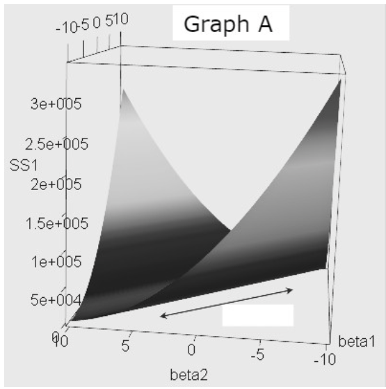

# Practice 3

**1. We need to fit a function to our dataset $\{(x_i, y_i)\}_{i=1}^n$. Suppose our dataset looks like the following:**

**We decide to expand our features with general basis functions to improve our estimator:**

$$\begin{pmatrix}
x_1 \\
\vdots \\
x_n
\end{pmatrix}
\rightarrow
\begin{pmatrix}
x_1 & g(x_1) & h(x_1) \\
\vdots & \vdots & \vdots \\
x_n & g(x_n) & h(x_n)
\end{pmatrix}$$

**Which of the following choices of $g$ and $h$ are most likely to produce the best estimator function?**

*   (a) $g(x) = \log(x)$, $h(x) = x^2$
*   (b) $g(x) = x^4$, $h(x) = x^2$
*   (c) $g(x) = \sin(x)$, $h(x) = x^2$
*   (d) $g(x) = \cos(x)$, $h(x) = x$

**2. Irreducible error can be completely eliminated by:**

*   (a) Collecting more training data
*   (b) Tuning hyperparameters of the model
*   (c) Regularizing the model
*   (d) None of the above

**3. Increasing the regularization of a model would typically:**

*   (a) Increase its bias and increase its variance
*   (b) Increase its bias and decrease its variance
*   (c) Decrease its bias and increase its variance
*   (d) Decrease its bias and decrease its variance

**4. In a binary classification problem with balanced classes (exactly the same number of positive examples as negative examples), a machine learning model has an accuracy of 85% and misclassifies 10% of positive examples as negative. What is the probability that the model will correctly classify a negative sample?**

**Answer:**

**5. The below figures are graphs of some loss functions with Loss on the Vertical axis and weight variables on the horizontal axes.**

**Which graph represents a Ridge Regression Loss function?**

*   (a) Graph A
*   (b) Graph B

**6. Irreducible error in machine learning is caused by:**

*   (a) Noise in the data
*   (b) Bias in the model
*   (c) Variance in the model
*   (d) Overfitting of the model

**7. Suppose that we are given train, validation, and test sets. Which set(s) should be used to standardize the test data when generating a prediction?**

**Answer:**

**8. Suppose we are performing leave-one-out (LOO) validation and 10-fold cross validation on a dataset of size 100,000 to pick between 4 different values of a single hyperparameter. How many times greater is the number of models that need to be trained for LOO validation versus 10-fold cross validation?**

**Answer:**

**9. What are two possible ways to reduce the variance of a model?**

**Answer:**

**10. Below are a list of potential advantages and disadvantages of stochastic gradient descent(SGD). Select all that are true regarding SGD.**

**Advantages:**
*   (a) SGD is more memory-efficient because it takes a smaller number of samples at a time compared to classical gradient descent which takes the entire dataset into weight update
*   (b) In SGD, the update on weight $w_{t+1}$ has lower variance because it doesn't take many samples into account at a time

**Disadvantages:**
*   (c) The noise in the dataset has higher impact on the stability of SGD than on that of the classical gradient descent.
*   (d) SGD is more sensitive to learning rate compared to classical gradient descent
*   (e) It's more computationally inefficient to use SGD for a large dataset than to use classical gradient descent because it requires more resources to randomly sample a data point for the weight update

**11. Which of the following is not a convex function?**
*   (a) $f(x) = x$
*   (b) $f(x) = x^2$
*   (c) $f(x) = e^x$
*   (d) $f(x) = \frac{1}{1+e^{-x}}$

**12. Recall the loss function used in ridge regression,**

$$f(w) = \sum_{i=1}^{n} (y_i - x_i^T w)^2 + \lambda ||w||_2^2$$

**What happens to the weights as $\lambda \rightarrow \infty$?**
*   (a) Weights approach positive infinity.
*   (b) Weights approach 0.
*   (c) Weights approach negative infinity.
*   (d) Not enough information.

**13. Why is it important to use a different test set to evaluate the final performance of the model, rather than the validation set used during model selection?**
*   (a) The model may have overfit to the validation set
*   (b) The test set is a better representation of new, unseen data
*   (c) Both a and b
*   (d) None of the above

**14. What is cross-validation not used for?**
*   (a) To evaluate the performance of a machine learning model on unseen data.
*   (b) To select a model's hyperparameters.
*   (c) To determine the generalization of a machine learning model.
*   (d) To train multiple machine learning models on different datasets.

**15. The plots below show linear regression results on the basis of only three data points.**

**Which plot would result from using the following objective, where $\lambda = 10$?**

$$f(w) = \sum_{i=1}^{3} (y_i - wx_i - b)^2 + \lambda w^2$$

*   (a) Plot A
*   (b) Plot B
*   (c) Plot C
*   (d) Plot D

**16. Let $a \in \mathbb{R}^n$ and $b \in \mathbb{R}^m$. Let $C = ab^T$. What are the dimensions of the matrix $C$, what is the range of $C$, and what is the null space of $C$?**

**Answer:**

**17. What is the objective of least squares regression?**
*   (a) To minimize the sum of the absolute differences between predicted and actual values.
*   (b) To minimize the sum of the squared differences between predicted and actual values.
*   (c) To maximize the number of points on the line of best fit.

**18. An unbiased machine learning model is trained on a dataset with noisy features and achieves a prediction accuracy of 75%. If the irreducible error due to noise in the features is estimated to be 10%, what is the estimated variance of the model?**

**Answer:**

**19. Convexity is a desirable property in machine learning because it:**
*   (a) guarantees gradient descent finds a global minimum in optimization problems for functions that have a global minimum
*   (b) helps to avoid the model overfitting
*   (c) speeds up model training
*   (d) reduces model complexity

**20. True/False: Stochastic gradient descent typically results in a smoother convergence plot (loss vs. epochs) as compared to gradient descent.**
*   (a) True
*   (b) False

**21. Consider the univariate function $f(x) = x^2$. This function has a unique minimum at $x^*= 0$. We're using gradient descent (GD) to find this minimum and at time $t$ we arrive at the point $x_t = 2$. What is the step size that would bring us to $x^*$ at time $t + 1$?**

**Answer:**

**22. Let $X \in \mathbb{R}^{m \times n}$, $w \in \mathbb{R}^n$, $Y \in \mathbb{R}^m$, and $R(w)$ be some regularization function from $\mathbb{R}^n \to \mathbb{R}$. Consider mean squared error with regularization $L(w) = \|Xw - Y\|_2^2 + \lambda R(w)$. What is $\nabla_w L(w)$?**
*   (a) $2Y^T (Xw - Y) + \lambda$
*   (b) $2X^T (X^T Xw - Y) + \lambda \nabla_w R(w)$
*   (c) $2X^T (Xw - Y) + \lambda \nabla_w R(w)$
*   (d) $2Y^T (X^T Xw - Y) + \lambda R(w)$

**23. Suppose we have $n$ Gaussian distributions $\mathcal{D}_1, \dots, \mathcal{D}_n$, where each $\mathcal{D}_i = \mathcal{N}(\mu_i, \sigma^2)$. In other words, each Gaussian distribution shares the same variance $\sigma^2$, but may have different means $\mu_i$. For each distribution, we draw a single data point $X_i \sim \mathcal{D}_i$. Given**
$$\begin{pmatrix} X_1 \\ \vdots \\ X_n \end{pmatrix}, \text{ we want to predict } \begin{pmatrix} \mu_1 \\ \vdots \\ \mu_n \end{pmatrix}$$
**Solution 1 is to predict $X$, and Solution 2 is to predict $\frac{7}{8}X$. Why might Solution 2 produce lower mean squared error than Solution 1?**

**Answer:**
