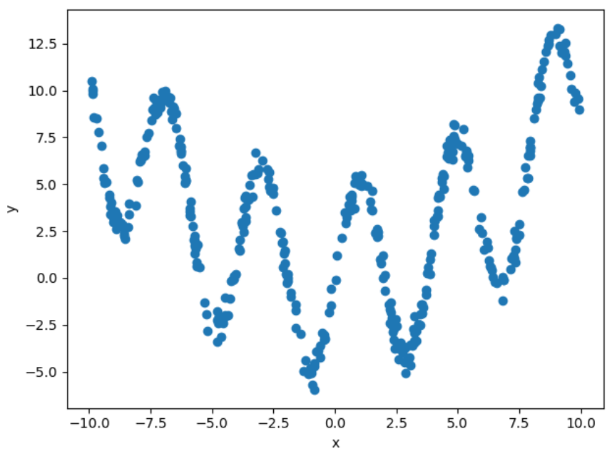
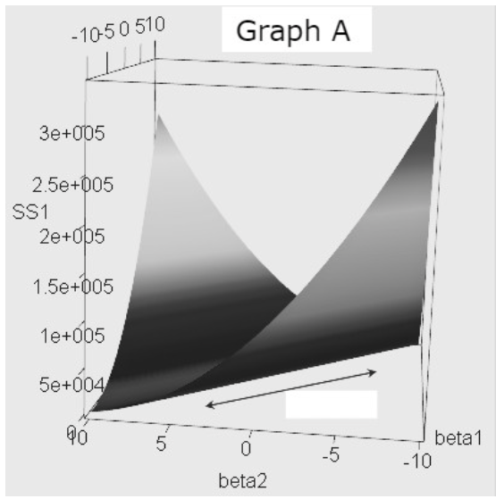
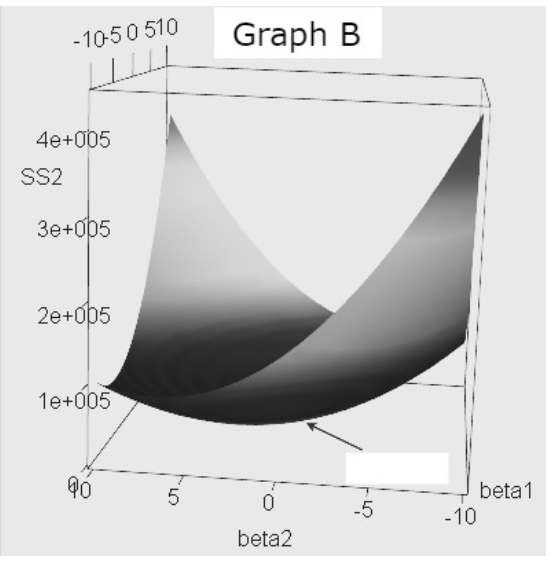
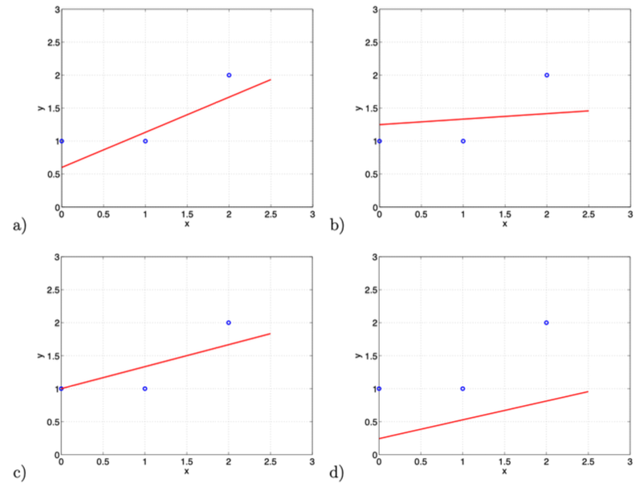

# Practice 3 Solutions

**Problem 1. We need to fit a function to our dataset $\{(x_i, y_i)\}_{i=1}^n$. Suppose our dataset looks like the following:**



**We decide to expand our features with general basis functions to improve our estimator:**

$$\begin{pmatrix}
x_1 \\
\vdots \\
x_n
\end{pmatrix}
\rightarrow
\begin{pmatrix}
x_1 & g(x_1) & h(x_1) \\
\vdots & \vdots & \vdots \\
x_n & g(x_n) & h(x_n)
\end{pmatrix}$$

**Which of the following choices of $g$ and $h$ are most likely to produce the best estimator function?**

*   (a) $g(x) = \log(x)$, $h(x) = x^2$
*   (b) $g(x) = x^4$, $h(x) = x^2$
*   (c) $g(x) = \sin(x)$, $h(x) = x^2$
*   (d) $g(x) = \cos(x)$, $h(x) = x$

**Correct answers:** (c)

**Explanation:**

Looking at the dataset plot, we can see a **periodic wave-like pattern** that suggests **sinusoidal functions** would be most appropriate.

**Why (c) is correct:**

**1. Sinusoidal pattern recognition:**
- The data shows **periodic oscillations** around a curved trend
- **g(x) = sin(x)** captures the periodic component perfectly
- **h(x) = x²** captures the underlying quadratic trend

**2. Why other options fail:**

**Option (a): g(x) = log(x), h(x) = x²**
- **log(x)** is undefined for x < 0, making it unsuitable for general data
- The periodic pattern is not captured

**Option (b): g(x) = x⁴, h(x) = x²**
- **Polynomial functions** cannot capture periodic behavior
- The data shows clear oscillations, not just polynomial trends

**Option (d): g(x) = cos(x), h(x) = x**
- **cos(x)** could work, but **h(x) = x** doesn't capture the quadratic trend
- **x²** is better than **x** for the underlying curvature

**Key insight:** Choose basis functions that **match the data structure** - periodic data needs periodic functions.

**Problem 2. Irreducible error can be completely eliminated by:**

*   (a) Collecting more training data
*   (b) Tuning hyperparameters of the model
*   (c) Regularizing the model
*   (d) None of the above

**Correct answers:** (d)

**Explanation:**

**Irreducible error cannot be completely eliminated** by any of the listed methods. This is because irreducible error represents the **fundamental uncertainty** in the data generation process.

**Why each option fails:**

**Option (a): Collecting more training data**
- More data can reduce **reducible error** (bias and variance)
- But **irreducible error** is inherent to the data itself
- No amount of data can eliminate measurement noise or natural variability

**Option (b): Tuning hyperparameters**
- Hyperparameter tuning optimizes **model performance**
- It can reduce bias and variance, but not irreducible error
- The fundamental uncertainty remains regardless of model choice

**Option (c): Regularizing the model**
- Regularization affects **model complexity** and generalization
- It trades bias for variance, but cannot touch irreducible error
- The inherent noise in the data persists

**Key insight:** Irreducible error is a **lower bound** on model performance that cannot be overcome by any modeling technique.

**Problem 3. Increasing the regularization of a model would typically:**

*   (a) Increase its bias and increase its variance
*   (b) Increase its bias and decrease its variance
*   (c) Decrease its bias and increase its variance
*   (d) Decrease its bias and decrease its variance

**Correct answers:** (b)

**Explanation:**

**Regularization increases bias and decreases variance** - this is the fundamental **bias-variance tradeoff**.

**Why this happens:**

**1. Increased Bias:**
- **Constrained parameters** - regularization prevents the model from fitting training data too closely
- **Simpler model** - the model becomes less flexible and may miss true patterns
- **Underfitting risk** - excessive regularization can lead to underfitting

**2. Decreased Variance:**
- **Reduced overfitting** - regularization makes the model less sensitive to training data noise
- **More stable predictions** - the model becomes more consistent across different datasets
- **Better generalization** - the model generalizes better to unseen data

**Mathematical intuition:**
- **L2 regularization:** $\min \|y - Xw\|^2 + \lambda\|w\|^2$
- **L1 regularization:** $\min \|y - Xw\|^2 + \lambda\|w\|_1$
- Both penalize large coefficients, forcing them toward zero

**Key insight:** The optimal regularization strength **balances** this tradeoff for best generalization performance.

**Problem 4. In a binary classification problem with balanced classes (exactly the same number of positive examples as negative examples), a machine learning model has an accuracy of 85% and misclassifies 10% of positive examples as negative. What is the probability that the model will correctly classify a negative sample?**

**Answer:** 80%

**Explanation:**

This is a **confusion matrix** problem with balanced classes. Let's solve it step by step.

**Given information:**
- **Balanced classes:** 50% positive, 50% negative
- **Overall accuracy:** 85%
- **False negative rate:** 10% (misclassifies 10% of positives as negative)

**Let's assume 100 total samples:**
- **50 positive** samples
- **50 negative** samples

**From the false negative rate:**
- **False negatives:** 10% of 50 = 5 positive samples misclassified as negative
- **True positives:** 50 - 5 = 45 positive samples correctly classified

**From overall accuracy:**
- **Total correct predictions:** 85% of 100 = 85 samples
- **True positives:** 45 (from above)
- **True negatives:** 85 - 45 = 40 negative samples correctly classified

**Probability of correctly classifying a negative sample:**

$\text{True negative rate} = \frac{\text{True negatives}}{\text{Total negatives}} = \frac{40}{50} = 0.8 = 80\%$

**Key insight:** Use the **confusion matrix** framework to break down the problem systematically.

**Problem 5. The below figures are graphs of some loss functions with Loss on the Vertical axis and weight variables on the horizontal axes.**





**Which graph represents a Ridge Regression Loss function?**

*   (a) Graph A
*   (b) Graph B

**Correct answers:** (b)

**Explanation:**

**Graph B** represents the Ridge Regression loss function because it shows a **smooth, bowl-shaped surface** typical of L2 regularization.

**Why Graph B is Ridge Regression:**

**1. Mathematical form:**

$L(w) = \|y - Xw\|^2 + \lambda\|w\|^2$

**2. Visual characteristics:**
- **Smooth contours** - L2 penalty creates smooth, differentiable surface
- **Circular/elliptical contours** - L2 norm creates circular constraint regions
- **No sharp corners** - unlike L1 regularization which creates diamond-shaped contours

**3. Why Graph A is not Ridge:**
- **Sharp edges/corners** - suggests L1 regularization (LASSO)
- **Diamond-shaped contours** - characteristic of L1 penalty
- **Non-differentiable points** - L1 creates non-differentiable corners

**Key insight:** **L2 regularization** creates **smooth, circular contours**, while **L1 regularization** creates **sharp, diamond-shaped contours**.

**6. Irreducible error in machine learning is caused by:**

*   (a) Noise in the data
*   (b) Bias in the model
*   (c) Variance in the model
*   (d) Overfitting of the model

**Correct answers:** (a)

**Explanation:**

**Irreducible error is caused by noise in the data** - this represents the fundamental uncertainty that cannot be eliminated by any model.

**Why (a) is correct:**

**1. Definition of irreducible error:**
- **Inherent uncertainty** in the data generation process
- **Measurement noise** from sensors or instruments
- **Natural variability** in the underlying phenomenon
- **Missing information** that affects the outcome

**2. Why other options are incorrect:**

**Option (b): Bias in the model**
- This is **reducible error** that can be reduced with better model selection
- Model bias can be addressed through more complex models or better features

**Option (c): Variance in the model**
- This is also **reducible error** that can be reduced with regularization or more data
- Model variance can be addressed through ensemble methods or simpler models

**Option (d): Overfitting of the model**
- This is a **modeling issue** that can be fixed with proper regularization
- Overfitting is a reducible source of error

**Key insight:** **Irreducible error** comes from the **data itself**, while **reducible error** comes from **modeling choices**.

**7. Suppose that we are given train, validation, and test sets. Which set(s) should be used to standardize the test data when generating a prediction?**

**Answer:** Use the mean and standard deviation from the training data

**Explanation:**

**Data leakage** occurs when we use information from the test set during preprocessing, which violates the principle of keeping the test set completely unseen.

**Why use training data statistics:**

**1. Preventing data leakage:**
- **Test set should be completely unseen** during model development
- Using test set statistics gives the model **unfair advantage**
- This would make performance estimates **overly optimistic**

**2. Proper workflow:**

1. Calculate $\mu_{\text{train}}$, $\sigma_{\text{train}}$ from training data
2. Standardize training data: $(x - \mu_{\text{train}}) / \sigma_{\text{train}}$
3. Standardize validation data: $(x - \mu_{\text{train}}) / \sigma_{\text{train}}$
4. Standardize test data: $(x - \mu_{\text{train}}) / \sigma_{\text{train}}$

**3. Consequences of using test statistics:**
- **Different predictions** depending on test set size
- **Unrealistic performance estimates**
- **Violation of generalization principle**

**Alternative:** Using statistics from **train + validation** combined is also acceptable, as validation data is used for model selection.

**Key insight:** **Never use test set information** during model development to maintain honest performance estimates.

**8. Suppose we are performing leave-one-out (LOO) validation and 10-fold cross validation on a dataset of size 100,000 to pick between 4 different values of a single hyperparameter. How many times greater is the number of models that need to be trained for LOO validation versus 10-fold cross validation?**

**Answer:** 10,000

**Explanation:**

This is a **computational complexity** comparison between LOO and k-fold cross-validation.

**Calculation:**

**LOO validation:**
- **Number of models per hyperparameter:** n = 100,000
- **Total models:** 4 × 100,000 = 400,000 models

**10-fold cross-validation:**
- **Number of models per hyperparameter:** k = 10
- **Total models:** 4 × 10 = 40 models

**Ratio:**

$\text{LOO models} / \text{10-fold models} = 400,000 / 40 = 10,000$

**Why this happens:**

**1. LOO validation:**
- Trains **n models** (one for each data point)
- Each model uses **n-1 training points**
- Very computationally expensive for large datasets

**2. 10-fold cross-validation:**
- Trains **k models** (k = 10)
- Each model uses **9n/10 training points**
- Much more computationally efficient

**Key insight:** LOO becomes **prohibitively expensive** for large datasets, making k-fold CV the practical choice.

**9. What are two possible ways to reduce the variance of a model?**

**Answer:** 
1. Use more training data
2. Use a less complex model

**Explanation:**

**Variance reduction** is crucial for improving model generalization. Here are the two main approaches:

**1. Use more training data:**
- **Larger sample size** reduces parameter estimation uncertainty
- **More stable estimates** of model parameters
- **Better generalization** to unseen data
- **Natural regularization** effect from averaging over more examples

**2. Use a less complex model:**
- **Fewer parameters** to estimate from the same amount of data
- **Reduced overfitting** risk
- **More stable predictions** across different datasets
- **Better bias-variance tradeoff**

**Additional methods (not required but worth mentioning):**
- **Regularization** (L1/L2 penalties)
- **Ensemble methods** (bagging, random forests)
- **Early stopping** during training
- **Cross-validation** for model selection

**Key insight:** **More data** and **simpler models** are the most effective ways to reduce variance and improve generalization.

**10. Below are a list of potential advantages and disadvantages of stochastic gradient descent(SGD). Select all that are true regarding SGD.**

**Advantages:**
*   (a) SGD is more memory-efficient because it takes a smaller number of samples at a time compared to classical gradient descent which takes the entire dataset into weight update
*   (b) In SGD, the update on weight $w_{t+1}$ has lower variance because it doesn't take many samples into account at a time

**Disadvantages:**
*   (c) The noise in the dataset has higher impact on the stability of SGD than on that of the classical gradient descent.
*   (d) SGD is more sensitive to learning rate compared to classical gradient descent
*   (e) It's more computationally inefficient to use SGD for a large dataset than to use classical gradient descent because it requires more resources to randomly sample a data point for the weight update

**Correct answers:** (a), (c), (d)

**Explanation:**

**SGD advantages and disadvantages** compared to full gradient descent:

**Advantages:**

**Option (a): Memory efficiency ✓**
- **Smaller batches** require less memory per iteration
- **Scalable** to large datasets that don't fit in memory
- **Practical** for big data applications

**Disadvantages:**

**Option (c): Noise sensitivity ✓**
- **Stochastic noise** from mini-batches affects stability
- **Higher variance** in gradient estimates
- **Less stable** convergence compared to full gradient descent

**Option (d): Learning rate sensitivity ✓**
- **More sensitive** to learning rate choice due to noise
- **Requires careful tuning** of learning rate schedule
- **Adaptive methods** (Adam, RMSprop) often needed

**Why other options are incorrect:**

**Option (b): Lower variance ✗**
- SGD actually has **higher variance** due to stochastic sampling
- Full gradient descent has lower variance but higher computational cost

**Option (e): Computational inefficiency ✗**
- SGD is **more computationally efficient** per iteration
- The sampling overhead is negligible compared to full gradient computation

**Key insight:** SGD trades **stability for efficiency** - faster per iteration but requires more careful hyperparameter tuning.

**11. Which of the following is not a convex function?**
*   (a) $f(x) = x$
*   (b) $f(x) = x^2$
*   (c) $f(x) = e^x$
*   (d) $f(x) = \frac{1}{1+e^{-x}}$

**Correct answers:** (d)

**Explanation:**

**The sigmoid function f(x) = 1/(1+e^(-x)) is not convex** - it's actually concave in some regions.

**Why (d) is not convex:**

**1. Second derivative test:**

$f(x) = \frac{1}{1+e^{-x}}$

$f'(x) = \frac{e^{-x}}{(1+e^{-x})^2}$

$f''(x) = \frac{e^{-x}(e^{-x}-1)}{(1+e^{-x})^3}$

**2. Analysis:**
- **f''(x) < 0** for x > 0 (concave)
- **f''(x) > 0** for x < 0 (convex)
- **f''(0) = 0** (inflection point)

**3. Why other functions are convex:**

**Option (a): f(x) = x**
- **f''(x) = 0** (linear functions are convex)

**Option (b): f(x) = x²**
- **f''(x) = 2 > 0** (strictly convex)

**Option (c): f(x) = e^x**
- **f''(x) = e^x > 0** (strictly convex)

**Key insight:** The **sigmoid function** has an **S-shape** that makes it **non-convex** overall, despite being convex in some regions.

**12. Recall the loss function used in ridge regression,**

$$f(w) = \sum_{i=1}^{n} (y_i - x_i^T w)^2 + \lambda ||w||_2^2$$

**What happens to the weights as $\lambda \rightarrow \infty$?**
*   (a) Weights approach positive infinity.
*   (b) Weights approach 0.
*   (c) Weights approach negative infinity.
*   (d) Not enough information.

**Correct answers:** (b)

**Explanation:**

**As λ → ∞, the weights approach 0** due to the overwhelming influence of the L2 regularization term.

**Mathematical intuition:**

**1. Ridge regression objective:**

$\min f(w) = \|y - Xw\|^2 + \lambda\|w\|^2$

**2. As λ → ∞:**
- The **regularization term $\lambda\|w\|^2$** dominates
- The **data term $\|y - Xw\|^2$** becomes negligible
- The objective becomes approximately: $\min \lambda\|w\|^2$

**3. Solution:**
- $\min \|w\|^2$ subject to no constraints
- The minimum occurs at $w = 0$
- All weights shrink toward zero

**4. Intuitive understanding:**
- **Extreme regularization** forces the model to be as simple as possible
- **Zero weights** represent the simplest possible model (constant predictor)
- This is the **maximum bias, minimum variance** scenario

**Key insight:** **Infinite regularization** creates the **simplest possible model** with all weights equal to zero.

**13. Why is it important to use a different test set to evaluate the final performance of the model, rather than the validation set used during model selection?**
*   (a) The model may have overfit to the validation set
*   (b) The test set is a better representation of new, unseen data
*   (c) Both a and b
*   (d) None of the above

**Correct answers:** (c)

**Explanation:**

**Both (a) and (b) are correct** - using a separate test set is crucial for honest model evaluation.

**Why (a) is correct - Overfitting to validation set:**

**1. Model selection process:**
- **Multiple models** are evaluated on the validation set
- **Hyperparameter tuning** is based on validation performance
- **Model architecture** choices are influenced by validation results

**2. Overfitting risk:**
- The **best model** is selected based on validation performance
- This creates **selection bias** toward the validation set
- The model may **memorize** validation set patterns

**Why (b) is correct - Better representation:**

**1. Unseen data principle:**
- **Test set** should be completely unseen during model development
- **Validation set** has been "seen" through the selection process
- **Test set** provides unbiased estimate of true performance

**2. Generalization assessment:**
- **Test set** represents truly new, unseen data
- **Validation set** performance may be optimistic
- **Test set** gives realistic performance expectations

**Key insight:** **Three-way split** (train/validation/test) ensures honest evaluation by keeping the test set completely isolated.

**14. What is cross-validation not used for?**
*   (a) To evaluate the performance of a machine learning model on unseen data.
*   (b) To select a model's hyperparameters.
*   (c) To determine the generalization of a machine learning model.
*   (d) To train multiple machine learning models on different datasets.

**Correct answers:** (d)

**Explanation:**

**Cross-validation is NOT used to train multiple ML models on different datasets** - this is a fundamental misunderstanding of what CV does.

**What cross-validation actually does:**

**1. Same model, different partitions:**
- **Single model architecture** trained multiple times
- **Same dataset** split into different train/validation partitions
- **Same hyperparameters** evaluated across different folds

**2. What CV is used for:**

**Option (a): Performance evaluation ✓**
- Estimates how well the model generalizes to unseen data
- Provides confidence intervals for performance metrics

**Option (b): Hyperparameter selection ✓**
- Compares different hyperparameter settings
- Finds optimal hyperparameters for the given model

**Option (c): Generalization assessment ✓**
- Measures model's ability to generalize
- Reduces overfitting risk through multiple evaluations

**3. Why (d) is incorrect:**
- CV uses **one dataset** split multiple ways
- CV trains the **same model** multiple times
- CV does **not** use different datasets

**Key insight:** Cross-validation is a **resampling technique** for the same dataset, not a method for training different models on different datasets.

**15. The plots below show linear regression results on the basis of only three data points.**



**Which plot would result from using the following objective, where $\lambda = 10$?**

$$f(w) = \sum_{i=1}^{3} (y_i - wx_i - b)^2 + \lambda w^2$$

*   (a) Plot A
*   (b) Plot B
*   (c) Plot C
*   (d) Plot D

**Correct answers:** (b)

**Explanation:**

**Plot B** shows the result of strong L2 regularization (λ = 10) on linear regression with 3 data points.

**Why Plot B is correct:**

**1. Strong regularization effect:**
- **λ = 10** is a very high regularization strength
- The **slope w** is heavily penalized and approaches zero
- The **intercept b** is not regularized, so it can still adjust

**2. Visual characteristics:**
- **Nearly horizontal line** - slope is close to zero
- **Line passes through middle** - intercept adjusts to minimize error
- **Flat regression** - strong regularization prevents overfitting

**3. Mathematical intuition:**

$\min f(w,b) = \sum(y_i - wx_i - b)^2 + \lambda w^2$

- **w term** is penalized by $\lambda w^2$
- **b term** has no penalty
- **Optimal w ≈ 0** for large λ
- **Optimal b** minimizes the sum of squared errors

**4. Why other plots are incorrect:**
- **Plot A:** Shows overfitting (line passes through all points)
- **Plot C:** Shows underfitting without proper intercept adjustment
- **Plot D:** Shows incorrect slope direction

**Key insight:** **Strong regularization** creates a **simple, flat model** that generalizes better than complex fits.

**16. Let $a \in \mathbb{R}^n$ and $b \in \mathbb{R}^m$. Let $C = ab^T$. What are the dimensions of the matrix $C$, what is the range of $C$, and what is the null space of $C$?**

**Answer:**

**Dimensions:** $C \in \mathbb{R}^{n \times m}$
**Range:** $\text{range}(C) = \text{span}(\{a\})$ (if $b \neq 0$, otherwise $\{0\}$)
**Null space:** $\text{null}(C) = \{v \in \mathbb{R}^m \mid v^T b = 0\}$ (if $a \neq 0$, otherwise $\mathbb{R}^m$)

**Explanation:**

This is a **rank-1 matrix** problem. Let's analyze each component:

**1. Dimensions:**
- **$a \in \mathbb{R}^n$** (column vector)
- **$b \in \mathbb{R}^m$** (column vector)  
- **$C = ab^T$** (outer product)
- **$C \in \mathbb{R}^{n \times m}$** (n rows, m columns)

**2. Range analysis:**
- **$C = ab^T$** is a rank-1 matrix
- **$\text{range}(C) = \text{span}(\{a\})$** - all columns are scalar multiples of a
- **If $b = 0$:** $C = 0$, so $\text{range}(C) = \{0\}$
- **If $b \neq 0$:** $\text{range}(C) = \text{span}(\{a\})$

**3. Null space analysis:**
- **$\text{null}(C) = \{v \in \mathbb{R}^m \mid Cv = 0\}$**
- **$Cv = ab^T v = a(b^T v) = 0$**
- This requires **$b^T v = 0$** (since $a \neq 0$)
- **$\text{null}(C) = \{v \in \mathbb{R}^m \mid v^T b = 0\}$**
- **If $a = 0$:** $C = 0$, so $\text{null}(C) = \mathbb{R}^m$

**Key insight:** **Rank-1 matrices** have **1-dimensional range** and **(m-1)-dimensional null space**.

**17. What is the objective of least squares regression?**
*   (a) To minimize the sum of the absolute differences between predicted and actual values.
*   (b) To minimize the sum of the squared differences between predicted and actual values.
*   (c) To maximize the number of points on the line of best fit.

**Correct answers:** (b)

**Explanation:**

**Least squares regression minimizes the sum of squared differences** between predicted and actual values.

**Mathematical formulation:**

**1. Objective function:**

$\min \sum(y_i - \hat{y}_i)^2 = \min \sum(y_i - x_i^T w)^2$

**2. Why squared differences:**

**Mathematical advantages:**
- **Differentiable** everywhere (unlike absolute differences)
- **Convex function** - guarantees unique global minimum
- **Analytical solution** exists (normal equations)
- **Statistical interpretation** - maximum likelihood under Gaussian noise

**3. Why other options are incorrect:**

**Option (a): Absolute differences**
- **L1 loss** (least absolute deviations)
- **Non-differentiable** at zero
- **No closed-form solution**
- **Robust to outliers** but harder to optimize

**Option (c): Maximize points on line**
- **Not a mathematical objective**
- **Vague and ill-defined**
- **No optimization formulation**

**Key insight:** **Squared loss** provides **mathematical tractability** and **statistical optimality** under Gaussian assumptions.

**18. An unbiased machine learning model is trained on a dataset with noisy features and achieves a prediction accuracy of 75%. If the irreducible error due to noise in the features is estimated to be 10%, what is the estimated variance of the model?**

**Answer:** 15%

**Explanation:**

This is a **bias-variance decomposition** problem with irreducible error.

**Given information:**
- **Model accuracy:** 75% (this is 1 - total error)
- **Total error:** 100% - 75% = 25%
- **Irreducible error:** 10%
- **Model is unbiased:** bias = 0

**Bias-variance decomposition:**

$\text{Total Error} = \text{Bias}^2 + \text{Variance} + \text{Irreducible Error}$

$25\% = 0^2 + \text{Variance} + 10\%$

$25\% = \text{Variance} + 10\%$

$\text{Variance} = 25\% - 10\% = 15\%$

**Why this works:**

**1. Unbiased model assumption:**
- **Bias = 0** means the model is unbiased
- **Bias² = 0** in the decomposition

**2. Error breakdown:**
- **Total error:** 25% (from accuracy)
- **Irreducible error:** 10% (given)
- **Reducible error:** 25% - 10% = 15%
- **Since bias = 0:** All reducible error is variance

**3. Practical interpretation:**
- **15% variance** represents model instability
- This could be reduced with more data or regularization
- **10% irreducible error** cannot be eliminated

**Key insight:** **Variance = Total Error - Irreducible Error** when bias is zero.

**19. Convexity is a desirable property in machine learning because it:**
*   (a) guarantees gradient descent finds a global minimum in optimization problems for functions that have a global minimum
*   (b) helps to avoid the model overfitting
*   (c) speeds up model training
*   (d) reduces model complexity

**Correct answers:** (a)

**Explanation:**

**Convexity guarantees that gradient descent finds the global minimum** - this is the primary advantage of convex optimization.

**Why (a) is correct:**

**1. Global optimality guarantee:**
- **Convex functions** have no local minima other than the global minimum
- **Gradient descent** converges to the global minimum
- **No initialization sensitivity** - any starting point works
- **Deterministic convergence** to the optimal solution

**2. Mathematical properties:**
- **First-order condition:** ∇f(x*) = 0 implies global minimum
- **Second-order condition:** ∇²f(x) ≥ 0 for all x
- **Uniqueness:** Global minimum is unique (if strictly convex)

**3. Why other options are incorrect:**

**Option (b): Avoid overfitting**
- **Convexity** doesn't prevent overfitting
- **Regularization** prevents overfitting
- **Model complexity** controls overfitting

**Option (c): Speed up training**
- **Convexity** doesn't guarantee faster convergence
- **Condition number** affects convergence speed
- **Learning rate** is the main factor

**Option (d): Reduce complexity**
- **Convexity** is about function shape, not model complexity
- **Model complexity** is determined by architecture
- **Regularization** reduces effective complexity

**Key insight:** **Convexity** provides **optimization guarantees**, not **generalization guarantees**.

**20. True/False: Stochastic gradient descent typically results in a smoother convergence plot (loss vs. epochs) as compared to gradient descent.**
*   (a) True
*   (b) False

**Correct answers:** (b)

**Explanation:**

**SGD typically results in NOISIER convergence plots** compared to full gradient descent, not smoother ones.

**Why SGD is noisier:**

**1. Stochastic nature:**
- **Mini-batch sampling** introduces random noise
- **Gradient estimates** are noisy approximations
- **Update directions** vary randomly around true gradient

**2. Convergence characteristics:**
- **SGD:** Jagged, noisy convergence with oscillations
- **Full GD:** Smooth, monotonic convergence
- **SGD:** May bounce around the minimum due to noise

**3. Visual comparison:**
```
SGD:     /\/\/\/\/\  (noisy, oscillating)
Full GD: \________/  (smooth, steady)
```

**4. Why this happens:**
- **SGD** uses only a subset of data per update
- **Full GD** uses the exact gradient from all data
- **Stochastic noise** creates variance in the optimization path

**5. Trade-offs:**
- **SGD:** Faster per iteration, but noisier convergence
- **Full GD:** Slower per iteration, but smoother convergence
- **SGD:** Better for large datasets despite noise

**Key insight:** **SGD trades smoothness for speed** - the noise is the price paid for computational efficiency.

**21. Consider the univariate function $f(x) = x^2$. This function has a unique minimum at $x^*= 0$. We're using gradient descent (GD) to find this minimum and at time $t$ we arrive at the point $x_t = 2$. What is the step size that would bring us to $x^*$ at time $t + 1$?**

**Answer:** η = 1/2

**Explanation:**

This is a **gradient descent step size calculation** for the function f(x) = x².

**Step-by-step solution:**

**1. Given information:**
- **f(x) = x²**
- **x* = 0** (global minimum)
- **x_t = 2** (current position)
- **x_{t+1} = x* = 0** (desired next position)

**2. Gradient descent update rule:**

$x_{t+1} = x_t - \eta \nabla f(x_t)$

**3. Calculate the gradient:**

$f(x) = x^2$

$\nabla f(x) = 2x$

$\nabla f(2) = 2 \times 2 = 4$

**4. Set up the equation:**

$0 = 2 - \eta \times 4$

$4\eta = 2$

$\eta = 2/4 = 1/2$

**5. Verification:**

$x_{t+1} = 2 - (1/2) \times 4 = 2 - 2 = 0$ ✓

**Key insight:** For **quadratic functions**, the **optimal step size** is η = 1/L where L is the Lipschitz constant of the gradient (L = 2 for f(x) = x²).

**22. Let $X \in \mathbb{R}^{m \times n}$, $w \in \mathbb{R}^n$, $Y \in \mathbb{R}^m$, and $R(w)$ be some regularization function from $\mathbb{R}^n \to \mathbb{R}$. Consider mean squared error with regularization $L(w) = \|Xw - Y\|_2^2 + \lambda R(w)$. What is $\nabla_w L(w)$?**
*   (a) $2Y^T (Xw - Y) + \lambda$
*   (b) $2X^T (X^T Xw - Y) + \lambda \nabla_w R(w)$
*   (c) $2X^T (Xw - Y) + \lambda \nabla_w R(w)$
*   (d) $2Y^T (X^T Xw - Y) + \lambda R(w)$

**Correct answers:** (c)

**Explanation:**

**Option (c) is correct:** ∇_w L(w) = 2X^T (Xw - Y) + λ∇_w R(w)

**Step-by-step derivation:**

**1. Loss function:**

$L(w) = \|Xw - Y\|^2 + \lambda R(w)$

**2. Gradient of squared error term:**

$\nabla_w \|Xw - Y\|^2 = \nabla_w (Xw - Y)^T (Xw - Y)$

$= \nabla_w (w^T X^T Xw - 2Y^T Xw + Y^T Y)$

$= 2X^T Xw - 2X^T Y$

$= 2X^T (Xw - Y)$

**3. Gradient of regularization term:**

$\nabla_w [\lambda R(w)] = \lambda \nabla_w R(w)$

**4. Total gradient:**

$\nabla_w L(w) = 2X^T (Xw - Y) + \lambda \nabla_w R(w)$

**Why other options are incorrect:**

**Option (a):** Missing X^T and incorrect regularization term
**Option (b):** Extra X^T in the first term
**Option (d):** Wrong matrix dimensions and missing ∇_w

**Key insight:** **Chain rule** and **matrix calculus** give us the correct gradient for regularized least squares.

**23. Suppose we have $n$ Gaussian distributions $\mathcal{D}_1, \dots, \mathcal{D}_n$, where each $\mathcal{D}_i = \mathcal{N}(\mu_i, \sigma^2)$. In other words, each Gaussian distribution shares the same variance $\sigma^2$, but may have different means $\mu_i$. For each distribution, we draw a single data point $X_i \sim \mathcal{D}_i$. Given**
$$\begin{pmatrix} X_1 \\ \vdots \\ X_n \end{pmatrix}, \text{ we want to predict } \begin{pmatrix} \mu_1 \\ \vdots \\ \mu_n \end{pmatrix}$$
**Solution 1 is to predict $X$, and Solution 2 is to predict $\frac{7}{8}X$. Why might Solution 2 produce lower mean squared error than Solution 1?**

**Answer:** This is Stein's Paradox - introducing a small amount of bias can reduce overall error

**Explanation:**

This is **Stein's Paradox**, which demonstrates that **biased estimators can outperform unbiased ones** in high-dimensional settings.

**Why Solution 2 (7/8 × X) can be better:**

**1. Bias-variance tradeoff:**
- **Solution 1:** Unbiased estimator (X_i estimates μ_i directly)
- **Solution 2:** Biased estimator (7/8 × X_i shrinks toward zero)
- **Shrinkage** reduces variance at the cost of introducing bias

**2. Mathematical intuition:**
- **Solution 1:** $E[X_i] = \mu_i$, $\text{Var}(X_i) = \sigma^2$
- **Solution 2:** $E[7/8 \times X_i] = 7/8 \times \mu_i$, $\text{Var}(7/8 \times X_i) = (7/8)^2\sigma^2$
- **Bias:** $(7/8 \times \mu_i - \mu_i) = -\mu_i/8$
- **Variance reduction:** $\sigma^2 - (7/8)^2\sigma^2 = \sigma^2(1 - 49/64) = 15\sigma^2/64$

**3. When this helps:**
- **High noise** (large σ²) makes variance reduction valuable
- **Small means** (μ_i close to 0) make bias penalty small
- **Many dimensions** (large n) amplifies the effect

**4. Stein's insight:**
- **Individual unbiased estimators** can be improved
- **Shrinkage estimators** often perform better
- **James-Stein estimator** is the optimal shrinkage

**Key insight:** **Bias can be beneficial** when it reduces variance more than it increases squared bias.
