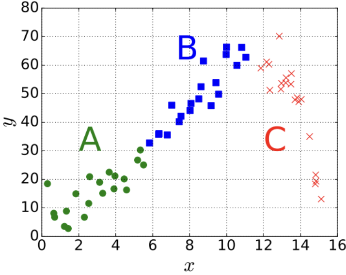

# Practice 6 Solutions

**1. In a machine learning classification problem, you have a dataset with two classes: Positive (P) and Negative (N). The probability of a randomly selected sample being Negative is 0.6. The probability of a correct classification given that the sample is Positive is 0.8, and the probability of a correct classification given that the sample is Negative is 0.6. What is the probability that a randomly selected sample is Positive given that it has been classified as Positive?**

*   (a) $\frac{4}{7}$
*   (b) $\frac{8}{17}$
*   (c) $\frac{4}{5}$
*   (d) $\frac{4}{15}$

**Correct answers:** (a)

**2. What is NOT true in the following statements?**

**The optimal weight $\hat{W}$ is given by the formula:**
$$\hat{W} = (X^T X + \lambda I)^{-1} X^T Y$$

**where:**
*   $X = [x_1 \cdots x_n]^T \in \mathbb{R}^{n \times d}$
*   $Y = [y_1 \cdots y_n]^T \in \mathbb{R}^{n \times k}$

*   (a) When $\lambda > 0$, the matrix $X^T X + \lambda I$ is invertible.
*   (b) The identity $I$ is a $d \times d$ matrix.
*   (c) When $\lambda = 0$, the matrix is not full-rank, so there is no solution for Ridge Regression.
*   (d) If we apply a unitary transform $U \in \mathbb{R}^{d \times d}$ ($U^T U = I$) on the input $X$ and output $Y$ to get another dataset $(UX, UY)$, the new estimated weight would still be $\hat{W}$.

**Correct answers:** (c)

**The next two questions:**

A fresh graduate of CSE 446 is helping a biologist friend model the relationship between the concentration $y$ of amino acid Arginine in blood plasma and time $x$ in hours after interacting with a reagent. The experiment measured concentration within 3 distinct time blocks (A, B, C):

*   **A:** time $x = 0$ to around 6 hours (represented by circles)
*   **B:** time $x$ around 6 hours to $x$ around 12 hours (represented by squares)
*   **C:** time $x$ around 12 hours to $x$ around 16 hours (represented by the symbol 'x')

**3. Based on the scatter plot above, which of the following statements is most likely to be true?**

*   (a) The relationship between $x$ and $y$ is linear across all time blocks.
*   (b) The relationship between $x$ and $y$ is non-linear and follows a piecewise pattern.
*   (c) There is no relationship between $x$ and $y$.
*   (d) The relationship between $x$ and $y$ is exponential.

**Correct answers:** (b)

**4. If you were to fit a linear regression model to this data, which of the following would be the most appropriate approach?**

*   (a) Fit a single linear model to all the data points.
*   (b) Fit separate linear models for each time block (A, B, C).
*   (c) Use polynomial regression with degree 2 or higher.
*   (d) Use logistic regression.

**Correct answers:** (b)

**5. Consider a binary classification problem where you want to predict whether a customer will buy a product (class 1) or not (class 0). You have the following confusion matrix:**

|                | Predicted 0 | Predicted 1 |
|----------------|-------------|-------------|
| **Actual 0**   | 80          | 20          |
| **Actual 1**   | 10          | 90          |

**What is the precision of this classifier?**

*   (a) 0.75
*   (b) 0.80
*   (c) 0.82
*   (d) 0.90

**Correct answers:** (c)

**6. In the context of the same confusion matrix from question 5, what is the recall (sensitivity) of the classifier?**

*   (a) 0.75
*   (b) 0.80
*   (c) 0.82
*   (d) 0.90

**Correct answers:** (d)

**7. A machine learning model has a training accuracy of 95% and a validation accuracy of 70%. This is most likely an example of:**

*   (a) Underfitting
*   (b) Overfitting
*   (c) Good generalization
*   (d) Data leakage

**Correct answers:** (b)

**8. Which of the following regularization techniques is most effective for feature selection?**

*   (a) L1 regularization (Lasso)
*   (b) L2 regularization (Ridge)
*   (c) Dropout
*   (d) Early stopping

**Correct answers:** (a)

**9. In cross-validation, what is the main advantage of using k-fold cross-validation over leave-one-out cross-validation?**

*   (a) It's computationally faster
*   (b) It provides better estimates of model performance
*   (c) It's more robust to outliers
*   (d) It requires less data

**Correct answers:** (a)

**10. Which of the following is NOT a valid reason for standardizing features before training a machine learning model?**

*   (a) To ensure all features have the same scale
*   (b) To improve convergence speed of gradient descent
*   (c) To make the model more interpretable
*   (d) To increase the model's accuracy

**Correct answers:** (d)

