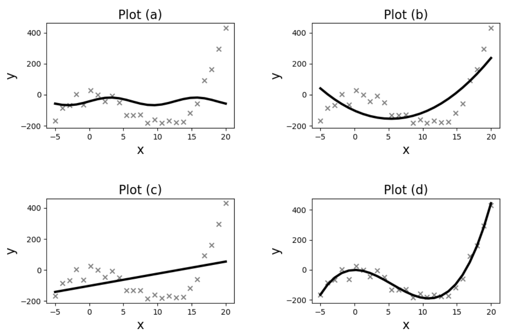

# Practice 7 Solutions

**Problem 1. In a machine learning classification problem, you have a dataset with two classes: Positive (P) and Negative (N). The probability of a randomly selected sample being Positive is $3/5$. The probability of a correct classification given that the sample is Positive is $4/5$, and the probability of a correct classification given that the sample is Negative is $7/10$. What is the probability that a randomly selected sample is Positive given that it has been classified as Positive? One Answer**

*   (a) $\frac{4}{5}$
*   (b) $\frac{12}{25}$
*   (c) $\frac{3}{5}$
*   (d) $\frac{12}{19}$

**Correct answers:** (a)

**Problem 2. Which of the following statements must be true for a square matrix A to have an inverse matrix $A^{-1}$?**

*   (a) A must be symmetric.
*   (b) The rank of A is less than its number of columns.
*   (c) A must have at least one column of 0s.
*   (d) The determinant of A is not equal to 0.

**Correct answers:** (d)

**Explanation:** A square matrix is invertible if and only if its determinant is non-zero, which is a fundamental theorem in linear algebra. Thus, choice (d) is correct. However, even if we forgot this fundamental theorems, we can use process-of-elimination. The symmetry of A has nothing to do with its inverse: imagine if A was all 0s; it's of course symmetric, but certainly non-invertible. Choices (b) and (c) being true would mean A has linearly dependent rows or columns, which cannot result in an invertible matrix.

**Problem 3. Consider the following system of linear equations:**

$$2x + 3y = 16$$
$$4x + 6y = 32$$

**Which of the following statements is true?**

*   (a) The system has an infinite number of solutions because the two equations are linearly dependent.
*   (b) The system has a unique solution because there are two equations for two unknowns.
*   (c) The system has no solution because the determinant of the coefficient matrix is zero.
*   (d) The system has no solution because the equations represent parallel lines that never intersect.

**Correct answers:** (a)

**Explanation:** The second equation is a multiple of the first, meaning they are linearly dependent and represent the same line. Since they are the same line, they intersect at every point, leading to an infinite number of solutions.

**Problem 4. For any function $f: \mathbb{R}^n \to \mathbb{R}$, the gradient is defined as:**

$$\nabla_w f(w) = \left[ \frac{\partial f(w)}{\partial w_1} \quad \dots \quad \frac{\partial f(w)}{\partial w_n} \right]^T$$

**What is the value of $\nabla_w (w^T Aw + u^T Bw + w^T Bv)$, given that $A, B \in \mathbb{R}^{n \times n}$, $A$ is symmetric, and $u, v \in \mathbb{R}^n$?**

*   (a) $Aw + Bu + B^T v$
*   (b) $2Aw + B^T u + Bv$
*   (c) $Aw + B^T u + Bv$
*   (d) $2Aw + Bu + B^T v$

**Correct answers:** (b)

**Problem 5. Which of the following statements is most accurate regarding the principle of Maximum Likelihood Estimation (MLE) in statistical modeling?**

*   (a) MLE identifies model parameters that maximize the probability of the observed data under the model.
*   (b) MLE directly computes the probability of parameters being correct, independent of observed data.
*   (c) MLE is primarily concerned with minimizing the variance of parameter estimates for model stability.
*   (d) MLE identifies model parameters that minimize the squared prediction error over the training data.

**Correct answers:** (a)

**Explanation:** MLE aims to maximize the probability of observing the given data under different model parameter values.

**Problem 6. A machine learning engineer models the number of website requests per hour using a Poisson distribution. Over 6 hours, the observed requests are 4, 5, 6, 7, 8, and 9. Recall that the probability mass function for a Poisson distribution with parameter $\lambda$ is:**

$$P(x|\lambda) = e^{-\lambda} \frac{\lambda^x}{x!}$$

**What is the maximum likelihood estimation of the rate parameter $\lambda$ of this Poisson distribution?**

*   (a) $e^{\frac{39}{6}}$
*   (b) $\sqrt{\frac{39}{6}}$
*   (b) $\sqrt{\frac{39}{6}}$
*   (c) 6
*   (d) $\frac{39}{6}$

**Correct answers:** (d)

**Explanation:** The MLE estimate of $\lambda$ for a Poisson distribution is simply the mean of the observed data. The mean is $\frac{39}{6} = 6.5$.

**Problem 7. Assume a simple linear model $Y = Xw$. For simplicity, no intercept is considered. Given the following dataset:**

$$X = \begin{bmatrix} 1 & 0 \\ 2 & 2 \end{bmatrix}$$
$$Y = \begin{bmatrix} 2 \\ 3 \end{bmatrix}$$

**(a) Compute the least squares estimate of $w$ without any regularization. You may leave your answer as a fraction, if necessary.**

**Hint:** if $A = \begin{bmatrix} a & b \\ c & d \end{bmatrix}$, then $A^{-1} = \frac{1}{ad-bc} \begin{bmatrix} d & -b \\ -c & a \end{bmatrix}$

**Answer:** $\hat{w} = \begin{bmatrix} 2 \\ -0.5 \end{bmatrix}$

**(b) Predict $\hat{Y}$ for $X = \begin{bmatrix} 6 \\ 7 \end{bmatrix}$.**

**Answer:** $\hat{Y} = 8.5$

**Explanation:** $\hat{w} = (X^T X)^{-1} X^T Y = \begin{bmatrix} 2 \\ -0.5 \end{bmatrix}$, $\hat{Y} = \hat{w}^T x = 8.5$

**8. You have access to data points $\{(x_i, y_i)\}_{i=1}^n$, where $x_i$ are $d$-dimensional vectors ($x_i \in \mathbb{R}^d$) and $y_i$ are scalars ($y_i \in \mathbb{R}$). Additionally, you have weights $\{w_i\}_{i=1}^n$, where $w_i \in \mathbb{R}$ and $w_i > 0$, representing the "importance" of each data point. You want to solve the weighted least squares regression problem:**

$$\hat{\theta} = \arg \min_{\theta \in \mathbb{R}^d} \sum_{i=1}^n w_i (x_i^T \theta - y_i)^2$$

**Let us define the matrices:**

$$X = \begin{bmatrix} x_1^T \\ \vdots \\ x_n^T \end{bmatrix} \in \mathbb{R}^{n \times d}$$
$$Y = \begin{bmatrix} y_1 \\ \vdots \\ y_n \end{bmatrix} \in \mathbb{R}^n$$
$$W = \begin{bmatrix} w_1 & 0 & \dots & 0 \\ 0 & w_2 & \dots & 0 \\ \vdots & \vdots & \ddots & \vdots \\ 0 & 0 & \dots & w_n \end{bmatrix} \in \mathbb{R}^{n \times n}$$

**What is $\hat{\theta}$ in terms of $X$, $Y$, and $W$?**

*   (a) $(X^T X)^{-1} X^T W^{-1} Y$
*   (b) $W(X^T X)^{-1} X^T Y$
*   (c) $(X^T X)^{-1} X^T W Y$
*   (d) $(X^T W X)^{-1} X^T Y$
*   (e) $(X^T W X)^{-1} X^T W Y$

**Correct answers:** (e)

**Explanation:** The solution can be found by taking the gradient of the optimization algorithm, setting it to 0, and solving for $\theta$. We can convert the objective function to matrix notation: $\arg \min_{\theta} (X\theta - Y)^T W (X\theta - Y)$.

**9. In the context of least squares regression, how does the presence of high noise levels in the data impact the reliability of the model's parameter estimates?**

*   (a) High noise levels predominantly affect the intercept term of the regression model, but leave the slope estimates relatively unaffected.
*   (b) High noise levels can increase the variability of the parameter estimates, potentially leading to a model that captures random noise rather than the true underlying relationship.
*   (c) High noise levels decrease the variance of the estimated parameters, making the model more robust.
*   (d) Noise in the data generally has minimal impact on the least squares estimates since the method inherently separates signal from noise in most scenarios.

**Correct answers:** (b)

**Explanation:** In least squares regression, high noise levels can lead to overfitting, where the model erroneously adjusts its parameters to account for these random fluctuations, resulting in a model that performs well on the training data but poorly on unseen data. This reduces the model's ability to generalize and accurately predict outcomes on new, unseen data.

**10. In linear regression analysis using the least squares method, how might outliers in the dataset impact the resulting regression line?**

*   (a) Outliers affect only the precision of the prediction intervals, not the regression line itself.
*   (b) Outliers enhance the model's accuracy by providing a wider range of data points.
*   (c) Outliers can significantly skew the regression line, potentially leading to an inaccurate representation of the overall data trend.
*   (d) Outliers have a minimal impact, as the least squares method averages out their effects.

**Correct answers:** (c)

**Explanation:** Least squares aims to minimize the sum of the squared differences between observed and predicted values. Outliers, which are very distant from other data points, can cause the squared differences to become substantially larger, and consequently "pull" the regression line to themselves. This can lead to a skewed line that does not accurately represent the underlying trend of the majority of the data, affecting the model's predictive accuracy.

**11. How does increasing the complexity of a model typically affect the properties of that model? Select all that apply.**

*   (a) It tends to decrease bias but increase variance, potentially leading to overfitting.
*   (b) It can increase training accuracy.
*   (c) It tends to increase both bias and variance.
*   (d) It tends to decrease variance but increase bias, potentially leading to underfitting.

**Correct answers:** (a), (b)

**12. True/False: A model with high variance tends to perform well on both the training and test data.**

*   (a) False
*   (b) True

**Correct answers:** (a)

**13. The plots below show fits (in black) to the data points ("x" symbols in grey), using several different basis functions:**

**For each plot, please identify the basis function used:**

**Plot (a): _____, Plot (b): _____, Plot (c): _____, Plot (d): _____**

**Basis functions used:**
1. $h_1(x) = [1,x]$
2. $h_2(x) = [1,x,x^2]$
3. $h_3(x) = [1,x,x^2,x^3]$
4. $h_4(x) = [1, \sin(\frac{4\pi}{25}x)]$

**Explanation:** Plot (a): $h_4$, Plot(b): $h_2$, Plot (c): $h_1$, Plot (d): $h_3$

**14. What is the purpose of general basis functions in linear regression?**

*   (a) To increase convergence speed in gradient descent.
*   (b) To encourage sparsity in learned weights.
*   (c) To minimize computational complexity.
*   (d) To transform input data into a higher-dimensional space to capture non-linear relationships.

**Correct answers:** (d)

**15. What is the best description of 'irreducible error' in a machine learning predictor?**

*   (a) It's due to inherent noise that cannot be eliminated by any model.
*   (b) It's minimized by cross-validation.
*   (c) It can be minimized by increasing training data size.
*   (d) It arises from feature engineering or irrelevant features.

**Correct answers:** (a)

**16. A polynomial regression model of degree $d=3$ approximates a quadratic function $g(x) = 7x^2 + \epsilon$, where $\epsilon$ is a Gaussian random variable with mean $\mu=0$ and variance $\sigma^2=4$. What is the irreducible error?**

*   (a) 2
*   (b) 0
*   (c) 4
*   (d) $x^3$

**Correct answers:** (c)

**17. True/False: Increasing the proportion of your dataset allocated to training (as opposed to testing) will guarantee better performance on unseen data.**

*   (a) False
*   (b) True

**Correct answers:** (a)

**18. Which of the following statements best describes a potential issue that can arise if the test dataset is not properly separated from the training dataset?**

*   (a) The model will always underfit, regardless of the algorithm used.
*   (b) The model will always overfit, regardless of the algorithm used.
*   (c) The evaluation metrics will tend to overestimate the prediction error on unseen data.
*   (d) The test data will influence the training process, leading to an overly optimistic estimate of the model's performance on new, unseen data.
*   (e) The model's computational complexity will significantly increase, resulting in longer training times.

**Correct answers:** (d)

**19. How should data preprocessing be applied when using k-fold cross-validation? Select the most accurate answer.**

*   (a) Preprocess the entire dataset before splitting into folds to maintain consistency.
*   (b) Avoid preprocessing as it can bias the cross-validation results.
*   (c) Only preprocess the test folds and train our model on raw (unprocessed) data.
*   (d) Apply preprocessing separately on each iteration of k-fold validation to avoid data leakage.

**Correct answers:** (d)

**20. What is the main advantage of using k-fold cross-validation? One Answer**

*   (a) It guarantees improvement in model accuracy on unseen data.
*   (b) It provides an estimate of model performance for given hyperparameters.
*   (c) It significantly reduces the training time of the model by dividing the dataset into smaller parts.
*   (d) It eliminates the need for a separate test dataset.

**Correct answers:** (b)

**21. In Lasso regression, how does the regularization parameter $\lambda$ influence the risk of overfitting? Select all that apply.**

*   (a) Increasing $\lambda$ always increases the risk of overfitting as it leads to higher model complexity.
*   (b) Decreasing $\lambda$ to zero may increase the risk of overfitting.
*   (c) Increasing $\lambda$ typically reduces the risk of overfitting by increasing sparsity.
*   (d) The choice of $\lambda$ in Ridge regression has no impact on the risk of overfitting.

**Correct answers:** (b), (c)

**22. When comparing Lasso regression to Ridge regression, which of the following properties are true about Lasso regression? Select all that apply.**

*   (a) Lasso regression can be used to select the most important features of a dataset.
*   (b) Lasso regression tends to retain all features but with smaller coefficients.
*   (c) Lasso regression is always better suited for handling high-dimensional data with a large number of features.
*   (d) Lasso regression has fewer hyperparameters to tune.

**Correct answers:** (a)

**23. A student is using ridge regression for housing price prediction. They notice that increasing the regularization strength improves validation set performance but worsens training set performance. What does this suggest about the model before adjusting regularization?**

*   (a) The choice of features was inappropriate.
*   (b) The model was underfitting the training data.
*   (c) The regularization strength was too high.
*   (d) The model was overfitting the training data.

**Correct answers:** (d)

**Explanation:** The model was likely overfitting, capturing noise. Increasing regularization helps mitigate overfitting by penalizing large coefficients, leading to better generalization on unseen data (validation set).

**24. For a twice-differentiable convex function $f: \mathbb{R}^d \to \mathbb{R}$, what are the properties of the Hessian matrix, $\nabla^2 f(x) \in \mathbb{R}^{d \times d}$?**

**Hint:** Consider the $d=1$ case (second derivative and shape).

*   (a) $\nabla^2 f(x)$ is negative semi-definite.
*   (b) $\nabla^2 f(x)$ is negative definite.
*   (c) $\nabla^2 f(x)$ is positive definite.
*   (d) $\nabla^2 f(x)$ is positive semi-definite.

**Correct answers:** (d)

**25. True/False: A solution to a convex optimization problem is guaranteed to be a global minimum.**

*   (a) True
*   (b) False

**Correct answers:** (a)

**Explanation:** For a convex function, any local minimum is also a global minimum.

**26. True/False: A solution to a convex optimization problem is guaranteed to be unique.**

*   (a) True
*   (b) False

**Correct answers:** (b)

**Explanation:** The solution, while having minimal value, will not necessarily be unique. Consider the case of Least Squares with fewer data points than dimensions. There are an infinite number of solutions with the minimum value.

**27. True/False: A convex optimization problem is guaranteed to have a closed-form solution.**

*   (a) True
*   (b) False

**Correct answers:** (b)

**28. Briefly explain the main difference between Mini Batch Gradient Descent and Stochastic Gradient Descent. Then, describe one main advantage of using Mini Batch Gradient Descent over SGD.**

**Answer:**

**Explanation:**

**Main Difference:** The main difference is that SGD uses a single training point to estimate the gradient, while Mini Batch chooses a set of $B$ training points (for some chosen constant $B$).

**Main Advantage:** The main advantage of Mini Batch GD is that by using more points in the gradient estimation, we get a less noisy estimate which improves convergence.

**29. True/False: Stochastic gradient descent provides biased estimates of the true gradient at each step.**

*   (a) True
*   (b) False

**Correct answers:** (b)

**30. Consider some function $f(x): \mathbb{R}^d \to \mathbb{R}$, and assume that we want to run an iterative algorithm to find the maximizer of $f$. Which update rule should we use to do this (for some $\eta > 0$)?**

*   (a) $x_{t+1} \leftarrow -x_t + \eta \cdot \nabla_x f(x_t)$
*   (b) $x_{t+1} \leftarrow x_t - \eta \cdot \nabla_x f(x_t)$
*   (c) $x_{t+1} \leftarrow -x_t - \eta \cdot \nabla_x f(x_t)$
*   (d) $x_{t+1} \leftarrow x_t + \eta \cdot \nabla_x f(x_t)$

**Correct answers:** (d)

**31. You run a social media platform and are planning to implement a system to combat the spread of misinformation by detecting fake news articles. To keep things simple, the system only needs to identify articles as one of two classes: (1) being fake news, or (2) not being fake news. Of the model types we have learned in class so far, which would be the best choice to implement this system?**

**Answer:**

**Explanation:** Logistic Regression is the only classification model discussed so far that is fit for this task of binary classification.
