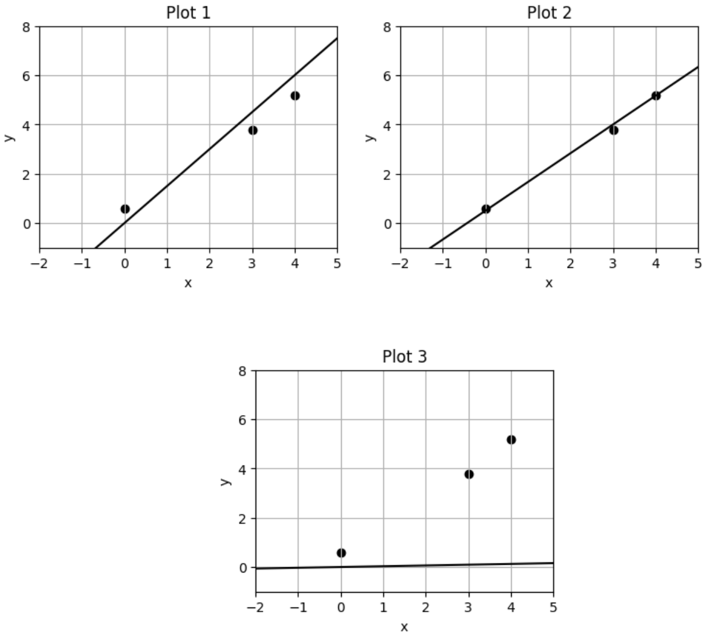

# Practice 8

**1. One Answer**

Saket is building a classification model from a dataset with two classes of student reactions to the jokes he makes during section: Funny jokes (F) and Dull Jokes (D). The probability of a randomly selected joke being funny is 0.3. The probability the model makes the correct classification given that the joke is dull is 0.7, and the probability the model makes the correct classification given that a joke is funny is 0.2. What is the probability that a randomly selected joke is dull given that it has been classified as dull?

*   (a) $\frac{42}{73}$
*   (b) $\frac{49}{73}$
*   (c) $\frac{21}{73}$
*   (d) 1

**2. One Answer**

Suppose we train a model $f(x) = x^T \hat{w}$ on dataset $\mathcal{D} = \{x_i, y_i\}_{i=1}^n$, by optimizing the following objective:

$$\hat{w} = \arg \min_w \sum_{i=1}^n (x_i^T w - y_i)^2 + \log k ||w||_2^2$$

for $k > 1$. As $k$ increases, what likely happens to the variance of our model?

*   (a) The variance of our model increases.
*   (b) The variance of our model decreases.
*   (c) The variance of our model remains unaffected.
*   (d) The variance of our model does not change in a predictable way.

**3. One Answer**

You are building a classification model for your favorite soccer team to determine whether a penalty kick will result in a goal or not, and your data set contains 300 positive examples (resulted in a goal) and 200 negative examples (did not result in a goal). After training, you find that your model has an accuracy of 70% and misclassifies 15% of negative examples as positive. What is the probability that your model will misclassify a positive example as negative?

*   (a) 15%
*   (b) 24%
*   (c) 30%
*   (d) 40%
*   (e) Cannot be determined.

**4. One Answer**

When using the least squares method for linear regression, outliers would have a minimal impact since the least squares method averages out their effects.

*   (a) True
*   (b) False

**5. Select All That Apply**

In the standard MLE derivation for a parameter in a probability distribution (like the ones we saw in class), why do we apply the logarithm to our equation?

*   (a) The function is monotonically increasing and therefore does not change the result of our optimization objective.
*   (b) The function is concave and therefore does not change the result of our optimization objective.
*   (c) The function is monotonically decreasing and therefore allows us to change our "argmax" to an "argmin."
*   (d) Applying the logarithm allows us to convert products ($\Pi$) into sums ($\Sigma$), letting us calculate derivatives easier.

**6. One Answer**

After training a model, your model has a low train error and a high test error. Which of the following can be inferred?

*   (a) The model is underfitting.
*   (b) The model will generalize well because it has low bias.
*   (c) Training on more data will likely increase the model's performance on unseen data.
*   (d) Training on more highly-informative features will decrease the test error.
*   (e) Reducing model complexity will reduce the irreducible error.

**7. One Answer**

Given the following Hessian Matrix, which of the following could be the original $f(x,y)$ function?

$$H_f(x, y) = \begin{bmatrix} 2\ln(y) + y^2e^{xy} & \frac{2x}{y} + e^{xy}(1+xy) \\ \frac{2x}{y} + e^{xy}(1+xy) & -\frac{x^2}{y^2} + x^2e^{xy} - 6y \end{bmatrix}$$

*   (a) $f(x,y) = x^2 \ln(y) + e^{xy} - y^3$
*   (b) $f(x,y) = x^2 \ln(y) + e^{x+y} - y^3$
*   (c) $f(x,y) = x^3 \ln(y) + e^{xy} - y^3$
*   (d) $f(x,y) = x^2 \ln(y) + e^{xy} - y^4$

**8. Select All That Apply**

Saket did not pay attention during lecture and did not split the data into a training set and testing set and instead used all the data to train and test a given model. What is the consequence of not splitting the data into a training set and testing set?

*   (a) Nothing, Saket knows what he is doing
*   (b) The model may overfit and perform poorly on unseen data
*   (c) The model may underfit and perform poorly on unseen data
*   (d) Saket will overestimate the performance of his model on unseen data

**9. One Answer**

Suppose you are designing a model that predicts whether or not a patient will be readmitted into a hospital within a month. The hospital provides a dataset with 25 clinical features per patient (like age, gender, and blood pressure), but not all of them might be relevant to readmission. The data is such that it's possible to draw a straight line (or a higher-dimensional hyperplane) that perfectly divides the patients who were readmitted from those who were not. Which is the most appropriate choice of procedure to train a model in this scenario?

*   (a) train an L1 regularized Logistic Regression, then retrain with unregularized Logistic Regression
*   (b) train an L2 regularized Logistic Regression, then retrain with unregularized Logistic Regression
*   (c) train an L1 regularized Logistic Regression, then retrain with L2 regularized Logistic Regression
*   (d) train an L1 regularized Logistic Regression

**10.**

Describe a problem that might occur if you're training a Logistic Regression model and the data is linearly separable. Around 1-3 sentences.

**11. One Answer**

Suppose we standardize a given dataset. The optimal bias term will be 0 in least-squares linear regression.

*   (a) True
*   (b) False

**12. One Answer**

Let $f,g: \mathbb{R} \to \mathbb{R}$ be convex. Which of the following functions is always convex?

*   (a) $h(x) = f(x) \cdot g(x)$
*   (b) $h(x) = f \circ g(x)$
*   (c) $h(x) = \min(f(x), g(x))$
*   (d) $h(x) = \max(f(x), g(x))$

**13. One Answer**

Given a small enough learning rate, gradient descent will converge to the global minima.

*   (a) True
*   (b) False

**14.**

This is the equation for the bias-variance tradeoff. $\eta$ is the "squared-error-optimal" predictor. $D$ is a dataset $\{(x_i, y_i)\}_{i=1}^n$ sampled from $P_{XY}$. $\hat{f}_D \in F$ is the learned least-squares predictor for some function class $F$.

Which terms correspond with which concepts? Write the number of the term next to the concept you think it corresponds with.

$$E_{Y|X}[E_D[(Y - \hat{f}_D(x))^2]|X = x] = E_{Y|X}[(Y - \eta(x))^2|X = x]$$

**Term 1:** $E_{Y|X}[(Y - \eta(x))^2|X = x]$

**Term 2:** $+ (\eta(x) - E_D[\hat{f}_D(x)])^2$

**Term 3:** $+ E_D[(E_D[\hat{f}_D(x)] - \hat{f}_D(x))^2]$

**Variance:** _____

**Bias:** _____

**Irreducible error:** _____

**15. One Answer**

Which of the following is an advantage of using ridge regression over unregularized linear regression?

*   (a) The ridge objective is concave
*   (b) The ridge objective is convex
*   (c) The ridge objective always has a unique solution
*   (d) The ridge objective has a closed-form solution

**16. One Answer**

True/False: Lasso Regression uses the square of the L2 norm while Ridge Regression uses the L1 Norm.

*   (a) True
*   (b) False

**17. One Answer**

You have independent random variables $X, Y$ such that $X \sim N(1,2)$ and $Y \sim N(3,4)$. What is $\text{Var}(5X+6Y+7)$?

*   (a) 35
*   (b) 34
*   (c) 195
*   (d) 194
*   (e) Cannot be determined

**18. One Answer**

The objective function is $L(w) = ||Xw-Y||_2^2$. What is the gradient of $L(w)$ with respect to $w$?

*   (a) $2Y^T (Xw - Y)$
*   (b) $2X^T(X^T Xw - Y)$
*   (c) $2X^T (Xw - Y)$
*   (d) $2Y^T (X^T Xw - Y)$

**19. One Answer**

Which of the following is true, when choosing to use Maximum Likelihood Estimation (MLE)?

*   (a) MLE cannot be used if we do not know the exact distribution of our data.
*   (b) MLE works well for any data distribution, so we do need knowledge of the true distribution.
*   (c) MLE will produce unbiased estimates regardless of the data distribution or the likelihood function that we choose
*   (d) MLE works even if the true distribution of our data isn't known. We can make an educated guess for the distribution of our data for our likelihood function.

**20. One Answer**

Consider the function $f(a) = 5a^2 - 3a + 2$. You want to use gradient descent to find the unique minimum, which you know is at $a_* = 0.3$. If at time $t$ you arrive at the point $a_t = 3$, what value for the step size would bring you to $a_*$ at time $t+1$?

*   (a) 0.001
*   (b) 0.01
*   (c) 0.1
*   (d) 1

**21. One Answer**

Donovan is training some machine learning model, and is telling you about it. He needed to standardize the data, so he computed the mean and standard deviation of each feature in the entire dataset $X$ and applied the transformation correctly. He then created non-overlapping subsets of $X$ called $X_{train}$, $X_{validation}$, and $X_{test}$. To train, validate, and test their model respectively. In this setup, was there train/test leakage?

*   (a) Yes
*   (b) No

**22.**

The following plots show 3 data points and 3 models. The data is the same for all 3 models. Match the learned model to the equation used for linear regression.

$\hat{w} = (X^T X + \lambda I)^{-1} X^T y$. Plot number: _____ (for $\lambda > 0$)

$\hat{w} = (X^T X)^{-1} X^T y$. Plot number: _____

$\hat{w} = (\tilde{X}^T \tilde{X})^{-1} \tilde{X}^T y$, where $\tilde{X} = [X \quad \vec{1}]$. Plot number: _____

**23. One Answer**

True/False: The training error is a better estimate of the true error than the cross-validation error.

*   (a) True
*   (b) False

**24. Select All That Apply**

Let $f: \mathbb{R} \to \mathbb{R}$ be a continuous, smooth function whose derivative $f'(x)$ is also continuous. Suppose $f$ has a unique global minimum $x^* \in (-\infty, \infty)$, and you are using gradient descent to find $x^*$. You fix some $x^{(0)} \in \mathbb{R}$ and step size $\eta > 0$, and run $x^{(t)} = x^{(t-1)} - \eta f'(x^{(t-1)})$ repeatedly. Which of the following statements are true?

*   (a) Gradient descent is sure to converge, to some value, for any step size $\eta > 0$.
*   (b) If $f$ has a local minimum $x'$ different from the global one, i.e., $x' \neq x^*$, and $x^{(t)} = x'$ for some $t$, gradient descent will not converge to $x^*$.
*   (c) Assuming gradient descent converges, it converges to $x^*$ if and only if $f$ is convex.
*   (d) If, additionally, $f$ is the objective function of logistic regression, and gradient descent converges, then it converges to $x^*$.

**25.**

What is the tradeoff between the size of the validation set and the size of the training set? Around 1-3 sentences.

**26.**

Consider $X \in \mathbb{R}^{n \times d}$ and $y \in \mathbb{R}^n$. Suppose $\hat{w} = \arg \min_w \|Xw - y\|_2$ has a unique solution. Fill in the blank for the following vector spaces. Write NA if the there is not enough information to determine the answer.

Col(X) = _____

Row(X) = _____

Null(X) = _____

**27.**

For a function $f: \mathbb{R}^n \to \mathbb{R}$ where $f(x, y, z) = xy + x^2 \ln(z) + e^{yz}$. Calculate the gradient of $f$.

**Gradient =**

**28.**

Describe a scenario where one would choose to use Ridge regression over Lasso regression. Around 1-4 sentences.

**29.**

Answer the following questions about the Softmax function.

**(a) Explain how the Softmax function transforms an input vector (logits) and why it is suitable for multi-class classification.**

**(b) Suppose a model outputs the following values/logits for a 3-class classification problem.**

$z = [2, 1, 5]$

**Compute the softmax probabilities. You can leave the values in terms of exponentiated numbers.**

**Softmax(z) = [ , , ]**
