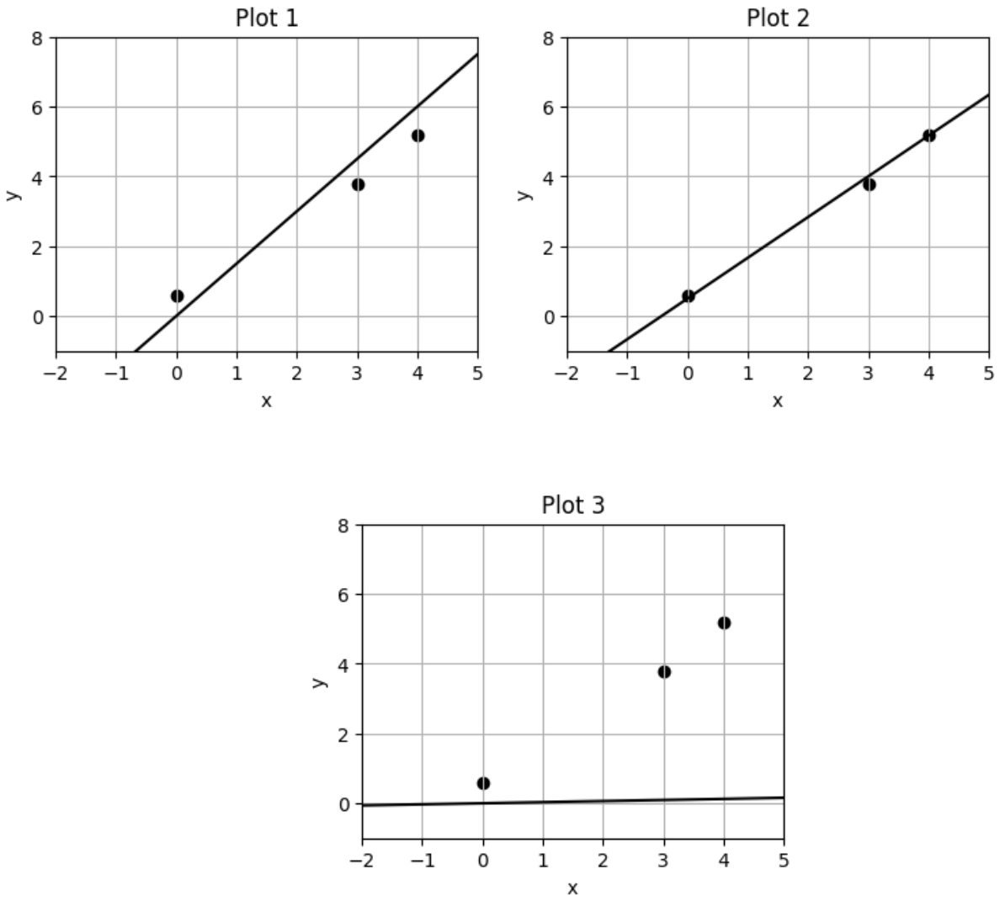

# Practice 8 Solutions

**Problem 1. One Answer**

Saket is building a classification model from a dataset with two classes of student reactions to the jokes he makes during section: Funny jokes (F) and Dull Jokes (D). The probability of a randomly selected joke being funny is 0.3. The probability the model makes the correct classification given that the joke is dull is 0.7, and the probability the model makes the correct classification given that a joke is funny is 0.2. What is the probability that a randomly selected joke is dull given that it has been classified as dull?

*   (a) $\frac{42}{73}$
*   (b) $\frac{49}{73}$
*   (c) $\frac{21}{73}$
*   (d) 1

**Correct answers:** (b)

**Explanation:** The answer is (b), which is $\frac{49}{73}$. 

Let A be the event that the sample is dull.

Let B be the event that the sample is classified as dull. 

We have $P(A^c) = 0.3$ and $P(A) = 1 - P(A^c) = 1 - 0.3 = 0.7$. We have $P(B|A) = 0.7$ and $P(B^c|A^c) = 0.2$. (Note that $P(B|A^c) = 1 - P(B^c|A^c) = 1 - 0.2 = 0.8$) 

We want to calculate $P(A|B)$ here using Bayes Rule and the Law of Total Probability. 

$P(B) = P(B|A)P(A) + P(B|A^c)P(A^c) = 0.7 \cdot 0.7 + 0.8 \cdot 0.3 = 0.73$ $P(A|B) = \frac{P(B|A)P(A)}{P(B)} = \frac{0.7 \cdot 0.7}{0.73} = \frac{0.49}{0.73} = \frac{49}{73}$

Here, our answer is $P(A|B) = \frac{49}{73}$, which is (b).

**Problem 2. One Answer**

Suppose we train a model $f(x) = x^T \hat{w}$ on dataset $\mathcal{D} = \{x_i, y_i\}_{i=1}^n$, by optimizing the following objective:

$$\hat{w} = \arg \min_w \sum_{i=1}^n (x_i^T w - y_i)^2 + \log k ||w||_2^2$$

for $k > 1$. As $k$ increases, what likely happens to the variance of our model?

*   (a) The variance of our model increases.
*   (b) The variance of our model decreases.
*   (c) The variance of our model remains unaffected.
*   (d) The variance of our model does not change in a predictable way.

**Correct answers:** (a)

**Explanation:**

**This question tests understanding of regularization** and its effect on model variance.

**Why (a) is correct:**

**As $k$ increases, the penalty term $\log k ||w||_2^2$ approaches zero:**

**1. Mathematical analysis:**
- **Penalty term:** $\log k ||w||_2^2$
- **As $k \to \infty$:** $\log k \to \infty$, but $\log k$ grows very slowly
- **Effectively:** Penalty becomes negligible
- **Model approaches** unregularized linear regression

**2. Variance implications:**
- **Less regularization** = less constraint on weights
- **Weights can take** larger values
- **Model becomes** more flexible/complex
- **Higher variance** due to increased model capacity

**3. Why other options are incorrect:**

**Option (b): Variance decreases**
- **Contradicts** the effect of reducing regularization
- **Less regularization** typically increases variance
- **Wrong direction**

**Option (c): Variance unaffected**
- **Regularization** directly affects model variance
- **Changing penalty** must affect variance
- **Not realistic**

**Option (d): Unpredictable change**
- **Regularization** has predictable effects on variance
- **Well-understood** relationship
- **Not unpredictable**

**Key insight:** **Reducing regularization** (increasing $k$) **increases model variance** by allowing weights to take larger values.

---

**Problem 3. One Answer**

You are building a classification model for your favorite soccer team to determine whether a penalty kick will result in a goal or not, and your data set contains 300 positive examples (resulted in a goal) and 200 negative examples (did not result in a goal). After training, you find that your model has an accuracy of 70% and misclassifies 15% of negative examples as positive. What is the probability that your model will misclassify a positive example as negative?

*   (a) 15%
*   (b) 24%
*   (c) 30%
*   (d) 40%
*   (e) Cannot be determined.

**Correct answers:** (d)

**Explanation:** We have 500 examples in total, and $500 * 70\% = 350$ were correctly classified. The rest (150) were incorrectly classified. We also know that $200 * 15\% = 30$ negative examples were misclassified. This leaves us with $150 - 30 = 120$ misclassified examples, and we know these must all be positive examples that were misclassified. This means that $\frac{120}{300} = \frac{2}{5} = 40\%$ of positive examples were misclassified as negative.

**Problem 4. One Answer**

When using the least squares method for linear regression, outliers would have a minimal impact since the least squares method averages out their effects.

*   (a) True
*   (b) False

**Correct answers:** (b)

**Explanation:** Outliers would cause the regression line to skew, thus leading to a representation that may not be an accurate representation of the data.

**Problem 5. Select All That Apply**

In the standard MLE derivation for a parameter in a parameter in a probability distribution (like the ones we saw in class), why do we apply the logarithm to our equation?

*   (a) The function is monotonically increasing and therefore does not change the result of our optimization objective.
*   (b) The function is concave and therefore does not change the result of our optimization objective.
*   (c) The function is monotonically decreasing and therefore allows us to change our "argmax" to an "argmin."
*   (d) Applying the logarithm allows us to convert products ($\Pi$) into sums ($\Sigma$), letting us calculate derivatives easier.

**Correct answers:** (a), (d)

**Explanation:** The logarithm function is monotonically increasing, which makes (A) true and (C) false. (B) is false. the logarithm function is concave, but that is not why it doesn't change the result of our optimization. (D) is true due to properties of logarithms and derivatives.

**Problem 6. One Answer**

After training a model, your model has a low train error and a high test error. Which of the following can be inferred?

*   (a) The model is underfitting.
*   (b) The model will generalize well because it has low bias.
*   (c) Training on more data will likely increase the model's performance on unseen data.
*   (d) Training on more highly-informative features will decrease the test error.
*   (e) Reducing model complexity will reduce the irreducible error.

**Correct answers:** (c)

**Explanation:** A is incorrect since the model has a low, not high, bias. B is also incorrect since a low bias alone doesn't guarantee that the model will generalize to unseen data. C is correct since more training data generally decreases the variance. D is incorrect since increasing model complexity by increasing the number of features in the dataset will likely increase the variance. E is incorrect since irreducible error comes from underlying noise in the dataset and changing any factor of the model will not change this error.

**Problem 7. One Answer**

Given the following Hessian Matrix, which of the following could be the original $f(x,y)$ function?

$$H_f(x, y) = \begin{bmatrix} 2\ln(y) + y^2e^{xy} & \frac{2x}{y} + e^{xy}(1+xy) \\ \frac{2x}{y} + e^{xy}(1+xy) & -\frac{x^2}{y^2} + x^2e^{xy} - 6y \end{bmatrix}$$

*   (a) $f(x,y) = x^2 \ln(y) + e^{xy} - y^3$
*   (b) $f(x,y) = x^2 \ln(y) + e^{x+y} - y^3$
*   (c) $f(x,y) = x^3 \ln(y) + e^{xy} - y^3$
*   (d) $f(x,y) = x^2 \ln(y) + e^{xy} - y^4$

**Correct answers:** (a)

**Explanation:** Option A. Take the second derivative for all 4 $\partial^2x$, $\partial^2y$, $\partial yx$, $\partial xy$ and you will get option a matches.

**Problem 8. Select All That Apply**

Saket did not pay attention during lecture and did not split the data into a training set and testing set and instead used all the data to train and test a given model. What is the consequence of not splitting the data into a training set and testing set?

*   (a) Nothing, Saket knows what he is doing
*   (b) The model may overfit and perform poorly on unseen data
*   (c) The model may underfit and perform poorly on unseen data
*   (d) Saket will overestimate the performance of his model on unseen data

**Correct answers:** (b), (d)

**Explanation:** Choice B and D. If we do not split the data into a training set and testing set, then the model will test on seen data. thus resulting in overfitting and a lower error rate than intended. So the performance is not going to be as expected.

**Problem 9. One Answer**

Suppose you are designing a model that predicts whether or not a patient will be readmitted into a hospital within a month. The hospital provides a dataset with 25 clinical features per patient (like age, gender, and blood pressure), but not all of them might be relevant to readmission. The data is such that it's possible to draw a straight line (or a higher-dimensional hyperplane) that perfectly divides the patients who were readmitted from those who were not. Which is the most appropriate choice of procedure to train a model in this scenario?

*   (a) train an L1 regularized Logistic Regression, then retrain with unregularized Logistic Regression
*   (b) train an L2 regularized Logistic Regression, then retrain with unregularized Logistic Regression
*   (c) train an L1 regularized Logistic Regression, then retrain with L2 regularized Logistic Regression
*   (d) train an L1 regularized Logistic Regression

**Correct answers:** (c)

**Explanation:** Train with L1 first, for feature selection. And then retrain with L2 regularization. L2 regularization is required an unregularized model will overfit linearly separable data.

**Problem 10.**

Describe a problem that might occur if you're training a Logistic Regression model and the data is linearly separable. Around 1-3 sentences.

**Explanation:** The model will overfit extremely as the magnitudes of the weights increase towards infinity.

**Problem 11. One Answer**

Suppose we standardize a given dataset. The optimal bias term will be 0 in least-squares linear regression.

*   (a) True
*   (b) False

**Correct answers:** (b)

**Explanation:** The offset is the average y value.

**Problem 12. One Answer**

Let $f,g: \mathbb{R} \to \mathbb{R}$ be convex. Which of the following functions is always convex?

*   (a) $h(x) = f(x) \cdot g(x)$
*   (b) $h(x) = f \circ g(x)$
*   (c) $h(x) = \min(f(x), g(x))$
*   (d) $h(x) = \max(f(x), g(x))$

**Correct answers:** (d)

**Explanation:** Pointwise maximum preserves convexity (see section 5)

**Problem 13. One Answer**

Given a small enough learning rate, gradient descent will converge to the global minima.

*   (a) True
*   (b) False

**Correct answers:** (b)

**Explanation:** This is false because non-convex functions can have multiple local minima / saddle points and GD may converge to one of those.

**Problem 14.**

This is the equation for the bias-variance tradeoff. $\eta$ is the "squared-error-optimal" predictor. $D$ is a dataset $\{(x_i, y_i)\}_{i=1}^n$ sampled from $P_{XY}$. $\hat{f}_D \in F$ is the learned least-squares predictor for some function class $F$.

Which terms correspond with which concepts? Write the number of the term next to the concept you think it corresponds with.

$$E_{Y|X}[E_D[(Y - \hat{f}_D(x))^2]|X = x] = E_{Y|X}[(Y - \eta(x))^2|X = x]$$

**Term 1:** $E_{Y|X}[(Y - \eta(x))^2|X = x]$

**Term 2:** $+ (\eta(x) - E_D[\hat{f}_D(x)])^2$

**Term 3:** $+ E_D[(E_D[\hat{f}_D(x)] - \hat{f}_D(x))^2]$

**Variance:** _____

**Bias:** _____

**Irreducible error:** _____

**Explanation:** Variance: term 3. Bias: term 2 Irreducible error: term 1.

**Problem 15. One Answer**

Which of the following is an advantage of using ridge regression over unregularized linear regression?

*   (a) The ridge objective is concave
*   (b) The ridge objective is convex
*   (c) The ridge objective always has a unique solution
*   (d) The ridge objective has a closed-form solution

**Correct answers:** (c)

**Explanation:** (a) Ridge objective is not concave (b) Unregularized linear regression objective is convex as well. (c) Unregularized linear regression does not always have a unique solution, L2 penalty fixes this. (d) Unregularized linear regression has a closed form solution as well

**Problem 16. One Answer**

True/False: Lasso Regression uses the square of the L2 norm while Ridge Regression uses the L1 Norm.

*   (a) True
*   (b) False

**Correct answers:** (b)

**Explanation:**

**This question tests understanding of Lasso vs Ridge regression** and their regularization penalties.

**Why (b) is correct:**

**The statement is FALSE - it has the penalties backwards:**

**1. Lasso Regression:**
- **Uses L1 norm:** $||w||_1 = \sum_{i=1}^{d} |w_i|$
- **Creates sparsity** by setting coefficients to exactly zero
- **Feature selection** capability

**2. Ridge Regression:**
- **Uses L2 norm squared:** $||w||_2^2 = \sum_{i=1}^{d} w_i^2$
- **Shrinks coefficients** toward zero but rarely to exactly zero
- **Prevents overfitting** without feature selection

**3. Mathematical comparison:**

**Lasso objective:**
$\min_w \sum_{i=1}^{n} (y_i - x_i^T w)^2 + \lambda ||w||_1$

**Ridge objective:**
$\min_w \sum_{i=1}^{n} (y_i - x_i^T w)^2 + \lambda ||w||_2^2$

**4. Key differences:**
- **Lasso:** L1 penalty, sparse solutions
- **Ridge:** L2 penalty, dense solutions
- **Different optimization** properties
- **Different use cases**

**Key insight:** **Lasso uses L1 norm, Ridge uses L2 norm squared** - the statement has them reversed.

---

**Problem 17. One Answer**

You have independent random variables $X, Y$ such that $X \sim N(1,2)$ and $Y \sim N(3,4)$. What is $\text{Var}(5X+6Y+7)$?

*   (a) 35
*   (b) 34
*   (c) 195
*   (d) 194
*   (e) Cannot be determined

**Correct answers:** (d)

**Explanation:** Because the variables are independent, $\text{Var}(5X+6Y+7)= \text{Var}(5X) + \text{Var}(6Y) + \text{Var}(7)$. The variance of a constant is 0, so we remove that term to get $\text{Var}(5X) + \text{Var}(6Y)$. Moving a coefficient outside of the variance function squares it. So we have $25\text{Var}(X) + 36\text{Var}(Y)$. We plug in the given variances for $X$ and $Y$ to get $25 \cdot 2 + 36 \cdot 4 = 194$

**Problem 18. One Answer**

The objective function is $L(w) = ||Xw-Y||_2^2$. What is the gradient of $L(w)$ with respect to $w$?

*   (a) $2Y^T (Xw - Y)$
*   (b) $2X^T(X^T Xw - Y)$
*   (c) $2X^T (Xw - Y)$
*   (d) $2Y^T (X^T Xw - Y)$

**Correct answers:** (c)

**Explanation:** $\nabla_w ||Xw - Y||_2^2 = \nabla_w ((Xw - Y)^T (Xw - Y))$ $= \nabla_w ((w^T X^T - Y^T)(Xw - Y))$ $= \nabla_w (w^T X^T Xw - Y^T Xw - w^T X^T Y + Y^T Y)$ $= 2X^T Xw - X^T Y - X^T Y + 0$ $= 2X^T (Xw - Y)$

**Problem 19. One Answer**

Which of the following is true, when choosing to use Maximum Likelihood Estimation (MLE)?

*   (a) MLE cannot be used if we do not know the exact distribution of our data.
*   (b) MLE works well for any data distribution, so we do need knowledge of the true distribution.
*   (c) MLE will produce unbiased estimates regardless of the data distribution or the likelihood function that we choose
*   (d) MLE works even if the true distribution of our data isn't known. We can make an educated guess for the distribution of our data for our likelihood function.

**Correct answers:** (d)

**Explanation:** We often use MLE in situations where the true distribution of the data is not known. In MLE, we construct a likelihood function based on this chosen distribution and find the parameter values that maximize the probability of observing our data. While ideal to know the true distribution, MLE enables estimation through an educated guess, though the accuracy of the estimates depends on the appropriateness of our chosen distribution.

**Problem 20. One Answer**

Consider the function $f(a) = 5a^2 - 3a + 2$. You want to use gradient descent to find the unique minimum, which you know is at $a_* = 0.3$. If at time $t$ you arrive at the point $a_t = 3$, what value for the step size would bring you to $a_*$ at time $t+1$?

*   (a) 0.001
*   (b) 0.01
*   (c) 0.1
*   (d) 1

**Correct answers:** (c)

**Explanation:** Following the standard gradient descent update formula, we get $0.3 = 3 - \eta \cdot \nabla f(a)$. $\nabla f(a) = 10a - 3$, so $\nabla f(3) = 27$. Plugging this in, we get $0.3 = 3 - \eta \cdot 27$. Solving this equation, we get $\eta = 0.1$.

**Problem 21. One Answer**

Donovan is training some machine learning model, and is telling you about it. He needed to standardize the data, so he computed the mean and standard deviation of each feature in the entire dataset $X$ and applied the transformation correctly. He then created non-overlapping subsets of $X$ called $X_{train}$, $X_{validation}$, and $X_{test}$. To train, validate, and test their model respectively. In this setup, was there train/test leakage?

*   (a) Yes
*   (b) No

**Correct answers:** (a)

**Explanation:** They standardized the whole dataset using information from the test set (as it is a subset of $X$), and this is a form of train/test leakage.

**Problem 22.**

The following plots show 3 data points and 3 models. The data is the same for all 3 models. Match the learned model to the equation used for linear regression.

$\hat{w} = (X^T X + \lambda I)^{-1} X^T y$. Plot number: 3 (for $\lambda > 0$)

$\hat{w} = (X^T X)^{-1} X^T y$. Plot number: 1

$\hat{w} = (\tilde{X}^T \tilde{X})^{-1} \tilde{X}^T y$, where $\tilde{X} = [X \quad \vec{1}]$. Plot number: 2

**Explanation:** $\hat{w} = (X^T X + \lambda I)^{-1} X^T y$: plot 3, because it is overregularized.

**Problem 23. One Answer**

True/False: The training error is a better estimate of the true error than the cross-validation error.

*   (a) True
*   (b) False

**Correct answers:** (b)

**Explanation:**

**This question tests understanding of cross-validation** and its advantages over training error.

**Why (b) is correct:**

**Cross-validation error is a better estimate of true error than training error:**

**1. Training error issues:**
- **Optimistic bias** - model has seen all training data
- **Doesn't reflect** generalization performance
- **Can be misleading** for model selection
- **Overfitting** not detected

**2. Cross-validation advantages:**
- **Uses unseen data** for evaluation
- **Better estimate** of generalization performance
- **More realistic** performance assessment
- **Detects overfitting** patterns

**3. Mathematical intuition:**
- **Training error:** $E_{\text{train}} = \frac{1}{n} \sum_{i=1}^{n} L(y_i, \hat{f}(x_i))$
- **CV error:** $E_{\text{CV}} = \frac{1}{k} \sum_{j=1}^{k} E_{\text{val}}^{(j)}$
- **CV error** closer to true generalization error
- **Training error** underestimates true error

**4. Why (a) is incorrect:**
- **Training error** is overly optimistic
- **Doesn't account** for overfitting
- **Poor estimate** of true performance
- **CV error** is more reliable

**Key insight:** **Cross-validation error** provides **better estimates** of true generalization performance than **training error**.

---

**Problem 24. Select All That Apply**

Let $f: \mathbb{R} \to \mathbb{R}$ be a continuous, smooth function whose derivative $f'(x)$ is also continuous. Suppose $f$ has a unique global minimum $x^* \in (-\infty, \infty)$, and you are using gradient descent to find $x^*$. You fix some $x^{(0)} \in \mathbb{R}$ and step size $\eta > 0$, and run $x^{(t)} = x^{(t-1)} - \eta f'(x^{(t-1)})$ repeatedly. Which of the following statements are true?

*   (a) Gradient descent is sure to converge, to some value, for any step size $\eta > 0$.
*   (b) If $f$ has a local minimum $x'$ different from the global one, i.e., $x' \neq x^*$, and $x^{(t)} = x'$ for some $t$, gradient descent will not converge to $x^*$.
*   (c) Assuming gradient descent converges, it converges to $x^*$ if and only if $f$ is convex.
*   (d) If, additionally, $f$ is the objective function of logistic regression, and gradient descent converges, then it converges to $x^*$.

**Correct answers:** (b), (d)

**Explanation:** A is false because for a large enough step size, gradient descent may not converge. B is correct because $f'(x') = 0$, so gradient descent will never move from a local minimum. C is false because you could "accidentally" initialize GD at $x^*$ even if $f$ is non-convex. D is correct because the objective of logistic regression is convex.

**Problem 25.**

What is the tradeoff between the size of the validation set and the size of the training set? Around 1-3 sentences.

**Explanation:**

**This question tests understanding of validation set sizing** and the trade-off with training data.

**Why this trade-off exists:**

**1. Larger validation set benefits:**
- **Better estimate** of model performance
- **More reliable** performance assessment
- **Reduced variance** in error estimates
- **More confidence** in model selection

**2. Larger validation set costs:**
- **Less training data** available
- **Reduced model capacity** to learn
- **Potential underfitting** due to insufficient training data
- **Worse model performance** due to data scarcity

**3. Mathematical intuition:**
- **Total data:** $N = N_{\text{train}} + N_{\text{val}}$
- **Larger $N_{\text{val}}$** = smaller $N_{\text{train}}$
- **Validation error variance:** $\propto \frac{1}{N_{\text{val}}}$
- **Training error variance:** $\propto \frac{1}{N_{\text{train}}}$

**4. Optimal balance:**
- **Typical split:** 70-80% training, 20-30% validation
- **Depends on** dataset size and model complexity
- **Cross-validation** can help with small datasets
- **Domain knowledge** guides optimal split

**Key insight:** **Validation set size** trades **estimation accuracy** against **training data availability** - larger validation sets provide better performance estimates but reduce training data.

---

**Problem 26.**

Consider $X \in \mathbb{R}^{n \times d}$ and $y \in \mathbb{R}^n$. Suppose $\hat{w} = \arg \min_w \|Xw - y\|_2$ has a unique solution. Fill in the blank for the following vector spaces. Write NA if the there is not enough information to determine the answer.

Col(X) = NA

Row(X) = $\mathbb{R}^d$

Null(X) = $\{0\}$

**Explanation:**

**This question tests understanding of linear algebra** and matrix properties in linear regression.

**Why these answers are correct:**

**1. Unique solution implies full rank:**
- **$\hat{w} = \arg \min_w \|Xw - y\|_2$** has unique solution
- **$X$ must be full rank** (rank = $d$)
- **$n \geq d$** (more data points than features)
- **No linear dependencies** in columns

**2. Row space analysis:**
- **Row(X) = $\mathbb{R}^d$** because $X$ is full rank
- **All $d$ rows** are linearly independent
- **Row space spans** entire $\mathbb{R}^d$ space
- **No missing dimensions**

**3. Null space analysis:**
- **Null(X) = $\{0\}$** because $X$ is full rank
- **Only zero vector** maps to zero
- **No non-trivial** solutions to $Xw = 0$
- **Unique solution** guaranteed

**4. Column space analysis:**
- **Col(X) = NA** because $n \geq d$ but not necessarily $n = d$
- **Column space** is a subspace of $\mathbb{R}^n$
- **Cannot guarantee** it spans entire $\mathbb{R}^n$
- **Depends on** specific values in $X$

**Key insight:** **Full rank matrix** with **unique solution** determines **row space** and **null space**, but **column space** depends on **data dimensions**.

---

**Problem 27.**

For a function $f: \mathbb{R}^n \to \mathbb{R}$ where $f(x, y, z) = xy + x^2 \ln(z) + e^{yz}$. Calculate the gradient of $f$.

**Gradient =**

**Explanation:**

**This question tests understanding of gradient computation** for multivariate functions.

**Step-by-step gradient calculation:**

**1. Function breakdown:**
$f(x, y, z) = xy + x^2 \ln(z) + e^{yz}$

**2. Partial derivatives:**

**$\frac{\partial f}{\partial x}$:**
- **$xy$ term:** $\frac{\partial}{\partial x}(xy) = y$
- **$x^2 \ln(z)$ term:** $\frac{\partial}{\partial x}(x^2 \ln(z)) = 2x \ln(z)$
- **$e^{yz}$ term:** $\frac{\partial}{\partial x}(e^{yz}) = 0$
- **Total:** $y + 2x \ln(z)$

**$\frac{\partial f}{\partial y}$:**
- **$xy$ term:** $\frac{\partial}{\partial y}(xy) = x$
- **$x^2 \ln(z)$ term:** $\frac{\partial}{\partial y}(x^2 \ln(z)) = 0$
- **$e^{yz}$ term:** $\frac{\partial}{\partial y}(e^{yz}) = z e^{yz}$
- **Total:** $x + z e^{yz}$

**$\frac{\partial f}{\partial z}$:**
- **$xy$ term:** $\frac{\partial}{\partial z}(xy) = 0$
- **$x^2 \ln(z)$ term:** $\frac{\partial}{\partial z}(x^2 \ln(z)) = \frac{x^2}{z}$
- **$e^{yz}$ term:** $\frac{\partial}{\partial z}(e^{yz}) = y e^{yz}$
- **Total:** $\frac{x^2}{z} + y e^{yz}$

**3. Gradient vector:**
$$\nabla f(x, y, z) = \begin{pmatrix} y + 2x \ln(z) \\ x + z e^{yz} \\ \frac{x^2}{z} + y e^{yz} \end{pmatrix}$$

**Key insight:** **Gradient computation** requires **partial derivatives** with respect to each variable, treating other variables as constants.

---

**Problem 28.**

Describe a scenario where one would choose to use Ridge regression over Lasso regression. Around 1-4 sentences.

**Explanation:**

**This question tests understanding of Ridge vs Lasso regression** and when to choose each.

**Why Ridge regression is preferred in certain scenarios:**

**1. When all features are important:**
- **Ridge keeps all features** with reduced coefficients
- **Lasso removes features** by setting coefficients to zero
- **Feature preservation** is crucial in some domains
- **Domain knowledge** indicates all features matter

**2. High-dimensional data with correlations:**
- **Gene expression data** - many related genes
- **Financial data** - correlated market indicators
- **Image features** - correlated pixel values
- **Ridge handles correlations** better than Lasso

**3. More features than data points ($d > n$):**
- **Ridge provides unique solutions** even when $d > n$
- **Lasso may not work** well in this regime
- **Regularization** prevents overfitting
- **Stable solutions** guaranteed

**4. When interpretability is less important:**
- **Ridge provides dense solutions** (all coefficients non-zero)
- **Lasso provides sparse solutions** (some coefficients zero)
- **Feature selection** not the primary goal
- **Prediction accuracy** is priority

**Key insight:** **Ridge regression** is preferred when **feature preservation** and **handling correlations** are more important than **feature selection**.

---

**Problem 29.**

Answer the following questions about the Softmax function.

**(a) Explain how the Softmax function transforms an input vector (logits) and why it is suitable for multi-class classification.**

**Explanation:** The Softmax function transforms an input vector into a probability distribution over $K$ classes by exponentiating each term and dividing it by the sum of all the exponentiated values in the vector.

$$\text{softmax}(z)_i = \frac{e^{z_i}}{\sum_{j=1}^K e^{z_j}}$$

This is helpful for multiclass classification tasks because it shows the model's uncertainty over multiple classes in a normalized way.

**(b) Suppose a model outputs the following values/logits for a 3-class classification problem.**

$z = [2, 1, 5]$

**Compute the softmax probabilities. You can leave the values in terms of exponentiated numbers.**

**Softmax(z) = [ , , ]**

**Explanation:** $\sum_{j=1}^K e^{z_j} = e^2 + e^1 + e^5$

**Softmax(z) = $\left[ \frac{e^2}{e^2+e^1+e^5}, \frac{e^1}{e^2+e^1+e^5}, \frac{e^5}{e^2+e^1+e^5} \right]$**
