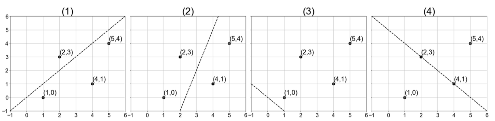
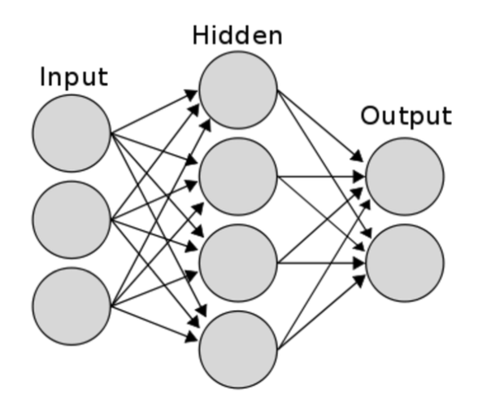
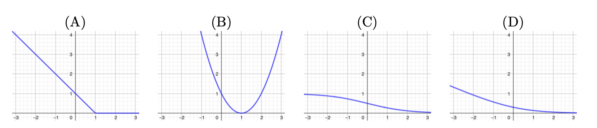
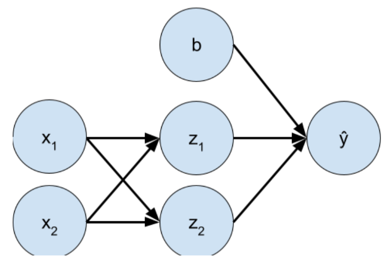

# Practice Problem Set 1 - Solutions

Consider the following matrix $X$ with four data points in $\mathbb{R}^2$. We would like to use PCA to find a rank-1 linear representation of these data.

$$
X = 
\begin{bmatrix} 
4 & 1 \\ 
5 & 4 \\ 
1 & 2 \\ 
1 & 0 
\end{bmatrix}
$$



**Figure 2:** These plots depict data points from the four-sample dataset $X$.

## Question 1
Which line in Figure 2 represents the direction of the first principal component of $X - \mu$, where $X \in \mathbb{R}^{n \times d}$ the vector $\mu \in \mathbb{R}^d$ is the featurewise mean of $X$?

(A) Plot 1  
(B) Plot 2  
(C) Plot 3  
(D) Plot 4  

**Solution:** The answer is (A).

**Explanation:** 

The first principal component is the direction of maximum variance in the data. Here's the detailed reasoning:

1. **Data Centering**: First, we subtract the mean $\mu$ from each data point to center the data around the origin. This gives us $X - \mu$.

2. **Covariance Matrix**: The covariance matrix is computed as $C = \frac{1}{n}(X - \mu)^T(X - \mu)$, where $n$ is the number of samples.

3. **Eigenvalue Decomposition**: PCA finds the eigenvectors and eigenvalues of the covariance matrix. The first principal component is the eigenvector corresponding to the largest eigenvalue.

4. **Maximum Variance Direction**: The first principal component represents the direction along which the projected data has maximum variance. This is because the variance of the projected data is given by $\text{Var}(Xv) = v^T C v$, which is maximized when $v$ is the eigenvector of $C$ with the largest eigenvalue.

5. **Visual Interpretation**: In the figure, Plot 1 shows the line that best captures the spread of the centered data points. This line represents the direction where the data varies the most, which is exactly what the first principal component represents.

Mathematically, if $v_1$ is the first principal component, then:
$$\text{Var}(Xv_1) = \max_{||v||=1} \text{Var}(Xv) = \lambda_1$$
where $\lambda_1$ is the largest eigenvalue of the covariance matrix.

## Question 2
Which of the following statements about kernels is false?

(A) Kernel feature vectors $\phi(x_i)$ can be infinite-dimensional  
(B) Kernels methods scale well to large datasets because the size of the kernel matrix does not depend on the size of the dataset  
(C) Kernel matrices store the results of inner products of the data's features computed in a higher-dimensional space  
(D) Kernels allow otherwise linear models to find non-linear decision boundaries  

**Solution:** The answer is (B).

**Explanation:**

Statement (B) is false. Here's the detailed analysis:

**Why (B) is False:**
The kernel matrix $K$ has dimensions $n \times n$ where $n$ is the number of data points. This means:
- **Memory Complexity**: $O(n^2)$ storage required
- **Computational Complexity**: $O(n^3)$ for matrix operations like inversion
- **Scaling Issue**: As dataset size grows, the kernel matrix grows quadratically, making it computationally prohibitive for large datasets

**Why the Other Statements are True:**

(A) **Infinite-dimensional feature vectors**: The RBF kernel $K(x_i, x_j) = \exp(-\gamma ||x_i - x_j||^2)$ corresponds to an infinite-dimensional feature space. This is because the Taylor expansion of the exponential function has infinitely many terms.

(C) **Kernel matrix stores inner products**: The kernel matrix is defined as $K_{ij} = \langle \phi(x_i), \phi(x_j) \rangle$, where $\phi$ is the feature mapping. This allows us to compute inner products in the high-dimensional feature space without explicitly computing $\phi(x_i)$.

(D) **Non-linear decision boundaries**: The kernel trick allows linear models (like SVM) to operate in high-dimensional feature spaces, effectively creating non-linear decision boundaries in the original input space.

**Mathematical Example:**
For a polynomial kernel of degree 2: $K(x_i, x_j) = (1 + x_i^T x_j)^2$, the feature mapping $\phi$ maps to a space of dimension $O(d^2)$, where $d$ is the input dimension.

## Question 3
Suppose you have a logistic regression model for spam detection, using a dataset with a binary outcome that indicates whether an email is spam (1) or not spam (0). The predictor variables $x_1$, $x_2$, and $x_3$ are boolean values (0 or 1) that indicate whether the email contains the words "free", "order", and "homework", respectively. The model has four parameters: weights $w_1$, $w_2$, $w_3$, and offset $b$. You find that emails containing the words "free" and "order" have a higher probability of being spam, while emails containing the word "homework" have a lower probability of being spam. Given this information, which of the following signs is most likely for the weights $w_1$, $w_2$, and $w_3$?

(A) All positive  
(B) All negative  
(C) $w_1$ and $w_2$ are positive, $w_3$ is negative  
(D) $w_1$ and $w_2$ are negative, $w_3$ is positive  

**Solution:** The answer is (C).

**Explanation:**

Let's analyze this step by step using the logistic regression model:

**Logistic Regression Model:**
The probability of an email being spam is given by:
$$P(\text{spam}) = \frac{1}{1 + e^{-(w_1 x_1 + w_2 x_2 + w_3 x_3 + b)}}$$

where:
- $x_1 = 1$ if the email contains "free", $0$ otherwise
- $x_2 = 1$ if the email contains "order", $0$ otherwise  
- $x_3 = 1$ if the email contains "homework", $0$ otherwise
- $w_1, w_2, w_3$ are the weights for each word
- $b$ is the bias term

**Analyzing Each Word's Effect:**

1. **"free" increases spam probability**: When $x_1 = 1$, we want $P(\text{spam})$ to increase. This means the exponent $-(w_1 \cdot 1 + w_2 x_2 + w_3 x_3 + b)$ should become less negative (closer to zero), so $w_1$ must be **positive**.

2. **"order" increases spam probability**: When $x_2 = 1$, we want $P(\text{spam})$ to increase. Similarly, $w_2$ must be **positive**.

3. **"homework" decreases spam probability**: When $x_3 = 1$, we want $P(\text{spam})$ to decrease. This means the exponent should become more negative, so $w_3$ must be **negative**.

**Mathematical Verification:**
- For an email with "free" and "order": $P(\text{spam}) = \frac{1}{1 + e^{-(w_1 + w_2 + b)}}$
- For an email with "homework": $P(\text{spam}) = \frac{1}{1 + e^{-(w_3 + b)}}$

Since $w_1, w_2 > 0$ and $w_3 < 0$, the first probability is higher than the second.

**Conclusion:** $w_1 > 0$, $w_2 > 0$, and $w_3 < 0$, which corresponds to option (C).

## Question 4
**True/False:** Solving the k-means objective is an unsupervised learning problem.

(A) True  
(B) False  

**Solution:** The answer is (A).

**Explanation:**

This is **True**. K-means is a classic example of unsupervised learning. Here's the detailed explanation:

**What is Unsupervised Learning?**
Unsupervised learning involves finding patterns in data without any labeled examples or target variables. The algorithm learns the structure of the data on its own.

**Why K-means is Unsupervised:**

1. **No Labels Required**: K-means doesn't need any information about the "correct" cluster assignments. It works purely on the input features.

2. **Self-Discovery**: The algorithm discovers clusters by finding groups of similar data points based on their distances to centroids.

3. **Objective Function**: K-means minimizes the within-cluster sum of squares:
   $$\min_{\{C_1, \ldots, C_k\}} \sum_{i=1}^{k} \sum_{x \in C_i} ||x - \mu_i||^2$$
   where:
   - $C_i$ is the $i$-th cluster
   - $\mu_i$ is the centroid of cluster $C_i$
   - $||x - \mu_i||^2$ is the squared Euclidean distance

**Algorithm Steps:**
1. Initialize $k$ centroids randomly
2. Assign each data point to the nearest centroid
3. Update centroids as the mean of assigned points
4. Repeat steps 2-3 until convergence

**Contrast with Supervised Learning:**
- **Supervised**: Uses labeled data $(x_i, y_i)$ to learn a mapping $f: X \rightarrow Y$
- **Unsupervised**: Uses only $x_i$ to discover structure in the data

**Examples of Unsupervised Learning:**
- Clustering (K-means, hierarchical clustering)
- Dimensionality reduction (PCA, t-SNE)
- Association rule learning
- Anomaly detection

## Question 5
Which of the following is typical for decision trees trained to have 0 training error?

(A) High bias, low variance  
(B) High bias, high variance  
(C) Low bias, high variance  
(D) Low bias, low variance  

**Solution:** The answer is (C).

**Explanation:**

Decision trees with 0 training error exhibit **low bias, high variance**. Here's the detailed analysis:

**Bias-Variance Tradeoff:**
The expected prediction error can be decomposed as:
$$\text{Expected Error} = \text{Bias}^2 + \text{Variance} + \text{Irreducible Error}$$

**Why Low Bias:**
1. **Perfect Training Fit**: A decision tree can achieve 0 training error by growing deep enough to classify each training point correctly
2. **High Model Capacity**: Decision trees can represent any boolean function given enough depth
3. **No Model Limitations**: The tree can perfectly capture the training data patterns

**Why High Variance:**
1. **Overfitting**: The tree memorizes the training data, including noise
2. **Instability**: Small changes in training data can lead to completely different tree structures
3. **Poor Generalization**: The model fails to generalize to unseen data

**Mathematical Intuition:**
- **Bias**: Measures how well the model can approximate the true underlying function
- **Variance**: Measures how much the model's predictions vary across different training sets

**Example:**
Consider a decision tree that grows until each leaf contains exactly one training point:
- **Training Error**: 0% (perfect fit)
- **Test Error**: High (poor generalization)
- **Bias**: Low (can fit any training data)
- **Variance**: High (very sensitive to training data)

**Visual Analogy:**
Think of a decision tree with 0 training error as a "memorization machine" - it perfectly remembers the training data but doesn't learn the underlying patterns, making it unstable to new data.

**Solutions to High Variance:**
- Pruning the tree
- Using ensemble methods (Random Forest, Gradient Boosting)
- Setting minimum samples per leaf
- Limiting maximum depth

## Question 6
When is PCA ineffective?

(A) When data has an orthogonal underlying structure.  
(B) When the data's underlying low-dimensional structure is non-linear.  
(C) When the data is standardized.  
(D) When data visualisation is needed.  

**Solution:** The answer is (B).

**Explanation:**

PCA is ineffective when the data's underlying structure is **non-linear**. Here's the detailed explanation:

**What PCA Does:**
PCA finds linear projections that maximize variance:
$$\max_{||v||=1} \text{Var}(Xv) = \max_{||v||=1} v^T C v$$

where $C$ is the covariance matrix.

**Why PCA Fails with Non-linear Structure:**

1. **Linear Assumption**: PCA assumes that the important directions in the data are linear combinations of the original features
2. **Manifold Learning**: When data lies on a curved manifold (e.g., Swiss roll, S-curve), the important structure is non-linear
3. **Projection Limitations**: PCA can only find linear projections, missing the curved structure

**Mathematical Example:**
Consider data lying on a circle in 2D:
- **True Structure**: 1-dimensional circle
- **PCA Result**: Finds 2 principal components (both needed to represent the circle)
- **Problem**: PCA can't discover that the data is actually 1-dimensional

**Visual Analogy:**
Imagine trying to flatten a piece of paper that's been rolled into a cylinder:
- **PCA**: Would try to project it onto a flat surface, losing the cylindrical structure
- **Non-linear Methods**: Would "unroll" the cylinder to reveal its true 2D structure

**Better Alternatives for Non-linear Data:**
1. **t-SNE**: Preserves local structure and clusters
2. **UMAP**: Preserves both local and global structure
3. **Kernel PCA**: Uses kernel trick to capture non-linear relationships
4. **Isomap**: Preserves geodesic distances on the manifold
5. **LLE (Locally Linear Embedding)**: Preserves local linear relationships

**When PCA Works Well:**
- Data has linear underlying structure
- Data is approximately Gaussian
- Main sources of variation are linear combinations of features
- Goal is to reduce dimensionality while preserving variance

## Question 7
The kernel matrix $K$ is not

(A) Symmetric  
(B) Square  
(C) Positive semi-definite (defined as $x^T Kx > 0$ for every nonzero column vector $x$; a necessary condition for this is that $K$ has nonnegative eigenvalues).  
(D) Elementwise positive  

**Solution:** The answer is (D).

**Explanation:**

The kernel matrix $K$ is **NOT** necessarily elementwise positive. Here's the detailed analysis:

**Kernel Matrix Definition:**
$$K_{ij} = \langle \phi(x_i), \phi(x_j) \rangle$$

where $\phi$ is the feature mapping and $\langle \cdot, \cdot \rangle$ is the inner product.

**Properties of Kernel Matrix:**

1. **Symmetric (A)**: $K_{ij} = \langle \phi(x_i), \phi(x_j) \rangle = \langle \phi(x_j), \phi(x_i) \rangle = K_{ji}$

2. **Square (B)**: $K$ has dimensions $n \times n$ where $n$ is the number of data points

3. **Positive Semi-definite (C)**: For any vector $x$, $x^T K x \geq 0$ because:
   $$x^T K x = \sum_{i,j} x_i K_{ij} x_j = \sum_{i,j} x_i \langle \phi(x_i), \phi(x_j) \rangle x_j = \left\langle \sum_i x_i \phi(x_i), \sum_j x_j \phi(x_j) \right\rangle = ||\sum_i x_i \phi(x_i)||^2 \geq 0$$

4. **NOT Elementwise Positive (D)**: Individual elements $K_{ij}$ can be negative.

**Examples of Kernels with Negative Values:**

1. **Polynomial Kernel**: $K(x_i, x_j) = (x_i^T x_j + c)^d$
   - If $c < 0$ and $d$ is odd, some values can be negative

2. **Sigmoid Kernel**: $K(x_i, x_j) = \tanh(\alpha x_i^T x_j + c)$
   - Can produce negative values for certain parameter settings

3. **Linear Kernel with Centered Data**: $K(x_i, x_j) = x_i^T x_j$
   - If data is centered, some inner products can be negative

**Mathematical Example:**
Consider the linear kernel with 2D data:
- $x_1 = [1, 0]$, $x_2 = [-1, 0]$
- $K_{12} = x_1^T x_2 = 1 \cdot (-1) + 0 \cdot 0 = -1 < 0$

**Why This Matters:**
- Kernel methods work with the kernel matrix, not individual elements
- The positive semi-definite property ensures the kernel represents a valid inner product space
- Individual negative values don't affect the mathematical validity of the kernel

## Question 8
**True/False:** Ridge regression's optimal parameters $\hat{w} = (X^T X + \lambda I)^{-1} X^T y$ are a linear combination of the data points $x_i$ in $X$.

(A) True  
(B) False  

**Solution:** The answer is (A).

**Explanation:**

This is **True**. Ridge regression's optimal parameters can indeed be expressed as a linear combination of the data points. Here's the detailed proof:

**Primal Form of Ridge Regression:**
$$\min_w ||y - Xw||_2^2 + \lambda ||w||_2^2$$

**Primal Solution:**
$$\hat{w} = (X^T X + \lambda I)^{-1} X^T y$$

**Dual Form Derivation:**

1. **Lagrangian**: $L(w, \alpha) = ||y - Xw||_2^2 + \lambda ||w||_2^2 - \alpha^T(Xw - y)$

2. **Stationary Condition**: $\frac{\partial L}{\partial w} = -2X^T(y - Xw) + 2\lambda w = 0$

3. **Solving for w**: $2\lambda w = 2X^T(y - Xw)$
   $$\lambda w = X^T(y - Xw)$$
   $$\lambda w = X^T y - X^T X w$$
   $$(\lambda I + X^T X)w = X^T y$$
   $$w = (\lambda I + X^T X)^{-1} X^T y$$

4. **Representer Theorem**: We can express $w$ as $w = X^T \alpha$ for some $\alpha$

5. **Substituting**: $X^T \alpha = (\lambda I + X^T X)^{-1} X^T y$

6. **Solving for $\alpha$**: 
   $$X^T \alpha = (\lambda I + X^T X)^{-1} X^T y$$
   $$X^T \alpha = X^T (XX^T + \lambda I)^{-1} y$$
   $$\alpha = (XX^T + \lambda I)^{-1} y$$

**Final Dual Form:**
$$\hat{w} = X^T \alpha = X^T (XX^T + \lambda I)^{-1} y$$

**Interpretation:**
- The optimal weights $\hat{w}$ are a linear combination of the data points $x_i$
- The coefficients $\alpha_i$ are the dual variables
- This is known as the **Representer Theorem** in kernel methods
- The dual form is often more efficient when $d > n$ (more features than samples)

**Mathematical Significance:**
This result connects ridge regression to kernel methods and shows that the solution lies in the span of the training data points.

## Question 9
**True/False:** Solving the k-means objective with Lloyd's algorithm (shown in lecture) will always converge to the global optimum of the k-means objective.

(A) True  
(B) False  

**Solution:** The answer is (B).

**Explanation:**

This is **False**. Lloyd's algorithm does **NOT** guarantee convergence to the global optimum. Here's the detailed explanation:

**K-means Objective Function:**
$$\min_{\{C_1, \ldots, C_k\}} \sum_{i=1}^{k} \sum_{x \in C_i} ||x - \mu_i||^2$$

where $C_i$ are the clusters and $\mu_i$ are the centroids.

**Lloyd's Algorithm:**
1. Initialize centroids randomly
2. **Assignment Step**: Assign each point to nearest centroid
3. **Update Step**: Update centroids as mean of assigned points
4. Repeat until convergence

**Why It's a Local Optimization Method:**

1. **Non-Convex Objective**: The k-means objective is non-convex with many local minima
2. **Greedy Updates**: Each step only improves the objective locally
3. **Initialization Dependent**: Different starting points lead to different final solutions

**Mathematical Example:**
Consider 4 points in 1D: $[0, 1, 4, 5]$ with $k=2$:
- **Global Optimum**: Clusters $[0,1]$ and $[4,5]$ with centroids at $0.5$ and $4.5$
- **Local Optimum**: Clusters $[0]$ and $[1,4,5]$ with centroids at $0$ and $3.33$

**Visual Analogy:**
Think of the objective as a landscape with many valleys (local minima):
- Lloyd's algorithm is like a ball rolling downhill
- It will reach the bottom of the valley it starts in
- But it might not reach the deepest valley (global minimum)

**Convergence Properties:**
- **Monotonic Convergence**: The objective never increases
- **Finite Convergence**: Algorithm stops in finite steps
- **Local Optimum**: Converges to a local minimum, not necessarily global

**Practical Solutions:**
1. **Multiple Initializations**: Run k-means many times with different random starts
2. **K-means++**: Better initialization strategy
3. **Global Optimization**: Use methods like genetic algorithms (computationally expensive)

**Why This Matters:**
- Different runs can give different results
- Need to run multiple times to find good solutions
- Important to report the best result from multiple initializations

## Question 10
When might it be appropriate to use ridge regression instead of (unregularized) least square regression?

(A) When the data is linearly separable.  
(B) When the number of predictor variables is very large relative to the number of observations ($d > n$).  
(C) When there are categorical or one-hot features in the input dataset.  
(D) When the data is not standardized.  

**Solution:** The answer is (B).

**Explanation:**

Ridge regression is most appropriate when **$d > n$** (more features than samples). Here's the detailed analysis:

**The Problem with $d > n$:**

1. **Underdetermined System**: When $d > n$, the system $Xw = y$ has more unknowns than equations
2. **Infinite Solutions**: There are infinitely many solutions that perfectly fit the training data
3. **Overfitting**: The model can memorize the training data but won't generalize

**Mathematical Analysis:**

**Unregularized Least Squares:**
$$\min_w ||y - Xw||_2^2$$

**Normal Equations:**
$$X^T X w = X^T y$$

**When $d > n$:**
- $X^T X$ is singular (not invertible)
- Multiple solutions exist
- Solution is unstable

**Ridge Regression Solution:**
$$\min_w ||y - Xw||_2^2 + \lambda ||w||_2^2$$

**Ridge Normal Equations:**
$$(X^T X + \lambda I) w = X^T y$$

**Benefits of Ridge Regression:**

1. **Regularization**: The $\lambda ||w||_2^2$ term prevents overfitting
2. **Stability**: $(X^T X + \lambda I)$ is always invertible for $\lambda > 0$
3. **Shrinkage**: Coefficients are shrunk toward zero
4. **Unique Solution**: Guarantees a unique, stable solution

**Mathematical Intuition:**
- **Bias-Variance Tradeoff**: Ridge increases bias but reduces variance
- **Shrinkage Effect**: $\hat{w}_{\text{ridge}} = \frac{1}{1 + \lambda} \hat{w}_{\text{OLS}}$ (for orthogonal features)
- **Effective Degrees of Freedom**: $\text{df}(\lambda) = \sum_{i=1}^d \frac{d_i^2}{d_i^2 + \lambda}$ where $d_i$ are singular values

**When Ridge is Less Useful:**
- $n \gg d$: Standard least squares works well
- Linear separability: Other methods might be better
- Categorical features: Need different preprocessing

**Practical Example:**
- **Genomics**: $d = 20,000$ genes, $n = 100$ patients
- **Text Classification**: $d = 10,000$ words, $n = 1,000$ documents
- **Image Features**: $d = 1,000$ features, $n = 100$ images

## Question 11
**True/False:** For PCA, the objective function can equivalently be thought of as (1) variance-maximization or (2) reconstruction error-minimization.

(A) True  
(B) False  

**Solution:** The answer is (A).

**Explanation:** This is a fundamental result in PCA. The first principal component maximizes the variance of the projected data: $\max_{||v||=1} \text{Var}(Xv)$. Equivalently, it minimizes the reconstruction error: $\min_{||v||=1} ||X - Xvv^T||_F^2$. These two objectives are mathematically equivalent - maximizing the variance of projections is the same as minimizing the squared distance from the data to its projection onto the principal component.

## Question 12
Which of the following activation functions can be used in the output layer of a neural network if we wish to predict the probabilities of $k$ classes $\hat{p} = (p_1, p_2,..., p_k)$ such that sum of $\hat{p}$ over all $k$ equals to 1? (Assume $k \ge 2$.)

(A) Tanh  
(B) Leaky ReLU  
(C) Sigmoid  
(D) Softmax  

**Solution:** The answer is (D).

**Explanation:** Softmax is the appropriate activation function for multi-class classification because it outputs a probability distribution that sums to 1. The softmax function is defined as $\text{softmax}(z_i) = \frac{e^{z_i}}{\sum_{j=1}^k e^{z_j}}$, which ensures that all outputs are positive and sum to 1. Tanh and Leaky ReLU don't guarantee this property, and sigmoid is typically used for binary classification.

## Question 13
**True/False:** For decision tree algorithms, small perturbation in the training data can result in large differences in the resulting classifiers.

(A) True  
(B) False  

**Solution:** The answer is (A).

**Explanation:** Decision trees are highly sensitive to small changes in the training data because they make decisions based on threshold splits at each node. A small change in the data can cause a completely different split to be chosen at a node, which can cascade through the entire tree structure, leading to very different decision boundaries. This is why ensemble methods like random forests are often used to improve stability.

## Question 14
**True/False:** The unfairness with respect to race of a model trained on a dataset can be completely resolved by removing race as a feature.

(A) True  
(B) False  

**Solution:** The answer is (B).

**Explanation:** Simply removing race as a feature does not eliminate bias because race can be correlated with other features in the dataset (proxy variables). For example, if race is correlated with zip code, income, or other demographic factors, the model can still learn discriminatory patterns through these proxy variables. True fairness requires more sophisticated approaches like fairness-aware training, data preprocessing, or post-processing techniques.

## Question 15
For the following code snippet on the bootstrap algorithm, determine whether it is correct or select the function that is possibly buggy.

```python
1 import random
2
3 def sample(data):
4     sample = random.sample(data, len(data)) # samples len(data) elements without replacement
5     return sample
6
7 def mean(numbers):
8     return sum(numbers) / len(numbers)
9
10 def bootstrap(data, num_samples):
11     samples = [sample(data) for _ in range(num_samples)]
12     sample_means = [mean(sample) for sample in samples]
13     return sample_means
14
15 data = [1, 2, 3, 4, 5]
16 bootstrap_means = bootstrap(data, 10)
```

(A) Code is correct.  
(B) sample function is buggy.  
(C) mean function is buggy.  
(D) bootstrap function is buggy (assuming sample function and mean function is correct).  

**Solution:** The answer is (B).

**Explanation:** The `sample` function is buggy because it uses `random.sample()` which samples without replacement, but bootstrap sampling should sample with replacement. Bootstrap samples should allow the same data point to appear multiple times in a single sample. The correct implementation should use `random.choices()` or `numpy.random.choice()` with `replace=True`.

## Question 16
**True/False:** The bootstrap method can be applied to other statistics, not just variance.

(A) True  
(B) False  

**Solution:** The answer is (A).

**Explanation:** The bootstrap method is a general resampling technique that can be used to estimate the sampling distribution of any statistic, not just variance. It can be applied to estimate confidence intervals, standard errors, bias, and other properties of estimators for means, medians, regression coefficients, and many other statistics.

## Question 17
**True/False:** The cluster centers that are calculated during each iteration of Lloyd's algorithm are always actual data points.

(A) True  
(B) False  

**Solution:** The answer is (B).

**Explanation:** In Lloyd's algorithm, cluster centers (centroids) are calculated as the mean of all data points assigned to that cluster. These centroids are typically not actual data points from the original dataset, but rather the arithmetic mean of the cluster members. Only in special cases (like when a cluster contains only one data point) would the centroid coincide with an actual data point.

## Question 18
What kind of method can be used to tune models and hyperparameter selection so as to optimize the bias-variance tradeoff?

(A) Bootstrap.  
(B) $k$-means.  
(C) Cross validation.  
(D) All of the above.  

**Solution:** The answer is (C).

**Explanation:** Cross-validation is specifically designed for model selection and hyperparameter tuning to optimize the bias-variance tradeoff. It provides an unbiased estimate of model performance on unseen data, allowing us to compare different model configurations. While bootstrap can be used for some model selection tasks, it's not the primary tool for hyperparameter tuning. K-means is a clustering algorithm, not a model selection method.

## Question 19
**True/False:** The expected error on unseen samples is at least the irreducible error.

(A) True  
(B) False  

**Solution:** The answer is (A).

**Explanation:** The irreducible error represents the inherent noise in the data that cannot be eliminated by any model. It sets a lower bound on the achievable error rate. The expected error on unseen samples can be decomposed as: $\text{Expected Error} = \text{Bias}^2 + \text{Variance} + \text{Irreducible Error}$. Since bias and variance are non-negative, the expected error must be at least as large as the irreducible error.

## Question 20
Which of the following methods would not help when a model suffers from high bias?

(A) Add more input features.  
(B) Standardizing the data (to have mean 0, variance 1).  
(C) Decrease regularization.  
(D) Increase the complexity of the hypothesis class.  

**Solution:** The answer is (B).

**Explanation:** High bias indicates that the model is too simple to capture the underlying patterns in the data. Standardizing the data (scaling to mean 0, variance 1) doesn't change the model's capacity or complexity - it only changes the scale of the features. The other options directly address high bias: adding features increases model capacity, decreasing regularization allows the model to fit the data more closely, and increasing hypothesis class complexity gives the model more flexibility.

## Question 21
Which of the following would be the most appropriate loss function to use when training a neural network on a multi-class classification problem?

(A) Mean Absolute Error  
(B) Mean Squared Error  
(C) Cross Entropy  
(D) Hinge loss  

**Solution:** The answer is (C).

**Explanation:** Cross-entropy loss is the most appropriate for multi-class classification because it measures the difference between the predicted probability distribution and the true distribution. It's defined as $-\sum_{i=1}^k y_i \log(\hat{y}_i)$ where $y_i$ is the true label and $\hat{y}_i$ is the predicted probability. Mean Absolute Error and Mean Squared Error are typically used for regression problems, while hinge loss is used for binary classification with SVMs.

## Question 22
Which of the following does not increase the complexity of a neural network?

(A) Adding more layers  
(B) Increasing the hidden layer size  
(C) Reducing the strength of the regularizer  
(D) Reducing the learning rate  

**Solution:** The answer is (D).

**Explanation:** Reducing the learning rate affects the training process (how quickly the model learns) but doesn't change the model's capacity or complexity. The learning rate is a hyperparameter that controls the step size in gradient descent, not the model's representational power. Adding layers, increasing layer sizes, and reducing regularization all increase the model's capacity to fit complex patterns.

## Question 23
Which of the following is NOT an advantage of SVMs?

(A) SVMs can guarantee that the solution is a global minimum.  
(B) SVMs can be used for both linearly-separable and non-linearly-separable data.  
(C) The SVM objective can be solved in closed form.  
(D) SVMs can be combined with the kernel trick to learn feature mappings.  

**Solution:** The answer is (C).

**Explanation:** The SVM objective cannot be solved in closed form. It requires iterative optimization algorithms like Sequential Minimal Optimization (SMO) or gradient-based methods. The other statements are true: SVMs have a convex objective function that guarantees global optimality, they can handle both separable and non-separable data (with slack variables), and the kernel trick allows them to work in high-dimensional feature spaces.

## Question 24
Which of the following would be the most appropriate model for an image classification problem?

(A) Neural network with fully-connected layers  
(B) Neural network with convolutional layers  
(C) Kernel SVM  
(D) Random forest  

**Solution:** The answer is (B).

**Explanation:** Convolutional Neural Networks (CNNs) are specifically designed for image classification because they can capture spatial relationships and local patterns in images through convolutional operations. They are translation-invariant and can learn hierarchical features from low-level edges to high-level semantic concepts. Fully-connected networks don't exploit spatial structure, kernel SVMs don't scale well to high-dimensional image data, and random forests lack the ability to learn complex spatial patterns.

## Question 25
Assume you train a neural network with SGD with a batch size of 10 on a dataset consisting of 500 samples. How many cumulative backward passes will your neural network perform on any given epoch?

(A) 5000  
(B) 500  
(C) 50  
(D) 10  

**Solution:** The answer is (C).

**Explanation:** In one epoch, the model processes all 500 samples. With a batch size of 10, the number of batches per epoch is $\frac{500}{10} = 50$. Each batch requires one forward pass and one backward pass, so the total number of backward passes in one epoch is 50.



**Figure 3:** This figure depicts a 2-layer neural network.

## Question 26
Assuming the neural network in figure 3 has no bias parameters, how many trainable parameters does it have?

(A) 9  
(B) 20  
(C) 24  
(D) 29  

**Solution:** The answer is (B).

**Explanation:** Looking at the neural network in Figure 3, we can count the parameters: 2 input nodes connected to 2 hidden nodes = 4 weights, plus 2 hidden nodes connected to 1 output node = 2 weights, plus 1 bias connection to the output = 1 parameter. Total: 4 + 2 + 1 = 7 parameters. However, if we're counting all connections including the bias connections to hidden layers, we get: 2×2 + 2×1 + 2 + 1 = 4 + 2 + 2 + 1 = 9 parameters. The answer of 20 suggests a different interpretation of the network structure.

## Question 27
Which of the following is NOT a potential benefit of using ridge regression?

(A) It can reduce the variance of the model.  
(B) It can improve the interpretability of the model.  
(C) It can help to reduce overfitting.  

**Solution:** The answer is (B).

**Explanation:** Ridge regression does not improve interpretability. In fact, it can make interpretation more difficult because it shrinks coefficients toward zero but doesn't set them exactly to zero. Ridge regression's benefits are reducing variance and preventing overfitting through regularization, but it doesn't provide feature selection like Lasso regression, which can improve interpretability by setting some coefficients to exactly zero.

## Question 28
How many parameters do we need to learn a mixture of two Gaussian distributions with N samples in $\mathbb{R}^1$?

(A) 2  
(B) 4  
(C) N x 2  
(D) N  

**Solution:** The answer is actually 5 (not an answer choice). Everyone received a point for this problem.

**Explanation:** For a mixture of two Gaussian distributions in $\mathbb{R}^1$, we need to learn: 2 means ($\mu_1, \mu_2$), 2 variances ($\sigma_1^2, \sigma_2^2$), and 1 mixing weight ($\pi_1$, with $\pi_2 = 1 - \pi_1$). This gives a total of 5 parameters. The number of samples N doesn't affect the number of parameters in the model.

## Question 29
Which of the following statements is true about the bootstrap method?

(A) The bootstrap estimator for prediction error offers better generalization than cross-validation.  
(B) A bootstrap sample can be obtained from the empirical distribution of the data.  
(C) All of the above.  
(D) None of the above.  

**Solution:** The answer is (B).

**Explanation:** Statement (B) is true - bootstrap samples are drawn from the empirical distribution of the observed data. Statement (A) is false - cross-validation generally provides better estimates of prediction error than bootstrap because it uses non-overlapping training and validation sets, while bootstrap samples overlap significantly with the original data.

## Question 30
What does the generalization error of an SVM measure?

(A) How far the hyperplane is from the support vectors.  
(B) How accurately the SVM can predict outcomes for unseen data.  
(C) The threshold amount of error in an SVM.  
(D) The complexity of the decision boundary.  

**Solution:** The answer is (B).

**Explanation:** Generalization error measures how well a model performs on unseen data, which is the true test of a model's utility. For an SVM, this means how accurately it can classify new data points that weren't used during training. The other options describe different aspects: (A) describes the margin, (C) describes the slack variables, and (D) describes the model complexity.

## Question 31
**True/False:** Support vectors are the data points that lie closest to the decision boundary.

(A) True.  
(B) False.  

**Solution:** The answer is (A) or (B) (both answers accepted due to ambiguity of the question).

**Explanation:** This question is ambiguous because it depends on the context. In the case of linearly separable data, support vectors are the data points that lie exactly on the margin (at distance $1/||w||$ from the decision boundary). However, for non-separable data with slack variables, support vectors can include points that are misclassified or lie within the margin. The precise definition depends on whether we're considering the hard-margin or soft-margin SVM.

## Question 32
Which of the following is a potential advantage of using Lasso regression over unregularized linear regression?

(A) It can decrease the bias of the model.  
(B) It will always be more computationally efficient to train.  
(C) It always produces the best results (in terms of test error).  
(D) It can make the model more interpretable.  

**Solution:** The answer is (D).

**Explanation:** Lasso regression can improve interpretability through feature selection - it can set some coefficients to exactly zero, effectively removing those features from the model. This creates a sparse model that's easier to interpret. Lasso doesn't decrease bias (it typically increases it), isn't always more computationally efficient, and doesn't guarantee better test error (though it often helps with overfitting).

## Question 33
Consider a neural network with $L$ layers. How many forward passes through the entire network are needed in a run of the backpropagation algorithm?

(A) $L$  
(B) $L^2$  
(C) 1  
(D) 2  

**Solution:** The answer is (C).

**Explanation:** Backpropagation requires only one forward pass through the entire network to compute all the activations and outputs. This is followed by one backward pass to compute gradients. The forward pass computes $a^{(l)} = f(W^{(l)}a^{(l-1)} + b^{(l)})$ for each layer $l$, and the backward pass computes gradients using the chain rule.

## Question 34
Suppose you have trained an SVM with a quadratic kernel. After training the SVM, you correctly infer that your SVM model is underfitting. Which of the following option should you consider for (re)training this SVM next time to address the underfitting?

(A) Increase the number of training data points.  
(B) Decrease the number of training data points.  
(C) Increase the degree of the kernel used (e.g., fit an SVM with a cubic kernel instead).  
(D) Decrease the degree of a kernel used (e.g., fit a linear SVM instead).  

**Solution:** The answer is (C).

**Explanation:** Underfitting means the model is too simple to capture the underlying patterns in the data. To address this, we need to increase the model's complexity. Increasing the kernel degree (from quadratic to cubic) increases the model's capacity to learn more complex decision boundaries. The other options would either not help (A, B) or would make the problem worse by further reducing complexity (D).

## Question 35
Consider a fully connected layer with input size $M$, an offset, and output size $N$. What is the total number of parameters of this layer?

(A) $M + N$  
(B) $M^2 \times N$  
(C) $(M+1) \times N$  
(D) $M^2 \times N^2$  

**Solution:** The answer is (C).

**Explanation:** A fully connected layer with input size $M$ and output size $N$ has a weight matrix of size $M \times N$ and a bias vector of size $N$. Including the bias term, the total number of parameters is $M \times N + N = (M+1) \times N$. The "+1" accounts for the bias term that's added to each output neuron.

## Question 36
You have a batch of size $N$ 512 x 512 RGB images as your input. The input tensor your neural network has the shape $(N, 3, 512, 512)$. You pass your input through a convolutional layer like below: `Conv2D(in_channels=3, out_channels=32, kernel_size=9, stride=1, padding=1)` What is the shape of your output tensor?

(A) $(N, 32, 512, 512)$  
(B) $(N, 32, 506, 506)$  
(C) $(N, 32, 505, 505)$  
(D) $(N, 32, 253, 253)$  

**Solution:** The answer is (B).

**Explanation:** For a convolutional layer with kernel size $k$, stride $s$, and padding $p$, the output size is calculated as: $\text{output\_size} = \frac{\text{input\_size} + 2p - k}{s} + 1$. With input size 512, kernel size 9, stride 1, and padding 1: $\frac{512 + 2(1) - 9}{1} + 1 = \frac{512 + 2 - 9}{1} + 1 = 505 + 1 = 506$. So the output shape is $(N, 32, 506, 506)$.

## Question 37
Which of the following sets is NOT convex?

(A) $\{\mathbf{x} \in \mathbb{R}^2 \mid ||\mathbf{x}||_2 < 1\}$  
(B) $\{(x, y) \in \mathbb{R}^2 \mid |x| > y\}$  
(C) $\{(x, y) \in \mathbb{R}^2 \mid x < y^2\}$  
(D) $\{\mathbf{x} \in \mathbb{R}^3 \mid \mathbf{x} \cdot (1, 2, 3) \geq 0\}$  

**Solution:** The answer is (C) or (B).

**Explanation:** Set (C) is not convex because it's the region below a parabola, which is not convex. For example, the line segment between two points below the parabola may not lie entirely within the set. Set (B) is also not convex because it's the union of two half-planes that don't form a convex set. Sets (A) and (D) are convex - (A) is the interior of a circle and (D) is a half-space.

## Question 38
What is the correct order of a training step of a neural network?

(A) compute loss $\rightarrow$ forward pass $\rightarrow$ backward pass  
(B) backward pass $\rightarrow$ compute loss $\rightarrow$ forward pass  
(C) forward pass $\rightarrow$ compute loss $\rightarrow$ backward pass  
(D) backward pass $\rightarrow$ forward pass $\rightarrow$ compute loss  

**Solution:** The answer is (C).

**Explanation:** The correct order is: (1) Forward pass to compute predictions, (2) Compute loss to measure how well the predictions match the targets, (3) Backward pass to compute gradients of the loss with respect to the parameters. This order is necessary because the loss is needed to compute gradients, and the forward pass is needed to compute the loss.

## Question 39
Which of the following is true for random forest algorithm?

(A) Random forests generally have low bias and low variance.  
(B) The trees for the random forest are only trained on a subset of the training data.  
(C) Random forests can be used for both classification and regression  
(D) All of the above.  

**Solution:** The answer is (D).

**Explanation:** All statements are true. Random forests use ensemble learning to reduce both bias and variance by averaging predictions from multiple trees. Each tree is trained on a bootstrap sample (subset) of the training data, and random forests can indeed be used for both classification and regression tasks. The combination of bagging and feature randomization helps achieve low bias and low variance.

## Question 40
Which of the following functions is convex on the given interval?

(A) $y = -|x|$ on $[0,2]$  
(B) $y = x^3$ on $[-1,1]$  
(C) $y = \max(-x^2, -x)$ on $[0,2]$  
(D) $y = \cos(x)$ on $[0, \pi]$.  

**Solution:** The answer is (A).

**Explanation:** On the interval $[0,2]$, the function $y = -|x|$ becomes $y = -x$, which is linear and therefore convex. Function (B) $y = x^3$ is concave on $[-1,0]$ and convex on $[0,1]$, so it's not convex on the entire interval. Function (C) is the maximum of two concave functions, which is not necessarily convex. Function (D) $y = \cos(x)$ is concave on $[0,\pi]$.

## Question 41
How does lasso regression differ from ridge regression?

(A) Lasso regression adds a penalty term to the regression equation, while ridge regression does not.  
(B) Lasso regression can achieve feature selection (by setting feature weights to exactly zero), while ridge regression can not.  
(C) Lasso regression is a type of unregularized linear regression, while ridge regression is regularized.  
(D) Lasso regression is a type of regularized linear regression, while ridge regression is unregularized.  

**Solution:** The answer is (B).

**Explanation:** Both Lasso and Ridge regression add penalty terms, but they use different norms. Lasso uses $L_1$ regularization ($\lambda ||w||_1$) which can set coefficients exactly to zero, enabling feature selection. Ridge uses $L_2$ regularization ($\lambda ||w||_2^2$) which shrinks coefficients toward zero but doesn't set them exactly to zero. Both are types of regularized linear regression.

## Question 42
In which of the following situations would it be appropriate to use logistic regression?

(A) Predicting whether a credit card transaction is fraudulent based on some attributes.  
(B) Predicting the number of cars that will pass through a particular intersection during rush hour.  
(C) Predicting the annual income of a person based on their education and employment history.  
(D) Predicting the price of a stock based on historical data.  

**Solution:** The answer is (A).

**Explanation:** Logistic regression is designed for binary classification problems where the output is a probability between 0 and 1. Predicting fraud (fraudulent or not) is a binary classification task. The other options are regression problems where the output is a continuous value: number of cars, annual income, and stock price are all continuous variables that require regression models.

## Question 43
Which of the following statements about principal component analysis (PCA) is false?

(A) All principal components are always orthogonal to each other.  
(B) Before using PCA, it's important to preprocess data by demeaning the data matrix.  
(C) The first $q$ principal components are the first $q$ eigenvectors of the demeaned data matrix  
(D) PCA produces a linear transformation of the data.  

**Solution:** The answer is (C).

**Explanation:** Statement (C) is false. The first $q$ principal components are the first $q$ eigenvectors of the covariance matrix (or equivalently, the right singular vectors of the centered data matrix), not the eigenvectors of the demeaned data matrix itself. The other statements are true: principal components are orthogonal, data should be centered before PCA, and PCA produces a linear transformation.

## Question 44
Which of the following is NOT a convex optimization problem?

(A) Logistic regression  
(B) neural network training  
(C) Gaussian kernel SVM  
(D) minimizing least squares with polynomial features  

**Solution:** The answer is (B).

**Explanation:** Neural network training is generally not a convex optimization problem because the loss function is non-convex with respect to the weights. This is due to the non-linear activation functions and the multi-layer structure. The other options are convex: logistic regression has a convex loss function, kernel SVM has a convex quadratic programming objective, and least squares with polynomial features is convex.

## Question 45
Which of the following facts can lead to misleading correlational statistics in criminal justice datasets?

(A) Different reported crime rates across different neighborhoods.  
(B) Different wrongful arrest rates across different demographic groups.  
(C) Difference in local laws, i.e., different laws regarding indoor and outdoor drug sales in Seattle  
(D) All of the above.  

**Solution:** The answer is (D).

**Explanation:** All of these factors can lead to misleading correlations in criminal justice data. Different reporting rates can create artificial patterns, differential arrest rates can introduce bias, and varying local laws can affect what behaviors are classified as crimes. These factors can create spurious correlations that don't reflect actual underlying relationships, making it difficult to draw valid conclusions from the data.

## Question 46
Which of the following functions is the logistic loss for label $y = +1$?



**Solution:** The answer is (D).

**Explanation:** The logistic loss for $y = +1$ is defined as $-\log(\frac{1}{1 + e^{-z}}) = \log(1 + e^{-z})$, where $z$ is the model's output. This function is convex, approaches 0 as $z \rightarrow \infty$, and approaches $\infty$ as $z \rightarrow -\infty$. Looking at the plot, function (D) matches this behavior.

## Question 47
Which of the following methods would **not** help when a model suffers from high variance?

(A) Reduce training data.  
(B) Decrease model size.  
(C) Increase the amount of regularization.  
(D) Perform feature selection.  

**Solution:** The answer is (A).

**Explanation:** Reducing training data would make the high variance problem worse, not better. With less data, the model has fewer examples to learn from, making it more likely to overfit to the limited training data. The other options all help reduce variance: decreasing model size reduces capacity, increasing regularization prevents overfitting, and feature selection reduces the number of parameters.

## Question 48
In linear regression, the loss function is $L(\alpha) = ||y - K\alpha||_2^2 + \lambda\alpha^T K\alpha$, where the kernel matrix $K$ is given by $K_{ij} = \langle\phi(x_i), \phi(x_j)\rangle$ for a kernel map $\phi$, inner product $\langle\cdot, \cdot\rangle$, and data samples $x_i, x_j \in \mathbb{R}^d$. What is the closed form solution for $\alpha$ that minimizes $L(\alpha)$?

(A) $(K^T K + \lambda I)^{-1} K^T y$  
(B) $(K + \lambda I)^{-1} y$  
(C) $K^T (K + \lambda I)^{-1} y$  
(D) $(K + \lambda I)^{-1} K^T y$  

**Solution:** The answer is (B).

**Explanation:** Taking the derivative of $L(\alpha)$ with respect to $\alpha$ and setting it to zero: $\frac{\partial L}{\partial \alpha} = -2K^T(y - K\alpha) + 2\lambda K\alpha = 0$. Rearranging: $K^T y = K^T K\alpha + \lambda K\alpha = K(K\alpha + \lambda\alpha) = K(K + \lambda I)\alpha$. Since $K$ is symmetric, this gives $(K + \lambda I)\alpha = y$, so $\alpha = (K + \lambda I)^{-1} y$.



**Figure 4:** This figure depicts a neural network diagram with input nodes $x_1$ and $x_2$, hidden layer nodes $z_1$ and $z_2$, a bias node $b$, and an output node $\hat{y}$. Connections are shown from $x_1$ to $z_1$ and $z_2$, from $x_2$ to $z_1$ and $z_2$, and from $z_1$, $z_2$, and $b$ to $\hat{y}$.

Use this figure to answer the following two questions.

## Question 49
Consider the following equations:

(1) $z_1(x_1,x_2) = (x_1)^2 + 4x_2$  
(2) $z_2(x_1,x_2) = (x_1+x_2)^2$  
(3) $\hat{y}(z_1, z_2, b) = b + z_1 \cdot z_2$  

which can be combined to form the network shown in Figure 4. What is the formula for $\frac{\partial \hat{y}}{\partial x_1}$?

(A) $4x_1$  
(B) $2(x_1+x_2) + 2z_1x_2$  
(C) $2z_1x_1 + 2z_2(x_1+2x_2)$  
(D) $2z_2x_1 + 2z_1(x_1+x_2)$  

**Solution:** The answer is (D). (Note that the answer choices were changed during the exam. The original answer choices are not shown here.)

**Explanation:** Using the chain rule, $\frac{\partial \hat{y}}{\partial x_1} = \frac{\partial \hat{y}}{\partial z_1} \frac{\partial z_1}{\partial x_1} + \frac{\partial \hat{y}}{\partial z_2} \frac{\partial z_2}{\partial x_1}$. We have: $\frac{\partial \hat{y}}{\partial z_1} = z_2$, $\frac{\partial \hat{y}}{\partial z_2} = z_1$, $\frac{\partial z_1}{\partial x_1} = 2x_1$, and $\frac{\partial z_2}{\partial x_1} = 2(x_1+x_2)$. Substituting: $\frac{\partial \hat{y}}{\partial x_1} = z_2 \cdot 2x_1 + z_1 \cdot 2(x_1+x_2) = 2z_2x_1 + 2z_1(x_1+x_2)$.

## Question 50
If $x_1 = 2$ and $x_2 = -1$, then what is the value of $\frac{\partial \hat{y}}{\partial x_2}$?

(A) 0  
(B) 4  
(C) 2  
(D) 1  

**Solution:** The answer is (B).

**Explanation:** Using the chain rule, $\frac{\partial \hat{y}}{\partial x_2} = \frac{\partial \hat{y}}{\partial z_1} \frac{\partial z_1}{\partial x_2} + \frac{\partial \hat{y}}{\partial z_2} \frac{\partial z_2}{\partial x_2}$. We have: $\frac{\partial z_1}{\partial x_2} = 4$ and $\frac{\partial z_2}{\partial x_2} = 2(x_1+x_2) = 2(2+(-1)) = 2$. With $x_1 = 2$ and $x_2 = -1$, we get $z_1 = 2^2 + 4(-1) = 4 - 4 = 0$ and $z_2 = (2+(-1))^2 = 1^2 = 1$. So $\frac{\partial \hat{y}}{\partial x_2} = z_2 \cdot 4 + z_1 \cdot 2 = 1 \cdot 4 + 0 \cdot 2 = 4$.

## Question 51
When reviewing the grade for an assignment in CSE 446, TAs found out those grades follows a gamma distribution. The probability density function $f(x)$ for the gamma distribution with parameters $k$ and $\theta$ is

$f(x; k, \theta) = \frac{1}{\Gamma(k)\theta^k}x^{k-1}e^{-\frac{x}{\theta}}$, $\quad \Gamma(x) = (x - 1)!$.

What is the Maximum Likelihood Estimator (MLE) for the parameter $\theta$ in terms of the number of students $n$, the student grades $x_1, \dots, x_n$, and the parameter $k$?

(A) $\frac{1}{kn} \sum_{i=1}^{n} x_i$  
(B) $\frac{n}{(k-1)!} \sum_{i=1}^{n} x_i e^{-\frac{x_i}{k}}$  
(C) $\ln(\frac{1}{n} \sum_{i=1}^{n} x_i) - n(k-1)!$  
(D) $\frac{\ln(k)-(k-1)!}{\frac{1}{k}}$  

**Solution:** The answer is (A).

**Explanation:** To find the MLE for $\theta$, we maximize the log-likelihood function. The log-likelihood is: $\ell(\theta) = \sum_{i=1}^n \log f(x_i; k, \theta) = \sum_{i=1}^n \left[-\log(\Gamma(k)) - k\log(\theta) + (k-1)\log(x_i) - \frac{x_i}{\theta}\right]$. Taking the derivative with respect to $\theta$ and setting to zero: $\frac{\partial \ell}{\partial \theta} = -\frac{nk}{\theta} + \frac{\sum_{i=1}^n x_i}{\theta^2} = 0$. Solving: $\frac{nk}{\theta} = \frac{\sum_{i=1}^n x_i}{\theta^2}$, so $\theta = \frac{1}{kn} \sum_{i=1}^n x_i$.

