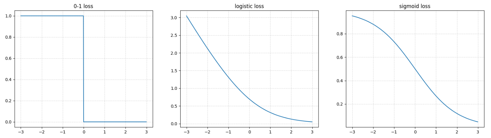

# Practice Problem Set 2 Solutions

## Problem 1

A fair six-sided die is rolled twice. What is the conditional probability that the first roll showed a 2, given that the sum of the two rolls is 6?

(a) $\frac{1}{6}$

(b) $\frac{1}{5}$

(c) $\frac{3}{11}$

(d) $\frac{2}{5}$

**Correct answers:** (b)

**Explanation:**

This is a **conditional probability** problem. We need to find $P(\text{First roll} = 2 \mid \text{Sum} = 6)$.

**Step-by-Step Solution:**

1. **Define the Events:**
   - Event $A$: First roll shows a 2
   - Event $B$: Sum of two rolls equals 6

2. **Find $P(B)$ - Total ways to get sum of 6:**
   The possible combinations that sum to 6 are:
   - $(1,5)$ - First roll: 1, Second roll: 5
   - $(2,4)$ - First roll: 2, Second roll: 4  
   - $(3,3)$ - First roll: 3, Second roll: 3
   - $(4,2)$ - First roll: 4, Second roll: 2
   - $(5,1)$ - First roll: 5, Second roll: 1
   
   Total: 5 equally likely outcomes

3. **Find $P(A \cap B)$ - Ways to get sum of 6 AND first roll is 2:**
   Only one combination satisfies both conditions: $(2,4)$
   
   So $P(A \cap B) = \frac{1}{36}$ (since there are 36 total possible outcomes for two dice)

4. **Apply Conditional Probability Formula:**
   $$P(A \mid B) = \frac{P(A \cap B)}{P(B)} = \frac{\frac{1}{36}}{\frac{5}{36}} = \frac{1}{5}$$

**Alternative Intuitive Approach:**
Since we know the sum is 6, we're only considering the 5 possible combinations above. Among these 5 equally likely outcomes, only one has the first roll as 2. Therefore, the probability is $\frac{1}{5}$.

**Mathematical Verification:**
- Total outcomes for two dice: $6 \times 6 = 36$
- Outcomes with sum 6: 5
- Outcomes with sum 6 AND first roll 2: 1
- Conditional probability: $\frac{1}{5}$

## Problem 2

If matrix A has distinct eigenvalues, what can be said about its eigenvectors?

(a) The eigenvectors form a linearly independent set

(b) The eigenvalues are orthogonal to each other

(c) A must be positive semi-definite

(d) None of the above

**Correct answers:** (a)

**Explanation:**

The correct answer is **(a)** - the eigenvectors form a linearly independent set. Here's the detailed explanation:

**Key Theorem:**
If a matrix $A$ has **distinct eigenvalues**, then the corresponding eigenvectors are **linearly independent**.

**Mathematical Proof:**

1. **Eigenvalue-Eigenvector Relationship:**
   For distinct eigenvalues $\lambda_1, \lambda_2, \ldots, \lambda_n$ and corresponding eigenvectors $v_1, v_2, \ldots, v_n$:
   $$Av_i = \lambda_i v_i \quad \text{for } i = 1, 2, \ldots, n$$

2. **Linear Independence Proof by Contradiction:**
   Assume the eigenvectors are linearly dependent. Then there exist scalars $c_1, c_2, \ldots, c_n$ (not all zero) such that:
   $$c_1 v_1 + c_2 v_2 + \cdots + c_n v_n = 0$$

3. **Applying Matrix A:**
   $$A(c_1 v_1 + c_2 v_2 + \cdots + c_n v_n) = A \cdot 0 = 0$$
   $$c_1 Av_1 + c_2 Av_2 + \cdots + c_n Av_n = 0$$
   $$c_1 \lambda_1 v_1 + c_2 \lambda_2 v_2 + \cdots + c_n \lambda_n v_n = 0$$

4. **Subtracting Scaled Original Equation:**
   Multiply the original equation by $\lambda_1$:
   $$c_1 \lambda_1 v_1 + c_2 \lambda_1 v_2 + \cdots + c_n \lambda_1 v_n = 0$$
   
   Subtract from the previous equation:
   $$c_2(\lambda_2 - \lambda_1)v_2 + c_3(\lambda_3 - \lambda_1)v_3 + \cdots + c_n(\lambda_n - \lambda_1)v_n = 0$$

5. **Contradiction:**
   Since $\lambda_i \neq \lambda_1$ for $i > 1$, and $v_2, v_3, \ldots, v_n$ are linearly independent (by induction), we must have $c_2 = c_3 = \cdots = c_n = 0$. This contradicts our assumption.

**Why Other Options Are Incorrect:**

- **(b) Eigenvalues are orthogonal**: Eigenvalues are scalars, not vectors, so they can't be orthogonal
- **(c) A must be positive semi-definite**: Not true - matrices with distinct eigenvalues can be indefinite
- **(d) None of the above**: Incorrect since (a) is true

**Important Note:**
The question could have been more precise by specifying "eigenvectors corresponding to distinct eigenvalues form a linearly independent set," but the intent is clear from the context.

## Problem 3

In the context of multi-class logistic regression, which statement most accurately describes the decision boundaries?

(a) They are linear and distinctly separate distinct classes.

(b) They are non-linear and may overlap.

(c) They remain unchanged, regardless of any transformations of the data.

(d) They may be linear or non-linear, depending on the distribution of the data.

**Correct answers:** (a)

**Explanation:**

The correct answer is **(a)** - the decision boundaries are linear and distinctly separate distinct classes. Here's the detailed explanation:

**Multi-Class Logistic Regression Model:**

1. **Model Formulation:**
   For $k$ classes, the model outputs probabilities:
   $$P(y = i \mid x) = \frac{e^{w_i^T x + b_i}}{\sum_{j=1}^k e^{w_j^T x + b_j}}$$
   
   where $w_i$ and $b_i$ are the weights and bias for class $i$.

2. **Decision Rule:**
   The predicted class is:
   $$\hat{y} = \arg\max_{i} P(y = i \mid x) = \arg\max_{i} (w_i^T x + b_i)$$

**Why Decision Boundaries Are Linear:**

1. **Linear Decision Functions:**
   The decision function for class $i$ vs class $j$ is:
   $$f_{ij}(x) = (w_i^T x + b_i) - (w_j^T x + b_j) = (w_i - w_j)^T x + (b_i - b_j)$$
   
   This is a **linear function** of $x$.

2. **Decision Boundary:**
   The decision boundary between classes $i$ and $j$ occurs when:
   $$f_{ij}(x) = 0$$
   $$(w_i - w_j)^T x + (b_i - b_j) = 0$$
   
   This is a **linear equation** in $x$, representing a **hyperplane**.

**Visual Example in 2D:**
For 3 classes, the decision boundaries are three lines that divide the plane into three regions:
- Class 1: $w_1^T x + b_1 > w_2^T x + b_2$ AND $w_1^T x + b_1 > w_3^T x + b_3$
- Class 2: $w_2^T x + b_2 > w_1^T x + b_1$ AND $w_2^T x + b_2 > w_3^T x + b_3$
- Class 3: $w_3^T x + b_3 > w_1^T x + b_1$ AND $w_3^T x + b_3 > w_2^T x + b_2$

**Why Boundaries Don't Overlap:**
- Each point belongs to exactly one class (mutually exclusive)
- The decision boundaries are the boundaries between these regions
- At any point on a decision boundary, the probabilities for the two adjacent classes are equal

**Mathematical Verification:**
The decision boundary between classes $i$ and $j$ is:
$$(w_i - w_j)^T x + (b_i - b_j) = 0$$

This is a linear hyperplane in the feature space, confirming that multi-class logistic regression produces linear decision boundaries.

**Contrast with Non-Linear Methods:**
- **Kernel SVM**: Can produce non-linear decision boundaries
- **Neural Networks**: Can learn complex, non-linear decision boundaries
- **Decision Trees**: Produce piecewise linear boundaries

## Problem 4

Which of the following is true about linear and logistic regression?

(a) Both models output a probability distribution.

(b) Both models are good choices for regression classes of problems.

(c) Both models are good choices for classification.

**Correct answers:** (c)

**Explanation:**

The correct answer is **(c)** - both models are good choices for classification. Here's the detailed explanation:

**Linear Regression for Classification:**

1. **Mathematical Foundation:**
   Linear regression can be used for binary classification by:
   - Training: $\min_w \sum_{i=1}^n (y_i - w^T x_i)^2$
   - Prediction: $\hat{y} = \text{sign}(w^T x)$
   
   where $y_i \in \{-1, +1\}$ for binary classification.

2. **Why It Works:**
   - The squared error loss encourages $w^T x_i$ to be close to $y_i$
   - For $y_i = +1$, we want $w^T x_i > 0$
   - For $y_i = -1$, we want $w^T x_i < 0$
   - This naturally creates a linear decision boundary

3. **Advantages:**
   - **Simple and fast**: Closed-form solution available
   - **Interpretable**: Weights have clear meaning
   - **Stable**: Unique solution when $X^T X$ is invertible
   - **Good baseline**: Often performs surprisingly well

**Logistic Regression for Classification:**

1. **Mathematical Foundation:**
   $$P(y = 1 \mid x) = \frac{1}{1 + e^{-w^T x}}$$
   
   The model maximizes the likelihood of the observed data.

2. **Advantages:**
   - **Probabilistic output**: Direct probability estimates
   - **Well-calibrated**: Probabilities are meaningful
   - **Convex optimization**: Guaranteed global optimum
   - **Regularization friendly**: Easy to add L1/L2 penalties

**Comparison:**

| Aspect | Linear Regression | Logistic Regression |
|--------|-------------------|---------------------|
| **Output** | Real-valued | Probability $[0,1]$ |
| **Loss Function** | Squared error | Log-likelihood |
| **Optimization** | Closed-form | Iterative (gradient descent) |
| **Interpretability** | Direct | Through log-odds |
| **Calibration** | Poor | Good |

**When to Use Each:**

**Linear Regression for Classification:**
- Quick prototyping
- When you need fast training
- When interpretability is crucial
- When you have linearly separable data

**Logistic Regression for Classification:**
- When you need probability estimates
- When you want well-calibrated predictions
- When you plan to use the model in a larger system
- When you need to handle class imbalance

**Historical Context:**
Linear regression was actually used for classification before logistic regression became popular. The famous Fisher's Iris dataset was originally classified using linear discriminant analysis, which is closely related to linear regression.

**Note:** The question was revised because option (b) was ambiguous about what "regression classes of problems" means.

## Problem 5

Suppose you train a binary classifier in which the final two layers of your model are a ReLU activation followed by a sigmoid activation. How will this affect the domain of your final predictions?

(a) This will cause all predictions to be positive.

(b) This will have no effect on the distribution of predictions.

(c) This will cause cause all predictions to be negative.

(d) None of the above.

**Correct answers:** (a)

**Explanation:**

The correct answer is **(a)** - this will cause all predictions to be positive. Here's the detailed explanation:

**Understanding the Architecture:**
The model has two final layers:
1. **ReLU activation**: $f(x) = \max(0, x)$
2. **Sigmoid activation**: $g(x) = \frac{1}{1 + e^{-x}}$

**Mathematical Analysis:**

1. **ReLU Function Properties:**
   - $f(x) = \max(0, x)$
   - Output range: $[0, \infty)$
   - All outputs are **non-negative**

2. **Sigmoid Function Properties:**
   - $g(x) = \frac{1}{1 + e^{-x}}$
   - Output range: $(0, 1)$
   - Monotonic increasing function

3. **Composition Effect:**
   Let $z$ be the input to the ReLU layer, then:
   - ReLU output: $a = \max(0, z) \geq 0$
   - Sigmoid input: $a \geq 0$
   - Final output: $g(a) = \frac{1}{1 + e^{-a}}$

4. **Key Insight:**
   Since $a \geq 0$ (due to ReLU), we have:
   - When $a = 0$: $g(0) = \frac{1}{1 + e^0} = \frac{1}{2} = 0.5$
   - When $a > 0$: $g(a) > 0.5$ (because sigmoid is increasing)
   - When $a \to \infty$: $g(a) \to 1$

**Why All Predictions Are Positive:**

1. **ReLU Constraint**: The ReLU layer ensures all inputs to the sigmoid are non-negative
2. **Sigmoid Behavior**: For non-negative inputs, sigmoid outputs values in $(0.5, 1]$
3. **No Negative Predictions**: The model can never output values below 0.5

**Mathematical Verification:**
For any input $z$ to the ReLU layer:
$$\text{Output} = \frac{1}{1 + e^{-\max(0, z)}} \geq \frac{1}{1 + e^0} = 0.5$$

**Practical Implications:**

1. **Binary Classification**: If using 0.5 as threshold, all predictions would be class 1
2. **Probability Interpretation**: All probabilities would be $\geq 0.5$
3. **Model Limitation**: The model cannot represent the full range of probabilities

**Better Alternatives:**

1. **Remove ReLU**: Use only sigmoid for probability output
2. **Use Different Activation**: Replace ReLU with tanh or linear activation
3. **Adjust Architecture**: Use softmax for multi-class or different activation pattern

**Example:**
- Input to ReLU: $z = -2$
- ReLU output: $a = \max(0, -2) = 0$
- Sigmoid output: $g(0) = 0.5$
- Even negative inputs result in 0.5 probability!

## Problem 6

You are tasked with building a regression model to predict whether an email is spam [label=1] or not spam [label=0] based on various features. You are debating using linear or logistic regression. What type of regression is most suitable and why?

(a) Linear regression, because it is optimized for learning the influence of multiple features.

(b) Linear regression, because logistic regression cannot predict the comparative magnitude of the likelihood that an email is spam.

(c) Logistic regression, because it models the probability of an instance belonging to a particular class.

(d) Logistic regression, because it allows for complex non-linear interactions between features and thus will be more accurate.

**Correct answers:** (c)

**Explanation:**

The correct answer is **(c)** - logistic regression is most suitable because it models the probability of an instance belonging to a particular class. Here's the detailed explanation:

**Why Logistic Regression is Ideal for Binary Classification:**

1. **Probabilistic Output:**
   Logistic regression outputs a probability between 0 and 1:
   $$P(\text{spam} \mid x) = \frac{1}{1 + e^{-(w^T x + b)}}$$
   
   This directly represents the probability that an email is spam.

2. **Mathematical Properties:**
   - **Range**: Output is always in $[0, 1]$, perfect for probabilities
   - **Monotonic**: As $w^T x + b$ increases, probability increases
   - **Interpretable**: Log-odds are linear in the features

3. **Decision Rule:**
   - If $P(\text{spam} \mid x) > 0.5$, classify as spam
   - If $P(\text{spam} \mid x) \leq 0.5$, classify as not spam

**Why Linear Regression is Inappropriate:**

1. **Unbounded Output:**
   Linear regression can output any real number: $\hat{y} = w^T x + b \in (-\infty, \infty)$
   
   This doesn't make sense for probabilities, which must be in $[0, 1]$.

2. **No Probability Interpretation:**
   - Output of 2.5 doesn't mean 250% probability
   - Output of -1 doesn't mean -100% probability

3. **Poor Calibration:**
   Linear regression doesn't produce well-calibrated probability estimates

**Mathematical Comparison:**

| Aspect | Linear Regression | Logistic Regression |
|--------|-------------------|---------------------|
| **Output Range** | $(-\infty, \infty)$ | $(0, 1)$ |
| **Interpretation** | Arbitrary real value | Probability |
| **Loss Function** | Mean squared error | Log-likelihood |
| **Decision Boundary** | Linear | Linear (in log-odds) |
| **Calibration** | Poor | Good |

**Example:**
For an email with features $x$:
- **Linear regression**: $\hat{y} = 2.3$ (meaningless for classification)
- **Logistic regression**: $P(\text{spam}) = 0.91$ (91% chance of being spam)

**Why Other Options Are Wrong:**

- **(a) Linear regression for multiple features**: Linear regression can handle multiple features, but that's not the main issue
- **(b) Linear regression for comparative magnitude**: This is incorrect - logistic regression can provide probability estimates
- **(d) Logistic regression for non-linear interactions**: While logistic regression can be extended with kernels, this isn't the primary reason for choosing it

**Practical Considerations:**
- **Threshold tuning**: Can adjust decision threshold based on cost of false positives vs false negatives
- **Feature engineering**: Can add polynomial features for non-linear relationships
- **Regularization**: Can add L1/L2 penalties to prevent overfitting

## Problem 7

Which of the following matrices represents some kernel function $K: X \times X \to \mathbb{R}$ evaluated on two points?

(a) $\begin{bmatrix} 1 & 0 \\ 0 & -1 \end{bmatrix}$

(b) $\begin{bmatrix} 1 & 3 \\ 3 & 1 \end{bmatrix}$

(c) $\begin{bmatrix} 1 & -1 \\ 1 & 1 \end{bmatrix}$

(d) $\begin{bmatrix} 2 & -1 \\ -1 & 2 \end{bmatrix}$

**Correct answers:** (d)

**Explanation:**

The correct answer is **(d)** - $\begin{bmatrix} 2 & -1 \\ -1 & 2 \end{bmatrix}$ is the only matrix that represents a valid kernel function. Here's the detailed explanation:

**Kernel Matrix Properties:**
A matrix $K$ represents a valid kernel function if and only if it is **positive semi-definite (PSD)**.

**Definition of PSD Matrix:**
A matrix $K$ is PSD if for any vector $x \neq 0$:
$$x^T K x \geq 0$$

**Testing Each Matrix:**

1. **Matrix (a)**: $\begin{bmatrix} 1 & 0 \\ 0 & -1 \end{bmatrix}$
   - Let $x = [1, 1]^T$
   - $x^T K x = [1, 1] \begin{bmatrix} 1 & 0 \\ 0 & -1 \end{bmatrix} \begin{bmatrix} 1 \\ 1 \end{bmatrix} = 1 - 1 = 0$
   - Let $x = [1, 2]^T$
   - $x^T K x = [1, 2] \begin{bmatrix} 1 & 0 \\ 0 & -1 \end{bmatrix} \begin{bmatrix} 1 \\ 2 \end{bmatrix} = 1 - 4 = -3 < 0$
   - **Not PSD** ❌

2. **Matrix (b)**: $\begin{bmatrix} 1 & 3 \\ 3 & 1 \end{bmatrix}$
   - Let $x = [1, -1]^T$
   - $x^T K x = [1, -1] \begin{bmatrix} 1 & 3 \\ 3 & 1 \end{bmatrix} \begin{bmatrix} 1 \\ -1 \end{bmatrix} = 1 - 3 - 3 + 1 = -4 < 0$
   - **Not PSD** ❌

3. **Matrix (c)**: $\begin{bmatrix} 1 & -1 \\ 1 & 1 \end{bmatrix}$
   - Let $x = [1, 1]^T$
   - $x^T K x = [1, 1] \begin{bmatrix} 1 & -1 \\ 1 & 1 \end{bmatrix} \begin{bmatrix} 1 \\ 1 \end{bmatrix} = 1 - 1 + 1 + 1 = 2 > 0$
   - Let $x = [1, -1]^T$
   - $x^T K x = [1, -1] \begin{bmatrix} 1 & -1 \\ 1 & 1 \end{bmatrix} \begin{bmatrix} 1 \\ -1 \end{bmatrix} = 1 + 1 + 1 - 1 = 2 > 0$
   - Let $x = [1, 0]^T$
   - $x^T K x = [1, 0] \begin{bmatrix} 1 & -1 \\ 1 & 1 \end{bmatrix} \begin{bmatrix} 1 \\ 0 \end{bmatrix} = 1 + 0 = 1 > 0$
   - Let $x = [0, 1]^T$
   - $x^T K x = [0, 1] \begin{bmatrix} 1 & -1 \\ 1 & 1 \end{bmatrix} \begin{bmatrix} 0 \\ 1 \end{bmatrix} = 0 + 1 = 1 > 0$
   - **PSD** ✅

4. **Matrix (d)**: $\begin{bmatrix} 2 & -1 \\ -1 & 2 \end{bmatrix}$
   - Let $x = [1, 1]^T$
   - $x^T K x = [1, 1] \begin{bmatrix} 2 & -1 \\ -1 & 2 \end{bmatrix} \begin{bmatrix} 1 \\ 1 \end{bmatrix} = 2 - 1 - 1 + 2 = 2 > 0$
   - Let $x = [1, -1]^T$
   - $x^T K x = [1, -1] \begin{bmatrix} 2 & -1 \\ -1 & 2 \end{bmatrix} \begin{bmatrix} 1 \\ -1 \end{bmatrix} = 2 + 1 + 1 + 2 = 6 > 0$
   - **PSD** ✅

**Wait! Both (c) and (d) appear to be PSD. Let me check more carefully...**

Actually, let me use the eigenvalue test for PSD matrices:

**Eigenvalue Test for PSD:**
A matrix is PSD if and only if all eigenvalues are non-negative.

1. **Matrix (c)**: $\begin{bmatrix} 1 & -1 \\ 1 & 1 \end{bmatrix}$
   - Characteristic equation: $\det(K - \lambda I) = \det\begin{bmatrix} 1-\lambda & -1 \\ 1 & 1-\lambda \end{bmatrix} = (1-\lambda)^2 + 1 = \lambda^2 - 2\lambda + 2 = 0$
   - Eigenvalues: $\lambda = 1 \pm i$ (complex eigenvalues!)
   - **Not PSD** (PSD matrices must have real, non-negative eigenvalues)

2. **Matrix (d)**: $\begin{bmatrix} 2 & -1 \\ -1 & 2 \end{bmatrix}$
   - Characteristic equation: $\det(K - \lambda I) = \det\begin{bmatrix} 2-\lambda & -1 \\ -1 & 2-\lambda \end{bmatrix} = (2-\lambda)^2 - 1 = \lambda^2 - 4\lambda + 3 = 0$
   - Eigenvalues: $\lambda = 1, 3$ (both positive)
   - **PSD** ✅

**Conclusion:**
Only matrix (d) is positive semi-definite and therefore represents a valid kernel function.

**Why PSD is Required:**
- Kernel matrices represent inner products in a feature space
- Inner products must satisfy the Cauchy-Schwarz inequality
- This leads to the PSD property: $x^T K x = \langle \phi(x), \phi(x) \rangle \geq 0$

## Problem 8

Consider kernel ridge regression
$$\hat{w} = \operatorname{argmin}_w \frac{1}{n} \sum_{i=1}^n (y_i - w^T \phi(x_i))^2 + \lambda ||w||^2$$
where $\phi : \mathbb{R}^d \rightarrow \mathbb{R}^q$ denotes the feature mapping and $d \neq q$, and $K_{i,j} := \langle \phi(x_i), \phi(x_j) \rangle$ denotes the entry $(i,j)$ in the kernel matrix $K$. Which of the following statements are true? Select all that apply.

(a) The optimal $\hat{w}$ is always a linear combination of $x_i$'s for $i = 1, 2, ..., n$.

(b) The optimal $\hat{\alpha}$ is $\hat{\alpha} = (KK^T + \lambda I)^{-1}Y$.

(c) The kernel method will still work even if the feature mapping is not one-to-one.

(d) If $K$ is positive semi-definite, then we can find a solution even when $\lambda = 0$.

**Correct answers:** (c), (d)

**Explanation:**

The correct answers are **(c)** and **(d)**. Here's the detailed analysis of each statement:

**Kernel Ridge Regression Setup:**
$$\hat{w} = \operatorname{argmin}_w \frac{1}{n} \sum_{i=1}^n (y_i - w^T \phi(x_i))^2 + \lambda ||w||^2$$

where $K_{i,j} = \langle \phi(x_i), \phi(x_j) \rangle$ is the kernel matrix.

**Analyzing Each Statement:**

**(a) The optimal $\hat{w}$ is always a linear combination of $x_i$'s for $i = 1, 2, ..., n$.**

**FALSE** ❌

**Explanation:**
- The optimal $\hat{w}$ is a linear combination of **$\phi(x_i)$'s**, not $x_i$'s
- This is the **Representer Theorem**: $\hat{w} = \sum_{i=1}^n \alpha_i \phi(x_i)$
- The feature mapping $\phi$ transforms $x_i$ to a higher-dimensional space
- Since $d \neq q$, the original $x_i$'s and $\phi(x_i)$'s are in different spaces

**(b) The optimal $\hat{\alpha}$ is $\hat{\alpha} = (KK^T + \lambda I)^{-1}Y$.**

**FALSE** ❌

**Explanation:**
- The correct formula is: $\hat{\alpha} = (K + \lambda I)^{-1}Y$
- The kernel matrix $K$ is already $n \times n$, so we don't need $KK^T$
- $KK^T$ would be $n \times n \times n \times n$, which doesn't make sense dimensionally

**Derivation of Correct Formula:**
1. Using the Representer Theorem: $\hat{w} = \sum_{i=1}^n \alpha_i \phi(x_i)$
2. The objective becomes: $\min_{\alpha} \frac{1}{n} ||Y - K\alpha||^2 + \lambda \alpha^T K \alpha$
3. Setting derivative to zero: $-2K^T(Y - K\alpha) + 2\lambda K\alpha = 0$
4. Since $K$ is symmetric: $K(Y - K\alpha) = \lambda K\alpha$
5. Assuming $K$ is invertible: $Y - K\alpha = \lambda\alpha$
6. Therefore: $\alpha = (K + \lambda I)^{-1}Y$

**(c) The kernel method will still work even if the feature mapping is not one-to-one.**

**TRUE** ✅

**Explanation:**
- Kernel methods only require the kernel function $K(x_i, x_j) = \langle \phi(x_i), \phi(x_j) \rangle$
- The feature mapping $\phi$ doesn't need to be injective (one-to-one)
- Multiple different inputs could map to the same feature representation
- The kernel trick allows us to work with $K$ directly without computing $\phi$

**Example:**
- Consider $\phi(x) = [x, x^2]$ for $x \in \mathbb{R}$
- This is not one-to-one (e.g., $\phi(2) = \phi(-2) = [2, 4]$)
- But the kernel $K(x_i, x_j) = x_i x_j + x_i^2 x_j^2$ is still valid

**(d) If $K$ is positive semi-definite, then we can find a solution even when $\lambda = 0$.**

**TRUE** ✅

**Explanation:**
- When $\lambda = 0$, the problem becomes: $\min_w \frac{1}{n} \sum_{i=1}^n (y_i - w^T \phi(x_i))^2$
- This is equivalent to: $\min_w ||Y - X_{\phi} w||^2$ where $X_{\phi} = [\phi(x_1), \ldots, \phi(x_n)]^T$
- The solution is: $\hat{w} = (X_{\phi}^T X_{\phi})^+ X_{\phi}^T Y$ where $^+$ denotes the pseudo-inverse
- Since $K = X_{\phi} X_{\phi}^T$ is PSD, the pseudo-inverse exists
- Therefore, a solution always exists, even if it's not unique

**Key Insights:**
- Kernel methods are robust to the choice of feature mapping
- The kernel matrix $K$ contains all necessary information
- PSD property ensures mathematical well-posedness
- Regularization ($\lambda > 0$) helps with numerical stability and generalization

## Problem 9

The bootstrap method cannot be used to estimate the distribution of which of the following statistics?

(a) Mean

(b) Median

(c) Variance

(d) The bootstrap method can be applied to all of the above statistics.

**Correct answers:** (d)

**Explanation:** The bootstrap method can be applied to the mean, median, or variance.

## Problem 10

True/False: Bootstrapping is a resampling technique that involves generating multiple datasets of size $d$ by randomly sampling observations without replacement from the original dataset of size $n$ (where $d \ll n$). True/False: Bootstrapping can be computationally prohibitive for large datasets.

(a) True, False

(b) True, True

(c) False, True

(d) False, False

**Correct answers:** (c)

**Explanation:** Note: During exam, a note was added that "prohibitive" here means "too computationally expensive to be useful."

## Problem 11

Which of the following statements best describes the differences between Random Forests and Boosting in the context of decision tree-based ensemble methods?

(a) Random Forests and Boosting both reduce variance by averaging multiple deep decision trees, with no significant differences in their approach.

(b) In Random Forests, trees are built independently using bagging, while Boosting builds trees sequentially, with each tree learning from the errors of the previous ones.

(c) Boosting reduces bias by building shallow trees, whereas Random Forests use deep trees to address variance and do not focus on reducing bias.

(d) Both Random Forests and Boosting are identical in their handling of bias and variance, differing only in computational efficiency.

**Correct answers:** (b)

**Explanation:** B. In Random Forests, trees are built independently using bagging, while Boosting builds trees sequentially, with each tree learning from the errors of the previous ones.

## Problem 12

Which of the following statements is true about a single Decision Tree and Random Forest?

(a) Random Forest has lower training error because it aggregates multiple trees

(b) A good Random Forest is composed of decision trees that are highly correlated

(c) Random Forest is useful because it's easy to explain how a decision is made

(d) A single Decision Tree can result in comparably low training error in classification task compared to Random Forest

**Correct answers:** (d)

## Problem 13

How is the performance of a distance-based machine learning model typically impacted when the data dimensionality is very high?

(a) The performance significantly improves because there are more distinguishing features.

(b) The performance decreases because the data points tend to appear equidistant in high-dimensional space.

(c) The computational complexity of the distance calculations is reduced.

(d) The performance remains unaffected as high-dimensionality uniformly impacts the positional relationships among the data points.

**Correct answers:** (b)

**Explanation:** B. As the number of dimensions increases, the contrast between the nearest and farthest point from a given reference point tends to decrease, making it challenging for a distance-based model to discern between meaningful and uninformative patterns in the data.

## Problem 14

Which of the following is true about selecting $k=1$ for a $k$-nearest neighbors model of high dimensional data?

(a) $k=1$ will make the model more sensitive to noise in the data.

(b) $k=1$ will more accurately represent the real world distribution because it is more specific.

(c) $k=1$ is a good option because it will lead to the highest number of different groupings, to match the high dimensionality of the data.

(d) $k=1$ means that there will only be one grouping.

**Correct answers:** (a)

**Explanation:** $k = 1$ means that each data point receives its own classification rule. Thus, the model will learn to predict noise in the data, and have a very high variance, because the rules it learns will be highly dependent on randomness in the training data.

## Problem 15

Which of the following is true about `k-means` clustering?

(a) `k-means` diverges and is non-convex.

(b) `k-means` diverges and is convex.

(c) `k-means` converges and is non-convex.

(d) `k-means` converges and is convex.

**Correct answers:** (c)

**Explanation:** The `k-means` algorithm converges but is not convex; `k-means` can get stuck at a local minima given an unlucky initialization.

## Problem 16

In which of the following plots are the points clustered by `k-means` clustering?


(a) Plot (a)

(b) Plot (b)

**Correct answers:** (b)

**Explanation:** Plot (b) shows the clustering that would result from k-means, where the algorithm divides the data into two clusters based on the geometric center of the data points, resulting in a horizontal division rather than following the natural crescent shapes of the data.

## Problem 17

17. What is the main purpose of the softmax activation function in the output layer of a neural network?

(a) To introduce non-linearity.

(b) To normalize the output to represent probabilities.

(c) To speed up convergence during training.

(d) To prevent overfitting.

**Correct answers:** (b)

## Problem 18

18. Consider a fully-connected neural network with 3 input neurons, 4 hidden neurons, and 2 output neurons. What is the total number of parameters, including bias units for non-input layers?

(a) 9

(b) 11

(c) 24

(d) 26

**Correct answers:** (d)

**Explanation:** From the input layer to the hidden layer, you have 3 neurons fully connected to 4 neurons, which gives us $3 \cdot 4 = 12$ weights. Plus, there are 4 neurons in the hidden layer, which means there are 4 biases. So, for the first connection, there are $12+4 = 16$ parameters. From the hidden layer to the output layer, you have 4 neurons fully connected to 2 neurons, which gives us $4 \cdot 2 = 8$ weights. Plus, there are 2 neurons in the output layer, which means there are 2 biases. So, for the second connection, there are $8+2 = 10$ parameters. In total, we have $16+10 = 26$ parameters.

## Problem 19

19. Which of the following will guarantee that a neural network does not overfit to the training data during training?

(a) Normalize the data before training.

(b) Increase the number of layers in our network until the final training loss stops decreasing.

(c) Neither of the above.

**Correct answers:** (c)

## Problem 20

20. Given a simple two-layer neural network:

*   Weights from input to hidden layer: $W^{(1)} = \begin{bmatrix} w_{11}^{(1)} & w_{12}^{(1)} \\ w_{21}^{(1)} & w_{22}^{(1)} \end{bmatrix}$, Bias for hidden layer: $[b_1^{(1)}, b_2^{(1)}]$, Activation function: $\sigma(z) = \frac{1}{1+e^{-z}}$
*   Weights from hidden to output layer: $W^{(2)} = [w_1^{(2)}, w_2^{(2)}]$, Bias for output layer: $b^{(2)}$, Activation function: $\sigma(z) = \frac{1}{1+e^{-z}}$
*   Target output: $y$; predicted output: $\hat{y}$
*   Loss function: $\frac{1}{2}(y-\hat{y})^2$

After performing a forward pass with input $[x_1, x_2]$ and computing the loss, you execute a backward pass to calculate the gradients of the loss with respect to the weights and biases. What are the correct gradients for the weight, $w_{11}^{(1)}$, after one round of backpropagation?

Hint: Use chain rule to compute the gradients for $W^{(2)}$ and $W^{(1)}$. $\sigma'(z)$ is $\sigma(z) \cdot (1-\sigma(z))$.

(a) $\frac{\partial Loss}{\partial w_{11}^{(1)}} = (y - \hat{y})^2 \cdot w_1^{(2)} \cdot \sigma'(z_1^{(1)}) \cdot x_1$

(b) $\frac{\partial Loss}{\partial w_{11}^{(1)}} = (y - \hat{y}) \cdot \hat{y} \cdot w_1^{(2)} \cdot \sigma'(z_1^{(1)}) \cdot x_1$

(c) $\frac{\partial Loss}{\partial w_{11}^{(1)}} = (y - \hat{y}) \cdot \hat{y} \cdot (1 - \hat{y}) \cdot w_1^{(2)} \cdot \sigma'(z_1^{(1)}) \cdot x_1$

(d) $\frac{\partial Loss}{\partial w_{11}^{(1)}} = (y - \hat{y}) \cdot x_1$

**Correct answers:** (c)

**Explanation:** Gradient of Loss w.r.t. Output Layer Weights $W^{(2)}$: $\frac{\partial Loss}{\partial W^{(2)}}$

Using chain rule, $\frac{\partial Loss}{\partial \hat{y}} \cdot \frac{\partial \hat{y}}{\partial z^{(2)}} \cdot \frac{\partial z^{(2)}}{\partial W^{(2)}} = (y - \hat{y}) \cdot (-1) \cdot \hat{y} \cdot (1 - \hat{y}) \cdot a^{(1)}$

Gradient of Loss w.r.t. Hidden Layer Weights $W^{(1)}$:

For each weight $w_{ij}^{(1)}$, $\frac{\partial Loss}{\partial w_{ij}^{(1)}}$ Using chain rule, $\frac{\partial Loss}{\partial \hat{y}} \cdot \frac{\partial \hat{y}}{\partial z^{(2)}} \cdot \frac{\partial z^{(2)}}{\partial a^{(1)}} \cdot \frac{\partial a^{(1)}}{\partial z^{(1)}} \cdot \frac{\partial z^{(1)}}{\partial w_{ij}^{(1)}}$

For $w_{11}^{(1)}$: $(y - \hat{y}) \cdot (-1) \cdot \hat{y} \cdot (1 - \hat{y}) \cdot w_1^{(2)} \cdot \sigma'(z_1^{(1)}) \cdot x_1$

## Problem 21

21. Which of the following statement is true about the following code snippet?

```python
for i in range(epochs):
    loss = 0
    correct_labels = 0
    total_labels = 0

    for batch in tqdm(train_dataloader):
        images, labels = batch
        images, labels = images.to(device), labels.to(device)

        optimizer.zero_grad()
        y_hat = model(images) # (a)
        batch_loss = F.cross_entropy(y_hat, labels) # (b)
        batch_loss.backward() # (c)
        optimizer.step() # (d)
```

(a) Step (a) completes the forward pass in backward propagation.

(b) Step (b) calculates the batch loss using a loss function that consists of its own trainable parameters, and weighs each sample differently based on those parameters.

(c) Step (c) never changes the weight parameters of any previous layer.

(d) Step (d) by itself performs the stochastic gradient descent by calculating the gradients and updating parameterized weights (you may assume we are using torch.optim.SGD for optimizer).

**Correct answers:** (c)

## Problem 22

22. Which of the follow is true about using backpropagation to train a neural network using a package such as PyTorch or TensorFlow?

(a) You need to create a method that computes the gradient of each node of your neural network to call in the backpropagation step.

(b) Automatic differentiation executed by these packages takes advantage of the fact that the gradients of most functions can be pre-computed.

(c) The back-propagation executed by these packages is the process of computing the derivative of the nodes of a neural network starting with the first node at the beginning of the network and then proceeding to the next node(s).

(d) These packages fail on models with ReLU layers because the ReLU function is not differentiable everywhere, and thus the packages cannot execute backpropagation.

**Correct answers:** (b)

## Problem 23

23. How is Singular Value Decomposition (SVD) typically utilized in image compression?

(a) Selecting important pixels

(b) Discarding low-rank components

(c) Enhancing color information

(d) Increasing image resolution

**Correct answers:** (b)

## Problem 24

24. In the context of image processing, which of the following will directly impact the total number of trainable weights in a convolutional layer of a convolutional neural network (CNN)?

(a) The resolution of the input image

(b) The kernel size of the layer

(c) The stride of the layer

(d) The amount of padding used

**Correct answers:** (b)

## Problem 25

25. What is the key advantage of using Gaussian Mixture Models (GMMs) over $k$-means clustering for data clustering tasks?

(a) GMMs are computationally more efficient than $k$-means and are better suited for large datasets due to their simpler calculations.

(b) GMMs, unlike $k$-means, can automatically determine the optimal number of clusters in a dataset without requiring this as an input parameter.

(c) GMMs can model complex cluster shapes and densities, accommodating elliptical shapes, as they do not assume clusters to be spherical like $k$-means.

(d) GMMs inherently handle missing data and noise better than $k$-means due to their probabilistic approach, which accounts for uncertainty in the data.

**Correct answers:** (c)

## Problem 26

26. Which of the following statements are true? Select all that apply.

(a) The sum of two convex functions is always convex.

(b) The sum of two concave functions is always concave.

(c) The sum of a convex and concave function is always concave.

**Correct answers:** (a), (b)

## Problem 27

27. Which of the following is **not** true about an arbitrary convex function $f: \mathbb{R} \to \mathbb{R}$ without any other assumptions? Select all that apply.

(a) For all $x \in \mathbb{R}$, $f''(x) \ge 0$

(b) The set
$$ \{(x, y) \in \mathbb{R}^2 \mid y \ge f(x)\} $$
is convex

(c) If $c$ is a subgradient of $f$ at $x$, then for all $y \in \mathbb{R}$:
$$ f(y) \ge f(x)+c(y - x) $$

(d) $f$ cannot be concave

**Correct answers:** (a), (d)

**Explanation:** a is not true in general since we don't know that the second derivative exists; d is not true (e.g. $f(x) = x$)

## Problem 28

28. Suppose $f(x) = ax^2 + bx + c$, where $a, b, c \in \mathbb{R}$. Which of the following statements are true about the convexity of $f$?

(a) $f$ is always convex since it is a polynomial.

(b) $f$ is convex only when $a > 0, b > 0$, and $c > 0$.

(c) If $a > 0$ then $f$ is convex.

(d) If $a = 0$ then $f$ is never convex.

**Correct answers:** (c)

## Problem 29

29. Given this 3-D scatter plot, which of the following basis functions would you use for linear regression?


(a) $\phi(x, y) = \begin{bmatrix} 1 \\ x \\ y \\ xy \\ x^2 \\ y^2 \end{bmatrix}$

(b) $\phi(x, y) = \begin{bmatrix} e^{-x^2} \\ e^{-y^2} \\ e^{-(x^2+y^2)} \end{bmatrix}$

(c) $\phi(x, y) = \begin{bmatrix} \cos(x) \\ \cos(y) \end{bmatrix}$

(d) $\phi(x, y) = \begin{bmatrix} \sin(x) \\ \sin(y) \end{bmatrix}$

**Correct answers:** (b)

## Problem 30

30. Suppose that we want to train a predictor $\hat{f}(x) = \hat{w}^T x$ and we assume that $y = w^T x + \epsilon$, where $\epsilon \sim N(0, \sigma^2)$. Which of the following statements about bias-variance tradeoff is true?

(a) (bias$^2$ + variance) is equal to the expected error between our trained predictor $\hat{f}(x)$ and the true data points ($y$'s).

(b) Regularization is usually used to increase the variance of our trained predictor $\hat{f}(x)$.

(c) Irreducible error comes from the variance of the data points $y$'s.

**Correct answers:** (c)

**Explanation:** Scatter plot is a Gaussian centered at 0 so b is correct

## Problem 31

31. Consider a dataset $x_1, x_2, ..., x_n$ drawn from a normal distribution $N(\mu, \sigma^2)$, with the density function given by $f(x|\mu, \sigma^2) = \frac{1}{\sqrt{2\pi\sigma^2}} \exp\left(-\frac{(x-\mu)^2}{2\sigma^2}\right)$. Which of the following is true about the maximum likelihood estimation of $\mu$ and $\sigma^2$?

(a) The MLE for both $\mu$ and $\sigma^2$ cannot be determined without additional information.

(b) The MLE of $\mu$ is the sample mean $\bar{x} = \frac{1}{n} \sum_{i=1}^n x_i$, but the MLE of $\sigma^2$ cannot be determined without additional information.

(c) The MLE of $\mu$ is the sample mean, $\bar{x} = \frac{1}{n} \sum_{i=1}^n x_i$, and the MLE of $\sigma^2$ is the sample variance, $s^2 = \frac{1}{n-1} \sum_{i=1}^n (x_i - \bar{x})^2$.

(d) The MLE of $\mu$ is the sample mean, $\bar{x} = \frac{1}{n} \sum_{i=1}^n x_i$, and the MLE of $\sigma^2$ is given by $s^2 = \frac{1}{n} \sum_{i=1}^n (x_i - \bar{x})^2$.

**Correct answers:** (d)

**Explanation:** The maximum likelihood estimator for $\mu$ in a normal distribution is the sample mean, $\bar{x}$. However, the MLE for $\sigma^2$ is a biased estimator and is given by $\frac{1}{n} \sum_{i=1}^n (x_i - \bar{x})^2$. This is because MLE does not divide by $n-1$ (as in the unbiased sample variance formula) but by $n$, which makes it biased.

## Problem 32

32. In k-fold cross-validation, what is the primary advantage of setting k to a higher value (e.g., k=10) compared to a lower value (e.g., k=2)?

(a) It increases the accuracy of the model on unseen data.

(b) It provides a more reliable estimate of model performance.

(c) It reduces computational time.

(d) It eliminates the need for a separate test set.

**Correct answers:** (b)

## Problem 33

33. Which of the following statements is true for ridge regression if the regularization parameter is too large?

(a) The loss function will be the same as the ordinary least squares loss function.

(b) The loss function will be the same as the Lasso regression loss function.

(c) Large coefficients will not be penalized.

(d) The model will overfit the data.

(e) The model will underfit the data.

**Correct answers:** (e)

## Problem 34

34. Consider a binary classification task, where $\hat{y}$ denotes the prediction and $y = +1$ or $y=-1$. Briefly describe the strength of minimizing logistic loss as opposed to 0-1 loss and sigmoid loss. The losses are formally defined as

$$0-1 \text{ loss}(\hat{y}, y) = \begin{cases} 0 & \text{if sign}(y) = \text{sign}(\hat{y}) \\ 1 & \text{otherwise} \end{cases}$$

$$\text{logistic loss}(\hat{y}, y) = \log(1+\exp(-y\hat{y}))$$

$$\text{sigmoid loss}(\hat{y}, y) = \frac{1}{1 + \exp(y\hat{y})}$$

The followings are example plots of each loss when $y = +1$.



(Image of three plots: "0-1 loss" (step function), "logistic loss" (decreasing curve), "sigmoid loss" (decreasing curve))

Strength of logistic loss compared to 0-1 loss:

Strength of logistic loss compared to sigmoid loss:

**Explanation:**
Possible strength compared to 0-1 loss: Differentiable everywhere
Possible strength compared to sigmoid loss: Convexity

## Problem 35

35. Name one advantage and one disadvantage of applying $k$-nearest neighbors for classification.

Advantage:

Disadvantage:

**Explanation:**
Possible advantages: no training, simple non-parametric. Possible disadvantages: need to store training data for inference, curse of dimensionality.

## Problem 36

36. Consider the following scatter plot of a multivariate Gaussian distribution. Draw the approximate first and second principal components on the graph and say which is which.


First principal component: ________

Second principal component: ________

**Explanation:**
Data was generated to have principal components of (4, 1) and (-1,4).

## Problem 37

37. You are training a regression model to predict house prices. You decide to use zip-code as a feature in your model. Describe one possible problem with using zip-code as a feature in your model. [Note: zip-codes are numbers assigned to geographic regions. For example, going west from UW the zip-codes are 98105, 98103, then 98107.]

Answer: ________

**Explanation:**
Answers should include something about how zip code is a categorical variable, and the relative value of zip-code numbers has no meaning, and thus performing regression with them makes no sense, because a $\Delta_1$ change in zip code cannot logically result in some $\Delta_2$ change in house price.

## Problem 38

38. The real matrix $A$ has the following singular value decomposition, $A = USV^T$. Describe the structure of $S$ and what $S$ contains. (Note: for your answer you can consider this to be the compact or regular formulation of the SVD.)

Answer: ________

**Explanation:**
1) $S$ has values on its diagonal only / $S$ is a diagonal matrix
2) The diagonal contains the singular values of $A$ ordered from largest to smallest starting at the top left.

## Problem 39

39. Describe two advantages of using non-linear pooling layers, such as max-pooling, in a convolutional neural network (CNN).

Answer: ________

**Explanation:**
Two example reasons are adding non-linearity to the model and reducing the size of the input which speeds up evaluation and training

## Problem 40

40. What is the purpose of using multiple filters for a single convolutional layer in a neural network?

Answer: ________

**Explanation:**
Capturing Different Features: To enable the detection of various features or patterns in the input data, each filter specializes in recognizing specific characteristics.
Enhancing Model Robustness: Multiple filters help the model generalize better by learning diverse representations, making it more robust to variations and nuances in the input.

## Problem 41

41. You are tasked with designing a convolutional neural network (CNN) to classify images as one of three classes; cat, dog, and other. You have a dataset of 10,000 images each to train and test your model, each with an image resolution of 1024 x 1024 pixels. You also have a dataset with the same 10,000 images, but with a downsampled image resolution of 16 x 16 pixels. What is one advantage and one disadvantage of using the dataset with lower resolution images?

Answer: ________

**Explanation:**
Advantage: smaller input size will be less computationally expensive; Disadvantage: images may not be as clear and accuracy may suffer

## Problem 42

42. You design a deep learning model. Describe one thing that could happen if you start training your model with too high of a learning rate:

Answer: ________

**Explanation:**
Some possible explanations are overshooting the minimum, failure to converge, unstable training, exploding gradients.

## Problem 43

43. You are creating a deep learning model. Why is it important to perform hyper-parameter tuning on a different set of data than the data that you used to test your model?

Answer: ________

**Explanation:**
Correct answers should include some mention of avoiding overfitting to the test data and or making the model better at generalizing to unseen data.

## Problem 44

44. You design a machine learning model. In your own words, conceptually describe what the bias of your model means. [Note: this is asking about the theoretical bias of the model, NOT the social biases that may be influencing training dataset.]

Answer: ________

**Explanation:**
Bias is the difference between the optimal predictor and the expectation of the best possible trained version of your model (with respect to all possible training sets).
The key for full points is describing a difference between optimal predictor (or the "real world distribution") and the best trained version of your model. The expectation part is not essential. Another acceptable response could describe bias as the inherent limitation of a specific model architecture that prevent it from being a better predictor.