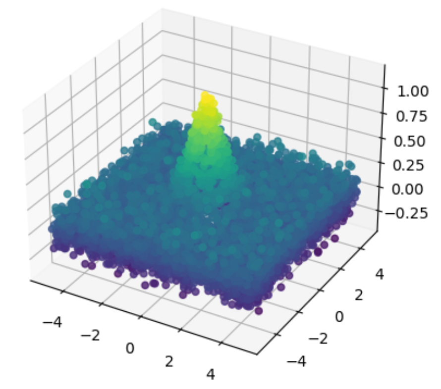

# Practice Problem Set 2 Solutions

## Problem 1

A fair six-sided die is rolled twice. What is the conditional probability that the first roll showed a 2, given that the sum of the two rolls is 6?

(a) $\frac{1}{6}$

(b) $\frac{1}{5}$

(c) $\frac{3}{11}$

(d) $\frac{2}{5}$

**Correct answers:** (b)

**Explanation:** (B) $\frac{1}{5}$. There are five equally likely ways for two die to sum to 6: (1,5), (2,4), (3,3), (4,2), (5,1). Among them, one option (2,4) had a first roll of 2. Therefore the conditional probability that the first roll showed a 2, given that the sum of the two rolls is 6, is $\frac{1}{5}$.

## Problem 2

If matrix A has distinct eigenvalues, what can be said about its eigenvectors?

(a) The eigenvectors form a linearly independent set

(b) The eigenvalues are orthogonal to each other

(c) A must be positive semi-definite

(d) None of the above

**Correct answers:** (a)

**Explanation:** (a) was the intended answer, the answer choice is vague and should have specified that the eigenvectors that correspond to the distinct eigenvalues form a linearly independent set. Thus, option (d) is acceptable as well.

## Problem 3

In the context of multi-class logistic regression, which statement most accurately describes the decision boundaries?

(a) They are linear and distinctly separate distinct classes.

(b) They are non-linear and may overlap.

(c) They remain unchanged, regardless of any transformations of the data.

(d) They may be linear or non-linear, depending on the distribution of the data.

**Correct answers:** (a)

**Explanation:** A. In multi-class logistic regression, the decision boundaries are linear and do not overlap.

## Problem 4

Which of the following is true about linear and logistic regression?

(a) Both models output a probability distribution.

(b) Both models are good choices for regression classes of problems.

(c) Both models are good choices for classification.

**Correct answers:** (c)

**Explanation:** Least squares linear regression is a good way to train classification models—see homework 1.
Note: this question was thrown out during Autumn 2023, since the option choice (b) was unclear.

## Problem 5

Suppose you train a binary classifier in which the final two layers of your model are a ReLU activation followed by a sigmoid activation. How will this affect the domain of your final predictions?

(a) This will cause all predictions to be positive.

(b) This will have no effect on the distribution of predictions.

(c) This will cause cause all predictions to be negative.

(d) None of the above.

**Correct answers:** (a)

## Problem 6

You are tasked with building a regression model to predict whether an email is spam [label=1] or not spam [label=0] based on various features. You are debating using linear or logistic regression. What type of regression is most suitable and why?

(a) Linear regression, because it is optimized for learning the influence of multiple features.

(b) Linear regression, because logistic regression cannot predict the comparative magnitude of the likelihood that an email is spam.

(c) Logistic regression, because it models the probability of an instance belonging to a particular class.

(d) Logistic regression, because it allows for complex non-linear interactions between features and thus will be more accurate.

**Correct answers:** (c)

**Explanation:** Logistic regression is best suited for binary classification because it maps any real-valued number to the range $[0, 1]$, making it suitable for representing probabilities, like the likelihood of an email being spam.

## Problem 7

Which of the following matrices represents some kernel function $K: X \times X \to \mathbb{R}$ evaluated on two points?

(a) $\begin{bmatrix} 1 & 0 \\ 0 & -1 \end{bmatrix}$

(b) $\begin{bmatrix} 1 & 3 \\ 3 & 1 \end{bmatrix}$

(c) $\begin{bmatrix} 1 & -1 \\ 1 & 1 \end{bmatrix}$

(d) $\begin{bmatrix} 2 & -1 \\ -1 & 2 \end{bmatrix}$

**Correct answers:** (d)

**Explanation:** d is the only PSD matrix which is necessary and sufficient.

## Problem 8

Consider kernel ridge regression
$$\hat{w} = \operatorname{argmin}_w \frac{1}{n} \sum_{i=1}^n (y_i - w^T \phi(x_i))^2 + \lambda ||w||^2$$
where $\phi : \mathbb{R}^d \rightarrow \mathbb{R}^q$ denotes the feature mapping and $d \neq q$, and $K_{i,j} := \langle \phi(x_i), \phi(x_j) \rangle$ denotes the entry $(i,j)$ in the kernel matrix $K$. Which of the following statements are true? Select all that apply.

(a) The optimal $\hat{w}$ is always a linear combination of $x_i$'s for $i = 1, 2, ..., n$.

(b) The optimal $\hat{\alpha}$ is $\hat{\alpha} = (KK^T + \lambda I)^{-1}Y$.

(c) The kernel method will still work even if the feature mapping is not one-to-one.

(d) If $K$ is positive semi-definite, then we can find a solution even when $\lambda = 0$.

**Correct answers:** (c), (d)

## Problem 9

The bootstrap method cannot be used to estimate the distribution of which of the following statistics?

(a) Mean

(b) Median

(c) Variance

(d) The bootstrap method can be applied to all of the above statistics.

**Correct answers:** (d)

**Explanation:** The bootstrap method can be applied to the mean, median, or variance.

## Problem 10

True/False: Bootstrapping is a resampling technique that involves generating multiple datasets of size $d$ by randomly sampling observations without replacement from the original dataset of size $n$ (where $d \ll n$). True/False: Bootstrapping can be computationally prohibitive for large datasets.

(a) True, False

(b) True, True

(c) False, True

(d) False, False

**Correct answers:** (c)

**Explanation:** Note: During exam, a note was added that "prohibitive" here means "too computationally expensive to be useful."

## Problem 11

Which of the following statements best describes the differences between Random Forests and Boosting in the context of decision tree-based ensemble methods?

(a) Random Forests and Boosting both reduce variance by averaging multiple deep decision trees, with no significant differences in their approach.

(b) In Random Forests, trees are built independently using bagging, while Boosting builds trees sequentially, with each tree learning from the errors of the previous ones.

(c) Boosting reduces bias by building shallow trees, whereas Random Forests use deep trees to address variance and do not focus on reducing bias.

(d) Both Random Forests and Boosting are identical in their handling of bias and variance, differing only in computational efficiency.

**Correct answers:** (b)

**Explanation:** B. In Random Forests, trees are built independently using bagging, while Boosting builds trees sequentially, with each tree learning from the errors of the previous ones.

## Problem 12

Which of the following statements is true about a single Decision Tree and Random Forest?

(a) Random Forest has lower training error because it aggregates multiple trees

(b) A good Random Forest is composed of decision trees that are highly correlated

(c) Random Forest is useful because it's easy to explain how a decision is made

(d) A single Decision Tree can result in comparably low training error in classification task compared to Random Forest

**Correct answers:** (d)

## Problem 13

How is the performance of a distance-based machine learning model typically impacted when the data dimensionality is very high?

(a) The performance significantly improves because there are more distinguishing features.

(b) The performance decreases because the data points tend to appear equidistant in high-dimensional space.

(c) The computational complexity of the distance calculations is reduced.

(d) The performance remains unaffected as high-dimensionality uniformly impacts the positional relationships among the data points.

**Correct answers:** (b)

**Explanation:** B. As the number of dimensions increases, the contrast between the nearest and farthest point from a given reference point tends to decrease, making it challenging for a distance-based model to discern between meaningful and uninformative patterns in the data.

## Problem 14

Which of the following is true about selecting $k=1$ for a $k$-nearest neighbors model of high dimensional data?

(a) $k=1$ will make the model more sensitive to noise in the data.

(b) $k=1$ will more accurately represent the real world distribution because it is more specific.

(c) $k=1$ is a good option because it will lead to the highest number of different groupings, to match the high dimensionality of the data.

(d) $k=1$ means that there will only be one grouping.

**Correct answers:** (a)

**Explanation:** $k = 1$ means that each data point receives its own classification rule. Thus, the model will learn to predict noise in the data, and have a very high variance, because the rules it learns will be highly dependent on randomness in the training data.

## Problem 15

Which of the following is true about `k-means` clustering?

(a) `k-means` diverges and is non-convex.

(b) `k-means` diverges and is convex.

(c) `k-means` converges and is non-convex.

(d) `k-means` converges and is convex.

**Correct answers:** (c)

**Explanation:** The `k-means` algorithm converges but is not convex; `k-means` can get stuck at a local minima given an unlucky initialization.

## Problem 16

In which of the following plots are the points clustered by `k-means` clustering?


(a) Plot (a)

(b) Plot (b)

**Correct answers:** (b)

**Explanation:** Plot (b) shows the clustering that would result from k-means, where the algorithm divides the data into two clusters based on the geometric center of the data points, resulting in a horizontal division rather than following the natural crescent shapes of the data.

## Problem 17

17. What is the main purpose of the softmax activation function in the output layer of a neural network?

(a) To introduce non-linearity.

(b) To normalize the output to represent probabilities.

(c) To speed up convergence during training.

(d) To prevent overfitting.

**Correct answers:** (b)

## Problem 18

18. Consider a fully-connected neural network with 3 input neurons, 4 hidden neurons, and 2 output neurons. What is the total number of parameters, including bias units for non-input layers?

(a) 9

(b) 11

(c) 24

(d) 26

**Correct answers:** (d)

**Explanation:** From the input layer to the hidden layer, you have 3 neurons fully connected to 4 neurons, which gives us $3 \cdot 4 = 12$ weights. Plus, there are 4 neurons in the hidden layer, which means there are 4 biases. So, for the first connection, there are $12+4 = 16$ parameters. From the hidden layer to the output layer, you have 4 neurons fully connected to 2 neurons, which gives us $4 \cdot 2 = 8$ weights. Plus, there are 2 neurons in the output layer, which means there are 2 biases. So, for the second connection, there are $8+2 = 10$ parameters. In total, we have $16+10 = 26$ parameters.

## Problem 19

19. Which of the following will guarantee that a neural network does not overfit to the training data during training?

(a) Normalize the data before training.

(b) Increase the number of layers in our network until the final training loss stops decreasing.

(c) Neither of the above.

**Correct answers:** (c)

## Problem 20

20. Given a simple two-layer neural network:

*   Weights from input to hidden layer: $W^{(1)} = \begin{bmatrix} w_{11}^{(1)} & w_{12}^{(1)} \\ w_{21}^{(1)} & w_{22}^{(1)} \end{bmatrix}$, Bias for hidden layer: $[b_1^{(1)}, b_2^{(1)}]$, Activation function: $\sigma(z) = \frac{1}{1+e^{-z}}$
*   Weights from hidden to output layer: $W^{(2)} = [w_1^{(2)}, w_2^{(2)}]$, Bias for output layer: $b^{(2)}$, Activation function: $\sigma(z) = \frac{1}{1+e^{-z}}$
*   Target output: $y$; predicted output: $\hat{y}$
*   Loss function: $\frac{1}{2}(y-\hat{y})^2$

After performing a forward pass with input $[x_1, x_2]$ and computing the loss, you execute a backward pass to calculate the gradients of the loss with respect to the weights and biases. What are the correct gradients for the weight, $w_{11}^{(1)}$, after one round of backpropagation?

Hint: Use chain rule to compute the gradients for $W^{(2)}$ and $W^{(1)}$. $\sigma'(z)$ is $\sigma(z) \cdot (1-\sigma(z))$.

(a) $\frac{\partial Loss}{\partial w_{11}^{(1)}} = (y - \hat{y})^2 \cdot w_1^{(2)} \cdot \sigma'(z_1^{(1)}) \cdot x_1$

(b) $\frac{\partial Loss}{\partial w_{11}^{(1)}} = (y - \hat{y}) \cdot \hat{y} \cdot w_1^{(2)} \cdot \sigma'(z_1^{(1)}) \cdot x_1$

(c) $\frac{\partial Loss}{\partial w_{11}^{(1)}} = (y - \hat{y}) \cdot \hat{y} \cdot (1 - \hat{y}) \cdot w_1^{(2)} \cdot \sigma'(z_1^{(1)}) \cdot x_1$

(d) $\frac{\partial Loss}{\partial w_{11}^{(1)}} = (y - \hat{y}) \cdot x_1$

**Correct answers:** (c)

**Explanation:** Gradient of Loss w.r.t. Output Layer Weights $W^{(2)}$: $\frac{\partial Loss}{\partial W^{(2)}}$

Using chain rule, $\frac{\partial Loss}{\partial \hat{y}} \cdot \frac{\partial \hat{y}}{\partial z^{(2)}} \cdot \frac{\partial z^{(2)}}{\partial W^{(2)}} = (y - \hat{y}) \cdot (-1) \cdot \hat{y} \cdot (1 - \hat{y}) \cdot a^{(1)}$

Gradient of Loss w.r.t. Hidden Layer Weights $W^{(1)}$:

For each weight $w_{ij}^{(1)}$, $\frac{\partial Loss}{\partial w_{ij}^{(1)}}$ Using chain rule, $\frac{\partial Loss}{\partial \hat{y}} \cdot \frac{\partial \hat{y}}{\partial z^{(2)}} \cdot \frac{\partial z^{(2)}}{\partial a^{(1)}} \cdot \frac{\partial a^{(1)}}{\partial z^{(1)}} \cdot \frac{\partial z^{(1)}}{\partial w_{ij}^{(1)}}$

For $w_{11}^{(1)}$: $(y - \hat{y}) \cdot (-1) \cdot \hat{y} \cdot (1 - \hat{y}) \cdot w_1^{(2)} \cdot \sigma'(z_1^{(1)}) \cdot x_1$

## Problem 21

21. Which of the following statement is true about the following code snippet?

```python
for i in range(epochs):
    loss = 0
    correct_labels = 0
    total_labels = 0

    for batch in tqdm(train_dataloader):
        images, labels = batch
        images, labels = images.to(device), labels.to(device)

        optimizer.zero_grad()
        y_hat = model(images) # (a)
        batch_loss = F.cross_entropy(y_hat, labels) # (b)
        batch_loss.backward() # (c)
        optimizer.step() # (d)
```

(a) Step (a) completes the forward pass in backward propagation.

(b) Step (b) calculates the batch loss using a loss function that consists of its own trainable parameters, and weighs each sample differently based on those parameters.

(c) Step (c) never changes the weight parameters of any previous layer.

(d) Step (d) by itself performs the stochastic gradient descent by calculating the gradients and updating parameterized weights (you may assume we are using torch.optim.SGD for optimizer).

**Correct answers:** (c)

## Problem 22

22. Which of the follow is true about using backpropagation to train a neural network using a package such as PyTorch or TensorFlow?

(a) You need to create a method that computes the gradient of each node of your neural network to call in the backpropagation step.

(b) Automatic differentiation executed by these packages takes advantage of the fact that the gradients of most functions can be pre-computed.

(c) The back-propagation executed by these packages is the process of computing the derivative of the nodes of a neural network starting with the first node at the beginning of the network and then proceeding to the next node(s).

(d) These packages fail on models with ReLU layers because the ReLU function is not differentiable everywhere, and thus the packages cannot execute backpropagation.

**Correct answers:** (b)

## Problem 23

23. How is Singular Value Decomposition (SVD) typically utilized in image compression?

(a) Selecting important pixels

(b) Discarding low-rank components

(c) Enhancing color information

(d) Increasing image resolution

**Correct answers:** (b)

## Problem 24

24. In the context of image processing, which of the following will directly impact the total number of trainable weights in a convolutional layer of a convolutional neural network (CNN)?

(a) The resolution of the input image

(b) The kernel size of the layer

(c) The stride of the layer

(d) The amount of padding used

**Correct answers:** (b)

## Problem 25

25. What is the key advantage of using Gaussian Mixture Models (GMMs) over $k$-means clustering for data clustering tasks?

(a) GMMs are computationally more efficient than $k$-means and are better suited for large datasets due to their simpler calculations.

(b) GMMs, unlike $k$-means, can automatically determine the optimal number of clusters in a dataset without requiring this as an input parameter.

(c) GMMs can model complex cluster shapes and densities, accommodating elliptical shapes, as they do not assume clusters to be spherical like $k$-means.

(d) GMMs inherently handle missing data and noise better than $k$-means due to their probabilistic approach, which accounts for uncertainty in the data.

**Correct answers:** (c)

## Problem 26

26. Which of the following statements are true? Select all that apply.

(a) The sum of two convex functions is always convex.

(b) The sum of two concave functions is always concave.

(c) The sum of a convex and concave function is always concave.

**Correct answers:** (a), (b)

## Problem 27

27. Which of the following is **not** true about an arbitrary convex function $f: \mathbb{R} \to \mathbb{R}$ without any other assumptions? Select all that apply.

(a) For all $x \in \mathbb{R}$, $f''(x) \ge 0$

(b) The set
$$ \{(x, y) \in \mathbb{R}^2 \mid y \ge f(x)\} $$
is convex

(c) If $c$ is a subgradient of $f$ at $x$, then for all $y \in \mathbb{R}$:
$$ f(y) \ge f(x)+c(y - x) $$

(d) $f$ cannot be concave

**Correct answers:** (a), (d)

**Explanation:** a is not true in general since we don't know that the second derivative exists; d is not true (e.g. $f(x) = x$)

## Problem 28

28. Suppose $f(x) = ax^2 + bx + c$, where $a, b, c \in \mathbb{R}$. Which of the following statements are true about the convexity of $f$?

(a) $f$ is always convex since it is a polynomial.

(b) $f$ is convex only when $a > 0, b > 0$, and $c > 0$.

(c) If $a > 0$ then $f$ is convex.

(d) If $a = 0$ then $f$ is never convex.

**Correct answers:** (c)

## Problem 29

29. Given this 3-D scatter plot, which of the following basis functions would you use for linear regression?



(a) $\phi(x, y) = \begin{bmatrix} 1 \\ x \\ y \\ xy \\ x^2 \\ y^2 \end{bmatrix}$

(b) $\phi(x, y) = \begin{bmatrix} e^{-x^2} \\ e^{-y^2} \\ e^{-(x^2+y^2)} \end{bmatrix}$

(c) $\phi(x, y) = \begin{bmatrix} \cos(x) \\ \cos(y) \end{bmatrix}$

(d) $\phi(x, y) = \begin{bmatrix} \sin(x) \\ \sin(y) \end{bmatrix}$

**Correct answers:** (b)

## Problem 30

30. Suppose that we want to train a predictor $\hat{f}(x) = \hat{w}^T x$ and we assume that $y = w^T x + \epsilon$, where $\epsilon \sim N(0, \sigma^2)$. Which of the following statements about bias-variance tradeoff is true?

(a) (bias$^2$ + variance) is equal to the expected error between our trained predictor $\hat{f}(x)$ and the true data points ($y$'s).

(b) Regularization is usually used to increase the variance of our trained predictor $\hat{f}(x)$.

(c) Irreducible error comes from the variance of the data points $y$'s.

**Correct answers:** (c)

**Explanation:** Scatter plot is a Gaussian centered at 0 so b is correct

## Problem 31

31. Consider a dataset $x_1, x_2, ..., x_n$ drawn from a normal distribution $N(\mu, \sigma^2)$, with the density function given by $f(x|\mu, \sigma^2) = \frac{1}{\sqrt{2\pi\sigma^2}} \exp\left(-\frac{(x-\mu)^2}{2\sigma^2}\right)$. Which of the following is true about the maximum likelihood estimation of $\mu$ and $\sigma^2$?

(a) The MLE for both $\mu$ and $\sigma^2$ cannot be determined without additional information.

(b) The MLE of $\mu$ is the sample mean $\bar{x} = \frac{1}{n} \sum_{i=1}^n x_i$, but the MLE of $\sigma^2$ cannot be determined without additional information.

(c) The MLE of $\mu$ is the sample mean, $\bar{x} = \frac{1}{n} \sum_{i=1}^n x_i$, and the MLE of $\sigma^2$ is the sample variance, $s^2 = \frac{1}{n-1} \sum_{i=1}^n (x_i - \bar{x})^2$.

(d) The MLE of $\mu$ is the sample mean, $\bar{x} = \frac{1}{n} \sum_{i=1}^n x_i$, and the MLE of $\sigma^2$ is given by $s^2 = \frac{1}{n} \sum_{i=1}^n (x_i - \bar{x})^2$.

**Correct answers:** (d)

**Explanation:** The maximum likelihood estimator for $\mu$ in a normal distribution is the sample mean, $\bar{x}$. However, the MLE for $\sigma^2$ is a biased estimator and is given by $\frac{1}{n} \sum_{i=1}^n (x_i - \bar{x})^2$. This is because MLE does not divide by $n-1$ (as in the unbiased sample variance formula) but by $n$, which makes it biased.

## Problem 32

32. In k-fold cross-validation, what is the primary advantage of setting k to a higher value (e.g., k=10) compared to a lower value (e.g., k=2)?

(a) It increases the accuracy of the model on unseen data.

(b) It provides a more reliable estimate of model performance.

(c) It reduces computational time.

(d) It eliminates the need for a separate test set.

**Correct answers:** (b)

## Problem 33

33. Which of the following statements is true for ridge regression if the regularization parameter is too large?

(a) The loss function will be the same as the ordinary least squares loss function.

(b) The loss function will be the same as the Lasso regression loss function.

(c) Large coefficients will not be penalized.

(d) The model will overfit the data.

(e) The model will underfit the data.

**Correct answers:** (e)

## Problem 34

34. Consider a binary classification task, where $\hat{y}$ denotes the prediction and $y = +1$ or $y=-1$. Briefly describe the strength of minimizing logistic loss as opposed to 0-1 loss and sigmoid loss. The losses are formally defined as

$$0-1 \text{ loss}(\hat{y}, y) = \begin{cases} 0 & \text{if sign}(y) = \text{sign}(\hat{y}) \\ 1 & \text{otherwise} \end{cases}$$

$$\text{logistic loss}(\hat{y}, y) = \log(1+\exp(-y\hat{y}))$$

$$\text{sigmoid loss}(\hat{y}, y) = \frac{1}{1 + \exp(y\hat{y})}$$

The followings are example plots of each loss when $y = +1$.


(Image of three plots: "0-1 loss" (step function), "logistic loss" (decreasing curve), "sigmoid loss" (decreasing curve))

Strength of logistic loss compared to 0-1 loss:

Strength of logistic loss compared to sigmoid loss:

**Explanation:**
Possible strength compared to 0-1 loss: Differentiable everywhere
Possible strength compared to sigmoid loss: Convexity

## Problem 35

35. Name one advantage and one disadvantage of applying $k$-nearest neighbors for classification.

Advantage:

Disadvantage:

**Explanation:**
Possible advantages: no training, simple non-parametric. Possible disadvantages: need to store training data for inference, curse of dimensionality.

