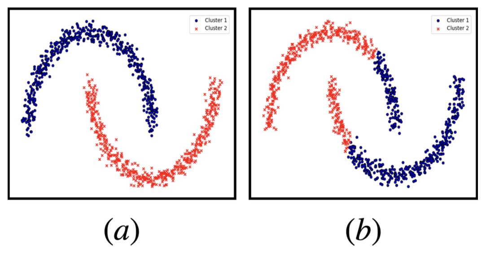

# Practice Problem Set 2 Solutions

## Problem 1

A fair six-sided die is rolled twice. What is the conditional probability that the first roll showed a 2, given that the sum of the two rolls is 6?

(a) $\frac{1}{6}$

(b) $\frac{1}{5}$

(c) $\frac{3}{11}$

(d) $\frac{2}{5}$

**Correct answers:** (b)

**Explanation:** (B) $\frac{1}{5}$. There are five equally likely ways for two die to sum to 6: (1,5), (2,4), (3,3), (4,2), (5,1). Among them, one option (2,4) had a first roll of 2. Therefore the conditional probability that the first roll showed a 2, given that the sum of the two rolls is 6, is $\frac{1}{5}$.

## Problem 2

If matrix A has distinct eigenvalues, what can be said about its eigenvectors?

(a) The eigenvectors form a linearly independent set

(b) The eigenvalues are orthogonal to each other

(c) A must be positive semi-definite

(d) None of the above

**Correct answers:** (a)

**Explanation:** (a) was the intended answer, the answer choice is vague and should have specified that the eigenvectors that correspond to the distinct eigenvalues form a linearly independent set. Thus, option (d) is acceptable as well.

## Problem 3

In the context of multi-class logistic regression, which statement most accurately describes the decision boundaries?

(a) They are linear and distinctly separate distinct classes.

(b) They are non-linear and may overlap.

(c) They remain unchanged, regardless of any transformations of the data.

(d) They may be linear or non-linear, depending on the distribution of the data.

**Correct answers:** (a)

**Explanation:** A. In multi-class logistic regression, the decision boundaries are linear and do not overlap.

## Problem 4

Which of the following is true about linear and logistic regression?

(a) Both models output a probability distribution.

(b) Both models are good choices for regression classes of problems.

(c) Both models are good choices for classification.

**Correct answers:** (c)

**Explanation:** Least squares linear regression is a good way to train classification models—see homework 1.
Note: this question was thrown out during Autumn 2023, since the option choice (b) was unclear.

## Problem 5

Suppose you train a binary classifier in which the final two layers of your model are a ReLU activation followed by a sigmoid activation. How will this affect the domain of your final predictions?

(a) This will cause all predictions to be positive.

(b) This will have no effect on the distribution of predictions.

(c) This will cause cause all predictions to be negative.

(d) None of the above.

**Correct answers:** (a)

## Problem 6

You are tasked with building a regression model to predict whether an email is spam [label=1] or not spam [label=0] based on various features. You are debating using linear or logistic regression. What type of regression is most suitable and why?

(a) Linear regression, because it is optimized for learning the influence of multiple features.

(b) Linear regression, because logistic regression cannot predict the comparative magnitude of the likelihood that an email is spam.

(c) Logistic regression, because it models the probability of an instance belonging to a particular class.

(d) Logistic regression, because it allows for complex non-linear interactions between features and thus will be more accurate.

**Correct answers:** (c)

**Explanation:** Logistic regression is best suited for binary classification because it maps any real-valued number to the range $[0, 1]$, making it suitable for representing probabilities, like the likelihood of an email being spam.

## Problem 7

Which of the following matrices represents some kernel function $K: X \times X \to \mathbb{R}$ evaluated on two points?

(a) $\begin{bmatrix} 1 & 0 \\ 0 & -1 \end{bmatrix}$

(b) $\begin{bmatrix} 1 & 3 \\ 3 & 1 \end{bmatrix}$

(c) $\begin{bmatrix} 1 & -1 \\ 1 & 1 \end{bmatrix}$

(d) $\begin{bmatrix} 2 & -1 \\ -1 & 2 \end{bmatrix}$

**Correct answers:** (d)

**Explanation:** d is the only PSD matrix which is necessary and sufficient.

## Problem 8

Consider kernel ridge regression
$$\hat{w} = \operatorname{argmin}_w \frac{1}{n} \sum_{i=1}^n (y_i - w^T \phi(x_i))^2 + \lambda ||w||^2$$
where $\phi : \mathbb{R}^d \rightarrow \mathbb{R}^q$ denotes the feature mapping and $d \neq q$, and $K_{i,j} := \langle \phi(x_i), \phi(x_j) \rangle$ denotes the entry $(i,j)$ in the kernel matrix $K$. Which of the following statements are true? Select all that apply.

(a) The optimal $\hat{w}$ is always a linear combination of $x_i$'s for $i = 1, 2, ..., n$.

(b) The optimal $\hat{\alpha}$ is $\hat{\alpha} = (KK^T + \lambda I)^{-1}Y$.

(c) The kernel method will still work even if the feature mapping is not one-to-one.

(d) If $K$ is positive semi-definite, then we can find a solution even when $\lambda = 0$.

**Correct answers:** (c), (d)

## Problem 9

The bootstrap method cannot be used to estimate the distribution of which of the following statistics?

(a) Mean

(b) Median

(c) Variance

(d) The bootstrap method can be applied to all of the above statistics.

**Correct answers:** (d)

**Explanation:** The bootstrap method can be applied to the mean, median, or variance.

## Problem 10

True/False: Bootstrapping is a resampling technique that involves generating multiple datasets of size $d$ by randomly sampling observations without replacement from the original dataset of size $n$ (where $d \ll n$). True/False: Bootstrapping can be computationally prohibitive for large datasets.

(a) True, False

(b) True, True

(c) False, True

(d) False, False

**Correct answers:** (c)

**Explanation:** Note: During exam, a note was added that "prohibitive" here means "too computationally expensive to be useful."

## Problem 11

Which of the following statements best describes the differences between Random Forests and Boosting in the context of decision tree-based ensemble methods?

(a) Random Forests and Boosting both reduce variance by averaging multiple deep decision trees, with no significant differences in their approach.

(b) In Random Forests, trees are built independently using bagging, while Boosting builds trees sequentially, with each tree learning from the errors of the previous ones.

(c) Boosting reduces bias by building shallow trees, whereas Random Forests use deep trees to address variance and do not focus on reducing bias.

(d) Both Random Forests and Boosting are identical in their handling of bias and variance, differing only in computational efficiency.

**Correct answers:** (b)

**Explanation:** B. In Random Forests, trees are built independently using bagging, while Boosting builds trees sequentially, with each tree learning from the errors of the previous ones.

## Problem 12

Which of the following statements is true about a single Decision Tree and Random Forest?

(a) Random Forest has lower training error because it aggregates multiple trees

(b) A good Random Forest is composed of decision trees that are highly correlated

(c) Random Forest is useful because it's easy to explain how a decision is made

(d) A single Decision Tree can result in comparably low training error in classification task compared to Random Forest

**Correct answers:** (d)

## Problem 13

How is the performance of a distance-based machine learning model typically impacted when the data dimensionality is very high?

(a) The performance significantly improves because there are more distinguishing features.

(b) The performance decreases because the data points tend to appear equidistant in high-dimensional space.

(c) The computational complexity of the distance calculations is reduced.

(d) The performance remains unaffected as high-dimensionality uniformly impacts the positional relationships among the data points.

**Correct answers:** (b)

**Explanation:** B. As the number of dimensions increases, the contrast between the nearest and farthest point from a given reference point tends to decrease, making it challenging for a distance-based model to discern between meaningful and uninformative patterns in the data.

## Problem 14

Which of the following is true about selecting $k=1$ for a $k$-nearest neighbors model of high dimensional data?

(a) $k=1$ will make the model more sensitive to noise in the data.

(b) $k=1$ will more accurately represent the real world distribution because it is more specific.

(c) $k=1$ is a good option because it will lead to the highest number of different groupings, to match the high dimensionality of the data.

(d) $k=1$ means that there will only be one grouping.

**Correct answers:** (a)

**Explanation:** $k = 1$ means that each data point receives its own classification rule. Thus, the model will learn to predict noise in the data, and have a very high variance, because the rules it learns will be highly dependent on randomness in the training data.

## Problem 15

Which of the following is true about `k-means` clustering?

(a) `k-means` diverges and is non-convex.

(b) `k-means` diverges and is convex.

(c) `k-means` converges and is non-convex.

(d) `k-means` converges and is convex.

**Correct answers:** (c)

**Explanation:** The `k-means` algorithm converges but is not convex; `k-means` can get stuck at a local minima given an unlucky initialization.

## Problem 16

In which of the following plots are the points clustered by `k-means` clustering?

(a) Plot (a)

(b) Plot (b)

**Correct answers:** (b)

**Explanation:** Plot (b) shows the clustering that would result from k-means, where the algorithm divides the data into two clusters based on the geometric center of the data points, resulting in a horizontal division rather than following the natural crescent shapes of the data.
