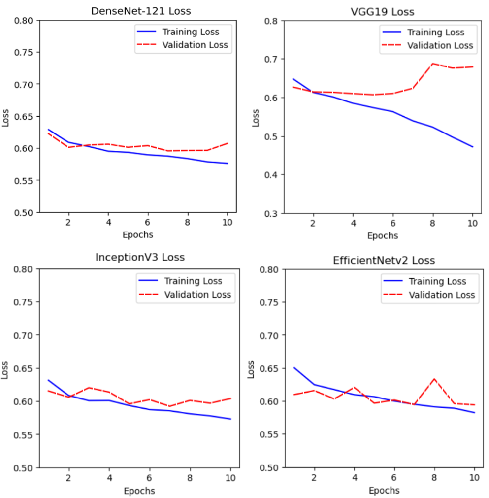
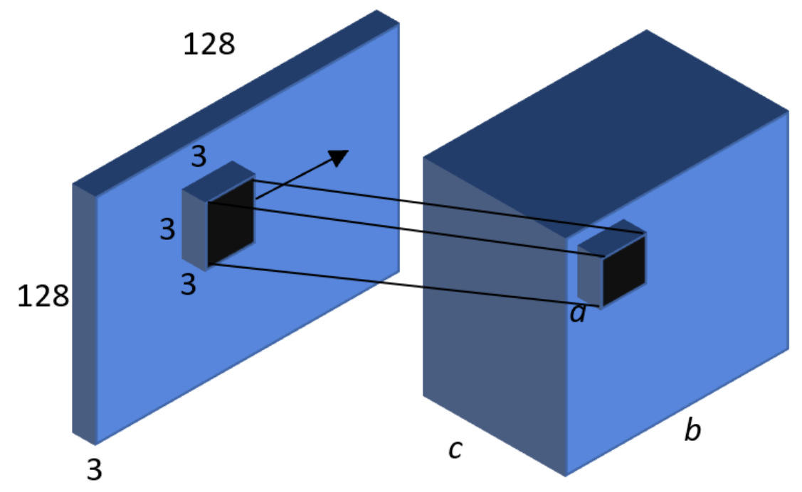

# Problem Set 3

## Problem 1

If we have $n$ data points and $d$ features, we store $nd$ values in total. We can use principal component analysis to store an approximate version of this dataset in fewer values overall. If we use the first $q$ principal components of this data, how many values do we need to approximate the original demeaned dataset? Justify your answer.

## Problem 2

Suppose we have a multilayer perceptron (MLP) model with 17 neurons in the input layer, 25 neurons in the hidden layer and 10 neuron in the output layer. What is the size of the weight matrix between the hidden layer and output layer?

(a) $25 \times 17$

(b) $10 \times 25$

(c) $25 \times 10$

(d) $17 \times 10$

## Problem 3

Recall that a kernel function $K(x,x')$ is a metric of the similarity between two input feature vectors $x$ and $x'$. In order to be a valid kernel function, $K(x,x') = \phi(x)^T \phi(x')$ for some arbitrary feature mapping function $\phi(x)$. Which of the following is **not** a valid kernel function for input features $x, x' \in \mathbb{R}^2$?

(a) $(x^T x')^2$

(b) $3x^T x'$

(c) $x^T x'$

(d) All of the above are valid

## Problem 4

Consider the following figure. Which shape is not convex?

(a) I.

(b) II.

(c) III.

(d) IV.

## Problem 5

What is the typical effect of increasing the penalty ($\lambda$) in the ridge regression loss function? Select all that apply.

(a) It increases the bias of the model.

(b) It decreases the bias of the model.

(c) It increases the variance of the model.

(d) It decreases the variance of the model.

## Problem 6

Suppose we are performing linear regression using a non-linear basis expansion $\Phi$. Which of the following statements is true about the learned predictor?

(a) It is a linear function of the inputs and a linear function of the weights.

(b) It is a linear function of the inputs and a non-linear function of the weights.

(c) It is a non-linear function of the inputs and a linear function of the weights.

(d) It is a non-linear function of the inputs and a non-linear function of the weights.

## Problem 7

Which of the following is true about the k-nearest neighbors (KNN) algorithm?

(a) It is a parametric model.

(b) It learns a nonlinear decision boundary between classes.

(c) It requires a separate training phase and testing phase for prediction.

(d) It typically requires longer training compared to other ML algorithms.

## Problem 8

Which of the following statements about the first principal component is true?

(a) If we add Gaussian noise to a feature in the input matrix $X$, the first principal component remains unchanged.

(b) The first principal component is equivalent to the eigenvector corresponding to the largest eigenvalue of the input matrix $X$.

(c) The first principal component is the vector direction which maximizes the variance of the input.

(d) The first principal component corresponds to the most influential feature for prediction.

## Problem 9

Leave-one-out cross-validation (LOOCV) is a special case of k-fold cross-validation where:

(a) The training set contains all but one sample, and the remaining sample is used for testing.

(b) The training set contains only one sample, and the remaining sample is used for testing.

(c) The training set contains exactly one sample from each class, and the remaining samples are used for testing.

(d) The training set contains one sample from each fold, and the remaining folds are used for testing.

## Problem 10

Which of the following statements accurately compare or contrast bootstrapping and cross-validation? Select all that apply.

(a) Bootstrapping and cross-validation both train models on subsets of the training data.

(b) In cross-validation, there is no overlap between the subsets each model trains on.

(c) Bootstrapping and cross-validation are both methods to estimate prediction error.

(d) In bootstrapping, each model is trained on the same number of data points as the original training set, unlike cross-validation.

(e) In cross-validation, each learned model is evaluated on non-overlapping subsections of the original training set, unlike bootstrapping.

## Problem 11

Which of the following are true about a twice-differentiable function $f: \mathbb{R}^d \to \mathbb{R}$? Select all that apply.

(a) $f$ is convex if $f(\lambda x + (1-\lambda)y) \le \lambda f(x) + (1-\lambda)f(y)$ for all $x, y$ in the domain of $f$ and $\lambda \in [0, 1]$.

(b) $f$ is convex if $\nabla^2 f(x) \ge 0$ for all $x$ in the domain of $f$.

(c) $f$ is convex if the set $\{(x, t) \in \mathbb{R}^{d+1} : f(x) \le t\}$ is convex.

## Problem 12

Which of the following statements about random forests are true? Select all that apply.

(a) Random forests reduce overfitting by aggregating predictions from multiple trees.

(b) Random forests reduce overfitting by having each tree in the forest use a subset of all the data features.

(c) Random forests can handle a larger number of features compared to individual decision trees.

(d) Random forests provide better interpretability and understanding of the underlying relationships in the data than individual decision trees.

## Problem 13

Consider a training dataset with samples $(x_i, y_i)$, where $x_i \in \mathbb{R}^d$ and $y_i \in \{0,1\}$. Suppose that $P_X$ is supported everywhere in $\mathbb{R}^d$ and $P(Y=1 | X=x)$ is smooth everywhere. Which of the following statements is true about 1-nearest neighbor classification as the number of training samples $n \rightarrow \infty$?

(a) The error of 1-NN classification approaches infinity.

(b) The error of 1-NN classification is at most twice the Bayes error rate.

(c) The error of 1-NN classification is at most the Bayes error rate.

(d) The error of 1-NN classification approaches zero.

## Problem 14

Which of the following statements about Pooling layers in convolutional neural networks (CNNs) are true? Select all that apply.

(a) A $2 \times 2$ pooling layer has 4 parameters.

(b) Pooling layers never change the height and width of the output image.

(c) For a max-pooling layer, the gradients with respect to some inputs will always be zero.

(d) Pooling layers do not change the depth of the output image.

## Problem 15

Which of the following statements about SVMs are true? Select all that apply.

(a) SVMs are only applicable to binary classification problems.

(b) SVMs cannot be applied to non-linearly separable data.

(c) SVMs are a form of supervised learning.

(d) SVMs are primarily used for regression tasks.

## Problem 16

In Gaussian mixture models (GMMs), which of the following statements is false?

(a) GMMs assume that the data points within each component follow a Gaussian distribution.

(b) GMMs can be used for clustering.

(c) The number of components in a GMM must be equal to the number of features in the dataset.

## Problem 17

True/False: If $X$ is a matrix in $\mathbb{R}^{n \times m}$, $X^T X$ is always invertible.

(a) True

(b) False

## Problem 18

Consider the dataset pictured below. The features of each datapoint are given by its position. So the datapoint $(0,1)$ appears at position $(0,1)$. The ground truth label of the datapoint is given by its shape, either a circle or square. You have a test set of datapoints, shown with no fill, and a train set of data, shown with a grey fill.

**Dataset Visualization:**
A 2D scatter plot with horizontal and vertical axes intersecting at the origin.
- **Top-left quadrant:** Contains a grey-filled square labeled "Train" and a white-filled circle labeled "Test".
- **Top-right quadrant:** Contains a grey-filled circle labeled "Train" and a white-filled circle labeled "Test".
- **Bottom-left quadrant:** Contains a grey-filled circle labeled "Train" and a white-filled circle labeled "Test".
- **Bottom-right quadrant:** Contains a grey-filled circle labeled "Train" and a white-filled circle labeled "Test".

True/False: KNN with $K = 1$ has higher train accuracy than with $K = 4$.

(a) True

(b) False

## Problem 19

True/False: Consider the dataset from the previous problem. KNN with $K = 1$ has higher test accuracy than with $K = 4$.

(a) True

(b) False

## Problem 20

Consider two neural networks, A and B, trained on 100x100 images to predict 5 classes.
- Neural network A consists of a single linear layer followed by a softmax output activation.
- Neural network B consists of a sequence of layers with dimensions 128, 512, and 32, respectively, followed by a softmax output activation.

Both networks are trained using an identical procedure (e.g., batch size, learning rate, epochs, etc.), and neither contains hidden activations.

(a) A will outperform B

(b) B will outperform A

(c) A and B will perform roughly the same.

## Problem 21

The probability of seeing data $D$ from a Gaussian distribution is given by:

$P(D|\mu, \sigma) = \left(\frac{1}{\sigma\sqrt{2\pi}}\right)^n \prod_{i=1}^n e^{-\frac{(x_i-\mu)^2}{2\sigma^2}}$

Which of the following statements are true about the MLEs $\hat{\mu}_{MLE}$ and $\hat{\sigma}^2_{MLE}$ from this distribution? Select all that apply.

(a) $\hat{\mu}_{MLE}$ is dependent on $\hat{\sigma}^2_{MLE}$

(b) $\hat{\sigma}^2_{MLE}$ is dependent on $\hat{\mu}_{MLE}$

(c) $\hat{\mu}_{MLE}$ is a biased estimator

(d) $\hat{\sigma}^2_{MLE}$ is a biased estimator

## Problem 22

True/False: The bootstrap method samples a dataset with replacement.

(a) True

(b) False

## Problem 23

What does the PyTorch optimizer's `step()` function do when training neural networks?

(a) Adjust the network's weights based on the gradients

(b) Randomly initializing the network's weights.

(c) Sets all the network's gradients to zero to prepare it for backpropagation

(d) Compute the gradients of the network based on the error between predicted and actual outputs.

## Problem 24

Below is a simple computation graph with inputs $x$ and $y$ with an initial computation of $z = xy$ before the unknown path to final loss $L$. A forward propagation pass has been completed with values $x = 3$ and $y = 4$, and the upstream gradient is given as $\partial L/\partial z = 5$. Complete the backpropagation pass by filling in the scalar answers to boxes $\partial L/\partial x$ and $\partial L/\partial y$.

**Computation Graph:**
- Input $x = 3$ and $y = 4$
- Computation: $z = xy = 12$
- Upstream gradient: $\partial L/\partial z = 5$
- Find: $\partial L/\partial x$ and $\partial L/\partial y$

## Problem 25

What are some ways to reduce overfitting in a neural network?

## Problem 26

True/False: Suppose you set up and train a neural network on a classification task and converge to a final loss value. Keeping everything in the training process the exact same (e.g. learning rate, optimizer, epochs). It is possible to reach a lower loss value by ONLY changing the network initialization.

(a) True

(b) False

## Problem 27

Why should ridge regression not be used for feature selection solely based on coefficient magnitude thresholds?

## Problem 28

4 Deep Neural Network models are trained on a classification task, and below are the plots of their losses:

**DenseNet-121 Loss**

(Plot showing Training Loss (blue solid line) decreasing from ~0.63 to ~0.57, and Validation Loss (red dashed line) decreasing initially from ~0.62 to ~0.60, then slightly increasing to ~0.61 over 10 epochs.)

**VGG19 Loss**

(Plot showing Training Loss (blue solid line) decreasing from ~0.65 to ~0.47, and Validation Loss (red dashed line) decreasing initially from ~0.63 to ~0.61, then increasing significantly from epoch 5 to ~0.68 by epoch 10 over 10 epochs.)

**InceptionV3 Loss**

(Plot showing Training Loss (blue solid line) decreasing from ~0.63 to ~0.57, and Validation Loss (red dashed line) fluctuating but generally staying around ~0.60, with a slight increase towards the end over 10 epochs.)

**EfficientNetv2 Loss**

(Plot showing Training Loss (blue solid line) decreasing from ~0.65 to ~0.58, and Validation Loss (red dashed line) fluctuating significantly but generally staying around ~0.60, with a peak around epoch 8 over 10 epochs.)

Based on these plots, which model is overfitting?

(a) DenseNet-121

(b) VGG19

(c) InceptionV3

(d) EfficientNetv2

## Problem 29

True/False: For k-means clustering, the number of clusters $k$ should be that which minimizes the loss function.

(a) True

(b) False

## Problem 30

We have a convolutional neural network that takes in input of images with dimensions $(3, 128, 128)$. The first convolutional layer (depicted below) has 32 filters each of size $(3,3,3)$ and uses a stride of 2 and padding of 1. One of these filters is shown in the diagram at a specific region of the input as well as the corresponding region of the output. After applying this convolutional layer, what must be the value of $a$, $b$, and $c$?
Note that the diagram is not drawn to scale.

(Diagram showing a 3D input volume (blue cuboid) with dimensions 3 (depth), 128 (width), and 128 (height). A smaller black 3x3x3 cuboid (representing a filter) is shown within the input volume, with arrows pointing to a corresponding black cuboid in a 3D output volume (darker blue cuboid). The output volume has dimensions $a$ (depth), $b$ (width), and $c$ (height). The filter is shown to have dimensions 3x3x3.)

(a) $a = 1, b = 64, c = 32$

(b) $a = 3, b = 64, c = 32$

(c) $a = 1, b = 32, c = 64$

(d) $a = 3, b = 32, c = 64$

## Problem 31

In which of the following situations can logistic regression be used? Select all that apply.

(a) Predicting whether an email is a spam email or not based on its contents.

(b) Predicting the rainfall depth for a given day in a certain city based on the city's historical weather data.

(c) Predicting the cost of a house based on features of the house.

(d) Predicting if a patient has a disease or not based on the patient's symptoms and medical history.

## Problem 32

We train a model on some data using LASSO regression. Which of the following solutions offers the lowest bias and why?

(a) The weights $\hat{w}$ after running the LASSO regression; because non-smooth loss functions tend to produce lower bias.

(b) The weights $\hat{w}$ after running the LASSO regression; because sparse solutions have lower bias.

(c) The weights $\hat{w}$ after running unregularized regression again on just the features with nonzero weights in the output of LASSO regression; because running multiple models tends to reduce bias.

(d) The weights $\hat{w}$ after running unregularized regression again on just the features with nonzero weights in the output of LASSO regression; because regularization introduces some bias into the model.

## Problem 33

Which of the following can result from choosing a smaller value of $k$ in k-nearest neighbors (KNN)? Select all that apply.

(a) Increased underfitting.

(b) Increased overfitting.

(c) No impact on model fit.

## Problem 34

True/False: Suppose we are doing ordinary least-squares linear regression with a bias term. Projecting the sample points onto a lower-dimensional subspace with Principal Component Analysis (PCA) and performing regression on the projected points can make the training data loss smaller.

(a) True

(b) False

## Problem 35

What is the purpose of the sigmoid function in logistic regression?

(a) It converts continuous input into categorical data.

(b) It standardizes the input to have zero mean and variance 1.

(c) It optimizes the weights to reduce loss.

(d) It transforms the output to a probability.

## Problem 36

Consider the general least squares regression objective function $L(w) = ||Xw - Y||_2^2 + \lambda w^T D w$ whose gradient is $\nabla_w L(w) = 2(X^T X + \lambda D)w - 2X^T y$. Which conditions must be true for there to be a unique solution to minimizing the objective function? Select all that apply.

(a) $X^T X + \lambda D$ must be invertible.

(b) $X^T X + \lambda D$ must have a non-trivial nullspace.

(c) $X^T X + \lambda D$ must have full rank.

## Problem 37

Which of the following are true about bagging and boosting? Select all that apply.

(a) Bagging is a technique that predicts the average of the predictions outputted by independently trained models.

(b) Random forests are an example of bagging.

(c) Boosting is a technique that iteratively learns new models that correct for the error produced by previous models it learned.

(d) Boosting weights the predictions of the different models it learns equally when computing the final prediction.

## Problem 38

Suppose that after solving a soft margin SVM problem we obtain that the best separating hyperplane is $w^T x + b = 0$ for $w = [1, -2]$ and $b = 3$. Consider the following points $x_1 = [2, 1]$, $x_2 = [-0.5, 1.5]$, $x_3 = [-1.75, 0.5]$. What are the labels (+1 or -1) assigned by our model to the three points?

**Answer:** $y_1 = \_\_\_\_\_\_$, $y_2 = \_\_\_\_\_\_$, $y_3 = \_\_\_\_\_\_$

## Problem 39

Recall the RBF kernel: $K(\mathbf{x}, \mathbf{x}') = \exp(-\gamma||\mathbf{x} - \mathbf{x}'||^2)$ where $\gamma = \frac{1}{2\sigma^2}$.
Which of the following statements about the RBF kernel is true?

(a) The RBF kernel is only applicable to binary classification.

(b) Increasing the $\gamma$ hyperparameter reduces overfitting.

(c) The RBF kernel is positive semi-definite (where $\gamma > 0$).

(d) The RBF kernel is invariant to feature scaling.

## Problem 40

For a linear regression with bias term, we want to find $\hat{\mathbf{w}}_{LS}, \hat{b}_{LS}$ such that
$\hat{\mathbf{w}}_{LS}, \hat{b}_{LS} = \operatorname{argmin}_{\mathbf{w}, b} ||\mathbf{y} - (\mathbf{Xw} + \mathbf{1}b)||^2$ for $\mathbf{X} \in \mathbb{R}^{n \times d}$, $\mathbf{w} \in \mathbb{R}^d$, $\mathbf{y} \in \mathbb{R}^n$. $\mathbf{1}$ indicates a vector of all ones.
If $\mathbf{X}^T\mathbf{1} = \mathbf{0}$, what is $\hat{b}_{LS}$?

**Answer:** $\hat{b}_{LS} = \_\_\_\_\_\_$

## Problem 41

What is a commonly used optimization algorithm when training neural networks?

**Answer:** 

## Problem 42

In a linear regression model with normally distributed errors, which of the following is
the likelihood function?

(a) $L(y|X, w) = \sum_{i=1}^n (y_i - X_i w)^2$

(b) $L(y|X, w) = \prod_{i=1}^n \frac{1}{\sqrt{2\pi\sigma^2}} \exp \left( - \frac{(y_i - X_i w)^2}{2\sigma^2} \right)$

(c) $L(y|X, w) = \prod_{i=1}^n \frac{1}{\sqrt{2\pi}} \exp \left( - \frac{(y_i - X_i w)^2}{2} \right)$

(d) $L(y|X, w) = \prod_{i=1}^n \frac{1}{\sqrt{2\pi}} \exp \left( - \frac{(y_i - X_i w)}{2} \right)$

## Problem 43

What is the role of nonlinear activation functions in neural networks? Briefly describe
in 1-2 sentences and provide an example of an activation function that adds nonlinearity.

**Answer:** Activation Function:

**Answer:** Role:

## Problem 44

What is the key reason why backpropagation is so important?

(a) Backpropagation allows us to compute the gradient of any differentiable function.

(b) Backpropagation is the only algorithm that enables us to update the weights of a
Neural Network.

(c) Backpropagation is an efficient dynamic program that enables us to compute the
gradient of a function at the same time-complexity it takes to compute the function.

(d) Backpropagation introduced Chain Rule into the world of mathematics, enabling
significant advances in the field.

## Problem 45

What is a commonly used loss function when training a neural network for a multi-class classification problem?

**Answer:**