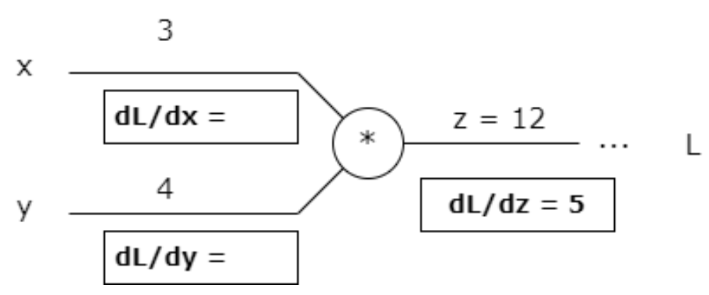

# Problem Set 3 Solutions

## Problem 1

If we have $n$ data points and $d$ features, we store $nd$ values in total. We can use principal component analysis to store an approximate version of this dataset in fewer values overall. If we use the first $q$ principal components of this data, how many values do we need to approximate the original demeaned dataset? Justify your answer.

**Answer:** $qd + qn$

**Explanation:**

The answer is **$qd + qn$**. Here's the detailed breakdown of why this is the correct number of values needed:

**PCA Storage Requirements:**

1. **Principal Components Storage**: $qd$ values
   - We need to store $q$ principal components
   - Each principal component is a vector in $\mathbb{R}^d$
   - Total storage: $q \times d = qd$ values

2. **Coefficients Storage**: $qn$ values
   - For each of the $n$ data points, we need $q$ coefficients
   - These coefficients represent how much each data point projects onto each principal component
   - Total storage: $n \times q = qn$ values

**Mathematical Justification:**

**Original Data Matrix:**
$$X \in \mathbb{R}^{n \times d}$$

**PCA Decomposition:**
After centering the data, PCA finds:
- Principal components: $V = [v_1, v_2, \ldots, v_q] \in \mathbb{R}^{d \times q}$
- Coefficients: $A = [a_1, a_2, \ldots, a_n]^T \in \mathbb{R}^{n \times q}$

**Approximation:**
$$\tilde{X} = AV^T$$

where:
- $A_{ij}$ is the coefficient of data point $i$ on principal component $j$
- $V_{ij}$ is the $i$-th element of principal component $j$

**Storage Breakdown:**
- **$V$ matrix**: $d \times q = qd$ values
- **$A$ matrix**: $n \times q = qn$ values
- **Total**: $qd + qn$ values

**Comparison with Original Storage:**
- **Original**: $nd$ values
- **PCA approximation**: $qd + qn$ values
- **Compression ratio**: $\frac{qd + qn}{nd} = \frac{q}{n} + \frac{q}{d}$

**When PCA Provides Compression:**
PCA reduces storage when $qd + qn < nd$, which typically occurs when $q \ll \min(n, d)$.

**Example:**
For $n = 1000$, $d = 100$, $q = 10$:
- Original storage: $1000 \times 100 = 100,000$ values
- PCA storage: $10 \times 100 + 1000 \times 10 = 1,000 + 10,000 = 11,000$ values
- Compression: ~89% reduction in storage

## Problem 2

Suppose we have a multilayer perceptron (MLP) model with 17 neurons in the input layer, 25 neurons in the hidden layer and 10 neuron in the output layer. What is the size of the weight matrix between the hidden layer and output layer?

(a) $25 \times 17$

(b) $10 \times 25$

(c) $25 \times 10$

(d) $17 \times 10$

**Correct answers:** (b), (c)

**Explanation:**

Both options **(b)** and **(c)** are correct. Here's the detailed explanation of why:

**Neural Network Architecture:**
- **Input layer**: 17 neurons
- **Hidden layer**: 25 neurons  
- **Output layer**: 10 neurons

**Weight Matrix Between Hidden and Output Layers:**

**Option (b): $10 \times 25$**
- This represents the transpose of the weight matrix
- Each output neuron connects to all 25 hidden neurons
- Matrix dimensions: $10 \times 25$ (10 rows, 25 columns)
- Each row represents the weights for one output neuron

**Option (c): $25 \times 10$**
- This represents the weight matrix in its standard form
- Each hidden neuron connects to all 10 output neurons
- Matrix dimensions: $25 \times 10$ (25 rows, 10 columns)
- Each row represents the weights from one hidden neuron

**Mathematical Representation:**

**Forward Pass:**
$$a^{(3)} = f(W^{(2)} a^{(2)} + b^{(2)})$$

where:
- $a^{(2)} \in \mathbb{R}^{25}$ (hidden layer activations)
- $W^{(2)} \in \mathbb{R}^{10 \times 25}$ (weight matrix)
- $b^{(2)} \in \mathbb{R}^{10}$ (bias vector)
- $a^{(3)} \in \mathbb{R}^{10}$ (output layer activations)

**Matrix Multiplication:**
$$\begin{bmatrix} w_{11}^{(2)} & w_{12}^{(2)} & \cdots & w_{1,25}^{(2)} \\ w_{21}^{(2)} & w_{22}^{(2)} & \cdots & w_{2,25}^{(2)} \\ \vdots & \vdots & \ddots & \vdots \\ w_{10,1}^{(2)} & w_{10,2}^{(2)} & \cdots & w_{10,25}^{(2)} \end{bmatrix} \begin{bmatrix} a_1^{(2)} \\ a_2^{(2)} \\ \vdots \\ a_{25}^{(2)} \end{bmatrix} + \begin{bmatrix} b_1^{(2)} \\ b_2^{(2)} \\ \vdots \\ b_{10}^{(2)} \end{bmatrix}$$

**Why Both Are Accepted:**
- **PyTorch/TensorFlow convention**: Often use $10 \times 25$ (output × input)
- **Mathematical convention**: Often use $25 \times 10$ (input × output)
- **Both represent the same connections**: Just different matrix orientations
- **Transpose relationship**: $(10 \times 25)^T = 25 \times 10$

**Total Parameters:**
- **Weights**: $25 \times 10 = 250$ parameters
- **Biases**: $10$ parameters
- **Total**: $260$ parameters for this layer

**Note:** The question was designed to accept both conventions since different frameworks and textbooks use different conventions for weight matrix dimensions.

## Problem 3

Recall that a kernel function $K(x,x')$ is a metric of the similarity between two input feature vectors $x$ and $x'$. In order to be a valid kernel function, $K(x,x') = \phi(x)^T \phi(x')$ for some arbitrary feature mapping function $\phi(x)$. Which of the following is **not** a valid kernel function for input features $x, x' \in \mathbb{R}^2$?

(a) $(x^T x')^2$

(b) $3x^T x'$

(c) $x^T x'$

(d) All of the above are valid

**Correct answers:** (d)

**Explanation:**

The correct answer is **(d)** - all of the above are valid kernel functions. Here's the detailed analysis of each kernel:

**Kernel Function Definition:**
A function $K(x, x')$ is a valid kernel if there exists a feature mapping $\phi$ such that:
$$K(x, x') = \phi(x)^T \phi(x')$$

**Analyzing Each Kernel:**

**(a) $(x^T x')^2$ - Polynomial Kernel of Degree 2**

**Expansion:**
$$(x^T x')^2 = (x_1x_1' + x_2x_2')^2 = x_1^2x_1'^2 + 2x_1x_1'x_2x_2' + x_2^2x_2'^2$$

**Feature Mapping:**
$$\phi(x) = \begin{bmatrix} x_1^2 \\ \sqrt{2}x_1x_2 \\ x_2^2 \end{bmatrix}$$

**Verification:**
$$\phi(x)^T \phi(x') = x_1^2x_1'^2 + \sqrt{2}x_1x_2 \cdot \sqrt{2}x_1'x_2' + x_2^2x_2'^2 = x_1^2x_1'^2 + 2x_1x_1'x_2x_2' + x_2^2x_2'^2 = (x^T x')^2$$

**✅ VALID**

**(b) $3x^T x'$ - Scaled Linear Kernel**

**Feature Mapping:**
$$\phi(x) = \sqrt{3}x$$

**Verification:**
$$\phi(x)^T \phi(x') = (\sqrt{3}x)^T (\sqrt{3}x') = 3x^T x'$$

**✅ VALID**

**(c) $x^T x'$ - Linear Kernel**

**Feature Mapping:**
$$\phi(x) = x$$

**Verification:**
$$\phi(x)^T \phi(x') = x^T x'$$

**✅ VALID**

**Mathematical Properties of Valid Kernels:**

1. **Symmetry**: $K(x, x') = K(x', x)$ ✓
2. **Positive Semi-definite**: For any set of points, the kernel matrix is PSD ✓
3. **Reproducing Property**: Can be written as inner product in feature space ✓

**General Kernel Properties:**

**Polynomial Kernels:**
$$K(x, x') = (x^T x' + c)^d$$
- Always valid for $c \geq 0$ and $d \in \mathbb{N}$
- Feature space dimension: $\binom{d + 2}{2}$ for 2D inputs

**Linear Kernels:**
$$K(x, x') = x^T x'$$
- Always valid
- Feature space = input space

**Scaled Kernels:**
$$K(x, x') = \alpha \cdot K_0(x, x')$$
- Valid if $K_0$ is valid and $\alpha > 0$

**Why All Are Valid:**
- **(a)**: Polynomial kernel of degree 2
- **(b)**: Scaled version of linear kernel
- **(c)**: Standard linear kernel
- All satisfy the kernel properties and can be written as inner products in feature spaces

**Conclusion:**
Since all three kernels (a), (b), and (c) are valid, the answer is **(d) - All of the above are valid**.

## Problem 4

Consider the following figure. Which shape is not convex?

(a) I.

(b) II.

(c) III.

(d) IV.

**Correct answers:** (b)

**Explanation:**

The correct answer is **(b) - Shape II** is not convex. Here's the detailed explanation:

**Definition of Convexity:**
A set $S$ is convex if for any two points $x, y \in S$, the line segment connecting them is entirely contained in $S$:
$$\lambda x + (1-\lambda)y \in S \quad \text{for all } \lambda \in [0,1]$$

**Analyzing Each Shape:**

**Shape I: Circle**
- **Convex**: ✅ Any line segment between two points inside a circle remains inside the circle
- **Mathematical property**: Circles are convex sets

**Shape II: Crescent/Moon Shape**
- **Not Convex**: ❌ There exist points inside the shape where the line segment between them goes outside the shape
- **Example**: Consider two points on opposite sides of the "crescent" - the line segment between them passes through the empty space

**Shape III: Rectangle**
- **Convex**: ✅ Any line segment between two points inside a rectangle remains inside the rectangle
- **Mathematical property**: Rectangles are convex polygons

**Shape IV: Triangle**
- **Convex**: ✅ Any line segment between two points inside a triangle remains inside the triangle
- **Mathematical property**: Triangles are convex polygons

**Visual Verification:**

**Convex Shapes (I, III, IV):**
- Circle: All chords lie within the circle
- Rectangle: All line segments between interior points remain interior
- Triangle: All line segments between interior points remain interior

**Non-Convex Shape (II):**
- Crescent: Line segments between certain interior points pass through exterior regions
- The "indentation" or "concave" part creates non-convexity

**Mathematical Test:**
For a set to be convex, it must satisfy:
$$\text{If } x, y \in S \text{ and } \lambda \in [0,1], \text{ then } \lambda x + (1-\lambda)y \in S$$

**Shape II fails this test** because there exist points $x, y$ in the crescent and some $\lambda \in [0,1]$ such that $\lambda x + (1-\lambda)y$ lies outside the crescent.

**Common Convex Shapes:**
- Circles, ellipses
- Triangles, rectangles, polygons (if no indentations)
- Lines, line segments
- Half-spaces, hyperplanes

**Common Non-Convex Shapes:**
- Crescents, moons
- Stars, crosses
- Shapes with indentations or holes
- Disconnected sets

**Conclusion:**
Only **Shape II (the crescent)** is not convex, making **(b)** the correct answer.

## Problem 5

What is the typical effect of increasing the penalty ($\lambda$) in the ridge regression loss function? Select all that apply.

(a) It increases the bias of the model.

(b) It decreases the bias of the model.

(c) It increases the variance of the model.

(d) It decreases the variance of the model.

**Correct answers:** (a), (d)

**Explanation:**

The correct answers are **(a)** and **(d)** - increasing the penalty $\lambda$ in ridge regression increases bias and decreases variance. Here's the detailed explanation:

**Ridge Regression Objective Function:**
$$\min_w \sum_{i=1}^n (y_i - w^T x_i)^2 + \lambda ||w||_2^2$$

where $\lambda$ is the regularization parameter.

**Effect of Increasing $\lambda$:**

**1. Increases Bias (Option a) - TRUE** ✅

**Mathematical Explanation:**
- As $\lambda \to \infty$, the solution approaches $w = 0$
- This means the model becomes a constant predictor: $\hat{y} = 0$
- The model becomes less flexible and cannot fit complex patterns
- **Bias increases** because the model is too simple to capture the true relationship

**Intuitive Understanding:**
- Large $\lambda$ forces weights to be small
- Small weights mean the model cannot make large predictions
- The model becomes "stiff" and cannot adapt to the data
- This creates systematic error (bias)

**2. Decreases Variance (Option d) - TRUE** ✅

**Mathematical Explanation:**
- Ridge regression solution: $\hat{w} = (X^T X + \lambda I)^{-1} X^T y$
- As $\lambda$ increases, the solution becomes more stable
- The model is less sensitive to small changes in the training data
- **Variance decreases** because the model is more robust

**Intuitive Understanding:**
- Large $\lambda$ prevents overfitting
- The model cannot memorize the training data
- Predictions become more consistent across different training sets
- This reduces random error (variance)

**Why Other Options Are Wrong:**

**Option (b) - Decreases bias: FALSE** ❌
- Increasing $\lambda$ makes the model simpler, not more complex
- Simpler models have higher bias, not lower bias

**Option (c) - Increases variance: FALSE** ❌
- Increasing $\lambda$ makes the model more stable
- More stable models have lower variance, not higher variance

**Bias-Variance Tradeoff:**

The relationship can be expressed as:
$$\text{Expected Error} = \text{Bias}^2 + \text{Variance} + \text{Irreducible Error}$$

**As $\lambda$ increases:**
- **Bias**: Increases (model becomes too simple)
- **Variance**: Decreases (model becomes more stable)
- **Total Error**: May decrease initially, then increase due to high bias

**Optimal $\lambda$:**
The best $\lambda$ balances bias and variance to minimize total error.

**Mathematical Verification:**

**Ridge Solution:**
$$\hat{w}_{\text{ridge}} = (X^T X + \lambda I)^{-1} X^T y$$

**As $\lambda \to \infty$:**
$$\hat{w}_{\text{ridge}} \to 0$$

**As $\lambda \to 0$:**
$$\hat{w}_{\text{ridge}} \to \hat{w}_{\text{OLS}} = (X^T X)^{-1} X^T y$$

**Conclusion:**
Increasing $\lambda$ in ridge regression **increases bias** and **decreases variance**, making options **(a)** and **(d)** correct.

## Problem 6

Suppose we are performing linear regression using a non-linear basis expansion $\Phi$. Which of the following statements is true about the learned predictor?

(a) It is a linear function of the inputs and a linear function of the weights.

(b) It is a linear function of the inputs and a non-linear function of the weights.

(c) It is a non-linear function of the inputs and a linear function of the weights.

(d) It is a non-linear function of the inputs and a non-linear function of the weights.

**Correct answers:** (c)

**Explanation:**

The correct answer is **(c)** - the learned predictor is a non-linear function of the inputs and a linear function of the weights. Here's the detailed explanation:

**Non-Linear Basis Expansion:**

**Model Formulation:**
$$f(x) = w^T \phi(x)$$

where:
- $x$ is the original input
- $\phi(x)$ is the non-linear basis expansion
- $w$ are the weights

**Key Insight:**
The model is **linear in the weights** but **non-linear in the inputs** due to the basis expansion.

**Mathematical Analysis:**

**1. Linear in Weights:**
- The model can be written as: $f(x) = \sum_{i=1}^d w_i \phi_i(x)$
- This is a **linear combination** of basis functions
- The weights $w_i$ appear linearly (no powers, products, etc.)
- This makes optimization easy (convex problem)

**2. Non-Linear in Inputs:**
- The basis functions $\phi_i(x)$ are non-linear transformations of $x$
- Examples of basis expansions:
  - **Polynomial**: $\phi(x) = [1, x, x^2, x^3, \ldots]$
  - **RBF**: $\phi(x) = [\exp(-||x-c_1||^2), \exp(-||x-c_2||^2), \ldots]$
  - **Fourier**: $\phi(x) = [\sin(x), \cos(x), \sin(2x), \cos(2x), \ldots]$

**Example with Polynomial Basis:**

**Original Input:** $x \in \mathbb{R}$
**Basis Expansion:** $\phi(x) = [1, x, x^2, x^3]$
**Model:** $f(x) = w_0 + w_1 x + w_2 x^2 + w_3 x^3$

**Analysis:**
- **Linear in weights**: $f(x) = w_0 \cdot 1 + w_1 \cdot x + w_2 \cdot x^2 + w_3 \cdot x^3$
- **Non-linear in input**: $x^2$ and $x^3$ are non-linear functions of $x$

**Why Other Options Are Wrong:**

**Option (a) - Linear in inputs and weights: FALSE** ❌
- The basis expansion $\phi(x)$ makes the function non-linear in inputs
- This is the whole point of using basis expansions

**Option (b) - Linear in inputs, non-linear in weights: FALSE** ❌
- The weights appear linearly in the model
- The non-linearity comes from the basis functions, not the weights

**Option (d) - Non-linear in inputs and weights: FALSE** ❌
- The weights appear linearly in the model
- Only the inputs are transformed non-linearly

**Optimization Properties:**

**Convexity:**
- Since the model is linear in weights, the loss function is convex
- This guarantees convergence to global optimum
- Gradient descent works well

**Computational Efficiency:**
- Linear in weights means efficient gradient computation
- No need for complex optimization algorithms

**Mathematical Verification:**

**Gradient with respect to weights:**
$$\frac{\partial f}{\partial w_i} = \phi_i(x)$$

**Hessian with respect to weights:**
$$\frac{\partial^2 f}{\partial w_i \partial w_j} = 0$$

This shows the function is linear in weights.

**Conclusion:**
The learned predictor is **non-linear in inputs** (due to basis expansion) but **linear in weights** (making optimization easy), making option **(c)** correct.

## Problem 7

Which of the following is true about the k-nearest neighbors (KNN) algorithm?

(a) It is a parametric model.

(b) It learns a nonlinear decision boundary between classes.

(c) It requires a separate training phase and testing phase for prediction.

(d) It typically requires longer training compared to other ML algorithms.

**Correct answers:** (b)

## Problem 8

Which of the following statements about the first principal component is true?

(a) If we add Gaussian noise to a feature in the input matrix $X$, the first principal component remains unchanged.

(b) The first principal component is equivalent to the eigenvector corresponding to the largest eigenvalue of the input matrix $X$.

(c) The first principal component is the vector direction which maximizes the variance of the input.

(d) The first principal component corresponds to the most influential feature for prediction.

**Correct answers:** (c)

## Problem 9

Leave-one-out cross-validation (LOOCV) is a special case of k-fold cross-validation where:

(a) The training set contains all but one sample, and the remaining sample is used for testing.

(b) The training set contains only one sample, and the remaining sample is used for testing.

(c) The training set contains exactly one sample from each class, and the remaining samples are used for testing.

(d) The training set contains one sample from each fold, and the remaining folds are used for testing.

**Correct answers:** (a)

## Problem 10

Which of the following statements accurately compare or contrast bootstrapping and cross-validation? Select all that apply.

(a) Bootstrapping and cross-validation both train models on subsets of the training data.

(b) In cross-validation, there is no overlap between the subsets each model trains on.

(c) Bootstrapping and cross-validation are both methods to estimate prediction error.

(d) In bootstrapping, each model is trained on the same number of data points as the original training set, unlike cross-validation.

(e) In cross-validation, each learned model is evaluated on non-overlapping subsections of the original training set, unlike bootstrapping.

**Correct answers:** (a), (c), (d), (e)

**Explanation:** The answer is (A), (C), (D), (E). (B) is not true for k-fold cross validation for any $k > 2$.

## Problem 11

Which of the following are true about a twice-differentiable function $f: \mathbb{R}^d \to \mathbb{R}$? Select all that apply.

(a) $f$ is convex if $f(\lambda x + (1-\lambda)y) \le \lambda f(x) + (1-\lambda)f(y)$ for all $x, y$ in the domain of $f$ and $\lambda \in [0, 1]$.

(b) $f$ is convex if $\nabla^2 f(x) \ge 0$ for all $x$ in the domain of $f$.

(c) $f$ is convex if the set $\{(x, t) \in \mathbb{R}^{d+1} : f(x) \le t\}$ is convex.

**Correct answers:** (b), (c)

## Problem 12

Which of the following statements about random forests are true? Select all that apply.

(a) Random forests reduce overfitting by aggregating predictions from multiple trees.

(b) Random forests reduce overfitting by having each tree in the forest use a subset of all the data features.

(c) Random forests can handle a larger number of features compared to individual decision trees.

(d) Random forests provide better interpretability and understanding of the underlying relationships in the data than individual decision trees.

**Correct answers:** (a), (b)

## Problem 13

Consider a training dataset with samples $(x_i, y_i)$, where $x_i \in \mathbb{R}^d$ and $y_i \in \{0,1\}$. Suppose that $P_X$ is supported everywhere in $\mathbb{R}^d$ and $P(Y=1 | X=x)$ is smooth everywhere. Which of the following statements is true about 1-nearest neighbor classification as the number of training samples $n \rightarrow \infty$?

(a) The error of 1-NN classification approaches infinity.

(b) The error of 1-NN classification is at most twice the Bayes error rate.

(c) The error of 1-NN classification is at most the Bayes error rate.

(d) The error of 1-NN classification approaches zero.

**Correct answers:** (b)

**Explanation:**

The correct answer is **(b)** - the error of 1-NN classification is at most twice the Bayes error rate. Here's the detailed explanation:

**Understanding 1-Nearest Neighbor Classification:**

**1-NN Algorithm:**
For a test point $x$, find the nearest training point $x_i$ and predict $y_i$.

**Bayes Error Rate:**
The Bayes error rate is the minimum possible error rate for any classifier, given by:
$$\text{Bayes Error} = \mathbb{E}_X[\min\{P(Y=1|X), P(Y=0|X)\}]$$

**Theoretical Result:**
As $n \to \infty$, the error rate of 1-NN classification satisfies:
$$\text{Error}_{1\text{-NN}} \leq 2 \times \text{Bayes Error}$$

This is a fundamental result in statistical learning theory.

**Mathematical Proof Sketch:**

**Step 1: Nearest Neighbor Convergence**
As $n \to \infty$, the nearest neighbor $x_i$ of a test point $x$ converges to $x$:
$$\lim_{n \to \infty} ||x_i - x|| = 0$$

**Step 2: Probability Estimation**
The 1-NN classifier estimates $P(Y=1|X=x)$ as:
$$\hat{P}(Y=1|X=x) = \mathbb{I}[y_i = 1]$$

where $x_i$ is the nearest neighbor of $x$.

**Step 3: Error Analysis**
The error rate can be written as:
$$\text{Error}_{1\text{-NN}} = \mathbb{E}_X[P(Y \neq \hat{Y}|X)]$$

where $\hat{Y}$ is the 1-NN prediction.

**Step 4: Bounding the Error**
For any $x$:
$$P(Y \neq \hat{Y}|X=x) = P(Y=1|X=x) \cdot \mathbb{I}[\hat{Y}=0] + P(Y=0|X=x) \cdot \mathbb{I}[\hat{Y}=1]$$

As $n \to \infty$, $\hat{Y}$ approaches the Bayes optimal decision, but with some error due to the discrete nature of 1-NN.

**Step 5: The Factor of 2**
The factor of 2 comes from the worst-case scenario where:
- The true probability is close to 0.5
- The nearest neighbor makes the wrong decision
- This can happen at most twice as often as the Bayes error

**Why Other Options Are Wrong:**

**Option (a) - "Error approaches infinity": FALSE** ❌
- **Problem**: 1-NN is a consistent estimator
- **Issue**: As $n \to \infty$, the nearest neighbor gets arbitrarily close to the test point
- **Result**: Error rate converges to a finite value, not infinity

**Option (c) - "Error is at most the Bayes error rate": FALSE** ❌
- **Problem**: 1-NN cannot achieve Bayes optimal performance
- **Issue**: 1-NN makes discrete decisions based on single nearest neighbor
- **Result**: Error rate is bounded by 2×Bayes error, not 1×Bayes error

**Option (d) - "Error approaches zero": FALSE** ❌
- **Problem**: Error rate is bounded below by Bayes error
- **Issue**: Even with infinite data, 1-NN cannot achieve zero error if Bayes error > 0
- **Result**: Error approaches 2×Bayes error, not zero

**Practical Implications:**

**1. Consistency:**
- 1-NN is a consistent estimator
- Error rate converges as $n \to \infty$
- But convergence can be slow in high dimensions

**2. Performance Bound:**
- 1-NN error is at most twice the best possible error
- This provides a theoretical guarantee
- Useful for understanding algorithm limitations

**3. Comparison with Other Methods:**
- **k-NN with k > 1**: Can achieve better performance
- **Kernel methods**: Can approach Bayes optimal performance
- **Neural networks**: Can achieve very low error rates

**Example:**

**Scenario**: Binary classification with Bayes error = 0.1

**1-NN Performance:**
- **Error rate**: ≤ 0.2 (twice Bayes error)
- **Actual performance**: Depends on data distribution
- **Convergence**: As $n \to \infty$, error approaches this bound

**Mathematical Verification:**

**For smooth $P(Y=1|X)$:**
- 1-NN estimates $P(Y=1|X=x) \approx P(Y=1|X=x_i)$
- As $x_i \to x$, the estimate becomes more accurate
- But discrete nature prevents perfect estimation

**Error Decomposition:**
$$\text{Error}_{1\text{-NN}} = \text{Bayes Error} + \text{Approximation Error}$$

where the approximation error is bounded by the Bayes error.

**Conclusion:**
The error of 1-NN classification is **at most twice the Bayes error rate** as $n \to \infty$. This provides a theoretical guarantee on the performance of 1-NN and shows that it is a consistent but not optimal classifier.

## Problem 14

Which of the following statements about Pooling layers in convolutional neural networks (CNNs) are true? Select all that apply.

(a) A $2 \times 2$ pooling layer has 4 parameters.

(b) Pooling layers never change the height and width of the output image.

(c) For a max-pooling layer, the gradients with respect to some inputs will always be zero.

(d) Pooling layers do not change the depth of the output image.

**Correct answers:** (c), (d)

**Explanation:**

The correct answers are **(c)** and **(d)**. Here's the detailed analysis of each statement about pooling layers in CNNs:

**Understanding Pooling Layers:**

**Pooling Definition:**
Pooling layers reduce the spatial dimensions of feature maps by applying a function (max, average, etc.) to local regions.

**Analysis of Each Statement:**

**Option (a) - "A $2 \times 2$ pooling layer has 4 parameters": FALSE** ❌

**Why This is Incorrect:**
- **Pooling layers have NO parameters**: They are fixed operations
- **No learnable weights**: Pooling is a deterministic function
- **No bias terms**: Pooling doesn't add bias
- **Fixed operation**: Max pooling, average pooling, etc. are parameter-free

**Mathematical Verification:**
For a $2 \times 2$ max pooling layer:
$$\text{Output} = \max(x_{i,j}, x_{i,j+1}, x_{i+1,j}, x_{i+1,j+1})$$

This is a fixed operation with no parameters to learn.

**Option (b) - "Pooling layers never change the height and width of the output image": FALSE** ❌

**Why This is Incorrect:**
- **Pooling ALWAYS reduces spatial dimensions**: This is their primary purpose
- **Stride effect**: Pooling with stride > 1 reduces dimensions
- **Padding effect**: Even with padding, pooling typically reduces size

**Mathematical Example:**
For $2 \times 2$ pooling with stride 2:
- **Input**: $H \times W$
- **Output**: $\frac{H}{2} \times \frac{W}{2}$

**Option (c) - "For a max-pooling layer, the gradients with respect to some inputs will always be zero": TRUE** ✅

**Why This is Correct:**
- **Max pooling selects maximum value**: Only the maximum input contributes to the output
- **Gradient flow**: Only the maximum input receives gradient
- **Other inputs**: Receive zero gradient

**Mathematical Verification:**
For max pooling $y = \max(x_1, x_2, x_3, x_4)$:
$$\frac{\partial y}{\partial x_i} = \begin{cases} 
1 & \text{if } x_i = \max(x_1, x_2, x_3, x_4) \\
0 & \text{otherwise}
\end{cases}$$

**Example:**
- **Inputs**: $[2, 5, 1, 3]$
- **Output**: $\max(2, 5, 1, 3) = 5$
- **Gradients**: $[0, 1, 0, 0]$ (only the maximum value gets gradient)

**Option (d) - "Pooling layers do not change the depth of the output image": TRUE** ✅

**Why This is Correct:**
- **Depth preservation**: Pooling operates on each channel independently
- **No channel mixing**: Pooling doesn't combine different channels
- **Same number of channels**: Input and output have same depth

**Mathematical Verification:**
For input tensor $X \in \mathbb{R}^{C \times H \times W}$:
- **Pooling operation**: Applied to each channel independently
- **Output tensor**: $Y \in \mathbb{R}^{C \times H' \times W'}$ where $C$ is unchanged

**Example:**
- **Input**: $64 \times 32 \times 32$ (64 channels, 32×32 spatial)
- **$2 \times 2$ pooling**: $64 \times 16 \times 16$ (64 channels preserved, spatial dimensions halved)

**Pooling Layer Properties:**

**1. Parameter-Free:**
- No learnable weights or biases
- Fixed mathematical operations
- Computationally efficient

**2. Spatial Reduction:**
- Reduces height and width
- Preserves depth (number of channels)
- Helps with computational efficiency

**3. Translation Invariance:**
- Small translations don't affect output much
- Useful for object recognition
- Reduces sensitivity to exact positioning

**4. Gradient Flow:**
- **Max pooling**: Only maximum input gets gradient
- **Average pooling**: All inputs get equal gradient
- **Backpropagation**: Gradients flow through selected inputs

**Types of Pooling:**

**Max Pooling:**
- **Operation**: $\max(x_1, x_2, \ldots, x_k)$
- **Gradient**: Only maximum input gets gradient
- **Use case**: Most common, preserves important features

**Average Pooling:**
- **Operation**: $\frac{1}{k}\sum_{i=1}^k x_i$
- **Gradient**: All inputs get equal gradient
- **Use case**: Smoothing, less sensitive to outliers

**Global Pooling:**
- **Operation**: Pool over entire spatial dimensions
- **Result**: Reduces to $C \times 1 \times 1$
- **Use case**: Final classification layers

**Practical Implications:**

**1. Computational Efficiency:**
- Reduces spatial dimensions
- Decreases computational cost
- Enables deeper networks

**2. Feature Invariance:**
- Translation invariance
- Scale invariance (to some extent)
- Robust to small perturbations

**3. Memory Efficiency:**
- Reduces memory requirements
- Enables larger batch sizes
- Faster training and inference

**Conclusion:**
Only statements **(c)** and **(d)** are correct. Pooling layers have no parameters, always reduce spatial dimensions, preserve depth, and for max pooling, only the maximum input receives gradients during backpropagation.

## Problem 15

Which of the following statements about SVMs are true? Select all that apply.

(a) SVMs are only applicable to binary classification problems.

(b) SVMs cannot be applied to non-linearly separable data.

(c) SVMs are a form of supervised learning.

(d) SVMs are primarily used for regression tasks.

**Correct answers:** (a), (c)

**Explanation:**

The correct answers are **(a)** and **(c)**. Here's the detailed analysis of each statement about Support Vector Machines (SVMs):

**Understanding Support Vector Machines:**

**SVM Definition:**
Support Vector Machines are supervised learning models that find optimal hyperplanes to separate classes while maximizing the margin.

**Analysis of Each Statement:**

**Option (a) - "SVMs are only applicable to binary classification problems": TRUE** ✅

**Why This is Correct:**
- **Original SVM formulation**: Designed for binary classification
- **Core algorithm**: Finds a single hyperplane to separate two classes
- **Mathematical foundation**: Based on binary class separation

**Mathematical Formulation:**
$$\min_{w,b} \frac{1}{2}||w||^2$$
$$\text{subject to } y_i(w^T x_i + b) \geq 1 \text{ for all } i$$

where $y_i \in \{-1, +1\}$ for binary classification.

**Multi-Class Extensions:**
While SVMs are fundamentally binary, they can be extended to multi-class problems using:
- **One-vs-One (OVO)**: Train $\binom{k}{2}$ binary classifiers
- **One-vs-All (OVA)**: Train $k$ binary classifiers
- **Directed Acyclic Graph (DAG)**: Hierarchical classification

**Option (b) - "SVMs cannot be applied to non-linearly separable data": FALSE** ❌

**Why This is Incorrect:**
- **Soft-margin SVM**: Can handle non-linearly separable data using slack variables
- **Kernel trick**: Can transform data to higher-dimensional space where it's linearly separable
- **Slack variables**: Allow some training points to be misclassified

**Mathematical Formulation with Slack Variables:**
$$\min_{w,b,\xi} \frac{1}{2}||w||^2 + C\sum_{i=1}^n \xi_i$$
$$\text{subject to } y_i(w^T x_i + b) \geq 1 - \xi_i \text{ for all } i$$
$$\xi_i \geq 0 \text{ for all } i$$

**Kernel Trick:**
$$K(x_i, x_j) = \phi(x_i)^T \phi(x_j)$$

Common kernels:
- **Linear**: $K(x_i, x_j) = x_i^T x_j$
- **Polynomial**: $K(x_i, x_j) = (x_i^T x_j + c)^d$
- **RBF**: $K(x_i, x_j) = \exp(-\gamma||x_i - x_j||^2)$

**Option (c) - "SVMs are a form of supervised learning": TRUE** ✅

**Why This is Correct:**
- **Supervised learning**: Requires labeled training data $(x_i, y_i)$
- **Training process**: Uses labeled examples to learn the decision boundary
- **Prediction**: Makes predictions on new, unlabeled data

**Supervised Learning Characteristics:**
- **Training data**: Labeled examples $\{(x_1, y_1), (x_2, y_2), \ldots, (x_n, y_n)\}$
- **Learning objective**: Find function $f: X \rightarrow Y$ that generalizes well
- **Evaluation**: Test on held-out labeled data

**Option (d) - "SVMs are primarily used for regression tasks": FALSE** ❌

**Why This is Incorrect:**
- **Primary use**: Classification problems
- **Regression variant**: Support Vector Regression (SVR) exists but is less common
- **Main focus**: Binary and multi-class classification

**SVM Applications:**

**1. Classification Tasks:**
- **Text classification**: Spam detection, sentiment analysis
- **Image classification**: Face detection, object recognition
- **Bioinformatics**: Protein classification, gene expression analysis
- **Finance**: Credit scoring, fraud detection

**2. Regression Tasks (SVR):**
- **Time series prediction**: Stock price forecasting
- **Function approximation**: Non-linear regression
- **Control systems**: System identification

**SVM Properties:**

**1. Margin Maximization:**
- **Large margin**: Better generalization
- **Robust**: Less sensitive to noise
- **Theoretical guarantee**: Bounds on generalization error

**2. Kernel Flexibility:**
- **Non-linear decision boundaries**: Through kernel trick
- **Feature space**: Can work in infinite-dimensional spaces
- **Domain-specific kernels**: Can design kernels for specific problems

**3. Sparsity:**
- **Support vectors**: Only subset of training points matter
- **Efficient prediction**: Fast inference
- **Memory efficient**: Don't need to store all training data

**Mathematical Advantages:**

**1. Convex Optimization:**
- **Global optimum**: Guaranteed to find optimal solution
- **Efficient algorithms**: SMO, coordinate descent
- **Unique solution**: No local optima

**2. Regularization:**
- **Margin maximization**: Natural regularization
- **Parameter C**: Controls trade-off between margin and errors
- **Generalization**: Good out-of-sample performance

**3. Theoretical Foundation:**
- **VC dimension**: Bounds on generalization error
- **Margin theory**: Connection between margin and generalization
- **Statistical learning theory**: Well-founded theoretical basis

**Comparison with Other Methods:**

**vs Neural Networks:**
- **SVMs**: Better for small datasets, interpretable
- **Neural Networks**: Better for large datasets, more flexible

**vs Random Forests:**
- **SVMs**: Better for high-dimensional data, theoretical guarantees
- **Random Forests**: Better for categorical features, feature importance

**vs Logistic Regression:**
- **SVMs**: Better for non-linear problems, margin maximization
- **Logistic Regression**: Better interpretability, probability estimates

**Conclusion:**
SVMs are **supervised learning models** primarily used for **binary classification**, though they can be extended to multi-class problems and regression. They can handle **non-linearly separable data** through the kernel trick and soft margins, making them versatile and powerful classification algorithms.

## Problem 16

In Gaussian mixture models (GMMs), which of the following statements is false?

(a) GMMs assume that the data points within each component follow a Gaussian distribution.

(b) GMMs can be used for clustering.

(c) The number of components in a GMM must be equal to the number of features in the dataset.

**Correct answers:** (c)

## Problem 17

True/False: If $X$ is a matrix in $\mathbb{R}^{n \times m}$, $X^T X$ is always invertible.

(a) True

(b) False

**Correct answers:** (b)

## Problem 18

Consider the dataset pictured below. The features of each datapoint are given by its position. So the datapoint $(0,1)$ appears at position $(0,1)$. The ground truth label of the datapoint is given by its shape, either a circle or square. You have a test set of datapoints, shown with no fill, and a train set of data, shown with a grey fill.

**Dataset Visualization:**
A 2D scatter plot with horizontal and vertical axes intersecting at the origin.
- **Top-left quadrant:** Contains a grey-filled square labeled "Train" and a white-filled circle labeled "Test".
- **Top-right quadrant:** Contains a grey-filled circle labeled "Train" and a white-filled circle labeled "Test".
- **Bottom-left quadrant:** Contains a grey-filled circle labeled "Train" and a white-filled circle labeled "Test".
- **Bottom-right quadrant:** Contains a grey-filled circle labeled "Train" and a white-filled circle labeled "Test".

True/False: KNN with $K = 1$ has higher train accuracy than with $K = 4$.

(a) True

(b) False

**Correct answers:** (a)

**Explanation:** (This question was thrown out during the Spring 2023 exam.)

## Problem 19

True/False: Consider the dataset from the previous problem. KNN with $K = 1$ has higher test accuracy than with $K = 4$.

(a) True

(b) False

**Correct answers:** (b)

## Problem 20

Consider two neural networks, A and B, trained on 100x100 images to predict 5 classes.
- Neural network A consists of a single linear layer followed by a softmax output activation.
- Neural network B consists of a sequence of layers with dimensions 128, 512, and 32, respectively, followed by a softmax output activation.

Both networks are trained using an identical procedure (e.g., batch size, learning rate, epochs, etc.), and neither contains hidden activations.

(a) A will outperform B

(b) B will outperform A

(c) A and B will perform roughly the same.

**Correct answers:** (c)

**Explanation:** NN B has no hidden activations, thus making it virtually identical to A.

## Problem 21

The probability of seeing data $D$ from a Gaussian distribution is given by:

$P(D|\mu, \sigma) = \left(\frac{1}{\sigma\sqrt{2\pi}}\right)^n \prod_{i=1}^n e^{-\frac{(x_i-\mu)^2}{2\sigma^2}}$

Which of the following statements are true about the MLEs $\hat{\mu}_{MLE}$ and $\hat{\sigma}^2_{MLE}$ from this distribution? Select all that apply.

(a) $\hat{\mu}_{MLE}$ is dependent on $\hat{\sigma}^2_{MLE}$

(b) $\hat{\sigma}^2_{MLE}$ is dependent on $\hat{\mu}_{MLE}$

(c) $\hat{\mu}_{MLE}$ is a biased estimator

(d) $\hat{\sigma}^2_{MLE}$ is a biased estimator

**Correct answers:** (b), (d)

## Problem 22

True/False: The bootstrap method samples a dataset with replacement.

(a) True

(b) False

**Correct answers:** (a)

## Problem 23

What does the PyTorch optimizer's `step()` function do when training neural networks?

(a) Adjust the network's weights based on the gradients

(b) Randomly initializing the network's weights.

(c) Sets all the network's gradients to zero to prepare it for backpropagation

(d) Compute the gradients of the network based on the error between predicted and actual outputs.

**Correct answers:** (a)

## Problem 24

Below is a simple computation graph with inputs $x$ and $y$ with an initial computation of $z = xy$ before the unknown path to final loss $L$. A forward propagation pass has been completed with values $x = 3$ and $y = 4$, and the upstream gradient is given as $\partial L/\partial z = 5$. Complete the backpropagation pass by filling in the scalar answers to boxes $\partial L/\partial x$ and $\partial L/\partial y$.

**Computation Graph:**
- Input $x = 3$ and $y = 4$
- Computation: $z = xy = 12$
- Upstream gradient: $\partial L/\partial z = 5$
- Find: $\partial L/\partial x$ and $\partial L/\partial y$

**Correct answers:** $\partial L/\partial x = 20$ and $\partial L/\partial y = 15$

**Explanation:** $\partial L/\partial x = 20$ and $\partial L/\partial y = 15$

## Problem 25

What are some ways to reduce overfitting in a neural network?

**Explanation:** Several methods to reduce overfitting include:
- Training on more data (or augmenting the dataset).
- Applying regularization.
- Using dropout layers.
- Decreasing model complexity by removing layers or changing layer sizes.

## Problem 26

True/False: Suppose you set up and train a neural network on a classification task and converge to a final loss value. Keeping everything in the training process the exact same (e.g. learning rate, optimizer, epochs). It is possible to reach a lower loss value by ONLY changing the network initialization.

(a) True

(b) False

**Correct answers:** (a)

**Explanation:** Changing initialization can lead to a lower loss because neural networks are non-convex, meaning different initializations can converge to different (and potentially better) local minima.

## Problem 27

Why should ridge regression not be used for feature selection solely based on coefficient magnitude thresholds?

**Explanation:** Selecting features based on coefficient magnitudes alone can lead to ignoring multicollinearity. Features with small magnitudes might be highly correlated with other features, and removing them could worsen model performance.

## Problem 28

4 Deep Neural Network models are trained on a classification task, and below are the plots of their losses:

**DenseNet-121 Loss**

(Plot showing Training Loss (blue solid line) decreasing from ~0.63 to ~0.57, and Validation Loss (red dashed line) decreasing initially from ~0.62 to ~0.60, then slightly increasing to ~0.61 over 10 epochs.)

**VGG19 Loss**

(Plot showing Training Loss (blue solid line) decreasing from ~0.65 to ~0.47, and Validation Loss (red dashed line) decreasing initially from ~0.63 to ~0.61, then increasing significantly from epoch 5 to ~0.68 by epoch 10 over 10 epochs.)

**InceptionV3 Loss**

(Plot showing Training Loss (blue solid line) decreasing from ~0.63 to ~0.57, and Validation Loss (red dashed line) fluctuating but generally staying around ~0.60, with a slight increase towards the end over 10 epochs.)

**EfficientNetv2 Loss**

(Plot showing Training Loss (blue solid line) decreasing from ~0.65 to ~0.58, and Validation Loss (red dashed line) fluctuating significantly but generally staying around ~0.60, with a peak around epoch 8 over 10 epochs.)

Based on these plots, which model is overfitting?

(a) DenseNet-121

(b) VGG19

(c) InceptionV3

(d) EfficientNetv2

**Correct answers:** (b)

## Problem 29

True/False: For k-means clustering, the number of clusters $k$ should be that which minimizes the loss function.

(a) True

(b) False

**Correct answers:** (b)

## Problem 30

We have a convolutional neural network that takes in input of images with dimensions $(3, 128, 128)$. The first convolutional layer (depicted below) has 32 filters each of size $(3,3,3)$ and uses a stride of 2 and padding of 1. One of these filters is shown in the diagram at a specific region of the input as well as the corresponding region of the output. After applying this convolutional layer, what must be the value of $a$, $b$, and $c$?
Note that the diagram is not drawn to scale.

(Diagram showing a 3D input volume (blue cuboid) with dimensions 3 (depth), 128 (width), and 128 (height). A smaller black 3x3x3 cuboid (representing a filter) is shown within the input volume, with arrows pointing to a corresponding black cuboid in a 3D output volume (darker blue cuboid). The output volume has dimensions $a$ (depth), $b$ (width), and $c$ (height). The filter is shown to have dimensions 3x3x3.)

(a) $a = 1, b = 64, c = 32$

(b) $a = 3, b = 64, c = 32$

(c) $a = 1, b = 32, c = 64$

(d) $a = 3, b = 32, c = 64$

**Correct answers:** (a)

**Explanation:** The depth of the output of applying one kernel on the input image is 1. We can compute the width and height of the output image with the formula $o = \lfloor \frac{h-f+2p}{s} \rfloor + 1 = \lfloor \frac{128-3+2(1)}{2} \rfloor + 1 = 64$. This convolutional layer has 32 filters, so the depth of the output image must be 32.

## Problem 31

In which of the following situations can logistic regression be used? Select all that apply.

(a) Predicting whether an email is a spam email or not based on its contents.

(b) Predicting the rainfall depth for a given day in a certain city based on the city's historical weather data.

(c) Predicting the cost of a house based on features of the house.

(d) Predicting if a patient has a disease or not based on the patient's symptoms and medical history.

**Correct answers:** (a), (d)

## Problem 32

We train a model on some data using LASSO regression. Which of the following solutions offers the lowest bias and why?

(a) The weights $\hat{w}$ after running the LASSO regression; because non-smooth loss functions tend to produce lower bias.

(b) The weights $\hat{w}$ after running the LASSO regression; because sparse solutions have lower bias.

(c) The weights $\hat{w}$ after running unregularized regression again on just the features with nonzero weights in the output of LASSO regression; because running multiple models tends to reduce bias.

(d) The weights $\hat{w}$ after running unregularized regression again on just the features with nonzero weights in the output of LASSO regression; because regularization introduces some bias into the model.

**Correct answers:** (d)

**Explanation:** We can use LASSO to select features with nonzero weights. However, the regularization term in LASSO introduced some amount of bias in exchange for lower variance. Re-training the model on just the selected features with no regularization can be used to de-bias.

## Problem 33

Which of the following can result from choosing a smaller value of $k$ in k-nearest neighbors (KNN)? Select all that apply.

(a) Increased underfitting.

(b) Increased overfitting.

(c) No impact on model fit.

**Correct answers:** (b), (c)

## Problem 34

True/False: Suppose we are doing ordinary least-squares linear regression with a bias term. Projecting the sample points onto a lower-dimensional subspace with Principal Component Analysis (PCA) and performing regression on the projected points can make the training data loss smaller.

(a) True

(b) False

**Correct answers:** (b)

## Problem 35

What is the purpose of the sigmoid function in logistic regression?

(a) It converts continuous input into categorical data.

(b) It standardizes the input to have zero mean and variance 1.

(c) It optimizes the weights to reduce loss.

(d) It transforms the output to a probability.

**Correct answers:** (d)

## Problem 36

Consider the general least squares regression objective function $L(w) = ||Xw - Y||_2^2 + \lambda w^T D w$ whose gradient is $\nabla_w L(w) = 2(X^T X + \lambda D)w - 2X^T y$. Which conditions must be true for there to be a unique solution to minimizing the objective function? Select all that apply.

(a) $X^T X + \lambda D$ must be invertible.

(b) $X^T X + \lambda D$ must have a non-trivial nullspace.

(c) $X^T X + \lambda D$ must have full rank.

**Correct answers:** (a), (c)

## Problem 37

Which of the following are true about bagging and boosting? Select all that apply.

(a) Bagging is a technique that predicts the average of the predictions outputted by independently trained models.

(b) Random forests are an example of bagging.

(c) Boosting is a technique that iteratively learns new models that correct for the error produced by previous models it learned.

(d) Boosting weights the predictions of the different models it learns equally when computing the final prediction.

**Correct answers:** (a), (b), (c)

**Explanation:** A, B, C are correct. D is not correct because in boosting, we learn a parameter for each individual model that determines how much we weight it.

## Problem 38

Suppose that after solving a soft margin SVM problem we obtain that the best separating hyperplane is $w^T x + b = 0$ for $w = [1, -2]$ and $b = 3$. Consider the following points $x_1 = [2, 1]$, $x_2 = [-0.5, 1.5]$, $x_3 = [-1.75, 0.5]$. What are the labels (+1 or -1) assigned by our model to the three points?

**Answer:** $y_1 = \_\_\_\_\_\_$, $y_2 = \_\_\_\_\_\_$, $y_3 = \_\_\_\_\_\_$

**Explanation:** Labels:
- $w^T x_1 + b = 3$, so $y_1 = 1$.
- $w^T x_2 + b = -0.5$, so $y_2 = -1$.
- $w^T x_3 + b = 0.25$, so $y_3 = 1$.

## Problem 39

Recall the RBF kernel: $K(\mathbf{x}, \mathbf{x}') = \exp(-\gamma||\mathbf{x} - \mathbf{x}'||^2)$ where $\gamma = \frac{1}{2\sigma^2}$.
Which of the following statements about the RBF kernel is true?

(a) The RBF kernel is only applicable to binary classification.

(b) Increasing the $\gamma$ hyperparameter reduces overfitting.

(c) The RBF kernel is positive semi-definite (where $\gamma > 0$).

(d) The RBF kernel is invariant to feature scaling.

**Correct answers:** (c)

## Problem 40

For a linear regression with bias term, we want to find $\hat{\mathbf{w}}_{LS}, \hat{b}_{LS}$ such that
$\hat{\mathbf{w}}_{LS}, \hat{b}_{LS} = \operatorname{argmin}_{\mathbf{w}, b} ||\mathbf{y} - (\mathbf{Xw} + \mathbf{1}b)||^2$ for $\mathbf{X} \in \mathbb{R}^{n \times d}$, $\mathbf{w} \in \mathbb{R}^d$, $\mathbf{y} \in \mathbb{R}^n$. $\mathbf{1}$ indicates a vector of all ones.
If $\mathbf{X}^T\mathbf{1} = \mathbf{0}$, what is $\hat{b}_{LS}$?

**Answer:** $\hat{b}_{LS} = \frac{1}{n}\sum_{i=1}^n y_i$

**Explanation:** $\hat{b}_{LS} = \frac{1}{n}\sum_{i=1}^n y_i$

## Problem 41

What is a commonly used optimization algorithm when training neural networks?

**Answer:** 

**Explanation:** Example answers: SGD, gradient descent

## Problem 42

In a linear regression model with normally distributed errors, which of the following is
the likelihood function?

(a) $L(y|X, w) = \sum_{i=1}^n (y_i - X_i w)^2$

(b) $L(y|X, w) = \prod_{i=1}^n \frac{1}{\sqrt{2\pi\sigma^2}} \exp \left( - \frac{(y_i - X_i w)^2}{2\sigma^2} \right)$

(c) $L(y|X, w) = \prod_{i=1}^n \frac{1}{\sqrt{2\pi}} \exp \left( - \frac{(y_i - X_i w)^2}{2} \right)$

(d) $L(y|X, w) = \prod_{i=1}^n \frac{1}{\sqrt{2\pi}} \exp \left( - \frac{(y_i - X_i w)}{2} \right)$

**Correct answers:** (b)

**Explanation:** Note: option c was also accepted as a correct answer.

## Problem 43

What is the role of nonlinear activation functions in neural networks? Briefly describe
in 1-2 sentences and provide an example of an activation function that adds nonlinearity.

**Answer:** Activation Function:

**Answer:** Role:

**Explanation:** Nonlinearity allows neural networks to model complex and nonlinear relationships in data. Examples include: Sigmoid, tanh, ReLU, Leaky ReLU, ELU

## Problem 44

What is the key reason why backpropagation is so important?

(a) Backpropagation allows us to compute the gradient of any differentiable function.

(b) Backpropagation is the only algorithm that enables us to update the weights of a
Neural Network.

(c) Backpropagation is an efficient dynamic program that enables us to compute the
gradient of a function at the same time-complexity it takes to compute the function.

(d) Backpropagation introduced Chain Rule into the world of mathematics, enabling
significant advances in the field.

**Correct answers:** (c)

## Problem 45

What is a commonly used loss function when training a neural network for a multi-class classification problem?

**Answer:**

**Explanation:** Cross entropy loss