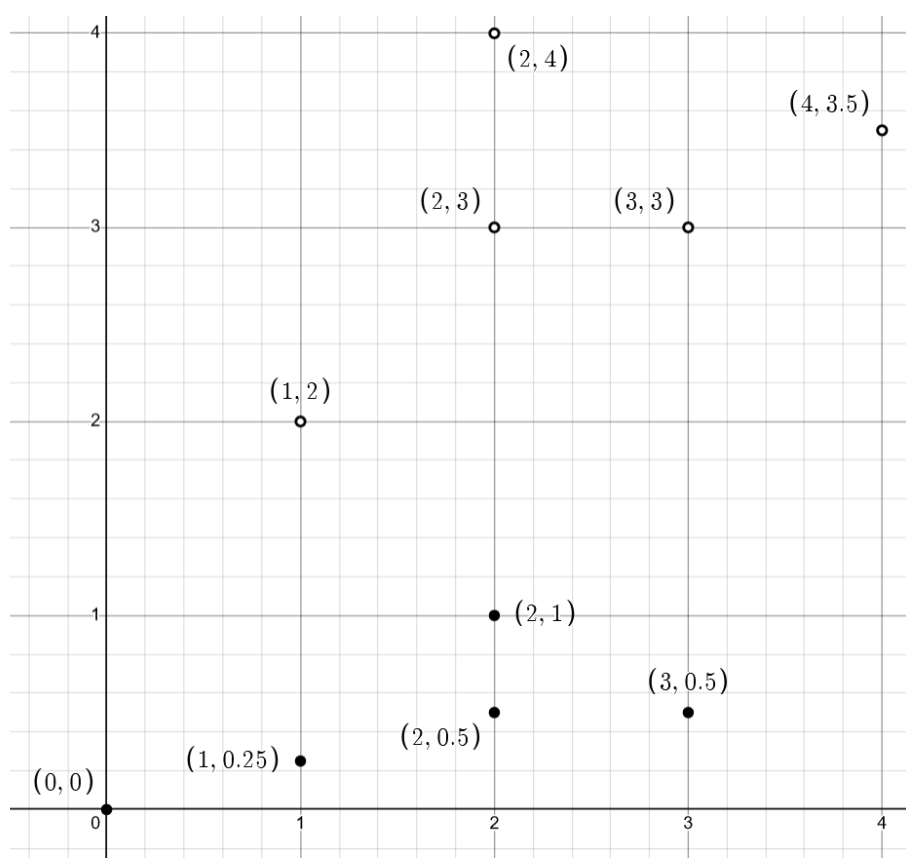
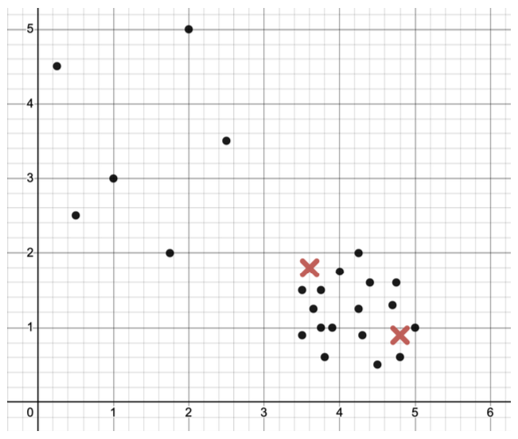
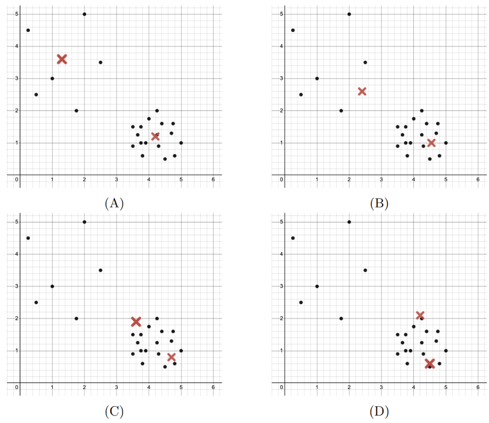
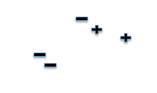
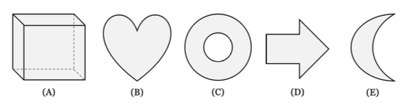
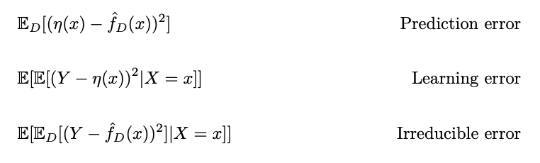

# Practice 2 Problem 4 Solutions

## Problem 1

Both forward and backward passes are a part of the backpropagation algorithm.

(a) True

(b) False

## Problem 2

Which of the following is the best option that can be done to reduce a model's bias?

(a) Add more input features.

(b) Standardize/normalize the data.

(c) Add regularization.

(d) Collect more data.

## Problem 3

Draw the maximum margin separating boundary between the hollow and filled points.

A Cartesian coordinate system is shown with an x-axis ranging from 0 to 4 and a y-axis ranging from 0 to 4. Grid lines are present at 0.5 unit intervals.

There are two types of points plotted:

**Hollow points (circles):**
- $(1, 2)$
- $(2, 3)$
- $(2, 4)$
- $(3, 3)$
- $(4, 3.5)$

**Filled points (solid dots):**
- $(0, 0)$
- $(1, 0.25)$
- $(2, 0.5)$
- $(2, 1)$
- $(3, 0.5)$

## Problem 4

Fix a kernel $K$ and corresponding feature map $\phi$. True/False: One can train and evaluate a kernelized SVM (with this kernel) in polynomial time only if $\phi(x)$ runs in polynomial time for every $x$.

(a) True

(b) False

**Extra credit:** explain your answer.

## Problem 5

Consider a data matrix $X \in \mathbb{R}^{n \times d}$. What is the smallest upper bound on $\operatorname{rank}(X)$ which holds for every $X$?

## Problem 6

Consider a kernel matrix $P$ that is given by $P_{ij} = \langle\phi(x_i), \phi(x_j)\rangle$ for a kernel map $\phi$, inner product $\langle\cdot, \cdot\rangle$, and data samples $x_i, x_j \in \mathbb{R}^d$. Write the closed-form solution for the $\hat{\alpha}$ that minimizes the loss function $L(\alpha) = \|y - P\alpha\|_2^2 + \lambda\alpha^T P\alpha$.

## Problem 7

You have a batch of size $N$ $256 \times 256$ RGB images as your input. The input tensor your neural network has the shape $(N, 3, 256, 256)$. You pass your input through a convolutional layer like below:

`Conv2d(in_channels=3, out_channels=28, kernel_size=9, stride=1, padding=1)`

What is the shape of your output tensor?

Answer: (____, ____, ____, ____)

## Problem 8

For ridge regression, how will the bias and variance in our estimate $\hat{w}$ change as the number of training examples $N$ increases? Assume the regularization parameter $\lambda$ is fixed.

(a) $\downarrow$ bias, $\uparrow$ variance

(b) same bias, $\downarrow$ variance

(c) same bias, $\uparrow$ variance

(d) $\downarrow$ bias, $\downarrow$ variance

(e) same bias, same variance

## Problem 9

Suppose you have a data matrix $X \in \mathbb{R}^{10,000 \times 10,000}$ where $x_{ij} \sim \text{iid } N(0, \sigma^2)$ for each $i, j \in [10,000]$ and you want to understand how many principal components are needed to have reconstruction error $\le 5/10,000$. What would be an efficient way to answer this question?

## Problem 10

What method can be described as a resampling method used to estimate population parameters by repeatedly sampling from a dataset?

(a) Power method

(b) Bootstrapping

(c) k-means

(d) SVD

## Problem 11

Let $A \in \mathbb{R}^{m \times m}$ and $x$ in $\mathbb{R}^m$. What is $\nabla_x x^T A x$?

Answer: $\nabla_x x^T A x = \rule{5cm}{0.15mm}$

## Problem 12

What is the biggest advantage of k-fold cross-validation over Leave-one-out (LOO) cross-validation?

(a) It provides a more accurate estimation of model performance

(b) Prevents overfitting

(c) Easier to compute

(d) Minimizes impact from sample size

## Problem 13

What is the expression for logistic loss? Here $\hat{y}$ is a prediction, and $y$ is the corresponding ground truth label.

(a) $\log(1+e^{-y\hat{y}})$

(b) $-\log(1+e^{-y\hat{y}})$

(c) $1 + e^{-y\hat{y}}$

(d) $\log(1+e^{y\hat{y}})$

## Problem 14

Suppose that you have a convolutional neural network with the following components:
1. One 2D-convolutional layer with two 2x2 kernels, stride 2, and no zero-padding
2. A max pooling layer of size 2x2 with stride 2.
3. One 2D-convolutional layer with one 1x1 kernel, stride 1, and no zero-padding
Suppose you propagate the input below (left) through the CNN with the following kernel weights. Assume there are no bias terms.

**Input:**
A $4 \times 4$ matrix labeled "Input":
$$
\begin{pmatrix}
1 & 3 & 0 & 3 \\
2 & 0 & 1 & 4 \\
7 & 1 & 6 & 2 \\
5 & 2 & 5 & 0
\end{pmatrix}
$$
Below the matrix, it is labeled "$4 \times 4$".

**Layer 1 Kernel 1:**
A $2 \times 2$ matrix labeled "Layer 1 Kernel 1":
$$
\begin{pmatrix}
-1 & 1 \\
-1 & 1
\end{pmatrix}
$$
Below the matrix, it is labeled "$2 \times 2$".

**Layer 1 Kernel 2:**
A $2 \times 2$ matrix labeled "Layer 1 Kernel 2":
$$
\begin{pmatrix}
1 & 1 \\
-1 & -1
\end{pmatrix}
$$
Below the matrix, it is labeled "$2 \times 2$".

**Layer 2 Kernel 1:**
A 3D block representing a kernel, with a '1' on its top face and a '1' on its bottom face. This visually implies a 1x1 kernel operating on two input channels (one '1' for each channel). Below it, it is labeled "$1 \times 2$".

What is the output of this network given the current weights and input?

(a) 0

(b) 4.5

(c) 8

(d) 9

## Problem 15

True/False: Given a set of points in a $d$-dimensional space, using PCA to reduce the dataset to $d' < d$ dimensions will **always** lead to loss of information.

(a) True

(b) False

## Problem 16

True/False: The bootstrap method can be applied to both regression and classification questions.

(a) True

(b) False

## Problem 17

Which of the following techniques can be helpful in reducing the original dimensions of input data? Select **all** that apply.

(a) L1 Regularization (LASSO)

(b) L2 Regularization (Ridge)

(c) Principal Component Analysis (PCA)

(d) $k$-means Clustering

## Problem 18

True/False: Given a dataset $X$ in a $d$-dimensional space, using PCA to project $X$ onto $d_1 < d_2 < d$ dimensions leads to the $d_1$ dimensional projection to being a subspace of the $d_2$-dimensional projection.

(a) True

(b) False

## Problem 19

Shade in the region where decision boundaries that lie inside it have equal training error.

A Cartesian coordinate system is shown with an x-axis ranging from 0 to 4 and a y-axis ranging from 0 to 4. Grid lines are present at 0.5 unit intervals.

There are two types of points plotted:

**Hollow points (circles):**
- $(1, 2)$
- $(2, 3)$
- $(2, 4)$
- $(3, 3)$
- $(4, 3.5)$

**Filled points (solid dots):**
- $(0, 0)$
- $(1, 0.25)$
- $(2, 0.5)$
- $(2, 1)$
- $(3, 0.5)$

## Problem 20

Which of the following features could allow a logistic regression model to perfectly classify all data points in the following figure? Select all that apply.

A Cartesian coordinate system is shown with an x-axis labeled 'X' ranging from -3 to 3 and a y-axis labeled 'y' ranging from -3 to 3. Major grid lines are present at integer values on both axes, and minor grid lines are present at 0.5 unit intervals.

There are two types of data points:
- **Crosses (x):** These points are distributed widely across the entire plot area, forming an outer region. They are present in all four quadrants.
- **Solid Circles (•):** These points are clustered tightly around the origin, primarily within the region where X is approximately between -0.5 and 0.5, and Y is approximately between -0.5 and 0.5. This cluster of solid circles forms an inner region, completely surrounded by the crosses.

(a) $|x_i|, |y_i|$

(b) $x_i + y_i, x_i - y_i$

(c) $x_i^2, y_i^2$

(d) $x_i^3, y_i^3$

## Problem 21

**Extra credit:** Suppose that we have $x_1, x_2, \dots, x_{2n}$ are independent and identically distributed realizations from the Laplacian distribution, the density of which is described by

$$f(x | \theta) = \frac{1}{2}e^{-|x-\theta|}$$

Find the M.L.E of $\theta$. Note that for this problem you may find the sign function useful, the definition of which is as follows

$$\operatorname{sign}(x) = \begin{cases} +1 & x \ge 0 \\ -1 & x < 0 \end{cases}$$

## Problem 22

SVM models that use slack variables have higher bias compared to SVM models that do not use slack variables.

(a) equal

(b) lower

(c) higher

## Problem 23

The following expression for $\hat{\Theta}_{2}$ will appear twice in this exam. Consider a distribution X with unknown mean and variance $\sigma^{2}$. We define the population variance to be as follows

$\hat{\Theta}_{2}=\frac{1}{n}(\sum_{i=1}^{n}(x_{i}-\hat{\Theta}_{1})^{2})$ for $\hat{\Theta}_{1}=\frac{1}{n}\sum_{i=1}^{n}x_{i}$

What is the expected value of $\Theta_{2}$?

## Problem 24

Which of the following statements about kernels is/are true? Select all that apply.

(a) A kernel feature map $\phi(x):\mathbb{R}^{d}\longrightarrow\mathbb{R}^{k}$ always maps to higher dimensional space (i.e., $k>d$.

(b) Kernel matrices depend on the size of the dataset.

(c) Kernel matrices are square.

(d) Kernel matrices are used for data dimensionality reduction.

## Problem 25

Both LASSO and PCA can be used for feature selection. Which of the following statements are true? Select all that apply.

(a) LASSO selects a subset (not necessarily a strict subset) of the original features

(b) If you use the kernel trick, principal component analysis and LASSO are equivalent learning "techniques"

(c) PCA produces features that are linear combinations of the original features

(d) PCA is a supervised learning algorithm

## Problem 26

Consider a dataset X where row $X_{i}$ corresponds to a complete medical record of an individual $i\in[n].$ Suppose the first column of X contains each patient's name, and no other column contains their name.

True/False: Removing the first column from X gives a dataset $X_{.,2:d}$ where no individual (row) is unique.

(a) True

(b) False

## Problem 27

True/False: The number of clusters k is a hyperparameter for Lloyd's Algorithm for k-means clustering.

(a) True

(b) False

## Problem 28

You are using Lloyd's algorithm (the algorithm described in class) to perform k-means clustering on a small dataset.

The following figure depicts the data and cluster centers for an iteration of the algorithm.

Dataset samples are denoted by markers and cluster centers are denoted by markers x.

Which of the following depicts the best estimate of the cluster center positions after the next single iteration of Lloyd's algorithm?

Hint: a single iteration refers to both update steps.

(a) Plot A

(b) Plot B

(c) Plot C

(d) Plot D

## Problem 29

Which of the following loss functions are convex? Select all that apply.

(a) 1-0 loss.

(b) Squared loss (MSE).

(c) Sigmoid loss.

(d) Logistic loss.

(e) Hinge loss.

## Problem 30

In neural networks, the activation functions sigmoid, ReLU, and tanh all

(a) always output values between 0 and 1.

(b) are applied only to the output units.

(c) are essential for learning non-linear decision boundaries.

(d) are needed to speed up the gradient computation during backpropagation (compared to not using activation functions at all).

## Problem 31

Consider a neural network with 8 layers trained on a dataset of 800 samples with a batch size of 10. How many forward passes through the entire network are needed to train this model for 5 epochs?

## Problem 32

k-means refers to optimizing which of the following objectives? Here $\mu_{C(j)}$ is the mean of the cluster that $x_{j}$ belongs to. m is the number of points.

(a) $F(\mu,C)=\sum_{j=1}^{m}||\mu_{C(j)}-x_{j}||_{2}^{2}$

(b) $F(\mu,C)=min_{j=1}^{m}||\mu_{C(j)}-x_{j}||_{2}^{2}$

(c) $F(\mu,C)=\sum_{j=1}^{m}||\mu_{C(j)}-x_{j}||_{2}$

(d) $F(\mu,C)=max_{j=1}^{m}||\mu_{C(j)}-x_{j}||_{2}^{2}$

## Problem 33

Which of the following statements about choosing L1 regularization (LASSO) over L2 regularization (Ridge) are true? Select all that apply.

(a) LASSO (L1) learns model weights faster than Ridge regression (L2).

(b) L1 regularization can help us identify which features are important for a certain task.

(c) L1 regularization usually achieves lower generalization error.

(d) If the feature space is large, evaluating models trained with L1 regularization is more computationally efficient.

## Problem 34

**Extra Credit:** Consider one of the "semi-fresh" datasets $\hat{X}$ generated using the bootstrap method for a dataset X, where n is large and $X_{i}\sim_{iid}\mathcal{D}$ Let $f_{X}$ be the model trained on X. $err(f_{X},\hat{X})$ is a/an

(a) unbiased estimate

(b) slightly biased upwards

(c) slightly biased downwards

of $err_{\mathcal{D}}(f_{X}).$

(d) very biased estimate (either upwards or downwards), to the point where this value by itself is not useful.

## Problem 35

Consider a nearest neighbor classifier that chooses the label for a test point to be the label of its nearest neighboring training example. What is its leave-one-out cross-validated error for the data in the following figure?

()"+" and "-" indicate labels of the points).

## Problem 36

Consider the following scatter plots of a data matrix X with four data points in $\mathbb{R}^{2}.$ Choose the plot whose line represents the direction of the first principal component of $X-\mu,$ where $X\in\mathbb{R}^{n\times d}$ the vector $\mu\in\mathbb{R}^{d}$ is the featurewise mean of X.

(a) Plot 1

(b) Plot 2

(c) Plot 3

(d) Plot 4

## Problem 37

Suppose that a model finds that towns with more children tend to have higher rates of poverty compared to towns with fewer children. Upon seeing this, a local mayor suggests that children be banished from the town in order to reduce poverty. What is the flaw of this reasoning?

(a) The reasoning is correct.

(b) We cannot make policy decisions based on a machine learning model.

(c) Correlation does not imply equal causation.

## Problem 38

Consider the following neural network with weights shown in the image below. Every hidden neuron uses the ReLU activation function, and there is no activation function on the output neuron. Assume there are no bias terms. What is the output of this network with the input $x=(1,2)?$ Give a numerical answer.

## Problem 39

Suppose you have a data matrix $X\in\mathbb{R}^{n\times10,000}$ and you want the 3 principal components of X. What is an efficient algorithm to compute these?

## Problem 40

In PCA, the following words go together (draw lines to match the words on the left with the words on the right)

## Problem 41

The following expression for $\hat{\Theta}_{2}$ will appear twice in this exam. Consider a distribution X with unknown mean and variance $\sigma^{2}$ We define the population variance to be as follows

Is $\hat{\Theta}_{2}$ unbiased?

(a) Yes

(b) No

$\hat{\Theta}_{2}=\frac{1}{n}(\sum_{i=1}^{n}(x_{i}-\hat{\Theta}_{1})^{2})$ for $\hat{\Theta}_{1}=\frac{1}{n}\sum_{i=1}^{n}x_{i}$

## Problem 42

Which of the following shapes are convex? Select all that apply.

(a) Shape A.

(b) Shape B.

(c) Shape C.

(d) Shape D.

(e) Shape E.

## Problem 43

Given a dataset X in a d-dimensional space, using PCA to project X onto $d1 < d2 < d$ dimensions leads to the d1 dimensional projection to have higher compared to the d2-dimensional projection.

## Problem 44

What are support vectors in an SVM without slack?

(a) The data points that don't fall into a specific classification.

(b) The most important features in the dataset.

(c) The data points on the margin of the SVM.

(d) All points within the dataset are considered support vectors.

## Problem 45

While training a neural network for a classification task, you realize that there isn't a significant change to the weights of the first few layers between iterations. What could NOT be a reason for this?

(a) The model is stuck in a local minimum.

(b) The network is very wide.

(c) The weights of the network are all zero.

(d) The learning rate is very small.

## Problem 46

Let $\eta(X)$ be an unknown function relating random variables X and Y , D be a dataset consisting of sample pairs (xi, yi) drawn iid from the probability distribution PXY , and $\hat{f}_D$ an estimator of $\eta$. Draw lines to match the expressions on the left with the words on the right.

## Problem 47

Given differentiable functions $f(x) : \mathbb{R} \to \mathbb{R}$ and $g(x) : \mathbb{R} \to \mathbb{R}$, which of the following statements is false?

(a) if f(x) is concave, then -f(x) is convex.

(b) if f(x) and g(x) are convex, then $h(x) := \max(f(x), g(x))$ is also convex.

(c) if f(x) and g(x) are convex, then $h(x) := \min(f(x), g(x))$ is also convex.

(d) f(x) can be both convex and concave on the same domain.

## Problem 48

Let A be an $n \times n$ matrix. Which of the following statements is true?

(a) If A is invertible, then $A^T$ is invertible

(b) If A is PSD, then A is invertible

(c) If A is symmetric, then A is invertible

(d) None of these answers.