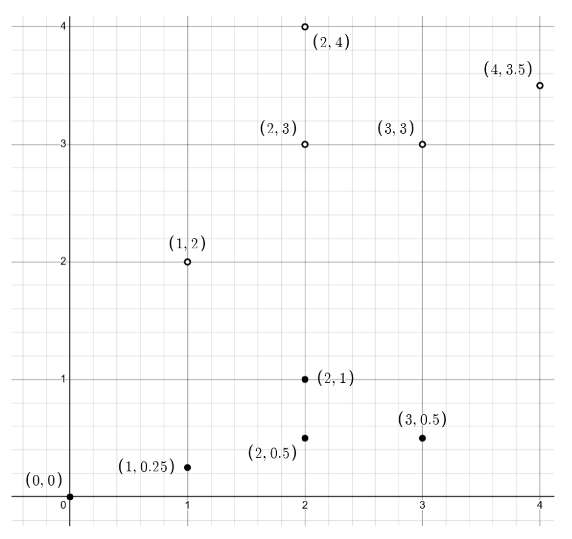
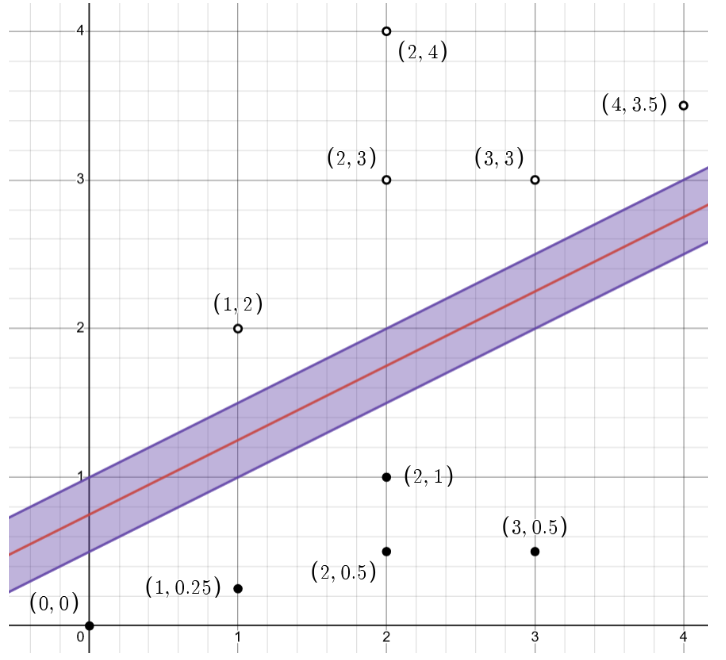
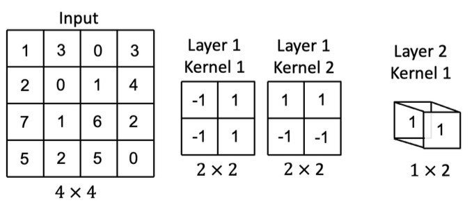
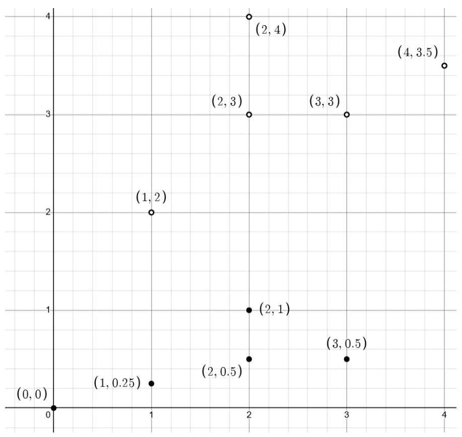
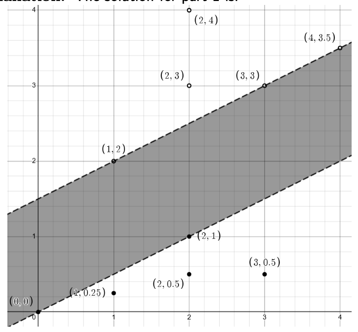

# Practice 2 Problem 4 Solutions

## Problem 1

Both forward and backward passes are a part of the backpropagation algorithm.

(a) True

(b) False

**Solution:** The solution is (a).

## Problem 2

Which of the following is the best option that can be done to reduce a model's bias?

(a) Add more input features.

(b) Standardize/normalize the data.

(c) Add regularization.

(d) Collect more data.

**Solution:** The solution is (a).

## Problem 3

Draw the maximum margin separating boundary between the hollow and filled points.

A Cartesian coordinate system is shown with an x-axis ranging from 0 to 4 and a y-axis ranging from 0 to 4. Grid lines are present at 0.5 unit intervals.

There are two types of points plotted:

**Hollow points (circles):**
- $(1, 2)$
- $(2, 3)$
- $(2, 4)$
- $(3, 3)$
- $(4, 3.5)$

**Filled points (solid dots):**
- $(0, 0)$
- $(1, 0.25)$
- $(2, 0.5)$
- $(2, 1)$
- $(3, 0.5)$

**Explanation:** The solution for part 2 is (red = actual, purple=acceptable):

A second Cartesian coordinate system is shown, identical in scale and points to the first.

All the hollow and filled points are plotted as described above.

A red line, representing the "actual" maximum margin separating boundary, is drawn. This line appears to pass through approximately $(0, 0.5)$, $(1, 1)$, $(2, 1.5)$, $(3, 2)$, and $(4, 2.5)$. The equation of this line can be approximated as $y = 0.5x + 0.5$.

A purple shaded band, representing the "acceptable" region for the separating boundary, surrounds the red line. The lower boundary of this purple band appears to pass through approximately $(0, 0.25)$, $(1, 0.75)$, $(2, 1.25)$, $(3, 1.75)$, and $(4, 2.25)$, which can be approximated as $y = 0.5x + 0.25$. The upper boundary of the purple band appears to pass through approximately $(0, 0.75)$, $(1, 1.25)$, $(2, 1.75)$, $(3, 2.25)$, and $(4, 2.75)$, which can be approximated as $y = 0.5x + 0.75$. The red line is centered within this purple band.

The hollow points are all above the upper boundary of the purple band, and the filled points are all below the lower boundary of the purple band, indicating a clear separation.

## Problem 4

Fix a kernel $K$ and corresponding feature map $\phi$. True/False: One can train and evaluate a kernelized SVM (with this kernel) in polynomial time only if $\phi(x)$ runs in polynomial time for every $x$.

(a) True

(b) False

**Extra credit:** explain your answer.

**Correct answers:** (b)

## Problem 5

Consider a data matrix $X \in \mathbb{R}^{n \times d}$. What is the smallest upper bound on $\operatorname{rank}(X)$ which holds for every $X$?

**Answer:** $\operatorname{rank}(X) \le \min(n, d)$

**Explanation:** The answer is $\operatorname{rank}(X) \le \min(n, d)$. We won't accept $n, d$ or really anything else which isn't equivalent to $n, d$.

## Problem 6

Consider a kernel matrix $P$ that is given by $P_{ij} = \langle\phi(x_i), \phi(x_j)\rangle$ for a kernel map $\phi$, inner product $\langle\cdot, \cdot\rangle$, and data samples $x_i, x_j \in \mathbb{R}^d$. Write the closed-form solution for the $\hat{\alpha}$ that minimizes the loss function $L(\alpha) = \|y - P\alpha\|_2^2 + \lambda\alpha^T P\alpha$.

**Answer:** $\hat{\alpha} = (P + \lambda I)^{-1}y$

**Explanation:** The answer is $\hat{\alpha} = (P + \lambda I)^{-1}y$

## Problem 7

You have a batch of size $N$ $256 \times 256$ RGB images as your input. The input tensor your neural network has the shape $(N, 3, 256, 256)$. You pass your input through a convolutional layer like below:

`Conv2d(in_channels=3, out_channels=28, kernel_size=9, stride=1, padding=1)`

What is the shape of your output tensor?

Answer: (____, ____, ____, ____)

**Explanation:** The answer is $(N, 28, 250, 250)$

## Problem 8

For ridge regression, how will the bias and variance in our estimate $\hat{w}$ change as the number of training examples $N$ increases? Assume the regularization parameter $\lambda$ is fixed.

(a) $\downarrow$ bias, $\uparrow$ variance

(b) same bias, $\downarrow$ variance

(c) same bias, $\uparrow$ variance

(d) $\downarrow$ bias, $\downarrow$ variance

(e) same bias, same variance

**Correct answers:** (b)

## Problem 9

Suppose you have a data matrix $X \in \mathbb{R}^{10,000 \times 10,000}$ where $x_{ij} \sim \text{iid } N(0, \sigma^2)$ for each $i, j \in [10,000]$ and you want to understand how many principal components are needed to have reconstruction error $\le 5/10,000$. What would be an efficient way to answer this question?

Answer: ________

**Explanation:** Accept SVD, or anything that refers to .eig/other packages. Kudos (+1)? if they also mention how to use these results (namely, look at the reconstruction error for each $d$ and pick the min $d$ with reconstruction error below the quantity. If they explain why this is the better choice (e.g, that this is likely a full-rank matrix so we'll need an overwhelming majority of our features for that level of reconstruction error), another +1. We don't accept the power method.

## Problem 10

What method can be described as a resampling method used to estimate population parameters by repeatedly sampling from a dataset?

(a) Power method

(b) Bootstrapping

(c) k-means

(d) SVD

**Correct answers:** (b)

## Problem 11

Let $A \in \mathbb{R}^{m \times m}$ and $x$ in $\mathbb{R}^m$. What is $\nabla_x x^T A x$?

Answer: $\nabla_x x^T A x = \rule{5cm}{0.15mm}$

**Explanation:** The solution is $(A + A^T)x$.

## Problem 12

What is the biggest advantage of k-fold cross-validation over Leave-one-out (LOO) cross-validation?

(a) It provides a more accurate estimation of model performance

(b) Prevents overfitting

(c) Easier to compute

(d) Minimizes impact from sample size

**Correct answers:** (c)

## Problem 13

What is the expression for logistic loss? Here $\hat{y}$ is a prediction, and $y$ is the corresponding ground truth label.

(a) $\log(1+e^{-y\hat{y}})$

(b) $-\log(1+e^{-y\hat{y}})$

(c) $1 + e^{-y\hat{y}}$

(d) $\log(1+e^{y\hat{y}})$

**Solution:** The solution is (a).

## Problem 14

Suppose that you have a convolutional neural network with the following components:
1. One 2D-convolutional layer with two 2x2 kernels, stride 2, and no zero-padding
2. A max pooling layer of size 2x2 with stride 2.
3. One 2D-convolutional layer with one 1x1 kernel, stride 1, and no zero-padding
Suppose you propagate the input below (left) through the CNN with the following kernel weights. Assume there are no bias terms.

**Input:**
A $4 \times 4$ matrix labeled "Input":
$$
\begin{pmatrix}
1 & 3 & 0 & 3 \\
2 & 0 & 1 & 4 \\
7 & 1 & 6 & 2 \\
5 & 2 & 5 & 0
\end{pmatrix}
$$
Below the matrix, it is labeled "$4 \times 4$".

**Layer 1 Kernel 1:**
A $2 \times 2$ matrix labeled "Layer 1 Kernel 1":
$$
\begin{pmatrix}
-1 & 1 \\
-1 & 1
\end{pmatrix}
$$
Below the matrix, it is labeled "$2 \times 2$".

**Layer 1 Kernel 2:**
A $2 \times 2$ matrix labeled "Layer 1 Kernel 2":
$$
\begin{pmatrix}
1 & 1 \\
-1 & -1
\end{pmatrix}
$$
Below the matrix, it is labeled "$2 \times 2$".

**Layer 2 Kernel 1:**
A 3D block representing a kernel, with a '1' on its top face and a '1' on its bottom face. This visually implies a 1x1 kernel operating on two input channels (one '1' for each channel). Below it, it is labeled "$1 \times 2$".

What is the output of this network given the current weights and input?

(a) 0

(b) 4.5

(c) 8

(d) 9

**Correct answers:** (d)

## Problem 15

True/False: Given a set of points in a $d$-dimensional space, using PCA to reduce the dataset to $d' < d$ dimensions will **always** lead to loss of information.

(a) True

(b) False

**Correct answers:** (b)

## Problem 16

True/False: The bootstrap method can be applied to both regression and classification questions.

(a) True

(b) False

**Correct answers:** (a)

## Problem 17

Which of the following techniques can be helpful in reducing the original dimensions of input data? Select **all** that apply.

(a) L1 Regularization (LASSO)

(b) L2 Regularization (Ridge)

(c) Principal Component Analysis (PCA)

(d) $k$-means Clustering

**Correct answers:** (a), (c)

## Problem 21

**Extra credit:** Suppose that we have $x_1, x_2, \dots, x_{2n}$ are independent and identically distributed realizations from the Laplacian distribution, the density of which is described by

$$f(x | \theta) = \frac{1}{2}e^{-|x-\theta|}$$

Find the M.L.E of $\theta$. Note that for this problem you may find the sign function useful, the definition of which is as follows

$$\operatorname{sign}(x) = \begin{cases} +1 & x \ge 0 \\ -1 & x < 0 \end{cases}$$

**Answer:**

**Explanation:** The solution is $\hat{\theta} \in [x_n, x_{n+1}]$

## Problem 18

True/False: Given a dataset $X$ in a $d$-dimensional space, using PCA to project $X$ onto $d_1 < d_2 < d$ dimensions leads to the $d_1$ dimensional projection to being a subspace of the $d_2$-dimensional projection.

(a) True

(b) False

**Correct answers:** (a)

## Problem 19

Shade in the region where decision boundaries that lie inside it have equal training error.

A Cartesian coordinate system is shown with an x-axis ranging from 0 to 4 and a y-axis ranging from 0 to 4. Grid lines are present at 0.5 unit intervals.

There are two types of points plotted:

**Hollow points (circles):**
- $(1, 2)$
- $(2, 3)$
- $(2, 4)$
- $(3, 3)$
- $(4, 3.5)$

**Filled points (solid dots):**
- $(0, 0)$
- $(1, 0.25)$
- $(2, 0.5)$
- $(2, 1)$
- $(3, 0.5)$

**Explanation:** The solution for part 1 is:

A Cartesian coordinate system is shown with an x-axis ranging from 0 to 4 and a y-axis ranging from 0 to 4. Grid lines are present. The same hollow and filled points as in the problem description are plotted.

A region is shaded in gray. This shaded region is bounded by two dashed lines:
- The upper dashed line passes through the points $(1, 2)$ and $(4, 3.5)$. Its equation is approximately $y = 0.5x + 1.5$.
- The lower dashed line passes through the points $(0, 0)$ and $(3, 0.5)$. Its equation is approximately $y = \frac{1}{6}x$.

The shaded region represents the area between these two dashed lines, inclusive of the lines themselves.

## Problem 20

Which of the following features could allow a logistic regression model to perfectly classify all data points in the following figure? Select all that apply.

A Cartesian coordinate system is shown with an x-axis labeled 'X' ranging from -3 to 3 and a y-axis labeled 'y' ranging from -3 to 3. Major grid lines are present at integer values on both axes, and minor grid lines are present at 0.5 unit intervals.

There are two types of data points:
- **Crosses (x):** These points are distributed widely across the entire plot area, forming an outer region. They are present in all four quadrants.
- **Solid Circles (•):** These points are clustered tightly around the origin, primarily within the region where X is approximately between -0.5 and 0.5, and Y is approximately between -0.5 and 0.5. This cluster of solid circles forms an inner region, completely surrounded by the crosses.

(a) $|x_i|, |y_i|$

(b) $x_i + y_i, x_i - y_i$

(c) $x_i^2, y_i^2$

(d) $x_i^3, y_i^3$

**Correct answers:** (a), (c)

