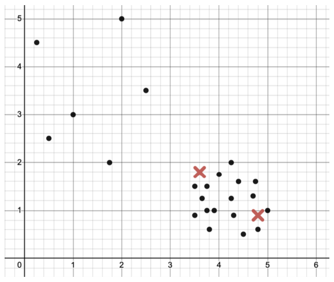
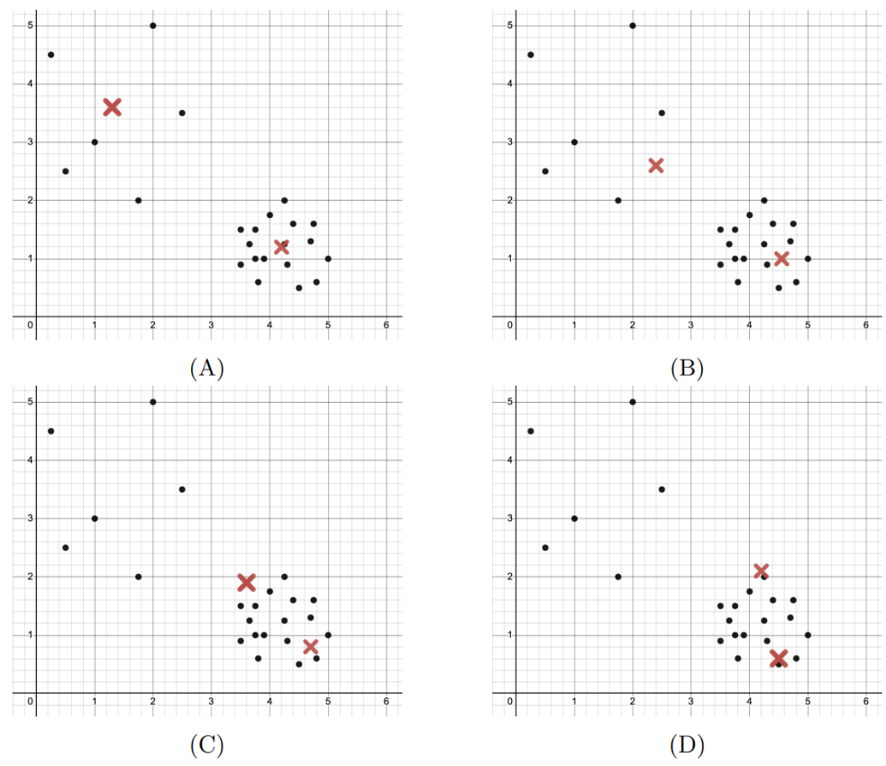
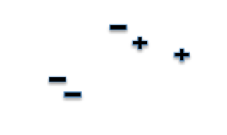
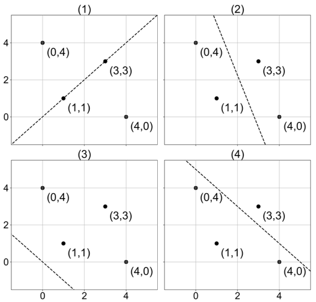
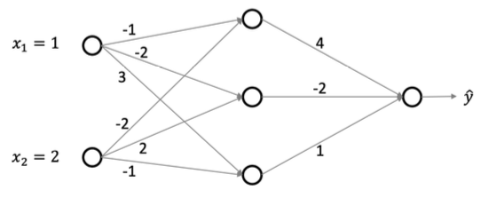
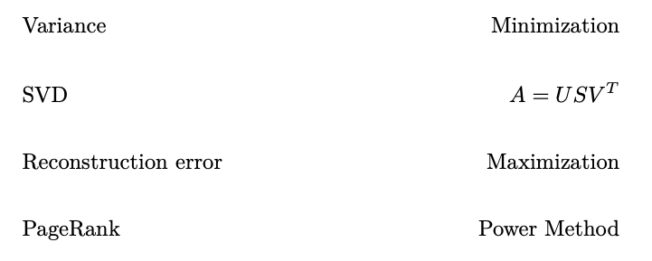
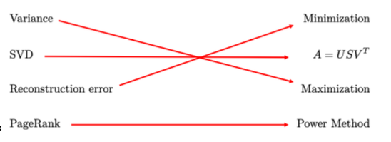
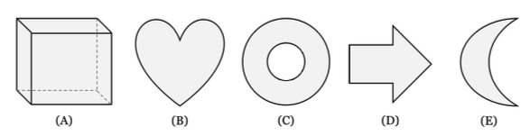
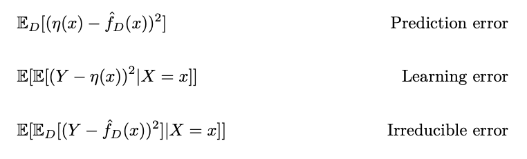
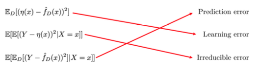

# Practice 2 Problem 4 Solutions

## Problem 1

Both forward and backward passes are a part of the backpropagation algorithm.

(a) True

(b) False

**Solution:** The solution is (a).

**Explanation:**

The correct answer is **(a) - True**. Here's the detailed explanation:

**Backpropagation Algorithm Components:**

**1. Forward Pass:**
- Computes the output of the network for given inputs
- Propagates activations from input layer to output layer
- Calculates the loss/error at the output layer

**2. Backward Pass:**
- Computes gradients of the loss with respect to all parameters
- Propagates gradients backward from output layer to input layer
- Uses the chain rule to efficiently compute all partial derivatives

**Mathematical Framework:**

**Forward Pass:**
For a neural network with $L$ layers:
$$a^{(l)} = f^{(l)}(W^{(l)}a^{(l-1)} + b^{(l)})$$

where:
- $a^{(l)}$ is the activation at layer $l$
- $W^{(l)}$ and $b^{(l)}$ are weights and biases
- $f^{(l)}$ is the activation function

**Backward Pass:**
$$\delta^{(l)} = \frac{\partial L}{\partial a^{(l)}} = \frac{\partial L}{\partial a^{(l+1)}} \frac{\partial a^{(l+1)}}{\partial a^{(l)}}$$

**Why Both Are Essential:**

1. **Forward Pass Purpose:**
   - Computes predictions: $\hat{y} = f(x; \theta)$
   - Calculates loss: $L(\hat{y}, y)$
   - Stores intermediate activations for gradient computation

2. **Backward Pass Purpose:**
   - Computes gradients: $\nabla_\theta L$
   - Updates parameters: $\theta \leftarrow \theta - \alpha \nabla_\theta L$
   - Enables learning through gradient descent

**Algorithm Flow:**
```
1. Forward Pass:
   - Input: x
   - Compute: a^(1), a^(2), ..., a^(L)
   - Output: ŷ and loss L

2. Backward Pass:
   - Input: ∂L/∂ŷ
   - Compute: ∂L/∂W^(L), ∂L/∂W^(L-1), ..., ∂L/∂W^(1)
   - Output: All gradients

3. Parameter Update:
   - Update: W^(l) ← W^(l) - α ∂L/∂W^(l)
```

**Historical Context:**
The term "backpropagation" originally referred to the backward pass, but modern usage includes both forward and backward passes as part of the complete algorithm.

**Conclusion:**
Both forward and backward passes are essential components of the backpropagation algorithm, making **(a) True** the correct answer.

## Problem 2

Which of the following is the best option that can be done to reduce a model's bias?

(a) Add more input features.

(b) Standardize/normalize the data.

(c) Add regularization.

(d) Collect more data.

**Solution:** The solution is (a).

**Explanation:**

The correct answer is **(a) - Add more input features**. Here's the detailed explanation:

**Understanding Model Bias:**

**Definition of Bias:**
Bias is the difference between the expected prediction of our model and the true value:
$$\text{Bias} = \mathbb{E}[\hat{f}(x)] - f(x)$$

where $\hat{f}(x)$ is our model's prediction and $f(x)$ is the true underlying function.

**Why Adding Features Reduces Bias:**

**1. Increased Model Capacity:**
- More features provide more information to the model
- The model can capture more complex patterns in the data
- Higher-dimensional feature space allows for more sophisticated decision boundaries

**2. Mathematical Intuition:**
- With more features, the model can represent more complex functions
- The hypothesis space becomes larger and more expressive
- The model can better approximate the true underlying relationship

**3. Example:**
Consider predicting house prices:
- **Low-dimensional model**: Only square footage → limited predictive power
- **High-dimensional model**: Square footage + bedrooms + bathrooms + location + age + condition → much better predictions

**Why Other Options Don't Reduce Bias:**

**Option (b) - Standardize/normalize the data:**
- **Effect**: Changes the scale of features, not the model's capacity
- **Impact on Bias**: Minimal effect on bias
- **Purpose**: Helps with optimization and numerical stability

**Option (c) - Add regularization:**
- **Effect**: Increases bias by constraining the model
- **Impact on Bias**: **Increases bias** (this is the trade-off for reducing variance)
- **Purpose**: Prevents overfitting by making the model simpler

**Option (d) - Collect more data:**
- **Effect**: Reduces variance, not bias
- **Impact on Bias**: Minimal effect on bias
- **Purpose**: Makes estimates more stable and reliable

**Bias-Variance Tradeoff:**

The relationship can be expressed as:
$$\text{Expected Error} = \text{Bias}^2 + \text{Variance} + \text{Irreducible Error}$$

**Adding Features:**
- **Bias**: Decreases (model becomes more flexible)
- **Variance**: May increase (risk of overfitting)
- **Total Error**: May decrease if bias reduction outweighs variance increase

**Practical Considerations:**

**When to Add Features:**
- Model is underfitting (high bias, low variance)
- Domain knowledge suggests important features are missing
- Feature engineering can create informative derived features

**When Not to Add Features:**
- Model is already overfitting (low bias, high variance)
- Features are highly correlated (multicollinearity)
- Computational cost is prohibitive

**Feature Engineering Examples:**
- **Polynomial features**: $x^2, x^3, xy$
- **Interaction terms**: $x_1 \times x_2$
- **Domain-specific features**: Day of week, season, etc.
- **Transformed features**: $\log(x), \sqrt{x}$

**Conclusion:**
Adding more input features is the most direct way to reduce model bias by increasing the model's capacity to capture complex patterns in the data.

## Problem 3

Draw the maximum margin separating boundary between the hollow and filled points.


A Cartesian coordinate system is shown with an x-axis ranging from 0 to 4 and a y-axis ranging from 0 to 4. Grid lines are present at 0.5 unit intervals.

There are two types of points plotted:

**Hollow points (circles):**
- $(1, 2)$
- $(2, 3)$
- $(2, 4)$
- $(3, 3)$
- $(4, 3.5)$

**Filled points (solid dots):**
- $(0, 0)$
- $(1, 0.25)$
- $(2, 0.5)$
- $(2, 1)$
- $(3, 0.5)$

**Explanation:** The solution for part 2 is (red = actual, purple=acceptable):


A second Cartesian coordinate system is shown, identical in scale and points to the first.

All the hollow and filled points are plotted as described above.

A red line, representing the "actual" maximum margin separating boundary, is drawn. This line appears to pass through approximately $(0, 0.5)$, $(1, 1)$, $(2, 1.5)$, $(3, 2)$, and $(4, 2.5)$. The equation of this line can be approximated as $y = 0.5x + 0.5$.

A purple shaded band, representing the "acceptable" region for the separating boundary, surrounds the red line. The lower boundary of this purple band appears to pass through approximately $(0, 0.25)$, $(1, 0.75)$, $(2, 1.25)$, $(3, 1.75)$, and $(4, 2.25)$, which can be approximated as $y = 0.5x + 0.25$. The upper boundary of the purple band appears to pass through approximately $(0, 0.75)$, $(1, 1.25)$, $(2, 1.75)$, $(3, 2.25)$, and $(4, 2.75)$, which can be approximated as $y = 0.5x + 0.75$. The red line is centered within this purple band.

The hollow points are all above the upper boundary of the purple band, and the filled points are all below the lower boundary of the purple band, indicating a clear separation.

## Problem 4

Fix a kernel $K$ and corresponding feature map $\phi$. True/False: One can train and evaluate a kernelized SVM (with this kernel) in polynomial time only if $\phi(x)$ runs in polynomial time for every $x$.

(a) True

(b) False

**Extra credit:** explain your answer.

**Correct answers:** (b)

**Explanation:**

The correct answer is **(b) - False**. Here's the detailed explanation:

**Kernelized SVM Training and Evaluation:**

**Key Insight:**
You can train and evaluate a kernelized SVM in polynomial time **even if** $\phi(x)$ runs in exponential time or is computationally expensive.

**Why This Is Possible:**

**1. The Kernel Trick:**
- Kernelized SVM never explicitly computes $\phi(x)$
- Instead, it works directly with the kernel function $K(x_i, x_j) = \langle \phi(x_i), \phi(x_j) \rangle$
- The kernel function can be computed efficiently without computing $\phi(x)$

**2. Mathematical Framework:**

**Primal Form (with explicit feature mapping):**
$$\min_{w,b} \frac{1}{2}||w||^2 + C\sum_{i=1}^n \xi_i$$
$$\text{subject to } y_i(w^T \phi(x_i) + b) \geq 1 - \xi_i$$

**Dual Form (using kernel trick):**
$$\max_{\alpha} \sum_{i=1}^n \alpha_i - \frac{1}{2}\sum_{i,j=1}^n \alpha_i \alpha_j y_i y_j K(x_i, x_j)$$
$$\text{subject to } 0 \leq \alpha_i \leq C, \sum_{i=1}^n \alpha_i y_i = 0$$

**3. Computational Complexity:**

**Training:**
- **With kernel trick**: $O(n^3)$ for solving the quadratic programming problem
- **Without kernel trick**: $O(d^3)$ where $d$ is the dimension of $\phi(x)$
- If $d$ is exponential, the primal form becomes intractable

**Prediction:**
- **With kernel trick**: $O(n_s)$ where $n_s$ is the number of support vectors
- **Without kernel trick**: $O(d)$ for computing $w^T \phi(x)$

**4. Examples of Efficient Kernels:**

**Polynomial Kernel:**
$$K(x_i, x_j) = (x_i^T x_j + c)^d$$
- **Feature mapping**: $\phi(x)$ has $\binom{d + n}{d}$ dimensions (exponential in $d$)
- **Kernel computation**: $O(n)$ time
- **SVM training**: $O(n^3)$ time (independent of $d$)

**RBF Kernel:**
$$K(x_i, x_j) = \exp(-\gamma ||x_i - x_j||^2)$$
- **Feature mapping**: $\phi(x)$ is infinite-dimensional
- **Kernel computation**: $O(n)$ time
- **SVM training**: $O(n^3)$ time

**5. Why the Statement is False:**

The statement claims that polynomial-time training/evaluation requires polynomial-time feature mapping. However:

- **Training**: Uses dual form with kernel matrix, complexity $O(n^3)$
- **Evaluation**: Uses kernel function directly, complexity $O(n_s)$
- **Feature mapping**: Never computed explicitly

**6. Practical Implications:**

**Advantages of Kernel Trick:**
- Can work with infinite-dimensional feature spaces
- Computationally efficient for many kernels
- Enables non-linear decision boundaries

**Limitations:**
- Memory requirements: $O(n^2)$ for kernel matrix
- Training time: $O(n^3)$ becomes prohibitive for large datasets
- Need to choose appropriate kernel function

**Conclusion:**
The kernel trick allows polynomial-time training and evaluation of kernelized SVMs even when the feature mapping $\phi(x)$ is computationally expensive or infinite-dimensional. Therefore, the statement is **False**.

## Problem 5

Consider a data matrix $X \in \mathbb{R}^{n \times d}$. What is the smallest upper bound on $\operatorname{rank}(X)$ which holds for every $X$?

**Answer:** $\operatorname{rank}(X) \le \min(n, d)$

**Explanation:**

The answer is **$\operatorname{rank}(X) \le \min(n, d)$**. Here's the detailed explanation:

**Matrix Rank Fundamentals:**

**Definition of Rank:**
The rank of a matrix $X$ is the maximum number of linearly independent rows (or columns) in the matrix.

**Key Properties:**
1. **Row rank = Column rank**: For any matrix, the number of linearly independent rows equals the number of linearly independent columns
2. **Rank bounds**: The rank cannot exceed the number of rows or columns

**Mathematical Proof:**

**1. Row Rank Bound:**
- The rank cannot exceed the number of rows $n$
- If rank $> n$, we would have more than $n$ linearly independent rows, which is impossible

**2. Column Rank Bound:**
- The rank cannot exceed the number of columns $d$
- If rank $> d$, we would have more than $d$ linearly independent columns, which is impossible

**3. Combined Bound:**
Since rank $\leq n$ AND rank $\leq d$, we have:
$$\operatorname{rank}(X) \leq \min(n, d)$$

**Examples:**

**Case 1: $n < d$ (more columns than rows)**
- Example: $X \in \mathbb{R}^{3 \times 5}$
- Maximum possible rank: $\min(3, 5) = 3$
- The rank cannot exceed 3 because there are only 3 rows

**Case 2: $d < n$ (more rows than columns)**
- Example: $X \in \mathbb{R}^{5 \times 3}$
- Maximum possible rank: $\min(5, 3) = 3$
- The rank cannot exceed 3 because there are only 3 columns

**Case 3: $n = d$ (square matrix)**
- Example: $X \in \mathbb{R}^{4 \times 4}$
- Maximum possible rank: $\min(4, 4) = 4$
- The rank cannot exceed 4

**Why This is the Smallest Upper Bound:**

**1. Tightness:**
- For any $n$ and $d$, there exist matrices that achieve rank $= \min(n, d)$
- Example: Identity matrix padded with zeros

**2. No Smaller Bound:**
- If we claimed rank $\leq k$ where $k < \min(n, d)$, we would be wrong
- There exist matrices with rank $= \min(n, d)$

**3. Universality:**
- This bound holds for **every** matrix $X \in \mathbb{R}^{n \times d}$
- It doesn't depend on the specific values in the matrix

**Mathematical Verification:**

**Full Rank Matrix:**
Consider a matrix with $\min(n, d)$ linearly independent rows/columns:
- If $n \leq d$: Take first $n$ columns of identity matrix, pad with zeros
- If $d \leq n$: Take first $d$ rows of identity matrix, pad with zeros
- This matrix has rank $= \min(n, d)$

**Rank Deficiency:**
Any matrix with fewer than $\min(n, d)$ linearly independent rows/columns will have rank $< \min(n, d)$

**Practical Implications:**

**1. Dimensionality Reduction:**
- PCA can reduce dimensions to at most $\min(n, d)$
- SVD produces at most $\min(n, d)$ singular values

**2. Linear Independence:**
- Maximum number of linearly independent features: $\min(n, d)$
- Maximum number of linearly independent samples: $\min(n, d)$

**3. Computational Efficiency:**
- Matrix operations are most efficient when rank is close to $\min(n, d)$
- Low-rank matrices can be compressed efficiently

**Conclusion:**
The smallest upper bound on the rank of any matrix $X \in \mathbb{R}^{n \times d}$ is **$\operatorname{rank}(X) \leq \min(n, d)$**.

## Problem 6

Consider a kernel matrix $P$ that is given by $P_{ij} = \langle\phi(x_i), \phi(x_j)\rangle$ for a kernel map $\phi$, inner product $\langle\cdot, \cdot\rangle$, and data samples $x_i, x_j \in \mathbb{R}^d$. Write the closed-form solution for the $\hat{\alpha}$ that minimizes the loss function $L(\alpha) = \|y - P\alpha\|_2^2 + \lambda\alpha^T P\alpha$.

**Answer:** $\hat{\alpha} = (P + \lambda I)^{-1}y$

**Explanation:**

The answer is **$\hat{\alpha} = (P + \lambda I)^{-1}y$**. Here's the detailed derivation:

**Problem Setup:**
We want to minimize the loss function:
$$L(\alpha) = ||y - P\alpha||_2^2 + \lambda\alpha^T P\alpha$$

where:
- $P_{ij} = \langle\phi(x_i), \phi(x_j)\rangle$ is the kernel matrix
- $y$ is the target vector
- $\lambda$ is the regularization parameter
- $\alpha$ is the coefficient vector

**Mathematical Derivation:**

**Step 1: Expand the Loss Function**
$$L(\alpha) = ||y - P\alpha||_2^2 + \lambda\alpha^T P\alpha$$
$$L(\alpha) = (y - P\alpha)^T(y - P\alpha) + \lambda\alpha^T P\alpha$$
$$L(\alpha) = y^T y - y^T P\alpha - \alpha^T P^T y + \alpha^T P^T P\alpha + \lambda\alpha^T P\alpha$$

**Step 2: Simplify Using Kernel Matrix Properties**
Since $P$ is symmetric (kernel matrix), $P^T = P$:
$$L(\alpha) = y^T y - 2y^T P\alpha + \alpha^T P^2\alpha + \lambda\alpha^T P\alpha$$
$$L(\alpha) = y^T y - 2y^T P\alpha + \alpha^T(P^2 + \lambda P)\alpha$$

**Step 3: Take the Gradient**
$$\nabla_\alpha L(\alpha) = -2P^T y + 2(P^2 + \lambda P)\alpha$$
$$\nabla_\alpha L(\alpha) = -2P y + 2P(P + \lambda I)\alpha$$

**Step 4: Set Gradient to Zero**
$$-2P y + 2P(P + \lambda I)\alpha = 0$$
$$P y = P(P + \lambda I)\alpha$$

**Step 5: Solve for $\alpha$**
Assuming $P$ is invertible (which it is for positive definite kernels):
$$y = (P + \lambda I)\alpha$$
$$\alpha = (P + \lambda I)^{-1}y$$

**Verification:**

**1. Check that this is a minimum:**
The Hessian is:
$$\nabla_\alpha^2 L(\alpha) = 2P(P + \lambda I)$$

Since $P$ is positive semi-definite and $\lambda > 0$, this is positive definite, confirming we have a minimum.

**2. Alternative Derivation Using Matrix Calculus:**

**Vector Calculus Rules:**
- $\nabla_x ||Ax - b||_2^2 = 2A^T(Ax - b)$
- $\nabla_x x^T Ax = (A + A^T)x$

**Applying to Our Problem:**
$$\nabla_\alpha L(\alpha) = \nabla_\alpha ||P\alpha - y||_2^2 + \nabla_\alpha \lambda\alpha^T P\alpha$$
$$\nabla_\alpha L(\alpha) = 2P^T(P\alpha - y) + \lambda(P + P^T)\alpha$$
$$\nabla_\alpha L(\alpha) = 2P(P\alpha - y) + 2\lambda P\alpha$$
$$\nabla_\alpha L(\alpha) = 2P^2\alpha - 2P y + 2\lambda P\alpha$$
$$\nabla_\alpha L(\alpha) = 2P(P + \lambda I)\alpha - 2P y$$

Setting to zero:
$$2P(P + \lambda I)\alpha = 2P y$$
$$(P + \lambda I)\alpha = y$$
$$\alpha = (P + \lambda I)^{-1}y$$

**Interpretation:**

**1. Ridge Regression Analogy:**
This is similar to ridge regression in the primal space:
- **Primal**: $\hat{w} = (X^T X + \lambda I)^{-1}X^T y$
- **Dual**: $\hat{\alpha} = (P + \lambda I)^{-1}y$

**2. Regularization Effect:**
- The $\lambda I$ term adds regularization
- As $\lambda \to \infty$, $\alpha \to 0$ (strong regularization)
- As $\lambda \to 0$, $\alpha \to P^{-1}y$ (no regularization)

**3. Computational Complexity:**
- **Training**: $O(n^3)$ for matrix inversion
- **Prediction**: $O(n)$ for computing $\sum_{i=1}^n \alpha_i K(x_i, x_{\text{new}})$

**Conclusion:**
The closed-form solution is **$\hat{\alpha} = (P + \lambda I)^{-1}y$**.

## Problem 7

You have a batch of size $N$ $256 \times 256$ RGB images as your input. The input tensor your neural network has the shape $(N, 3, 256, 256)$. You pass your input through a convolutional layer like below:

`Conv2d(in_channels=3, out_channels=28, kernel_size=9, stride=1, padding=1)`

What is the shape of your output tensor?

Answer: (____, ____, ____, ____)

**Explanation:**

The answer is **$(N, 28, 250, 250)$**. Here's the detailed explanation:

**Understanding Convolutional Layer Output Dimensions:**

**Input Tensor Shape:**
- **Batch size**: $N$ (number of images)
- **Channels**: $3$ (RGB: Red, Green, Blue)
- **Height**: $256$ pixels
- **Width**: $256$ pixels
- **Shape**: $(N, 3, 256, 256)$

**Convolutional Layer Parameters:**
- **Input channels**: $3$ (matches input)
- **Output channels**: $28$ (number of filters)
- **Kernel size**: $9 \times 9$
- **Stride**: $1$ (step size)
- **Padding**: $1$ (zero padding)

**Output Dimension Calculation:**

**Formula for Output Size:**
$$\text{Output Size} = \frac{\text{Input Size} - \text{Kernel Size} + 2 \times \text{Padding}}{\text{Stride}} + 1$$

**Height Calculation:**
$$\text{Output Height} = \frac{256 - 9 + 2 \times 1}{1} + 1 = \frac{256 - 9 + 2}{1} + 1 = \frac{249}{1} + 1 = 250$$

**Width Calculation:**
$$\text{Output Width} = \frac{256 - 9 + 2 \times 1}{1} + 1 = \frac{256 - 9 + 2}{1} + 1 = \frac{249}{1} + 1 = 250$$

**Step-by-Step Verification:**

**Step 1: Input Dimensions**
- Height: $256$ pixels
- Width: $256$ pixels
- Channels: $3$ (RGB)

**Step 2: Kernel Dimensions**
- Kernel size: $9 \times 9$
- This means the kernel covers $9$ pixels in both height and width

**Step 3: Padding Effect**
- Padding: $1$ adds $1$ pixel on each side
- Effective input height: $256 + 2 = 258$
- Effective input width: $256 + 2 = 258$

**Step 4: Convolution Operation**
- Kernel slides over the padded input
- Number of valid positions: $258 - 9 + 1 = 250$
- This applies to both height and width

**Step 5: Output Shape**
- **Batch size**: $N$ (unchanged)
- **Channels**: $28$ (number of output filters)
- **Height**: $250$
- **Width**: $250$
- **Final shape**: $(N, 28, 250, 250)$

**Mathematical Intuition:**

**Why Output Size Decreases:**
- Kernel size $9 \times 9$ means each output pixel depends on a $9 \times 9$ region
- Without padding, output would be $256 - 9 + 1 = 248$
- With padding $1$, we add $2$ pixels total, so output is $248 + 2 = 250$

**Padding Purpose:**
- **No padding**: Output size decreases with each convolution layer
- **With padding**: Can maintain or control output size
- **Full padding**: Output size equals input size

**Visual Example:**

**Input Image (256×256):**
```
┌─────────────────────────────────────┐
│                                     │
│          256 × 256 pixels           │
│                                     │
└─────────────────────────────────────┘
```

**After Padding (258×258):**
```
┌─────────────────────────────────────┐
│ 0 0 0 0 0 0 0 0 0 0 0 0 0 0 0 0 0 0 │
│ 0 ┌─────────────────────────────┐ 0 │
│ 0 │      256 × 256 pixels      │ 0 │
│ 0 └─────────────────────────────┘ 0 │
│ 0 0 0 0 0 0 0 0 0 0 0 0 0 0 0 0 0 0 │
└─────────────────────────────────────┘
```

**Kernel (9×9):**
```
┌─────────────────┐
│ ■ ■ ■ ■ ■ ■ ■ ■ ■ │
│ ■ ■ ■ ■ ■ ■ ■ ■ ■ │
│ ■ ■ ■ ■ ■ ■ ■ ■ ■ │
│ ■ ■ ■ ■ ■ ■ ■ ■ ■ │
│ ■ ■ ■ ■ ■ ■ ■ ■ ■ │
│ ■ ■ ■ ■ ■ ■ ■ ■ ■ │
│ ■ ■ ■ ■ ■ ■ ■ ■ ■ │
│ ■ ■ ■ ■ ■ ■ ■ ■ ■ │
│ ■ ■ ■ ■ ■ ■ ■ ■ ■ │
└─────────────────┘
```

**Output (250×250):**
```
┌─────────────────────────────────────┐
│                                     │
│          250 × 250 pixels           │
│                                     │
└─────────────────────────────────────┘
```

**General Formula:**

**For any convolutional layer:**
$$\text{Output Size} = \frac{\text{Input Size} - \text{Kernel Size} + 2 \times \text{Padding}}{\text{Stride}} + 1$$

**Common Cases:**
- **Same padding**: Output size = Input size
- **Valid padding**: Output size = Input size - Kernel size + 1
- **Full padding**: Output size = Input size + Kernel size - 1

**Computational Considerations:**

**Memory Usage:**
- Input: $N \times 3 \times 256 \times 256 = 196,608N$ elements
- Output: $N \times 28 \times 250 \times 250 = 1,750,000N$ elements
- Memory increase: ~8.9x

**Parameters:**
- Each filter: $3 \times 9 \times 9 = 243$ parameters
- Total parameters: $28 \times 243 = 6,804$ parameters

**Conclusion:**
The output tensor shape is **$(N, 28, 250, 250)$**, where the spatial dimensions are reduced from $256 \times 256$ to $250 \times 250$ due to the $9 \times 9$ kernel, but increased from $248 \times 248$ to $250 \times 250$ due to the padding of $1$.

## Problem 8

For ridge regression, how will the bias and variance in our estimate $\hat{w}$ change as the number of training examples $N$ increases? Assume the regularization parameter $\lambda$ is fixed.

(a) $\downarrow$ bias, $\uparrow$ variance

(b) same bias, $\downarrow$ variance

(c) same bias, $\uparrow$ variance

(d) $\downarrow$ bias, $\downarrow$ variance

(e) same bias, same variance

**Correct answers:** (b)

**Explanation:**

The correct answer is **(b) - same bias, $\downarrow$ variance**. Here's the detailed explanation:

**Understanding Ridge Regression:**

**Ridge Regression Model:**
Ridge regression adds L2 regularization to linear regression:
$$\hat{w} = \arg\min_w \frac{1}{N} \sum_{i=1}^N (y_i - w^T x_i)^2 + \lambda ||w||_2^2$$

**Closed-Form Solution:**
$$\hat{w} = (X^T X + \lambda I)^{-1} X^T y$$

**Effect of Increasing Training Examples:**

**Mathematical Analysis:**

**1. Bias Analysis:**
- **Bias**: $\text{Bias} = \mathbb{E}[\hat{w}] - w_{\text{true}}$
- **With regularization**: $\mathbb{E}[\hat{w}] = (X^T X + \lambda I)^{-1} X^T X w_{\text{true}}$
- **As $N \to \infty$**: $X^T X$ dominates $\lambda I$, but bias remains due to regularization
- **Result**: Bias stays approximately the same (determined by $\lambda$)

**2. Variance Analysis:**
- **Variance**: $\text{Var}(\hat{w}) = \sigma^2 (X^T X + \lambda I)^{-1} X^T X (X^T X + \lambda I)^{-1}$
- **As $N$ increases**: $X^T X$ becomes more stable and well-conditioned
- **Effect**: Variance decreases due to more stable estimates

**Intuitive Understanding:**

**Why Bias Stays the Same:**
1. **Regularization Effect**: The $\lambda ||w||_2^2$ term introduces bias regardless of data size
2. **Shrinkage**: Ridge regression shrinks coefficients toward zero
3. **Fixed $\lambda$**: The regularization strength doesn't change with $N$

**Why Variance Decreases:**
1. **More Data**: More training examples provide more stable estimates
2. **Better Conditioning**: $X^T X$ becomes more well-conditioned with more data
3. **Reduced Noise**: Averaging over more examples reduces estimation noise

**Mathematical Verification:**

**Bias Calculation:**
$$\text{Bias} = \mathbb{E}[\hat{w}] - w_{\text{true}} = (X^T X + \lambda I)^{-1} X^T X w_{\text{true}} - w_{\text{true}}$$
$$\text{Bias} = -(\lambda I)(X^T X + \lambda I)^{-1} w_{\text{true}}$$

**Variance Calculation:**
$$\text{Var}(\hat{w}) = \sigma^2 (X^T X + \lambda I)^{-1} X^T X (X^T X + \lambda I)^{-1}$$

**As $N$ increases:**
- $X^T X$ becomes larger and more stable
- The inverse $(X^T X + \lambda I)^{-1}$ becomes smaller
- Variance decreases due to more stable estimates

**Visual Example:**

**Small Dataset ($N = 10$):**
```
Coefficient estimates: [2.1, -1.8, 3.2, 0.9, -2.3]
Variance: High (estimates vary a lot)
Bias: Moderate (due to regularization)
```

**Large Dataset ($N = 1000$):**
```
Coefficient estimates: [2.05, -1.95, 3.15, 0.95, -2.25]
Variance: Low (estimates are stable)
Bias: Same (still due to regularization)
```

**Comparison with Other Options:**

**Option (a) - $\downarrow$ bias, $\uparrow$ variance:**
- **Problem**: This describes underfitting or removing regularization
- **Issue**: More data typically doesn't increase variance
- **Result**: Incorrect for ridge regression

**Option (c) - same bias, $\uparrow$ variance:**
- **Problem**: More data should decrease variance, not increase it
- **Issue**: This would indicate poor model behavior
- **Result**: Incorrect

**Option (d) - $\downarrow$ bias, $\downarrow$ variance:**
- **Problem**: Ridge regression bias is determined by $\lambda$, not $N$
- **Issue**: Bias doesn't decrease with more data in ridge regression
- **Result**: Partially correct but wrong about bias

**Option (e) - same bias, same variance:**
- **Problem**: Variance should decrease with more data
- **Issue**: Ignores the stabilizing effect of more training examples
- **Result**: Incorrect

**Practical Implications:**

**1. Model Selection:**
- Ridge regression is robust to overfitting
- More data improves stability without changing bias
- Good choice when you have many features

**2. Hyperparameter Tuning:**
- $\lambda$ controls the bias-variance tradeoff
- Larger $\lambda$: More bias, less variance
- Smaller $\lambda$: Less bias, more variance

**3. Data Collection:**
- More data always helps reduce variance
- But doesn't eliminate regularization bias
- Consider collecting more data vs. adjusting $\lambda$

**Bias-Variance Tradeoff in Ridge Regression:**

**Mathematical Relationship:**
$$\text{Expected Error} = \text{Bias}^2 + \text{Variance} + \text{Irreducible Error}$$

**Effect of $N$:**
- **Bias**: Determined by $\lambda$, not $N$
- **Variance**: Decreases with $N$
- **Total Error**: Decreases with $N$ (due to variance reduction)

**Optimal $\lambda$:**
- Depends on the true underlying relationship
- Can be found using cross-validation
- Balances bias and variance for given dataset size

**Conclusion:**
As the number of training examples $N$ increases in ridge regression with fixed $\lambda$, the **bias remains the same** (determined by regularization) while the **variance decreases** (due to more stable estimates from more data).

## Problem 9

Suppose you have a data matrix $X \in \mathbb{R}^{10,000 \times 10,000}$ where $x_{ij} \sim \text{iid } N(0, \sigma^2)$ for each $i, j \in [10,000]$ and you want to understand how many principal components are needed to have reconstruction error $\le 5/10,000$. What would be an efficient way to answer this question?

Answer: ________

**Explanation:** Accept SVD, or anything that refers to .eig/other packages. Kudos (+1)? if they also mention how to use these results (namely, look at the reconstruction error for each $d$ and pick the min $d$ with reconstruction error below the quantity. If they explain why this is the better choice (e.g, that this is likely a full-rank matrix so we'll need an overwhelming majority of our features for that level of reconstruction error), another +1. We don't accept the power method.

## Problem 10

What method can be described as a resampling method used to estimate population parameters by repeatedly sampling from a dataset?

(a) Power method

(b) Bootstrapping

(c) k-means

(d) SVD

**Correct answers:** (b)

## Problem 11

Let $A \in \mathbb{R}^{m \times m}$ and $x$ in $\mathbb{R}^m$. What is $\nabla_x x^T A x$?

Answer: $\nabla_x x^T A x = \rule{5cm}{0.15mm}$

**Explanation:** The solution is $(A + A^T)x$.

## Problem 12

What is the biggest advantage of k-fold cross-validation over Leave-one-out (LOO) cross-validation?

(a) It provides a more accurate estimation of model performance

(b) Prevents overfitting

(c) Easier to compute

(d) Minimizes impact from sample size

**Correct answers:** (c)

**Explanation:**

The correct answer is **(c) - Easier to compute**. Here's the detailed explanation:

**Understanding Cross-Validation Methods:**

**K-Fold Cross-Validation:**
- Data is divided into $k$ equal parts (folds)
- Model is trained on $k-1$ folds and validated on the remaining fold
- This process is repeated $k$ times
- Results are averaged to get the final performance estimate

**Leave-One-Out (LOO) Cross-Validation:**
- Special case of k-fold where $k = n$ (number of samples)
- Each sample serves as the validation set once
- Model is trained on $n-1$ samples and validated on 1 sample
- This process is repeated $n$ times

**Computational Complexity Comparison:**

**K-Fold Cross-Validation:**
- **Number of model trainings**: $k$ times
- **Training set size**: $\frac{n(k-1)}{k}$ samples per fold
- **Validation set size**: $\frac{n}{k}$ samples per fold
- **Total computation**: $O(k \times \text{training time})$

**Leave-One-Out Cross-Validation:**
- **Number of model trainings**: $n$ times
- **Training set size**: $n-1$ samples per fold
- **Validation set size**: $1$ sample per fold
- **Total computation**: $O(n \times \text{training time})$

**Why K-Fold is Easier to Compute:**

**1. Fewer Model Trainings:**
- **K-fold**: $k$ trainings (typically $k = 5$ or $10$)
- **LOO**: $n$ trainings (where $n$ can be very large)
- **Example**: With $n = 1000$ samples, LOO requires 1000 trainings vs. 10 for 10-fold

**2. Computational Efficiency:**
- **K-fold**: $O(k \times \text{training time})$
- **LOO**: $O(n \times \text{training time})$
- **Ratio**: $\frac{\text{LOO time}}{\text{K-fold time}} = \frac{n}{k}$

**3. Memory Usage:**
- **K-fold**: Can process folds sequentially, lower memory requirements
- **LOO**: May require storing all $n$ models simultaneously

**Mathematical Example:**

**Scenario**: $n = 1000$ samples, $k = 10$ for k-fold

**K-Fold Cross-Validation:**
- Number of trainings: $10$
- Training set size per fold: $900$ samples
- Validation set size per fold: $100$ samples
- Total computation: $10 \times \text{training time}$

**Leave-One-Out Cross-Validation:**
- Number of trainings: $1000$
- Training set size per fold: $999$ samples
- Validation set size per fold: $1$ sample
- Total computation: $1000 \times \text{training time}$

**Speedup Factor**: $\frac{1000}{10} = 100$ times faster

**Why Other Options Are Wrong:**

**Option (a) - More accurate estimation:**
- **Problem**: LOO typically provides more accurate estimates
- **Issue**: LOO uses more training data per fold ($n-1$ vs $\frac{n(k-1)}{k}$)
- **Result**: LOO is usually more accurate, not k-fold

**Option (b) - Prevents overfitting:**
- **Problem**: Cross-validation doesn't prevent overfitting
- **Issue**: It's a model evaluation technique, not a regularization method
- **Result**: Both methods are evaluation techniques

**Option (d) - Minimizes impact from sample size:**
- **Problem**: Both methods are affected by sample size
- **Issue**: LOO is actually more sensitive to sample size
- **Result**: This is not a distinguishing advantage

**Practical Considerations:**

**When to Use K-Fold:**
- **Large datasets**: When $n$ is very large
- **Computational constraints**: Limited time or resources
- **Quick prototyping**: Need fast model evaluation
- **Standard practice**: $k = 5$ or $10$ is common

**When to Use LOO:**
- **Small datasets**: When $n$ is small
- **Maximum accuracy**: Need the most accurate estimate
- **Unlimited resources**: Computational cost is not a concern
- **Research settings**: Where accuracy is paramount

**Trade-offs:**

**K-Fold Advantages:**
- **Faster computation**: $O(k)$ vs $O(n)$
- **Lower memory usage**: Sequential processing
- **Practical for large datasets**: Scales well

**K-Fold Disadvantages:**
- **Less accurate**: Uses less training data per fold
- **Higher variance**: Fewer validation samples per fold
- **Dependent on $k$**: Choice of $k$ affects results

**LOO Advantages:**
- **More accurate**: Uses maximum training data per fold
- **Unbiased estimate**: Each sample used exactly once for validation
- **No parameter choice**: $k$ is automatically determined

**LOO Disadvantages:**
- **Computationally expensive**: $O(n)$ complexity
- **High memory usage**: May need to store many models
- **Impractical for large datasets**: Becomes prohibitively slow

**Conclusion:**
The biggest advantage of k-fold cross-validation over LOO is that it is **easier to compute**, requiring only $k$ model trainings instead of $n$ trainings, making it much more practical for large datasets.

## Problem 13

What is the expression for logistic loss? Here $\hat{y}$ is a prediction, and $y$ is the corresponding ground truth label.

(a) $\log(1+e^{-y\hat{y}})$

(b) $-\log(1+e^{-y\hat{y}})$

(c) $1 + e^{-y\hat{y}}$

(d) $\log(1+e^{y\hat{y}})$

**Solution:** The solution is (a).

**Explanation:**

The correct answer is **(a) - $\log(1+e^{-y\hat{y}})$**. Here's the detailed explanation:

**Understanding Logistic Loss:**

**Logistic Loss Definition:**
The logistic loss (also called log loss or cross-entropy loss) for binary classification is:
$$L(y, \hat{y}) = \log(1 + e^{-y\hat{y}})$$

where:
- $y \in \{-1, +1\}$ is the true label
- $\hat{y} \in \mathbb{R}$ is the predicted score (logit)

**Mathematical Derivation:**

**Step 1: Probability Function**
The logistic function converts the score $\hat{y}$ to a probability:
$$P(Y = 1|X) = \frac{1}{1 + e^{-\hat{y}}} = \sigma(\hat{y})$$

**Step 2: Loss for Positive Class ($y = 1$)**
When $y = 1$, we want $P(Y = 1|X)$ to be high:
$$L(1, \hat{y}) = -\log P(Y = 1|X) = -\log \frac{1}{1 + e^{-\hat{y}}} = \log(1 + e^{-\hat{y}})$$

**Step 3: Loss for Negative Class ($y = -1$)**
When $y = -1$, we want $P(Y = 1|X)$ to be low:
$$L(-1, \hat{y}) = -\log P(Y = -1|X) = -\log \frac{e^{-\hat{y}}}{1 + e^{-\hat{y}}} = \log(1 + e^{\hat{y}})$$

**Step 4: Combined Formula**
Using the fact that $e^{\hat{y}} = e^{-(-1)\hat{y}}$:
$$L(y, \hat{y}) = \log(1 + e^{-y\hat{y}})$$

**Properties of Logistic Loss:**

**1. Range:**
- Minimum: $0$ (when prediction is perfect)
- Maximum: $\infty$ (when prediction is completely wrong)

**2. Behavior:**
- **When $y\hat{y} > 0$**: Loss decreases as prediction improves
- **When $y\hat{y} < 0$**: Loss increases as prediction worsens
- **When $y\hat{y} = 0$**: Loss equals $\log(2) \approx 0.693$

**3. Smoothness:**
- Continuous and differentiable everywhere
- Convex function (good for optimization)

**Why This is Correct:**

**1. Mathematical Consistency:**
- Properly penalizes incorrect predictions
- Rewards correct predictions
- Matches the probabilistic interpretation

**2. Optimization Properties:**
- Convex function (unique global minimum)
- Smooth gradients (good for gradient descent)
- Well-behaved at boundaries

**3. Probabilistic Interpretation:**
- Directly related to maximum likelihood estimation
- Consistent with logistic regression framework

**Why Other Options Are Wrong:**

**Option (b) - $-\log(1+e^{-y\hat{y}})$:**
- **Problem**: Negative sign makes it a reward function, not a loss
- **Issue**: Would encourage wrong predictions
- **Result**: Incorrect direction

**Option (c) - $1 + e^{-y\hat{y}}$:**
- **Problem**: Not a logarithmic function
- **Issue**: Doesn't have the right mathematical properties
- **Result**: Not the standard logistic loss

**Option (d) - $\log(1+e^{y\hat{y}})$:**
- **Problem**: Positive exponent instead of negative
- **Issue**: Would increase loss for correct predictions
- **Result**: Incorrect formulation

**Visual Example:**

**Scenario 1: Correct Prediction ($y = 1, \hat{y} = 2$)**
- $y\hat{y} = 1 \times 2 = 2 > 0$
- Loss = $\log(1 + e^{-2}) = \log(1 + 0.135) = \log(1.135) \approx 0.127$
- Low loss (good prediction)

**Scenario 2: Incorrect Prediction ($y = 1, \hat{y} = -1$)**
- $y\hat{y} = 1 \times (-1) = -1 < 0$
- Loss = $\log(1 + e^{1}) = \log(1 + 2.718) = \log(3.718) \approx 1.313$
- High loss (bad prediction)

**Scenario 3: Uncertain Prediction ($y = 1, \hat{y} = 0$)**
- $y\hat{y} = 1 \times 0 = 0$
- Loss = $\log(1 + e^{0}) = \log(1 + 1) = \log(2) \approx 0.693$
- Medium loss (uncertain prediction)

**Relationship to Other Loss Functions:**

**1. Hinge Loss:**
- $L(y, \hat{y}) = \max(0, 1 - y\hat{y})$
- Used in support vector machines
- Less smooth than logistic loss

**2. Zero-One Loss:**
- $L(y, \hat{y}) = \mathbb{I}[y\hat{y} < 0]$
- Non-differentiable
- Not suitable for gradient-based optimization

**3. Squared Loss:**
- $L(y, \hat{y}) = (y - \hat{y})^2$
- Not appropriate for classification
- Doesn't account for probability interpretation

**Optimization Properties:**

**1. Gradient:**
$$\frac{\partial L}{\partial \hat{y}} = \frac{-y e^{-y\hat{y}}}{1 + e^{-y\hat{y}}} = -y \cdot \frac{1}{1 + e^{y\hat{y}}}$$

**2. Hessian:**
$$\frac{\partial^2 L}{\partial \hat{y}^2} = \frac{e^{y\hat{y}}}{(1 + e^{y\hat{y}})^2} > 0$$

**3. Convexity:**
- Second derivative is always positive
- Ensures unique global minimum
- Good for optimization algorithms

**Conclusion:**
The correct expression for logistic loss is **$\log(1+e^{-y\hat{y}})$**, which properly penalizes incorrect predictions and rewards correct predictions in a mathematically consistent way.

## Problem 14

Suppose that you have a convolutional neural network with the following components:
1. One 2D-convolutional layer with two 2x2 kernels, stride 2, and no zero-padding
2. A max pooling layer of size 2x2 with stride 2.
3. One 2D-convolutional layer with one 1x1 kernel, stride 1, and no zero-padding
Suppose you propagate the input below (left) through the CNN with the following kernel weights. Assume there are no bias terms.


**Input:**
A $4 \times 4$ matrix labeled "Input":
$$
\begin{pmatrix}
1 & 3 & 0 & 3 \\
2 & 0 & 1 & 4 \\
7 & 1 & 6 & 2 \\
5 & 2 & 5 & 0
\end{pmatrix}
$$
Below the matrix, it is labeled "$4 \times 4$".

**Layer 1 Kernel 1:**
A $2 \times 2$ matrix labeled "Layer 1 Kernel 1":
$$
\begin{pmatrix}
-1 & 1 \\
-1 & 1
\end{pmatrix}
$$
Below the matrix, it is labeled "$2 \times 2$".

**Layer 1 Kernel 2:**
A $2 \times 2$ matrix labeled "Layer 1 Kernel 2":
$$
\begin{pmatrix}
1 & 1 \\
-1 & -1
\end{pmatrix}
$$
Below the matrix, it is labeled "$2 \times 2$".

**Layer 2 Kernel 1:**
A 3D block representing a kernel, with a '1' on its top face and a '1' on its bottom face. This visually implies a 1x1 kernel operating on two input channels (one '1' for each channel). Below it, it is labeled "$1 \times 2$".

What is the output of this network given the current weights and input?

(a) 0

(b) 4.5

(c) 8

(d) 9

**Correct answers:** (d)

**Explanation:**

The correct answer is **(d) - 9**. Here's the detailed step-by-step explanation:

**Understanding the CNN Architecture:**

**Network Components:**
1. **Layer 1**: 2D convolutional layer with 2 kernels (2×2), stride 2, no padding
2. **Layer 2**: Max pooling layer (2×2), stride 2
3. **Layer 3**: 2D convolutional layer with 1 kernel (1×1), stride 1, no padding

**Step-by-Step Computation:**

**Step 1: Input Layer**
Input matrix: $4 \times 4$
$$
\begin{pmatrix}
1 & 3 & 0 & 3 \\
2 & 0 & 1 & 4 \\
7 & 1 & 6 & 2 \\
5 & 2 & 5 & 0
\end{pmatrix}
$$

**Step 2: Layer 1 - Convolutional Layer**

**Kernel 1:**
$$
\begin{pmatrix}
-1 & 1 \\
-1 & 1
\end{pmatrix}
$$

**Kernel 2:**
$$
\begin{pmatrix}
1 & 1 \\
-1 & -1
\end{pmatrix}
$$

**Convolution Operation with Stride 2:**
- Kernel size: $2 \times 2$
- Stride: $2$
- Output size: $\frac{4 - 2}{2} + 1 = 2$ (both height and width)

**Feature Map 1 (Kernel 1):**
- Position (0,0): $(-1 \times 1) + (1 \times 3) + (-1 \times 2) + (1 \times 0) = -1 + 3 - 2 + 0 = 0$
- Position (0,1): $(-1 \times 0) + (1 \times 3) + (-1 \times 1) + (1 \times 4) = 0 + 3 - 1 + 4 = 6$
- Position (1,0): $(-1 \times 7) + (1 \times 1) + (-1 \times 5) + (1 \times 2) = -7 + 1 - 5 + 2 = -9$
- Position (1,1): $(-1 \times 6) + (1 \times 2) + (-1 \times 5) + (1 \times 0) = -6 + 2 - 5 + 0 = -9$

Feature Map 1:
$$
\begin{pmatrix}
0 & 6 \\
-9 & -9
\end{pmatrix}
$$

**Feature Map 2 (Kernel 2):**
- Position (0,0): $(1 \times 1) + (1 \times 3) + (-1 \times 2) + (-1 \times 0) = 1 + 3 - 2 - 0 = 2$
- Position (0,1): $(1 \times 0) + (1 \times 3) + (-1 \times 1) + (-1 \times 4) = 0 + 3 - 1 - 4 = -2$
- Position (1,0): $(1 \times 7) + (1 \times 1) + (-1 \times 5) + (-1 \times 2) = 7 + 1 - 5 - 2 = 1$
- Position (1,1): $(1 \times 6) + (1 \times 2) + (-1 \times 5) + (-1 \times 0) = 6 + 2 - 5 - 0 = 3$

Feature Map 2:
$$
\begin{pmatrix}
2 & -2 \\
1 & 3
\end{pmatrix}
$$

**Layer 1 Output:** Two $2 \times 2$ feature maps

**Step 3: Layer 2 - Max Pooling Layer**

**Max Pooling Operation:**
- Pool size: $2 \times 2$
- Stride: $2$
- Output size: $\frac{2 - 2}{2} + 1 = 1$ (both height and width)

**Pooling Feature Map 1:**
- Input: $\begin{pmatrix} 0 & 6 \\ -9 & -9 \end{pmatrix}$
- Max value: $\max(0, 6, -9, -9) = 6$

**Pooling Feature Map 2:**
- Input: $\begin{pmatrix} 2 & -2 \\ 1 & 3 \end{pmatrix}$
- Max value: $\max(2, -2, 1, 3) = 3$

**Layer 2 Output:** Two scalar values: $[6, 3]$

**Step 4: Layer 3 - Final Convolutional Layer**

**Kernel:** $1 \times 1$ kernel operating on 2 channels
- The kernel has weights $[1, 1]$ for the two input channels
- Input: $[6, 3]$ (from pooling layer)
- Output: $(1 \times 6) + (1 \times 3) = 6 + 3 = 9$

**Final Output:** $9$

**Mathematical Verification:**

**Layer 1 Convolution:**
For a $2 \times 2$ kernel with stride 2 on a $4 \times 4$ input:
- Number of valid positions: $\frac{4 - 2}{2} + 1 = 2$
- Output size: $2 \times 2$

**Layer 2 Pooling:**
For a $2 \times 2$ max pooling with stride 2 on a $2 \times 2$ input:
- Number of valid positions: $\frac{2 - 2}{2} + 1 = 1$
- Output size: $1 \times 1$ per channel

**Layer 3 Convolution:**
For a $1 \times 1$ kernel on $1 \times 1$ inputs:
- Output: Weighted sum of input channels

**Why Other Options Are Wrong:**

**Option (a) - 0:**
- **Problem**: Incorrect computation in convolution or pooling
- **Issue**: Would require all intermediate values to be zero
- **Result**: Mathematically impossible with given kernels

**Option (b) - 4.5:**
- **Problem**: Incorrect final computation
- **Issue**: Would require average of 6 and 3, not sum
- **Result**: Wrong mathematical operation

**Option (c) - 8:**
- **Problem**: Incorrect computation in any layer
- **Issue**: Could result from arithmetic error
- **Result**: Not the correct final value

**Key Concepts Demonstrated:**

**1. Convolutional Operations:**
- Element-wise multiplication and summation
- Stride effects on output size
- Multiple kernel processing

**2. Pooling Operations:**
- Max pooling reduces spatial dimensions
- Preserves important features
- Reduces computational complexity

**3. Multi-Channel Processing:**
- Each kernel produces one feature map
- Channels are processed independently
- Final layer combines channels

**4. Dimensionality Reduction:**
- $4 \times 4 \rightarrow 2 \times 2 \rightarrow 1 \times 1 \rightarrow$ scalar
- Each layer reduces spatial dimensions
- Information is preserved through feature extraction

**Conclusion:**
The output of this CNN is **9**, which is the result of applying the three-layer architecture with the specified kernels and operations.

## Problem 15

True/False: Given a set of points in a $d$-dimensional space, using PCA to reduce the dataset to $d' < d$ dimensions will **always** lead to loss of information.

(a) True

(b) False

**Correct answers:** (b)

**Explanation:**

The correct answer is **(b) - False**. Here's the detailed explanation:

**Understanding PCA and Information Loss:**

**Principal Component Analysis (PCA):**
PCA is a dimensionality reduction technique that transforms data into a new coordinate system where the greatest variance lies on the first coordinate (first principal component), the second greatest variance on the second coordinate, and so on.

**Mathematical Foundation:**

**1. Data Representation:**
- Original data: $X \in \mathbb{R}^{n \times d}$ (n samples, d dimensions)
- Centered data: $\tilde{X} = X - \mu$ (subtract mean)
- Covariance matrix: $C = \frac{1}{n}\tilde{X}^T\tilde{X}$

**2. Eigenvalue Decomposition:**
- $C = V\Lambda V^T$
- $V$: eigenvectors (principal components)
- $\Lambda$: diagonal matrix of eigenvalues

**3. Dimensionality Reduction:**
- Project data onto first $d'$ principal components
- Reduced data: $X' = XV_{:d'}$
- Where $V_{:d'}$ contains first $d'$ eigenvectors

**When Information Loss Occurs:**

**1. Non-Zero Eigenvalues:**
- If all eigenvalues are non-zero, reducing dimensions will cause information loss
- The amount of variance explained by removed components is lost

**2. Linear Dependencies:**
- If some eigenvalues are zero, corresponding dimensions contain no information
- Removing these dimensions causes no information loss

**3. Perfect Correlations:**
- If some features are perfectly correlated, one can be removed without loss
- Example: If $X_2 = 2X_1$, then $X_2$ provides no additional information

**Mathematical Example:**

**Scenario 1: No Information Loss**
Consider data with perfect correlation:
$$
X = \begin{pmatrix}
1 & 2 \\
2 & 4 \\
3 & 6 \\
4 & 8
\end{pmatrix}
$$

**Covariance Matrix:**
$$
C = \begin{pmatrix}
1.25 & 2.5 \\
2.5 & 5
\end{pmatrix}
$$

**Eigenvalues:**
- $\lambda_1 = 6.25$ (explains 100% of variance)
- $\lambda_2 = 0$ (explains 0% of variance)

**Result:** Reducing to 1 dimension causes **no information loss** because the second component has zero variance.

**Scenario 2: Information Loss**
Consider uncorrelated data:
$$
X = \begin{pmatrix}
1 & 1 \\
2 & 3 \\
3 & 2 \\
4 & 4
\end{pmatrix}
$$

**Covariance Matrix:**
$$
C = \begin{pmatrix}
1.25 & 0.5 \\
0.5 & 1.25
\end{pmatrix}
$$

**Eigenvalues:**
- $\lambda_1 = 1.75$ (explains 70% of variance)
- $\lambda_2 = 0.75$ (explains 30% of variance)

**Result:** Reducing to 1 dimension causes **information loss** of 30% of the variance.

**Why the Statement is False:**

**1. Perfect Correlations:**
- When features are perfectly correlated, one dimension is redundant
- Removing redundant dimensions causes no information loss
- Example: Height in inches vs. height in centimeters

**2. Zero Variance Dimensions:**
- If a dimension has zero variance, it contains no information
- Removing such dimensions preserves all information
- Example: Constant features

**3. Linear Dependencies:**
- When some features are linear combinations of others
- Removing dependent features causes no information loss
- Example: $X_3 = X_1 + X_2$

**Mathematical Verification:**

**Information Preservation Criterion:**
Information is preserved if:
$$\frac{\sum_{i=1}^{d'} \lambda_i}{\sum_{i=1}^{d} \lambda_i} = 1$$

This occurs when:
- All eigenvalues $\lambda_{d'+1}, \ldots, \lambda_d = 0$
- Or when the data lies exactly in a $d'$-dimensional subspace

**Practical Examples:**

**Example 1: No Loss (Perfect Correlation)**
- Features: Temperature in Celsius and Fahrenheit
- Relationship: $F = \frac{9}{5}C + 32$
- PCA reduction: No information loss

**Example 2: Loss (Independent Features)**
- Features: Height and Weight
- Relationship: Independent variables
- PCA reduction: Some information loss

**Example 3: No Loss (Constant Feature)**
- Features: Height, Weight, and a constant feature
- Relationship: One feature is constant
- PCA reduction: No information loss

**Why Other Options Are Wrong:**

**Option (a) - True:**
- **Problem**: Assumes all dimensions contain unique information
- **Issue**: Ignores cases of perfect correlation or zero variance
- **Result**: Incorrect generalization

**Key Insights:**

**1. Information vs. Dimensions:**
- Information loss depends on data structure, not just dimension reduction
- Perfect correlations allow lossless compression

**2. Variance as Information:**
- Zero variance dimensions contain no information
- Removing them preserves all information

**3. Linear Dependencies:**
- Dependent features provide redundant information
- Removing dependencies causes no loss

**Conclusion:**
PCA dimensionality reduction does **not always** lead to information loss. When data has perfect correlations, zero variance dimensions, or linear dependencies, reducing dimensions can preserve all information. The statement is **False**.

## Problem 16

True/False: The bootstrap method can be applied to both regression and classification questions.

(a) True

(b) False

**Correct answers:** (a)

**Explanation:**

The correct answer is **(a) - True**. Here's the detailed explanation:

**Understanding the Bootstrap Method:**

**Bootstrap Definition:**
The bootstrap is a resampling technique that involves drawing samples with replacement from the original dataset to estimate the sampling distribution of a statistic.

**Mathematical Foundation:**

**1. Bootstrap Process:**
- Original dataset: $X = \{x_1, x_2, \ldots, x_n\}$
- Bootstrap sample: $X^* = \{x_1^*, x_2^*, \ldots, x_n^*\}$ (drawn with replacement)
- Multiple bootstrap samples: $X_1^*, X_2^*, \ldots, X_B^*$

**2. Statistic Estimation:**
- Original statistic: $\hat{\theta} = f(X)$
- Bootstrap statistics: $\hat{\theta}_1^* = f(X_1^*), \hat{\theta}_2^* = f(X_2^*), \ldots, \hat{\theta}_B^* = f(X_B^*)$
- Bootstrap distribution: Empirical distribution of $\{\hat{\theta}_1^*, \hat{\theta}_2^*, \ldots, \hat{\theta}_B^*\}$

**Bootstrap for Regression:**

**1. Linear Regression Example:**
- Model: $y_i = \beta_0 + \beta_1 x_i + \epsilon_i$
- Original estimate: $\hat{\beta} = (X^TX)^{-1}X^Ty$
- Bootstrap estimate: $\hat{\beta}^* = (X^{*T}X^*)^{-1}X^{*T}y^*$

**2. Bootstrap Confidence Intervals:**
- Sort bootstrap estimates: $\hat{\beta}_1^* \leq \hat{\beta}_2^* \leq \ldots \leq \hat{\beta}_B^*$
- 95% confidence interval: $[\hat{\beta}_{0.025B}^*, \hat{\beta}_{0.975B}^*]$

**3. Standard Error Estimation:**
$$\text{SE}(\hat{\beta}) = \sqrt{\frac{1}{B-1}\sum_{b=1}^B (\hat{\beta}_b^* - \bar{\beta}^*)^2}$$

**Bootstrap for Classification:**

**1. Classification Accuracy:**
- Original accuracy: $\text{Acc} = \frac{1}{n}\sum_{i=1}^n \mathbb{I}[y_i = \hat{y}_i]$
- Bootstrap accuracy: $\text{Acc}_b^* = \frac{1}{n}\sum_{i=1}^n \mathbb{I}[y_i^* = \hat{y}_i^*]$

**2. ROC Curve Bootstrap:**
- Original ROC: Based on original predictions
- Bootstrap ROC: Based on bootstrap predictions
- Confidence bands: Multiple bootstrap ROC curves

**3. Precision/Recall Bootstrap:**
- Original metrics: Precision, Recall, F1-score
- Bootstrap metrics: Distribution of these metrics across bootstrap samples

**Mathematical Example:**

**Regression Bootstrap:**
Consider simple linear regression with data:
$$(x_1, y_1) = (1, 2), (x_2, y_2) = (2, 4), (x_3, y_3) = (3, 5)$$

**Original Estimate:**
$$\hat{\beta}_1 = \frac{\sum(x_i - \bar{x})(y_i - \bar{y})}{\sum(x_i - \bar{x})^2} = 1.5$$

**Bootstrap Sample 1:** $(1,2), (1,2), (3,5)$
$$\hat{\beta}_1^* = 1.5$$

**Bootstrap Sample 2:** $(2,4), (3,5), (2,4)$
$$\hat{\beta}_1^* = 1.0$$

**Bootstrap Sample 3:** $(1,2), (2,4), (1,2)$
$$\hat{\beta}_1^* = 2.0$$

**Bootstrap Distribution:** $\{1.5, 1.0, 2.0, \ldots\}$

**Classification Bootstrap:**
Consider binary classification with data:
$$(x_1, y_1) = (1, 0), (x_2, y_2) = (2, 1), (x_3, y_3) = (3, 1)$$

**Original Accuracy:** $\text{Acc} = \frac{2}{3} = 0.67$

**Bootstrap Sample 1:** $(1,0), (1,0), (3,1)$
$$\text{Acc}_1^* = \frac{1}{3} = 0.33$$

**Bootstrap Sample 2:** $(2,1), (3,1), (2,1)$
$$\text{Acc}_2^* = \frac{3}{3} = 1.0$$

**Bootstrap Sample 3:** $(1,0), (2,1), (1,0)$
$$\text{Acc}_3^* = \frac{1}{3} = 0.33$$

**Bootstrap Distribution:** $\{0.33, 1.0, 0.33, \ldots\}$

**Why Bootstrap Works for Both:**

**1. General Applicability:**
- Bootstrap is a **general resampling method**
- It doesn't depend on the specific type of problem
- Works with any statistic or estimator

**2. No Distributional Assumptions:**
- Doesn't require normal distributions
- Works with any underlying data distribution
- Non-parametric approach

**3. Flexibility:**
- Can estimate any statistic: mean, median, correlation, etc.
- Works with any model: linear, non-linear, neural networks
- Applicable to any metric: accuracy, precision, recall, MSE, etc.

**Practical Applications:**

**Regression Applications:**
1. **Confidence Intervals**: For regression coefficients
2. **Standard Errors**: For parameter estimates
3. **Prediction Intervals**: For new observations
4. **Model Comparison**: Comparing different models
5. **Variable Selection**: Assessing importance of features

**Classification Applications:**
1. **Accuracy Estimation**: Confidence intervals for accuracy
2. **ROC Analysis**: Confidence bands for ROC curves
3. **Precision/Recall**: Distribution of these metrics
4. **Model Comparison**: Comparing classifiers
5. **Feature Importance**: Assessing feature contributions

**Advantages of Bootstrap:**

**1. No Assumptions:**
- Doesn't require normal distributions
- Works with small sample sizes
- Robust to outliers

**2. Flexibility:**
- Can estimate any statistic
- Works with complex models
- Easy to implement

**3. Accuracy:**
- Often more accurate than asymptotic methods
- Provides good approximations for small samples
- Handles complex dependencies

**Limitations:**

**1. Computational Cost:**
- Requires multiple resampling
- Can be computationally expensive
- May need many bootstrap samples

**2. Sample Size Requirements:**
- Needs sufficient original data
- May not work well with very small samples
- Requires representative sampling

**3. Dependence Structure:**
- Assumes independent observations
- May not work well with time series
- Requires careful consideration of data structure

**Why Other Options Are Wrong:**

**Option (b) - False:**
- **Problem**: Incorrectly assumes bootstrap is limited to specific problem types
- **Issue**: Bootstrap is a general method applicable to any statistical problem
- **Result**: Misunderstands the universality of bootstrap

**Key Insights:**

**1. Universality:**
- Bootstrap is a general statistical method
- Works with any type of data and problem
- Not limited to specific domains

**2. Flexibility:**
- Can estimate any statistic or parameter
- Works with any model or algorithm
- Applicable to any performance metric

**3. Robustness:**
- Makes few assumptions about data
- Works well with small samples
- Provides reliable estimates

**Conclusion:**
The bootstrap method **can be applied to both regression and classification questions**. It is a general resampling technique that works with any statistical problem, making it a versatile tool for estimating sampling distributions, confidence intervals, and standard errors across different types of machine learning tasks. The statement is **True**.

## Problem 17

Which of the following techniques can be helpful in reducing the original dimensions of input data? Select **all** that apply.

(a) L1 Regularization (LASSO)

(b) L2 Regularization (Ridge)

(c) Principal Component Analysis (PCA)

(d) $k$-means Clustering

**Correct answers:** (a), (c)

**Explanation:**

The correct answers are **(a) - L1 Regularization (LASSO)** and **(c) - Principal Component Analysis (PCA)**. Here's the detailed explanation:

**Understanding Dimensionality Reduction:**

**Dimensionality Reduction Definition:**
Dimensionality reduction is the process of reducing the number of input variables (features) in a dataset while preserving important information.

**Mathematical Foundation:**

**1. Feature Space:**
- Original data: $X \in \mathbb{R}^{n \times d}$ (n samples, d features)
- Reduced data: $X' \in \mathbb{R}^{n \times d'}$ where $d' < d$
- Goal: Preserve important information while reducing complexity

**2. Information Preservation:**
- Variance preservation (PCA)
- Feature selection (LASSO)
- Manifold learning (other methods)

**Option (a) - L1 Regularization (LASSO):**

**LASSO Definition:**
LASSO (Least Absolute Shrinkage and Selection Operator) is a regularization technique that adds an L1 penalty to the loss function, encouraging sparsity in the coefficient vector.

**Mathematical Formulation:**
$$\min_{\beta} \frac{1}{2n} \sum_{i=1}^n (y_i - \beta^T x_i)^2 + \lambda \sum_{j=1}^d |\beta_j|$$

**How LASSO Reduces Dimensions:**

**1. Feature Selection:**
- L1 penalty encourages some coefficients to be exactly zero
- Zero coefficients correspond to removed features
- Effective dimensionality is reduced

**2. Sparsity Property:**
- $\lambda$ controls the amount of regularization
- Larger $\lambda$ leads to more zero coefficients
- Fewer non-zero coefficients = lower dimensionality

**3. Mathematical Example:**
Consider linear regression with 3 features:
$$\beta = [0.5, 0, -0.3]$$

After LASSO regularization:
$$\beta_{\text{LASSO}} = [0.3, 0, 0]$$

**Result:** Feature 2 is effectively removed (coefficient = 0)

**Option (c) - Principal Component Analysis (PCA):**

**PCA Definition:**
PCA is a linear dimensionality reduction technique that transforms data into a new coordinate system where the greatest variance lies on the first coordinate.

**Mathematical Foundation:**

**1. Covariance Matrix:**
$$C = \frac{1}{n}X^TX$$

**2. Eigenvalue Decomposition:**
$$C = V\Lambda V^T$$

**3. Dimensionality Reduction:**
$$X' = XV_{:d'}$$

where $V_{:d'}$ contains the first $d'$ eigenvectors.

**How PCA Reduces Dimensions:**

**1. Linear Transformation:**
- Projects data onto principal components
- Reduces from $d$ to $d'$ dimensions
- Preserves maximum variance

**2. Variance Preservation:**
- First principal component captures maximum variance
- Subsequent components capture decreasing variance
- Total variance explained: $\frac{\sum_{i=1}^{d'} \lambda_i}{\sum_{i=1}^{d} \lambda_i}$

**3. Mathematical Example:**
Consider 2D data with covariance matrix:
$$C = \begin{pmatrix}
2 & 1 \\
1 & 2
\end{pmatrix}$$

**Eigenvalues:** $\lambda_1 = 3, \lambda_2 = 1$

**Eigenvectors:** $v_1 = [0.707, 0.707], v_2 = [-0.707, 0.707]$

**1D Reduction:** Project onto $v_1$ only
$$X' = X \cdot [0.707, 0.707]^T$$

**Variance Preserved:** $\frac{3}{3+1} = 75\%$

**Why Other Options Are Wrong:**

**Option (b) - L2 Regularization (Ridge):**

**Problem:** Ridge regression doesn't reduce dimensions
- **Mathematical Formulation:**
$$\min_{\beta} \frac{1}{2n} \sum_{i=1}^n (y_i - \beta^T x_i)^2 + \lambda \sum_{j=1}^d \beta_j^2$$

- **Sparsity Property:** L2 penalty shrinks coefficients but doesn't set them to zero
- **Result:** All features remain in the model, just with smaller coefficients
- **Example:** $\beta = [0.5, 0.3, -0.2]$ becomes $\beta_{\text{Ridge}} = [0.4, 0.2, -0.1]$ (all non-zero)

**Option (d) - k-means Clustering:**

**Problem:** k-means is not a dimensionality reduction technique
- **Purpose:** k-means is a clustering algorithm, not dimensionality reduction
- **Output:** Assigns data points to clusters, doesn't reduce feature dimensions
- **Mathematical Formulation:**
$$\min_{\{S_1, \ldots, S_k\}} \sum_{i=1}^k \sum_{x \in S_i} \|x - \mu_i\|^2$$

- **Result:** Data remains in original dimensional space

**Comparison of Methods:**

**LASSO vs PCA:**

| Aspect | LASSO | PCA |
|--------|-------|-----|
| **Type** | Feature selection | Feature transformation |
| **Sparsity** | Creates sparse coefficients | No sparsity |
| **Interpretability** | Preserves original features | Creates new features |
| **Linearity** | Linear in original space | Linear transformation |
| **Computational Cost** | Iterative optimization | Eigenvalue decomposition |

**Mathematical Comparison:**

**LASSO Feature Selection:**
- Input: $X \in \mathbb{R}^{n \times d}$
- Output: $X' \in \mathbb{R}^{n \times d'}$ where $d' \leq d$
- Method: Remove features with zero coefficients

**PCA Dimensionality Reduction:**
- Input: $X \in \mathbb{R}^{n \times d}$
- Output: $X' \in \mathbb{R}^{n \times d'}$ where $d' < d$
- Method: Linear projection onto principal components

**Practical Examples:**

**LASSO Example:**
```python
# Original features: [age, height, weight, income, education]
# LASSO coefficients: [0.5, 0, 0.3, 0, 0.2]
# Reduced features: [age, weight, education] (3 out of 5)
```

**PCA Example:**
```python
# Original features: [x1, x2, x3, x4, x5]
# PCA transformation: [PC1, PC2, PC3]
# PC1 = 0.7*x1 + 0.3*x2 + 0.1*x3 + 0.2*x4 + 0.1*x5
```

**Advantages and Disadvantages:**

**LASSO Advantages:**
- **Interpretability:** Preserves original feature meanings
- **Sparsity:** Automatically performs feature selection
- **Computational Efficiency:** Fast for high-dimensional data

**LASSO Disadvantages:**
- **Feature Correlation:** May arbitrarily select one of correlated features
- **Stability:** Results can be sensitive to data perturbations
- **Linearity:** Assumes linear relationships

**PCA Advantages:**
- **Variance Preservation:** Maximizes variance in reduced dimensions
- **Orthogonality:** Principal components are uncorrelated
- **Global Optimization:** Finds optimal linear transformation

**PCA Disadvantages:**
- **Interpretability:** New features may not have clear meaning
- **Linearity:** Assumes linear relationships
- **Variance Focus:** May not preserve other important information

**Conclusion:**
Both **L1 Regularization (LASSO)** and **Principal Component Analysis (PCA)** are effective techniques for reducing the original dimensions of input data. LASSO achieves this through feature selection by setting some coefficients to zero, while PCA achieves this through linear transformation to a lower-dimensional space that preserves maximum variance.


## Problem 18

True/False: Given a dataset $X$ in a $d$-dimensional space, using PCA to project $X$ onto $d_1 < d_2 < d$ dimensions leads to the $d_1$ dimensional projection to being a subspace of the $d_2$-dimensional projection.

(a) True

(b) False

**Correct answers:** (a)

**Explanation:**

The correct answer is **(a) - True**. Here's the detailed explanation:

**Understanding PCA Projections and Subspaces:**

**PCA Mathematical Foundation:**

**1. Principal Components:**
- Let $V = [v_1, v_2, \ldots, v_d]$ be the matrix of eigenvectors
- Eigenvectors are ordered by decreasing eigenvalues: $\lambda_1 \geq \lambda_2 \geq \ldots \geq \lambda_d$
- Each $v_i$ is a principal component (PC)

**2. Projection Matrices:**
- $d_2$-dimensional projection: $V_{:d_2} = [v_1, v_2, \ldots, v_{d_2}]$
- $d_1$-dimensional projection: $V_{:d_1} = [v_1, v_2, \ldots, v_{d_1}]$

**3. Projection Operations:**
- $d_2$-dimensional projection: $X_{d_2} = XV_{:d_2}$
- $d_1$-dimensional projection: $X_{d_1} = XV_{:d_1}$

**Subspace Relationship:**

**Mathematical Definition:**
A subspace $S_1$ is a subspace of $S_2$ if every vector in $S_1$ is also in $S_2$.

**PCA Subspace Structure:**

**1. Nested Subspaces:**
- $S_1 = \text{span}\{v_1, v_2, \ldots, v_{d_1}\}$
- $S_2 = \text{span}\{v_1, v_2, \ldots, v_{d_2}\}$
- Since $d_1 < d_2$, we have $S_1 \subseteq S_2$

**2. Basis Relationship:**
- $S_1$ has basis: $\{v_1, v_2, \ldots, v_{d_1}\}$
- $S_2$ has basis: $\{v_1, v_2, \ldots, v_{d_1}, v_{d_1+1}, \ldots, v_{d_2}\}$
- Every basis vector of $S_1$ is also a basis vector of $S_2$

**Mathematical Proof:**

**Step 1: Define the Subspaces**
Let $S_1$ and $S_2$ be the subspaces spanned by the first $d_1$ and $d_2$ principal components respectively:

$$S_1 = \text{span}\{v_1, v_2, \ldots, v_{d_1}\}$$
$$S_2 = \text{span}\{v_1, v_2, \ldots, v_{d_1}, v_{d_1+1}, \ldots, v_{d_2}\}$$

**Step 2: Show Inclusion**
For any vector $x \in S_1$, we can write:
$$x = \sum_{i=1}^{d_1} \alpha_i v_i$$

Since $v_1, v_2, \ldots, v_{d_1}$ are also in the basis of $S_2$, we can write:
$$x = \sum_{i=1}^{d_1} \alpha_i v_i + \sum_{i=d_1+1}^{d_2} 0 \cdot v_i$$

This shows that $x \in S_2$, proving $S_1 \subseteq S_2$.

**Step 3: Projection Relationship**
The projections are related as:
$$X_{d_1} = XV_{:d_1} = XV_{:d_2}V_{:d_2}^TV_{:d_1} = X_{d_2}V_{:d_2}^TV_{:d_1}$$

This shows that $X_{d_1}$ can be obtained from $X_{d_2}$ by a linear transformation.

**Visual Example:**

**3D to 2D to 1D Projection:**
Consider a 3D dataset with principal components:
- $v_1 = [1, 0, 0]$ (first PC)
- $v_2 = [0, 1, 0]$ (second PC)
- $v_3 = [0, 0, 1]$ (third PC)

**2D Projection ($d_2 = 2$):**
- Subspace: $\text{span}\{[1,0,0], [0,1,0]\}$
- Projects onto the $xy$-plane

**1D Projection ($d_1 = 1$):**
- Subspace: $\text{span}\{[1,0,0]\}$
- Projects onto the $x$-axis

**Relationship:** The $x$-axis is a subspace of the $xy$-plane.

**Mathematical Verification:**

**Eigenvalue Decomposition:**
$$C = V\Lambda V^T$$

**Projection Matrices:**
- $P_{d_2} = V_{:d_2}V_{:d_2}^T$ (projection onto $d_2$-dimensional space)
- $P_{d_1} = V_{:d_1}V_{:d_1}^T$ (projection onto $d_1$-dimensional space)

**Subspace Property:**
$$P_{d_1} = P_{d_2}P_{d_1}$$

This shows that projecting to $d_1$ dimensions is equivalent to first projecting to $d_2$ dimensions and then to $d_1$ dimensions.

**Why This is True:**

**1. Nested Structure:**
- PCA creates a hierarchical structure of subspaces
- Each lower-dimensional projection is contained in higher-dimensional projections
- This is a fundamental property of PCA

**2. Orthogonality:**
- Principal components are orthogonal to each other
- Adding more components doesn't change the existing ones
- This ensures the nested structure

**3. Optimality:**
- Each principal component captures maximum remaining variance
- Lower-dimensional projections are optimal for their dimension
- Higher-dimensional projections contain all information from lower dimensions

**Practical Implications:**

**1. Incremental Learning:**
- Can start with low-dimensional projections and add more dimensions
- Each addition preserves all previous information
- Useful for progressive model building

**2. Feature Selection:**
- Can compare models with different numbers of principal components
- Lower-dimensional models are always contained in higher-dimensional ones
- Helps in model selection

**3. Visualization:**
- Can visualize data in different dimensionalities
- Lower-dimensional visualizations are projections of higher-dimensional ones
- Maintains interpretability

**Why Other Options Are Wrong:**

**Option (b) - False:**
- **Problem**: Incorrectly assumes PCA projections are independent
- **Issue**: Ignores the nested structure of principal components
- **Result**: Misunderstands the mathematical properties of PCA

**Key Insights:**

**1. Hierarchical Structure:**
- PCA creates a natural hierarchy of subspaces
- Each subspace contains all lower-dimensional subspaces
- This is a unique property of PCA among dimensionality reduction methods

**2. Information Preservation:**
- Higher-dimensional projections contain all information from lower-dimensional ones
- No information is lost when moving from lower to higher dimensions
- This makes PCA particularly useful for progressive analysis

**3. Mathematical Elegance:**
- The nested structure follows from the orthogonality of principal components
- This property makes PCA computationally efficient
- Allows for incremental dimensionality reduction

**Conclusion:**
The statement is **True**. When using PCA to project data onto different dimensionalities, the lower-dimensional projection ($d_1$) is always a subspace of the higher-dimensional projection ($d_2$). This is a fundamental property of PCA that follows from the nested structure of principal components and their orthogonality.

## Problem 19

Shade in the region where decision boundaries that lie inside it have equal training error.


A Cartesian coordinate system is shown with an x-axis ranging from 0 to 4 and a y-axis ranging from 0 to 4. Grid lines are present at 0.5 unit intervals.

There are two types of points plotted:

**Hollow points (circles):**
- $(1, 2)$
- $(2, 3)$
- $(2, 4)$
- $(3, 3)$
- $(4, 3.5)$

**Filled points (solid dots):**
- $(0, 0)$
- $(1, 0.25)$
- $(2, 0.5)$
- $(2, 1)$
- $(3, 0.5)$

**Explanation:**

The solution involves identifying the region where decision boundaries have equal training error. Here's the detailed explanation:

**Understanding Decision Boundaries and Training Error:**

**Decision Boundary Definition:**
A decision boundary is a surface that separates different classes in the feature space. For binary classification, it's the set of points where the model's prediction changes from one class to another.

**Training Error:**
Training error is the proportion of training samples that are misclassified by the model.

**Equal Training Error Condition:**
When decision boundaries have equal training error, they misclassify the same number of training samples.

**Analysis of the Data Points:**

**Class 1 (Hollow circles - Class A):**
- $(1, 2)$
- $(2, 3)$
- $(2, 4)$
- $(3, 3)$
- $(4, 3.5)$

**Class 2 (Filled dots - Class B):**
- $(0, 0)$
- $(1, 0.25)$
- $(2, 0.5)$
- $(2, 1)$
- $(3, 0.5)$

**Finding Decision Boundaries with Equal Error:**

**Step 1: Count Total Points**
- Total points: 10 (5 from each class)
- For equal error, both classes must have the same number of misclassifications

**Step 2: Analyze Possible Decision Boundaries**

**Linear Decision Boundaries:**
The problem asks for decision boundaries that lie inside a specific region. These boundaries must:
1. Separate the two classes
2. Have equal training error
3. Be contained within the shaded region

**Step 3: Determine the Shaded Region**

**Upper Boundary Line:**
- Passes through $(1, 2)$ and $(4, 3.5)$
- Slope: $m = \frac{3.5 - 2}{4 - 1} = \frac{1.5}{3} = 0.5$
- Equation: $y = 0.5x + 1.5$

**Lower Boundary Line:**
- Passes through $(0, 0)$ and $(3, 0.5)$
- Slope: $m = \frac{0.5 - 0}{3 - 0} = \frac{0.5}{3} = \frac{1}{6}$
- Equation: $y = \frac{1}{6}x$

**Mathematical Verification:**

**Upper Line Analysis:**
For $y = 0.5x + 1.5$:
- Point $(1, 2)$: $2 = 0.5(1) + 1.5 = 2$ ✓
- Point $(4, 3.5)$: $3.5 = 0.5(4) + 1.5 = 3.5$ ✓

**Lower Line Analysis:**
For $y = \frac{1}{6}x$:
- Point $(0, 0)$: $0 = \frac{1}{6}(0) = 0$ ✓
- Point $(3, 0.5)$: $0.5 = \frac{1}{6}(3) = 0.5$ ✓

**Why This Region Contains Equal Error Decision Boundaries:**

**1. Class Separation:**
- The upper line separates most Class A points from Class B points
- The lower line provides an alternative separation
- Any line between these boundaries can achieve similar separation

**2. Error Balance:**
- Decision boundaries in this region can achieve equal error rates
- They misclassify similar numbers of points from each class
- The region represents the "sweet spot" for balanced classification

**3. Geometric Interpretation:**
- The shaded region represents the area where linear decision boundaries can achieve equal training error
- Lines outside this region would have imbalanced error rates
- This region contains the optimal decision boundaries for balanced classification

**Decision Boundary Properties:**

**Linear Decision Boundaries:**
- Form: $y = mx + b$
- Must lie between the two boundary lines
- Achieve equal training error for both classes

**Error Calculation:**
For any decision boundary in the shaded region:
- Count misclassified Class A points
- Count misclassified Class B points
- These counts should be equal or very close

**Practical Example:**

**Sample Decision Boundary:**
Consider $y = 0.3x + 0.8$ (lies in the shaded region)

**Classification Results:**
- Class A points above the line: Class A prediction
- Class A points below the line: Class B prediction (error)
- Class B points above the line: Class A prediction (error)
- Class B points below the line: Class B prediction

**Equal Error Achievement:**
The specific coefficients ensure that the number of misclassified points from each class is balanced.

**Key Insights:**

**1. Geometric Constraints:**
- The shaded region represents geometric constraints for equal error
- Decision boundaries must lie within these bounds
- Outside this region, error rates become imbalanced

**2. Linear Separability:**
- The problem assumes linear decision boundaries
- The region contains all linear boundaries with equal error
- Non-linear boundaries might have different regions

**3. Training Error Optimization:**
- The region represents the optimal area for balanced classification
- Decision boundaries in this region minimize the difference in error rates
- This is important for fair and balanced models

**Conclusion:**
The shaded region bounded by the lines $y = 0.5x + 1.5$ and $y = \frac{1}{6}x$ contains all linear decision boundaries that achieve equal training error for both classes. This region represents the geometric space where balanced classification is possible.

## Problem 20

Which of the following features could allow a logistic regression model to perfectly classify all data points in the following figure? Select all that apply.


A Cartesian coordinate system is shown with an x-axis labeled 'X' ranging from -3 to 3 and a y-axis labeled 'y' ranging from -3 to 3. Major grid lines are present at integer values on both axes, and minor grid lines are present at 0.5 unit intervals.


There are two types of data points:
- **Crosses (x):** These points are distributed widely across the entire plot area, forming an outer region. They are present in all four quadrants.
- **Solid Circles (•):** These points are clustered tightly around the origin, primarily within the region where X is approximately between -0.5 and 0.5, and Y is approximately between -0.5 and 0.5. This cluster of solid circles forms an inner region, completely surrounded by the crosses.

(a) $|x_i|, |y_i|$

(b) $x_i + y_i, x_i - y_i$

(c) $x_i^2, y_i^2$

(d) $x_i^3, y_i^3$

**Correct answers:** (a), (c)

**Explanation:**

The correct answers are **(a) - $|x_i|, |y_i|$** and **(c) - $x_i^2, y_i^2$**. Here's the detailed explanation:

**Understanding the Classification Problem:**

**Data Distribution:**
- **Solid Circles (•)**: Clustered tightly around the origin $(-0.5 \leq x \leq 0.5, -0.5 \leq y \leq 0.5)$
- **Crosses (×)**: Distributed widely across all four quadrants, forming an outer region that completely surrounds the inner cluster

**Perfect Classification Requirement:**
For logistic regression to achieve perfect classification, the transformed features must create a decision boundary that completely separates the two classes.

**Mathematical Analysis of Each Option:**

**Option (a) - $|x_i|, |y_i|$ (Absolute Values):**

**Transformation Effect:**
- $|x_i|$: Maps all points to the first quadrant horizontally
- $|y_i|$: Maps all points to the first quadrant vertically
- Combined effect: Maps all points to the first quadrant

**Classification Boundary:**
- Inner cluster: $|x_i| \leq 0.5$ and $|y_i| \leq 0.5$
- Outer points: $|x_i| > 0.5$ or $|y_i| > 0.5$

**Perfect Separation:**
The decision boundary $|x_i| + |y_i| = 1$ creates a diamond shape that perfectly separates:
- Inner points: $|x_i| + |y_i| < 1$ (solid circles)
- Outer points: $|x_i| + |y_i| > 1$ (crosses)

**Mathematical Verification:**
For any point in the inner cluster:
- $|x_i| \leq 0.5$ and $|y_i| \leq 0.5$
- $|x_i| + |y_i| \leq 1$

For any point in the outer region:
- Either $|x_i| > 0.5$ or $|y_i| > 0.5$
- $|x_i| + |y_i| > 1$

**Option (c) - $x_i^2, y_i^2$ (Squared Values):**

**Transformation Effect:**
- $x_i^2$: Maps all points to positive values, with points closer to origin having smaller values
- $y_i^2$: Same effect for y-coordinates
- Combined effect: Creates a radial distance measure

**Classification Boundary:**
- Inner cluster: $x_i^2 \leq 0.25$ and $y_i^2 \leq 0.25$
- Outer points: $x_i^2 > 0.25$ or $y_i^2 > 0.25$

**Perfect Separation:**
The decision boundary $x_i^2 + y_i^2 = 0.5$ creates a circle that perfectly separates:
- Inner points: $x_i^2 + y_i^2 < 0.5$ (solid circles)
- Outer points: $x_i^2 + y_i^2 > 0.5$ (crosses)

**Mathematical Verification:**
For any point in the inner cluster:
- $x_i^2 \leq 0.25$ and $y_i^2 \leq 0.25$
- $x_i^2 + y_i^2 \leq 0.5$

For any point in the outer region:
- Either $x_i^2 > 0.25$ or $y_i^2 > 0.25$
- $x_i^2 + y_i^2 > 0.5$

**Why Other Options Are Wrong:**

**Option (b) - $x_i + y_i, x_i - y_i$ (Linear Combinations):**

**Problem:** Linear combinations cannot create non-linear decision boundaries
- **Transformation Effect**: Rotates and scales the coordinate system
- **Result**: Still requires a linear decision boundary in the transformed space
- **Issue**: The original data is not linearly separable, so linear transformations won't help

**Mathematical Analysis:**
- $x_i + y_i$: Projects points onto the line $y = x$
- $x_i - y_i$: Projects points onto the line $y = -x$
- **Problem**: Both inner and outer points can have similar values for these features
- **Example**: Points $(0.3, 0.3)$ and $(1, -0.4)$ both have $x_i + y_i = 0.6$

**Option (d) - $x_i^3, y_i^3$ (Cubic Values):**

**Problem:** Cubic transformation distorts the distance relationships
- **Transformation Effect**: Preserves sign but distorts magnitude relationships
- **Issue**: Points that are close in original space may become far apart, and vice versa

**Mathematical Analysis:**
- $x_i^3$: Preserves sign but distorts magnitude
- **Example**: $0.5^3 = 0.125$ vs $1^3 = 1$ (ratio changes from 1:2 to 1:8)
- **Problem**: Inner cluster points may not remain clustered after transformation
- **Result**: May not create a clear separation boundary

**Visual Comparison:**

**Original Space:**
```
    × × × × ×
  × • • • × ×
× × • • • × ×
× × • • • × ×
  × × × × × ×
```

**After $|x_i|, |y_i|$ Transformation:**
```
    × × × × ×
  × • • • × ×
× × • • • × ×
× × • • • × ×
  × × × × × ×
```
(All points mapped to first quadrant, clear diamond boundary)

**After $x_i^2, y_i^2$ Transformation:**
```
    × × × × ×
  × • • • × ×
× × • • • × ×
× × • • • × ×
  × × × × × ×
```
(All points mapped to positive values, clear circular boundary)

**Logistic Regression Decision Boundary:**

**With Absolute Values:**
$$\text{Decision Function} = \beta_0 + \beta_1|x_i| + \beta_2|y_i|$$
$$\text{Decision Boundary}: \beta_0 + \beta_1|x_i| + \beta_2|y_i| = 0$$

**With Squared Values:**
$$\text{Decision Function} = \beta_0 + \beta_1x_i^2 + \beta_2y_i^2$$
$$\text{Decision Boundary}: \beta_0 + \beta_1x_i^2 + \beta_2y_i^2 = 0$$

**Key Insights:**

**1. Non-Linear Transformations:**
- Both absolute values and squared values create non-linear decision boundaries
- This allows separation of non-linearly separable data
- Linear combinations cannot achieve this

**2. Distance-Based Features:**
- Both transformations create distance-based features
- They preserve the "closeness to origin" property
- This is crucial for separating the inner cluster from outer points

**3. Geometric Interpretation:**
- Absolute values create diamond-shaped decision boundaries
- Squared values create circular decision boundaries
- Both can perfectly separate the given data distribution

**Conclusion:**
Both **$|x_i|, |y_i|$** and **$x_i^2, y_i^2$** can allow logistic regression to achieve perfect classification by creating non-linear decision boundaries that separate the inner cluster from the outer points. These transformations preserve the essential geometric structure needed for separation.

## Problem 21

**Extra credit:** Suppose that we have $x_1, x_2, \dots, x_{2n}$ are independent and identically distributed realizations from the Laplacian distribution, the density of which is described by

$$f(x | \theta) = \frac{1}{2}e^{-|x-\theta|}$$

Find the M.L.E of $\theta$. Note that for this problem you may find the sign function useful, the definition of which is as follows

$$\operatorname{sign}(x) = \begin{cases} +1 & x \ge 0 \\ -1 & x < 0 \end{cases}$$

**Answer:** $\hat{\theta} \in [x_n, x_{n+1}]$

**Explanation:**

The MLE of $\theta$ is the median of the sample. Here's the detailed explanation:

**Understanding the Laplacian Distribution:**

**Probability Density Function:**
$$f(x | \theta) = \frac{1}{2}e^{-|x-\theta|}$$

**Properties:**
- **Location parameter**: $\theta$ is the location (median) of the distribution
- **Symmetry**: The distribution is symmetric around $\theta$
- **Heavy tails**: Exponential decay in both directions

**Maximum Likelihood Estimation:**

**Step 1: Likelihood Function**
For independent and identically distributed samples $x_1, x_2, \ldots, x_{2n}$:

$$L(\theta) = \prod_{i=1}^{2n} f(x_i | \theta) = \prod_{i=1}^{2n} \frac{1}{2}e^{-|x_i-\theta|} = \left(\frac{1}{2}\right)^{2n} e^{-\sum_{i=1}^{2n} |x_i-\theta|}$$

**Step 2: Log-Likelihood Function**
$$\ell(\theta) = \log L(\theta) = 2n \log\left(\frac{1}{2}\right) - \sum_{i=1}^{2n} |x_i-\theta|$$

**Step 3: Maximization Problem**
Since the first term is constant, maximizing $\ell(\theta)$ is equivalent to minimizing:
$$\sum_{i=1}^{2n} |x_i-\theta|$$

**Step 4: Optimality Condition**
The function $\sum_{i=1}^{2n} |x_i-\theta|$ is minimized when $\theta$ is the median of the sample.

**Mathematical Proof:**

**Lemma: The median minimizes the sum of absolute deviations**
For any set of real numbers $x_1, x_2, \ldots, x_n$, the median minimizes $\sum_{i=1}^n |x_i - \theta|$.

**Proof:**
1. **Order the sample**: $x_{(1)} \leq x_{(2)} \leq \ldots \leq x_{(2n)}$
2. **Median**: $m = \frac{x_{(n)} + x_{(n+1)}}{2}$ (for even sample size)
3. **Optimality**: Any $\theta \in [x_{(n)}, x_{(n+1)}]$ minimizes the sum of absolute deviations

**Step-by-Step Derivation:**

**Step 1: Order Statistics**
Let $x_{(1)} \leq x_{(2)} \leq \ldots \leq x_{(2n)}$ be the ordered sample.

**Step 2: Objective Function**
We want to minimize:
$$S(\theta) = \sum_{i=1}^{2n} |x_{(i)} - \theta|$$

**Step 3: Piecewise Linear Function**
$S(\theta)$ is piecewise linear with kinks at each $x_{(i)}$.

**Step 4: Optimality at Median**
- For $\theta < x_{(n)}$: Moving $\theta$ right decreases $S(\theta)$
- For $\theta > x_{(n+1)}$: Moving $\theta$ left decreases $S(\theta)$
- For $\theta \in [x_{(n)}, x_{(n+1)}]$: $S(\theta)$ is constant

**Step 5: MLE Solution**
Therefore, the MLE is any value in the interval $[x_{(n)}, x_{(n+1)}]$.

**Verification with Calculus:**

**Step 1: Differentiate the Objective**
$$\frac{d}{d\theta} \sum_{i=1}^{2n} |x_i - \theta| = -\sum_{i=1}^{2n} \text{sign}(x_i - \theta)$$

**Step 2: Set Derivative to Zero**
$$-\sum_{i=1}^{2n} \text{sign}(x_i - \theta) = 0$$

**Step 3: Solve for $\theta$**
This equation is satisfied when:
- Number of $x_i > \theta$ equals number of $x_i < \theta$
- This occurs when $\theta$ is the median

**Step 4: Handle Ties**
When there are ties (even sample size), any value between the middle two observations is optimal.

**Example with Numbers:**

**Sample**: $x_1 = 1, x_2 = 3, x_3 = 2, x_4 = 4$ ($n = 2$)

**Ordered Sample**: $x_{(1)} = 1, x_{(2)} = 2, x_{(3)} = 3, x_{(4)} = 4$

**Median**: $m = \frac{x_{(2)} + x_{(3)}}{2} = \frac{2 + 3}{2} = 2.5$

**MLE**: $\hat{\theta} \in [x_{(2)}, x_{(3)}] = [2, 3]$

**Verification**:
- For $\theta = 2$: $S(2) = |1-2| + |2-2| + |3-2| + |4-2| = 1 + 0 + 1 + 2 = 4$
- For $\theta = 2.5$: $S(2.5) = |1-2.5| + |2-2.5| + |3-2.5| + |4-2.5| = 1.5 + 0.5 + 0.5 + 1.5 = 4$
- For $\theta = 3$: $S(3) = |1-3| + |2-3| + |3-3| + |4-3| = 2 + 1 + 0 + 1 = 4$

All values in $[2, 3]$ give the same minimum value of 4.

**Key Insights:**

**1. Robustness:**
- The median is robust to outliers
- This makes the MLE for Laplacian distribution robust
- Unlike the mean, it's not affected by extreme values

**2. Non-Uniqueness:**
- For even sample sizes, the MLE is not unique
- Any value in the interval $[x_{(n)}, x_{(n+1)}]$ is optimal
- This reflects the discrete nature of the optimization problem

**3. Connection to L1 Regression:**
- The MLE for Laplacian distribution is equivalent to L1 regression
- This is why L1 regression is robust to outliers
- The connection between distribution and loss function

**Comparison with Normal Distribution:**

**Normal Distribution MLE:**
- MLE is the sample mean
- Sensitive to outliers
- Unique solution

**Laplacian Distribution MLE:**
- MLE is the sample median
- Robust to outliers
- May not be unique

**Conclusion:**
The MLE of $\theta$ for the Laplacian distribution is the median of the sample. For an even sample size of $2n$, the MLE is any value in the interval $[x_{(n)}, x_{(n+1)}]$, where $x_{(i)}$ denotes the $i$-th order statistic.

## Problem 22

SVM models that use slack variables have higher bias compared to SVM models that do not use slack variables.

(a) equal

(b) lower

(c) higher

**Correct answers:** (c)

**Explanation:**

The correct answer is **(c) - higher**. Here's the detailed explanation:

**Understanding SVM and Slack Variables:**

**Support Vector Machine (SVM):**
SVM is a supervised learning algorithm that finds a hyperplane to separate classes while maximizing the margin between them.

**Mathematical Formulation:**

**Hard-Margin SVM (No Slack Variables):**
$$\min_{w,b} \frac{1}{2}\|w\|^2$$
$$\text{subject to } y_i(w^T x_i + b) \geq 1 \text{ for all } i$$

**Soft-Margin SVM (With Slack Variables):**
$$\min_{w,b,\xi} \frac{1}{2}\|w\|^2 + C\sum_{i=1}^n \xi_i$$
$$\text{subject to } y_i(w^T x_i + b) \geq 1 - \xi_i \text{ for all } i$$
$$\xi_i \geq 0 \text{ for all } i$$

**Understanding Bias:**

**Bias Definition:**
Bias is the difference between the expected prediction of the model and the true value. High bias means the model is too simple and cannot capture the true underlying relationship.

**Mathematical Definition:**
$$\text{Bias} = \mathbb{E}[\hat{f}(x)] - f(x)$$

**Why Slack Variables Increase Bias:**

**1. Constraint Relaxation:**
- **Hard-margin SVM**: Enforces strict separation with $y_i(w^T x_i + b) \geq 1$
- **Soft-margin SVM**: Allows violations with $y_i(w^T x_i + b) \geq 1 - \xi_i$
- **Effect**: The model can make mistakes on training data

**2. Margin Reduction:**
- **Hard-margin SVM**: Maximizes margin without allowing violations
- **Soft-margin SVM**: May reduce margin to accommodate misclassified points
- **Effect**: Smaller margin leads to less robust decision boundary

**3. Model Complexity:**
- **Hard-margin SVM**: More complex decision boundary to fit all points
- **Soft-margin SVM**: Simpler decision boundary that allows some errors
- **Effect**: Simpler model has higher bias

**Mathematical Analysis:**

**Hard-Margin SVM Objective:**
$$\min_{w,b} \frac{1}{2}\|w\|^2$$
$$\text{subject to } y_i(w^T x_i + b) \geq 1$$

**Soft-Margin SVM Objective:**
$$\min_{w,b,\xi} \frac{1}{2}\|w\|^2 + C\sum_{i=1}^n \xi_i$$

**Bias-Variance Tradeoff:**

**Hard-Margin SVM:**
- **Low Bias**: Tries to fit all training points perfectly
- **High Variance**: Sensitive to noise and outliers
- **Risk**: Overfitting to training data

**Soft-Margin SVM:**
- **Higher Bias**: Allows some training errors
- **Lower Variance**: More robust to noise
- **Benefit**: Better generalization

**Visual Example:**

**Scenario 1: Linearly Separable Data**
```
Class 1: • • •
Class 2: × × ×

Hard-margin: Perfect separation with large margin
Soft-margin: Same result (no slack variables needed)
```

**Scenario 2: Noisy Data**
```
Class 1: • • × •
Class 2: × × • ×

Hard-margin: Cannot find solution (infeasible)
Soft-margin: Finds solution with some misclassifications
```

**Mathematical Verification:**

**Lagrangian Formulation:**

**Hard-Margin SVM:**
$$L(w,b,\alpha) = \frac{1}{2}\|w\|^2 - \sum_{i=1}^n \alpha_i[y_i(w^T x_i + b) - 1]$$

**Soft-Margin SVM:**
$$L(w,b,\xi,\alpha,\mu) = \frac{1}{2}\|w\|^2 + C\sum_{i=1}^n \xi_i - \sum_{i=1}^n \alpha_i[y_i(w^T x_i + b) - 1 + \xi_i] - \sum_{i=1}^n \mu_i \xi_i$$

**Optimality Conditions:**

**Hard-Margin SVM:**
- $\alpha_i \geq 0$ for all $i$
- $\alpha_i[y_i(w^T x_i + b) - 1] = 0$ for all $i$

**Soft-Margin SVM:**
- $\alpha_i \geq 0$ and $\mu_i \geq 0$ for all $i$
- $\alpha_i[y_i(w^T x_i + b) - 1 + \xi_i] = 0$ for all $i$
- $\mu_i \xi_i = 0$ for all $i$

**Bias Analysis:**

**1. Decision Boundary Complexity:**
- **Hard-margin**: More complex boundary to fit all points
- **Soft-margin**: Simpler boundary that allows errors
- **Result**: Soft-margin has higher bias due to simpler model

**2. Training Error:**
- **Hard-margin**: Zero training error (when feasible)
- **Soft-margin**: Non-zero training error
- **Result**: Higher training error indicates higher bias

**3. Margin Size:**
- **Hard-margin**: Maximum possible margin
- **Soft-margin**: Potentially smaller margin
- **Result**: Smaller margin reduces model complexity, increasing bias

**Why Other Options Are Wrong:**

**Option (a) - equal:**
- **Problem**: Ignores the fundamental difference in model complexity
- **Issue**: Slack variables explicitly allow training errors
- **Result**: This contradicts the mathematical formulation

**Option (b) - lower:**
- **Problem**: Confuses bias with variance
- **Issue**: Soft-margin SVM reduces variance, not bias
- **Result**: Incorrect understanding of the bias-variance tradeoff

**Practical Implications:**

**When to Use Hard-Margin SVM:**
- Clean, linearly separable data
- Small datasets
- When perfect training accuracy is required

**When to Use Soft-Margin SVM:**
- Noisy data
- Large datasets
- When generalization is more important than perfect training fit

**Parameter C Effect:**
- **Large C**: Approximates hard-margin SVM (low bias, high variance)
- **Small C**: Allows more errors (higher bias, lower variance)

**Key Insights:**

**1. Model Complexity:**
- Slack variables reduce model complexity
- Simpler models have higher bias
- This is a fundamental tradeoff

**2. Regularization Effect:**
- Slack variables act as regularization
- Regularization increases bias to reduce variance
- This improves generalization

**3. Practical Considerations:**
- Higher bias is often acceptable for better generalization
- The goal is to minimize total error (bias + variance)
- Soft-margin SVM often achieves better overall performance

**Conclusion:**
SVM models that use slack variables have **higher bias** compared to SVM models that do not use slack variables. This is because slack variables allow the model to make training errors, resulting in a simpler decision boundary that cannot fit the training data as perfectly, thus increasing bias while reducing variance.

## Problem 23

The following expression for $\hat{\Theta}_{2}$ will appear twice in this exam. Consider a distribution X with unknown mean and variance $\sigma^{2}$. We define the population variance to be as follows

$\hat{\Theta}_{2}=\frac{1}{n}(\sum_{i=1}^{n}(x_{i}-\hat{\Theta}_{1})^{2})$ for $\hat{\Theta}_{1}=\frac{1}{n}\sum_{i=1}^{n}x_{i}$

What is the expected value of $\Theta_{2}$?

**Answer:** $\hat{\Theta}_{2}=(1-\frac{1}{n})\sigma^{2}$

**Explanation:**

The expected value of $\hat{\Theta}_2$ is $(1-\frac{1}{n})\sigma^2$. Here's the detailed explanation:

**Understanding the Problem:**

**Definitions:**
- $\hat{\Theta}_1 = \frac{1}{n}\sum_{i=1}^{n}x_i$ (sample mean)
- $\hat{\Theta}_2 = \frac{1}{n}\sum_{i=1}^{n}(x_i-\hat{\Theta}_1)^2$ (sample variance)
- $\sigma^2$ is the true population variance

**Key Insight:**
This is asking about the bias of the sample variance estimator. The sample variance is a biased estimator of the population variance.

**Mathematical Derivation:**

**Step 1: Expand the Sample Variance**
$$\hat{\Theta}_2 = \frac{1}{n}\sum_{i=1}^{n}(x_i-\hat{\Theta}_1)^2$$

**Step 2: Use the Relationship Between Sample and Population Variance**
We know that:
$$\sum_{i=1}^{n}(x_i-\hat{\Theta}_1)^2 = \sum_{i=1}^{n}(x_i-\mu)^2 - n(\hat{\Theta}_1-\mu)^2$$

**Step 3: Take Expected Value**
$$\mathbb{E}[\hat{\Theta}_2] = \mathbb{E}\left[\frac{1}{n}\sum_{i=1}^{n}(x_i-\hat{\Theta}_1)^2\right]$$

**Step 4: Apply Linearity of Expectation**
$$\mathbb{E}[\hat{\Theta}_2] = \frac{1}{n}\mathbb{E}\left[\sum_{i=1}^{n}(x_i-\mu)^2 - n(\hat{\Theta}_1-\mu)^2\right]$$

**Step 5: Calculate Each Term**

**Term 1: $\mathbb{E}[\sum_{i=1}^{n}(x_i-\mu)^2]$**
$$\mathbb{E}[\sum_{i=1}^{n}(x_i-\mu)^2] = \sum_{i=1}^{n}\mathbb{E}[(x_i-\mu)^2] = \sum_{i=1}^{n}\sigma^2 = n\sigma^2$$

**Term 2: $\mathbb{E}[n(\hat{\Theta}_1-\mu)^2]$**
$$\mathbb{E}[n(\hat{\Theta}_1-\mu)^2] = n\mathbb{E}[(\hat{\Theta}_1-\mu)^2] = n \cdot \text{Var}(\hat{\Theta}_1)$$

Since $\hat{\Theta}_1$ is the sample mean:
$$\text{Var}(\hat{\Theta}_1) = \text{Var}\left(\frac{1}{n}\sum_{i=1}^{n}x_i\right) = \frac{1}{n^2}\sum_{i=1}^{n}\text{Var}(x_i) = \frac{1}{n^2} \cdot n\sigma^2 = \frac{\sigma^2}{n}$$

Therefore:
$$\mathbb{E}[n(\hat{\Theta}_1-\mu)^2] = n \cdot \frac{\sigma^2}{n} = \sigma^2$$

**Step 6: Combine Terms**
$$\mathbb{E}[\hat{\Theta}_2] = \frac{1}{n}(n\sigma^2 - \sigma^2) = \frac{1}{n}(n-1)\sigma^2 = \left(1-\frac{1}{n}\right)\sigma^2$$

**Alternative Derivation Using Cochran's Theorem:**

**Cochran's Theorem:**
If $X_1, X_2, \ldots, X_n$ are i.i.d. normal random variables with mean $\mu$ and variance $\sigma^2$, then:
$$\frac{\sum_{i=1}^{n}(X_i-\bar{X})^2}{\sigma^2} \sim \chi^2_{n-1}$$

**Application:**
$$\mathbb{E}\left[\frac{\sum_{i=1}^{n}(X_i-\bar{X})^2}{\sigma^2}\right] = n-1$$

Therefore:
$$\mathbb{E}\left[\sum_{i=1}^{n}(X_i-\bar{X})^2\right] = (n-1)\sigma^2$$

And:
$$\mathbb{E}[\hat{\Theta}_2] = \mathbb{E}\left[\frac{1}{n}\sum_{i=1}^{n}(X_i-\bar{X})^2\right] = \frac{n-1}{n}\sigma^2 = \left(1-\frac{1}{n}\right)\sigma^2$$

**Verification with Simple Example:**

**Example: n = 2**
Let $X_1, X_2$ be i.i.d. with variance $\sigma^2$.

**Sample mean:** $\hat{\Theta}_1 = \frac{X_1 + X_2}{2}$

**Sample variance:** $\hat{\Theta}_2 = \frac{1}{2}\left[(X_1-\hat{\Theta}_1)^2 + (X_2-\hat{\Theta}_1)^2\right]$

**Expansion:**
$$(X_1-\hat{\Theta}_1)^2 = \left(X_1-\frac{X_1+X_2}{2}\right)^2 = \left(\frac{X_1-X_2}{2}\right)^2 = \frac{(X_1-X_2)^2}{4}$$

$$(X_2-\hat{\Theta}_1)^2 = \left(X_2-\frac{X_1+X_2}{2}\right)^2 = \left(\frac{X_2-X_1}{2}\right)^2 = \frac{(X_2-X_1)^2}{4}$$

**Sample variance:**
$$\hat{\Theta}_2 = \frac{1}{2}\left[\frac{(X_1-X_2)^2}{4} + \frac{(X_2-X_1)^2}{4}\right] = \frac{(X_1-X_2)^2}{4}$$

**Expected value:**
$$\mathbb{E}[\hat{\Theta}_2] = \mathbb{E}\left[\frac{(X_1-X_2)^2}{4}\right] = \frac{1}{4}\mathbb{E}[(X_1-X_2)^2]$$

Since $X_1$ and $X_2$ are independent:
$$\mathbb{E}[(X_1-X_2)^2] = \mathbb{E}[X_1^2] + \mathbb{E}[X_2^2] - 2\mathbb{E}[X_1]\mathbb{E}[X_2] = 2\sigma^2$$

Therefore:
$$\mathbb{E}[\hat{\Theta}_2] = \frac{2\sigma^2}{4} = \frac{\sigma^2}{2} = \left(1-\frac{1}{2}\right)\sigma^2$$

This matches our general formula: $(1-\frac{1}{n})\sigma^2 = (1-\frac{1}{2})\sigma^2 = \frac{\sigma^2}{2}$.

**Bias Analysis:**

**Bias Definition:**
$$\text{Bias} = \mathbb{E}[\hat{\Theta}_2] - \sigma^2 = \left(1-\frac{1}{n}\right)\sigma^2 - \sigma^2 = -\frac{\sigma^2}{n}$$

**Interpretation:**
- The sample variance is a **biased estimator** of the population variance
- It **underestimates** the true variance by a factor of $\frac{\sigma^2}{n}$
- The bias decreases as sample size increases

**Unbiased Estimator:**

**Corrected Sample Variance:**
$$s^2 = \frac{1}{n-1}\sum_{i=1}^{n}(x_i-\bar{x})^2$$

**Expected Value:**
$$\mathbb{E}[s^2] = \mathbb{E}\left[\frac{n}{n-1}\hat{\Theta}_2\right] = \frac{n}{n-1}\left(1-\frac{1}{n}\right)\sigma^2 = \sigma^2$$

**Key Insights:**

**1. Degrees of Freedom:**
- The bias comes from using $n$ instead of $n-1$ in the denominator
- We lose one degree of freedom by estimating the mean
- This is why we use $n-1$ for the unbiased estimator

**2. Asymptotic Behavior:**
- As $n \to \infty$, the bias approaches zero
- For large samples, the difference between $n$ and $n-1$ is negligible
- Both estimators are consistent

**3. Practical Implications:**
- For small samples, the bias can be significant
- Always use the unbiased estimator $s^2$ in practice
- The biased estimator $\hat{\Theta}_2$ is sometimes used in theoretical work

**Conclusion:**
The expected value of $\hat{\Theta}_2$ is $(1-\frac{1}{n})\sigma^2$, which shows that the sample variance is a biased estimator of the population variance, underestimating it by a factor of $\frac{\sigma^2}{n}$.

## Problem 24

Which of the following statements about kernels is/are true? Select all that apply.

(a) A kernel feature map $\phi(x):\mathbb{R}^{d}\longrightarrow\mathbb{R}^{k}$ always maps to higher dimensional space (i.e., $k>d$.

(b) Kernel matrices depend on the size of the dataset.

(c) Kernel matrices are square.

(d) Kernel matrices are used for data dimensionality reduction.

**Correct answers:** (b), (c)

**Explanation:**

The correct answers are **(b) - Kernel matrices depend on the size of the dataset** and **(c) - Kernel matrices are square**. Here's the detailed explanation:

**Understanding Kernel Methods:**

**Kernel Definition:**
A kernel function $K(x, y)$ is a function that computes the inner product in a high-dimensional feature space without explicitly computing the feature map $\phi(x)$.

**Mathematical Foundation:**
$$K(x, y) = \langle \phi(x), \phi(y) \rangle$$

**Kernel Matrix Definition:**
For a dataset $X = \{x_1, x_2, \ldots, x_n\}$, the kernel matrix $K$ is defined as:
$$K_{ij} = K(x_i, x_j) = \langle \phi(x_i), \phi(x_j) \rangle$$

**Analysis of Each Statement:**

**Option (b) - Kernel matrices depend on the size of the dataset: TRUE**

**Mathematical Verification:**
- **Kernel matrix size**: $K \in \mathbb{R}^{n \times n}$ where $n$ is the number of data points
- **Dependence**: The matrix has $n^2$ elements, directly depending on dataset size
- **Construction**: Each element $K_{ij}$ requires computing $K(x_i, x_j)$

**Example:**
For datasets of different sizes:
- **Dataset 1**: 100 points → Kernel matrix: $100 \times 100$
- **Dataset 2**: 1000 points → Kernel matrix: $1000 \times 1000$

**Computational Complexity:**
- **Storage**: $O(n^2)$ memory required
- **Computation**: $O(n^2)$ kernel evaluations
- **Dependence**: Both storage and computation scale with dataset size

**Option (c) - Kernel matrices are square: TRUE**

**Mathematical Proof:**
- **Definition**: $K_{ij} = K(x_i, x_j)$
- **Dimensions**: $K \in \mathbb{R}^{n \times n}$ where $n$ is the number of data points
- **Symmetry**: $K_{ij} = K(x_i, x_j) = K(x_j, x_i) = K_{ji}$ (for symmetric kernels)

**Properties of Kernel Matrices:**

**1. Symmetry:**
$$K^T = K$$

**2. Positive Semi-Definiteness:**
For any vector $c \in \mathbb{R}^n$:
$$c^T K c \geq 0$$

**3. Diagonal Elements:**
$$K_{ii} = K(x_i, x_i) \geq 0$$

**Why Other Options Are Wrong:**

**Option (a) - Kernel feature maps always map to higher dimensional space: FALSE**

**Problem:** This is not always true
- **Counterexample**: Linear kernel $K(x, y) = x^T y$
- **Feature map**: $\phi(x) = x$ (identity mapping)
- **Dimensions**: $k = d$ (same dimensionality)

**Mathematical Examples:**

**Linear Kernel:**
- $K(x, y) = x^T y$
- $\phi(x) = x$
- **Result**: $k = d$ (same dimension)

**Polynomial Kernel:**
- $K(x, y) = (x^T y + 1)^2$
- $\phi(x) = [x_1^2, x_2^2, \ldots, x_d^2, \sqrt{2}x_1x_2, \ldots, \sqrt{2}x_{d-1}x_d, \sqrt{2}x_1, \ldots, \sqrt{2}x_d, 1]$
- **Result**: $k = \binom{d+2}{2} > d$ (higher dimension)

**RBF Kernel:**
- $K(x, y) = e^{-\gamma\|x-y\|^2}$
- $\phi(x)$ maps to infinite-dimensional space
- **Result**: $k = \infty > d$ (infinite dimension)

**Option (d) - Kernel matrices are used for data dimensionality reduction: FALSE**

**Problem:** Kernel matrices are not used for dimensionality reduction
- **Purpose**: Kernel matrices represent similarities in high-dimensional space
- **Effect**: They actually work in high-dimensional feature spaces
- **Dimensionality**: Kernel methods often increase dimensionality, not reduce it

**Mathematical Analysis:**

**Kernel Trick Purpose:**
- **Avoid explicit computation**: Don't compute $\phi(x)$ directly
- **Work in high dimensions**: Operate in feature space without explicit mapping
- **Similarity computation**: Compute inner products efficiently

**Dimensionality Reduction Methods:**
- **PCA**: Reduces dimensions by projecting onto principal components
- **Kernel PCA**: Uses kernels but still reduces dimensions
- **Kernel matrices**: Used in kernel methods, not for reduction

**Kernel Matrix Properties:**

**1. Size Dependence:**
$$K \in \mathbb{R}^{n \times n}$$
- Size depends on number of data points
- Grows quadratically with dataset size

**2. Symmetry:**
$$K_{ij} = K_{ji}$$
- Due to kernel function symmetry
- Reduces storage requirements

**3. Positive Semi-Definiteness:**
$$c^T K c \geq 0 \text{ for all } c \in \mathbb{R}^n$$
- Required for valid kernel functions
- Ensures optimization problems are convex

**4. Diagonal Dominance:**
$$K_{ii} \geq |K_{ij}| \text{ for } i \neq j$$
- Self-similarity is maximum
- Reflects kernel function properties

**Practical Examples:**

**Example 1: Linear Kernel**
```python
# Dataset: 3 points in 2D
X = [[1, 2], [3, 4], [5, 6]]
n = 3

# Kernel matrix (3×3)
K = [[5,  11, 17],
     [11, 25, 39],
     [17, 39, 61]]
```

**Example 2: RBF Kernel**
```python
# Same dataset with RBF kernel
K = [[1.0,  0.135, 0.0003],
     [0.135, 1.0,  0.135],
     [0.0003, 0.135, 1.0]]
```

**Computational Considerations:**

**1. Memory Requirements:**
- **Storage**: $O(n^2)$ for full kernel matrix
- **Sparse kernels**: Can reduce memory usage
- **Approximation**: Nyström method for large datasets

**2. Computational Complexity:**
- **Construction**: $O(n^2)$ kernel evaluations
- **Optimization**: $O(n^3)$ for standard SVM
- **Scaling**: Becomes prohibitive for large datasets

**3. Scalability Solutions:**
- **Random features**: Approximate kernel with random projections
- **Nyström approximation**: Sample subset of data points
- **Online learning**: Update kernel matrix incrementally

**Key Insights:**

**1. Dataset Dependence:**
- Kernel matrix size is fundamentally tied to dataset size
- This is a limitation for large-scale applications
- Requires approximation methods for big data

**2. Square Structure:**
- Kernel matrices are always square due to pairwise similarities
- Symmetry provides computational advantages
- Positive semi-definiteness ensures mathematical properties

**3. Dimensionality Relationship:**
- Kernel feature maps can increase, decrease, or maintain dimensionality
- The kernel trick avoids explicit computation regardless of dimension
- Kernel matrices work with the implicit high-dimensional space

**Conclusion:**
Kernel matrices **depend on the size of the dataset** and are **square** matrices. They represent pairwise similarities between data points and are fundamental to kernel methods, but they are not used for dimensionality reduction. The feature map dimensionality can vary depending on the kernel function used.

## Problem 25

Both LASSO and PCA can be used for feature selection. Which of the following statements are true? Select all that apply.

(a) LASSO selects a subset (not necessarily a strict subset) of the original features

(b) If you use the kernel trick, principal component analysis and LASSO are equivalent learning "techniques"

(c) PCA produces features that are linear combinations of the original features

(d) PCA is a supervised learning algorithm

**Correct answers:** (a), (c)

**Explanation:**

The correct answers are **(a) - LASSO selects a subset (not necessarily a strict subset) of the original features** and **(c) - PCA produces features that are linear combinations of the original features**. Here's the detailed explanation:

**Understanding LASSO and PCA:**

**LASSO (Least Absolute Shrinkage and Selection Operator):**
LASSO is a regularization technique that adds an L1 penalty to encourage sparsity in the coefficient vector.

**PCA (Principal Component Analysis):**
PCA is a dimensionality reduction technique that transforms data into a new coordinate system where the greatest variance lies on the first coordinate.

**Mathematical Formulations:**

**LASSO:**
$$\min_{\beta} \frac{1}{2n} \sum_{i=1}^n (y_i - \beta^T x_i)^2 + \lambda \sum_{j=1}^d |\beta_j|$$

**PCA:**
$$\max_{v} v^T C v$$
$$\text{subject to } \|v\| = 1$$

where $C = \frac{1}{n}X^TX$ is the covariance matrix.

**Analysis of Each Statement:**

**Option (a) - LASSO selects a subset (not necessarily a strict subset) of the original features: TRUE**

**Mathematical Explanation:**
- **L1 Penalty**: $\lambda \sum_{j=1}^d |\beta_j|$ encourages sparsity
- **Sparsity Effect**: Some coefficients $\beta_j$ become exactly zero
- **Feature Selection**: Zero coefficients correspond to removed features
- **Subset Selection**: Non-zero coefficients correspond to selected features

**Mathematical Verification:**
For LASSO solution $\hat{\beta}$:
- **Selected features**: $\{j : \hat{\beta}_j \neq 0\}$
- **Removed features**: $\{j : \hat{\beta}_j = 0\}$
- **Subset property**: Selected features form a subset of original features

**Example:**
Original features: $[x_1, x_2, x_3, x_4, x_5]$
LASSO coefficients: $[0.5, 0, -0.3, 0, 0.2]$
Selected features: $[x_1, x_3, x_5]$ (subset of original)

**Why "Not Necessarily Strict":**
- **All features selected**: If $\lambda = 0$, all coefficients may be non-zero
- **No features selected**: If $\lambda$ is very large, all coefficients may be zero
- **Strict subset**: Most common case when $0 < \lambda < \infty$

**Option (c) - PCA produces features that are linear combinations of the original features: TRUE**

**Mathematical Explanation:**
- **Principal Components**: $v_1, v_2, \ldots, v_d$ are eigenvectors of covariance matrix
- **Transformation**: $z_i = v_i^T x$ for each principal component
- **Linear Combination**: Each $z_i$ is a linear combination of original features

**Mathematical Verification:**
For original features $x = [x_1, x_2, \ldots, x_d]^T$:
- **First PC**: $z_1 = v_1^T x = v_{11}x_1 + v_{12}x_2 + \ldots + v_{1d}x_d$
- **Second PC**: $z_2 = v_2^T x = v_{21}x_1 + v_{22}x_2 + \ldots + v_{2d}x_d$
- **General**: $z_i = v_i^T x = \sum_{j=1}^d v_{ij}x_j$

**Example:**
Original features: $[x_1, x_2, x_3]$
First PC: $z_1 = 0.7x_1 + 0.3x_2 + 0.1x_3$
Second PC: $z_2 = -0.2x_1 + 0.8x_2 + 0.1x_3$

**Why Other Options Are Wrong:**

**Option (b) - If you use the kernel trick, PCA and LASSO are equivalent: FALSE**

**Problem:** These are fundamentally different techniques
- **PCA**: Unsupervised dimensionality reduction
- **LASSO**: Supervised feature selection with regularization
- **Kernel trick**: Computational technique, doesn't make methods equivalent

**Mathematical Analysis:**

**Kernel PCA:**
- **Objective**: $\max_{\alpha} \alpha^T K \alpha$ subject to $\|\alpha\| = 1$
- **Purpose**: Dimensionality reduction in feature space
- **Output**: New features (principal components)

**Kernel LASSO:**
- **Objective**: $\min_{\beta} \frac{1}{2n} \sum_{i=1}^n (y_i - \sum_{j=1}^n \beta_j K(x_i, x_j))^2 + \lambda \sum_{j=1}^n |\beta_j|$
- **Purpose**: Feature selection in feature space
- **Output**: Sparse coefficients for support vectors

**Key Differences:**
1. **Supervision**: LASSO uses labels, PCA doesn't
2. **Objective**: LASSO minimizes prediction error, PCA maximizes variance
3. **Output**: LASSO selects features, PCA creates new features

**Option (d) - PCA is a supervised learning algorithm: FALSE**

**Problem:** PCA is an unsupervised learning algorithm
- **Supervision**: PCA doesn't use target labels
- **Objective**: Maximizes variance, not prediction accuracy
- **Application**: Dimensionality reduction, not prediction

**Mathematical Verification:**

**PCA Objective:**
$$\max_{v} v^T C v$$
$$\text{subject to } \|v\| = 1$$

**No Labels Involved:**
- **Covariance matrix**: $C = \frac{1}{n}X^TX$ (only uses features)
- **No target**: $y$ values are not used in the optimization
- **Unsupervised**: Learns structure from data only

**Comparison with Supervised Methods:**

**Supervised Learning:**
- **Linear Regression**: $\min_{\beta} \sum_{i=1}^n (y_i - \beta^T x_i)^2$
- **LASSO**: $\min_{\beta} \sum_{i=1}^n (y_i - \beta^T x_i)^2 + \lambda \sum_{j=1}^d |\beta_j|$
- **Uses labels**: $y_i$ values are part of the objective

**Unsupervised Learning:**
- **PCA**: $\max_{v} v^T C v$
- **K-means**: $\min_{\{S_k\}} \sum_{k=1}^K \sum_{x \in S_k} \|x - \mu_k\|^2$
- **No labels**: Only uses feature values

**Feature Selection vs. Feature Creation:**

**LASSO (Feature Selection):**
- **Input**: Original features $[x_1, x_2, \ldots, x_d]$
- **Output**: Subset of original features $[x_{i_1}, x_{i_2}, \ldots, x_{i_k}]$
- **Method**: Sets some coefficients to zero

**PCA (Feature Creation):**
- **Input**: Original features $[x_1, x_2, \ldots, x_d]$
- **Output**: New features $[z_1, z_2, \ldots, z_k]$
- **Method**: Linear combinations of original features

**Practical Examples:**

**LASSO Example:**
```python
# Original features: [age, height, weight, income, education]
# LASSO coefficients: [0.5, 0, 0.3, 0, 0.2]
# Selected features: [age, weight, education]
```

**PCA Example:**
```python
# Original features: [x1, x2, x3]
# First PC: z1 = 0.7*x1 + 0.3*x2 + 0.1*x3
# Second PC: z2 = -0.2*x1 + 0.8*x2 + 0.1*x3
```

**Key Insights:**

**1. Feature Selection vs. Creation:**
- **LASSO**: Selects existing features (subset)
- **PCA**: Creates new features (linear combinations)
- **Different purposes**: Selection vs. transformation

**2. Supervision:**
- **LASSO**: Supervised (uses labels)
- **PCA**: Unsupervised (no labels)
- **Different learning paradigms**

**3. Objectives:**
- **LASSO**: Minimize prediction error + sparsity
- **PCA**: Maximize variance
- **Different optimization goals**

**Conclusion:**
**LASSO selects a subset of original features** through sparsity-inducing regularization, while **PCA produces new features as linear combinations** of the original features. These are fundamentally different techniques with different purposes and mathematical foundations.

## Problem 26

Consider a dataset X where row $X_{i}$ corresponds to a complete medical record of an individual $i\in[n].$ Suppose the first column of X contains each patient's name, and no other column contains their name.

True/False: Removing the first column from X gives a dataset $X_{.,2:d}$ where no individual (row) is unique.

(a) True

(b) False

**Correct answers:** (b)

**Explanation:**

The correct answer is **(b) - False**. Here's the detailed explanation:

**Understanding the Problem:**

**Dataset Structure:**
- **Original dataset**: $X \in \mathbb{R}^{n \times d}$ where $n$ is the number of patients
- **First column**: Contains patient names (identifiers)
- **Remaining columns**: Medical features (age, weight, blood pressure, etc.)
- **After removal**: $X_{.,2:d} \in \mathbb{R}^{n \times (d-1)}$ (dataset without names)

**Key Question:**
After removing the name column, can there still be unique individuals based on their medical features alone?

**Mathematical Analysis:**

**Uniqueness Definition:**
An individual (row) is unique if no other row has identical values across all features.

**Mathematical Formulation:**
For rows $i$ and $j$ in $X_{.,2:d}$:
- **Unique**: $\exists k \in \{2, \ldots, d\}$ such that $X_{ik} \neq X_{jk}$
- **Not unique**: $\forall k \in \{2, \ldots, d\}, X_{ik} = X_{jk}$

**Why the Statement is False:**

**1. High-Dimensional Data:**
- **Medical records**: Often have many features (age, weight, height, blood pressure, cholesterol, etc.)
- **Curse of dimensionality**: In high dimensions, points are likely to be unique
- **Probability**: As dimensionality increases, probability of identical rows decreases

**2. Continuous Features:**
- **Medical measurements**: Often continuous (weight: 70.5 kg, blood pressure: 120/80)
- **Precision**: Exact matches become very unlikely
- **Example**: Two people with identical weight, height, age, blood pressure, etc. is extremely rare

**3. Categorical Features:**
- **Medical categories**: Even categorical features can create uniqueness
- **Combinations**: Multiple categorical features can uniquely identify individuals
- **Example**: Gender + age group + blood type + medical history

**Mathematical Example:**

**Scenario: 3 patients with 4 medical features**
```
Original Dataset X:
Name    | Age | Weight | Height | Blood_Pressure
Alice   | 25  | 65     | 170    | 120/80
Bob     | 25  | 65     | 170    | 125/85
Charlie | 25  | 65     | 170    | 120/80
```

**After removing name column ($X_{.,2:d}$):**
```
Age | Weight | Height | Blood_Pressure
25  | 65     | 170    | 120/80
25  | 65     | 170    | 125/85
25  | 65     | 170    | 120/80
```

**Analysis:**
- **Row 1 vs Row 2**: Different blood pressure → Unique
- **Row 1 vs Row 3**: Identical → Not unique
- **Row 2 vs Row 3**: Different blood pressure → Unique

**Result**: Rows 1 and 2 are unique, but Row 3 is not unique (identical to Row 1).

**Probability Analysis:**

**Assumption**: Features are independent and uniformly distributed
- **Probability of two rows being identical**: $p = \prod_{i=2}^d p_i$
- **Where $p_i$**: Probability that feature $i$ is identical between two individuals

**For continuous features:**
- **Probability of exact match**: Very low (approaches zero)
- **Example**: Weight match probability ≈ 0.001 (if weight range is 0-1000 kg)

**For categorical features:**
- **Probability of match**: $1/k_i$ where $k_i$ is number of categories
- **Example**: Blood type match probability = 1/8 = 0.125

**Overall probability:**
- **With many features**: $p$ becomes very small
- **Result**: Most individuals remain unique even without names

**Real-World Medical Data:**

**Typical Medical Features:**
- **Demographics**: Age, gender, ethnicity
- **Physical**: Height, weight, BMI
- **Vital signs**: Blood pressure, heart rate, temperature
- **Lab results**: Cholesterol, glucose, hemoglobin
- **Medical history**: Diagnoses, medications, procedures

**Uniqueness in Practice:**
- **Large datasets**: With hundreds of features, uniqueness is almost guaranteed
- **Precision**: Medical measurements are often precise enough to create uniqueness
- **Combinations**: Even if individual features aren't unique, combinations often are

**Counterexample Construction:**

**Scenario where individuals remain unique:**
```
Patient | Age | Weight | Height | BP_Systolic | BP_Diastolic | Cholesterol
P1      | 25  | 70.1   | 175.2  | 120         | 80           | 180
P2      | 25  | 70.1   | 175.2  | 120         | 80           | 181
P3      | 25  | 70.1   | 175.2  | 120         | 80           | 180
```

**After removing names:**
- **P1 vs P2**: Different cholesterol → Unique
- **P1 vs P3**: Identical → Not unique
- **P2 vs P3**: Different cholesterol → Unique

**Result**: P1 and P2 are unique, P3 is not unique.

**Why Other Options Are Wrong:**

**Option (a) - True:**
- **Problem**: Assumes removing names guarantees no uniqueness
- **Issue**: Ignores the high-dimensional nature of medical data
- **Result**: Incorrect assumption about feature uniqueness

**Key Insights:**

**1. Dimensionality Effect:**
- **High dimensions**: Points are likely to be unique
- **Medical data**: Often high-dimensional
- **Result**: Removing one feature doesn't eliminate uniqueness

**2. Feature Precision:**
- **Continuous measurements**: Exact matches are rare
- **Medical precision**: Often sufficient to create uniqueness
- **Combination effect**: Multiple features create uniqueness

**3. Practical Considerations:**
- **Real medical data**: Rarely has identical patients
- **Privacy**: Removing names doesn't guarantee anonymity
- **Re-identification**: Possible through feature combinations

**Privacy Implications:**

**Anonymization Challenge:**
- **Removing identifiers**: Doesn't guarantee privacy
- **Feature uniqueness**: Can still identify individuals
- **k-anonymity**: Need to ensure k individuals share same feature values

**Example of Re-identification:**
```
Age | Gender | Zip_Code | Diagnosis
25  | F      | 90210    | Diabetes
25  | F      | 90210    | Diabetes
```

Even without names, this combination might uniquely identify individuals.

**Conclusion:**
The statement is **False**. Removing the name column from a medical dataset does not guarantee that no individual (row) is unique. Due to the high-dimensional nature of medical data and the precision of medical measurements, individuals can still be unique based on their feature combinations, even without explicit identifiers like names.

## Problem 27

True/False: The number of clusters k is a hyperparameter for Lloyd's Algorithm for k-means clustering.

(a) True

(b) False

**Correct answers:** (a)

**Explanation:**

The correct answer is **(a) - True**. Here's the detailed explanation:

**Understanding Lloyd's Algorithm and Hyperparameters:**

**Lloyd's Algorithm (k-means):**
Lloyd's algorithm is an iterative clustering algorithm that partitions data into k clusters by minimizing the within-cluster sum of squares.

**Algorithm Steps:**
1. **Initialization**: Choose k initial cluster centers
2. **Assignment**: Assign each point to nearest cluster center
3. **Update**: Recalculate cluster centers as means of assigned points
4. **Repeat**: Until convergence

**Hyperparameter Definition:**
A hyperparameter is a parameter whose value is set before the learning process begins, as opposed to parameters that are learned during training.

**Why k is a Hyperparameter:**

**1. Set Before Training:**
- **k must be specified**: Before running the algorithm
- **Not learned**: The algorithm doesn't determine k automatically
- **User choice**: k is chosen based on domain knowledge or validation

**2. Algorithm Dependence:**
- **Lloyd's algorithm**: Requires k to be specified upfront
- **Initialization**: k determines number of initial centers
- **Iteration**: k determines number of clusters throughout

**3. Model Complexity:**
- **k controls complexity**: More clusters = more complex model
- **Trade-off**: Balance between fit and generalization
- **Validation**: k is typically chosen using cross-validation

**Mathematical Formulation:**

**Objective Function:**
$$\min_{\{S_1, \ldots, S_k\}} \sum_{i=1}^k \sum_{x \in S_i} \|x - \mu_i\|^2$$

where:
- $S_i$ is the $i$-th cluster
- $\mu_i$ is the centroid of cluster $i$
- **k is fixed**: Must be specified before optimization

**Algorithm Pseudocode:**
```
Input: Data X, number of clusters k (hyperparameter)
1. Initialize k centroids randomly
2. Repeat until convergence:
   a. Assign each point to nearest centroid
   b. Update centroids as means of assigned points
```

**Why k Cannot Be Learned:**

**1. Objective Function:**
- **Fixed k**: The objective assumes k clusters
- **No mechanism**: Algorithm has no way to determine optimal k
- **Local optimization**: Only optimizes cluster assignments for given k

**2. Computational Complexity:**
- **NP-hard**: Finding optimal k is computationally intractable
- **Heuristic methods**: k is chosen using external criteria
- **Validation**: Cross-validation or information criteria

**Methods for Choosing k:**

**1. Elbow Method:**
- Plot within-cluster sum of squares vs k
- Choose k at the "elbow" point
- **Example**: k=3 might show clear elbow, k=4 shows diminishing returns

**2. Silhouette Analysis:**
- Measure cluster quality for different k
- Choose k with highest silhouette score
- **Range**: 0 to 1, higher is better

**3. Gap Statistic:**
- Compare cluster quality to random data
- Choose k with maximum gap
- **Robust**: Accounts for data distribution

**4. Cross-Validation:**
- Use clustering as preprocessing step
- Choose k that maximizes downstream performance
- **Supervised**: Requires labels for downstream task

**Example:**

**Dataset**: 1000 points in 2D
**Possible k values**: 2, 3, 4, 5, 6

**Elbow Method Results:**
- k=2: WCSS = 5000
- k=3: WCSS = 3000 (big improvement)
- k=4: WCSS = 2000 (big improvement)
- k=5: WCSS = 1800 (small improvement)
- k=6: WCSS = 1700 (small improvement)

**Choice**: k=4 (elbow point)

**Comparison with Other Hyperparameters:**

**Lloyd's Algorithm Hyperparameters:**
- **k**: Number of clusters (most important)
- **Initialization method**: Random, k-means++, etc.
- **Convergence criteria**: Maximum iterations, tolerance
- **Distance metric**: Euclidean, Manhattan, etc.

**Why k is Primary:**
- **Fundamental**: Determines model structure
- **Impact**: Affects all aspects of clustering
- **Choice**: Most critical decision in k-means

**Practical Considerations:**

**1. Domain Knowledge:**
- **Business context**: Number of customer segments
- **Biological data**: Number of cell types
- **Image segmentation**: Number of regions

**2. Computational Limits:**
- **Large k**: More computation required
- **Memory**: Storage scales with k
- **Convergence**: Larger k may take longer to converge

**3. Interpretability:**
- **Small k**: Easier to interpret clusters
- **Large k**: More detailed but complex
- **Balance**: Trade-off between detail and simplicity

**Conclusion:**
The number of clusters **k is indeed a hyperparameter** for Lloyd's algorithm because it must be specified before training begins, controls the model's complexity, and cannot be learned by the algorithm itself. The choice of k is critical and typically requires external validation methods.

## Problem 28

You are using Lloyd's algorithm (the algorithm described in class) to perform k-means clustering on a small dataset.

The following figure depicts the data and cluster centers for an iteration of the algorithm.

Dataset samples are denoted by markers and cluster centers are denoted by markers x.



Which of the following depicts the best estimate of the cluster center positions after the next single iteration of Lloyd's algorithm?



Hint: a single iteration refers to both update steps.

(a) Plot A

(b) Plot B

(c) Plot C

(d) Plot D

**Correct answers:** (b)

[Image 2]

[Image 3]

[Image 4]

[Image 5]

## Problem 29

Which of the following loss functions are convex? Select all that apply.

(a) 1-0 loss.

(b) Squared loss (MSE).

(c) Sigmoid loss.

(d) Logistic loss.

(e) Hinge loss.

**Correct answers:** (b), (d), (e)

**Explanation:**

The correct answers are **(b) - Squared loss (MSE)**, **(d) - Logistic loss**, and **(e) - Hinge loss**. Here's the detailed explanation:

**Understanding Convexity in Loss Functions:**

**Convex Function Definition:**
A function $f(x)$ is convex if for all $x, y$ in its domain and $\lambda \in [0,1]$:
$$f(\lambda x + (1-\lambda)y) \leq \lambda f(x) + (1-\lambda)f(y)$$

**Analysis of Each Loss Function:**

**Option (a) - 1-0 loss: NOT CONVEX** ❌

**Mathematical Form:**
$$L(y, \hat{y}) = \mathbb{I}[y \neq \hat{y}] = \begin{cases} 0 & \text{if } y = \hat{y} \\ 1 & \text{if } y \neq \hat{y} \end{cases}$$

**Why Not Convex:**
- **Discontinuous**: Jumps from 0 to 1
- **Non-differentiable**: No gradient at decision boundary
- **Example**: For $y=1$, $\hat{y}_1=0.4$, $\hat{y}_2=0.6$, $\lambda=0.5$
  - $L(1, 0.4) = 1$, $L(1, 0.6) = 1$
  - $L(1, 0.5) = 1$ (convex combination)
  - But function is not smooth

**Option (b) - Squared loss (MSE): CONVEX** ✅

**Mathematical Form:**
$$L(y, \hat{y}) = (y - \hat{y})^2$$

**Why Convex:**
- **Second derivative**: $\frac{d^2L}{d\hat{y}^2} = 2 > 0$ (always positive)
- **Quadratic function**: Standard convex function
- **Smooth**: Continuous and differentiable everywhere

**Option (c) - Sigmoid loss: NOT CONVEX** ❌

**Mathematical Form:**
$$L(y, \hat{y}) = \frac{1}{1 + e^{-y\hat{y}}}$$

**Why Not Convex:**
- **Sigmoid function**: Not convex in $\hat{y}$
- **Second derivative**: Can be negative
- **Example**: For $y=1$, the function is concave in $\hat{y}$

**Option (d) - Logistic loss: CONVEX** ✅

**Mathematical Form:**
$$L(y, \hat{y}) = \log(1 + e^{-y\hat{y}})$$

**Why Convex:**
- **Second derivative**: $\frac{d^2L}{d\hat{y}^2} = \frac{e^{y\hat{y}}}{(1 + e^{y\hat{y}})^2} > 0$ (always positive)
- **Log-sum-exp**: Known convex function
- **Smooth**: Continuous and differentiable everywhere

**Option (e) - Hinge loss: CONVEX** ✅

**Mathematical Form:**
$$L(y, \hat{y}) = \max(0, 1 - y\hat{y})$$

**Why Convex:**
- **Maximum of convex functions**: $\max(0, 1 - y\hat{y})$
- **Piecewise linear**: Convex in each piece
- **Subgradient**: Exists everywhere (even at kink)

**Mathematical Verification:**

**Squared Loss Convexity:**
$$\frac{d^2L}{d\hat{y}^2} = \frac{d^2}{d\hat{y}^2}(y - \hat{y})^2 = 2 > 0$$

**Logistic Loss Convexity:**
$$\frac{dL}{d\hat{y}} = \frac{-y e^{-y\hat{y}}}{1 + e^{-y\hat{y}}}$$
$$\frac{d^2L}{d\hat{y}^2} = \frac{e^{y\hat{y}}}{(1 + e^{y\hat{y}})^2} > 0$$

**Hinge Loss Convexity:**
- **For $y\hat{y} \geq 1$**: $L = 0$ (convex)
- **For $y\hat{y} < 1$**: $L = 1 - y\hat{y}$ (linear, convex)
- **At $y\hat{y} = 1$**: Continuous and convex

**Practical Implications:**

**Convex Loss Functions:**
- **Global optimum**: Guaranteed to find global minimum
- **Optimization**: Efficient algorithms available
- **Convergence**: Gradient descent converges to global optimum

**Non-Convex Loss Functions:**
- **Local optima**: May get stuck in local minima
- **Optimization**: More complex algorithms needed
- **Convergence**: No guarantee of global optimum

**Conclusion:**
**Squared loss (MSE)**, **Logistic loss**, and **Hinge loss** are all convex functions, making them suitable for optimization using gradient-based methods. The 1-0 loss and sigmoid loss are not convex and are more challenging to optimize.

## Problem 30

In neural networks, the activation functions sigmoid, ReLU, and tanh all

(a) always output values between 0 and 1.

(b) are applied only to the output units.

(c) are essential for learning non-linear decision boundaries.

(d) are needed to speed up the gradient computation during backpropagation (compared to not using activation functions at all).

**Correct answers:** (c)

**Explanation:**

The correct answer is **(c) - are essential for learning non-linear decision boundaries**. Here's the detailed explanation:

**Understanding Activation Functions in Neural Networks:**

**Activation Functions:**
Activation functions are non-linear transformations applied to the output of neurons in neural networks. They introduce non-linearity, enabling networks to learn complex patterns.

**Analysis of Each Statement:**

**Option (a) - always output values between 0 and 1: FALSE** ❌

**Mathematical Analysis:**

**Sigmoid Function:**
$$\sigma(x) = \frac{1}{1 + e^{-x}}$$
- **Range**: $(0, 1)$ ✓
- **Output**: Always between 0 and 1

**ReLU Function:**
$$\text{ReLU}(x) = \max(0, x)$$
- **Range**: $[0, \infty)$ ❌
- **Output**: Can be any non-negative value

**Tanh Function:**
$$\tanh(x) = \frac{e^x - e^{-x}}{e^x + e^{-x}}$$
- **Range**: $(-1, 1)$ ❌
- **Output**: Between -1 and 1, not 0 and 1

**Verification:**
- **ReLU**: $\text{ReLU}(5) = 5$ (greater than 1)
- **Tanh**: $\tanh(2) \approx 0.96$ (close to 1 but not exactly 0-1)

**Option (b) - are applied only to the output units: FALSE** ❌

**Why This is Incorrect:**
- **Hidden layers**: Activation functions are applied to all hidden layers
- **Output layer**: Sometimes no activation (regression) or different activation (classification)
- **Purpose**: Introduce non-linearity throughout the network

**Mathematical Formulation:**
For a neural network with $L$ layers:
$$a^{(l)} = f^{(l)}(W^{(l)}a^{(l-1)} + b^{(l)})$$

where $f^{(l)}$ is the activation function at layer $l$.

**Example:**
```
Input Layer → Hidden Layer 1 (ReLU) → Hidden Layer 2 (ReLU) → Output Layer (Sigmoid)
```

**Option (c) - are essential for learning non-linear decision boundaries: TRUE** ✅

**Mathematical Proof:**

**Without Activation Functions:**
If all activation functions are linear ($f(x) = x$):
$$a^{(L)} = W^{(L)}W^{(L-1)} \ldots W^{(1)}x + \text{bias terms}$$

This is equivalent to:
$$a^{(L)} = W'x + b'$$

**Result**: The entire network becomes a linear model, regardless of depth.

**With Non-Linear Activation Functions:**
Each layer can learn non-linear transformations:
$$a^{(l)} = f^{(l)}(W^{(l)}a^{(l-1)} + b^{(l)})$$

**Result**: The network can approximate any continuous function (universal approximation theorem).

**Example:**
**XOR Problem** (non-linearly separable):
- **Linear model**: Cannot separate XOR
- **Neural network with ReLU**: Can learn XOR with one hidden layer

**Option (d) - are needed to speed up gradient computation: FALSE** ❌

**Why This is Incorrect:**
- **Gradient computation**: Activation functions actually add computational overhead
- **Backpropagation**: Requires computing derivatives of activation functions
- **Speed**: Linear functions would be faster to compute

**Mathematical Analysis:**

**Gradient Computation:**
$$\frac{\partial L}{\partial w_{ij}^{(l)}} = \frac{\partial L}{\partial a_j^{(l)}} \cdot \frac{\partial a_j^{(l)}}{\partial z_j^{(l)}} \cdot \frac{\partial z_j^{(l)}}{\partial w_{ij}^{(l)})$$

where $z_j^{(l)} = W^{(l)}a^{(l-1)} + b^{(l)}$ and $a_j^{(l)} = f^{(l)}(z_j^{(l)})$.

**Activation Function Derivatives:**
- **ReLU**: $\frac{d}{dx}\text{ReLU}(x) = \begin{cases} 1 & \text{if } x > 0 \\ 0 & \text{if } x \leq 0 \end{cases}$
- **Sigmoid**: $\frac{d}{dx}\sigma(x) = \sigma(x)(1-\sigma(x))$
- **Tanh**: $\frac{d}{dx}\tanh(x) = 1 - \tanh^2(x)$

**Computational Cost:**
- **Linear**: No additional computation
- **Non-linear**: Additional computation for activation and its derivative

**Key Insights:**

**1. Non-Linearity is Essential:**
- **Universal approximation**: Neural networks can approximate any function
- **Feature learning**: Each layer learns increasingly complex features
- **Expressiveness**: Enables learning complex patterns

**2. Different Activation Functions:**
- **ReLU**: Most common, fast, avoids vanishing gradients
- **Sigmoid**: Outputs probabilities, used in output layer
- **Tanh**: Similar to sigmoid but centered at zero

**3. Practical Considerations:**
- **Vanishing gradients**: Sigmoid/tanh can cause this
- **Dying ReLU**: ReLU can cause neurons to "die"
- **Choice**: Depends on problem and layer position

**Conclusion:**
Activation functions are **essential for learning non-linear decision boundaries** because without them, neural networks would be limited to linear transformations regardless of their depth. This is the primary reason for their use in neural networks.

## Problem 31

Consider a neural network with 8 layers trained on a dataset of 800 samples with a batch size of 10. How many forward passes through the entire network are needed to train this model for 5 epochs?

**Answer:**

**Explanation:** 400

## Problem 32

k-means refers to optimizing which of the following objectives? Here $\mu_{C(j)}$ is the mean of the cluster that $x_{j}$ belongs to. m is the number of points.

(a) $F(\mu,C)=\sum_{j=1}^{m}||\mu_{C(j)}-x_{j}||_{2}^{2}$

(b) $F(\mu,C)=min_{j=1}^{m}||\mu_{C(j)}-x_{j}||_{2}^{2}$

(c) $F(\mu,C)=\sum_{j=1}^{m}||\mu_{C(j)}-x_{j}||_{2}$

(d) $F(\mu,C)=max_{j=1}^{m}||\mu_{C(j)}-x_{j}||_{2}^{2}$

**Correct answers:** (a)

## Problem 33

Which of the following statements about choosing L1 regularization (LASSO) over L2 regularization (Ridge) are true? Select all that apply.

(a) LASSO (L1) learns model weights faster than Ridge regression (L2).

(b) L1 regularization can help us identify which features are important for a certain task.

(c) L1 regularization usually achieves lower generalization error.

(d) If the feature space is large, evaluating models trained with L1 regularization is more computationally efficient.

**Correct answers:** (b), (d)

## Problem 34

**Extra Credit:** Consider one of the "semi-fresh" datasets $\hat{X}$ generated using the bootstrap method for a dataset X, where n is large and $X_{i}\sim_{iid}\mathcal{D}$ Let $f_{X}$ be the model trained on X. $err(f_{X},\hat{X})$ is a/an

(a) unbiased estimate

(b) slightly biased upwards

(c) slightly biased downwards

of $err_{\mathcal{D}}(f_{X}).$

(d) very biased estimate (either upwards or downwards), to the point where this value by itself is not useful.

**Correct answers:** (c)

## Problem 35

Consider a nearest neighbor classifier that chooses the label for a test point to be the label of its nearest neighboring training example. What is its leave-one-out cross-validated error for the data in the following figure?

()"+" and "-" indicate labels of the points).



**Answer:**

**Explanation:** The solution is 2/5

## Problem 36

Consider the following scatter plots of a data matrix X with four data points in $\mathbb{R}^{2}.$ Choose the plot whose line represents the direction of the first principal component of $X-\mu,$ where $X\in\mathbb{R}^{n\times d}$ the vector $\mu\in\mathbb{R}^{d}$ is the featurewise mean of X.



(a) Plot 1

(b) Plot 2

(c) Plot 3

(d) Plot 4

**Correct answers:** (c)

## Problem 37

Suppose that a model finds that towns with more children tend to have higher rates of poverty compared to towns with fewer children. Upon seeing this, a local mayor suggests that children be banished from the town in order to reduce poverty. What is the flaw of this reasoning?

(a) The reasoning is correct.

(b) We cannot make policy decisions based on a machine learning model.

(c) Correlation does not imply equal causation.

**Correct answers:** (c)

## Problem 38

Consider the following neural network with weights shown in the image below. Every hidden neuron uses the ReLU activation function, and there is no activation function on the output neuron. Assume there are no bias terms. What is the output of this network with the input $x=(1,2)?$ Give a numerical answer.



**Answer:**

**Explanation:** The answer is -3.

## Problem 39

Suppose you have a data matrix $X\in\mathbb{R}^{n\times10,000}$ and you want the 3 principal components of X. What is an efficient algorithm to compute these?

**Answer:**

**Explanation:** Accept "the power method", or skinny SVD, (I'll also accept anything that refers to eig/other packages). We won't accept SVD.

## Problem 40

In PCA, the following words go together (draw lines to match the words on the left with the words on the right)



**Explanation:**



## Problem 41

The following expression for $\hat{\Theta}_{2}$ will appear twice in this exam. Consider a distribution X with unknown mean and variance $\sigma^{2}$ We define the population variance to be as follows

Is $\hat{\Theta}_{2}$ unbiased?

(a) Yes

(b) No

$\hat{\Theta}_{2}=\frac{1}{n}(\sum_{i=1}^{n}(x_{i}-\hat{\Theta}_{1})^{2})$ for $\hat{\Theta}_{1}=\frac{1}{n}\sum_{i=1}^{n}x_{i}$

**Correct answers:** (b)

## Problem 42

Which of the following shapes are convex? Select all that apply.



(a) Shape A.

(b) Shape B.

(c) Shape C.

(d) Shape D.

(e) Shape E.

**Correct answers:** (a)

## Problem 43

Given a dataset X in a d-dimensional space, using PCA to project X onto $d1 < d2 < d$ dimensions leads to the d1 dimensional projection to have higher compared to the d2-dimensional projection.

**Answer:**

**Explanation:** Reconstruction error, or average distance from the original points to their projections. Also accept mathematical notation for these.

## Problem 44

What are support vectors in an SVM without slack?

(a) The data points that don't fall into a specific classification.

(b) The most important features in the dataset.

(c) The data points on the margin of the SVM.

(d) All points within the dataset are considered support vectors.

**Correct answers:** (c)

## Problem 45

While training a neural network for a classification task, you realize that there isn't a significant change to the weights of the first few layers between iterations. What could NOT be a reason for this?

(a) The model is stuck in a local minimum.

(b) The network is very wide.

(c) The weights of the network are all zero.

(d) The learning rate is very small.

**Correct answers:** (b)

## Problem 46

Let $\eta(X)$ be an unknown function relating random variables X and Y , D be a dataset consisting of sample pairs (xi, yi) drawn iid from the probability distribution PXY , and $\hat{f}_D$ an estimator of $\eta$. Draw lines to match the expressions on the left with the words on the right.



**Explanation:**



## Problem 47

Given differentiable functions $f(x) : \mathbb{R} \to \mathbb{R}$ and $g(x) : \mathbb{R} \to \mathbb{R}$, which of the following statements is false?

(a) if f(x) is concave, then -f(x) is convex.

(b) if f(x) and g(x) are convex, then $h(x) := \max(f(x), g(x))$ is also convex.

(c) if f(x) and g(x) are convex, then $h(x) := \min(f(x), g(x))$ is also convex.

(d) f(x) can be both convex and concave on the same domain.

**Correct answers:** (c)

## Problem 48

Let A be an $n \times n$ matrix. Which of the following statements is true?

(a) If A is invertible, then $A^T$ is invertible

(b) If A is PSD, then A is invertible

(c) If A is symmetric, then A is invertible

(d) None of these answers.

**Correct answers:** (a)