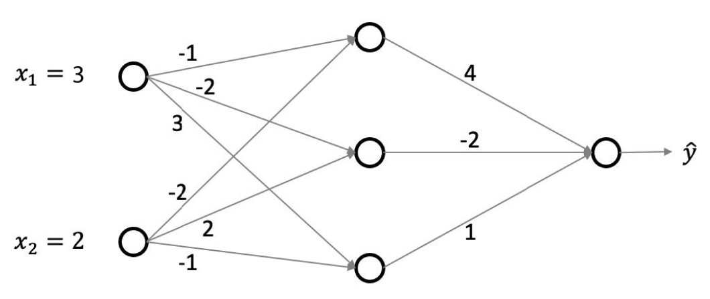
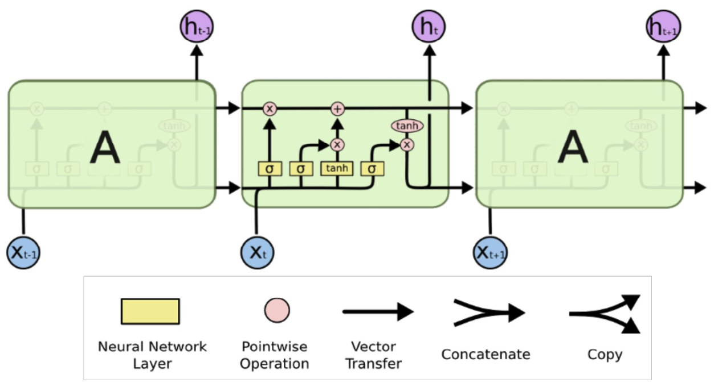

# Problem Set 6 Solutions

## Problem 1

**One Answer** Let $L_i(w)$ be the loss of parameter $w$ corresponding to a sample point $X_i$ with label $y_i$. The update rule for stochastic gradient descent with step size $\eta$ is

(a) $w_{\text{new}} \leftarrow w - \eta \nabla_{X_i} L_i(w)$

(b) $w_{\text{new}} \leftarrow w - \eta \sum_{i=1}^n \nabla_{X_i} L_i(w)$

(c) $w_{\text{new}} \leftarrow w - \eta \nabla_w L_i(w)$

(d) $w_{\text{new}} \leftarrow w - \eta \sum_{i=1}^n \nabla_w L_i(w)$

**Correct answers:** (c)

**Explanation:**

The correct answer is **(c) - $w_{\text{new}} \leftarrow w - \eta \nabla_w L_i(w)$**. Here's the detailed explanation:

**Understanding Stochastic Gradient Descent (SGD):**

**Definition:**
SGD is an optimization algorithm that updates parameters using the gradient of the loss function computed on a single training example (or a small batch) rather than the entire dataset.

**Key Components:**

**1. Loss Function:**
- $L_i(w)$ is the loss for a single training example $(X_i, y_i)$
- This is a function of the parameters $w$, not the input $X_i$

**2. Gradient:**
- $\nabla_w L_i(w)$ is the gradient of the loss with respect to the parameters $w$
- This tells us how to change $w$ to reduce the loss for this specific example

**3. Step Size:**
- $\eta$ (eta) is the learning rate
- Controls how big a step we take in the direction of the gradient

**Mathematical Analysis:**

**Correct Update Rule:**
$$w_{\text{new}} \leftarrow w - \eta \nabla_w L_i(w)$$

**Why This is Correct:**
1. **Gradient Direction**: $\nabla_w L_i(w)$ points in the direction of steepest increase of the loss
2. **Negative Sign**: We subtract because we want to minimize the loss (move in opposite direction)
3. **Parameter Update**: We update $w$, not $X_i$

**Why Other Options Are Wrong:**

**Option (a) - $w_{\text{new}} \leftarrow w - \eta \nabla_{X_i} L_i(w)$:**
- **Problem**: Gradient with respect to input $X_i$, not parameters $w$
- **Issue**: We want to update model parameters, not input data
- **Result**: This doesn't make sense for optimization

**Option (b) - $w_{\text{new}} \leftarrow w - \eta \sum_{i=1}^n \nabla_{X_i} L_i(w)$:**
- **Problem**: Sum over all examples AND gradient with respect to inputs
- **Issue**: This is neither SGD nor correct gradient computation
- **Result**: Computationally expensive and conceptually wrong

**Option (d) - $w_{\text{new}} \leftarrow w - \eta \sum_{i=1}^n \nabla_w L_i(w)$:**
- **Problem**: Sum over all training examples
- **Issue**: This is **batch gradient descent**, not stochastic gradient descent
- **Result**: Computationally expensive for large datasets

**Comparison of Methods:**

**Stochastic Gradient Descent (SGD):**
- Uses single example: $w \leftarrow w - \eta \nabla_w L_i(w)$
- Fast updates, noisy gradients
- Good for large datasets

**Batch Gradient Descent:**
- Uses all examples: $w \leftarrow w - \eta \sum_{i=1}^n \nabla_w L_i(w)$
- Slow updates, accurate gradients
- Computationally expensive

**Mini-batch Gradient Descent:**
- Uses subset of examples: $w \leftarrow w - \eta \sum_{i \in B} \nabla_w L_i(w)$
- Balance between speed and accuracy

**Practical Example:**

**Consider linear regression:**
- Loss: $L_i(w) = \frac{1}{2}(y_i - w^T x_i)^2$
- Gradient: $\nabla_w L_i(w) = -(y_i - w^T x_i)x_i$
- Update: $w_{\text{new}} = w + \eta(y_i - w^T x_i)x_i$

**Algorithm Flow:**
```
1. Initialize w randomly
2. For each training example (x_i, y_i):
   a. Compute gradient: ∇_w L_i(w)
   b. Update parameters: w ← w - η ∇_w L_i(w)
3. Repeat until convergence
```

**Advantages of SGD:**
- **Memory efficient**: Only needs one example at a time
- **Fast updates**: Can start learning immediately
- **Escape local minima**: Noise can help escape poor local optima
- **Online learning**: Can learn from streaming data

**Disadvantages of SGD:**
- **Noisy gradients**: Single examples may not represent true gradient
- **Slower convergence**: May take more iterations to converge
- **Sensitive to learning rate**: Need careful tuning

**Conclusion:**
The correct SGD update rule is **$w_{\text{new}} \leftarrow w - \eta \nabla_w L_i(w)$**, which updates the parameters using the gradient of the loss with respect to the parameters for a single training example.

---

## Problem 2

**One Answer** Suppose data $x_1, \dots, x_n$ is drawn from an exponential distribution $\text{exp}(\lambda)$ with PDF $p(x|\lambda) = \lambda \text{exp}(-\lambda x)$. Find the maximum likelihood for $\lambda$?

(a) $\lambda = \frac{n}{\sum_{i=1}^n x_i}$

(b) $\lambda = \sum_{i=1}^n x_i$

(c) $\lambda = \frac{\sum_{i=1}^n x_i}{n}$

(d) $\lambda = \log(\sum_{i=1}^n x_i)$

**Correct answers:** (a)

**Explanation:**

The correct answer is **(a) - $\lambda = \frac{n}{\sum_{i=1}^n x_i}$**. Here's the detailed derivation:

**Understanding Maximum Likelihood Estimation (MLE):**

**Goal:**
Find the parameter value $\lambda$ that maximizes the likelihood of observing the given data $x_1, x_2, \ldots, x_n$.

**Exponential Distribution:**
The probability density function (PDF) is:
$$p(x|\lambda) = \lambda e^{-\lambda x}$$

**Step-by-Step Derivation:**

**Step 1: Write the Likelihood Function**
The likelihood of observing all $n$ data points is:
$$L(\lambda) = \prod_{i=1}^n p(x_i|\lambda) = \prod_{i=1}^n \lambda e^{-\lambda x_i}$$

**Step 2: Simplify the Likelihood**
$$L(\lambda) = \lambda^n \prod_{i=1}^n e^{-\lambda x_i} = \lambda^n e^{-\lambda \sum_{i=1}^n x_i}$$

**Step 3: Take the Log-Likelihood**
$$\log L(\lambda) = \log(\lambda^n) + \log(e^{-\lambda \sum_{i=1}^n x_i})$$
$$\log L(\lambda) = n\log(\lambda) - \lambda \sum_{i=1}^n x_i$$

**Step 4: Find the Maximum**
To find the maximum, take the derivative and set it to zero:
$$\frac{d}{d\lambda} \log L(\lambda) = \frac{n}{\lambda} - \sum_{i=1}^n x_i = 0$$

**Step 5: Solve for $\lambda$**
$$\frac{n}{\lambda} = \sum_{i=1}^n x_i$$
$$\lambda = \frac{n}{\sum_{i=1}^n x_i}$$

**Step 6: Verify it's a Maximum**
Take the second derivative:
$$\frac{d^2}{d\lambda^2} \log L(\lambda) = -\frac{n}{\lambda^2} < 0$$
Since the second derivative is negative, this is indeed a maximum.

**Mathematical Verification:**

**Why This Makes Sense:**
1. **Reciprocal Relationship**: $\lambda$ is inversely related to the mean of the data
2. **Intuition**: For exponential distribution, $E[X] = \frac{1}{\lambda}$
3. **Consistency**: The MLE estimate $\hat{\lambda} = \frac{n}{\sum_{i=1}^n x_i} = \frac{1}{\bar{x}}$ where $\bar{x}$ is the sample mean

**Why Other Options Are Wrong:**

**Option (b) - $\lambda = \sum_{i=1}^n x_i$:**
- **Problem**: This is the sum of all observations, not the MLE
- **Issue**: Doesn't account for the number of observations
- **Result**: Incorrect scaling

**Option (c) - $\lambda = \frac{\sum_{i=1}^n x_i}{n}$:**
- **Problem**: This is the sample mean, which is $\frac{1}{\lambda}$ for exponential distribution
- **Issue**: Confuses the parameter with its reciprocal
- **Result**: Wrong relationship

**Option (d) - $\lambda = \log(\sum_{i=1}^n x_i)$:**
- **Problem**: Takes logarithm of the sum
- **Issue**: No mathematical justification for this transformation
- **Result**: Arbitrary and incorrect

**Properties of the MLE:**

**1. Consistency:**
- As $n \to \infty$, $\hat{\lambda} \to \lambda_{\text{true}}$
- The estimator converges to the true parameter value

**2. Efficiency:**
- MLE achieves the Cramér-Rao lower bound
- It's the most efficient unbiased estimator

**3. Invariance:**
- If $\hat{\lambda}$ is the MLE of $\lambda$, then $f(\hat{\lambda})$ is the MLE of $f(\lambda)$

**Practical Example:**

**Given data:** $x_1 = 2, x_2 = 3, x_3 = 1, x_4 = 4$

**Step 1:** Calculate sum: $\sum_{i=1}^4 x_i = 2 + 3 + 1 + 4 = 10$

**Step 2:** Calculate MLE: $\hat{\lambda} = \frac{4}{10} = 0.4$

**Step 3:** Verify: The sample mean is $\bar{x} = \frac{10}{4} = 2.5$, and $\frac{1}{\hat{\lambda}} = \frac{1}{0.4} = 2.5$

**Conclusion:**
The maximum likelihood estimator for the exponential distribution parameter $\lambda$ is **$\lambda = \frac{n}{\sum_{i=1}^n x_i}$**.

---

## Problem 3

**One Answer** Aman and Ed built a model on their data with two regularization hyperparameters $\lambda$ and $\gamma$. They have 4 good candidate values for $\lambda$ and 3 possible values for $\gamma$, and they are wondering which $\lambda, \gamma$ pair will be the best choice. If they were to perform five-fold cross-validation, how many validation errors would they need to calculate?

(a) 12

(b) 17

(c) 24

(d) 60

**Correct answers:** (d)

**Explanation:**

The correct answer is **(d) - 60**. Here's the detailed explanation:

**Understanding Cross-Validation:**

**Definition:**
Cross-validation is a technique for assessing how well a model will generalize to new data by dividing the dataset into training and validation sets multiple times.

**K-Fold Cross-Validation:**
- Data is divided into $k$ equal parts (folds)
- Model is trained on $k-1$ folds and validated on the remaining fold
- This process is repeated $k$ times, with each fold serving as validation once
- Results are averaged to get the final performance estimate

**Problem Setup:**
- **Hyperparameters**: $\lambda$ and $\gamma$
- **Values for $\lambda$**: 4 candidate values
- **Values for $\gamma$**: 3 candidate values
- **Cross-validation**: 5-fold

**Step-by-Step Calculation:**

**Step 1: Count Hyperparameter Combinations**
- Number of $\lambda$ values: 4
- Number of $\gamma$ values: 3
- Total combinations: $4 \times 3 = 12$

**Step 2: Count Validation Errors per Combination**
- For each hyperparameter combination, we need to evaluate the model
- In 5-fold cross-validation, each combination requires 5 validation errors
- One validation error per fold

**Step 3: Total Validation Errors**
- Total combinations: 12
- Validation errors per combination: 5
- Total validation errors: $12 \times 5 = 60$

**Mathematical Formula:**
$$\text{Total Validation Errors} = (\text{Number of } \lambda \text{ values}) \times (\text{Number of } \gamma \text{ values}) \times (\text{Number of folds})$$
$$\text{Total Validation Errors} = 4 \times 3 \times 5 = 60$$

**Why Other Options Are Wrong:**

**Option (a) - 12:**
- **Problem**: Only counts the number of hyperparameter combinations
- **Issue**: Ignores the fact that each combination needs 5-fold cross-validation
- **Result**: Underestimates the computational cost

**Option (b) - 17:**
- **Problem**: No clear mathematical relationship to the problem
- **Issue**: Doesn't follow from the given parameters
- **Result**: Arbitrary number

**Option (c) - 24:**
- **Problem**: Might be counting something else (e.g., $4 \times 3 \times 2$)
- **Issue**: Incorrect interpretation of cross-validation process
- **Result**: Wrong calculation

**Detailed Cross-Validation Process:**

**For each hyperparameter combination $(\lambda_i, \gamma_j)$:**

**Fold 1:**
- Train on folds 2, 3, 4, 5
- Validate on fold 1
- Record validation error

**Fold 2:**
- Train on folds 1, 3, 4, 5
- Validate on fold 2
- Record validation error

**Fold 3:**
- Train on folds 1, 2, 4, 5
- Validate on fold 3
- Record validation error

**Fold 4:**
- Train on folds 1, 2, 3, 5
- Validate on fold 4
- Record validation error

**Fold 5:**
- Train on folds 1, 2, 3, 4
- Validate on fold 5
- Record validation error

**Average the 5 validation errors for this combination.**

**Repeat for all 12 combinations.**

**Computational Complexity:**

**Time Complexity:**
- Training time per fold: $O(\text{training time})$
- Total training time: $O(12 \times 5 \times \text{training time}) = O(60 \times \text{training time})$

**Space Complexity:**
- Need to store 60 validation error values
- Additional memory for model training

**Practical Considerations:**

**Advantages of K-Fold Cross-Validation:**
- More reliable performance estimate than single train/validation split
- Uses all data for both training and validation
- Reduces variance in performance estimates

**Disadvantages:**
- Computationally expensive (60 model trainings in this case)
- May not be feasible for large datasets or complex models

**Optimization Strategies:**
- **Grid Search**: Try all combinations (what we're doing here)
- **Random Search**: Sample random combinations
- **Bayesian Optimization**: Use previous results to guide search

**Conclusion:**
The total number of validation errors needed is **60**, calculated as $4 \times 3 \times 5 = 60$ (number of $\lambda$ values $\times$ number of $\gamma$ values $\times$ number of folds).

---

## Problem 4

**One Answer** Which of the following is most indicative of a model overfitting?

(a) Low bias, low variance.

(b) Low bias, high variance.

(c) High bias, low variance.

**Correct answers:** (b)

**Explanation:**

The correct answer is **(b) - Low bias, high variance**. Here's the detailed explanation:

**Understanding Overfitting:**

**Definition of Overfitting:**
Overfitting occurs when a model learns the training data too well, including noise and idiosyncrasies, leading to poor generalization on new, unseen data.

**Bias-Variance Tradeoff:**
The total error of a model can be decomposed into three components:
$$\text{Total Error} = \text{Bias}^2 + \text{Variance} + \text{Irreducible Error}$$

**Characteristics of Overfitting:**

**1. Low Bias:**
- Model can capture complex patterns in the training data
- Training error is very low (often close to zero)
- Model has high capacity/flexibility

**2. High Variance:**
- Model is very sensitive to changes in training data
- Small changes in training set lead to large changes in predictions
- Model has memorized the training data instead of learning generalizable patterns

**Why Overfitting Shows Low Bias, High Variance:**

**Low Bias (Good for Training):**
- **Definition**: Bias measures how well the model can approximate the true underlying function
- **In Overfitting**: Model can fit the training data very well, including noise
- **Result**: Training error is low, indicating low bias

**High Variance (Bad for Generalization):**
- **Definition**: Variance measures how much predictions change with different training sets
- **In Overfitting**: Model is very sensitive to training data variations
- **Result**: Poor generalization to new data

**Mathematical Intuition:**

**Training Performance:**
$$\text{Training Error} = \text{Bias}^2 + \text{Variance} + \text{Noise}$$
- In overfitting: Training error is low
- This suggests low bias (model can fit training data well)

**Test Performance:**
$$\text{Test Error} = \text{Bias}^2 + \text{Variance} + \text{Noise}$$
- In overfitting: Test error is high
- This suggests high variance (model doesn't generalize well)

**Visual Example:**

**Underfitting (High Bias, Low Variance):**
```
Training: Simple model, high error
Test: Simple model, high error
Result: Consistent but poor performance
```

**Good Fit (Low Bias, Low Variance):**
```
Training: Complex model, low error
Test: Complex model, low error
Result: Good performance on both
```

**Overfitting (Low Bias, High Variance):**
```
Training: Very complex model, very low error
Test: Very complex model, high error
Result: Great on training, poor on test
```

**Why Other Options Are Wrong:**

**Option (a) - Low bias, low variance:**
- **Problem**: This describes a well-fitted model
- **Issue**: Overfitting models don't have low variance
- **Result**: This is the ideal scenario, not overfitting

**Option (c) - High bias, low variance:**
- **Problem**: This describes underfitting
- **Issue**: Overfitting models have low bias, not high bias
- **Result**: This is the opposite of overfitting

**Signs of Overfitting:**

**1. Training vs Test Performance:**
- Training accuracy: Very high (e.g., 99%)
- Test accuracy: Much lower (e.g., 70%)
- Large gap between training and test performance

**2. Model Complexity:**
- Too many parameters relative to data size
- Very deep neural networks on small datasets
- High-degree polynomials on few data points

**3. Learning Curves:**
- Training error continues to decrease
- Validation error starts increasing after a point
- Gap between training and validation error grows

**Examples of Overfitting:**

**1. Polynomial Regression:**
- Degree 10 polynomial on 5 data points
- Fits training data perfectly
- Poor generalization

**2. Neural Networks:**
- Very wide/deep network on small dataset
- Memorizes training examples
- Fails on new data

**3. Decision Trees:**
- Tree grown to maximum depth
- Each leaf contains one training example
- No generalization

**Solutions to Overfitting:**

**1. Regularization:**
- L1/L2 regularization
- Dropout in neural networks
- Early stopping

**2. More Data:**
- Collect more training examples
- Data augmentation
- Transfer learning

**3. Reduce Model Complexity:**
- Fewer parameters
- Simpler architectures
- Feature selection

**4. Cross-Validation:**
- Monitor validation performance
- Stop training when validation error increases
- Choose appropriate model complexity

**Conclusion:**
Overfitting is characterized by **low bias and high variance** - the model can fit the training data very well (low bias) but is too sensitive to training data variations (high variance), leading to poor generalization.

---

## Problem 5

**One Answer** In k-fold cross-validation, what is the primary advantage of setting k to a higher value (e.g., k=10) compared to a lower value (e.g., k=2)?

(a) It increases the accuracy of the model on unseen data.

(b) It provides a more reliable estimate of model performance.

(c) It reduces computational time.

(d) It eliminates the need for a separate test set.

**Correct answers:** (b)

**Explanation:**

The correct answer is **(b) - It provides a more reliable estimate of model performance**. Here's the detailed explanation:

**Understanding K-Fold Cross-Validation:**

**Definition:**
K-fold cross-validation is a resampling technique that divides the dataset into k equal parts (folds), trains the model on k-1 folds, and validates on the remaining fold. This process is repeated k times, with each fold serving as validation once.

**Effect of K Value:**

**Low K (e.g., k=2):**
- **Split**: 50% training, 50% validation
- **Issues**: 
  - Large validation set reduces training data
  - High variance in performance estimates
  - Less reliable performance assessment

**High K (e.g., k=10):**
- **Split**: 90% training, 10% validation
- **Benefits**:
  - More training data available
  - Lower variance in performance estimates
  - More reliable performance assessment

**Mathematical Analysis:**

**Variance of Performance Estimate:**
$$\text{Var}(\hat{\mu}) = \frac{\sigma^2}{k}$$
where:
- $\hat{\mu}$ is the estimated performance
- $\sigma^2$ is the variance of individual fold performances
- $k$ is the number of folds

**As k increases:**
- Variance decreases
- More reliable estimate
- Better confidence in model performance

**Why Other Options Are Wrong:**

**Option (a) - It increases the accuracy of the model on unseen data:**
- **Problem**: K-fold CV is for evaluation, not model improvement
- **Issue**: The model itself doesn't change based on k
- **Result**: K value affects estimation reliability, not model accuracy

**Option (c) - It reduces computational time:**
- **Problem**: Higher k means more model trainings
- **Issue**: k=10 requires 10 model trainings vs k=2 requires 2
- **Result**: Higher k increases computational cost

**Option (d) - It eliminates the need for a separate test set:**
- **Problem**: Cross-validation is for model selection, not final evaluation
- **Issue**: Test set is still needed for unbiased final evaluation
- **Result**: K-fold CV doesn't replace test set

**Practical Considerations:**

**Trade-offs:**

**High K (k=10):**
- **Pros**: More reliable estimates, more training data per fold
- **Cons**: Higher computational cost, longer training time

**Low K (k=2):**
- **Pros**: Faster computation, simpler implementation
- **Cons**: Less reliable estimates, less training data per fold

**Optimal K Selection:**
- **k=5 or k=10**: Good balance for most datasets
- **k=n (Leave-One-Out)**: Maximum reliability but high computational cost
- **k=2**: Only when computational resources are severely limited

**Example:**

**Dataset with 1000 samples:**

**k=2 (2-fold CV):**
- Training: 500 samples
- Validation: 500 samples
- Variance: High (large validation set)

**k=10 (10-fold CV):**
- Training: 900 samples
- Validation: 100 samples
- Variance: Low (small validation set)

**Conclusion:**
Higher k values provide **more reliable estimates of model performance** by reducing the variance of the performance estimate, though at the cost of increased computational time.

---

## Problem 6

**One Answer** Two realtors are creating machine learning models to predict house costs based on house traits (i.e. house size, neighborhood, school district, etc.) trained on the same set of houses, using the same model hyperparameters. Realtor A includes 30 different housing traits in their model. Realtor B includes 5 traits in their model. Which of the following outcomes is most likely?

(a) Realtor B's model has higher variance and lower bias than Realtor A's model.

(b) Realtor A's model has higher variance than Realtor B's model and without additional information, we cannot know which model has a higher bias.

(c) Realtor A's model has higher variance and lower bias than Realtor B's model.

(d) Realtor A's model has higher variance and higher bias than Realtor B's model.

**Correct answers:** (b)

**Explanation:**

The correct answer is **(b) - Realtor A's model has higher variance than Realtor B's model and without additional information, we cannot know which model has a higher bias**. Here's the detailed explanation:

**Understanding the Bias-Variance Tradeoff:**

**Definition:**
The bias-variance tradeoff is a fundamental concept in machine learning that describes the relationship between model complexity and generalization error.

**Components of Error:**
$$\text{Total Error} = \text{Bias}^2 + \text{Variance} + \text{Irreducible Error}$$

**Analysis of the Two Models:**

**Realtor A's Model (30 features):**
- **High complexity**: Many parameters to learn
- **High flexibility**: Can capture complex relationships
- **High variance**: Sensitive to training data variations
- **Bias**: Depends on whether the true relationship is captured

**Realtor B's Model (5 features):**
- **Low complexity**: Few parameters to learn
- **Low flexibility**: Limited in capturing complex relationships
- **Low variance**: Stable predictions across different training sets
- **Bias**: Depends on whether the true relationship is captured

**Why Realtor A Has Higher Variance:**

**Mathematical Intuition:**
- **More parameters**: More degrees of freedom
- **More sensitive**: Small changes in training data affect more parameters
- **Less stable**: Predictions vary more across different training sets

**Example:**
```
Realtor A (30 features):
- Training Set 1: Predicts $500,000
- Training Set 2: Predicts $450,000
- Training Set 3: Predicts $550,000
- High variance (unstable predictions)

Realtor B (5 features):
- Training Set 1: Predicts $480,000
- Training Set 2: Predicts $485,000
- Training Set 3: Predicts $475,000
- Low variance (stable predictions)
```

**Why We Cannot Determine Bias:**

**Bias Depends on True Relationship:**
- **If true relationship is simple**: Realtor B has lower bias
- **If true relationship is complex**: Realtor A has lower bias
- **Without knowing the true relationship**: Cannot determine bias

**Mathematical Example:**

**Scenario 1: Simple True Relationship**
True price = $100,000 + $50 × size + $10,000 × bedrooms

- **Realtor A**: Tries to fit 30 features to a 3-feature relationship
- **Result**: High bias (overfitting to noise)
- **Realtor B**: Uses 5 features including the important ones
- **Result**: Lower bias (better fit to true relationship)

**Scenario 2: Complex True Relationship**
True price depends on 25 different features in complex ways

- **Realtor A**: Can capture the complex relationship
- **Result**: Lower bias (good fit to true relationship)
- **Realtor B**: Cannot capture the complexity
- **Result**: High bias (underfitting)

**Why Other Options Are Wrong:**

**Option (a) - Realtor B's model has higher variance and lower bias than Realtor A's model:**
- **Problem**: Contradicts the principle that simpler models have lower variance
- **Issue**: 5 features vs 30 features clearly indicates different complexity
- **Result**: Incorrect understanding of bias-variance tradeoff

**Option (c) - Realtor A's model has higher variance and lower bias than Realtor B's model:**
- **Problem**: Assumes we know the bias relationship
- **Issue**: Without knowing the true relationship, we cannot determine bias
- **Result**: Makes an assumption not supported by the problem

**Option (d) - Realtor A's model has higher variance and higher bias than Realtor B's model:**
- **Problem**: Assumes we know the bias relationship
- **Issue**: More complex models don't necessarily have higher bias
- **Result**: Incorrect assumption about bias

**Practical Implications:**

**Model Selection:**
- **High variance**: Model is unstable, may overfit
- **Unknown bias**: Need to evaluate on validation data
- **Trade-off**: Balance between bias and variance

**Feature Engineering:**
- **More features**: Higher variance, potentially lower bias
- **Fewer features**: Lower variance, potentially higher bias
- **Optimal number**: Depends on data and true relationship

**Cross-Validation:**
- **High variance models**: Need more folds for reliable estimates
- **Low variance models**: More stable performance estimates
- **Model comparison**: Must consider both bias and variance

**Conclusion:**
Realtor A's model has **higher variance** due to its greater complexity (30 features vs 5 features), but we **cannot determine the bias** without knowing the true underlying relationship between house features and price.

---

## Problem 7

**Select All** Suppose we have $N$ data points $x_1, x_2, \dots, x_N$ that $x_i \in \mathbb{R}^d$. Define $X \in \mathbb{R}^{N \times d}$ such that $X_{i,j} = (x_i)_j$, $\bar{x} = \frac{1}{N} \sum_{i=1}^N x_i$, and $\mathbf{1}_N = (1,1,\dots,1)^T \in \mathbb{R}^N$. Which of the following are true about principal components analysis (PCA)?

(a) The principal components are eigenvectors of the centered data matrix $X - \mathbf{1}_N \bar{x}^T$.

(b) The principal components are right singular vectors of the centered data matrix.

(c) The principal components are eigenvectors of the sample covariance matrix $\sum_{i=1}^N (x_i - \bar{x})(x_i - \bar{x})^T$.

(d) Applying a rigid rotation matrix $Q$ (i.e., $QQ^T = Q^T Q = I$) to $X$ will not change the principal components' directions.

**Correct answers:** (b), (c)

**Explanation:**

The correct answers are **(b)** and **(c)**. Here's the detailed explanation:

**Understanding Principal Component Analysis (PCA):**

**Definition:**
PCA is a dimensionality reduction technique that finds the directions of maximum variance in the data and projects the data onto these directions (principal components).

**Mathematical Setup:**
- **Data matrix**: $X \in \mathbb{R}^{N \times d}$ where $X_{i,j} = (x_i)_j$
- **Centered data matrix**: $X_c = X - \mathbf{1}_N \bar{x}^T$
- **Sample covariance matrix**: $S = \frac{1}{N-1} \sum_{i=1}^N (x_i - \bar{x})(x_i - \bar{x})^T$

**Analysis of Each Statement:**

**Option (a) - The principal components are eigenvectors of the centered data matrix $X - \mathbf{1}_N \bar{x}^T$: FALSE** ❌

**Mathematical Analysis:**

**Centered Data Matrix:**
$X_c = X - \mathbf{1}_N \bar{x}^T$ is an $N \times d$ matrix

**Eigenvectors of $X_c$:**
- $X_c$ is not square (unless $N = d$)
- Eigenvectors are only defined for square matrices
- The statement is mathematically incorrect

**Correct Relationship:**
The principal components are eigenvectors of $X_c^T X_c$, which is the $d \times d$ matrix:
$$X_c^T X_c = (X - \mathbf{1}_N \bar{x}^T)^T (X - \mathbf{1}_N \bar{x}^T)$$

**Option (b) - The principal components are right singular vectors of the centered data matrix: TRUE** ✅

**Mathematical Proof:**

**Singular Value Decomposition (SVD):**
For the centered data matrix $X_c$:
$$X_c = U \Sigma V^T$$

where:
- $U \in \mathbb{R}^{N \times r}$: Left singular vectors
- $\Sigma \in \mathbb{R}^{r \times r}$: Singular values
- $V \in \mathbb{R}^{d \times r}$: Right singular vectors

**Connection to PCA:**
- **Right singular vectors** $V$ are the principal components
- **Singular values** $\Sigma$ are related to the variance explained
- **Left singular vectors** $U$ are the projections of data onto principal components

**Mathematical Verification:**
$$X_c^T X_c = (U \Sigma V^T)^T (U \Sigma V^T) = V \Sigma^T U^T U \Sigma V^T = V \Sigma^2 V^T$$

This shows that the right singular vectors $V$ are eigenvectors of $X_c^T X_c$.

**Option (c) - The principal components are eigenvectors of the sample covariance matrix: TRUE** ✅

**Mathematical Proof:**

**Sample Covariance Matrix:**
$$S = \frac{1}{N-1} \sum_{i=1}^N (x_i - \bar{x})(x_i - \bar{x})^T$$

**Relationship to Centered Data:**
$$S = \frac{1}{N-1} X_c^T X_c$$

**Eigenvalue Decomposition:**
$$S = Q \Lambda Q^T$$

where:
- $Q$ contains the eigenvectors (principal components)
- $\Lambda$ contains the eigenvalues (variances)

**Connection to PCA:**
- **Eigenvectors** of $S$ are the principal components
- **Eigenvalues** of $S$ are the variances along each principal component
- **Ordering**: Eigenvalues in descending order correspond to principal components in order of importance

**Option (d) - Applying a rigid rotation matrix $Q$ to $X$ will not change the principal components' directions: FALSE** ❌

**Mathematical Analysis:**

**Rigid Rotation:**
$Q$ is orthogonal: $QQ^T = Q^T Q = I$

**Effect on Data:**
$X' = XQ$ (rotation of data)

**Effect on Principal Components:**
- **Original PCA**: Eigenvectors of $X_c^T X_c$
- **Rotated PCA**: Eigenvectors of $(X_c Q)^T (X_c Q) = Q^T X_c^T X_c Q$

**Result:**
The principal components change by the rotation $Q$:
- **Original**: $v$ (eigenvector of $X_c^T X_c$)
- **Rotated**: $Q^T v$ (eigenvector of $Q^T X_c^T X_c Q$)

**Example:**

**Original Data:**
```
X = [1, 2; 3, 4; 5, 6]
Principal components: [0.707, 0.707] and [-0.707, 0.707]
```

**After 90° Rotation:**
```
Q = [0, -1; 1, 0]
X' = XQ
Principal components: [0, 1] and [1, 0] (rotated by Q)
```

**Practical Implications:**

**1. Computational Methods:**
- **SVD method**: More numerically stable
- **Eigenvalue method**: Direct computation of covariance matrix
- **Both equivalent**: Choose based on computational efficiency

**2. Data Preprocessing:**
- **Centering**: Essential for PCA
- **Scaling**: Often recommended for equal feature importance
- **Rotation**: Changes principal components

**3. Interpretation:**
- **Principal components**: Directions of maximum variance
- **Eigenvalues**: Amount of variance explained
- **Cumulative variance**: $\sum_{i=1}^k \lambda_i / \sum_{i=1}^d \lambda_i$

**Conclusion:**
Options **(b)** and **(c)** are correct. The principal components are the right singular vectors of the centered data matrix and the eigenvectors of the sample covariance matrix. Option (a) is incorrect because eigenvectors are only defined for square matrices, and option (d) is incorrect because rotations change the principal component directions.

---

## Problem 8

**Select All** In the context of singular value decomposition (SVD) $A = U \Sigma V^T$, which of the following statements are correct?

(a) The columns of $U$ are called left singular vectors and form an orthonormal basis for the range of $A$, while the columns of $V$ are called right singular vectors and form an orthonormal basis for the range of $A^T$.

(b) For any $A$ that is real and symmetric, we have $U = V$.

(c) For a square matrix $A$, the singular values of $A$ are the absolute values of the eigenvalues of $A$.

(d) Singular values are always non-negative real numbers.

**Correct answers:** (a), (d)

**Explanation:**

The correct answers are **(a)** and **(d)**. Here's the detailed explanation:

**Understanding Singular Value Decomposition (SVD):**

**Definition:**
SVD decomposes a matrix $A \in \mathbb{R}^{m \times n}$ into:
$$A = U \Sigma V^T$$

where:
- $U \in \mathbb{R}^{m \times m}$: Left singular vectors (orthonormal)
- $\Sigma \in \mathbb{R}^{m \times n}$: Diagonal matrix of singular values
- $V \in \mathbb{R}^{n \times n}$: Right singular vectors (orthonormal)

**Analysis of Each Statement:**

**Option (a) - The columns of $U$ are called left singular vectors and form an orthonormal basis for the range of $A$, while the columns of $V$ are called right singular vectors and form an orthonormal basis for the range of $A^T$: TRUE** ✅

**Mathematical Proof:**

**Left Singular Vectors ($U$):**
- **Definition**: Columns of $U$ are left singular vectors
- **Orthonormality**: $U^T U = I$ (orthonormal)
- **Range of $A$**: $\text{range}(A) = \text{span}\{u_1, u_2, \ldots, u_r\}$
  where $r = \text{rank}(A)$

**Right Singular Vectors ($V$):**
- **Definition**: Columns of $V$ are right singular vectors
- **Orthonormality**: $V^T V = I$ (orthonormal)
- **Range of $A^T$**: $\text{range}(A^T) = \text{span}\{v_1, v_2, \ldots, v_r\}$

**Mathematical Verification:**
$$A = U \Sigma V^T \Rightarrow A^T = V \Sigma^T U^T$$

**Option (b) - For any $A$ that is real and symmetric, we have $U = V$: FALSE** ❌

**Mathematical Analysis:**

**Symmetric Matrix:**
If $A$ is real and symmetric, then $A = A^T$

**SVD for Symmetric Matrix:**
$$A = U \Sigma V^T = A^T = V \Sigma^T U^T$$

**Result:**
- $U \Sigma V^T = V \Sigma U^T$ (since $\Sigma^T = \Sigma$ for diagonal matrix)
- This does **not** imply $U = V$
- The relationship is more complex

**Counterexample:**
Consider $A = \begin{bmatrix} 0 & 1 \\ 1 & 0 \end{bmatrix}$ (symmetric)
- Eigenvalues: $\lambda_1 = 1, \lambda_2 = -1$
- SVD: $A = U \Sigma V^T$ where $U \neq V$

**Option (c) - For a square matrix $A$, the singular values of $A$ are the absolute values of the eigenvalues of $A$: FALSE** ❌

**Mathematical Analysis:**

**Relationship Between Eigenvalues and Singular Values:**
For a square matrix $A$:
- **Eigenvalues**: Solutions to $|A - \lambda I| = 0$
- **Singular values**: Square roots of eigenvalues of $A^T A$

**Mathematical Relationship:**
$$\sigma_i = \sqrt{\lambda_i(A^T A)}$$

**Counterexample:**
Consider $A = \begin{bmatrix} 1 & 1 \\ 0 & 1 \end{bmatrix}$

**Eigenvalues of $A$:**
$$|A - \lambda I| = \begin{vmatrix} 1-\lambda & 1 \\ 0 & 1-\lambda \end{vmatrix} = (1-\lambda)^2 = 0$$
$$\lambda_1 = \lambda_2 = 1$$

**Eigenvalues of $A^T A$:**
$$A^T A = \begin{bmatrix} 1 & 0 \\ 1 & 1 \end{bmatrix} \begin{bmatrix} 1 & 1 \\ 0 & 1 \end{bmatrix} = \begin{bmatrix} 1 & 1 \\ 1 & 2 \end{bmatrix}$$

$$|A^T A - \lambda I| = \begin{vmatrix} 1-\lambda & 1 \\ 1 & 2-\lambda \end{vmatrix} = (1-\lambda)(2-\lambda) - 1 = \lambda^2 - 3\lambda + 1 = 0$$

$$\lambda = \frac{3 \pm \sqrt{5}}{2}$$

**Singular Values:**
$$\sigma_1 = \sqrt{\frac{3 + \sqrt{5}}{2}} \approx 1.618$$
$$\sigma_2 = \sqrt{\frac{3 - \sqrt{5}}{2}} \approx 0.618$$

**Result**: Singular values $\{1.618, 0.618\}$ ≠ absolute values of eigenvalues $\{1, 1\}$

**Option (d) - Singular values are always non-negative real numbers: TRUE** ✅

**Mathematical Proof:**

**Definition of Singular Values:**
Singular values are the square roots of the eigenvalues of $A^T A$:
$$\sigma_i = \sqrt{\lambda_i(A^T A)}$$

**Properties of $A^T A$:**
- **Symmetric**: $(A^T A)^T = A^T A$
- **Positive semi-definite**: $x^T A^T A x = ||Ax||^2 \geq 0$ for all $x$

**Eigenvalues of Positive Semi-definite Matrix:**
- All eigenvalues are **non-negative real numbers**
- $\lambda_i(A^T A) \geq 0$ for all $i$

**Result:**
$$\sigma_i = \sqrt{\lambda_i(A^T A)} \geq 0$$
since $\lambda_i(A^T A) \geq 0$

**Practical Implications:**

**1. Numerical Stability:**
- Singular values are always non-negative
- Useful for determining matrix rank
- Helps identify numerical issues

**2. Matrix Analysis:**
- **Condition number**: $\kappa(A) = \frac{\sigma_{\max}}{\sigma_{\min}}$
- **Rank**: Number of non-zero singular values
- **Frobenius norm**: $||A||_F = \sqrt{\sum_i \sigma_i^2}$

**3. Applications:**
- **PCA**: Singular values indicate variance explained
- **Image compression**: Keep largest singular values
- **Noise reduction**: Filter small singular values

**Example:**

**Matrix $A = \begin{bmatrix} 3 & 0 \\ 0 & 2 \end{bmatrix}$:**

**Eigenvalues:**
$$\lambda_1 = 3, \lambda_2 = 2$$

**SVD:**
$$A = \begin{bmatrix} 1 & 0 \\ 0 & 1 \end{bmatrix} \begin{bmatrix} 3 & 0 \\ 0 & 2 \end{bmatrix} \begin{bmatrix} 1 & 0 \\ 0 & 1 \end{bmatrix}^T$$

**Singular Values:**
$$\sigma_1 = 3, \sigma_2 = 2$$

**Note**: In this case, singular values equal eigenvalues because $A$ is diagonal and positive.

**Conclusion:**
Options **(a)** and **(d)** are correct. The left and right singular vectors form orthonormal bases for the appropriate spaces, and singular values are always non-negative real numbers. Option (b) is incorrect because symmetric matrices don't necessarily have $U = V$, and option (c) is incorrect because singular values are not always the absolute values of eigenvalues.

---

## Problem 9

**Select All** Which of the following statements about matrix completion are correct?

(a) It may not perform well when the real-world data is not inherently low-rank or when the pattern of missing observations is not random.

(b) The purpose of matrix completion is to estimate missing entries in a partially observed matrix.

(c) Matrix completion is only applicable for square matrices.

**Correct answers:** (a), (b)

**Explanation:** (c) No such restriction.

---

## Problem 10

**One Answer** Consider a feature map $\phi : \mathbb{R}^2 \to \mathbb{R}^4$ defined as:

$\phi \left( \begin{bmatrix} x_1 \\ x_2 \end{bmatrix} \right) = \begin{bmatrix} x_1^2 \\ x_2^2 \\ x_1 x_2 \\ x_2 x_1 \end{bmatrix}$

What is the corresponding kernel function $K$ for $\phi$?

(a) $K: \mathbb{R}^2 \times \mathbb{R}^2 \to \mathbb{R}$ and $K(\mathbf{x}, \mathbf{x}') = (\mathbf{x}^\top \mathbf{x}')^2$.

(b) $K: \mathbb{R} \times \mathbb{R} \to \mathbb{R}$ and $K(x, x') = x^4 + x'^4 + 2x^2x'^2$.

(c) $K: \mathbb{R}^2 \times \mathbb{R}^2 \to \mathbb{R}$ and $K(\mathbf{x}, \mathbf{x}') = \mathbf{x}^\top \mathbf{x}'$.

(d) $K: \mathbb{R} \times \mathbb{R} \to \mathbb{R}$ and $K(x,x') = x^2 + x'^2$.

**Correct answers:** (a)

---

## Problem 11

**One Answer** In the context of kernel methods, what does the "kernel trick" refer to?

(a) Adding an extra kernel layer to the end of a neural network.

(b) A technique for explicitly computing the coordinates in a high-dimensional space.

(c) A method for computing the inner products in a high-dimensional feature space without explicitly mapping data to that space.

(d) A technique for speeding up the convergence of gradient descent.

**Correct answers:** (c)

---

## Problem 12

**One Answer** When using a kernel method to solve a regression problem with training set $\{(\mathbf{x}_i, y_i)\}_{i=1}^n$ and $\mathbf{x}_i \in \mathbb{R}^d$, we first prove that there exists an $\boldsymbol{\alpha} \in \mathbb{R}^n$ such that the weight vector $\hat{\mathbf{w}} = \sum_{i=1}^n \alpha_i \phi(\mathbf{x}_i)$, where $\phi : \mathbb{R}^d \to \mathbb{R}^p$ is a feature map transforming $\mathbf{x}_i$ into a very high dimensional space $\mathbb{R}^p$ with $p \gg d$. Then, solving the problem is equivalent to finding $\hat{\boldsymbol{\alpha}} = \text{argmin}_{\boldsymbol{\alpha}} \sum_{i=1}^n(y_i - \sum_{j=1}^n \alpha_j K(\mathbf{x}_i, \mathbf{x}_j))^2 + \lambda \sum_{i=1}^n \sum_{j=1}^n \alpha_i \alpha_j K(\mathbf{x}_i, \mathbf{x}_j)$. After we computed the value of $\hat{\boldsymbol{\alpha}}$, given an input $\mathbf{x}' \in \mathbb{R}^d$ in the test set, how can we make the prediction?

(a) Because $\hat{\mathbf{w}} = \sum_{i=1}^n \alpha_i \phi(\mathbf{x}_i)$, we can compute the value of $\hat{\mathbf{w}}$, and then applying $\hat{y} = \hat{\mathbf{w}}^T \mathbf{x}'$.

(b) Because $\hat{y} = \hat{\mathbf{w}}^T \mathbf{x}' = \sum_{i=1}^n \alpha_i \mathbf{x}_i^T \mathbf{x}'$, we can compute the values of $\mathbf{x}_i^T \mathbf{x}'$ and then get the value of $\hat{y}$.

(c) Because $\hat{y} = \hat{\mathbf{w}}^T \phi(\mathbf{x}') = \sum_{i=1}^n \alpha_i \phi(\mathbf{x}_i)^T \phi(\mathbf{x}') = \sum_{i=1}^n \alpha_i K(\mathbf{x}_i, \mathbf{x}')$, we can compute the values of $K(\mathbf{x}_i, \mathbf{x}')$ and then get the value of $\hat{y}$.

(d) Because $\hat{\mathbf{w}} = \sum_{i=1}^n \alpha_i \phi(\mathbf{x}_i)$, we can compute the value of $\hat{\mathbf{w}}$, and then applying $\hat{y} = \hat{\mathbf{w}}^T \phi(\mathbf{x}')$.

**Correct answers:** (c)

---

## Problem 13

**One Answer** Consider the following neural network with weights shown in the image below. Every hidden neuron uses the ReLU activation function, and there is no activation function on the output neuron. Assume there are no bias terms. What is the output of this network with the input $x = (3,2)$?



The image displays a feedforward neural network with two input neurons, three hidden neurons, and one output neuron.

**Input Layer:**
*   The first input neuron is labeled $x_1 = 3$.
*   The second input neuron is labeled $x_2 = 2$.

**Connections from Input Layer to Hidden Layer (with weights):**
*   From $x_1$:
    *   To the top hidden neuron: weight $-1$
    *   To the middle hidden neuron: weight $-2$
    *   To the bottom hidden neuron: weight $3$
*   From $x_2$:
    *   To the top hidden neuron: weight $-2$
    *   To the middle hidden neuron: weight $2$
    *   To the bottom hidden neuron: weight $-1$

**Connections from Hidden Layer to Output Layer (with weights):**
*   From the top hidden neuron to the output neuron: weight $4$
*   From the middle hidden neuron to the output neuron: weight $-2$
*   From the bottom hidden neuron to the output neuron: weight $1$

**Activation Functions:**
*   Every hidden neuron uses the ReLU (Rectified Linear Unit) activation function, defined as $f(z) = \max(0, z)$.
*   There is no activation function on the output neuron (linear activation).
*   There are no bias terms in the network.

The output of the network is denoted as $\hat{y}$.

**Answer:** $7$

**Explanation:** Answer is $7$

---

## Problem 14

**One Answer** How many parameters does the neural network shown in the previous problem have?

**Answer:** 

**Explanation:** Answer is 9

---

## Problem 15

**One Answer** Which of the following defines the correct ordering of steps needed to perform backpropagation in PyTorch?

(a) (1) compute loss, (2) compute gradients, (3) take step, (4) zero the gradient buffers

(b) (1) compute loss, (2) zero the gradient buffers, (3) compute gradients, (4) take step

(c) (1) compute loss, (2) take step, (3) zero the gradient buffers, (4) compute gradients

(d) (1) zero the gradient buffers, (2) compute gradients, (3) take step, (4) compute loss

**Correct answers:** (b)

---

## Problem 16

**One Answer** Consider a convolutional neural network (CNN) layer with the following parameters:

*   Input image size: 3 x 32 x 32 (channels, height, width)
*   Number of filters: 16
*   filter size: 3x3
*   Stride: 1
*   Padding: 1

What will be the shape of the output after applying this convolutional layer (in the order of channels, height, width)?

**Answer:** 

**Explanation:** 16 x 32 x 32. $\frac{32-3+2\times1}{1}+1=32$

---

## Problem 17

**One Answer** Which of the following best describes the purpose of pooling layers in a convolutional neural network (CNN)?

(a) To increase the resolution of the feature maps.

(b) To reduce the spatial dimensions of the feature maps, thereby reducing the computational load and the number of parameters.

(c) To convert the feature maps into a fully connected layer.

(d) To normalize the feature maps by scaling them to a fixed range.

**Correct answers:** (b)

---

## Problem 18

**One Answer** Given the following setup in a simple recurrent neural network (RNN):

Input at time t: $x_t$

The RNN has one hidden layer with the following parameters:
* Input to hidden state weights: $W_{xh}$
* Hidden state to hidden state weights: $W_{hh}$
* Hidden state to output weights: $W_{hy}$
* Bias for the hidden state: $b_h$
* Bias for the output: $b_y$

The activation function for the hidden state is ReLU.

Given the following parameter values:
$W_{xh} = \begin{bmatrix} 0.5 & 0.1 \\ 0.3 & 0.2 \end{bmatrix}$, $W_{hh} = \begin{bmatrix} 0.6 & 0.4 \\ 0.2 & 0.5 \end{bmatrix}$, $W_{hy} = \begin{bmatrix} 1 & 0 \\ 0 & 1 \end{bmatrix}$, $b_h = \begin{bmatrix} 0.1 \\ 0.2 \end{bmatrix}$, $b_y = \begin{bmatrix} 1 \\ 0 \end{bmatrix}$

Calculate the hidden state $h_1$ after processing the first input $x_1 = \begin{bmatrix} 1 \\ 0 \end{bmatrix}$. Assume the initial hidden state $h_0$ is a zero vector.

**Answer:** 

**Explanation:** $\text{relu}(W_{xh}x_1 + W_{hh}h_0 + b_h) = \begin{bmatrix} 0.6 \\ 0.5 \end{bmatrix}$

---

## Problem 19

**One Answer** Which of the following statements about the k-means clustering algorithm is true?

(a) It guarantees convergence to the global optimum.

(b) It is robust against the initialization of cluster means.

(c) It may converge to a local optimum depending on the initial placement of cluster means.

**Correct answers:** (c)

---

## Problem 20

**One Answer** Why might a Gaussian Mixture Model (GMM) be preferred over K-means in cases where the data contains mixed or overlapping clusters?

(a) GMM exclusively uses hard assignments which are better for mixed clusters.

(b) GMM utilizes soft assignments, allowing points to belong to multiple clusters with varying probabilities.

(c) GMM always converges faster than k-means.

**Correct answers:** (b)

---

## Problem 21

**One Answer** In k-means clustering, the algorithm is executed several times on the same dataset, each time with a fresh random initialization of cluster centers and the same number of clusters. If these multiple runs yield widely varying cluster outcomes, what might this suggest about the algorithm's sensitivity to initial conditions?

(a) The choice of k is optimal.

(b) The dataset is perfectly clustered.

(c) The initialization of centers might be influencing the results.

(d) The algorithm is not suitable for clustering.

**Correct answers:** (c)

---

## Problem 22

**One Answer** Consider an LSTM (Long Short-Term Memory) network with the following characteristics: a forget gate, an input gate, a memory cell, and an output gate. Which of the following statements correctly describes the function of the forget gate in an LSTM?



The image displays a diagram of a Long Short-Term Memory (LSTM) network, illustrating its repeating module structure and internal gates.

The diagram shows three identical blocks, labeled 'A', representing the repeating module of the LSTM. The central block 'A' is expanded to show its internal components and data flow.

**Inputs to the central LSTM module:**
- $h_{t-1}$: Previous hidden state, represented by an arrow pointing down into the module.
- $X_t$: Current input, represented by an arrow pointing down into the module.
- $C_{t-1}$: Previous cell state, implicitly flowing into the module from the left.

**Outputs from the central LSTM module:**
- $h_t$: Current hidden state, represented by an arrow pointing up from the module.
- $C_t$: Current cell state, implicitly flowing out of the module to the right.

**Internal structure of the LSTM module (from left to right, top to bottom):**

1.  **Forget Gate:**
    -   Inputs $h_{t-1}$ and $X_t$ are concatenated (double arrow pointing right).
    -   The concatenated vector goes into a "Neural Network Layer" (yellow rectangle).
    -   The output of the neural network layer goes into a "Pointwise Operation" (circle), which is a sigmoid function ($\sigma$).
    -   The output of the sigmoid is multiplied (Pointwise Operation, $\times$) with the previous cell state $C_{t-1}$.

2.  **Input Gate and Candidate Cell State:**
    -   Inputs $h_{t-1}$ and $X_t$ are concatenated.
    -   This concatenated vector splits into two paths:
        -   **Path 1 (Input Gate):** Goes into a "Neural Network Layer", then a "Pointwise Operation" (sigmoid $\sigma$).
        -   **Path 2 (Candidate Cell State):** Goes into a "Neural Network Layer" with a 'tanh' activation function indicated.
    -   The outputs of Path 1 (Input Gate) and Path 2 (Candidate Cell State) are multiplied (Pointwise Operation, $\times$).

3.  **Cell State Update:**
    -   The output of the Forget Gate (multiplication with $C_{t-1}$) and the output of the Input Gate/Candidate Cell State multiplication are added (Pointwise Operation, $+$). This sum forms the new cell state $C_t$.

4.  **Output Gate:**
    -   Inputs $h_{t-1}$ and $X_t$ are concatenated.
    -   The concatenated vector goes into a "Neural Network Layer", then a "Pointwise Operation" (sigmoid $\sigma$).

5.  **Hidden State Calculation:**
    -   The new cell state $C_t$ goes into a "Pointwise Operation" (tanh activation).
    -   The output of the Output Gate (sigmoid) and the tanh-activated $C_t$ are multiplied (Pointwise Operation, $\times$). This result is the new hidden state $h_t$.

**Legend for symbols used in the diagram:**
-   Yellow rectangle: Neural Network Layer
-   Circle: Pointwise Operation (e.g., sigmoid, tanh, addition, multiplication)
-   Single arrow: Vector Transfer
-   Double arrow pointing right: Concatenate
-   Double arrow splitting: Copy

(a) The forget gate decides which information should be discarded from the cell state.

(b) The forget gate calculates the output of the current position at each time step.

(c) The forget gate extracts useful information from the input to update memory.

(d) The forget gate calculates the next hidden state based on the current input.

**Correct answers:** (a)

**Explanation:** The forget gate in an LSTM outputs a value between 0 and 1 for each number in the cell state $C_{t-1}$, where 1 represents "completely keep this" and 0 represents "completely forget this". It is used to remove information that is no longer needed from the cell state.

---

## Problem 23

**One Answer** What is the key benefit of the attention mechanism over standard RNN models in the context of neural machine translation?

(a) It significantly reduces computational complexity.

(b) It uses convolutional layers for long-term dependencies.

(c) It relies entirely on recurrent layers for processing sequences.

(d) It solves the bottleneck problem and long-term dependency issues by focusing on specific parts of the input sequence.

**Correct answers:** (d)

**Explanation:** The attention mechanism addresses the bottleneck problem and long-term dependency issues in standard Seq2Seq models by allowing the model to focus on specific parts of the input sequence during decoding.

---

## Problem 24

**One Answer** What is the main purpose of using positional encoding in the Transformer architecture?

(a) It introduces non-linearity in the model.

(b) It helps in maintaining long-term dependencies.

(c) It provides information about the order of the input sequence.

(d) It reduces the computational complexity.

**Correct answers:** (c)

**Explanation:** Positional encoding provides information about the position of each element in the input sequence, which is crucial because the self-attention mechanism in Transformers is order-invariant and does not inherently capture sequence order.

