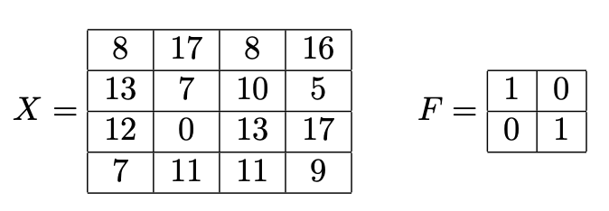
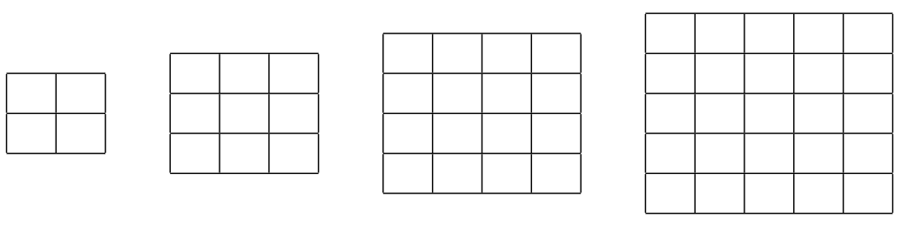
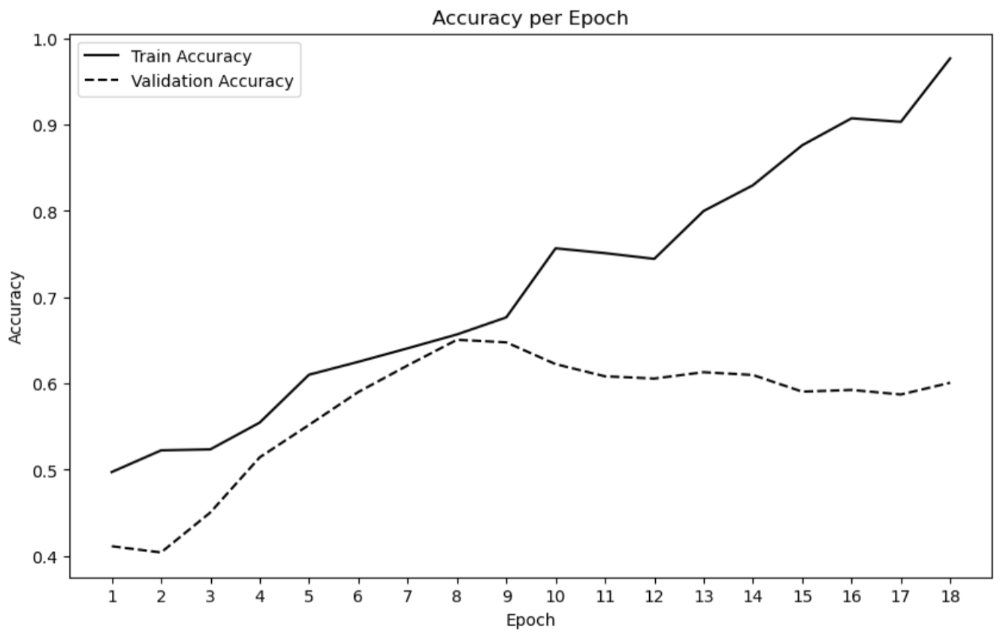

# Practice 2 Problem 7

## Problem 1

**Question:** In the context of logistic regression, which of the following statements is true about the interpretation of the model coefficients?

**Options:**

(a) The coefficients represent the change in the log odds of the dependent variable for a one-unit change in the predictor variable, holding all other variables constant.

(b) The coefficients represent the change in the dependent variable for a one-unit change in the predictor variable, holding all other variables constant.

(c) The coefficients are directly proportional to the probability of the dependent variable being 1.

(d) The coefficients represent the probability that the predictor variable will be present when the dependent variable is 1.

---

## Problem 2

**Question:** You are working on a machine learning project to classify emails as either spam (1) or not spam (0) using logistic regression. The model has been trained based on emails with labels and several features, including the frequency of specific keywords. For a particular new email, the model's output of the log-odds is 0.4. Given the model's output, which of the following options best describes its classification of the email?

**Options:**

(a) The email is classified as not spam because a positive log-odds score indicates a higher likelihood of the email belonging to the negative class (not spam).

(b) The email is classified as spam because the log-odds score is positive, indicating that the odds of the email being spam are greater than the odds of it not being spam.

(c) The email is classified as not spam because the probability of being spam is less than 0.5.

(d) The email is classified as spam because the probability of it being spam is positive.

---

## Problem 3

**Question:** In the context of logistic regression used for binary classification, which of the following statements is true?

**Options:**

(a) The model directly outputs class labels (0 or 1)

(b) The model's optimization has a closed-form solution.

(c) The model produces a linear decision boundary with respect to the features.

(d) The model uses the softmax function to output class probabilities.

---

## Problem 4

**Question:** Which are key properties of the Radial Basis Function kernel?

**Options:**

(a) It works best when features take on categorical values.

(b) It relies on the distance between points in the original feature space.

(c) It relies on the distance between points in infinite-dimensional space.

(d) It implicitly maps to an infinite-dimensional feature space.

(e) It identifies hyperplanes in an infinite-dimensional space.

---

## Problem 5

**Question:** Which of the following is not a valid kernel?

**Options:**

(a) $K(x, x') = \frac{1}{\sqrt{2\pi}} \exp(-\frac{1}{2}\|x - x'\|_2^2)$

(b) $K(x,x') = -\frac{1}{\sqrt{2\pi}} \exp(-\frac{1}{2}\|x - x'\|_2^2)$

(c) $K(x,x') = x^T x'$

(d) $K(x, x') = 1$

---

## Problem 6

**Question:** Which of the following statements about the "kernel trick" are true in the context of machine learning algorithms?

**Options:**

(a) It provides an efficient method for computing and representing high-dimensional feature expansions.

(b) It implicitly maps to a high-dimensional feature space.

(c) It eliminates the need for regularization.

(d) It can only be used in regression prediction settings.

---

## Problem 7

**Question:** Consider the kernel ridge regression problem.

$$\hat{w} = \arg\min_w \frac{1}{n} \sum_{i=1}^n (y_i - \phi(x_i)^\text{T} w)^2 + \lambda \Vert w \Vert^2 \quad \text{becomes} \quad \hat{\alpha} = \arg\min_\alpha \Vert Y - K\alpha \Vert_2^2 + \lambda \alpha^\text{T} K \alpha$$

Let $\phi(x): \mathbb{R}^d \to \mathbb{R}^p$ be the feature mapping the kernel matrix $K$ is with respect to. Let $n$ be the number of samples we have. Which of the following statements is true?

**Options:**

(a) Ridge regression can only be kernelized assuming $\alpha \in \text{span}\{x_1, x_2,..., x_n\}$ where $x_i \in \mathbb{R}^d$ denotes the $i$th training sample

(b) When $n \ll p$, the kernel method will be more computationally efficient than using regular ridge regression.

(c) There is no closed-form solution if $K$ is positive definite.

(d) The optimal $\hat{w}$ can be obtained after solving for the optimal $\hat{\alpha}$ even though $w$ is not explicitly included in the optimization problem

---

## Problem 8

**Question:** Assume we have $n$ samples from some distribution $P_X$, and wish to estimate the variance of $P_X$, as well as compute a confidence interval on the variance. If $n = 1$ and we draw only a single datapoint $X_1 = 2$ from $P_X$, which of the following are true?

**Options:**

(a) The bootstrap estimate of the variance is 0.

(b) The bootstrap estimate of the variance is 2.

(c) The bootstrap cannot be applied when we only have $n = 1$ samples.

(d) The bootstrap is likely to give a very poor estimate of the variance in this setting.

---

## Problem 9

**Question:** Which of the following statements about the bootstrap method are true?

**Options:**

(a) It requires a large sample size to be effective and cannot be used effectively with small datasets.

(b) It involves repeatedly sampling with replacement from a dataset to create samples and then calculating the statistic of interest on each sample.

(c) Bootstrap methods can only be applied to estimate the mean of a dataset and do not apply to other statistics like median or variance.

(d) One of the advantages is that it does not make strong parametric assumptions about the distribution of the data.

(e) It can be used to estimate confidence intervals for almost any statistic, regardless of the original data distribution.

---

## Problem 10

**Question:** Which of the following are advantages of using random forests over decision trees?

**Options:**

(a) The optimal decision tree cannot be efficiently computed, but the optimal random forest can.

(b) Random forests typically have smaller variance than decision trees.

(c) Random forests typically have smaller bias than decision trees.

(d) Random forests are less prone to overfitting compared to decision trees.

---

## Problem 11

**Question:** Which of the following is true about $k$-nearest neighbors (KNN)?

**Options:**

(a) KNN works best with high dimensional data.

(b) When $k=1$, the training error is always less than or equal to the test error.

(c) The computational cost of making a prediction on a new test point increases with the size of the training dataset.

(d) The effectiveness of KNN is independent of the distance metric used.

---

## Problem 12

**Question:** For $k$-nearest neighbors (KNN), changing $k$ will affect:

**Options:**

(a) Bias

(b) Variance

(c) Both bias and variance

(d) Neither bias nor variance

---

## Problem 13

**Question:** In k-nearest neighbors (KNN), having higher dimensional features is always more desirable because it provides more dimensions to calculate the distance between two data points.

**Options:**

(a) True

(b) False

---

## Problem 14

**Question:** The training algorithm for k-means clustering is guaranteed to converge to a local minimum of the k-means objective function.

**Options:**

(a) True

(b) False

---

## Problem 15

**Question:** The k-means objective function always improves with each successive iteration of the k-means training algorithm until the objective function converges.

**Options:**

(a) True

(b) False

---

## Problem 16

**Question:** In k-means clustering, choosing a different set of initial centroids always leads to the same final clusters after convergence.

**Options:**

(a) True

(b) False

---

## Problem 17

**Question:** In k-means clustering, if two points are assigned to the same cluster, any point that is a convex combination of those two points must also be assigned to that same cluster. [Hint: recall that a point $x_3$ is a convex combination of the points $x_1$ and $x_2$ if $x_3 = \alpha x_1 + (1 - \alpha)x_2$ for some $0 \le \alpha \le 1$]

**Options:**

(a) True

(b) False

---

## Problem 18

**Question:** Recall that in a Gaussian mixture model (GMM) with $K = 2$ Gaussians, the "responsibilities" $\gamma_{ik}$ indicate the probability that the $i$-th data point was generated by the $k$-th Gaussian. These responsibilities provide soft cluster assignments. In a GMM, if two points $x_1$ and $x_2$ have responsibilities $\gamma_{1k} \ge p$ and $\gamma_{2k} \ge p$, respectively, then any point $x_3$ that is a convex combination of $x_1$ and $x_2$ must also have a responsibility $\gamma_{3k} \ge p$.

**Options:**

(a) True

(b) False

---

## Problem 19

**Question:** What are advantages of using a Gaussian mixture model (GMM) to cluster data over k-means clustering?

**Options:**

(a) GMMs are better at handling non-spherical clusters.

(b) There is a closed-form solution that optimizes the GMM loss function, whereas k-means requires an iterative optimization algorithm.

(c) GMMs are better at modeling uncertainty of cluster assignments.

(d) There are no advantages of using a GMM over k-means clustering.

---

## Problem 20

**Question:** What role(s) does the activation function in a neural network play?

**Options:**

(a) It determines the size of the neural network.

(b) It introduces non-linearity into the network.

(c) It directly minimizes the loss function during training.

(d) It calculates the gradient of the network's weights.

---

## Problem 21

**Question:** Consider a neural network being trained to minimize a loss function using backpropagation. If the learning rate is set too high, what is the most likely outcome during the training process?

**Options:**

(a) The network efficiently converges to the global minimum of the loss function, resulting in optimal training performance.

(b) The network's weights oscillate or diverge, potentially causing the loss to increase rather than decrease.

(c) The network immediately overfits to the training data, leading to poor generalization on unseen data.

(d) The network's training process significantly slows down, requiring more epochs to reach convergence.

---

## Problem 22

**Question:** Increasing the number of hidden layers in a neural network will always decrease prediction error on the training data.

**Options:**

(a) True

(b) False

---

## Problem 23

**Question:** When designing a neural network, the depth of the network (i.e., the number of hidden layers) plays a critical role in its performance. Which of the following statements best describes the impact of increasing the network's depth?

**Options:**

(a) Adding more layers to the network always results in better performance on the training data, regardless of the activation function (e.g., linear, ReLU, sigmoid, etc.).

(b) Increasing the depth of the network linearly improves its performance on both training and unseen data, as deeper networks can represent more complex functions.

(c) Adding more layers to the network can improve its ability to learn hierarchical representations of data, which is beneficial for complex pattern recognition tasks, though it may also increase the computational complexity and the risk of overfitting.

(d) Deeper networks are less likely to overfit compared to shallower ones, as they have a greater capacity to generalize from the training data to unseen data.

---

## Problem 24

**Question:** In the backpropagation algorithm, after computing the gradient of the loss function with respect to the weights, which step is crucial for updating the weights of a neural network to minimize the loss function?

**Options:**

(a) The weights are updated by setting them directly equal to the negative of the computed gradients to immediately minimize the loss.

(b) The learning rate is applied to the gradients, and this product is then subtracted from the current weights to gradually decrease the loss over iterations.

(c) Each weight's gradient is squared, and this squared gradient is then subtracted from the current weight value to ensure only positive updates.

(d) Gradients are normalized to unit length before being applied to update the weights, ensuring uniform step sizes across all dimensions.

---

## Problem 25

**Question:** A narrow and deep neural network will always outperform a wide, shallow neural network if the two networks have an approximately equivalent number of parameters.

**Options:**

(a) True

(b) False

---

## Problem 26

**Question:** During backpropagation, as the gradient flows backward through a sigmoid function $\sigma(x) = \frac{1}{1+e^{-x}}$, the gradient will always:

**Options:**

(a) Decrease in magnitude, preserve sign polarity

(b) Increase in magnitude, preserve sign polarity

(c) Decrease in magnitude, reverse sign polarity

(d) Increase in magnitude, reverse sign polarity

---

## Problem 27

**Question:** (2 points) Note: This question is significantly more time consuming than the others; you may want to finish other questions first.

A commonly used activation function in neural networks is the ReLU function, defined as

$$\text{ReLU}(x) = \begin{cases} 
x & \text{if } x \geq 0 \\
0 & \text{if } x < 0
\end{cases}$$

Consider the following neural network with input $x \in \mathbb{R}^d$ and output $y \in \mathbb{R}$ defined as:

$$z = \text{ReLU}(W^{(0)}x + b^{(0)})$$

$$y = W^{(1)}z + b^{(1)}$$

for parameters $W^{(0)} \in \mathbb{R}^{h \times d}$, $b^{(0)} \in \mathbb{R}^h$, $W^{(1)} \in \mathbb{R}^{1 \times h}$, $b^{(1)} \in \mathbb{R}$, and where ReLU is applied element-wise to the vector $W^{(0)}x + b^{(0)}$. Let $W_i^{(1)}$ denote the $i$th element of $W^{(1)}$, and $W_i^{(0)\text{T}}$ denote the $i$th row of $W^{(0)}$. For simplicity, assume that each element of $W^{(0)}x + b^{(0)}$ is non-zero.

What is $\frac{dy}{dW_i^{(0)\text{T}}}$? You may write your answer in terms of $W_i^{(0)}$ and $W_i^{(1)}$.

**Answer:**

What is $\frac{dy}{dW_i^{(0)}}$? You may write your answer in terms of $\frac{dy}{dW_i^{(0)}}$.

**Answer:**

---

## Problem 28

**Question:** Select All Which of the following statements about PCA are True?

**Options:**

(a) PCA identifies the directions in feature space that minimize the variance of the projected data.

(b) PCA identifies the directions in feature space that minimize the reconstruction error between the original data and its projection onto the principal components.

(c) All principal component directions are orthogonal to one another.

(d) The first principal component direction is the eigenvector of the data covariance matrix that has the smallest eigenvalue.

(e) The principal component directions can be found from a singular value decomposition of the data matrix.

---

## Problem 29

**Question:** Which of the following statements about PCA are True?

**Options:**

(a) For samples in $d$-dimensions, the top $d$ principal components can fully reconstruct the original samples

(b) For samples in $d$-dimension, it's impossible to fully reconstruct the samples using top $q$ principal components when $q < d$.

(c) Standard cross-validation techniques can be used to identify $q$, the optimal dimensionality of the PCA projection.

---

## Problem 30

**Question:** Throughout this course, we have seen that the solution to linear regression problems can be written as $\hat{\theta} = (X^T X)^{-1}X^T Y$, for data matrices $X \in \mathbb{R}^{n \times d}$ and $Y \in \mathbb{R}^n$. Let $X = U\Sigma V^T$ denote the SVD of $X$. What is $\hat{\theta}$ in terms of $U, \Sigma, V$, and $Y$? Note that this suggests that one way to solve a least squares problem is to simply compute the SVD of $X$.

**Options:**

(a) $V(\Sigma^T \Sigma)^{-1}\Sigma^T U^T Y$

(b) $V\Sigma^{-1}U^T Y$

(c) $U\Sigma^T (\Sigma^T \Sigma)^{-1}V^T Y$

(d) $U(\Sigma^T \Sigma)^{-1}\Sigma^T V^T Y$

---

## Problem 31

**Question:** Consider the following matrix $X$ and convolutional neural network (CNN) filter $F$.

$$X = \begin{pmatrix}
8 & 17 & 8 & 16 \\
13 & 7 & 10 & 5 \\
12 & 0 & 13 & 17 \\
7 & 11 & 11 & 9
\end{pmatrix}
\quad
F = \begin{pmatrix}
1 & 0 \\
0 & 1
\end{pmatrix}$$

Apply the filter $F$ to matrix $X$ with Padding = 1 (padding with zeros) and stride = 2.

Write the resulting matrix below in the grid of the correct size.

---

## Problem 32

**Question:** Give one main reason we might use a convolutional neural network over a fully connected one. Briefly explain why the CNN architecture makes that advantage possible.

**Answer:**

---

## Problem 33

**Question:** Which of the following functions are convex?

**Options:**

(a) $f(x) = x^T Ax$, where A is a symmetric matrix and $x \in \mathbb{R}^d$.

(b) The logistic function $\sigma(x) = \frac{1}{1+e^{-x}}$, where $x \in \mathbb{R}$.

(c) The L2 regularization term $f(x) = \lambda ||x||_2^2$, where $\lambda > 0$ and $x \in \mathbb{R}^d$.

(d) The L1 regularization term $f(x) = \lambda ||x||_1$, where $\lambda > 0$ and $x \in \mathbb{R}^d$.

(e) The regularization term $f(x) = \lambda \sum_{i=1}^d \sqrt{x_i}$, where $\lambda > 0, x_i > 0$.

---

## Problem 34

**Question:** Which of the following statements are true for a convex function $f(x)$? You may assume that $f(x)$ is defined and is twice differentiable for all values of $x$.

**Options:**

(a) If you pick any two points on the graph of $f(x)$, the line segment connecting them will not lay underneath the graph.

(b) Every local minimum of $f(x)$ is also a global minimum.

(c) $f(x)$ must have at least one sharp corner or point, like the tip of a triangle.

(d) The second derivative of $f(x)$ is always negative.

(e) There is a unique value of $x$ that minimizes $f(x)$.

---

## Problem 35

**Question:** Suppose you train a linear regression model to approximate the quadratic function $g(x) = 7x^2 + 3$. What is the most likely outcome?

**Options:**

(a) The model will have high bias and high variance

(b) The model will have high bias and low variance

(c) The model will have low bias and high variance

(d) The model will have low bias and low variance

---

## Problem 36

**Question:** Suppose you train a polynomial regression model of degree $d = 4$ to approximate the linear function $g(x) = 3x + 2$. What is the most likely outcome?

**Options:**

(a) The model will have high bias and high variance

(b) The model will have high bias and low variance

(c) The model will have low bias and high variance

(d) The model will have low bias and low variance

---

## Problem 37

**Question:** Consider the following accuracy plot generated while training a neural network.

Which one of these options would be most likely to improve the validation accuracy of your model?

**Options:**

1. Increase the learning rate

2. Decrease the learning rate

3. Increase regularization

4. Decrease regularization

5. Increase the number of epochs

6. Decrease the number of epochs

7. None of the above

Choose one option and explain how it would help improve the model (2 sentences). If none of these options are likely to change the model's performance, explain why (2 sentences).

**Answer:**

---

## Problem 38

**Question:** Select All Which of the following statements about Maximum Likelihood Estimation (MLE) are true?

**Options:**

(a) MLE requires probabilistic assumptions to be made about the data.

(b) Linear regression can be viewed as a MLE problem.

(c) Logistic regression can be viewed as a MLE problem.

(d) MLE guarantees that the estimated parameters are unbiased.

(e) MLE is always equivalent to minimizing the squared reconstruction error.

---

## Problem 39

**Question:** In the context of machine learning, how does k-fold cross-validation enhance the reliability of a model's performance evaluation compared to using a single train-test split, and what is one potential downside of using this method?

**Answer:**

---

## Problem 40

**Question:** Select All Which of the statements about cross-validation are true?

**Options:**

(a) The goal of cross-validation is to estimate the training error.

(b) Leave-one-out cross-validation is equivalent to k-fold cross-validation when k is equal to the total number of training data points n.

(c) Leave-one-out cross-validation is always faster than k-fold cross-validation.

(d) k-fold cross-validation will always produce the same estimate of error, regardless of the choice of k.

---

## Problem 41

**Question:** In which setting(s) might logistic regression be more suitable than k-nearest neighbors (KNN)?

**Options:**

(a) If your targets $y_i$ take on continuous values.

(b) If you want to understand the relationship between your features $x_i$ and your targets $y_i$.

(c) If you care most about minimizing the time required to train your model.

(d) If you care most about minimizing the time required to make predictions with your model.

---

## Problem 42

**Question:** Ridge regression reduces overfitting by:

**Options:**

(a) Penalizing the L1 norm of the model parameters.

(b) Penalizing the L2 norm of the model parameters.

(c) Increasing model complexity to better fit the training data.

(d) Encouraging sparsity in the model parameters.

---

## Problem 43

**Question:** Which of the following statements about ridge regression are **incorrect**?

**Options:**

(a) Ridge regression introduces a penalty term to the linear regression cost function by controlling the magnitudes of the coefficient values.

(b) The regularization term in ridge regression helps in reducing model complexity by setting some coefficients to exactly zero.

(c) The ridge regression parameter estimate will be equivalent to the Ordinary Least Squares parameter estimate when $\lambda = 0$ in the case that $X^T X$ is full rank (where $X$ is the training data matrix).

(d) The choice of the regularization hyperparameter ($\lambda$) in ridge regression can significantly impact the model's bias-variance trade-off.

