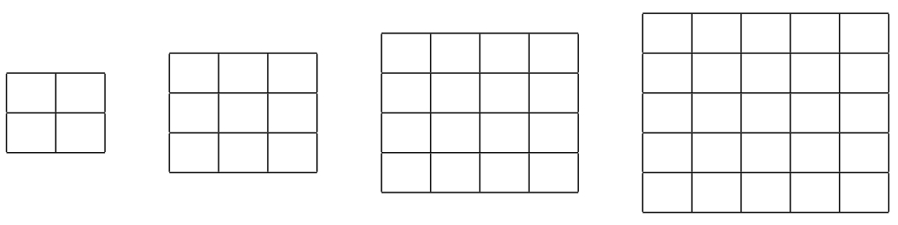

# Practice 2 Problem 7 Solution

## Problem 1

**Question:** In the context of logistic regression, which of the following statements is true about the interpretation of the model coefficients?

**Options:**

(a) The coefficients represent the change in the log odds of the dependent variable for a one-unit change in the predictor variable, holding all other variables constant.

(b) The coefficients represent the change in the dependent variable for a one-unit change in the predictor variable, holding all other variables constant.

(c) The coefficients are directly proportional to the probability of the dependent variable being 1.

(d) The coefficients represent the probability that the predictor variable will be present when the dependent variable is 1.

**Correct answer:** (a)

**Explanation:**

The correct answer is **(a)**. Here's the detailed explanation:

**Understanding Logistic Regression Coefficients:**

**Logistic Regression Model:**
The logistic regression model predicts the probability of the dependent variable being 1:
$$P(Y = 1|X) = \frac{1}{1 + e^{-(\beta_0 + \beta_1 X_1 + \beta_2 X_2 + \ldots + \beta_k X_k)}}$$

**Log-Odds Transformation:**
The log-odds (logit) is the natural logarithm of the odds:
$$\log\left(\frac{P(Y = 1|X)}{P(Y = 0|X)}\right) = \beta_0 + \beta_1 X_1 + \beta_2 X_2 + \ldots + \beta_k X_k$$

**Interpretation of Coefficients:**

**Mathematical Definition:**
For a coefficient $\beta_j$, the interpretation is:
$$\beta_j = \log\left(\frac{\text{Odds}(Y = 1|X_j = x_j + 1)}{\text{Odds}(Y = 1|X_j = x_j)}\right)$$

**Practical Meaning:**
- A one-unit increase in $X_j$ changes the log-odds by $\beta_j$ units
- This change occurs while holding all other variables constant
- The coefficient represents the change in log-odds, not the change in probability

**Why This is Correct:**

**1. Log-Odds Interpretation:**
- Coefficients represent changes in log-odds, not direct changes in probability
- This is the standard interpretation in logistic regression
- It's consistent with the mathematical formulation

**2. Ceteris Paribus Condition:**
- "Holding all other variables constant" is crucial
- This allows us to isolate the effect of one variable
- It's the standard assumption in regression analysis

**3. Linear Relationship:**
- The relationship is linear in the log-odds space
- This makes interpretation straightforward
- It's the basis for the logistic regression model

**Why Other Options Are Wrong:**

**Option (b) - Direct change in dependent variable:**
- **Problem**: This describes linear regression, not logistic regression
- **Issue**: Logistic regression predicts probabilities, not direct values
- **Result**: Incorrect interpretation for binary classification

**Option (c) - Direct proportionality to probability:**
- **Problem**: The relationship is not linear in probability space
- **Issue**: Coefficients affect log-odds, which then affect probabilities non-linearly
- **Result**: Misunderstands the mathematical relationship

**Option (d) - Probability of predictor presence:**
- **Problem**: This confuses the direction of prediction
- **Issue**: We're predicting the dependent variable, not the predictor
- **Result**: Completely incorrect interpretation

**Practical Example:**

**Consider a logistic regression model:**
$$\log\left(\frac{P(\text{Spam} = 1|X)}{P(\text{Spam} = 0|X)}\right) = -2 + 0.5 \cdot \text{KeywordCount}$$

**Interpretation:**
- $\beta_0 = -2$: When KeywordCount = 0, the log-odds of spam is -2
- $\beta_1 = 0.5$: For each additional keyword, the log-odds of spam increases by 0.5

**Converting to Odds:**
- When KeywordCount = 0: Odds = $e^{-2} = 0.135$
- When KeywordCount = 1: Odds = $e^{-2 + 0.5} = e^{-1.5} = 0.223$
- Odds ratio = $\frac{0.223}{0.135} = 1.65$

**Converting to Probability:**
- When KeywordCount = 0: $P(\text{Spam}) = \frac{0.135}{1 + 0.135} = 0.119$
- When KeywordCount = 1: $P(\text{Spam}) = \frac{0.223}{1 + 0.223} = 0.182$

**Key Insights:**

**1. Non-Linear Probability Changes:**
- The same coefficient change has different effects on probability depending on the baseline
- This is why we interpret in log-odds space

**2. Odds Ratio Interpretation:**
- $e^{\beta_j}$ is the odds ratio for a one-unit increase in $X_j$
- This is often more intuitive than log-odds

**3. Marginal Effects:**
- The effect on probability depends on the current probability level
- Marginal effects can be calculated as $\frac{\partial P(Y=1)}{\partial X_j} = P(Y=1)(1-P(Y=1))\beta_j$

**Conclusion:**
The coefficients in logistic regression represent **changes in the log-odds of the dependent variable for a one-unit change in the predictor variable, holding all other variables constant**.

---

## Problem 2

**Question:** You are working on a machine learning project to classify emails as either spam (1) or not spam (0) using logistic regression. The model has been trained based on emails with labels and several features, including the frequency of specific keywords. For a particular new email, the model's output of the log-odds is 0.4. Given the model's output, which of the following options best describes its classification of the email?

**Options:**

(a) The email is classified as not spam because a positive log-odds score indicates a higher likelihood of the email belonging to the negative class (not spam).

(b) The email is classified as spam because the log-odds score is positive, indicating that the odds of the email being spam are greater than the odds of it not being spam.

(c) The email is classified as not spam because the probability of being spam is less than 0.5.

(d) The email is classified as spam because the probability of it being spam is positive.

**Correct answer:** (b)

**Explanation:**

The correct answer is **(b)**. Here's the detailed explanation:

**Understanding Log-Odds in Logistic Regression:**

**Log-Odds Definition:**
The log-odds is the natural logarithm of the odds ratio:
$$\text{Log-odds} = \log\left(\frac{P(Y = 1|X)}{P(Y = 0|X)}\right)$$

**Relationship to Probability:**
The probability can be recovered from log-odds using the sigmoid function:
$$P(Y = 1|X) = \frac{1}{1 + e^{-\text{log-odds}}} = \frac{e^{\text{log-odds}}}{1 + e^{\text{log-odds}}}$$

**Mathematical Analysis:**

**Given:** Log-odds = 0.4

**Step 1: Determine the Relationship**
Since log-odds = 0.4 > 0, we have:
$$\log\left(\frac{P(Y = 1|X)}{P(Y = 0|X)}\right) = 0.4$$

**Step 2: Exponentiate Both Sides**
$$\frac{P(Y = 1|X)}{P(Y = 0|X)} = e^{0.4} \approx 1.49$$

**Step 3: Interpret the Odds Ratio**
- Odds ratio = 1.49 means the odds of spam are 1.49 times the odds of not spam
- This means $P(Y = 1|X) > P(Y = 0|X)$

**Step 4: Calculate Probabilities**
$$P(Y = 1|X) = \frac{e^{0.4}}{1 + e^{0.4}} = \frac{1.49}{2.49} \approx 0.598$$
$$P(Y = 0|X) = \frac{1}{1 + e^{0.4}} = \frac{1}{2.49} \approx 0.402$$

**Classification Decision:**
Since $P(Y = 1|X) = 0.598 > 0.5$, the email is classified as **spam**.

**Why This is Correct:**

**1. Positive Log-Odds Implies Higher Spam Probability:**
- Log-odds > 0 means odds ratio > 1
- This means $P(\text{spam}) > P(\text{not spam})$
- Therefore, classify as spam

**2. Mathematical Verification:**
- Log-odds = 0.4 > 0
- $P(Y = 1|X) = \frac{e^{0.4}}{1 + e^{0.4}} \approx 0.598 > 0.5$
- Classification threshold is typically 0.5

**3. Intuitive Understanding:**
- Positive log-odds means the model favors the positive class
- In spam classification, positive class is spam
- Therefore, classify as spam

**Why Other Options Are Wrong:**

**Option (a) - Positive log-odds indicates negative class:**
- **Problem**: This is backwards
- **Issue**: Positive log-odds means higher probability of positive class
- **Result**: Incorrect interpretation

**Option (c) - Probability less than 0.5:**
- **Problem**: The calculated probability is 0.598 > 0.5
- **Issue**: Incorrect calculation or interpretation
- **Result**: Wrong conclusion

**Option (d) - Positive probability means spam:**
- **Problem**: All probabilities are positive by definition
- **Issue**: This doesn't provide meaningful classification criteria
- **Result**: Vague and incorrect reasoning

**General Rules for Log-Odds Interpretation:**

**1. Sign of Log-Odds:**
- **Positive log-odds**: $P(Y = 1) > P(Y = 0)$ → Classify as 1
- **Negative log-odds**: $P(Y = 1) < P(Y = 0)$ → Classify as 0
- **Zero log-odds**: $P(Y = 1) = P(Y = 0)$ → Equal probabilities

**2. Magnitude of Log-Odds:**
- **Large positive**: Very confident in class 1
- **Large negative**: Very confident in class 0
- **Close to zero**: Uncertain classification

**3. Relationship to Decision Threshold:**
- **Default threshold**: 0.5 probability
- **Log-odds threshold**: 0 (since $\log(1) = 0$)
- **Custom thresholds**: Can be adjusted based on business needs

**Practical Example:**

**Scenario 1: Log-odds = 2.0**
- $P(Y = 1) = \frac{e^2}{1 + e^2} \approx 0.88$
- Very confident spam classification

**Scenario 2: Log-odds = -1.0**
- $P(Y = 1) = \frac{e^{-1}}{1 + e^{-1}} \approx 0.27$
- Classify as not spam

**Scenario 3: Log-odds = 0.0**
- $P(Y = 1) = \frac{e^0}{1 + e^0} = 0.5$
- Uncertain classification

**Conclusion:**
When the log-odds is **positive (0.4)**, it indicates that the odds of the email being spam are greater than the odds of it not being spam, so the email is classified as **spam**.

---

## Problem 3

**Question:** In the context of logistic regression used for binary classification, which of the following statements is true?

**Options:**

(a) The model directly outputs class labels (0 or 1)

(b) The model's optimization has a closed-form solution.

(c) The model produces a linear decision boundary with respect to the features.

(d) The model uses the softmax function to output class probabilities.

**Correct answer:** (c)

**Explanation:**

The correct answer is **(c)**. Here's the detailed explanation:

**Understanding Logistic Regression Decision Boundaries:**

**Logistic Regression Model:**
The logistic regression model predicts the probability of class 1:
$$P(Y = 1|X) = \frac{1}{1 + e^{-(\beta_0 + \beta_1 X_1 + \beta_2 X_2 + \ldots + \beta_k X_k)}}$$

**Decision Boundary:**
The decision boundary is where $P(Y = 1|X) = 0.5$, which occurs when:
$$\beta_0 + \beta_1 X_1 + \beta_2 X_2 + \ldots + \beta_k X_k = 0$$

**Linear Decision Boundary:**

**Mathematical Form:**
The decision boundary is defined by the linear equation:
$$\beta_0 + \beta_1 X_1 + \beta_2 X_2 + \ldots + \beta_k X_k = 0$$

**Geometric Interpretation:**
- In 2D: This is a straight line
- In 3D: This is a plane
- In higher dimensions: This is a hyperplane

**Why This is Correct:**

**1. Linear in Feature Space:**
- The decision boundary is linear with respect to the original features
- This is a fundamental property of logistic regression
- It's why logistic regression is considered a linear classifier

**2. Mathematical Verification:**
- The sigmoid function is non-linear, but the decision boundary is linear
- The non-linearity is in the probability output, not the boundary
- The boundary occurs where the linear combination equals zero

**3. Intuitive Understanding:**
- Logistic regression finds a linear separator between classes
- It can only separate classes that are linearly separable
- This is both a strength and limitation of the method

**Why Other Options Are Wrong:**

**Option (a) - Direct class label output:**
- **Problem**: Logistic regression outputs probabilities, not direct labels
- **Issue**: The model predicts $P(Y = 1|X)$, not $Y$ directly
- **Result**: Classification requires applying a threshold to probabilities

**Option (b) - Closed-form solution:**
- **Problem**: Logistic regression requires iterative optimization
- **Issue**: No closed-form solution exists for the maximum likelihood estimates
- **Result**: Methods like gradient descent or Newton's method are needed

**Option (d) - Softmax function:**
- **Problem**: Softmax is used for multi-class classification
- **Issue**: Logistic regression uses sigmoid (logistic) function for binary classification
- **Result**: Softmax is not used in binary logistic regression

**Mathematical Details:**

**Sigmoid Function:**
$$\sigma(z) = \frac{1}{1 + e^{-z}}$$

**Properties:**
- Range: $(0, 1)$
- Symmetric around $z = 0$: $\sigma(z) + \sigma(-z) = 1$
- Monotonic increasing
- Smooth and differentiable

**Decision Process:**
1. Compute linear combination: $z = \beta_0 + \beta_1 X_1 + \ldots + \beta_k X_k$
2. Apply sigmoid: $P(Y = 1|X) = \sigma(z)$
3. Classify: $Y = 1$ if $P(Y = 1|X) > 0.5$, else $Y = 0$

**Visual Example:**

**2D Case with Two Features:**
- Decision boundary: $\beta_0 + \beta_1 X_1 + \beta_2 X_2 = 0$
- This is a line: $X_2 = -\frac{\beta_0}{\beta_2} - \frac{\beta_1}{\beta_2} X_1$
- Points on one side are classified as class 1
- Points on the other side are classified as class 0

**Limitations of Linear Decision Boundaries:**

**1. XOR Problem:**
- Cannot separate classes that are not linearly separable
- Requires feature engineering or non-linear transformations

**2. Non-Linear Patterns:**
- Cannot capture complex non-linear relationships
- May need polynomial features or kernel methods

**3. Curved Boundaries:**
- Cannot create curved decision boundaries
- Limited to straight lines, planes, or hyperplanes

**Advantages of Linear Decision Boundaries:**

**1. Interpretability:**
- Easy to understand and interpret
- Coefficients have clear meaning
- Decision process is transparent

**2. Computational Efficiency:**
- Fast training and prediction
- No complex optimization required
- Works well with large datasets

**3. Generalization:**
- Less prone to overfitting
- Good performance on linearly separable data
- Robust to noise

**Extensions for Non-Linear Boundaries:**

**1. Feature Engineering:**
- Add polynomial features: $X_1^2, X_1 X_2, X_2^2$
- Add interaction terms
- Transform features non-linearly

**2. Kernel Methods:**
- Use kernel logistic regression
- Map to higher-dimensional space
- Maintain linearity in feature space

**3. Neural Networks:**
- Use multiple logistic regression units
- Create non-linear decision boundaries
- More complex but more flexible

**Conclusion:**
Logistic regression produces a **linear decision boundary with respect to the features**, which is why it's classified as a linear classifier despite using a non-linear sigmoid function for probability output.

---

## Problem 4

**Question:** Which are key properties of the Radial Basis Function kernel?

**Options:**

(a) It works best when features take on categorical values.

(b) It relies on the distance between points in the original feature space.

(c) It relies on the distance between points in infinite-dimensional space.

(d) It implicitly maps to an infinite-dimensional feature space.

(e) It identifies hyperplanes in an infinite-dimensional space.

**Correct answers:** (b), (d)

**Explanation:**

The correct answers are **(b)** and **(d)**. Here's the detailed explanation:

**Understanding Radial Basis Function (RBF) Kernel:**

**Definition:**
The RBF kernel (also known as Gaussian kernel) is defined as:
$$K(x, x') = \exp\left(-\frac{||x - x'||^2}{2\sigma^2}\right)$$

where:
- $x, x'$ are data points in the original feature space
- $||x - x'||$ is the Euclidean distance between points
- $\sigma$ is the bandwidth parameter that controls the kernel width

**Analysis of Each Statement:**

**Option (a) - It works best when features take on categorical values: FALSE** ❌

**Mathematical Analysis:**
- **RBF kernel**: Based on Euclidean distance between continuous features
- **Categorical features**: Don't have meaningful Euclidean distances
- **Distance calculation**: $||x - x'|| = \sqrt{\sum_i (x_i - x_i')^2}$ requires numerical features

**Why This is Incorrect:**
- Categorical features need encoding (one-hot, label encoding) before using RBF
- RBF assumes continuous, numerical feature space
- Distance-based kernels work poorly with categorical data

**Option (b) - It relies on the distance between points in the original feature space: TRUE** ✅

**Mathematical Proof:**
The RBF kernel explicitly uses the Euclidean distance:
$$K(x, x') = \exp\left(-\frac{||x - x'||^2}{2\sigma^2}\right)$$

**Key Properties:**
- **Distance-based**: Kernel value depends on $||x - x'||$
- **Original space**: Distance is computed in the input feature space
- **Similarity measure**: Points closer together have higher kernel values

**Example:**
```
x1 = [1, 2], x2 = [4, 6]
Distance: ||x1 - x2|| = √((1-4)² + (2-6)²) = √(9 + 16) = 5
RBF kernel: K(x1, x2) = exp(-5²/(2σ²)) = exp(-25/(2σ²))
```

**Option (c) - It relies on the distance between points in infinite-dimensional space: FALSE** ❌

**Mathematical Analysis:**
- **RBF kernel**: Computes distance in original feature space
- **Kernel trick**: Avoids explicit mapping to infinite dimensions
- **Implicit mapping**: Distance is computed before the infinite-dimensional transformation

**Why This is Incorrect:**
- The distance is computed in the original space, not the infinite-dimensional space
- The infinite-dimensional mapping is implicit and never explicitly computed
- The kernel trick allows us to work in the original space

**Option (d) - It implicitly maps to an infinite-dimensional feature space: TRUE** ✅

**Mathematical Proof:**

**Taylor Series Expansion:**
The RBF kernel can be expanded as:
$$K(x, x') = \exp\left(-\frac{||x - x'||^2}{2\sigma^2}\right) = \sum_{k=0}^{\infty} \frac{1}{k!}\left(-\frac{||x - x'||^2}{2\sigma^2}\right)^k$$

**Infinite-Dimensional Mapping:**
This expansion corresponds to an infinite-dimensional feature space where each dimension represents a polynomial term.

**Mercer's Theorem:**
The RBF kernel satisfies Mercer's conditions, which guarantees that it corresponds to an inner product in some (potentially infinite-dimensional) feature space.

**Option (e) - It identifies hyperplanes in an infinite-dimensional space: FALSE** ❌

**Mathematical Analysis:**
- **RBF kernel**: Creates non-linear decision boundaries in original space
- **Hyperplanes**: Linear decision boundaries
- **Kernel SVM**: Finds linear separators in the infinite-dimensional space, which correspond to non-linear boundaries in original space

**Why This is Incorrect:**
- The hyperplanes are in the infinite-dimensional space, not identified by the kernel itself
- The kernel only provides the inner product computation
- The learning algorithm (e.g., SVM) finds the hyperplanes

**Practical Implications:**

**1. Feature Space Properties:**
- **Original space**: Distance-based similarity
- **Implicit space**: Infinite-dimensional with rich representations
- **Decision boundaries**: Non-linear in original space

**2. Computational Efficiency:**
- **Kernel trick**: Avoids explicit infinite-dimensional computation
- **Distance computation**: Only requires operations in original space
- **Scalability**: Works with large datasets efficiently

**3. Parameter Tuning:**
- **Bandwidth $\sigma$**: Controls the influence of distant points
- **Small $\sigma$**: Local influence, complex boundaries
- **Large $\sigma$**: Global influence, smoother boundaries

**Example Applications:**

**1. Support Vector Machines:**
- RBF kernel creates non-linear decision boundaries
- Effective for non-linearly separable data
- Popular choice for many classification tasks

**2. Gaussian Processes:**
- RBF kernel defines covariance structure
- Captures smooth, continuous relationships
- Used for regression and classification

**3. Kernel PCA:**
- RBF kernel for non-linear dimensionality reduction
- Preserves local structure in data
- Useful for complex data manifolds

**Conclusion:**
Options **(b)** and **(d)** are correct. The RBF kernel relies on distances in the original feature space and implicitly maps to an infinite-dimensional feature space through the kernel trick, enabling non-linear learning while maintaining computational efficiency.

---

## Problem 5

**Question:** Which of the following is not a valid kernel?

**Options:**

(a) $K(x, x') = \frac{1}{\sqrt{2\pi}} \exp(-\frac{1}{2}\|x - x'\|_2^2)$

(b) $K(x,x') = -\frac{1}{\sqrt{2\pi}} \exp(-\frac{1}{2}\|x - x'\|_2^2)$

(c) $K(x,x') = x^T x'$

(d) $K(x, x') = 1$

**Correct answer:** (b)

**Explanation:**

The correct answer is **(b)**. Here's the detailed explanation:

**Understanding Kernel Validity:**

**Definition of Valid Kernel:**
A function $K(x, x')$ is a valid kernel if it satisfies Mercer's conditions, which include:
1. **Positive semidefinite**: $K(x, x') \geq 0$ for all $x, x'$
2. **Symmetric**: $K(x, x') = K(x', x)$ for all $x, x'$
3. **Reproducing property**: Can be written as an inner product in some feature space

**Mathematical Analysis of Each Option:**

**Option (a) - $K(x, x') = \frac{1}{\sqrt{2\pi}} \exp(-\frac{1}{2}\|x - x'\|_2^2)$: VALID** ✅

**Analysis:**
- **Positive**: $\frac{1}{\sqrt{2\pi}} > 0$ and $\exp(-\frac{1}{2}\|x - x'\|_2^2) > 0$ for all $x, x'$
- **Symmetric**: $\|x - x'\|_2 = \|x' - x\|_2$, so the kernel is symmetric
- **RBF kernel**: This is a scaled version of the Gaussian RBF kernel
- **Valid**: Satisfies all Mercer's conditions

**Option (b) - $K(x,x') = -\frac{1}{\sqrt{2\pi}} \exp(-\frac{1}{2}\|x - x'\|_2^2)$: INVALID** ❌

**Mathematical Proof:**

**Positive Semidefinite Violation:**
For any $x, x'$:
$$K(x, x') = -\frac{1}{\sqrt{2\pi}} \exp(-\frac{1}{2}\|x - x'\|_2^2) < 0$$

**Why This is Invalid:**
- **Negative values**: The kernel takes negative values for all $x \neq x'$
- **Mercer's condition**: Requires $K(x, x') \geq 0$ for all $x, x'$
- **Kernel matrix**: Would have negative eigenvalues, violating positive semidefiniteness

**Example:**
```
x = [0, 0], x' = [1, 1]
Distance: ||x - x'||₂ = √(1² + 1²) = √2
K(x, x') = -1/√(2π) × exp(-1/2 × 2) = -1/√(2π) × exp(-1) ≈ -0.242 < 0
```

**Option (c) - $K(x,x') = x^T x'$: VALID** ✅

**Analysis:**
- **Linear kernel**: This is the standard linear kernel
- **Positive semidefinite**: $x^T x'$ is an inner product, which is positive semidefinite
- **Symmetric**: $x^T x' = (x')^T x$ by properties of inner products
- **Valid**: Satisfies all Mercer's conditions

**Option (d) - $K(x, x') = 1$: VALID** ✅

**Analysis:**
- **Constant kernel**: Always returns 1 for any pair of points
- **Positive**: $1 > 0$ for all $x, x'$
- **Symmetric**: $1 = 1$ for all $x, x'$
- **Valid**: Satisfies all Mercer's conditions

**Mathematical Verification:**

**Kernel Matrix Properties:**
For a valid kernel, the kernel matrix $K$ must be:
1. **Symmetric**: $K_{ij} = K_{ji}$
2. **Positive semidefinite**: All eigenvalues $\geq 0$

**Testing Option (b):**
Consider two points $x_1, x_2$:
$$K = \begin{bmatrix} K(x_1, x_1) & K(x_1, x_2) \\ K(x_2, x_1) & K(x_2, x_2) \end{bmatrix}$$

For option (b):
- $K(x_1, x_1) = -\frac{1}{\sqrt{2\pi}} < 0$ (when $x_1 = x_2$)
- $K(x_1, x_2) = -\frac{1}{\sqrt{2\pi}} \exp(-\frac{1}{2}\|x_1 - x_2\|_2^2) < 0$

**Eigenvalues:**
The kernel matrix would have negative eigenvalues, violating positive semidefiniteness.

**Why Other Options Are Valid:**

**Option (a) - Scaled RBF:**
- **Standard form**: $K(x, x') = \exp(-\gamma\|x - x'\|_2^2)$
- **Scaled version**: $\frac{1}{\sqrt{2\pi}} \exp(-\frac{1}{2}\|x - x'\|_2^2)$
- **Valid**: Scaling by positive constant preserves kernel properties

**Option (c) - Linear Kernel:**
- **Inner product**: $K(x, x') = x^T x' = \langle x, x' \rangle$
- **Valid**: Inner products are always valid kernels
- **Feature space**: Maps to the original space itself

**Option (d) - Constant Kernel:**
- **Trivial case**: $K(x, x') = 1$ for all $x, x'$
- **Valid**: Represents the inner product in a 1-dimensional space
- **Use case**: Sometimes used as a baseline or in specific applications

**Practical Implications:**

**1. Algorithm Requirements:**
- **SVM**: Requires positive semidefinite kernels
- **Kernel PCA**: Needs valid kernels for eigendecomposition
- **Gaussian Processes**: Kernel must be positive semidefinite

**2. Computational Issues:**
- **Invalid kernels**: Can cause numerical instability
- **Negative eigenvalues**: Lead to non-convex optimization problems
- **Algorithm failure**: Many kernel methods will fail with invalid kernels

**3. Kernel Construction:**
- **Valid operations**: Sum, product, scaling by positive constant
- **Invalid operations**: Negation, scaling by negative constant
- **Composition**: Must preserve positive semidefiniteness

**Example of Valid Kernel Construction:**

**Sum of Kernels:**
If $K_1$ and $K_2$ are valid kernels, then $K = K_1 + K_2$ is also valid.

**Product of Kernels:**
If $K_1$ and $K_2$ are valid kernels, then $K = K_1 \times K_2$ is also valid.

**Scaling:**
If $K$ is a valid kernel and $c > 0$, then $cK$ is also valid.

**Conclusion:**
Option **(b)** is the invalid kernel because it violates the positive semidefinite property by taking negative values, which makes it unsuitable for kernel-based machine learning algorithms.

---

## Problem 6

**Question:** Which of the following statements about the "kernel trick" are true in the context of machine learning algorithms?

**Options:**

(a) It provides an efficient method for computing and representing high-dimensional feature expansions.

(b) It implicitly maps to a high-dimensional feature space.

(c) It eliminates the need for regularization.

(d) It can only be used in regression prediction settings.

**Correct answers:** (b)

**Explanation:**

The correct answer is **(b)**. Here's the detailed explanation:

**Understanding the Kernel Trick:**

**Definition:**
The kernel trick is a mathematical technique that allows algorithms to operate in a high-dimensional feature space without explicitly computing the coordinates in that space, by computing the inner products between the images of all pairs of data in a feature space.

**Mathematical Foundation:**

**Feature Mapping:**
Given a feature map $\phi: \mathcal{X} \to \mathcal{F}$ that maps data from input space $\mathcal{X}$ to feature space $\mathcal{F}$:
$$K(x, x') = \langle \phi(x), \phi(x') \rangle_{\mathcal{F}}$$

**Kernel Function:**
The kernel function $K$ computes the inner product in the feature space without explicitly computing $\phi(x)$.

**Analysis of Each Statement:**

**Option (a) - It provides an efficient method for computing and representing high-dimensional feature expansions: FALSE** ❌

**Mathematical Analysis:**
- **Kernel trick**: Avoids computing high-dimensional feature expansions
- **Efficiency**: The whole point is to NOT compute $\phi(x)$ explicitly
- **Representation**: Never represents the high-dimensional features

**Why This is Incorrect:**
- The kernel trick is designed to avoid explicit computation of feature expansions
- If we computed $\phi(x)$ explicitly, we'd lose the computational advantage
- The efficiency comes from avoiding the high-dimensional representation

**Example:**
```
Polynomial kernel: K(x, x') = (x^T x' + 1)^2
Explicit expansion: φ(x) = [1, √2x₁, √2x₂, x₁², x₂², √2x₁x₂]
Kernel trick: Compute K(x, x') directly without computing φ(x)
```

**Option (b) - It implicitly maps to a high-dimensional feature space: TRUE** ✅

**Mathematical Proof:**

**Implicit Mapping:**
The kernel trick allows algorithms to work in a high-dimensional feature space without explicitly computing the mapping:
$$K(x, x') = \langle \phi(x), \phi(x') \rangle$$

**Key Properties:**
- **Implicit**: The mapping $\phi$ is never explicitly computed
- **High-dimensional**: Often maps to infinite-dimensional spaces
- **Efficient**: Computes inner products directly in original space

**Examples of Implicit Mappings:**

**1. Polynomial Kernel:**
$$K(x, x') = (x^T x' + 1)^d$$
- **Implicit space**: $\binom{d+n}{d}$-dimensional polynomial space
- **Explicit computation**: Avoided through kernel trick

**2. RBF Kernel:**
$$K(x, x') = \exp(-\gamma\|x - x'\|^2)$$
- **Implicit space**: Infinite-dimensional space
- **Explicit computation**: Impossible due to infinite dimensions

**3. Linear Kernel:**
$$K(x, x') = x^T x'$$
- **Implicit space**: Original space itself
- **Explicit computation**: Trivial case

**Option (c) - It eliminates the need for regularization: FALSE** ❌

**Mathematical Analysis:**
- **Kernel methods**: Often require regularization to prevent overfitting
- **Kernel ridge regression**: Explicitly includes regularization term
- **SVM**: Uses regularization through margin maximization

**Why This is Incorrect:**
- Kernel methods can still overfit to training data
- Regularization is often essential for good generalization
- The kernel trick doesn't solve the overfitting problem

**Example - Kernel Ridge Regression:**
$$\min_{\alpha} \|Y - K\alpha\|_2^2 + \lambda \alpha^T K \alpha$$
The regularization term $\lambda \alpha^T K \alpha$ is crucial for preventing overfitting.

**Option (d) - It can only be used in regression prediction settings: FALSE** ❌

**Mathematical Analysis:**
- **Kernel trick**: Applicable to any algorithm that uses only inner products
- **Applications**: Classification, regression, dimensionality reduction, clustering
- **Versatility**: Not limited to regression

**Why This is Incorrect:**
- **Support Vector Machines**: Classification using kernel trick
- **Kernel PCA**: Dimensionality reduction using kernel trick
- **Kernel k-means**: Clustering using kernel trick
- **Gaussian Processes**: Both classification and regression

**Practical Applications:**

**1. Support Vector Machines (SVM):**
- **Classification**: Binary and multi-class classification
- **Kernel**: RBF, polynomial, linear kernels
- **Advantage**: Non-linear decision boundaries

**2. Kernel Principal Component Analysis (KPCA):**
- **Dimensionality reduction**: Non-linear dimensionality reduction
- **Kernel**: Any valid kernel function
- **Advantage**: Captures non-linear structure

**3. Kernel Ridge Regression:**
- **Regression**: Non-linear regression
- **Kernel**: Any valid kernel function
- **Advantage**: Flexible function approximation

**4. Gaussian Processes:**
- **Regression/Classification**: Probabilistic predictions
- **Kernel**: Defines covariance structure
- **Advantage**: Uncertainty quantification

**Computational Advantages:**

**1. Efficiency:**
- **Avoid explicit mapping**: Never compute $\phi(x)$
- **Scalable**: Works with large datasets
- **Memory efficient**: Only store kernel matrix

**2. Flexibility:**
- **Any valid kernel**: Can use any positive semidefinite function
- **Domain-specific**: Can design kernels for specific problems
- **Composition**: Can combine multiple kernels

**3. Theoretical Guarantees:**
- **Mercer's theorem**: Ensures valid feature space representation
- **Representer theorem**: Guarantees optimal solution form
- **Convergence**: Theoretical guarantees for many algorithms

**Limitations:**

**1. Computational Complexity:**
- **Kernel matrix**: $O(n^2)$ storage and computation
- **Prediction**: $O(n)$ per prediction
- **Scaling**: Difficult for very large datasets

**2. Kernel Selection:**
- **No universal kernel**: Must choose appropriate kernel
- **Hyperparameter tuning**: Kernel parameters need optimization
- **Domain knowledge**: Often requires understanding of data structure

**Conclusion:**
Option **(b)** is correct. The kernel trick implicitly maps data to a high-dimensional feature space without explicitly computing the coordinates in that space, enabling efficient computation of complex non-linear relationships while maintaining computational tractability.

---

## Problem 7

**Question:** Consider the kernel ridge regression problem.

$$\hat{w} = \arg\min_w \frac{1}{n} \sum_{i=1}^n (y_i - \phi(x_i)^\text{T} w)^2 + \lambda \Vert w \Vert^2 \quad \text{becomes} \quad \hat{\alpha} = \arg\min_\alpha \Vert Y - K\alpha \Vert_2^2 + \lambda \alpha^\text{T} K \alpha$$

Let $\phi(x): \mathbb{R}^d \to \mathbb{R}^p$ be the feature mapping the kernel matrix $K$ is with respect to. Let $n$ be the number of samples we have. Which of the following statements is true?

**Options:**

(a) Ridge regression can only be kernelized assuming $\alpha \in \text{span}\{x_1, x_2,..., x_n\}$ where $x_i \in \mathbb{R}^d$ denotes the $i$th training sample

(b) When $n \ll p$, the kernel method will be more computationally efficient than using regular ridge regression.

(c) There is no closed-form solution if $K$ is positive definite.

(d) The optimal $\hat{w}$ can be obtained after solving for the optimal $\hat{\alpha}$ even though $w$ is not explicitly included in the optimization problem

**Correct answers:** (b), (d)

---

## Problem 8

**Question:** Assume we have $n$ samples from some distribution $P_X$, and wish to estimate the variance of $P_X$, as well as compute a confidence interval on the variance. If $n = 1$ and we draw only a single datapoint $X_1 = 2$ from $P_X$, which of the following are true?

**Options:**

(a) The bootstrap estimate of the variance is 0.

(b) The bootstrap estimate of the variance is 2.

(c) The bootstrap cannot be applied when we only have $n = 1$ samples.

(d) The bootstrap is likely to give a very poor estimate of the variance in this setting.

**Correct answers:** (a), (d)

**Explanation:** Given $n$ samples from a distribution, the bootstrap estimate of the variance is calculated by drawing some number of samples with replacement from this data, computing the variance on these samples, then repeating, and averaging the variance values to get a final estimate. When $n = 1$, however, we will always sample the same point, and so the variance will always be 0, regardless of the distribution's true variance. Thus, in this case, while the bootstrap estimate is well-defined, it is very inaccurate.

---

## Problem 9

**Question:** Which of the following statements about the bootstrap method are true?

**Options:**

(a) It requires a large sample size to be effective and cannot be used effectively with small datasets.

(b) It involves repeatedly sampling with replacement from a dataset to create samples and then calculating the statistic of interest on each sample.

(c) Bootstrap methods can only be applied to estimate the mean of a dataset and do not apply to other statistics like median or variance.

(d) One of the advantages is that it does not make strong parametric assumptions about the distribution of the data.

(e) It can be used to estimate confidence intervals for almost any statistic, regardless of the original data distribution.

**Correct answers:** (b), (d), (e)

---

## Problem 10

**Question:** Which of the following are advantages of using random forests over decision trees?

**Options:**

(a) The optimal decision tree cannot be efficiently computed, but the optimal random forest can.

(b) Random forests typically have smaller variance than decision trees.

(c) Random forests typically have smaller bias than decision trees.

(d) Random forests are less prone to overfitting compared to decision trees.

**Correct answers:** (b), (d)

**Explanation:** Decision trees can overfit to the data and have high variance, as the decision criteria may very often capture noise, and be very sensitive. In contrast, random forests typically have lower variance, as they are trained on smaller subsets of features and bootstrapped data, thereby reducing the sensitivity to any particular feature of data point.

---

## Problem 11

**Question:** Which of the following is true about $k$-nearest neighbors (KNN)?

**Options:**

(a) KNN works best with high dimensional data.

(b) When $k=1$, the training error is always less than or equal to the test error.

(c) The computational cost of making a prediction on a new test point increases with the size of the training dataset.

(d) The effectiveness of KNN is independent of the distance metric used.

**Correct answers:** (b), (c)

---

## Problem 12

**Question:** For $k$-nearest neighbors (KNN), changing $k$ will affect:

**Options:**

(a) Bias

(b) Variance

(c) Both bias and variance

(d) Neither bias nor variance

**Correct answer:** (c)

---

## Problem 13

**Question:** In k-nearest neighbors (KNN), having higher dimensional features is always more desirable because it provides more dimensions to calculate the distance between two data points.

**Options:**

(a) True

(b) False

**Correct answer:** (b)

---

## Problem 14

**Question:** The training algorithm for k-means clustering is guaranteed to converge to a local minimum of the k-means objective function.

**Options:**

(a) True

(b) False

**Correct answer:** (a)

---

## Problem 15

**Question:** The k-means objective function always improves with each successive iteration of the k-means training algorithm until the objective function converges.

**Options:**

(a) True

(b) False

**Correct answer:** (a)

---

## Problem 16

**Question:** In k-means clustering, choosing a different set of initial centroids always leads to the same final clusters after convergence.

**Options:**

(a) True

(b) False

**Correct answer:** (b)

---

## Problem 17

**Question:** In k-means clustering, if two points are assigned to the same cluster, any point that is a convex combination of those two points must also be assigned to that same cluster. [Hint: recall that a point $x_3$ is a convex combination of the points $x_1$ and $x_2$ if $x_3 = \alpha x_1 + (1 - \alpha)x_2$ for some $0 \le \alpha \le 1$]

**Options:**

(a) True

(b) False

**Correct answer:** (a)

---

## Problem 18

**Question:** Recall that in a Gaussian mixture model (GMM) with $K = 2$ Gaussians, the "responsibilities" $\gamma_{ik}$ indicate the probability that the $i$-th data point was generated by the $k$-th Gaussian. These responsibilities provide soft cluster assignments. In a GMM, if two points $x_1$ and $x_2$ have responsibilities $\gamma_{1k} \ge p$ and $\gamma_{2k} \ge p$, respectively, then any point $x_3$ that is a convex combination of $x_1$ and $x_2$ must also have a responsibility $\gamma_{3k} \ge p$.

**Options:**

(a) True

(b) False

**Correct answer:** (b)

---

## Problem 19

**Question:** What are advantages of using a Gaussian mixture model (GMM) to cluster data over k-means clustering?

**Options:**

(a) GMMs are better at handling non-spherical clusters.

(b) There is a closed-form solution that optimizes the GMM loss function, whereas k-means requires an iterative optimization algorithm.

(c) GMMs are better at modeling uncertainty of cluster assignments.

(d) There are no advantages of using a GMM over k-means clustering.

**Correct answers:** (a), (c)

**Explanation:** GMMs attempt to fit Gaussian's to the data, learning both the mean and covariance. As they can learn a elliptical covariance, they are often effective at fitting non-spherical clusters, while k-means explicitly learns spherical clusters. Furthermore, GMMs are able to assign likelihood values that each point lies in any given cluster, given that they assume the data is from a Gaussian distribution, something k-means is unable to do.

---

## Problem 20

**Question:** What role(s) does the activation function in a neural network play?

**Options:**

(a) It determines the size of the neural network.

(b) It introduces non-linearity into the network.

(c) It directly minimizes the loss function during training.

(d) It calculates the gradient of the network's weights.

**Correct answer:** (b)

---

## Problem 21

**Question:** Consider a neural network being trained to minimize a loss function using backpropagation. If the learning rate is set too high, what is the most likely outcome during the training process?

**Options:**

(a) The network efficiently converges to the global minimum of the loss function, resulting in optimal training performance.

(b) The network's weights oscillate or diverge, potentially causing the loss to increase rather than decrease.

(c) The network immediately overfits to the training data, leading to poor generalization on unseen data.

(d) The network's training process significantly slows down, requiring more epochs to reach convergence.

**Correct answer:** (b)

---

## Problem 22

**Question:** Increasing the number of hidden layers in a neural network will always decrease prediction error on the training data.

**Options:**

(a) True

(b) False

**Correct answer:** (b)

---

## Problem 23

**Question:** When designing a neural network, the depth of the network (i.e., the number of hidden layers) plays a critical role in its performance. Which of the following statements best describes the impact of increasing the network's depth?

**Options:**

(a) Adding more layers to the network always results in better performance on the training data, regardless of the activation function (e.g., linear, ReLU, sigmoid, etc.).

(b) Increasing the depth of the network linearly improves its performance on both training and unseen data, as deeper networks can represent more complex functions.

(c) Adding more layers to the network can improve its ability to learn hierarchical representations of data, which is beneficial for complex pattern recognition tasks, though it may also increase the computational complexity and the risk of overfitting.

(d) Deeper networks are less likely to overfit compared to shallower ones, as they have a greater capacity to generalize from the training data to unseen data.

**Correct answer:** (c)

**Explanation:** For choice (a), while it's true that deeper networks can perform better on training data, the assertion that this always results in better performance is misleading. The performance on unseen data does not necessarily improve with depth due to overfitting. For choice (b), the improvement in performance is not guaranteed to be linear with the addition of more layers. While deeper networks can represent more complex functions, they also require more data and careful regularization to prevent overfitting. For choice (d), the claim that deeper networks are less likely to overfit is incorrect. In fact, the opposite is often true; deeper networks, due to their higher capacity and complexity, can be more prone to overfitting, especially if not regularized properly or if trained on insufficient data.

---

## Problem 24

**Question:** In the backpropagation algorithm, after computing the gradient of the loss function with respect to the weights, which step is crucial for updating the weights of a neural network to minimize the loss function?

**Options:**

(a) The weights are updated by setting them directly equal to the negative of the computed gradients to immediately minimize the loss.

(b) The learning rate is applied to the gradients, and this product is then subtracted from the current weights to gradually decrease the loss over iterations.

(c) Each weight's gradient is squared, and this squared gradient is then subtracted from the current weight value to ensure only positive updates.

(d) Gradients are normalized to unit length before being applied to update the weights, ensuring uniform step sizes across all dimensions.

**Correct answer:** (b)

---

## Problem 25

**Question:** A narrow and deep neural network will always outperform a wide, shallow neural network if the two networks have an approximately equivalent number of parameters.

**Options:**

(a) True

(b) False

**Correct answer:** (b)

**Explanation:** This comparison is made in Homework 3. Model performance is dependent on many factors, one of which is model architecture, and one architecture will never outperform another in all scenarios.

---

## Problem 26

**Question:** During backpropagation, as the gradient flows backward through a sigmoid function $\sigma(x) = \frac{1}{1+e^{-x}}$, the gradient will always:

**Options:**

(a) Decrease in magnitude, preserve sign polarity

(b) Increase in magnitude, preserve sign polarity

(c) Decrease in magnitude, reverse sign polarity

(d) Increase in magnitude, reverse sign polarity

**Correct answer:** (a)

**Explanation:** Because the output of the sigmoid is always positive (between 0 and 1), its derivative, $\sigma'(x) = \sigma(x)(1 - \sigma(x))$, will also always be positive. In terms of magnitude, the derivatives will always be inside (0,0.25) so it's decreasing.

---

## Problem 27

**Question:** (2 points) Note: This question is significantly more time consuming than the others; you may want to finish other questions first.

A commonly used activation function in neural networks is the ReLU function, defined as

$$\text{ReLU}(x) = \begin{cases} 
x & \text{if } x \geq 0 \\
0 & \text{if } x < 0
\end{cases}$$

Consider the following neural network with input $x \in \mathbb{R}^d$ and output $y \in \mathbb{R}$ defined as:

$$z = \text{ReLU}(W^{(0)}x + b^{(0)})$$

$$y = W^{(1)}z + b^{(1)}$$

for parameters $W^{(0)} \in \mathbb{R}^{h \times d}$, $b^{(0)} \in \mathbb{R}^h$, $W^{(1)} \in \mathbb{R}^{1 \times h}$, $b^{(1)} \in \mathbb{R}$, and where ReLU is applied element-wise to the vector $W^{(0)}x + b^{(0)}$. Let $W_i^{(1)}$ denote the $i$th element of $W^{(1)}$, and $W_i^{(0)\text{T}}$ denote the $i$th row of $W^{(0)}$. For simplicity, assume that each element of $W^{(0)}x + b^{(0)}$ is non-zero.

What is $\frac{dy}{dW_i^{(0)\text{T}}}$? You may write your answer in terms of $W_i^{(0)}$ and $W_i^{(1)}$.

**Answer:**

What is $\frac{dy}{dW_i^{(0)}}$? You may write your answer in terms of $\frac{dy}{dW_i^{(0)}}$.

**Answer:**

**Explanation:** Note that this problem is very similar to Problem 2.1(d) of Section 8. Please see the solutions to that problem for additional discussion.

First note that, by the chain rule, we have

$$\frac{dy}{dW^{(0)}} = \frac{dy}{dz_i} \frac{dz_i}{dW^{(0)}}.$$

It is straightforward to see that $\frac{dy}{dz_i} = W^{(1)}$. Since the ReLU is only active when it's argument is $> 0$, we have $\frac{dz_i}{dW^{(0)}} = 0$ unless $W_i^{(0)T}x + b_i^{(0)} > 0$. Otherwise, we have $z_i = W_i^{(0)T}x + b_i^{(0)}$, and we see that the derivative of this with respect to $W_i^{(0)}$ is $x$. This then gives:

$$\frac{dy}{dW_i^{(0)}} = \begin{cases} 
W_i^{(1)} \cdot x & \text{if } (W_i^{(0)})^T x + b_i^{(0)} > 0 \\
0 & \text{if } (W_i^{(0)})^T x + b_i^{(0)} \leq 0 
\end{cases}$$

Note that $\frac{dy}{dW_i^{(0)}} \in \mathbb{R}^d$, since $y$ is 1-dimensional and $W_i^{(0)}$ is $d$-dimensional. By the same reasoning, we have $\frac{dy}{dW^{(0)}} \in \mathbb{R}^{h \times d}$, and the rows of $\frac{dy}{dW^{(0)}}$ are simply $\frac{dy}{dW_i^{(0)}}$, giving

$$\frac{dy}{dW^{(0)}} = \begin{bmatrix} 
\frac{dy}{dW_1^{(0)}} \\
\frac{dy}{dW_2^{(0)}} \\
\vdots \\
\frac{dy}{dW_h^{(0)}}
\end{bmatrix}$$

---

## Problem 28

**Question:** Select All Which of the following statements about PCA are True?

**Options:**

(a) PCA identifies the directions in feature space that minimize the variance of the projected data.

(b) PCA identifies the directions in feature space that minimize the reconstruction error between the original data and its projection onto the principal components.

(c) All principal component directions are orthogonal to one another.

(d) The first principal component direction is the eigenvector of the data covariance matrix that has the smallest eigenvalue.

(e) The principal component directions can be found from a singular value decomposition of the data matrix.

**Correct answers:** (b), (c), (e)

**Explanation:** B, C, and E are correct. Full credit is given if all of {B, C, E} are indicated AND no incorrect choices are indicated. Partial credit is given if any of {B, C, E} are indicated AND no incorrect choices are indicated. No credit is given otherwise.

- A is incorrect because PCA identifies the directions that MAXIMIZE the variance of the projected data.

- D is incorrect because the first principal component direction is the eigenvector of the data covariance matrix that has the LARGEST eigenvalue.

---

## Problem 29

**Question:** Which of the following statements about PCA are True?

**Options:**

(a) For samples in $d$-dimensions, the top $d$ principal components can fully reconstruct the original samples

(b) For samples in $d$-dimension, it's impossible to fully reconstruct the samples using top $q$ principal components when $q < d$.

(c) Standard cross-validation techniques can be used to identify $q$, the optimal dimensionality of the PCA projection.

**Correct answers:** (a)

---

## Problem 30

**Question:** Throughout this course, we have seen that the solution to linear regression problems can be written as $\hat{\theta} = (X^T X)^{-1}X^T Y$, for data matrices $X \in \mathbb{R}^{n \times d}$ and $Y \in \mathbb{R}^n$. Let $X = U\Sigma V^T$ denote the SVD of $X$. What is $\hat{\theta}$ in terms of $U, \Sigma, V$, and $Y$? Note that this suggests that one way to solve a least squares problem is to simply compute the SVD of $X$.

**Options:**

(a) $V(\Sigma^T \Sigma)^{-1}\Sigma^T U^T Y$

(b) $V\Sigma^{-1}U^T Y$

(c) $U\Sigma^T (\Sigma^T \Sigma)^{-1}V^T Y$

(d) $U(\Sigma^T \Sigma)^{-1}\Sigma^T V^T Y$

**Correct answer:** (a)

**Explanation:** Recall that $U$ and $V$ are both orthogonal. Thus, $X^T X = V\Sigma^T \Sigma V^T$, and $(X^T X)^{-1} = V(\Sigma^T \Sigma)^{-1}V^T$. Noticing that $V^T X^T = \Sigma^T U^T$, the result follows.

As an aside, note that $\Sigma^T \Sigma$ is diagonal. It is significantly easier to invert a diagonal matrix than a non-diagonal one (we can simply invert each element in the diagonal individually), so in general it is much easier to invert $(\Sigma^T \Sigma)^{-1}$ than $(X^T X)^{-1}$. Thus, if we know the SVD of $X$, we can compute the least-squares estimate very efficiently! (No free lunch here, though, as it's often expensive to compute the SVD of $X$).

---

## Problem 31

**Question:** Consider the following matrix $X$ and convolutional neural network (CNN) filter $F$.


$$X = \begin{pmatrix}
8 & 17 & 8 & 16 \\
13 & 7 & 10 & 5 \\
12 & 0 & 13 & 17 \\
7 & 11 & 11 & 9
\end{pmatrix}
\quad
F = \begin{pmatrix}
1 & 0 \\
0 & 1
\end{pmatrix}$$

Apply the filter $F$ to matrix $X$ with Padding = 1 (padding with zeros) and stride = 2.

Write the resulting matrix below in the grid of the correct size.



**Explanation:** 


Zero padding means we add zeros all the way around the matrix, this will make it look like the following:

$$\begin{pmatrix}
0 & 0 & 0 & 0 & 0 & 0 \\
0 & 8 & 17 & 8 & 16 & 0 \\
0 & 13 & 7 & 10 & 5 & 0 \\
0 & 12 & 0 & 13 & 17 & 0 \\
0 & 7 & 11 & 11 & 9 & 0 \\
0 & 0 & 0 & 0 & 0 & 0
\end{pmatrix}$$

We then get 8 as the first position because $1(0) + 0(0) + 0(0) + 8(1) = 8$. Then, the filter moves over two spaces because of stride = 2 to compute the next number and so on.

---

## Problem 32

**Question:** Give one main reason we might use a convolutional neural network over a fully connected one. Briefly explain why the CNN architecture makes that advantage possible.

**Answer:**

**Explanation:** Particularly for image data, we might use CNNs over fully connected networks since CNNs often have much fewer parameters, are better at capturing local patterns, and are better at feature extraction.

---

## Problem 33

**Question:** Which of the following functions are convex?

**Options:**

(a) $f(x) = x^T Ax$, where A is a symmetric matrix and $x \in \mathbb{R}^d$.

(b) The logistic function $\sigma(x) = \frac{1}{1+e^{-x}}$, where $x \in \mathbb{R}$.

(c) The L2 regularization term $f(x) = \lambda ||x||_2^2$, where $\lambda > 0$ and $x \in \mathbb{R}^d$.

(d) The L1 regularization term $f(x) = \lambda ||x||_1$, where $\lambda > 0$ and $x \in \mathbb{R}^d$.

(e) The regularization term $f(x) = \lambda \sum_{i=1}^d \sqrt{x_i}$, where $\lambda > 0, x_i > 0$.

**Correct answers:** (c), (d)

**Explanation:** $f(x) = x^T Ax$ is convex $\iff A \ge 0$. Not all symmetric matrices are positive semidefinite (e.g., $A = -I$).

---

## Problem 34

**Question:** Which of the following statements are true for a convex function $f(x)$? You may assume that $f(x)$ is defined and is twice differentiable for all values of $x$.

**Options:**

(a) If you pick any two points on the graph of $f(x)$, the line segment connecting them will not lay underneath the graph.

(b) Every local minimum of $f(x)$ is also a global minimum.

(c) $f(x)$ must have at least one sharp corner or point, like the tip of a triangle.

(d) The second derivative of $f(x)$ is always negative.

(e) There is a unique value of $x$ that minimizes $f(x)$.

**Correct answers:** (a), (b)

**Explanation:** Answer choices (a) and (b) follow from the definition of a convex function. Choice (c) is incorrect, as its not a requirement for a convex function to have a sharp corner or point. Convex functions can be perfectly smooth. Further, the question states the the function is twice differentiable, which means there are no sharp corners or points. Choice (d) is also incorrect, as a function is convex if and only if its second derivative is always non-negative. Choice (e) is not correct since a convex function may have multiple (connected) global minima. Also, consider the special case where $f(x)$ is a hyperplane (which is a convex function). A hyperplane with nonzero slope has no finite $x$ that minimizes $f(x)$. A hyperplane with zero slope is minimized at every $x$, so again there is no unique value of $x$ that minimizes $f(x)$.

---

## Problem 35

**Question:** Suppose you train a linear regression model to approximate the quadratic function $g(x) = 7x^2 + 3$. What is the most likely outcome?

**Options:**

(a) The model will have high bias and high variance

(b) The model will have high bias and low variance

(c) The model will have low bias and high variance

(d) The model will have low bias and low variance

**Correct answer:** (b)

---

## Problem 36

**Question:** Suppose you train a polynomial regression model of degree $d = 4$ to approximate the linear function $g(x) = 3x + 2$. What is the most likely outcome?

**Options:**

(a) The model will have high bias and high variance

(b) The model will have high bias and low variance

(c) The model will have low bias and high variance

(d) The model will have low bias and low variance

**Correct answer:** (c)

---

## Problem 37

**Question:** Consider the following accuracy plot generated while training a neural network.


Which one of these options would be most likely to improve the validation accuracy of your model?

**Options:**

1. Increase the learning rate

2. Decrease the learning rate

3. Increase regularization

4. Decrease regularization

5. Increase the number of epochs

6. Decrease the number of epochs

7. None of the above

Choose one option and explain how it would help improve the model (2 sentences). If none of these options are likely to change the model's performance, explain why (2 sentences).

**Answer:**

**Correct option:** 3. Increase regularization or 6. Decrease the number of epochs

**Explanation:** This model is overfitting, as indicated by the increasing gap between training accuracy and validation accuracy after epoch 9. Increasing regularization is the most likely to decrease the variance by adding in bias, which helps prevent overfitting. Another effective option is decreasing the number of epochs (early stopping) as that is another form of regularization, preventing the model from learning the training data too well and thus improving generalization to unseen data.

---

## Problem 38

**Question:** Select All Which of the following statements about Maximum Likelihood Estimation (MLE) are true?

**Options:**

(a) MLE requires probabilistic assumptions to be made about the data.

(b) Linear regression can be viewed as a MLE problem.

(c) Logistic regression can be viewed as a MLE problem.

(d) MLE guarantees that the estimated parameters are unbiased.

(e) MLE is always equivalent to minimizing the squared reconstruction error.

**Correct answers:** (a), (b), (c)

---

## Problem 39

**Question:** In the context of machine learning, how does k-fold cross-validation enhance the reliability of a model's performance evaluation compared to using a single train-test split, and what is one potential downside of using this method?

**Answer:**

**Explanation:** K-fold cross-validation improves reliability by dividing the dataset into 'k' equal parts, training the model 'k' times with each part serving as the test set once, thereby reducing bias and variance in the performance estimation. However, it can be computationally expensive, especially for large datasets or complex models, as it requires the model to be trained multiple times.

---

## Problem 40

**Question:** Select All Which of the statements about cross-validation are true?

**Options:**

(a) The goal of cross-validation is to estimate the training error.

(b) Leave-one-out cross-validation is equivalent to k-fold cross-validation when k is equal to the total number of training data points n.

(c) Leave-one-out cross-validation is always faster than k-fold cross-validation.

(d) k-fold cross-validation will always produce the same estimate of error, regardless of the choice of k.

**Correct answers:** (b)

---

## Problem 41

**Question:** In which setting(s) might logistic regression be more suitable than k-nearest neighbors (KNN)?

**Options:**

(a) If your targets $y_i$ take on continuous values.

(b) If you want to understand the relationship between your features $x_i$ and your targets $y_i$.

(c) If you care most about minimizing the time required to train your model.

(d) If you care most about minimizing the time required to make predictions with your model.

**Correct answers:** (b), (d)

**Explanation:** a - incorrect as for logistic regression you have class output which isn't continuous. b - Correct as you can see what features are given the most weight with logistic regression while knn is just distances. c - Incorrect as the train time for knn is $O(1)$, it's the prediction time that takes the time. d - Correct as predictions are a single calculation for logistic regression but scale with the amount of data you have for knn.

---

## Problem 42

**Question:** Ridge regression reduces overfitting by:

**Options:**

(a) Penalizing the L1 norm of the model parameters.

(b) Penalizing the L2 norm of the model parameters.

(c) Increasing model complexity to better fit the training data.

(d) Encouraging sparsity in the model parameters.

**Correct answer:** (b)

---

## Problem 43

**Question:** Which of the following statements about ridge regression are **incorrect**?

**Options:**

(a) Ridge regression introduces a penalty term to the linear regression cost function by controlling the magnitudes of the coefficient values.

(b) The regularization term in ridge regression helps in reducing model complexity by setting some coefficients to exactly zero.

(c) The ridge regression parameter estimate will be equivalent to the Ordinary Least Squares parameter estimate when $\lambda = 0$ in the case that $X^T X$ is full rank (where $X$ is the training data matrix).

(d) The choice of the regularization hyperparameter ($\lambda$) in ridge regression can significantly impact the model's bias-variance trade-off.

**Correct answer:** (b)

**Explanation:** In ridge regression, the regularization term adds a penalty to the linear regression cost function, which helps control the magnitudes of the coefficient values. It aims to minimize the sum of squared errors while keeping all coefficients in the model. Ridge regression is often used when you want to reduce the impact of multicollinearity without eliminating any predictors from the model.

In contrast, LASSO also adds a penalty term to the linear regression cost function but uses $L_1$ regularization. LASSO has the property of variable selection, which means it can set some coefficients exactly to zero. This makes LASSO useful for feature selection, as it can effectively eliminate certain predictors from the model. Unlike ridge regression, LASSO encourages sparsity in the coefficient matrix.

