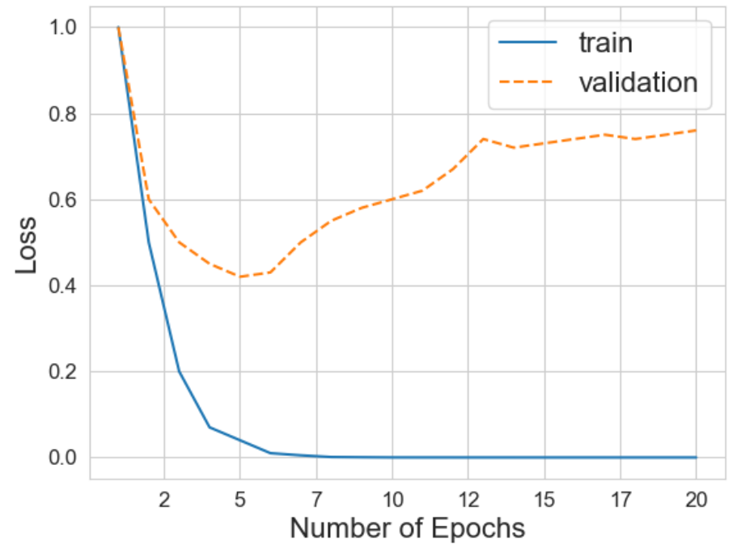

# Problem Set 8 Solutions

## Problem 1: Irreducible Error

**1 points One Answer**

**Question:** Which of the following is the cause/reason for irreducible error?

**Options:**
a) Stochastic label noise
b) Very few data points
c) Nonlinear relationships in the data
d) Insufficient model complexity

**Correct answers:** (a)

**Explanation:** A is correct. Stochastic label noise is what drives irreducible error. See lecture 4 slides. In essence, irreducible error comes from randomness that cannot be modeled since there is no deeper pattern to it. B and D are wrong because fewer data points and insufficient model complexity are responsible for reducible error. C is wrong because nonlinear relationships in the data don't have anything to do with irreducible error.

## Problem 2: Bias-Variance Analysis

**1 points One Answer**

**Scenario:** Saket unfortunately did not learn from the midterm and still has not attended lecture. He is now given the task of training 3 neural networks with increasing complexity on a regression task:

* Model A: 1 hidden layer with 10 neurons.
* Model B: 2 hidden layers with 50 neurons each.
* Model C: 10 hidden layers with 100 neurons each.

After training and evaluating these models on an appropriately split dataset with train and test splits, you find the following MSEs:

* Model A: train MSE = 2.5, test MSE = 2.6
* Model B: train MSE = 0.1, test MSE = 0.2
* Model C: train MSE = 0.01, test MSE = 1.3

Saket only knows about bias and variance, So based on the model architectures and train/test MSE losses, chose the best relative bias/variance estimates for each of the models.

**Bias/Variance Estimates:**

| Model | Bias      | Variance  |
|-------|-----------|-----------|
|       | Low | High | Low | High |
| A     | $\bigcirc$ | $\text{\textcircled{O}}$ | $\text{\textcircled{O}}$ | $\bigcirc$ |
| B     | $\text{\textcircled{O}}$ | $\bigcirc$ | $\text{\textcircled{O}}$ | $\bigcirc$ |
| C     | $\text{\textcircled{O}}$ | $\bigcirc$ | $\bigcirc$ | $\text{\textcircled{O}}$ |

**Explanation:** Correct answer: A => high bias, low variance; B => low bias, low variance; C => low bias, high variance

Due to the simpler architecture and high MSEs, A likely underfits. B achieves low but similar train/test MSEs so probably has a good balance. C has a low train MSE but a high test MSE so is probably overfitting, which matches the likely overcomplex architecture.

## Problem 3: K-Fold Cross Validation

**2 points**

**Question:** Explain one upside and one downside of using a high K in K-fold cross validation.

**Upside:**

You get a more accurate estimate of your test error, possibly making hyperparameter selection more accurate.

**Downside:**

A higher K means more folds and therefore much more compute/time needed to find the right hyperparameters. A higher K also means each validation set has fewer data points. This will result in higher variability in the results across different folds.

**Explanation:** Possible answer: Upside - You get a more accurate estimate of your test error, possibly making hyperparameter selection more accurate. Downside - A higher K means more folds and therefore much more compute/time needed to find the right hyperparameters. A higher K also means each validation set has fewer data points. This will result in higher variability in the results across different folds.

## Problem 4: Training and Validation Loss

**1 points Select All That Apply**

**Question:** You are training a model and get the following plot for your training and validation loss.

**Plot Description:**
A line plot titled "Training and Validation Loss" shows two curves over "Number of Epochs" (x-axis) versus "Loss" (y-axis). The x-axis ranges from 2 to 20, with major ticks at 2, 5, 7, 10, 12, 15, 17, and 20. The y-axis ranges from 0.0 to 1.0, with major ticks at 0.0, 0.2, 0.4, 0.6, 0.8, and 1.0.

**Legend:**
- "train" is represented by a solid blue line.
- "validation" is represented by a dashed orange line.

**Train Loss Curve (solid blue):** Starts at a loss of 1.0 at epoch 2, rapidly decreases to near 0.0 by epoch 7, and remains very close to 0.0 for the rest of the epochs up to 20.

**Validation Loss Curve (dashed orange):** Starts at a loss of 1.0 at epoch 2, decreases to approximately 0.4 at epoch 7, then begins to increase, reaching about 0.7 by epoch 12, and subsequently plateaus around 0.7 to 0.75 until epoch 20.

**Sub-question:** Which of the following statements are true?

**Options:**
a) $\bigcirc$ The model has high bias and low variance.
b) $\bigcirc$ The large gap between training and validation loss indicates underfitting.
c) $\bigcirc$ Training for more epochs will eventually decrease validation loss.
d) $\text{\textcircled{O}}$ The model might be too complex for the dataset.
e) $\text{\textcircled{O}}$ The model is likely memorizing the training data.

**Correct answers:** (d), (e)

**Explanation:** This is a classic example of overfitting, which is caused when we have too complex of a model and it ends up memorizing the training set. Overfitting means the model has low bias and high variance. Thus, the only correct options are D and E.

## Problem 5: Maximum Likelihood Estimation

**1 points Select All That Apply**

**Question:** Which of the following models that we studied in class use maximum likelihood estimation?

**Options:**
a) $\text{\textcircled{O}}$ Linear regression with Gaussian noise model
b) $\bigcirc$ Principal Components Analysis
c) $\text{\textcircled{O}}$ Gaussian Mixture Models
d) $\text{\textcircled{O}}$ Neural Network trained to do classification with softmax cross entropy loss

**Correct answers:** (a), (c), (d)

**Explanation:** a) True: is true because you maximize the likelihood of the data under a linear model which assumes Gaussian noise. c) True: GMMs use MLE to estimate the parameters of the mixture components. d) True: Neural networks with softmax cross entropy loss are trained to maximize the likelihood of the data under the model. b) False: PCA is not a probabilistic model and does not use MLE.
