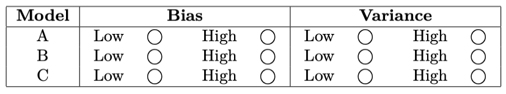
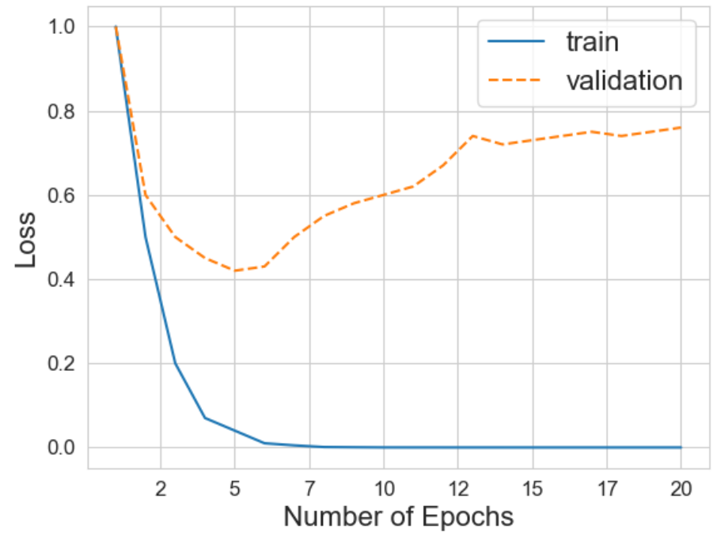

# Problem Set 8 Solutions

## Problem 1: Irreducible Error

**Question:** Which of the following is the cause/reason for irreducible error?

**Options:**

a) Stochastic label noise

b) Very few data points

c) Nonlinear relationships in the data

d) Insufficient model complexity

**Correct Answer:** (a)

**Explanation:** A is correct. Stochastic label noise is what drives irreducible error. See lecture 4 slides. In essence, irreducible error comes from randomness that cannot be modeled since there is no deeper pattern to it. B and D are wrong because fewer data points and insufficient model complexity are responsible for reducible error. C is wrong because nonlinear relationships in the data don't have anything to do with irreducible error.

## Problem 2: Neural Network Bias and Variance

**Problem:** Saket unfortunately did not learn from the midterm and still has not attended lecture. He is now given the task of training 3 neural networks with increasing complexity on a regression task:

- Model A: 1 hidden layer with 10 neurons.
- Model B: 2 hidden layers with 50 neurons each.
- Model C: 10 hidden layers with 100 neurons each.

After training and evaluating these models on an appropriately split dataset with train and test splits, you find the following MSEs:

- Model A: train MSE = 2.5, test MSE = 2.6
- Model B: train MSE = 0.1, test MSE = 0.2
- Model C: train MSE = 0.01, test MSE = 1.3

Saket only knows about bias and variance, so based on the model architectures and train/test MSE losses, choose the best relative bias/variance estimates for each of the models.

**Correct Answer:** 
- Model A: High bias, Low variance
- Model B: Low bias, Low variance  
- Model C: Low bias, High variance

**Explanation:** Due to the simpler architecture and high MSEs, A likely underfits. B achieves low but similar train/test MSEs so probably has a good balance. C has a low train MSE but a high test MSE so is probably overfitting, which matches the likely overcomplex architecture.

## Problem 3: K-fold Cross-validation

**Question:** Explain one upside and one downside of using a high K in K-fold cross validation.

**Upside:** You get a more accurate estimate of your test error, possibly making hyperparameter selection more accurate.

**Downside:** A higher K means more folds and therefore much more compute/time needed to find the right hyperparameters. A higher K also means each validation set has fewer data points. This will result in higher variability in the results across different folds.

## Problem 4: Training and Validation Loss Analysis

**Question:** You are training a model and get the following plot for your training and validation loss.

**Plot Description:** A line plot titled "Loss" with "Number of Epochs" on the x-axis (ranging from 2 to 20) and "Loss" on the y-axis (ranging from 0.0 to 1.0). There are two lines:
- **train (solid blue line):** Starts at a loss of 1.0 at epoch 2, rapidly decreases to near 0.0 by epoch 7, and remains very low (close to 0.0) up to epoch 20.
- **validation (dashed orange line):** Starts at a loss of 1.0 at epoch 2, decreases to a minimum loss of approximately 0.4 at epoch 7, and then steadily increases to about 0.75 by epoch 20.

**Question:** Which of the following statements are true?

**Options:**

a) The model has high bias and low variance.

b) The large gap between training and validation loss indicates underfitting.

c) Training for more epochs will eventually decrease validation loss.

d) The model might be too complex for the dataset.

e) The model is likely memorizing the training data.

**Correct Answers:** (d), (e)

**Explanation:** This is a classic example of overfitting, which is caused when we have too complex of a model and it ends up memorizing the training set. Overfitting means the model has low bias and high variance. Thus, the only correct options are D and E.

## Problem 5: Maximum Likelihood Estimation

**Question:** Which of the following models that we studied in class use maximum likelihood estimation?

**Options:**

a) Linear regression with Gaussian noise model

b) Principal Components Analysis

c) Gaussian Mixture Models

d) Neural Network trained to do classification with softmax cross entropy loss

**Correct Answers:** (a), (c), (d)

**Explanation:** 
a) True: Linear regression with Gaussian noise model is true because you maximize the likelihood of the data under a linear model which assumes a gaussian distribution on errors
b) False: PCA does not use MLE because it does not define a probabilistic distribution for the data, it just uses linear algebra to find vectors that explain a lot of variance in the data
c) True: Gaussian Mixture Models define a probability distribution that is a mixture of Gaussians and then find the parameters by maximizing likelihood under that model
d) True: NNs with softmax define a probability distribution over the classification labels and try to maximize it with cross entropy

## Problem 6: Maximum Likelihood Estimation for Coin Flips

**Question:** Yann, a strict frequentist statistician, observes 5 flips of a possibly uneven coin. Here are the outcomes:
1. Heads
2. Tails
3. Heads
4. Heads
5. Tails

Based on these observations, Yann uses maximum likelihood estimation to determine the most likely outcome of the next coin toss. What does he predict will happen?

**Options:**

a) Heads

b) Tails

c) Both are equally likely

d) It hits Marco in the head

**Correct Answer:** (a)

**Explanation:** There were 3 Heads and 2 Tails. Based on these observations, the estimated probability of Heads is $\frac{3}{5} = 0.6$, which is greater than the estimated probability of Tails ($\frac{2}{5} = 0.4$). Therefore, Heads is the most likely outcome.

## Problem 7: Convex Functions and Optimization

**Problem:** Let $f: \mathbb{R}^d \to \mathbb{R}$ be differentiable everywhere, such that $f(y) \ge f(x) + \nabla f(x)^T (y-x)$ for all $x, y \in \mathbb{R}^d$. Suppose there exists a unique $x_* \in \mathbb{R}^d$ such that $\nabla_x f(x_*) = 0$.

**Part (a):** $x_*$ is a:

a) Minimizer of $f$

b) Maximizer of $f$

c) Saddle point of $f$

d) Not enough information to determine any of the above

**Part (b):** Suppose we are unable to solve for $x_*$ in closed-form. Briefly outline a procedure for finding $x_*$.

**Correct Answer:** (a)

**Explanation:** 
- Part (a): $f$ is convex, so $x_*$ must be a minimizer of $f$.
- Part (b): Gradient descent

## Problem 8: Gradient Descent Convergence

**Question:** Which of the following is true, given the optimal learning rate?

**Clarification:** All options refer to convex loss functions that have a minimum bound / have a minimum value.

**Options:**

a) For convex loss functions, stochastic gradient descent is guaranteed to eventually converge to the global optimum while gradient descent is not.

b) For convex loss functions, both stochastic gradient descent and gradient descent will eventually converge to the global optimum.

c) Stochastic gradient descent is always guaranteed to converge to the global optimum of a loss function.

d) For convex loss functions, gradient descent with the optimal learning rate is guaranteed to eventually converge to the global optimum point while stochastic gradient descent is not.

**Correct Answer:** (d)

**Explanation:** Due to the noisy updates of SGD, it is not guaranteed to converge at the minimum but for instance, cycle close to it whereas batch gradient descent alleviates this and is guaranteed to reach the minimum given appropriate step size.

## Problem 11: Neural Network Training

**Question:** You are training a neural network for a classification task. You notice that your training loss is decreasing but your validation loss is increasing. What is happening?

**Options:**

a) The model is underfitting

b) The model is overfitting

c) The learning rate is too high

d) The model has converged

**Correct Answer:** (b)

**Explanation:** When training loss decreases while validation loss increases, this is a classic sign of overfitting. The model is learning the training data too well (memorizing it) but failing to generalize to unseen data.

## Problem 12: Model Selection

**Question:** You have a dataset with 1000 samples and want to perform model selection. You have the following options:

**Options:**

a) Use all data for training and validation

b) Split data 80/20 for training/validation

c) Use 5-fold cross-validation

d) Use 10-fold cross-validation

**Correct Answer:** (c)

**Explanation:** With 1000 samples, 5-fold cross-validation provides a good balance between having enough data in each fold for reliable estimates while maintaining reasonable computational cost. 10-fold would give smaller validation sets, and using all data for both training and validation would lead to overfitting.

## Problem 21: Model Selection Matching

**Question:** Match each of the modeling problems (which include a description of the data and desired criteria for the model) with the best machine learning method for the job. Use each model type once.

**Modeling Problems:**

**Problem A:** You are training a model for a medical setting where you have a small number of categorical input features, and the ability to be able to interpret your model's decisions is important.

**Problem B:** You have a small dataset (small $n$), continuous $Y$ labels, but many features. You want an interpretable model that you can regularize to give you information about which features are more important.

**Problem C:** You have a large dataset (large $n$) of images.

**Problem D:** You have a lot of data (large $n$) in a small dimensional feature space (small $d$), and you assume that your labels $y$ change smoothly with changes in the feature space.

**Problem E:** Your data has a relatively small number of categorical features and you want to win a Kaggle competition.

**Machine Learning Methods:**
- k-Nearest Neighbours (kNN)
- Decision Tree (DT)
- Random Forest (RF)
- Convolutional Neural Network (CNN)
- Linear Regression (LR)

**Correct Answers:**
- Problem A: Decision Tree (DT)
- Problem B: Linear Regression (LR)
- Problem C: Convolutional Neural Network (CNN)
- Problem D: k-Nearest Neighbours (kNN)
- Problem E: Random Forest (RF)

**Explanation:**
- Problem A is decision tree because they're good for categorical features and interpretable.
- Problem B is linear regression because it works for small datasets and continuous labels.
- Problem C is convolutional neural networks.
- Problem D is kNN.
- Problem E is Random Forests.

## Problem 22: Entropy Calculation

**Question:** You are training a decision tree to perform classification of into labels $Y \in \{0,1\}$. Your tree sorts the labels into the following leaves. What is the entropy $H(X)$ for each of the following sets $X$:

**Sub-questions:**

a) $X = 1, 1, 1, 1:$

b) $X = 1, 1, 0, 0:$

c) $X = 0, 0, 0, 0:$

**Correct Answers:**

a) 0.0, ($H = -1 \cdot \log(1) = 0$)

b) 1.0, ($H = [0.5 \log(0.5) + 0.5 \log(0.5)] = [2 \cdot 0.5 \log(0.5)] = 1$)

c) 0.0, ($H = -1 \cdot \log(1) = 0$)

**Explanation:** The formula for entropy is given as $H(X) = -\sum_i p(i) \cdot \log p(i)$.

## Problem 23: Kernel Method

**Question:** You are applying the kernel method to $n$ data points, where each data point $x_i \in \mathbb{R}^d$. Which of the following statements are true.

**Options:**

a) The kernel method performs computations on a high dimensional feature space $\phi(x_i) \in \mathbb{R}^p$, where $p >> d$.

b) A function $K$ is a kernel for a feature map $\phi$ if $K(x, x') = \phi(x)^T \phi(x')$.

c) The kernel trick relies on the fact if $p >> n$, then the data spans at most a $d$-dimensional subspace of $\mathbb{R}^p$.

d) Kernel methods can be considered non-parametric because they require retaining the training data for making predictions about new points.

**Correct Answers:** (b), (d)

**Explanation:**

a) is not correct because it avoids actually performing computations in the p-dimensional feature space.

b) is correct, as it is the definition of a kernel.

c) is incorrect, it should be an $n$-dimensional subspace.

d) is correct.

## Problem 24: Kernel Matrix

**Question:** Consider data matrix $X \in \mathbb{R}^{n \times d}$ and feature mapping $\phi : \mathbb{R}^d \rightarrow \mathbb{R}^p$, for some $p$. Let $K$ be the corresponding kernel matrix.

**Part (a):** Let $\phi(X)$ denote $X$ with $\phi$ applied to each data point. Write $K$ in terms of $\phi(X)$.

**Answer:** $K = \phi(X)\phi(X)^T$

**Part (b):** The $i^{th}$ entry on the diagonal of $K$ is:

**Options:**

a) $|| \phi(x_i) ||_1$

b) $|| \phi(x_i) ||_2$

c) $|| \phi(x_i) ||_2^2$

d) None of the above

**Correct Answer:** (c)

**Explanation:**

part (a): $K = \phi(X)\phi(X)^T$.

part (b): $K_{ii} = \phi(x_i)^T\phi(x_i) = ||\phi(x_i)||_2^2$

## Problem 25: Curse of Dimensionality

**Question:** Natasha is trying to train a k-Nearest Neighbors model, and she encounters the "curse of dimensionality". This refers to the fact that as the dimensionality of her feature space $d$ increases...

**Options:**

a) Distances between points become less meaningful, since all points are far apart.

b) She has too much data making computation too expensive to perform on a single machine.

c) The amount of data required to cover the space increases exponentially.

d) Thinking in more than three dimensions is hard so we should use PCA to make a 2D plot.

**Correct Answers:** (a), (c)

**Explanation:** a-c are all correct statements of the same idea. d is a joke

## Problem 26: Clustering Algorithms

**Question:** You want to cluster this data into 2 clusters. Which of the these algorithms would work well?

**Options:**

a) Spectral clustering

b) K-means

c) GMM clustering

**Correct Answer:** (c)

**Explanation:** Only GMM takes the Gaussian distributions of the two clusters into account even when they overlap

## Problem 27: K-means Clustering

**Question:** Which of the following statements is true about K-means clustering?

**Options:**

a) K-means clustering works effectively in all data distributions.

b) K-means is guaranteed to converge.

c) K-means clustering is a supervised learning algorithm.

d) The accuracy of K-means clustering is not affected by the initial centroid selections.

**Correct Answer:** (b)

**Explanation:** A is false since K-means doesn't work well in all distributions, such as non-spherical clusters. B is true, since K-means will always converge (see lecture notes for proof). C is false, since K-means is unsupervised. D is false, since the accuracy of the classifier is influenced by the initial centroid selections.

## Problem 28: Gaussian Mixture Model Parameters

**Question:** Suppose a Gaussian Mixture Model (GMM) with $k$ components/clusters is used to model a dataset of dimensionality $d$. Which value does the total number of parameters in the GMM primarily scale with respect to?

**Options:**

a) $O(k \cdot d)$

b) $O(k \cdot d^2)$

c) $O(d)$

d) $O(d^2)$

e) $O(k)$

f) $O(n)$

g) $O(\frac{d}{n})$

**Correct Answer:** (b)

**Explanation:** The parameters of a GMM are the mixture weights, the means, and the covariance matrices. There are $k$ mixing weights, each $\in \mathbb{R}$. There are $k$ means, each $\in \mathbb{R}^d$. There are $k$ covariance matrices, each $\in \mathbb{R}^{d \times d}$. Since the covariance matrices have the most parameters, the $k$ covariance matrices are the 'determining factor'. So the answer is $O(k \cdot d^2)$

## Problem 29: Bootstrap Sampling

**Question:** Because bootstrap sampling randomly draws data points with replacement, the size of the original dataset does not affect accuracy of the estimated statistics produced by bootstrapping.

**Options:**

a) True

b) False

**Correct Answer:** (b)

**Explanation:** Smaller datasets will not be as representative of the true dataset, yielding less accurate statistics.

## Problem 30: Addressing Bias in Loan Approval Model

**Question:** Suppose you are working with a dataset that includes demographic information (e.g., age, gender, race) to predict loan approval. You notice that your model not only performs significantly worse on some groups, but it is more likely to reject underrepresented minorities for a loan. Which of the following is the best way to address this bias? Choose the best answer.

**Options:**

a) Remove the demographic information altogether, forcing the model to not rely on demographic information.

b) Over-sample underrepresented groups to balance the dataset and reduce bias.

c) Include fairness constraints such as ensuring that the type II error (probability of rejecting someone for a loan when they deserved it) is balanced across groups.

d) Collect more historical data about loan approvals for underrepresented groups and re-train your model.

**Correct Answer:** (c)

**Explanation:**

a) Demographic info is often highly correlated with other features so removing them wouldn't entirely help.

b) Balancing data can help but doesn't help with the underlying issue of biases.

c) This is the current state-of-the-art approach.

d) this doesn't necessarily work because the historical data is still biased.

## Problem 31: Interpreting Linear Regression Weights

**Question:** I've trained a linear regression model on my dataset and learned weights $w_i$ for each of my $d$ features. I notice that $w_i > w_j$, so I can conclude feature $i$ is more important than feature $j$.

**Options:**

a) True

b) False

**Correct Answer:** (b)

**Explanation:** no, the features could have different scales, such as square feet vs. number of bathrooms.

## Problem 32: Neural Network Derivatives

**Question:** The forward pass for the hidden layer is $z = \sigma(W^{(0)}x + b^0)$, where $\sigma$ refers to the sigmoid activation function. The output layer is $y = W^{(1)}z + b^1$. Derive the partial derivatives with respect to $W^{(1)} \in \mathbb{R}^{1 \times h}$, $b^{(1)} \in \mathbb{R}$, $W^{(0)} \in \mathbb{R}^{h \times d}$, and $b^{(0)} \in \mathbb{R}^h$, where $d = 3$ and $h = 4$.

**Clarification:** Typo: $b^0 = b_0 = b^{(0)}$. They all refer to the same thing.

**Questions:**

a) $\frac{\partial y}{\partial W^{(1)}}:$

b) $\frac{\partial y}{\partial b^{(1)}}:$

c) $\frac{\partial y}{\partial W^{(0)}}:$

d) $\frac{\partial y}{\partial b^{(0)}}:$

**Solutions:**

a) $\frac{\partial y}{\partial W^{(1)}} = z$

b) $\frac{\partial y}{\partial b^{(1)}} = 1$

c) $\frac{\partial y}{\partial W^{(0)}} = [W^{(1)}]^T \odot z \odot (1-z) \cdot x^T$

d) $\frac{\partial y}{\partial b^{(0)}} = W^{(1)} \odot z \odot (1-z)$

**Explanation for c):** This problem is very similar to the question from section 8. First, to make the math simpler, we can compute $\frac{\partial y}{\partial W_i^{(0)}}$, where $W_i^{(0)}$ is the i-th of $W^{(0)}$. Computing the derivatives w.r.t. to $W^{(0)}$ necessitates chain rule; we can rewrite it as $\frac{\partial y}{\partial W_i^{(0)}} = \frac{\partial y}{\partial z_i} * \frac{\partial z_i}{\partial W_i^{(0)}}$. From here, the derivative of $z_i$ w.r.t. $W_i^{(0)}$ can be computed using the derivative of the sigmoid function ($\sigma * (1-\sigma)$). Doing so, we get $z_i * (1 -z_i) *x^T$, where the $x^T$ comes from applying chain rule. Putting everything together, we get $\frac{\partial y}{\partial W_i^{(0)}} = W_i^{(1)} * z_i * (1-z_i) * x^T$. Note that this is a column vector, with the derivatives for a single row. To generalize this and get the derivative of $y$ w.r.t. to the entirety of $W^{(1)}$, we repeat the same process for all rows of $W^{(1)}$, which we can denote using the elementwise operator. Thus, we get $[W^{(1)}]^T \odot z \odot (1 - z)] * x^T$. Note we need to transpose $W^{(1)}$ in order multiply it elementwise with $z \odot (1 - z)$.

**Explanation for d):** This derivation is very similar to the one above, except we don't have $x^T$ since only the weights matrix is multiplied with the data vector. So we get: $\frac{\partial y}{\partial b_i^{(0)}} = W_i^{(1)} * \frac{\partial z_i}{\partial b_i^{(0)}} = W_i^{(1)} * z_i * (1-z_i) \rightarrow W^{(1)} \odot z \odot (1-z)$.

## Problem 33: Electric Car Adoption Prediction

**Question:** Transitioning to electric cars can help fight climate change, but electric cars cause such a strain on the electrical grid that if several people on the same block all buy an electric car within a few weeks or months of each other, it can actually cause the grid to go down!

You've been hired by the electric company to build a cool new machine learning model to help predict which houses will start charging electric cars next.

You've been handed several messy files of data. The first contains high-level information about $n$ different houses, including whether they have an electric vehicle or not, each house's location, square footage, value, household income, results of the last election in the house's zipcode, public school ratings in the zip code, etc. But, you can also get detailed electricity data for each house, including daily electricity consumption going back at least 3 years.

**Part (a) (2 points):** Describe the feature engineering or data preprocessing steps you would take to prepare to use this data to train a machine learning model:

**Part (b) (2 points):** Now, you must use the data you prepared to train a machine learning model that can tell you which houses are likely to get an electric car in the next year. Please describe the machine learning model you will use for this problem. You will be graded on how well you can justify why your model is a good choice for this problem, by explaining how the properties of your model suit the problem.

**Grading Criteria:**
The criteria for grading this are do they find ways to mention real things about machine learning models they learned in class. Like 'I will use a random forest because it's good for categorical data but has lower variance than a tree'.

Valid explanations include: Feature engineering steps. Find some way to reduce the daily electricity data into something more manageable. Could use something like PCA, or manually extract features.

Can mention separating into train, validation, and test.

**Model Considerations:**

**General Advice:** Could mention normalizing the features to be on the same scale.

**Bonus Points:** Give mega bonus points if they mention propagating features about the neighbors' recent adoption of electric cars into the feature space for a house.

**Neural network:** don't need to do much feature engineering, throw the daily electricity data for each house into the features for each house, end up with a huge $d$, run gradient descent, see if it works

**Trees:** Good for categorical data like political affiliations, public school ratings. Use a random forest to reduce variance. Doesn't work with a ton of features (high $d$, so should only be used in conjunction with feature engineering.

**Logistic regression:** They might mention this is a classification problem so they want to use this. Maybe they mention it's more interpretable, so the power grid company can inspect the results.

**kNN:** If they reduce the feature space small enough this could be a good pick. They could say it's best to figure out who will adopt a car based on whether other similar people adopted a car. Maybe in terms of literal distance. But this is not a good answer if they use all the daily electricity data, because then the feature space would be too large.

**CNN:** Not a great answer because no images.

## Problem 34: Convexity of Max Function

**Bonus Question:** 4 points

This is a bonus question. You can get extra points for completing it, but you will not lose points if you do not get the right answer.

**Question:** Let $f,g: \mathbb{R}^d \to \mathbb{R}$ be convex. Use the epigraph definition of convexity to prove that $h(x) = \max\{f(x), g(x)\}$ is convex.

**Hint 1:** You may use that for any convex sets $A, B \subset \mathbb{R}^d$, $A \cap B$ is convex.

**Hint 2:** You may use that for any $a, b, c \in \mathbb{R}$, $c \ge a \land c \ge b$ if and only if $c \ge \max\{a,b\}$.

**Explanation: Proof.**
Denote $\text{epi}(f) := \{(x,t) \in \mathbb{R}^{d+1} : t \ge f(x)\}$, with $\text{epi}(g)$, $\text{epi}(h)$ defined similarly. By the epigraph definition of convexity, we know that the sets $\text{epi}(f)$ and $\text{epi}(g)$ are convex. Note that for any $(x, t) \in \mathbb{R}^{d+1}$ we have by hint 2 that $t \ge f(x)$ and $t \ge g(x)$ if and only if $t \ge \max\{f(x), g(x)\} = h(x)$. Thus we have that $(x,t) \in \text{epi}(f) \cap \text{epi}(g)$ if and only if $(x,t) \in \text{epi}(h)$. It follows that $\text{epi}(h) = \text{epi}(f) \cap \text{epi}(g)$. Since $\text{epi}(f)$ and $\text{epi}(g)$ are convex, by hint 1, $\text{epi}(h)$ must be convex. So by the epigraph definition of convexity, $h$ is convex.
$\square$

