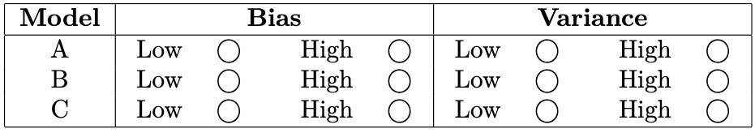

# Problem Set 8 Solutions

## Problem 1: Irreducible Error

**1 points One Answer**

**Question:** Which of the following is the cause/reason for irreducible error?

**Options:**
a) Stochastic label noise
b) Very few data points
c) Nonlinear relationships in the data
d) Insufficient model complexity

**Correct answers:** (a)

**Explanation:** A is correct. Stochastic label noise is what drives irreducible error. See lecture 4 slides. In essence, irreducible error comes from randomness that cannot be modeled since there is no deeper pattern to it. B and D are wrong because fewer data points and insufficient model complexity are responsible for reducible error. C is wrong because nonlinear relationships in the data don't have anything to do with irreducible error.

## Problem 2: Bias-Variance Analysis

**1 points One Answer**

**Scenario:** Saket unfortunately did not learn from the midterm and still has not attended lecture. He is now given the task of training 3 neural networks with increasing complexity on a regression task:

* Model A: 1 hidden layer with 10 neurons.
* Model B: 2 hidden layers with 50 neurons each.
* Model C: 10 hidden layers with 100 neurons each.

After training and evaluating these models on an appropriately split dataset with train and test splits, you find the following MSEs:

* Model A: train MSE = 2.5, test MSE = 2.6
* Model B: train MSE = 0.1, test MSE = 0.2
* Model C: train MSE = 0.01, test MSE = 1.3

Saket only knows about bias and variance, So based on the model architectures and train/test MSE losses, chose the best relative bias/variance estimates for each of the models.

**Bias/Variance Estimates:**

| Model | Bias      | Variance  |
|-------|-----------|-----------|
|       | Low | High | Low | High |
| A     | $\bigcirc$ | $\text{\textcircled{O}}$ | $\text{\textcircled{O}}$ | $\bigcirc$ |
| B     | $\text{\textcircled{O}}$ | $\bigcirc$ | $\text{\textcircled{O}}$ | $\bigcirc$ |
| C     | $\text{\textcircled{O}}$ | $\bigcirc$ | $\bigcirc$ | $\text{\textcircled{O}}$ |

**Explanation:** Correct answer: A => high bias, low variance; B => low bias, low variance; C => low bias, high variance

Due to the simpler architecture and high MSEs, A likely underfits. B achieves low but similar train/test MSEs so probably has a good balance. C has a low train MSE but a high test MSE so is probably overfitting, which matches the likely overcomplex architecture.
