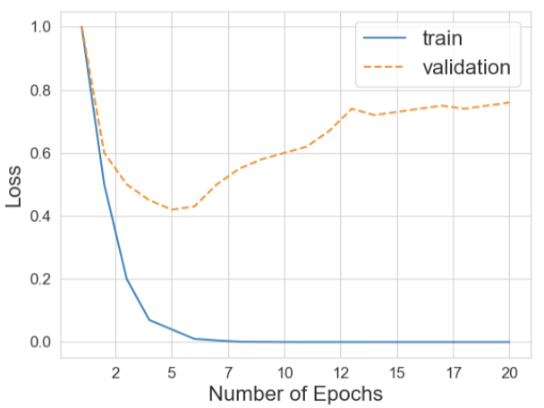

# Problem Set 8 Solutions

## Problem 1: Irreducible Error

**1 points One Answer**

**Question:** Which of the following is the cause/reason for irreducible error?

**Options:**
- a) Stochastic label noise
- b) Very few data points
- c) Nonlinear relationships in the data
- d) Insufficient model complexity

**Correct answers:** (a)

**Explanation:** 
- **A is correct.** Stochastic label noise is what drives irreducible error. See lecture 4 slides. 
- In essence, irreducible error comes from randomness that cannot be modeled since there is no deeper pattern to it. 
- **B and D are wrong** because fewer data points and insufficient model complexity are responsible for reducible error. 
- **C is wrong** because nonlinear relationships in the data don't have anything to do with irreducible error.

## Detailed Solution Explanation

**Understanding Irreducible Error:**

Irreducible error represents the fundamental uncertainty in the data that cannot be eliminated by any model, no matter how sophisticated. It's the "noise" in the system that makes perfect prediction impossible.

**Mathematical Framework:**
In the standard regression setting, we model the relationship as:
$$y = f(x) + \epsilon$$
where:
- $f(x)$ is the true underlying function
- $\epsilon$ is the irreducible error (noise)

The irreducible error $\epsilon$ is typically assumed to follow a distribution (often Gaussian) with mean 0 and some variance $\sigma^2$:
$$\epsilon \sim \mathcal{N}(0, \sigma^2)$$

**Why Stochastic Label Noise Causes Irreducible Error:**
- **Stochastic** means random and unpredictable
- **Label noise** refers to errors in the target variable $y$
- This noise cannot be learned or predicted from the features $x$
- Even with perfect knowledge of $f(x)$, we cannot predict $\epsilon$

**Examples of Irreducible Error:**
- Measurement errors in data collection
- Random fluctuations in biological systems
- Unpredictable external factors affecting outcomes
- Human error in labeling data

**Why Other Options Are Incorrect:**
- **Option B (Very few data points):** This causes high variance (reducible error) because the model cannot learn the true pattern effectively
- **Option C (Nonlinear relationships):** This can be modeled with appropriate algorithms (e.g., neural networks, kernel methods)
- **Option D (Insufficient model complexity):** This causes high bias (reducible error) because the model is too simple to capture the true relationship

## Problem 2: Bias-Variance Analysis

**1 points One Answer**

**Scenario:** Saket unfortunately did not learn from the midterm and still has not attended lecture. He is now given the task of training 3 neural networks with increasing complexity on a regression task:

* Model A: 1 hidden layer with 10 neurons.
* Model B: 2 hidden layers with 50 neurons each.
* Model C: 10 hidden layers with 100 neurons each.

After training and evaluating these models on an appropriately split dataset with train and test splits, you find the following MSEs:

* Model A: train MSE = 2.5, test MSE = 2.6
* Model B: train MSE = 0.1, test MSE = 0.2
* Model C: train MSE = 0.01, test MSE = 1.3

Saket only knows about bias and variance, So based on the model architectures and train/test MSE losses, chose the best relative bias/variance estimates for each of the models.


**Bias/Variance Estimates:**

| Model | Bias      | Variance  |
|-------|-----------|-----------|
|       | Low | High | Low | High |
| A     | $\bigcirc$ | $\text{\textcircled{O}}$ | $\text{\textcircled{O}}$ | $\bigcirc$ |
| B     | $\text{\textcircled{O}}$ | $\bigcirc$ | $\text{\textcircled{O}}$ | $\bigcirc$ |
| C     | $\text{\textcircled{O}}$ | $\bigcirc$ | $\bigcirc$ | $\text{\textcircled{O}}$ |

**Explanation:** 
**Correct answer:** 
- A → high bias, low variance
- B → low bias, low variance  
- C → low bias, high variance

**Reasoning:**
- **Model A:** Due to the simpler architecture and high MSEs, A likely underfits.
- **Model B:** Achieves low but similar train/test MSEs so probably has a good balance.
- **Model C:** Has a low train MSE but a high test MSE so is probably overfitting, which matches the likely overcomplex architecture.

## Detailed Solution Explanation

**Understanding Bias-Variance Tradeoff:**

The bias-variance tradeoff is a fundamental concept in machine learning that describes the relationship between model complexity and generalization error.

**Mathematical Framework:**
The expected prediction error can be decomposed as:
$$\text{Expected Error} = \text{Bias}^2 + \text{Variance} + \text{Irreducible Error}$$

where:
- **Bias:** How far off the model's predictions are on average from the true values
- **Variance:** How much the model's predictions vary for different training sets
- **Irreducible Error:** The fundamental noise in the data

**Analyzing Each Model:**

**Model A (1 hidden layer, 10 neurons):**
- **Architecture:** Simple model with limited capacity
- **Performance:** High train MSE (2.5) and test MSE (2.6)
- **Analysis:** The model cannot capture the underlying pattern in the data
- **Bias:** High (model is too simple to learn the true relationship)
- **Variance:** Low (simple models are stable across different training sets)

**Model B (2 hidden layers, 50 neurons each):**
- **Architecture:** Moderate complexity
- **Performance:** Low train MSE (0.1) and test MSE (0.2)
- **Analysis:** The model captures the pattern well without overfitting
- **Bias:** Low (model can learn the true relationship)
- **Variance:** Low (good generalization, small gap between train and test)

**Model C (10 hidden layers, 100 neurons each):**
- **Architecture:** Very complex model with high capacity
- **Performance:** Very low train MSE (0.01) but high test MSE (1.3)
- **Analysis:** The model memorizes the training data but doesn't generalize
- **Bias:** Low (model can fit the training data perfectly)
- **Variance:** High (model is sensitive to training data, poor generalization)

**Key Insights:**
- **Underfitting:** High bias, low variance (Model A)
- **Good Fit:** Low bias, low variance (Model B) 
- **Overfitting:** Low bias, high variance (Model C)

**Visual Interpretation:**
- **High Bias:** Model predictions are systematically off-target
- **High Variance:** Model predictions are scattered around the target
- **Optimal:** Model predictions cluster tightly around the target

## Problem 3: K-Fold Cross Validation

**2 points**

**Question:** Explain one upside and one downside of using a high K in K-fold cross validation.



**Upside:**

You get a more accurate estimate of your test error, possibly making hyperparameter selection more accurate.

**Downside:**

A higher K means more folds and therefore much more compute/time needed to find the right hyperparameters. A higher K also means each validation set has fewer data points. This will result in higher variability in the results across different folds.

**Explanation:** 
**Possible answer:**

**Upside:** You get a more accurate estimate of your test error, possibly making hyperparameter selection more accurate.

**Downside:** A higher K means more folds and therefore much more compute/time needed to find the right hyperparameters. A higher K also means each validation set has fewer data points. This will result in higher variability in the results across different folds.

## Detailed Solution Explanation

**Understanding K-Fold Cross Validation:**

K-fold cross validation is a resampling technique used to assess how well a model will generalize to new, unseen data.

**Mathematical Framework:**
For a dataset with $n$ samples, K-fold CV:
- Divides data into $K$ equal-sized folds
- Each fold has approximately $\frac{n}{K}$ samples
- Trains on $K-1$ folds, validates on 1 fold
- Repeats $K$ times, using each fold as validation once

**Expected Test Error Estimate:**
$$\text{CV Error} = \frac{1}{K} \sum_{k=1}^{K} \text{Error}_k$$
where $\text{Error}_k$ is the error on the $k$-th validation fold.

**Upside of High K (e.g., K = 10 or leave-one-out):**

1. **More Accurate Error Estimation:**
   - Higher K means more validation sets
   - Reduces bias in error estimation
   - Better approximation of true generalization error

2. **Better Hyperparameter Selection:**
   - More reliable comparison between different hyperparameter settings
   - Reduces risk of selecting suboptimal hyperparameters due to lucky/unlucky data splits

3. **Statistical Efficiency:**
   - Uses more data for training (each training set has $\frac{K-1}{K} \cdot n$ samples)
   - More representative of the true data distribution

**Downside of High K:**

1. **Computational Cost:**
   - **Time Complexity:** $O(K \cdot T)$ where $T$ is training time for one model
   - **Space Complexity:** Need to store $K$ models
   - **Practical Limitation:** May be infeasible for large datasets or complex models

2. **Smaller Validation Sets:**
   - Each validation set has only $\frac{n}{K}$ samples
   - **Higher Variance:** Smaller validation sets lead to more variable error estimates
   - **Less Reliable:** Individual fold errors may not be representative

3. **Statistical Instability:**
   - High variance in cross-validation estimates
   - May lead to inconsistent hyperparameter selection
   - Risk of overfitting to the cross-validation procedure itself

**Optimal K Selection:**
- **Small datasets:** Use higher K (5-10) or leave-one-out
- **Large datasets:** Lower K (3-5) is often sufficient
- **Computational constraints:** Balance accuracy vs. time
- **Rule of thumb:** K = 5 or K = 10 are common choices

**Example Calculation:**
For $n = 1000$ samples:
- **K = 5:** Each fold has 200 samples, train on 800 samples
- **K = 10:** Each fold has 100 samples, train on 900 samples
- **Leave-one-out:** Each fold has 1 sample, train on 999 samples

## Problem 4: Training and Validation Loss

**1 points Select All That Apply**

**Question:** You are training a model and get the following plot for your training and validation loss.

**Plot Description:**
A line plot titled "Training and Validation Loss" shows two curves over "Number of Epochs" (x-axis) versus "Loss" (y-axis). The x-axis ranges from 2 to 20, with major ticks at 2, 5, 7, 10, 12, 15, 17, and 20. The y-axis ranges from 0.0 to 1.0, with major ticks at 0.0, 0.2, 0.4, 0.6, 0.8, and 1.0.

**Legend:**
- "train" is represented by a solid blue line.
- "validation" is represented by a dashed orange line.

**Train Loss Curve (solid blue):** Starts at a loss of 1.0 at epoch 2, rapidly decreases to near 0.0 by epoch 7, and remains very close to 0.0 for the rest of the epochs up to 20.

**Validation Loss Curve (dashed orange):** Starts at a loss of 1.0 at epoch 2, decreases to approximately 0.4 at epoch 7, then begins to increase, reaching about 0.7 by epoch 12, and subsequently plateaus around 0.7 to 0.75 until epoch 20.

**Sub-question:** Which of the following statements are true?

**Options:**
- a) $\bigcirc$ The model has high bias and low variance.
- b) $\bigcirc$ The large gap between training and validation loss indicates underfitting.
- c) $\bigcirc$ Training for more epochs will eventually decrease validation loss.
- d) $\text{\textcircled{O}}$ The model might be too complex for the dataset.
- e) $\text{\textcircled{O}}$ The model is likely memorizing the training data.

**Correct answers:** (d), (e)

**Explanation:** 
This is a classic example of overfitting, which is caused when we have too complex of a model and it ends up memorizing the training set. Overfitting means the model has low bias and high variance. Thus, the only correct options are D and E.

## Detailed Solution Explanation

**Understanding Overfitting from Loss Curves:**

This problem demonstrates a classic overfitting scenario where the model learns the training data too well but fails to generalize to new data.

**Key Observations from the Plot:**

1. **Training Loss:** Decreases rapidly and reaches near-zero by epoch 7
2. **Validation Loss:** Initially decreases but then increases after epoch 7
3. **Gap Between Curves:** Large and growing gap between training and validation loss
4. **Divergence Point:** Around epoch 7, validation loss starts increasing while training loss remains low

**Mathematical Interpretation:**

**Training Loss Behavior:**
$$\text{Train Loss}(t) \rightarrow 0 \text{ as } t \rightarrow \infty$$
This indicates the model has sufficient capacity to fit the training data perfectly.

**Validation Loss Behavior:**
$$\text{Val Loss}(t) = \text{Bias}^2 + \text{Variance} + \text{Irreducible Error}$$
After epoch 7, the variance term dominates, causing validation loss to increase.

**Why Options D and E Are Correct:**

**Option D: "The model might be too complex for the dataset"**
- **Evidence:** Training loss reaches near-zero quickly
- **Implication:** Model has more parameters than needed
- **Result:** Model memorizes training data instead of learning generalizable patterns

**Option E: "The model is likely memorizing the training data"**
- **Evidence:** Training loss ≈ 0, validation loss increasing
- **Implication:** Model learns training-specific noise
- **Result:** Poor generalization to unseen data

**Why Other Options Are Incorrect:**

**Option A: "The model has high bias and low variance"**
- **Contradiction:** High bias would show high training loss
- **Reality:** Low training loss indicates low bias

**Option B: "The large gap indicates underfitting"**
- **Contradiction:** Underfitting shows high training and validation loss
- **Reality:** Low training loss indicates overfitting, not underfitting

**Option C: "Training for more epochs will eventually decrease validation loss"**
- **Contradiction:** Validation loss is already increasing
- **Reality:** More training will likely worsen overfitting

**Solutions to Overfitting:**

1. **Regularization:** Add L1/L2 penalties to reduce model complexity
2. **Early Stopping:** Stop training when validation loss starts increasing
3. **Data Augmentation:** Increase effective dataset size
4. **Model Simplification:** Reduce number of parameters
5. **Dropout:** Randomly disable neurons during training

**Early Stopping Implementation:**
```python
# Monitor validation loss and stop when it increases
if val_loss > best_val_loss:
    patience_counter += 1
    if patience_counter >= patience:
        stop_training()
```

**Visual Indicators of Overfitting:**
- Training loss continues to decrease
- Validation loss starts increasing
- Growing gap between training and validation curves
- Model performance on test set is poor

## Problem 5: Maximum Likelihood Estimation

**1 points Select All That Apply**

**Question:** Which of the following models that we studied in class use maximum likelihood estimation?

**Options:**
- a) $\text{\textcircled{O}}$ Linear regression with Gaussian noise model
- b) $\bigcirc$ Principal Components Analysis
- c) $\text{\textcircled{O}}$ Gaussian Mixture Models
- d) $\text{\textcircled{O}}$ Neural Network trained to do classification with softmax cross entropy loss

**Correct answers:** (a), (c), (d)

**Explanation:** 
- **a) True:** Linear regression with Gaussian noise model is true because you maximize the likelihood of the data under a linear model which assumes a Gaussian distribution on errors.
- **c) True:** Gaussian Mixture Models define a probability distribution that is a mixture of Gaussians and then find the parameters by maximizing likelihood under that model.
- **d) True:** NNs with softmax define a probability distribution over the classification labels and try to maximize it with cross entropy.
- **b) False:** PCA does not use MLE because it does not define a probabilistic distribution for the data, it just uses linear algebra to find vectors that explain a lot of variance in the data.

## Detailed Solution Explanation

**Understanding Maximum Likelihood Estimation (MLE):**

Maximum Likelihood Estimation is a method for estimating parameters of a statistical model by finding the parameter values that maximize the likelihood function.

**Mathematical Framework:**
For a dataset $\mathcal{D} = \{x_1, x_2, \ldots, x_n\}$ and parameters $\theta$:

$$\mathcal{L}(\theta) = P(\mathcal{D} | \theta) = \prod_{i=1}^{n} P(x_i | \theta)$$

The MLE estimate is:
$$\hat{\theta}_{MLE} = \arg\max_{\theta} \mathcal{L}(\theta) = \arg\max_{\theta} \log \mathcal{L}(\theta)$$

**Analysis of Each Model:**

**Option A: Linear Regression with Gaussian Noise**

**Model:** $y_i = w^T x_i + \epsilon_i$ where $\epsilon_i \sim \mathcal{N}(0, \sigma^2)$

**Likelihood Function:**
$$\mathcal{L}(w, \sigma^2) = \prod_{i=1}^{n} \frac{1}{\sqrt{2\pi\sigma^2}} \exp\left(-\frac{(y_i - w^T x_i)^2}{2\sigma^2}\right)$$

**Log-Likelihood:**
$$\log \mathcal{L}(w, \sigma^2) = -\frac{n}{2}\log(2\pi\sigma^2) - \frac{1}{2\sigma^2} \sum_{i=1}^{n} (y_i - w^T x_i)^2$$

**MLE Solution:** Maximizing log-likelihood is equivalent to minimizing MSE:
$$\hat{w}_{MLE} = \arg\min_w \sum_{i=1}^{n} (y_i - w^T x_i)^2$$

**Option C: Gaussian Mixture Models (GMM)**

**Model:** $P(x) = \sum_{k=1}^{K} \pi_k \mathcal{N}(x | \mu_k, \Sigma_k)$

**Likelihood Function:**
$$\mathcal{L}(\{\pi_k, \mu_k, \Sigma_k\}) = \prod_{i=1}^{n} \sum_{k=1}^{K} \pi_k \mathcal{N}(x_i | \mu_k, \Sigma_k)$$

**MLE Solution:** Typically solved using EM algorithm to find:
$$\{\hat{\pi}_k, \hat{\mu}_k, \hat{\Sigma}_k\}_{MLE} = \arg\max \mathcal{L}(\{\pi_k, \mu_k, \Sigma_k\})$$

**Option D: Neural Networks with Softmax Cross-Entropy**

**Model:** $P(y_i | x_i) = \text{softmax}(f_\theta(x_i))_y$

**Likelihood Function:**
$$\mathcal{L}(\theta) = \prod_{i=1}^{n} P(y_i | x_i, \theta)$$

**Cross-Entropy Loss:** Negative log-likelihood:
$$\mathcal{L}_{CE} = -\sum_{i=1}^{n} \log P(y_i | x_i, \theta)$$

**MLE Solution:** Minimizing cross-entropy maximizes likelihood:
$$\hat{\theta}_{MLE} = \arg\min_\theta \mathcal{L}_{CE}$$

**Option B: Principal Components Analysis (PCA)**

**Why PCA is NOT MLE:**
- **No Probabilistic Model:** PCA doesn't assume any probability distribution
- **Geometric Approach:** Finds directions of maximum variance
- **Optimization Objective:** Maximizes variance, not likelihood
- **Mathematical Formulation:**
  $$w^* = \arg\max_w \text{Var}(w^T X) = \arg\max_w w^T \Sigma w$$
  subject to $||w|| = 1$

**Key Differences:**

| Method | Probabilistic Model | Optimization Objective | Uses MLE |
|--------|-------------------|----------------------|----------|
| Linear Regression | Yes (Gaussian noise) | Minimize MSE | Yes |
| GMM | Yes (Mixture of Gaussians) | Maximize likelihood | Yes |
| Neural Networks | Yes (Categorical) | Minimize cross-entropy | Yes |
| PCA | No | Maximize variance | No |

**Practical Implications:**
- **MLE Methods:** Provide uncertainty estimates, can be extended to Bayesian inference
- **Non-MLE Methods:** Often faster, but lack probabilistic interpretation

## Problem 6: Maximum Likelihood Estimation - Coin Toss

**1 points One Answer**

**Question:** Yann, a strict frequentist statistician, observes 5 flips of a possibly uneven coin. Here are the outcomes: 1. Heads, 2. Tails, 3. Heads, 4. Heads, 5. Tails. Based on these observations, Yann uses using maximum likelihood estimation to determine the most likely outcome of the next coin toss. What does he predict will happen?

**Options:**
- a) Heads
- b) Tails
- c) Both are equally likely
- d) It hits Marco in the head

**Correct answers:** (a)

**Explanation:** 
There were 3 Heads and 2 Tails. Based on these observations, the estimated probability of Heads is $\frac{3}{5} = 0.6$, which is greater than the estimated probability of Tails ($\frac{2}{5} = 0.4$). Therefore, Heads is the most likely outcome.

## Detailed Solution Explanation

**Understanding Maximum Likelihood Estimation for Bernoulli Trials:**

This problem demonstrates how MLE works for estimating the probability parameter of a Bernoulli distribution (coin toss).

**Mathematical Framework:**

**Bernoulli Distribution:**
For a coin with probability $p$ of heads, the probability mass function is:
$$P(X = x) = p^x(1-p)^{1-x}$$
where $x \in \{0, 1\}$ (0 = tails, 1 = heads)

**Likelihood Function:**
For $n$ independent coin tosses with outcomes $x_1, x_2, \ldots, x_n$:
$$\mathcal{L}(p) = \prod_{i=1}^{n} p^{x_i}(1-p)^{1-x_i} = p^{\sum_{i=1}^{n} x_i}(1-p)^{n - \sum_{i=1}^{n} x_i}$$

**Log-Likelihood:**
$$\log \mathcal{L}(p) = \left(\sum_{i=1}^{n} x_i\right) \log p + \left(n - \sum_{i=1}^{n} x_i\right) \log(1-p)$$

**MLE Solution:**
To find the MLE, we set the derivative to zero:
$$\frac{d}{dp} \log \mathcal{L}(p) = \frac{\sum_{i=1}^{n} x_i}{p} - \frac{n - \sum_{i=1}^{n} x_i}{1-p} = 0$$

Solving for $p$:
$$\frac{\sum_{i=1}^{n} x_i}{p} = \frac{n - \sum_{i=1}^{n} x_i}{1-p}$$
$$(1-p)\sum_{i=1}^{n} x_i = p(n - \sum_{i=1}^{n} x_i)$$
$$\sum_{i=1}^{n} x_i - p\sum_{i=1}^{n} x_i = pn - p\sum_{i=1}^{n} x_i$$
$$\sum_{i=1}^{n} x_i = pn$$
$$\hat{p}_{MLE} = \frac{\sum_{i=1}^{n} x_i}{n} = \frac{\text{Number of heads}}{\text{Total tosses}}$$

**Application to the Problem:**

**Data:** 5 coin tosses with outcomes: H, T, H, H, T

**Counts:**
- Number of heads: $\sum_{i=1}^{5} x_i = 3$
- Number of tails: $5 - 3 = 2$
- Total tosses: $n = 5$

**MLE Estimate:**
$$\hat{p}_{MLE} = \frac{3}{5} = 0.6$$

**Prediction:**
Since $\hat{p}_{MLE} = 0.6 > 0.5$, the most likely outcome for the next toss is **Heads**.

**Verification:**
- $P(\text{Heads}) = 0.6$
- $P(\text{Tails}) = 1 - 0.6 = 0.4$
- $0.6 > 0.4$, so Heads is more likely

**Properties of MLE for Bernoulli:**

1. **Unbiased:** $E[\hat{p}_{MLE}] = p$ (for large $n$)
2. **Consistent:** $\hat{p}_{MLE} \rightarrow p$ as $n \rightarrow \infty$
3. **Efficient:** Achieves the Cramér-Rao lower bound
4. **Asymptotically Normal:** $\hat{p}_{MLE} \sim \mathcal{N}(p, \frac{p(1-p)}{n})$

**Confidence Interval:**
For large $n$, a 95% confidence interval is:
$$\hat{p}_{MLE} \pm 1.96 \sqrt{\frac{\hat{p}_{MLE}(1-\hat{p}_{MLE})}{n}}$$

**Example:** For our estimate $\hat{p} = 0.6$ with $n = 5$:
$$0.6 \pm 1.96 \sqrt{\frac{0.6 \times 0.4}{5}} = 0.6 \pm 0.43 = [0.17, 1.03]$$

Note: This interval is wide due to small sample size and extends beyond [0,1], indicating the normal approximation is poor for small $n$.

**Key Insights:**
- MLE provides the most likely parameter value given the data
- For Bernoulli trials, MLE is simply the sample proportion
- The prediction is based on the estimated probability being greater than 0.5
- Small sample sizes lead to uncertain estimates

## Problem 7: Convex Optimization

**Problem Description:** Consider a function $f: \mathbb{R}^d \to \mathbb{R}$ that is differentiable everywhere. Suppose that $f(y) \ge f(x) + \nabla f(x)^T (y-x)$ for all $x, y \in \mathbb{R}^d$. Also, suppose that there exists a unique $x_* \in \mathbb{R}^d$ such that $\nabla_x f(x_*) = 0$.

### Part (a)

**1 points One Answer**

**Question:** $x_*$ is a:

**Options:**
- a) Minimizer of $f$
- b) Maximizer of $f$
- c) Saddle point of $f$
- d) Not enough information to determine any of the above

**Correct answers:** (a)

### Part (b)

**1 points**

**Question:** Suppose we are unable to solve for $x_*$ in closed-form. Briefly outline a procedure for finding $x_*$.

**Answer:** Gradient descent

**Explanation:** 
- **Part (a):** $f$ is convex, so $x_*$ must be a minimizer of $f$.
- **Part (b):** Gradient descent

## Detailed Solution Explanation

**Understanding Convex Optimization:**

This problem explores the fundamental properties of convex functions and their optimization.

**Mathematical Framework:**

**Convex Function Definition:**
A function $f: \mathbb{R}^d \to \mathbb{R}$ is convex if for all $x, y \in \mathbb{R}^d$ and $\lambda \in [0, 1]$:
$$f(\lambda x + (1-\lambda)y) \leq \lambda f(x) + (1-\lambda)f(y)$$

**First-Order Condition for Convexity:**
For a differentiable convex function:
$$f(y) \geq f(x) + \nabla f(x)^T (y-x) \quad \forall x, y \in \mathbb{R}^d$$

This is exactly the condition given in the problem!

**Part (a): Proving $x_*$ is a Minimizer**

**Given:**
- $f$ is differentiable and convex
- $f(y) \geq f(x) + \nabla f(x)^T (y-x)$ for all $x, y$
- $\nabla f(x_*) = 0$ (critical point)

**Proof that $x_*$ is a minimizer:**

Using the first-order condition with $x = x_*$:
$$f(y) \geq f(x_*) + \nabla f(x_*)^T (y-x_*) \quad \forall y$$

Since $\nabla f(x_*) = 0$:
$$f(y) \geq f(x_*) + 0^T (y-x_*) = f(x_*) \quad \forall y$$

This means $f(y) \geq f(x_*)$ for all $y$, which is the definition of $x_*$ being a global minimizer.

**Why Other Options Are Incorrect:**

- **Maximizer:** Would require $f(y) \leq f(x_*)$ for all $y$, which contradicts convexity
- **Saddle Point:** Would require the function to decrease in some directions and increase in others
- **Not enough information:** We have sufficient information from convexity and the critical point condition

**Part (b): Finding the Minimizer**

**Gradient Descent Algorithm:**
When we cannot solve $\nabla f(x) = 0$ analytically, we use iterative methods:

**Algorithm:**
1. Initialize $x^{(0)} \in \mathbb{R}^d$
2. For $t = 0, 1, 2, \ldots$:
   $$x^{(t+1)} = x^{(t)} - \alpha_t \nabla f(x^{(t)})$$
   where $\alpha_t > 0$ is the learning rate

**Convergence Properties:**
- **Convex functions:** Gradient descent converges to a global minimum
- **Lipschitz gradients:** Linear convergence rate
- **Strongly convex:** Exponential convergence rate

**Mathematical Justification:**

**Descent Property:**
For convex $f$ with Lipschitz gradient $L$:
$$f(x^{(t+1)}) \leq f(x^{(t)}) - \frac{\alpha_t}{2} ||\nabla f(x^{(t)})||^2$$

**Convergence Rate:**
With constant step size $\alpha = \frac{1}{L}$:
$$f(x^{(t)}) - f(x^*) \leq \frac{L||x^{(0)} - x^*||^2}{2t}$$

**Alternative Methods:**
1. **Newton's Method:** Uses second derivatives for faster convergence
2. **Conjugate Gradient:** Efficient for quadratic functions
3. **L-BFGS:** Quasi-Newton method for large-scale problems

**Key Insights:**
- Convexity guarantees that any critical point is a global minimum
- Gradient descent is guaranteed to converge for convex functions
- The first-order condition is both necessary and sufficient for convexity
- The learning rate affects convergence speed and stability

## Problem 8: Gradient Descent Convergence

**1 points One Answer**

**Question:** Which of the following is true, given the optimal learning rate?

**Clarification:** All options refer to convex loss functions that have a minimum bound / have a minimum value.

**Options:**
- a) For convex loss functions, stochastic gradient descent is guaranteed to eventually converge to the global optimum while gradient descent is not.
- b) For convex loss functions, both stochastic gradient descent and gradient descent will eventually converge to the global optimum.
- c) Stochastic gradient descent is always guaranteed to converge to the global optimum of a loss function.
- d) For convex loss functions, gradient descent with the optimal learning rate is guaranteed to eventually converge to the global optimum point while stochastic gradient descent is not.

**Correct answers:** (d)

**Explanation:** 
Due to the noisy updates of SGD, it is not guaranteed to converge at the minimum but for instance, cycle close to it whereas batch gradient descent alleviates this and is guaranteed to reach the minimum given appropriate step size.

## Detailed Solution Explanation

**Understanding Gradient Descent vs Stochastic Gradient Descent:**

This problem explores the fundamental differences between batch gradient descent (GD) and stochastic gradient descent (SGD) in terms of convergence guarantees.

**Mathematical Framework:**

**Batch Gradient Descent:**
For a convex function $f(x) = \frac{1}{n}\sum_{i=1}^{n} f_i(x)$:
$$x^{(t+1)} = x^{(t)} - \alpha \nabla f(x^{(t)}) = x^{(t)} - \alpha \frac{1}{n}\sum_{i=1}^{n} \nabla f_i(x^{(t)})$$

**Stochastic Gradient Descent:**
$$x^{(t+1)} = x^{(t)} - \alpha \nabla f_i(x^{(t)})$$
where $i$ is randomly sampled from $\{1, 2, \ldots, n\}$

**Key Differences:**

| Aspect | Batch GD | Stochastic GD |
|--------|----------|---------------|
| **Gradient Estimate** | Exact gradient | Noisy gradient estimate |
| **Computational Cost** | $O(n)$ per iteration | $O(1)$ per iteration |
| **Convergence** | Deterministic | Stochastic |
| **Memory** | Requires all data | Processes one sample at a time |

**Convergence Analysis:**

**Batch Gradient Descent:**
- **Convergence:** Guaranteed to converge to the global minimum
- **Rate:** Linear convergence for strongly convex functions
- **Mathematical Guarantee:** For convex $f$ with Lipschitz gradient $L$:
  $$f(x^{(t)}) - f(x^*) \leq \frac{L||x^{(0)} - x^*||^2}{2t}$$

**Stochastic Gradient Descent:**
- **Convergence:** Converges in expectation, but with variance
- **Behavior:** Oscillates around the minimum due to noise
- **Mathematical Guarantee:** For convex $f$:
  $$\mathbb{E}[f(\bar{x}^{(T)})] - f(x^*) \leq \frac{||x^{(0)} - x^*||^2}{2\alpha T} + \frac{\alpha \sigma^2}{2}$$
  where $\sigma^2$ is the variance of gradient estimates

**Why Option D is Correct:**

**"For convex loss functions, gradient descent with the optimal learning rate is guaranteed to eventually converge to the global optimum point while stochastic gradient descent is not."**

**Batch GD Guarantee:**
- With appropriate step size, batch GD converges to the global minimum
- The convergence is deterministic and guaranteed
- No randomness in the algorithm itself

**SGD Limitation:**
- SGD has inherent randomness due to sampling
- Even with optimal learning rate, it may not converge exactly to the minimum
- Instead, it converges to a neighborhood around the minimum
- The variance term $\frac{\alpha \sigma^2}{2}$ prevents exact convergence

**Visual Interpretation:**

**Batch GD:** Smooth, deterministic path to the minimum
```
x → x → x → x → x → x* (converges exactly)
```

**SGD:** Noisy, stochastic path around the minimum
```
x → x → x → x → x → x* (oscillates around minimum)
```

**Why Other Options Are Incorrect:**

**Option A:** "SGD is guaranteed to converge while GD is not"
- **Contradiction:** Batch GD has stronger convergence guarantees
- **Reality:** SGD has weaker convergence guarantees due to noise

**Option B:** "Both GD and SGD will eventually converge to the global optimum"
- **Contradiction:** SGD may not converge exactly due to variance
- **Reality:** SGD converges in expectation but with oscillations

**Option C:** "SGD is always guaranteed to converge"
- **Contradiction:** SGD has stochastic behavior
- **Reality:** SGD convergence depends on learning rate and noise level

**Practical Implications:**

**When to Use Batch GD:**
- Small datasets
- When exact convergence is required
- When computational resources allow full gradient computation

**When to Use SGD:**
- Large datasets
- When approximate convergence is acceptable
- When computational efficiency is important
- Online learning scenarios

**Learning Rate Considerations:**

**Batch GD:** Can use larger learning rates due to stable gradients
**SGD:** Requires smaller learning rates to control variance

**Key Insights:**
- Batch GD provides deterministic convergence guarantees
- SGD trades exact convergence for computational efficiency
- The noise in SGD prevents exact convergence to the minimum
- Both methods have their place depending on the problem constraints

## Problem 9: Stochastic Gradient Descent

**3 points**

**Problem Description:** Imagine you are trying to find an optimal weight $w$ for a simple model. You have a small dataset consisting of two data points, each influencing the overall loss:
* Data point 1: $(x_1, y_1) = (5,4)$
* Data point 2: $(x_2, y_2) = (1,3)$

You are using a squared error loss function for each individual data point, defined as
$$L_i(w) = (y_i - w \cdot x_i)^2$$

Your current weight parameter is $w_0 = 1$. You will perform one iteration of Stochastic Gradient Descent (SGD) using a learning rate $\alpha = 0.1$. You will process one "randomly" chosen data point to compute the gradient and update the weight. For this exercise, you may choose which data point to process.

### Case 1: Student Selects Data Point 1 ($x_1 = 5, y_1 = 4$)

**a) Selected Data Point:** Data point 1

**b) Loss at $w_0 = 1$:**
$L_1(1) = (y_1 - w_0 x_1)^2 = (4 - 1 \cdot 5)^2 = (4 - 5)^2 = (-1)^2 = 1$

**c) Gradient at $w_0 = 1$:**
$\nabla L_1(1) = -2x_1(y_1 - w_0 x_1) = -2(5)(4 - 1 \cdot 5) = -10(4 - 5) = -10(-1) = 10$

**d) Weight $w_1$ after SGD update:**
$w_1 = w_0 - \alpha \nabla L_1(w_0) = 1 - 0.1(10) = 1 - 1 = 0$

### Case 2: Student Selects Data Point 2 ($x_2 = 1, y_2 = 3$)

**a) Selected Data Point:** Data point 2

**b) Loss at $w_0 = 1$:**
$L_2(1) = (y_2 - w_0 x_2)^2 = (3 - 1 \cdot 1)^2 = (3 - 1)^2 = (2)^2 = 4$

**c) Gradient at $w_0 = 1$:**
$\nabla L_2(1) = -2x_2(y_2 - w_0 x_2) = -2(1)(3 - 1 \cdot 1) = -2(3 - 1) = -2(2) = -4$

**d) Weight $w_1$ after SGD update:**
$w_1 = w_0 - \alpha \cdot \nabla L_2(w_0) = 1 - 0.1(-4) = 1 + 0.4 = 1.4$

**Explanation:** 
We are given:
* Data point 1: $(x_1,y_1) = (5,4)$
* Data point 2: $(x_2,y_2) = (1,3)$
* Loss function: $L_i(w) = (y_i - w \cdot x_i)^2$
* Initial weight: $w_0 = 1$
* Learning rate: $\alpha = 0.1$

**General Formulas:**
* The loss function for a selected data point $(x_i, y_i)$ is $L_i(w) = (y_i - w \cdot x_i)^2$.
* The gradient of the loss with respect to $w$ is:
  $$\nabla L_i(w) = \frac{d}{dw}(y_i - w \cdot x_i)^2 = 2(y_i - w \cdot x_i)(-x_i) = -2x_i(y_i - w \cdot x_i)$$
* The SGD update rule is:
  $$w_{new} = w_{old} - \alpha \cdot \nabla L_i(w_{old})$$

## Detailed Solution Explanation

**Understanding Stochastic Gradient Descent with Linear Regression:**

This problem demonstrates the step-by-step process of performing one iteration of SGD on a simple linear regression problem.

**Mathematical Framework:**

**Linear Regression Model:**
$$y_i = w \cdot x_i + \epsilon_i$$
where $\epsilon_i$ is the error term.

**Loss Function:**
For each data point $(x_i, y_i)$, the squared error loss is:
$$L_i(w) = (y_i - w \cdot x_i)^2$$

**Gradient Calculation:**
Using the chain rule:
$$\nabla L_i(w) = \frac{d}{dw}(y_i - w \cdot x_i)^2 = 2(y_i - w \cdot x_i) \cdot \frac{d}{dw}(y_i - w \cdot x_i) = -2x_i(y_i - w \cdot x_i)$$

**SGD Update Rule:**
$$w^{(t+1)} = w^{(t)} - \alpha \cdot \nabla L_i(w^{(t)})$$

**Step-by-Step Analysis:**

**Case 1: Selecting Data Point 1 ($x_1 = 5, y_1 = 4$)**

**Step 1: Calculate Loss at Current Weight**
$$L_1(w_0) = (y_1 - w_0 \cdot x_1)^2 = (4 - 1 \cdot 5)^2 = (4 - 5)^2 = (-1)^2 = 1$$

**Step 2: Calculate Gradient**
$$\nabla L_1(w_0) = -2x_1(y_1 - w_0 \cdot x_1) = -2(5)(4 - 1 \cdot 5) = -10(4 - 5) = -10(-1) = 10$$

**Step 3: Update Weight**
$$w_1 = w_0 - \alpha \cdot \nabla L_1(w_0) = 1 - 0.1(10) = 1 - 1 = 0$$

**Interpretation:**
- The model was overpredicting for this data point (predicted 5, actual 4)
- The gradient is positive, indicating we need to decrease the weight
- The weight decreases from 1 to 0

**Case 2: Selecting Data Point 2 ($x_2 = 1, y_2 = 3$)**

**Step 1: Calculate Loss at Current Weight**
$$L_2(w_0) = (y_2 - w_0 \cdot x_2)^2 = (3 - 1 \cdot 1)^2 = (3 - 1)^2 = (2)^2 = 4$$

**Step 2: Calculate Gradient**
$$\nabla L_2(w_0) = -2x_2(y_2 - w_0 \cdot x_2) = -2(1)(3 - 1 \cdot 1) = -2(3 - 1) = -2(2) = -4$$

**Step 3: Update Weight**
$$w_1 = w_0 - \alpha \cdot \nabla L_2(w_0) = 1 - 0.1(-4) = 1 + 0.4 = 1.4$$

**Interpretation:**
- The model was underpredicting for this data point (predicted 1, actual 3)
- The gradient is negative, indicating we need to increase the weight
- The weight increases from 1 to 1.4

**Key Insights:**

**Effect of Data Point Selection:**
- Different data points can lead to very different updates
- The magnitude of the gradient depends on both the error and the feature value
- Larger feature values ($x_1 = 5$ vs $x_2 = 1$) lead to larger gradient magnitudes

**Learning Rate Impact:**
- $\alpha = 0.1$ controls the step size
- Smaller learning rate would lead to smaller updates
- Larger learning rate could cause overshooting

**Geometric Interpretation:**
- The gradient points in the direction of steepest increase in loss
- We move in the opposite direction (negative gradient) to minimize loss
- The step size is proportional to both the learning rate and gradient magnitude

**Comparison of Updates:**

| Data Point | Error | Gradient | Weight Change | New Weight |
|------------|-------|----------|---------------|------------|
| $(5, 4)$ | $-1$ | $10$ | $-1$ | $0$ |
| $(1, 3)$ | $2$ | $-4$ | $0.4$ | $1.4$ |

**Expected Behavior:**
- Over many iterations, SGD will converge to the optimal weight
- The optimal weight minimizes the total loss across all data points
- For this simple case, the optimal weight would be approximately $w^* = 0.7$

**Practical Considerations:**
- SGD introduces randomness due to data point selection
- Multiple iterations are needed for convergence
- Learning rate scheduling can improve convergence
- Mini-batch SGD is often used in practice for better stability

## Problem 10: Activation Functions

**1 points One Answer**

**Question:** Which of the following activation functions saturates, i.e. stops giving meaningful gradients for large positive inputs?

**Options:**
- a) ReLU
- b) Sigmoid
- c) Softmax

**Correct answers:** (b)

**Explanation:** 
- The gradient for Sigmoid and Tanh approaches 0 as the magnitude of the input increases.
- Softmax is not an activation function.

## Detailed Solution Explanation

**Understanding Activation Function Saturation:**

This problem explores the concept of gradient saturation in neural network activation functions, which is crucial for understanding the vanishing gradient problem.

**Mathematical Framework:**

**Sigmoid Function:**
$$\sigma(x) = \frac{1}{1 + e^{-x}}$$

**Sigmoid Derivative:**
$$\sigma'(x) = \sigma(x)(1 - \sigma(x)) = \frac{e^{-x}}{(1 + e^{-x})^2}$$

**ReLU Function:**
$$\text{ReLU}(x) = \max(0, x)$$

**ReLU Derivative:**
$$\text{ReLU}'(x) = \begin{cases} 
1 & \text{if } x > 0 \\
0 & \text{if } x \leq 0
\end{cases}$$

**Softmax Function:**
$$\text{softmax}(x_i) = \frac{e^{x_i}}{\sum_{j=1}^{K} e^{x_j}}$$

**Analysis of Each Activation Function:**

**Option A: ReLU (Rectified Linear Unit)**

**Properties:**
- **Range:** $[0, \infty)$
- **Gradient:** Constant 1 for positive inputs, 0 for negative inputs
- **Saturation:** Does NOT saturate for positive inputs

**Gradient Behavior:**
$$\text{ReLU}'(x) = \begin{cases} 
1 & \text{if } x > 0 \\
0 & \text{if } x \leq 0
\end{cases}$$

**Key Insight:** ReLU does not saturate for large positive inputs - the gradient remains 1 regardless of how large the input becomes.

**Option B: Sigmoid**

**Properties:**
- **Range:** $(0, 1)$
- **Gradient:** Approaches 0 for large positive or negative inputs
- **Saturation:** Saturates for both large positive and negative inputs

**Gradient Analysis:**
$$\sigma'(x) = \sigma(x)(1 - \sigma(x))$$

For large positive $x$:
- $\sigma(x) \approx 1$
- $\sigma'(x) \approx 1(1-1) = 0$

For large negative $x$:
- $\sigma(x) \approx 0$
- $\sigma'(x) \approx 0(1-0) = 0$

**Visualization:**
```
Sigmoid:    0.5 ←→ 1.0  (saturates)
Gradient:   0.25 ←→ 0   (vanishes)
```

**Option C: Softmax**

**Important Distinction:**
- **Softmax is NOT an activation function** in the traditional sense
- It's a normalization function that converts a vector of real numbers into a probability distribution
- It's typically used in the output layer for multi-class classification

**Why Softmax Doesn't Apply:**
- Softmax operates on vectors, not individual neurons
- It's used for output normalization, not hidden layer activation
- The concept of "saturation" doesn't apply in the same way

**Comparison of Gradient Behavior:**

| Function | Input Range | Gradient Behavior | Saturates? |
|----------|-------------|-------------------|------------|
| **ReLU** | $[0, \infty)$ | Constant 1 for $x > 0$ | No |
| **Sigmoid** | $(0, 1)$ | Approaches 0 for large $|x|$ | Yes |
| **Tanh** | $(-1, 1)$ | Approaches 0 for large $|x|$ | Yes |

**Practical Implications:**

**Vanishing Gradient Problem:**
- Sigmoid and Tanh can cause vanishing gradients in deep networks
- When inputs are large, gradients become very small
- This slows down learning in early layers

**ReLU Advantages:**
- No vanishing gradient for positive inputs
- Computationally efficient (no exponential)
- Promotes sparsity (negative inputs become 0)

**ReLU Disadvantages:**
- "Dying ReLU" problem (neurons can become permanently inactive)
- Not differentiable at $x = 0$ (though this rarely matters in practice)

**Modern Alternatives:**
- **Leaky ReLU:** $f(x) = \max(\alpha x, x)$ where $\alpha < 1$
- **ELU:** $f(x) = x$ if $x > 0$, $f(x) = \alpha(e^x - 1)$ if $x \leq 0$
- **Swish:** $f(x) = x \cdot \sigma(x)$

**Key Insights:**
- Saturation occurs when the gradient approaches zero
- ReLU avoids saturation for positive inputs
- Sigmoid and Tanh saturate for large inputs
- Softmax is not a hidden layer activation function
- The choice of activation function affects gradient flow in deep networks

## Problem 11: Matrix Operations (Convolution and Max Pooling)

**2 points**

**Question:** Consider the following matrix $M$ and kernel filter $F$.

$$
M = \begin{pmatrix}
9 & 7 & 8 \\
4 & 1 & 3 \\
2 & 6 & 4
\end{pmatrix}
\quad
F = \begin{pmatrix}
1 & 0 \\
1 & 1
\end{pmatrix}
$$

Apply the filter $F$ to matrix $M$ with padding = 0 and stride = 1, then perform a Max Pooling operation on the result with a 2x2 filter and stride 1. Write the resulting matrix below in the grid of the correct size. Only write answers in one matrix, otherwise the problem will be graded as incorrect.

**Answer Grid:**
(The image shows four empty grids of sizes 1x1, 2x2, 3x3, and a partially visible 4x4, indicating where the user should write their answer.)

**Explanation:** 
After applying $F$ to $M$, we get: $\begin{pmatrix} 14 & 11 \\ 12 & 11 \end{pmatrix}$. Applying a Max Pool operation with a 2x2 filter just means taking the max of this matrix, since it's a 2x2, so we get the final answer of 14.

## Detailed Solution Explanation

**Understanding Convolution and Max Pooling Operations:**

This problem demonstrates the step-by-step process of applying convolution followed by max pooling, which are fundamental operations in convolutional neural networks (CNNs).

**Mathematical Framework:**

**Convolution Operation:**
For a matrix $M$ and kernel $F$, the convolution output at position $(i,j)$ is:
$$(M * F)_{i,j} = \sum_{k=1}^{h} \sum_{l=1}^{w} M_{i+k-1, j+l-1} \cdot F_{k,l}$$
where $h \times w$ is the size of the kernel.

**Max Pooling Operation:**
For a $k \times k$ pooling window, the output is:
$$\text{maxpool}(A)_{i,j} = \max_{k,l \in \text{window}} A_{i+k-1, j+l-1}$$

**Step-by-Step Solution:**

**Step 1: Apply Convolution with Kernel $F$**

**Given:**
- Matrix $M = \begin{pmatrix} 9 & 7 & 8 \\ 4 & 1 & 3 \\ 2 & 6 & 4 \end{pmatrix}$
- Kernel $F = \begin{pmatrix} 1 & 0 \\ 1 & 1 \end{pmatrix}$
- Padding = 0, Stride = 1

**Convolution Calculation:**
The kernel is $2 \times 2$, so the output will be $(3-2+1) \times (3-2+1) = 2 \times 2$.

**Position (1,1):**
$$(M * F)_{1,1} = 9 \cdot 1 + 7 \cdot 0 + 4 \cdot 1 + 1 \cdot 1 = 9 + 0 + 4 + 1 = 14$$

**Position (1,2):**
$$(M * F)_{1,2} = 7 \cdot 1 + 8 \cdot 0 + 1 \cdot 1 + 3 \cdot 1 = 7 + 0 + 1 + 3 = 11$$

**Position (2,1):**
$$(M * F)_{2,1} = 4 \cdot 1 + 1 \cdot 0 + 2 \cdot 1 + 6 \cdot 1 = 4 + 0 + 2 + 6 = 12$$

**Position (2,2):**
$$(M * F)_{2,2} = 1 \cdot 1 + 3 \cdot 0 + 6 \cdot 1 + 4 \cdot 1 = 1 + 0 + 6 + 4 = 11$$

**Convolution Result:**
$$M * F = \begin{pmatrix} 14 & 11 \\ 12 & 11 \end{pmatrix}$$

**Step 2: Apply Max Pooling**

**Given:**
- Input: $2 \times 2$ matrix from convolution
- Pooling window: $2 \times 2$
- Stride: 1

**Max Pooling Calculation:**
Since the input is $2 \times 2$ and the pooling window is $2 \times 2$ with stride 1, we have only one pooling operation covering the entire matrix.

**Pooling Operation:**
$$\text{maxpool}\left(\begin{pmatrix} 14 & 11 \\ 12 & 11 \end{pmatrix}\right) = \max\{14, 11, 12, 11\} = 14$$

**Final Result:** $14$

**Visual Representation:**

**Original Matrix $M$:**
```
9  7  8
4  1  3
2  6  4
```

**Kernel $F$:**
```
1  0
1  1
```

**Convolution Process:**
```
Position (1,1):  9·1 + 7·0 + 4·1 + 1·1 = 14
Position (1,2):  7·1 + 8·0 + 1·1 + 3·1 = 11
Position (2,1):  4·1 + 1·0 + 2·1 + 6·1 = 12
Position (2,2):  1·1 + 3·0 + 6·1 + 4·1 = 11
```

**Convolution Output:**
```
14  11
12  11
```

**Max Pooling:**
```
max{14, 11, 12, 11} = 14
```

**Key Concepts:**

**Convolution Properties:**
- **Output Size:** $(H - h + 1) \times (W - w + 1)$ for no padding
- **Parameter Sharing:** Same kernel applied to all positions
- **Local Connectivity:** Each output depends on a local region

**Max Pooling Properties:**
- **Dimensionality Reduction:** Reduces spatial dimensions
- **Translation Invariance:** Robust to small translations
- **Feature Selection:** Preserves strongest activations

**Computational Complexity:**
- **Convolution:** $O(H \times W \times h \times w)$
- **Max Pooling:** $O(H \times W)$

**Practical Applications:**
- **Feature Extraction:** Convolution detects patterns
- **Dimensionality Reduction:** Pooling reduces computational cost
- **Translation Invariance:** Pooling makes features more robust

**Common Variations:**
- **Average Pooling:** Uses mean instead of maximum
- **Strided Convolution:** Larger strides reduce output size
- **Dilated Convolution:** Increases receptive field without parameters

**Key Insights:**
- Convolution extracts features by applying learned filters
- Max pooling reduces dimensionality while preserving important features
- The combination is fundamental to CNN architecture
- Understanding the mathematical operations helps with debugging and optimization

## Problem 12: Spatial Dimensions of Output Image

**2 points**

**Question:** What are the spatial dimensions of the output image if a 2 x 2 filter is convolved with a 3 x 3 image for paddings of 0, 1, and 2, and strides of 1 and 2? Fill in the dimensions below:

**Table:**

| Padding | 0 | 1 | 2 |
|---------|---|---|---|
| Stride 1 | (2×2) | (4×4) | (6×6) |
| Stride 2 | (1×1) | (2×2) | (3×3) |

**Explanation:** 
- **Stride 1:** Padding 0 (2×2), Padding 1 (4×4), Padding 2 (6×6)
- **Stride 2:** Padding 0 (1×1), Padding 1 (2×2), Padding 2 (3×3)

## Detailed Solution Explanation

**Understanding Convolution Output Dimensions:**

This problem explores how padding and stride affect the spatial dimensions of convolution output, which is crucial for designing CNN architectures.

**Mathematical Framework:**

**Convolution Output Size Formula:**
For an input of size $H \times W$, kernel of size $h \times w$, padding $p$, and stride $s$:
$$\text{Output Height} = \frac{H + 2p - h}{s} + 1$$
$$\text{Output Width} = \frac{W + 2p - w}{s} + 1$$

**Given Parameters:**
- Input size: $3 \times 3$
- Kernel size: $2 \times 2$
- Padding: $p \in \{0, 1, 2\}$
- Stride: $s \in \{1, 2\}$

**Step-by-Step Calculations:**

**Case 1: Stride = 1**

**Padding = 0:**
$$\text{Output Height} = \frac{3 + 2(0) - 2}{1} + 1 = \frac{1}{1} + 1 = 2$$
$$\text{Output Width} = \frac{3 + 2(0) - 2}{1} + 1 = \frac{1}{1} + 1 = 2$$
**Result:** $2 \times 2$

**Padding = 1:**
$$\text{Output Height} = \frac{3 + 2(1) - 2}{1} + 1 = \frac{3}{1} + 1 = 4$$
$$\text{Output Width} = \frac{3 + 2(1) - 2}{1} + 1 = \frac{3}{1} + 1 = 4$$
**Result:** $4 \times 4$

**Padding = 2:**
$$\text{Output Height} = \frac{3 + 2(2) - 2}{1} + 1 = \frac{5}{1} + 1 = 6$$
$$\text{Output Width} = \frac{3 + 2(2) - 2}{1} + 1 = \frac{5}{1} + 1 = 6$$
**Result:** $6 \times 6$

**Case 2: Stride = 2**

**Padding = 0:**
$$\text{Output Height} = \frac{3 + 2(0) - 2}{2} + 1 = \frac{1}{2} + 1 = 1$$
$$\text{Output Width} = \frac{3 + 2(0) - 2}{2} + 1 = \frac{1}{2} + 1 = 1$$
**Result:** $1 \times 1$

**Padding = 1:**
$$\text{Output Height} = \frac{3 + 2(1) - 2}{2} + 1 = \frac{3}{2} + 1 = 2$$
$$\text{Output Width} = \frac{3 + 2(1) - 2}{2} + 1 = \frac{3}{2} + 1 = 2$$
**Result:** $2 \times 2$

**Padding = 2:**
$$\text{Output Height} = \frac{3 + 2(2) - 2}{2} + 1 = \frac{5}{2} + 1 = 3$$
$$\text{Output Width} = \frac{3 + 2(2) - 2}{2} + 1 = \frac{5}{2} + 1 = 3$$
**Result:** $3 \times 3$

**Visual Representation:**

**Input Matrix (3×3):**
```
X X X
X X X
X X X
```

**Kernel (2×2):**
```
K K
K K
```

**Stride 1, Padding 0:**
```
K K X    X K K    X X X
K K X    X K K    X X X
X X X    X X X    K K X
                    K K X
```
**Output:** 2×2

**Stride 1, Padding 1:**
```
P P P P P
P X X X P
P X X X P
P X X X P
P P P P P
```
**Output:** 4×4

**Stride 2, Padding 0:**
```
K K X
K K X
X X X
```
**Output:** 1×1

**Key Concepts:**

**Padding Effects:**
- **No Padding (p=0):** Output is smaller than input
- **Padding (p>0):** Output can be larger than input
- **Same Padding:** Output size equals input size
- **Valid Padding:** No padding, output shrinks

**Stride Effects:**
- **Stride 1:** Kernel moves one position at a time
- **Stride 2:** Kernel moves two positions at a time
- **Larger Stride:** Faster dimension reduction
- **Smaller Stride:** More detailed feature extraction

**Common Padding Strategies:**

**Same Padding:**
To maintain input size: $p = \frac{h-1}{2}$ (for odd kernel sizes)

**Valid Padding:**
$p = 0$ (no padding)

**Full Padding:**
$p = h-1$ (maximum padding)

**Practical Applications:**

**Feature Preservation:**
- Use padding to maintain spatial dimensions
- Important for encoder-decoder architectures

**Dimensionality Reduction:**
- Use stride to reduce computational cost
- Common in downsampling layers

**Receptive Field:**
- Larger padding increases effective input size
- Important for capturing context

**Computational Considerations:**

**Memory Usage:**
- Larger output requires more memory
- Padding increases memory requirements

**Computational Cost:**
- Output size affects number of operations
- Stride reduces computational complexity

**Key Insights:**
- Padding controls output size relative to input
- Stride controls how quickly dimensions are reduced
- The formula provides exact output dimensions
- Understanding these relationships is crucial for CNN design
- Different combinations serve different architectural needs

## Problem 13: Ridge vs. Lasso Regression

**1 points One Answer**

**Question:** Compared to Lasso, Ridge regression tends to be more stable in terms of which features are important to the model's predictions in high-dimensional cases because it doesn't drive correlated weights to 0.

**Clarification:** Clarification made during exam: "Should read as 'More stable in terms of which features are important to the model's predictions as you increase the amount of regularization in high-dimensional...'"

**Options:**
- a) True
- b) False

**Correct answers:** (a)

**Explanation:** 
This is true because Ridge "smoothly shrinks" all weights making it more stable to small changes in the data or noise.

## Detailed Solution Explanation

**Understanding Ridge vs Lasso Regression Stability:**

This problem explores the fundamental differences between Ridge and Lasso regularization in terms of feature stability and selection.

**Mathematical Framework:**

**Ridge Regression (L2 Regularization):**
$$\min_w \sum_{i=1}^{n} (y_i - w^T x_i)^2 + \lambda \sum_{j=1}^{d} w_j^2$$

**Lasso Regression (L1 Regularization):**
$$\min_w \sum_{i=1}^{n} (y_i - w^T x_i)^2 + \lambda \sum_{j=1}^{d} |w_j|$$

**Key Differences in Optimization:**

**Ridge Regression:**
- **Objective:** Minimizes squared error + L2 penalty
- **Gradient:** $\nabla_w \text{Ridge} = -2X^T(y - Xw) + 2\lambda w$
- **Solution:** $w^* = (X^T X + \lambda I)^{-1} X^T y$

**Lasso Regression:**
- **Objective:** Minimizes squared error + L1 penalty
- **Gradient:** $\nabla_w \text{Lasso} = -2X^T(y - Xw) + \lambda \text{sign}(w)$
- **Solution:** No closed-form solution, requires iterative methods

**Stability Analysis:**

**Ridge Regression Stability:**

**Mathematical Properties:**
- **Smooth Penalty:** L2 penalty is differentiable everywhere
- **Continuous Shrinkage:** All weights are shrunk proportionally
- **Correlation Handling:** Correlated features get similar weights

**Stability Mechanism:**
$$\frac{\partial w_i}{\partial x_j} = \text{continuous function}$$
- Small changes in data lead to small changes in weights
- No sudden jumps in feature importance

**Lasso Regression Instability:**

**Mathematical Properties:**
- **Non-smooth Penalty:** L1 penalty is not differentiable at zero
- **Sparse Solutions:** Many weights become exactly zero
- **Correlation Issues:** Correlated features compete for selection

**Instability Mechanism:**
$$\frac{\partial w_i}{\partial x_j} = \text{discontinuous at } w_i = 0$$
- Small changes can cause features to be selected/deselected
- Winner-takes-all behavior for correlated features

**Geometric Interpretation:**

**Ridge Regression:**
- **Constraint:** $||w||_2^2 \leq C$ (spherical constraint)
- **Solution:** Lies on the surface of a sphere
- **Effect:** Smooth shrinkage toward origin

**Lasso Regression:**
- **Constraint:** $||w||_1 \leq C$ (diamond constraint)
- **Solution:** Lies on the surface of a diamond
- **Effect:** Sparse solution with many zeros

**Visual Comparison:**

**Ridge (L2):**
```
    /\
   /  \
  /____\
```
- Smooth, continuous shrinkage
- All features retained

**Lasso (L1):**
```
    /\
   /  \
  /____\
```
- Sharp corners at axes
- Sparse selection

**High-Dimensional Case Analysis:**

**Correlated Features:**
- **Ridge:** Correlated features get similar, non-zero weights
- **Lasso:** One feature gets selected, others get zero weight

**Example with Correlated Features:**
Suppose $x_1$ and $x_2$ are highly correlated ($\rho = 0.95$):

**Ridge Solution:**
- $w_1 \approx w_2 \approx 0.5$ (both features contribute)
- Stable to small data changes

**Lasso Solution:**
- $w_1 = 1.0, w_2 = 0$ or $w_1 = 0, w_2 = 1.0$
- Unstable: small changes can switch selection

**Practical Implications:**

**When to Use Ridge:**
- **Stability Required:** When feature importance should be consistent
- **Correlated Features:** When all features might be important
- **Continuous Features:** When smooth relationships are expected
- **Interpretability:** When you want to understand all feature contributions

**When to Use Lasso:**
- **Feature Selection:** When you want to identify important features
- **Sparsity Desired:** When you want a simple model
- **High Dimensionality:** When $d \gg n$
- **Interpretability:** When you want to know which features matter most

**Hybrid Approaches:**

**Elastic Net:**
$$\min_w \sum_{i=1}^{n} (y_i - w^T x_i)^2 + \lambda_1 \sum_{j=1}^{d} |w_j| + \lambda_2 \sum_{j=1}^{d} w_j^2$$

**Benefits:**
- Combines sparsity of Lasso with stability of Ridge
- Handles correlated features better than Lasso alone
- More stable than pure Lasso

**Key Insights:**
- Ridge provides smooth, stable feature importance
- Lasso provides sparse, potentially unstable selection
- The choice depends on the specific problem requirements
- High correlation amplifies the stability difference
- Elastic Net offers a compromise between the two approaches

## Problem 14: Logistic Regression with Linearly Separable Data

**1 points One Answer**

**Question:** For $X \in \mathbb{R}^{n \times d}$ and $y \in \{-1, 1\}^n$, if our data is linearly separable then the minimization problem $\arg \min_w \sum_{i=1}^n \log(1 + \exp(-y_i w^T x_i))$ does not have a unique solution.

**Options:**
- a) True
- b) False

**Correct answers:** (a)

**Explanation:** 
If our data is linearly separable we can push the magnitude of $w$ to $\infty$ to push the objective to 0 but never actually reach 0, so there is no solution.

## Detailed Solution Explanation

**Understanding Logistic Regression with Linearly Separable Data:**

This problem explores a fundamental limitation of logistic regression when dealing with perfectly separable data.

**Mathematical Framework:**

**Logistic Regression Model:**
$$P(y_i = 1 | x_i) = \sigma(w^T x_i) = \frac{1}{1 + e^{-w^T x_i}}$$

**Loss Function (Logistic Loss):**
$$\mathcal{L}(w) = \sum_{i=1}^{n} \log(1 + e^{-y_i w^T x_i})$$

**Linear Separability:**
Data is linearly separable if there exists a hyperplane $w^T x = 0$ such that:
- $w^T x_i > 0$ for all $y_i = 1$ (positive class)
- $w^T x_i < 0$ for all $y_i = -1$ (negative class)

**Analysis of the Optimization Problem:**

**Objective Function:**
$$\min_w \sum_{i=1}^{n} \log(1 + e^{-y_i w^T x_i})$$

**Key Insight:**
For linearly separable data, we can make $y_i w^T x_i$ arbitrarily large for all $i$.

**Mathematical Proof:**

**Step 1: Linear Separability Implication**
If data is linearly separable, there exists $w^*$ such that:
$$y_i w^{*T} x_i > 0 \quad \forall i$$

**Step 2: Scaling the Solution**
For any $\alpha > 0$, consider $w = \alpha w^*$:
$$y_i w^T x_i = \alpha \cdot y_i w^{*T} x_i > 0 \quad \forall i$$

**Step 3: Loss Behavior as $\alpha \rightarrow \infty$**
$$\mathcal{L}(\alpha w^*) = \sum_{i=1}^{n} \log(1 + e^{-\alpha y_i w^{*T} x_i})$$

Since $y_i w^{*T} x_i > 0$ for all $i$:
$$\lim_{\alpha \rightarrow \infty} e^{-\alpha y_i w^{*T} x_i} = 0$$

Therefore:
$$\lim_{\alpha \rightarrow \infty} \mathcal{L}(\alpha w^*) = \sum_{i=1}^{n} \log(1 + 0) = 0$$

**Step 4: No Finite Solution**
- The loss approaches 0 but never reaches it
- No finite $w$ achieves the minimum
- The optimization problem has no solution

**Geometric Interpretation:**

**Perfect Separation:**
```
Class 1:  o o o o o
          |
          |  w^T x = 0
          |
Class 2:  x x x x x
```

**Decision Boundary:**
- $w^T x = 0$ perfectly separates the classes
- Any scaling of $w$ maintains perfect separation
- Larger scaling improves confidence but doesn't change classification

**Loss Function Behavior:**

**For Non-separable Data:**
- Loss has a finite minimum
- Solution exists and is unique
- Gradient descent converges

**For Separable Data:**
- Loss approaches 0 asymptotically
- No finite solution exists
- Gradient descent diverges

**Practical Implications:**

**Numerical Issues:**
- Weights grow without bound
- Numerical overflow can occur
- Gradient descent may fail to converge

**Solutions:**

**1. Early Stopping:**
- Stop training before weights become too large
- Use validation set to determine stopping point

**2. Regularization:**
- Add L1 or L2 penalty to prevent unbounded growth
- $$\mathcal{L}_{reg}(w) = \sum_{i=1}^{n} \log(1 + e^{-y_i w^T x_i}) + \lambda ||w||^2$$

**3. Data Augmentation:**
- Add noise to make data non-separable
- Use techniques like label smoothing

**4. Different Loss Functions:**
- Use hinge loss (SVM) which handles separable data better
- $$\mathcal{L}_{hinge}(w) = \sum_{i=1}^{n} \max(0, 1 - y_i w^T x_i)$$

**Comparison with Other Methods:**

**Support Vector Machines:**
- Handle separable data naturally
- Find the maximum margin hyperplane
- Solution exists and is unique

**Neural Networks:**
- Can overfit to separable data
- Regularization helps prevent this
- Early stopping is commonly used

**Key Insights:**
- Linear separability causes logistic regression to fail
- The problem is fundamental to the loss function
- Regularization provides a practical solution
- Understanding this limitation is crucial for model selection
- Alternative methods may be more appropriate for separable data

## Problem 15: Singular Value Decomposition

**1 points One Answer**

**Question:** Suppose we have a matrix $M \in \mathbb{R}^{n \times m}$ and perform SVD on it to get 3 matrices $U, S, V$. If we take the first $r$ singular vectors of $U, V$ corresponding to the first $r$ singular values in $S$ (ordered highest to lowest), where $r = \min(n, m)$, then we can perfectly reconstruct $M$ without any loss whatsoever.

**Options:**
- a) True
- b) False

**Correct answers:** (a)

**Explanation:** 
$r = \min(n, m) \ge \text{rank}(M)$. If we perform a rank $r$ reconstruction on a matrix whose maximum rank is $r$, we will get a lossless reconstruction.

## Detailed Solution Explanation

**Understanding Singular Value Decomposition and Perfect Reconstruction:**

This problem explores the relationship between matrix rank, SVD components, and the possibility of lossless reconstruction.

**Mathematical Framework:**

**Singular Value Decomposition:**
For a matrix $M \in \mathbb{R}^{n \times m}$, the SVD is:
$$M = U \Sigma V^T$$

where:
- $U \in \mathbb{R}^{n \times n}$ is orthogonal (left singular vectors)
- $\Sigma \in \mathbb{R}^{n \times m}$ is diagonal (singular values)
- $V \in \mathbb{R}^{m \times m}$ is orthogonal (right singular vectors)

**Rank-$r$ Reconstruction:**
Using the first $r$ singular values and corresponding singular vectors:
$$M_r = U_r \Sigma_r V_r^T$$

where:
- $U_r \in \mathbb{R}^{n \times r}$ (first $r$ columns of $U$)
- $\Sigma_r \in \mathbb{R}^{r \times r}$ (first $r$ singular values)
- $V_r \in \mathbb{R}^{m \times r}$ (first $r$ columns of $V$)

**Key Mathematical Properties:**

**Matrix Rank:**
- $\text{rank}(M) = \text{number of non-zero singular values}$
- $\text{rank}(M) \leq \min(n, m)$

**Perfect Reconstruction Condition:**
$$M = M_r \iff r \geq \text{rank}(M)$$

**Proof of the Statement:**

**Given:** $r = \min(n, m)$

**Step 1: Rank Relationship**
Since $r = \min(n, m)$ and $\text{rank}(M) \leq \min(n, m)$:
$$r \geq \text{rank}(M)$$

**Step 2: SVD Structure**
The matrix $M$ has at most $\min(n, m)$ non-zero singular values:
$$\sigma_1 \geq \sigma_2 \geq \ldots \geq \sigma_{\text{rank}(M)} > 0$$
$$\sigma_{\text{rank}(M)+1} = \ldots = \sigma_{\min(n,m)} = 0$$

**Step 3: Reconstruction Analysis**
When $r = \min(n, m)$, we include all singular values:
$$M_r = U_r \Sigma_r V_r^T = U \Sigma V^T = M$$

**Step 4: Lossless Reconstruction**
Since we include all non-zero singular values and the corresponding singular vectors, the reconstruction is perfect:
$$M_r = M$$

**Visual Representation:**

**Full SVD:**
```
M = U Σ V^T
   n×n n×m m×m
```

**Rank-r Reconstruction:**
```
M_r = U_r Σ_r V_r^T
      n×r r×r  r×m
```

**When r = min(n,m):**
```
M_r = U_r Σ_r V_r^T = U Σ V^T = M
```

**Example with Numbers:**

**Case 1: n = 3, m = 4 (r = 3)**
- Matrix $M \in \mathbb{R}^{3 \times 4}$
- $\text{rank}(M) \leq 3$
- Using $r = 3$ singular values gives perfect reconstruction

**Case 2: n = 5, m = 2 (r = 2)**
- Matrix $M \in \mathbb{R}^{5 \times 2}$
- $\text{rank}(M) \leq 2$
- Using $r = 2$ singular values gives perfect reconstruction

**Why This Works:**

**Mathematical Intuition:**
- SVD provides the optimal low-rank approximation
- When $r \geq \text{rank}(M)$, we include all the "information" in the matrix
- No information is lost in the reconstruction

**Geometric Interpretation:**
- $U$ provides an orthonormal basis for the row space
- $V$ provides an orthonormal basis for the column space
- $\Sigma$ contains the scaling factors (singular values)
- Using all singular values preserves the full geometric structure

**Practical Implications:**

**Data Compression:**
- If $\text{rank}(M) < \min(n, m)$, we can use fewer components
- Perfect reconstruction with fewer than $\min(n, m)$ components

**Noise Reduction:**
- Small singular values often represent noise
- Truncating SVD can improve signal-to-noise ratio

**Dimensionality Reduction:**
- PCA is essentially SVD of the centered data matrix
- Choosing $r$ components preserves maximum variance

**Computational Considerations:**

**Storage Requirements:**
- Full SVD: $O(n^2 + m^2 + nm)$
- Rank-$r$ approximation: $O(nr + mr + r^2)$

**Computational Complexity:**
- Computing full SVD: $O(\min(n, m) \cdot nm)$
- Computing rank-$r$ approximation: $O(r \cdot nm)$

**Key Insights:**
- Using $r = \min(n, m)$ singular values guarantees perfect reconstruction
- The condition $r \geq \text{rank}(M)$ is both necessary and sufficient
- SVD provides the optimal low-rank approximation
- Understanding this relationship is crucial for dimensionality reduction
- The result holds regardless of the actual rank of the matrix

## Problem 16: Principal Components

**1 points Select All That Apply**

**Question:** Which of the following are equivalent to the principal components of a data matrix $X$? Assume $X$ has already been de-meaned.

**Options:**
- a) Vectors that create a subspace which maximize the variance of $X$ if $X$ is projected onto that subspace.
- b) Vectors that create a subspace which minimize the variance of $X$ if $X$ is projected onto that subspace.
- c) The eigenvectors of $X^T X$.
- d) The right singular vectors of $X$.

**Correct answers:** (a), (c), (d)

**Explanation:** 
- **A is correct** because this is the definition of principal components.
- **B is the opposite**, so it is false.
- The right singular vectors of $X$ are also the eigenvectors of $X^T X$, and both are equal to the principal components of $X$. Therefore, **C and D are correct**.

## Problem 17: PCA Reconstruction Error

**1 points One Answer**

**Question:** In PCA, minimizing the reconstruction error is equivalent to minimizing the projected variance.

**Options:**
- a) True
- b) False

**Correct answers:** (b)

**Explanation:** 
Minimizing the reconstruction error is equivalent to maximizing the variance.

## Problem 18: PCA Component Selection

**1 points Select All That Apply**

**Question:** You apply PCA on a dataset of 100 features and get 100 principal components. Which of the following are good reasons to choose only the top $q$ principal components instead of all 100? Assume $q < 100$.

**Options:**
- a) To remove noise by discarding the highest variance components.
- b) To reduce redundant features in the dataset.
- c) To reduce the computational cost of working with the data.
- d) To make a beautiful plot.

**Correct answers:** (c), (d)

**Explanation:** 
If we chose the top $q$ components, those would be the ones with highest variance, so A is incorrect. B is incorrect as we have 100 features and 100 PCs in this case, so we are not reducing redundant features here; all of them are meaningful features. C is correct, because by only picking the top $q$ PCs, we are reducing the dimensionality of the dataset and thus reducing computational cost. D is correct, as it has been mentioned numerous times in lecture before: it helps us create a beautiful plot.

## Problem 19: Decision Trees Bias-Variance

**1 points One Answer**

**Question:** Generally, decision trees have:

**Clarification:** Clarification made during exam: "It should be 'decision trees' instead of 'tree-based methods.'"

**Options:**
- a) Low bias, low variance
- b) Low bias, high variance
- c) High bias, low variance
- d) High bias, high variance

**Correct answers:** (b)

**Explanation:** 
Tree-based methods usually have low bias and high variance.

## Problem 20: Decision Tree Overfitting

**1 points Select All That Apply**

**Question:** Forrest just trained a decision tree for predicting whether a person will like a song based on features like its genre, key, length, etc. He notices an extremely low training error, but an abnormally large test error. He also notices that a regularized multi-class logistic regression model performs much better than his tree. What could be the cause of his problem?

**Options:**
- a) Learning rate too high
- b) Decision tree is too deep
- c) There is too much training data
- d) Decision tree is overfitting

**Correct answers:** (b), (d)

**Explanation:** 
He is observing overfitting which could be caused by a complex/deep tree.

## Problem 21: Model Selection Matching

**2.5 points**

**Question:** Match each modeling problem with the best machine learning method from the list below. Use each model type once.

**Modeling Problems:**

**A)** Training a model for a medical setting with a small number of categorical input features, where interpretability of decisions is important.

**B)** Having a small dataset (small $n$) with continuous $Y$ labels and many features. The goal is an interpretable model that can be regularized to identify important features.

**C)** Having a large dataset (large $n$) of images.

**D)** Having a lot of data (large $n$) in a small dimensional feature space (small $d$), assuming labels $y$ change smoothly with changes in the feature space.

**E)** Data with a relatively small number of categorical features, with the goal of winning a Kaggle competition.


**Available Machine Learning Methods:**
- k-Nearest Neighbours (kNN)
- Decision Tree (DT)
- Random Forest (RF)
- Convolutional Neural Network (CNN)
- Linear Regression (LR)

**Matching Table:**

| Problem | Machine Learning Method |
|---------|------------------------|
| A | $\text{\textcircled{O}}$ DT (Decision Tree) |
| B | $\text{\textcircled{O}}$ LR (Linear Regression) |
| C | $\text{\textcircled{O}}$ CNN (Convolutional Neural Network) |
| D | $\text{\textcircled{O}}$ kNN (k-Nearest Neighbours) |
| E | $\text{\textcircled{O}}$ RF (Random Forest) |

**Explanation:** 
- **Problem A:** Decision Tree, because they are good for categorical features and are interpretable.
- **Problem B:** Linear Regression, because it works for small datasets and continuous labels.
- **Problem C:** Convolutional Neural Networks.
- **Problem D:** kNN.
- **Problem E:** Random Forests.

## Problem 22: Entropy in Decision Trees

**1 points One Answer**

**Question:** You are training a decision tree to perform classification into labels $Y \in \{0,1\}$. Your tree sorts the labels into the following leaves. What is the entropy $H(X)$ for each of the following sets $X$:

- a) $X = 1, 1, 1, 1:$
- b) $X = 1, 1, 0, 0:$
- c) $X = 0, 0, 0, 0:$

**Explanation:** The entropy $H(X)$ is calculated using the formula $H(X) = - \sum_i p(i) \log_2 p(i)$.

**Answers:**
- a) 0.0 ($H = -(1 \cdot \log_2(1)) = 0$)
- b) 1.0 ($H = -(0.5 \cdot \log_2(0.5) + 0.5 \cdot \log_2(0.5)) = -(0.5 \cdot (-1) + 0.5 \cdot (-1)) = -(-0.5 - 0.5) = -(-1) = 1$)
- c) 0.0 ($H = -(1 \cdot \log_2(1)) = 0$)

## Problem 23: Kernel Method

**1 points Select All That Apply**

**Question:** You are applying the kernel method to $n$ data points, where each data point $x_i \in \mathbb{R}^d$. Which of the following statements are true.

**Options:**
- a) The kernel method performs computations on a high dimensional feature space $\phi(x_i) \in \mathbb{R}^p$, where $p \gg d$.
- b) A function $K$ is a kernel for a feature map $\phi$ if $K(x, x') = \phi(x)^T \phi(x')$.
- c) The kernel trick relies on the fact if $p \gg n$, then the data spans at most a $d$-dimensional subspace of $\mathbb{R}^p$.
- d) Kernel methods can be considered non-parametric because they require retaining the training data for making predictions about new points.

**Correct answers:** (b), (d)

**Explanation:** 
- **a) is not correct** because the kernel method *avoids* actually performing computations in the $p$-dimensional feature space. Instead, it computes the dot product in the original space.
- **b) is correct**, as this is the definition of a kernel function for a feature map $\phi$.
- **c) is incorrect**. The kernel trick relies on the fact that the data spans at most an $n$-dimensional subspace of $\mathbb{R}^p$, not a $d$-dimensional subspace.
- **d) is correct**. Kernel methods, such as Support Vector Machines (SVMs) with non-linear kernels, are often considered non-parametric because their model complexity grows with the number of training data points, and they typically require retaining (or at least referencing) a subset of the training data (e.g., support vectors) to make predictions on new points.

## Problem 24: Kernel Matrix and Diagonal Entry

**Problem Statement:** Consider data matrix $X \in \mathbb{R}^{n \times d}$ and feature mapping $\phi: \mathbb{R}^d \to \mathbb{R}^p$, for some $p$. Let $K$ be the corresponding kernel matrix.

### Part (a)

**1 points**

**Question:** Let $\phi(X)$ denote $X$ with $\phi$ applied to each data point. Write $K$ in terms of $\phi(X)$.

**Answer:** $K = \phi(X)\phi(X)^T$

### Part (b)

**1 points One Answer**

**Question:** The $i^{th}$ entry on the diagonal of $K$ is:

**Options:**
- a) $\bigcirc$ $||\phi(x_i)||_1$
- b) $\bigcirc$ $||\phi(x_i)||_2$
- c) $\text{\textcircled{O}}$ $||\phi(x_i)||_2^2$
- d) $\bigcirc$ None of the above

**Correct answers:** (c)

**Explanation:** 
- **Part (a):** $K = \phi(X)\phi(X)^T$
- **Part (b):** $K_{ii} = \phi(x_i)^T \phi(x_i) = ||\phi(x_i)||_2^2$

## Problem 25: Curse of Dimensionality

**1 points Select All That Apply**

**Question:** Natasha is trying to train a k-Nearest Neighbors model, and she encounters the "curse of dimensionality". This refers to the fact that as the dimensionality of her feature space $d$ increases...

**Options:**
- a) $\text{\textcircled{O}}$ Distances between points become less meaningful, since all points are far apart.
- b) $\bigcirc$ She has too much data making computation too expensive to perform on a single machine.
- c) $\text{\textcircled{O}}$ The amount of data required to cover the space increases exponentially.
- d) $\bigcirc$ Thinking in more than three dimensions is hard so we should use PCA to make a 2D plot.

**Correct answers:** (a), (c)

**Explanation:** 
a-c are all correct statements of the same idea. d is a joke.

## Problem 26: Clustering Algorithms

**1 points Select All That Apply**

**Question:** You want to cluster this data into 2 clusters. Which of the these algorithms would work well?

*(Image description: A scatter plot of data points forming a distinct 'plus' or 'cross' shape, with four arms extending outwards from a central, denser region. The arms are somewhat spread out, and the central region shows an overlap of points from different arms.)*

**Options:**
- a) Spectral clustering
- b) K-means
- c) $\text{\textcircled{O}}$ GMM clustering

**Correct answers:** (c)

**Explanation:** 
- Only GMM takes the Gaussian distributions of the two clusters into account even when they overlap.

## Problem 27: K-means Clustering Properties

**1 points One Answer**

**Question:** Which of the following statements is true about K-means clustering?

**Options:**
- a) K-means clustering works effectively in all data distributions.
- b) $\text{\textcircled{O}}$ K-means is guaranteed to converge.
- c) K-means clustering is a supervised learning algorithm.
- d) The accuracy of K-means clustering is not affected by the initial centroid selections.

**Correct answers:** (b)

**Explanation:** 
- **A is false** since K-means doesn't work well in all distributions, such as non-spherical clusters.
- **B is true**, since K-means will always converge (see lecture notes for proof).
- **C is false**, since K-means is unsupervised.
- **D is false**, since the accuracy of the classifier is influenced by the initial centroid selections.

## Problem 28: Gaussian Mixture Model Parameters

**1 points One Answer**

**Question:** Suppose a Gaussian Mixture Model (GMM) with $k$ components/clusters is used to model a dataset of dimensionality $d$. Which value does the total number of parameters in the GMM primarily scale with respect to?

**Options:**
- a) $O(k \cdot d)$
- b) $O(k \cdot d^2)$
- c) $O(d)$
- d) $O(d^2)$
- e) $O(k)$
- f) $O(n)$
- g) $O(\frac{d}{n})$

**Correct answers:** (b)

**Explanation:** 
The parameters of a GMM are the mixture weights, the means, and the covariance matrices. There are $k$ mixing weights, each $\in \mathbb{R}$. There are $k$ means, each $\in \mathbb{R}^d$. There are $k$ covariance matrices, each $\in \mathbb{R}^{d \times d}$. Since the covariance matrices have the most parameters, the $k$ covariance matrices are the "determining factor". So the answer is $O(k \cdot d^2)$.

## Problem 29: Bootstrap Sampling

**1 points One Answer**

**Question:** Because bootstrap sampling randomly draws data points with replacement, the size of the original dataset does not affect accuracy of the estimated statistics produced by bootstrapping.

**Options:**
- a) True
- b) False

**Correct answers:** (b)

**Explanation:** 
Smaller datasets will not be as representative of the true dataset, yielding less accurate statistics.

## Problem 30: Fairness in Machine Learning

**1 points One Answer**

**Question:** A loan approval model performs worse and is more likely to reject underrepresented minorities due to bias in demographic information. What is the best way to address this bias?

**Options:**
- a) Remove demographic information.
- b) Over-sample underrepresented groups.
- c) Include fairness constraints to balance Type II error (probability of rejecting someone who deserved a loan) across groups.
- d) Collect more historical data for underrepresented groups and retrain the model.

**Correct answers:** (c)

**Explanation:** 
- **Option (a)** is not entirely helpful because demographic information is often correlated with other features.
- **Option (b)** is helpful for balancing data but not addressing the underlying bias issue.
- **Option (c)** is the current state-of-the-art approach.
- **Option (d)** does not necessarily work because historical data might still be biased.

## Problem 31: Feature Importance in Linear Regression

**1 points One Answer**

**Question:** A linear regression model has been trained, and for two features, $i$ and $j$, the weight $w_i$ is greater than $w_j$ ($w_i > w_j$). Can you conclude that feature $i$ is more important than feature $j$?

**Options:**
- a) True
- b) False

**Correct answers:** (b)

**Explanation:** 
This conclusion is false because features could have different scales (e.g., square feet vs. number of bathrooms), which affects the magnitude of their weights without necessarily indicating importance.

## Problem 32: Neural Network Derivatives

**4 points**

**Question:** Consider the following network:


A diagram of a feedforward neural network is shown.
- **Input Layer:** Consists of a bias node (labeled '1', represented by a dotted circle) and three input nodes (labeled '$x_0$', '$x_1$', '$x_2$', represented by solid circles).
- **Hidden Layer:** Consists of a bias node (labeled '1', represented by a dotted circle) and four hidden nodes (all labeled '$z_0$', represented by solid circles).
- **Output Layer:** Consists of a single output node (labeled '$y$', represented by a solid circle).

**Connections:**
- Dotted lines labeled '$b_0$' connect the input layer bias node to all hidden layer nodes.
- Solid lines connect the input nodes ($x_0, x_1, x_2$) to all hidden layer nodes. These connections are associated with weights $W_0$.
- A dotted line labeled '$b_1$' connects the hidden layer bias node to the output node $y$.
- Solid lines connect all hidden layer nodes ($z_0$) to the output node $y$. These connections are associated with weights $W_1$.

**Network Equations:**
The forward pass for the hidden layer is $z = \sigma(W^{(0)}x+b^0)$, where $\sigma$ refers to the sigmoid activation function.
The output layer is $y= W^{(1)}z+b^1$.

**Task:**
Derive the partial derivatives with respect to $W^{(1)} \in \mathbb{R}^{1 \times h}$, $b^{(1)} \in \mathbb{R}$, $W^{(0)} \in \mathbb{R}^{h \times d}$, and $b^{(0)} \in \mathbb{R}^h$, where $d = 3$ and $h = 4$.

**Clarification made during exam:** "Typo: $b^0 = b_0 = b^{(0)}$. They all refer to the same thing."

**Derivatives to find:**
a) $\frac{\partial y}{\partial W^{(1)}}:$
b) $\frac{\partial y}{\partial b^{(1)}}:$
c) $\frac{\partial y}{\partial W^{(0)}}:$
d) $\frac{\partial y}{\partial b^{(0)}}:$

**Explanation:**
- **a) $\frac{\partial y}{\partial W^{(1)}} = z$**
- **b) $\frac{\partial y}{\partial b^{(1)}} = 1$**
- **c) $\frac{\partial y}{\partial W^{(0)}} = \left[W^{(1)T} \odot z \odot (1 - z)\right] x^T$**

This problem is very similar to the question from section 8. First, to make the math simpler, we can compute $\frac{\partial y}{\partial W^{(0)}_i}$, where $W^{(0)}_i$ is the $i$-th row of $W^{(0)}$. Computing the derivatives w.r.t. to $W^{(0)}$ necessitates chain rule; we can rewrite it as $\frac{\partial y}{\partial W^{(0)}_i} = \frac{\partial y}{\partial z_i} * \frac{\partial z_i}{\partial W^{(0)}_i}$. From here, the derivative of $z_i$ w.r.t. $W^{(0)}_i$ can be computed using the derivative of the sigmoid function ($\sigma * (1-\sigma)$). Doing so, we get $z_i * (1-z_i) * x^T$, where the $x^T$ comes from applying chain rule. Putting everything together, we get $\frac{\partial y}{\partial W^{(0)}_i} = W^{(1)}_i * z_i * (1-z_i) * x^T$. Note that this is a column vector, with the derivatives for a single row. To generalize this and get the derivative of $y$ w.r.t. to the entirety of $W^{(0)}$, we repeat the same process for all rows of $W^{(0)}$, which we can denote using the elementwise operator. Thus, we get $\left[W^{(1)T} \odot z \odot (1-z)\right] x^T$. Note we need to transpose $W^{(1)}$ in order multiply it elementwise with $z \odot (1-z)$.

- **d) $\frac{\partial y}{\partial b^{(0)}} = W^{(1)T} \odot z \odot (1 - z)$**

This derivation is very similar to the one above, except we don't have $x^T$ since only the weights matrix is multiplied with the data vector. So we get: $\frac{\partial y}{\partial b^{(0)}_i} = W^{(1)}_i * \frac{\partial z_i}{\partial b^{(0)}_i} = W^{(1)}_i * z_i * (1-z_i) \rightarrow W^{(1)T} \odot z \odot (1-z)$.

## Problem 33: Electric Car Adoption Prediction

**4 points**

**Problem Description:** Transitioning to electric cars can help fight climate change, but electric cars cause such a strain on the electrical grid that if several people on the same block all buy an electric car within a few weeks or months of each other, it can actually cause the grid to go down!

### Part 1: Feature Engineering/Data Preprocessing (2 points)

**Question:** You've been hired by the electric company to build a cool new machine learning model to help predict which houses will start charging electric cars next. You've been handed several messy files of data. The first contains high-level information about $n$ different houses, including whether they have an electric vehicle or not, each house's location, square footage, value, household income, results of the last election in the house's zipcode, public school ratings in the zip code, etc. But, you can also get detailed electricity data for each house, including daily electricity consumption going back at least 3 years. Describe the feature engineering or data preprocessing steps you would take to prepare to use this data to train a machine learning model.

**Answer:** [Student response area]

### Part 2: Machine Learning Model Description and Justification (2 points)

**Question:** Now, you must use the data you prepared to train a machine learning model that can tell you which houses are likely to get an electric car in the next year. Please describe the machine learning model you will use for this problem. You will be graded on how well you can justify why your model is a good choice for this problem, by explaining how the properties of your model suit the problem.

**Answer:** [Student response area]

**Explanation:** 
The criteria for grading this are do they find ways to mention real things about machine learning models they learned in class. Like 'I will use a random forest because it's good for categorical data but has lower variance than a tree'.

**Valid explanations include:**
- Feature engineering steps. Find some way to reduce the daily electricity data into something more manageable. Could use something like PCA, or manually extract features.
- Can mention separating into train, validation, and test.
- Normalizing features to be on the same scale could be mentioned.
- **Mega bonus points** if the discussion includes propagating features about neighbors' recent adoption of electric cars into the feature space for a house.

**Specific Machine Learning Models and Their Suitability:**

- **Neural Network:** Not requiring extensive feature engineering. Suggests throwing daily electricity data for each house into the features, which would result in a "huge $d$" (dimensionality). Mentions running gradient descent to see if it works.

- **Trees (Decision Trees/Random Forests):** Good for categorical data, providing examples like political affiliations and public school ratings. Recommends using a random forest to reduce variance. Notes that it "doesn't work with a ton of features (high $d$)", implying it should only be used in conjunction with feature engineering when dimensionality is high.

- **Logistic Regression:** Might be mentioned as a suitable choice for a classification problem. Highlights its interpretability as a potential reason for its use, allowing a power grid company to inspect the results.

- **kNN (k-Nearest Neighbors):** Could be a good pick if the feature space is reduced sufficiently. Suggests that it's best for figuring out car adoption based on whether similar people adopted a car, possibly in terms of "literal distance." Warns that it's "not a good answer if they use all the daily electricity data, because then the feature space would be too large."

- **CNN (Convolutional Neural Network):** Not a great answer because no images.

## Problem 34: Bonus Question

**4 points**

**Question:** This is a bonus question. You can get extra points for completing it, but you will not lose points if you do not get the right answer.

Let $f,g: \mathbb{R}^d \to \mathbb{R}$ be convex. Use the epigraph definition of convexity to prove that $h(x) = \max\{f(x), g(x)\}$ is convex.

**Hints:**
- **Hint 1:** You may use that for any convex sets $A, B \subset \mathbb{R}^d$, $A \cap B$ is convex.
- **Hint 2:** You may use that for any $a, b, c \in \mathbb{R}$, $c \ge a \wedge c \ge b$ if and only if $c \ge \max\{a,b\}$.

**Explanation:** 
**Proof:**

Denote $\text{epi}(f) := \{(x,t) \in \mathbb{R}^{d+1} : t \ge f(x)\}$, with $\text{epi}(g)$, $\text{epi}(h)$ defined similarly.

By the epigraph definition of convexity, we know that the sets $\text{epi}(f)$ and $\text{epi}(g)$ are convex.

Note that for any $(x,t) \in \mathbb{R}^{d+1}$ we have by hint 2 that $t \ge f(x)$ and $t \ge g(x)$ if and only if $t \ge \max\{f(x), g(x)\} = h(x)$.

Thus we have that $(x,t) \in \text{epi}(f) \cap \text{epi}(g)$ if and only if $(x,t) \in \text{epi}(h)$.

It follows that $\text{epi}(h) = \text{epi}(f) \cap \text{epi}(g)$.

Since $\text{epi}(f)$ and $\text{epi}(g)$ are convex, by hint 1, $\text{epi}(h)$ must be convex.

So by the epigraph definition of convexity, $h$ is convex. $\square$

