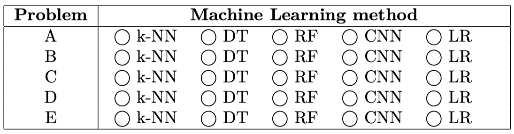

# Problem Set 8 Solutions

## Problem 1: Irreducible Error

**1 points One Answer**

**Question:** Which of the following is the cause/reason for irreducible error?

**Options:**
- a) Stochastic label noise
- b) Very few data points
- c) Nonlinear relationships in the data
- d) Insufficient model complexity

**Correct answers:** (a)

**Explanation:** 
- **A is correct.** Stochastic label noise is what drives irreducible error. See lecture 4 slides. 
- In essence, irreducible error comes from randomness that cannot be modeled since there is no deeper pattern to it. 
- **B and D are wrong** because fewer data points and insufficient model complexity are responsible for reducible error. 
- **C is wrong** because nonlinear relationships in the data don't have anything to do with irreducible error.

## Problem 2: Bias-Variance Analysis

**1 points One Answer**

**Scenario:** Saket unfortunately did not learn from the midterm and still has not attended lecture. He is now given the task of training 3 neural networks with increasing complexity on a regression task:

* Model A: 1 hidden layer with 10 neurons.
* Model B: 2 hidden layers with 50 neurons each.
* Model C: 10 hidden layers with 100 neurons each.

After training and evaluating these models on an appropriately split dataset with train and test splits, you find the following MSEs:

* Model A: train MSE = 2.5, test MSE = 2.6
* Model B: train MSE = 0.1, test MSE = 0.2
* Model C: train MSE = 0.01, test MSE = 1.3

Saket only knows about bias and variance, So based on the model architectures and train/test MSE losses, chose the best relative bias/variance estimates for each of the models.

**Bias/Variance Estimates:**

| Model | Bias      | Variance  |
|-------|-----------|-----------|
|       | Low | High | Low | High |
| A     | $\bigcirc$ | $\text{\textcircled{O}}$ | $\text{\textcircled{O}}$ | $\bigcirc$ |
| B     | $\text{\textcircled{O}}$ | $\bigcirc$ | $\text{\textcircled{O}}$ | $\bigcirc$ |
| C     | $\text{\textcircled{O}}$ | $\bigcirc$ | $\bigcirc$ | $\text{\textcircled{O}}$ |

**Explanation:** 
**Correct answer:** 
- A → high bias, low variance
- B → low bias, low variance  
- C → low bias, high variance

**Reasoning:**
- **Model A:** Due to the simpler architecture and high MSEs, A likely underfits.
- **Model B:** Achieves low but similar train/test MSEs so probably has a good balance.
- **Model C:** Has a low train MSE but a high test MSE so is probably overfitting, which matches the likely overcomplex architecture.

## Problem 3: K-Fold Cross Validation

**2 points**

**Question:** Explain one upside and one downside of using a high K in K-fold cross validation.

**Upside:**

You get a more accurate estimate of your test error, possibly making hyperparameter selection more accurate.

**Downside:**

A higher K means more folds and therefore much more compute/time needed to find the right hyperparameters. A higher K also means each validation set has fewer data points. This will result in higher variability in the results across different folds.

**Explanation:** 
**Possible answer:**

**Upside:** You get a more accurate estimate of your test error, possibly making hyperparameter selection more accurate.

**Downside:** A higher K means more folds and therefore much more compute/time needed to find the right hyperparameters. A higher K also means each validation set has fewer data points. This will result in higher variability in the results across different folds.

## Problem 4: Training and Validation Loss

**1 points Select All That Apply**

**Question:** You are training a model and get the following plot for your training and validation loss.

**Plot Description:**
A line plot titled "Training and Validation Loss" shows two curves over "Number of Epochs" (x-axis) versus "Loss" (y-axis). The x-axis ranges from 2 to 20, with major ticks at 2, 5, 7, 10, 12, 15, 17, and 20. The y-axis ranges from 0.0 to 1.0, with major ticks at 0.0, 0.2, 0.4, 0.6, 0.8, and 1.0.

**Legend:**
- "train" is represented by a solid blue line.
- "validation" is represented by a dashed orange line.

**Train Loss Curve (solid blue):** Starts at a loss of 1.0 at epoch 2, rapidly decreases to near 0.0 by epoch 7, and remains very close to 0.0 for the rest of the epochs up to 20.

**Validation Loss Curve (dashed orange):** Starts at a loss of 1.0 at epoch 2, decreases to approximately 0.4 at epoch 7, then begins to increase, reaching about 0.7 by epoch 12, and subsequently plateaus around 0.7 to 0.75 until epoch 20.

**Sub-question:** Which of the following statements are true?

**Options:**
- a) $\bigcirc$ The model has high bias and low variance.
- b) $\bigcirc$ The large gap between training and validation loss indicates underfitting.
- c) $\bigcirc$ Training for more epochs will eventually decrease validation loss.
- d) $\text{\textcircled{O}}$ The model might be too complex for the dataset.
- e) $\text{\textcircled{O}}$ The model is likely memorizing the training data.

**Correct answers:** (d), (e)

**Explanation:** 
This is a classic example of overfitting, which is caused when we have too complex of a model and it ends up memorizing the training set. Overfitting means the model has low bias and high variance. Thus, the only correct options are D and E.

## Problem 5: Maximum Likelihood Estimation

**1 points Select All That Apply**

**Question:** Which of the following models that we studied in class use maximum likelihood estimation?

**Options:**
- a) $\text{\textcircled{O}}$ Linear regression with Gaussian noise model
- b) $\bigcirc$ Principal Components Analysis
- c) $\text{\textcircled{O}}$ Gaussian Mixture Models
- d) $\text{\textcircled{O}}$ Neural Network trained to do classification with softmax cross entropy loss

**Correct answers:** (a), (c), (d)

**Explanation:** 
- **a) True:** Linear regression with Gaussian noise model is true because you maximize the likelihood of the data under a linear model which assumes a Gaussian distribution on errors.
- **c) True:** Gaussian Mixture Models define a probability distribution that is a mixture of Gaussians and then find the parameters by maximizing likelihood under that model.
- **d) True:** NNs with softmax define a probability distribution over the classification labels and try to maximize it with cross entropy.
- **b) False:** PCA does not use MLE because it does not define a probabilistic distribution for the data, it just uses linear algebra to find vectors that explain a lot of variance in the data.

## Problem 6: Maximum Likelihood Estimation - Coin Toss

**1 points One Answer**

**Question:** Yann, a strict frequentist statistician, observes 5 flips of a possibly uneven coin. Here are the outcomes: 1. Heads, 2. Tails, 3. Heads, 4. Heads, 5. Tails. Based on these observations, Yann uses using maximum likelihood estimation to determine the most likely outcome of the next coin toss. What does he predict will happen?

**Options:**
- a) Heads
- b) Tails
- c) Both are equally likely
- d) It hits Marco in the head

**Correct answers:** (a)

**Explanation:** 
There were 3 Heads and 2 Tails. Based on these observations, the estimated probability of Heads is $\frac{3}{5} = 0.6$, which is greater than the estimated probability of Tails ($\frac{2}{5} = 0.4$). Therefore, Heads is the most likely outcome.

## Problem 7: Convex Optimization

**Problem Description:** Consider a function $f: \mathbb{R}^d \to \mathbb{R}$ that is differentiable everywhere. Suppose that $f(y) \ge f(x) + \nabla f(x)^T (y-x)$ for all $x, y \in \mathbb{R}^d$. Also, suppose that there exists a unique $x_* \in \mathbb{R}^d$ such that $\nabla_x f(x_*) = 0$.

### Part (a)

**1 points One Answer**

**Question:** $x_*$ is a:

**Options:**
- a) Minimizer of $f$
- b) Maximizer of $f$
- c) Saddle point of $f$
- d) Not enough information to determine any of the above

**Correct answers:** (a)

### Part (b)

**1 points**

**Question:** Suppose we are unable to solve for $x_*$ in closed-form. Briefly outline a procedure for finding $x_*$.

**Answer:** Gradient descent

**Explanation:** 
- **Part (a):** $f$ is convex, so $x_*$ must be a minimizer of $f$.
- **Part (b):** Gradient descent

## Problem 8: Gradient Descent Convergence

**1 points One Answer**

**Question:** Which of the following is true, given the optimal learning rate?

**Clarification:** All options refer to convex loss functions that have a minimum bound / have a minimum value.

**Options:**
- a) For convex loss functions, stochastic gradient descent is guaranteed to eventually converge to the global optimum while gradient descent is not.
- b) For convex loss functions, both stochastic gradient descent and gradient descent will eventually converge to the global optimum.
- c) Stochastic gradient descent is always guaranteed to converge to the global optimum of a loss function.
- d) For convex loss functions, gradient descent with the optimal learning rate is guaranteed to eventually converge to the global optimum point while stochastic gradient descent is not.

**Correct answers:** (d)

**Explanation:** 
Due to the noisy updates of SGD, it is not guaranteed to converge at the minimum but for instance, cycle close to it whereas batch gradient descent alleviates this and is guaranteed to reach the minimum given appropriate step size.

## Problem 9: Stochastic Gradient Descent

**3 points**

**Problem Description:** Imagine you are trying to find an optimal weight $w$ for a simple model. You have a small dataset consisting of two data points, each influencing the overall loss:
* Data point 1: $(x_1, y_1) = (5,4)$
* Data point 2: $(x_2, y_2) = (1,3)$

You are using a squared error loss function for each individual data point, defined as
$$L_i(w) = (y_i - w \cdot x_i)^2$$

Your current weight parameter is $w_0 = 1$. You will perform one iteration of Stochastic Gradient Descent (SGD) using a learning rate $\alpha = 0.1$. You will process one "randomly" chosen data point to compute the gradient and update the weight. For this exercise, you may choose which data point to process.

### Case 1: Student Selects Data Point 1 ($x_1 = 5, y_1 = 4$)

**a) Selected Data Point:** Data point 1

**b) Loss at $w_0 = 1$:**
$L_1(1) = (y_1 - w_0 x_1)^2 = (4 - 1 \cdot 5)^2 = (4 - 5)^2 = (-1)^2 = 1$

**c) Gradient at $w_0 = 1$:**
$\nabla L_1(1) = -2x_1(y_1 - w_0 x_1) = -2(5)(4 - 1 \cdot 5) = -10(4 - 5) = -10(-1) = 10$

**d) Weight $w_1$ after SGD update:**
$w_1 = w_0 - \alpha \nabla L_1(w_0) = 1 - 0.1(10) = 1 - 1 = 0$

### Case 2: Student Selects Data Point 2 ($x_2 = 1, y_2 = 3$)

**a) Selected Data Point:** Data point 2

**b) Loss at $w_0 = 1$:**
$L_2(1) = (y_2 - w_0 x_2)^2 = (3 - 1 \cdot 1)^2 = (3 - 1)^2 = (2)^2 = 4$

**c) Gradient at $w_0 = 1$:**
$\nabla L_2(1) = -2x_2(y_2 - w_0 x_2) = -2(1)(3 - 1 \cdot 1) = -2(3 - 1) = -2(2) = -4$

**d) Weight $w_1$ after SGD update:**
$w_1 = w_0 - \alpha \cdot \nabla L_2(w_0) = 1 - 0.1(-4) = 1 + 0.4 = 1.4$

**Explanation:** 
We are given:
* Data point 1: $(x_1,y_1) = (5,4)$
* Data point 2: $(x_2,y_2) = (1,3)$
* Loss function: $L_i(w) = (y_i - w \cdot x_i)^2$
* Initial weight: $w_0 = 1$
* Learning rate: $\alpha = 0.1$

**General Formulas:**
* The loss function for a selected data point $(x_i, y_i)$ is $L_i(w) = (y_i - w \cdot x_i)^2$.
* The gradient of the loss with respect to $w$ is:
  $$\nabla L_i(w) = \frac{d}{dw}(y_i - w \cdot x_i)^2 = 2(y_i - w \cdot x_i)(-x_i) = -2x_i(y_i - w \cdot x_i)$$
* The SGD update rule is:
  $$w_{new} = w_{old} - \alpha \cdot \nabla L_i(w_{old})$$

## Problem 10: Activation Functions

**1 points One Answer**

**Question:** Which of the following activation functions saturates, i.e. stops giving meaningful gradients for large positive inputs?

**Options:**
- a) ReLU
- b) Sigmoid
- c) Softmax

**Correct answers:** (b)

**Explanation:** 
- The gradient for Sigmoid and Tanh approaches 0 as the magnitude of the input increases.
- Softmax is not an activation function.

## Problem 11: Matrix Operations (Convolution and Max Pooling)

**2 points**

**Question:** Consider the following matrix $M$ and kernel filter $F$.

$$
M = \begin{pmatrix}
9 & 7 & 8 \\
4 & 1 & 3 \\
2 & 6 & 4
\end{pmatrix}
\quad
F = \begin{pmatrix}
1 & 0 \\
1 & 1
\end{pmatrix}
$$

Apply the filter $F$ to matrix $M$ with padding = 0 and stride = 1, then perform a Max Pooling operation on the result with a 2x2 filter and stride 1. Write the resulting matrix below in the grid of the correct size. Only write answers in one matrix, otherwise the problem will be graded as incorrect.

**Answer Grid:**
(The image shows four empty grids of sizes 1x1, 2x2, 3x3, and a partially visible 4x4, indicating where the user should write their answer.)

**Explanation:** 
After applying $F$ to $M$, we get: $\begin{pmatrix} 14 & 11 \\ 12 & 11 \end{pmatrix}$. Applying a Max Pool operation with a 2x2 filter just means taking the max of this matrix, since it's a 2x2, so we get the final answer of 14.

## Problem 12: Spatial Dimensions of Output Image

**2 points**

**Question:** What are the spatial dimensions of the output image if a 2 x 2 filter is convolved with a 3 x 3 image for paddings of 0, 1, and 2, and strides of 1 and 2? Fill in the dimensions below:

**Table:**

| Padding | 0 | 1 | 2 |
|---------|---|---|---|
| Stride 1 | (2×2) | (4×4) | (6×6) |
| Stride 2 | (1×1) | (2×2) | (3×3) |

**Explanation:** 
- **Stride 1:** Padding 0 (2×2), Padding 1 (4×4), Padding 2 (6×6)
- **Stride 2:** Padding 0 (1×1), Padding 1 (2×2), Padding 2 (3×3)

## Problem 13: Ridge vs. Lasso Regression

**1 points One Answer**

**Question:** Compared to Lasso, Ridge regression tends to be more stable in terms of which features are important to the model's predictions in high-dimensional cases because it doesn't drive correlated weights to 0.

**Clarification:** Clarification made during exam: "Should read as 'More stable in terms of which features are important to the model's predictions as you increase the amount of regularization in high-dimensional...'"

**Options:**
- a) True
- b) False

**Correct answers:** (a)

**Explanation:** 
This is true because Ridge "smoothly shrinks" all weights making it more stable to small changes in the data or noise.

## Problem 14: Logistic Regression with Linearly Separable Data

**1 points One Answer**

**Question:** For $X \in \mathbb{R}^{n \times d}$ and $y \in \{-1, 1\}^n$, if our data is linearly separable then the minimization problem $\arg \min_w \sum_{i=1}^n \log(1 + \exp(-y_i w^T x_i))$ does not have a unique solution.

**Options:**
- a) True
- b) False

**Correct answers:** (a)

**Explanation:** 
If our data is linearly separable we can push the magnitude of $w$ to $\infty$ to push the objective to 0 but never actually reach 0, so there is no solution.

## Problem 15: Singular Value Decomposition

**1 points One Answer**

**Question:** Suppose we have a matrix $M \in \mathbb{R}^{n \times m}$ and perform SVD on it to get 3 matrices $U, S, V$. If we take the first $r$ singular vectors of $U, V$ corresponding to the first $r$ singular values in $S$ (ordered highest to lowest), where $r = \min(n, m)$, then we can perfectly reconstruct $M$ without any loss whatsoever.

**Options:**
- a) True
- b) False

**Correct answers:** (a)

**Explanation:** 
$r = \min(n, m) \ge \text{rank}(M)$. If we perform a rank $r$ reconstruction on a matrix whose maximum rank is $r$, we will get a lossless reconstruction.

## Problem 16: Principal Components

**1 points Select All That Apply**

**Question:** Which of the following are equivalent to the principal components of a data matrix $X$? Assume $X$ has already been de-meaned.

**Options:**
- a) Vectors that create a subspace which maximize the variance of $X$ if $X$ is projected onto that subspace.
- b) Vectors that create a subspace which minimize the variance of $X$ if $X$ is projected onto that subspace.
- c) The eigenvectors of $X^T X$.
- d) The right singular vectors of $X$.

**Correct answers:** (a), (c), (d)

**Explanation:** 
- **A is correct** because this is the definition of principal components.
- **B is the opposite**, so it is false.
- The right singular vectors of $X$ are also the eigenvectors of $X^T X$, and both are equal to the principal components of $X$. Therefore, **C and D are correct**.

## Problem 17: PCA Reconstruction Error

**1 points One Answer**

**Question:** In PCA, minimizing the reconstruction error is equivalent to minimizing the projected variance.

**Options:**
- a) True
- b) False

**Correct answers:** (b)

**Explanation:** 
Minimizing the reconstruction error is equivalent to maximizing the variance.

## Problem 18: PCA Component Selection

**1 points Select All That Apply**

**Question:** You apply PCA on a dataset of 100 features and get 100 principal components. Which of the following are good reasons to choose only the top $q$ principal components instead of all 100? Assume $q < 100$.

**Options:**
- a) To remove noise by discarding the highest variance components.
- b) To reduce redundant features in the dataset.
- c) To reduce the computational cost of working with the data.
- d) To make a beautiful plot.

**Correct answers:** (c), (d)

**Explanation:** 
If we chose the top $q$ components, those would be the ones with highest variance, so A is incorrect. B is incorrect as we have 100 features and 100 PCs in this case, so we are not reducing redundant features here; all of them are meaningful features. C is correct, because by only picking the top $q$ PCs, we are reducing the dimensionality of the dataset and thus reducing computational cost. D is correct, as it has been mentioned numerous times in lecture before: it helps us create a beautiful plot.

## Problem 19: Decision Trees Bias-Variance

**1 points One Answer**

**Question:** Generally, decision trees have:

**Clarification:** Clarification made during exam: "It should be 'decision trees' instead of 'tree-based methods.'"

**Options:**
- a) Low bias, low variance
- b) Low bias, high variance
- c) High bias, low variance
- d) High bias, high variance

**Correct answers:** (b)

**Explanation:** 
Tree-based methods usually have low bias and high variance.

## Problem 20: Decision Tree Overfitting

**1 points Select All That Apply**

**Question:** Forrest just trained a decision tree for predicting whether a person will like a song based on features like its genre, key, length, etc. He notices an extremely low training error, but an abnormally large test error. He also notices that a regularized multi-class logistic regression model performs much better than his tree. What could be the cause of his problem?

**Options:**
- a) Learning rate too high
- b) Decision tree is too deep
- c) There is too much training data
- d) Decision tree is overfitting

**Correct answers:** (b), (d)

**Explanation:** 
He is observing overfitting which could be caused by a complex/deep tree.

## Problem 21: Model Selection Matching

**2.5 points**

**Question:** Match each modeling problem with the best machine learning method from the list below. Use each model type once.

**Modeling Problems:**

**A)** Training a model for a medical setting with a small number of categorical input features, where interpretability of decisions is important.

**B)** Having a small dataset (small $n$) with continuous $Y$ labels and many features. The goal is an interpretable model that can be regularized to identify important features.

**C)** Having a large dataset (large $n$) of images.

**D)** Having a lot of data (large $n$) in a small dimensional feature space (small $d$), assuming labels $y$ change smoothly with changes in the feature space.

**E)** Data with a relatively small number of categorical features, with the goal of winning a Kaggle competition.

**Available Machine Learning Methods:**
- k-Nearest Neighbours (kNN)
- Decision Tree (DT)
- Random Forest (RF)
- Convolutional Neural Network (CNN)
- Linear Regression (LR)

**Matching Table:**

| Problem | Machine Learning Method |
|---------|------------------------|
| A | $\text{\textcircled{O}}$ DT (Decision Tree) |
| B | $\text{\textcircled{O}}$ LR (Linear Regression) |
| C | $\text{\textcircled{O}}$ CNN (Convolutional Neural Network) |
| D | $\text{\textcircled{O}}$ kNN (k-Nearest Neighbours) |
| E | $\text{\textcircled{O}}$ RF (Random Forest) |

**Explanation:** 
- **Problem A:** Decision Tree, because they are good for categorical features and are interpretable.
- **Problem B:** Linear Regression, because it works for small datasets and continuous labels.
- **Problem C:** Convolutional Neural Networks.
- **Problem D:** kNN.
- **Problem E:** Random Forests.

