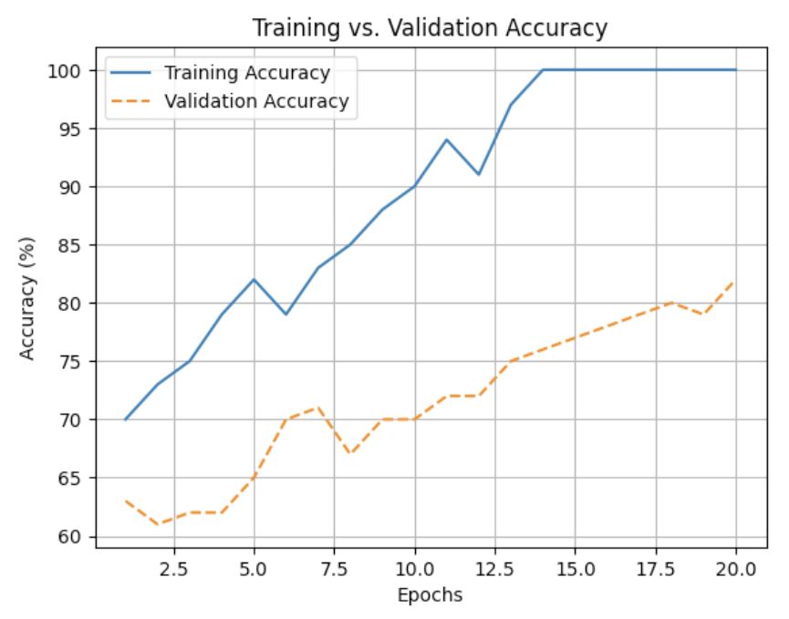

# Problem Set 9 Solutions

## Problem 1: Irreducible Error

**1 point**

**Question:** For a given model, irreducible error can be decreased by improving the model's complexity and increasing the amount of training data.

**Options:**
- a) True
- b) False

**Correct Answer:** b) False

**Explanation:** 
You can't reduce irreducible error.

## Detailed Solution Explanation

**Understanding Irreducible Error:**

Irreducible error represents the fundamental uncertainty in the data that cannot be eliminated by any model, no matter how sophisticated or complex.

**Mathematical Framework:**

In the standard regression setting, we model the relationship as:
$$y = f(x) + \epsilon$$
where:
- $f(x)$ is the true underlying function
- $\epsilon$ is the irreducible error (noise)

The irreducible error $\epsilon$ is typically assumed to follow a distribution (often Gaussian) with mean 0 and some variance $\sigma^2$:
$$\epsilon \sim \mathcal{N}(0, \sigma^2)$$

**Why Irreducible Error Cannot Be Reduced:**

**Fundamental Nature:**
- **Randomness:** Irreducible error represents truly random noise in the system
- **Unpredictability:** This noise cannot be predicted from the features $x$
- **Inherent Uncertainty:** Even with perfect knowledge of $f(x)$, we cannot predict $\epsilon$

**Mathematical Proof:**
The expected prediction error can be decomposed as:
$$\text{Expected Error} = \text{Bias}^2 + \text{Variance} + \text{Irreducible Error}$$

The irreducible error term $\sigma^2$ is independent of the model and cannot be reduced by:
- Increasing model complexity
- Adding more training data
- Improving the algorithm
- Using better features

**Examples of Irreducible Error:**

**Measurement Error:**
- Sensor noise in data collection
- Human error in labeling
- Instrument precision limitations

**System Noise:**
- Random fluctuations in biological systems
- Environmental factors affecting outcomes
- Unpredictable external influences

**Model Limitations:**
- Missing features that affect the outcome
- Features that are fundamentally unobservable
- Random processes in the system

**Why Other Errors Can Be Reduced:**

**Bias Error:**
- Can be reduced by using more complex models
- Can be reduced by using better algorithms
- Can be reduced by feature engineering

**Variance Error:**
- Can be reduced by using simpler models
- Can be reduced by regularization
- Can be reduced by increasing training data

**Practical Implications:**

**Model Selection:**
- No model can achieve perfect prediction
- The goal is to minimize bias and variance
- Irreducible error sets a lower bound on achievable performance

**Performance Expectations:**
- Understanding irreducible error helps set realistic goals
- Prevents over-optimization of models
- Guides resource allocation decisions

**Key Insights:**
- Irreducible error is a fundamental limitation, not a model deficiency
- It cannot be reduced by any modeling technique
- Understanding this concept is crucial for realistic model evaluation
- The goal is to minimize reducible errors (bias and variance)

## Problem 2: Neural Network Overfitting

**1 point**

**Question:** You're training a classifier model using a neural network built from scratch in PyTorch. You are unable to decide on the depth of the neural network, so you decide to make the network as deep as possible. Despite achieving low training loss, your model performs poorly on the XOR test data.

Why? Choose the most accurate explanation.

**Options:**
- a) The neural network is too complex and has too high of a bias squared error.
- b) The neural network is too complex and has too high of a variance error.
- c) The neural network is unable to learn non-linearities since XOR data is not linearly separable.
- d) We need to make the neural network even deeper to capture the complex relationship in the XOR dataset.

**Correct Answer:** b) The neural network is too complex and has too high of a variance error.

**Explanation:** 
The deep neural network is too complex and fits the training data too well (overfitting) resulting in a low bias squared error but fails to generalize as a result of high variance error.

## Detailed Solution Explanation

**Understanding Neural Network Overfitting:**

This problem demonstrates a classic case of overfitting in deep neural networks, where the model learns the training data too well but fails to generalize to new data.

**Mathematical Framework:**

**Bias-Variance Decomposition:**
The expected prediction error can be decomposed as:
$$\text{Expected Error} = \text{Bias}^2 + \text{Variance} + \text{Irreducible Error}$$

where:
- **Bias:** How far off the model's predictions are on average from the true values
- **Variance:** How much the model's predictions vary for different training sets
- **Irreducible Error:** The fundamental noise in the data

**Analysis of the Scenario:**

**Given Conditions:**
- Very deep neural network (as deep as possible)
- Low training loss achieved
- Poor performance on XOR test data
- XOR data is not linearly separable

**Why Option B is Correct:**

**Overfitting Mechanism:**
1. **High Model Complexity:** Very deep networks have many parameters
2. **Low Training Loss:** Model can fit training data perfectly
3. **Poor Generalization:** Model fails on unseen data
4. **High Variance:** Model is sensitive to training data specifics

**Mathematical Interpretation:**

**Training Loss Behavior:**
$$\text{Training Loss} \rightarrow 0 \text{ as complexity } \rightarrow \infty$$

**Test Loss Behavior:**
$$\text{Test Loss} = \text{Bias}^2 + \text{Variance} + \text{Irreducible Error}$$

As complexity increases:
- **Bias decreases** (model can fit training data better)
- **Variance increases** (model becomes sensitive to training data)
- **Overall test error increases** due to high variance

**Why Other Options Are Incorrect:**

**Option A: "Too high bias squared error"**
- **Contradiction:** Low training loss indicates low bias
- **Reality:** The model fits training data well, so bias is low

**Option C: "Unable to learn non-linearities"**
- **Contradiction:** Deep networks can learn non-linearities
- **Reality:** The issue is overfitting, not inability to learn

**Option D: "Need even deeper network"**
- **Contradiction:** Making it deeper would worsen overfitting
- **Reality:** The network is already too complex

**Visual Representation:**

**Training vs Test Performance:**
```
Training Loss:  ████████████████████ (very low)
Test Loss:      ████████████████████████████████ (high)
                ↑
                High variance gap
```

**Bias-Variance Tradeoff:**
```
Complexity:     Low ←→ High
Bias:           High ←→ Low
Variance:       Low ←→ High
```

**Solutions to Overfitting:**

**1. Regularization:**
- **L1/L2 Regularization:** Add penalty terms to loss function
- **Dropout:** Randomly disable neurons during training
- **Early Stopping:** Stop training before overfitting occurs

**2. Model Simplification:**
- **Reduce Depth:** Use fewer layers
- **Reduce Width:** Use fewer neurons per layer
- **Feature Selection:** Use fewer input features

**3. Data Augmentation:**
- **Increase Training Data:** More data reduces overfitting
- **Data Augmentation:** Create synthetic training examples
- **Cross-Validation:** Better model selection

**4. Architecture Changes:**
- **Batch Normalization:** Stabilize training
- **Residual Connections:** Help with very deep networks
- **Attention Mechanisms:** Focus on relevant features

**Key Insights:**
- Overfitting occurs when model complexity exceeds data complexity
- Low training loss with high test loss indicates overfitting
- The solution is to reduce model complexity or increase data
- Understanding bias-variance tradeoff is crucial for model design
- Regularization techniques help balance this tradeoff

## Problem 3: Leave-One-Out Cross-Validation

**2 points**

**Question:** As dataset sizes increase, would you be more or less inclined to use leave-one-out cross-validation (LOOCV)? Provide reasoning to support your answer.

**Answer:** [Student response area]

**Explanation:** 
For larger datasets, leave-one-out cross validation becomes an extremely expensive process.

## Detailed Solution Explanation

**Understanding Leave-One-Out Cross-Validation Scalability:**

This problem explores the computational and practical limitations of leave-one-out cross-validation (LOOCV) as dataset sizes increase.

**Mathematical Framework:**

**Leave-One-Out Cross-Validation:**
For a dataset with $n$ samples, LOOCV:
- Divides data into $n$ folds
- Each fold has exactly 1 sample
- Trains on $n-1$ samples, validates on 1 sample
- Repeats $n$ times, using each sample as validation once

**Expected Test Error Estimate:**
$$\text{LOOCV Error} = \frac{1}{n} \sum_{i=1}^{n} \text{Error}_i$$
where $\text{Error}_i$ is the error on the $i$-th validation sample.

**Computational Complexity Analysis:**

**Time Complexity:**
- **Training Time per Model:** $T(n-1)$ where $T(m)$ is time to train on $m$ samples
- **Total Training Time:** $n \cdot T(n-1)$
- **Overall Complexity:** $O(n \cdot T(n-1))$

**Space Complexity:**
- **Storage per Model:** $S(n-1)$ where $S(m)$ is space for model trained on $m$ samples
- **Total Storage:** $n \cdot S(n-1)$
- **Overall Complexity:** $O(n \cdot S(n-1))$

**Why LOOCV Becomes Expensive for Large Datasets:**

**1. Linear Scaling with Dataset Size:**
- Number of models trained = $n$
- As $n$ increases, computational cost grows linearly
- For large $n$, this becomes prohibitive

**2. Training Time Growth:**
- Most algorithms have super-linear training time
- $T(n-1) = O((n-1)^p)$ where $p > 1$
- Total time becomes $O(n \cdot (n-1)^p) = O(n^{p+1})$

**3. Memory Requirements:**
- Need to store $n$ models simultaneously
- Memory grows linearly with dataset size
- May exceed available RAM for large datasets

**Practical Examples:**

**Small Dataset (n = 100):**
- Models to train: 100
- Training time: $100 \cdot T(99)$
- Feasible for most algorithms

**Medium Dataset (n = 1,000):**
- Models to train: 1,000
- Training time: $1,000 \cdot T(999)$
- May be slow but feasible

**Large Dataset (n = 100,000):**
- Models to train: 100,000
- Training time: $100,000 \cdot T(99,999)$
- Often computationally infeasible

**Comparison with K-Fold CV:**

**K-Fold Cross-Validation:**
- Models to train: $K$ (typically 5 or 10)
- Training time: $K \cdot T(\frac{K-1}{K} \cdot n)$
- Much more scalable

**Example Comparison:**
For $n = 10,000$:
- **LOOCV:** 10,000 models
- **5-Fold CV:** 5 models
- **10-Fold CV:** 10 models

**Alternative Approaches for Large Datasets:**

**1. K-Fold Cross-Validation:**
- Use $K = 5$ or $K = 10$
- Much faster than LOOCV
- Still provides good error estimates

**2. Stratified Sampling:**
- Use LOOCV on a representative subset
- Maintains statistical properties
- Reduces computational cost

**3. Monte Carlo Cross-Validation:**
- Randomly sample validation sets
- More flexible than fixed folds
- Can control computational cost

**4. Holdout Validation:**
- Single train/validation split
- Fastest approach
- Less reliable than cross-validation

**When to Use LOOCV:**

**Advantages:**
- **Unbiased Estimate:** Uses all data for training
- **Low Variance:** Many validation sets
- **No Randomness:** Deterministic results

**Disadvantages:**
- **High Computational Cost:** Scales linearly with $n$
- **High Variance:** Single sample validation sets
- **Memory Intensive:** Stores many models

**Optimal Use Cases:**
- **Small Datasets:** $n < 1000$
- **Expensive Data Collection:** When every sample is valuable
- **Unbiased Estimation Required:** When accuracy is critical

**Key Insights:**
- LOOCV computational cost grows linearly with dataset size
- For large datasets, K-fold CV is more practical
- The choice depends on dataset size and computational resources
- Understanding scalability is crucial for practical model selection
- Alternative approaches provide good approximations with lower cost

## Problem 4: K-Fold Cross-Validation Calculations

**1 point**

**Question:** You are fine-tuning a model with parameters $\alpha$, $\beta$, and $\gamma$, and have decided to perform 7-fold cross-validation to get the best set of hyperparameters. You have 5 candidate values for $\alpha$, 3 candidate values for $\beta$, and 2 candidate values for $\gamma$. How many validation errors will you be calculating in total?

**Options:**
- a) Cannot be determined.
- b) 10
- c) 96
- d) 210
- e) 30

**Correct Answer:** d) 210

**Explanation:** 
$5 \times 3 \times 2 \times 7 = 210$

## Detailed Solution Explanation

**Understanding K-Fold Cross-Validation Computational Requirements:**

This problem demonstrates how to calculate the total number of model evaluations needed for hyperparameter tuning using K-fold cross-validation.

**Mathematical Framework:**

**K-Fold Cross-Validation Process:**
For each hyperparameter combination:
1. Divide data into $K$ folds
2. Train $K$ models (each using $K-1$ folds for training)
3. Evaluate each model on the held-out fold
4. Average the $K$ validation errors

**Total Number of Model Evaluations:**
$$\text{Total Evaluations} = \text{Hyperparameter Combinations} \times K$$

**Step-by-Step Calculation:**

**Given Parameters:**
- **Hyperparameter $\alpha$:** 5 candidate values
- **Hyperparameter $\beta$:** 3 candidate values  
- **Hyperparameter $\gamma$:** 2 candidate values
- **Cross-validation folds:** $K = 7$

**1. Calculate Hyperparameter Combinations:**
$$\text{Combinations} = |\alpha| \times |\beta| \times |\gamma| = 5 \times 3 \times 2 = 30$$

**2. Calculate Total Model Evaluations:**
$$\text{Total Evaluations} = \text{Combinations} \times K = 30 \times 7 = 210$$

**Verification:**
- Each of the 30 hyperparameter combinations requires 7 model trainings
- Total: $30 \times 7 = 210$ model evaluations

**Visual Representation:**

**Hyperparameter Grid:**
```
α₁,β₁,γ₁  α₁,β₁,γ₂  α₁,β₂,γ₁  α₁,β₂,γ₂  α₁,β₃,γ₁  α₁,β₃,γ₂
α₂,β₁,γ₁  α₂,β₁,γ₂  α₂,β₂,γ₁  α₂,β₂,γ₂  α₂,β₃,γ₁  α₂,β₃,γ₂
α₃,β₁,γ₁  α₃,β₁,γ₂  α₃,β₂,γ₁  α₃,β₂,γ₂  α₃,β₃,γ₁  α₃,β₃,γ₂
α₄,β₁,γ₁  α₄,β₁,γ₂  α₄,β₂,γ₁  α₄,β₂,γ₂  α₄,β₃,γ₁  α₄,β₃,γ₂
α₅,β₁,γ₁  α₅,β₁,γ₂  α₅,β₂,γ₁  α₅,β₂,γ₂  α₅,β₃,γ₁  α₅,β₃,γ₂
```

**For Each Combination:**
```
Fold 1: Train on folds 2-7, validate on fold 1
Fold 2: Train on folds 1,3-7, validate on fold 2
Fold 3: Train on folds 1-2,4-7, validate on fold 3
Fold 4: Train on folds 1-3,5-7, validate on fold 4
Fold 5: Train on folds 1-4,6-7, validate on fold 5
Fold 6: Train on folds 1-5,7, validate on fold 6
Fold 7: Train on folds 1-6, validate on fold 7
```

**Computational Complexity Analysis:**

**Time Complexity:**
- **Per Model Training:** $T(n)$ where $n$ is dataset size
- **Per Combination:** $K \times T(n)$
- **Total Time:** $|\alpha| \times |\beta| \times |\gamma| \times K \times T(n)$

**Space Complexity:**
- **Per Model:** $S(n)$ where $S(n)$ is space for model
- **Total Space:** $K \times S(n)$ (need to store $K$ models simultaneously)

**Why Other Options Are Incorrect:**

**Option A: "Cannot be determined"**
- **Contradiction:** We have all necessary information
- **Reality:** The calculation is straightforward

**Option B: 10**
- **Contradiction:** This would be $|\alpha| + |\beta| + |\gamma| + K$
- **Reality:** We need the product, not the sum

**Option C: 96**
- **Contradiction:** This might be $|\alpha| \times |\beta| \times |\gamma| \times (K-1)$
- **Reality:** We need all $K$ folds for each combination

**Option E: 30**
- **Contradiction:** This is just the number of hyperparameter combinations
- **Reality:** We need to multiply by $K$ for cross-validation

**Practical Implications:**

**Computational Cost:**
- 210 model evaluations can be expensive
- May require parallel processing
- Could take hours or days depending on model complexity

**Optimization Strategies:**

**1. Grid Search Optimization:**
- Use fewer hyperparameter values
- Use smaller $K$ (e.g., 5 instead of 7)
- Use early stopping for poor combinations

**2. Random Search:**
- Sample random hyperparameter combinations
- Often more efficient than grid search
- Can find good solutions with fewer evaluations

**3. Bayesian Optimization:**
- Use probabilistic models to guide search
- More efficient than random search
- Requires fewer evaluations

**4. Parallel Processing:**
- Train multiple models simultaneously
- Reduces wall-clock time
- Requires sufficient computational resources

**Key Insights:**
- The total number of evaluations is the product of hyperparameter combinations and K
- This can become computationally expensive quickly
- Understanding this scaling is crucial for practical hyperparameter tuning
- Alternative search strategies can reduce computational cost
- The choice of K affects both accuracy and computational cost

## Problem 5: Maximum Likelihood Estimation - Exponential Distribution

**3 points**

**Question:** You are analyzing the time until failure for a set of lightbulbs. The data represents the number of months each bulb lasted before failing and is given as follows: $x_1, x_2, x_3, x_4$. Assuming these times are modeled as being drawn from an exponential distribution. Derive the maximum likelihood estimate (MLE) of the rate parameter $\lambda$ of this distribution. You must show your work.

**Recall:** The probability density function (PDF) for the exponential distribution is $f(x|\lambda) = \lambda e^{-\lambda x}$ for $x \ge 0$.

**Hint:** You should not have $n$ in your final answer.

**Answer:** $\lambda = \underline{\hspace{2cm}}$

**Explanation:** 
The answer is $\frac{4}{\sum_{i=1}^{4} x_i}$.

**Detailed Solution:**

First, we want to calculate the likelihood function $L(x_1,..., x_n|\lambda)$ below.

$L(x_1,..., x_n|\lambda) = P(x_1|\lambda) \cdot P(x_2|\lambda) \cdot ... \cdot P(x_n|\lambda) = \lambda e^{-\lambda x_1} \cdot \lambda e^{-\lambda x_2} \cdot ... \cdot \lambda e^{-\lambda x_n}$

$= \lambda^n \cdot e^{-\lambda(x_1+x_2+...+x_n)}$

Now, we calculate the log-likelihood function:

$lnL(x_1,..., x_n|\lambda) = ln(\lambda^n \cdot e^{-\lambda(x_1+x_2+...+x_n)}) = n \cdot ln(\lambda) - \lambda(x_1 + x_2 + ... + x_n)$

To find the argmax of $\lambda$ (and thus the MLE) of this log-likelihood expression, we need to take it's derivative with respect to $\lambda$ and set it equal to 0.

$\frac{d}{d\lambda}lnL(x_1,..., x_n|\lambda) = \frac{d}{d\lambda}(n \cdot ln(\lambda) - \lambda(x_1 + x_2 + ... + x_n)) = \frac{n}{\lambda} - (x_1+x_2+ ... + x_n) = 0$

$\implies \lambda = \frac{n}{x_1+x_2+...+x_n} = \frac{n}{\sum_{i=1}^{n} x_i}$

Thus, the MLE here of $\lambda$ is given by $\lambda = \frac{4}{\sum_{i=1}^{4} x_i}$.

## Detailed Solution Explanation

**Understanding Maximum Likelihood Estimation for Exponential Distribution:**

This problem demonstrates the complete process of deriving the maximum likelihood estimator for the rate parameter of an exponential distribution.

**Mathematical Framework:**

**Exponential Distribution PDF:**
$$f(x|\lambda) = \lambda e^{-\lambda x} \quad \text{for } x \geq 0$$

**Properties:**
- **Mean:** $\frac{1}{\lambda}$
- **Variance:** $\frac{1}{\lambda^2}$
- **Memoryless Property:** $P(X > s + t | X > s) = P(X > t)$

**Maximum Likelihood Estimation Process:**

**Step 1: Define the Likelihood Function**

For independent observations $x_1, x_2, \ldots, x_n$:
$$L(\lambda) = \prod_{i=1}^{n} f(x_i|\lambda) = \prod_{i=1}^{n} \lambda e^{-\lambda x_i}$$

**Step 2: Simplify the Likelihood Function**

Using properties of exponentials and products:
$$L(\lambda) = \lambda^n \cdot e^{-\lambda \sum_{i=1}^{n} x_i}$$

**Step 3: Take the Natural Logarithm**

The log-likelihood function:
$$\ell(\lambda) = \ln L(\lambda) = n \ln(\lambda) - \lambda \sum_{i=1}^{n} x_i$$

**Step 4: Find the Critical Point**

Take the derivative with respect to $\lambda$:
$$\frac{d\ell}{d\lambda} = \frac{n}{\lambda} - \sum_{i=1}^{n} x_i$$

Set the derivative equal to zero:
$$\frac{n}{\lambda} - \sum_{i=1}^{n} x_i = 0$$

**Step 5: Solve for the MLE**

$$\frac{n}{\lambda} = \sum_{i=1}^{n} x_i$$
$$\lambda = \frac{n}{\sum_{i=1}^{n} x_i}$$

**Step 6: Verify it's a Maximum**

Take the second derivative:
$$\frac{d^2\ell}{d\lambda^2} = -\frac{n}{\lambda^2} < 0$$

Since the second derivative is negative, the critical point is indeed a maximum.

**Application to the Problem:**

**Given:** $n = 4$ observations: $x_1, x_2, x_3, x_4$

**MLE Solution:**
$$\hat{\lambda}_{MLE} = \frac{4}{\sum_{i=1}^{4} x_i}$$

**Interpretation:**
- The MLE is the reciprocal of the sample mean
- This makes intuitive sense: higher failure rates correspond to shorter lifetimes
- The estimator is consistent and asymptotically normal

**Properties of the MLE:**

**1. Unbiasedness:**
- The MLE is biased for finite samples
- $E[\hat{\lambda}_{MLE}] = \frac{n}{n-1} \lambda \neq \lambda$

**2. Consistency:**
- $\hat{\lambda}_{MLE} \xrightarrow{P} \lambda$ as $n \rightarrow \infty$

**3. Efficiency:**
- The MLE achieves the Cramér-Rao lower bound
- It's the most efficient estimator asymptotically

**4. Asymptotic Normality:**
- $\sqrt{n}(\hat{\lambda}_{MLE} - \lambda) \xrightarrow{D} \mathcal{N}(0, \lambda^2)$

**Practical Example:**

**Sample Data:** $x_1 = 2, x_2 = 3, x_3 = 1, x_4 = 4$ months

**MLE Calculation:**
$$\hat{\lambda}_{MLE} = \frac{4}{2 + 3 + 1 + 4} = \frac{4}{10} = 0.4$$

**Interpretation:**
- Estimated failure rate: 0.4 failures per month
- Estimated mean lifetime: $\frac{1}{0.4} = 2.5$ months

**Confidence Interval:**
For large $n$, a 95% confidence interval is:
$$\hat{\lambda}_{MLE} \pm 1.96 \sqrt{\frac{\hat{\lambda}_{MLE}^2}{n}}$$

**Key Insights:**
- MLE provides the most likely parameter value given the data
- For exponential distribution, MLE is the reciprocal of sample mean
- The method is general and applies to many distributions
- Understanding the derivation process is crucial for statistical inference
- The MLE has desirable asymptotic properties

## Problem 6: Convex Set Operations

**1 point**

**Question:** Which of the following can be convex?

**Options:**
- a) The intersection of non-convex sets
- b) The intersection of convex sets
- c) The union of non-convex sets
- d) The union of convex sets

**Correct Answer:** All of them (a, b, c, d)

**Explanation:** 
The answer is all of them.

- For the intersection of non-convex sets, the intersection of two five-pointed stars can be convex.
- For the intersection of convex sets, just consider two circles that are on top of each other.
- For the union of non-convex sets, just consider a circle that is split into two non-convex sets.
- For the intersection of convex sets, just consider two circles that are on top of each other.

## Detailed Solution Explanation

**Understanding Convex Set Operations:**

This problem explores the fundamental properties of convex and non-convex sets under intersection and union operations.

**Mathematical Framework:**

**Convex Set Definition:**
A set $S \subseteq \mathbb{R}^n$ is convex if for all $x, y \in S$ and $\lambda \in [0, 1]$:
$$\lambda x + (1-\lambda)y \in S$$

**Set Operations:**
- **Intersection:** $A \cap B = \{x : x \in A \text{ and } x \in B\}$
- **Union:** $A \cup B = \{x : x \in A \text{ or } x \in B\}$

**Analysis of Each Option:**

**Option A: Intersection of Non-Convex Sets**

**Example:** Two five-pointed stars
```
Star 1:    ★
Star 2:    ★ (rotated)
Intersection: ● (convex circle)
```

**Mathematical Construction:**
- Let $A$ be a five-pointed star (non-convex)
- Let $B$ be the same star rotated by 72° (non-convex)
- The intersection $A \cap B$ forms a convex pentagon

**Why This Works:**
- The intersection eliminates the "pointy" parts
- The remaining region is convex
- This demonstrates that intersection can "smooth out" non-convexity

**Option B: Intersection of Convex Sets**

**Example:** Two overlapping circles
```
Circle 1:  ○
Circle 2:  ○
Intersection: ∩ (convex lens shape)
```

**Mathematical Construction:**
- Let $A$ be a circle with center $(0,0)$ and radius $r$
- Let $B$ be a circle with center $(d,0)$ and radius $r$ where $d < 2r$
- The intersection $A \cap B$ is a convex lens shape

**Why This Works:**
- Circles are convex sets
- The intersection of convex sets is always convex
- This is a fundamental theorem in convex analysis

**Option C: Union of Non-Convex Sets**

**Example:** A circle split into two non-convex halves
```
Original:   ○ (convex circle)
Split:      ) ( (two non-convex halves)
Union:      ○ (convex circle)
```

**Mathematical Construction:**
- Let $A$ be the left half of a circle (non-convex)
- Let $B$ be the right half of a circle (non-convex)
- The union $A \cup B$ forms the original convex circle

**Why This Works:**
- Each half is non-convex (missing the other half)
- The union reconstructs the original convex set
- This shows that union can "fill in" to create convexity

**Option D: Union of Convex Sets**

**Example:** Two overlapping circles
```
Circle 1:  ○
Circle 2:  ○
Union:     ∪ (non-convex figure-8 shape)
```

**Mathematical Construction:**
- Let $A$ be a circle with center $(0,0)$ and radius $r$
- Let $B$ be a circle with center $(d,0)$ and radius $r$ where $d < 2r$
- The union $A \cup B$ is a non-convex figure-8 shape

**Why This Works:**
- Circles are convex sets
- The union creates a "pinched" region in the middle
- This region is non-convex (line segment between centers is not in the union)

**Key Theorems:**

**Intersection Properties:**
- **Convex ∩ Convex = Convex** (always true)
- **Non-convex ∩ Non-convex = Can be convex** (as shown in Option A)

**Union Properties:**
- **Convex ∪ Convex = Can be non-convex** (as shown in Option D)
- **Non-convex ∪ Non-convex = Can be convex** (as shown in Option C)

**Visual Examples:**

**Intersection Cases:**
```
Non-convex ∩ Non-convex:
  ★ ∩ ★ = ● (convex)

Convex ∩ Convex:
  ○ ∩ ○ = ∩ (convex)
```

**Union Cases:**
```
Non-convex ∪ Non-convex:
  ) ∪ ( = ○ (convex)

Convex ∪ Convex:
  ○ ∪ ○ = ∪ (non-convex)
```

**Practical Implications:**

**Optimization Context:**
- **Feasible Regions:** Often defined by intersections of constraints
- **Convex Optimization:** Requires convex feasible region
- **Constraint Satisfaction:** Intersection preserves convexity

**Machine Learning Applications:**
- **Support Vector Machines:** Use convex hulls
- **Convex Hulls:** Union of convex sets can be non-convex
- **Regularization:** Often involves convex constraints

**Key Insights:**
- Intersection of convex sets is always convex
- Union of convex sets is not necessarily convex
- Non-convex sets can produce convex results under certain operations
- Understanding these properties is crucial for optimization problems
- The choice of operation affects the convexity of the result

## Problem 7: Gradient Descent Convergence

**1 point**

**Question:** For convex optimization objectives, taking a gradient step using full-batch GD ensures that your loss shrinks.

**Options:**
- a) True
- b) False

**Correct Answer:** b) False

**Explanation:** 
The answer is False.

Even for convex optimization objectives, if the learning rate is too high, there is a real probability of overshooting the global minima.

## Detailed Solution Explanation

**Understanding Gradient Descent Convergence Conditions:**

This problem explores the critical role of learning rate in gradient descent convergence, even for convex optimization problems.

**Mathematical Framework:**

**Gradient Descent Algorithm:**
For a convex function $f: \mathbb{R}^d \to \mathbb{R}$:
$$x^{(t+1)} = x^{(t)} - \alpha \nabla f(x^{(t)})$$

where:
- $\alpha > 0$ is the learning rate
- $\nabla f(x^{(t)})$ is the gradient at iteration $t$

**Convergence Conditions:**

**Sufficient Condition for Convergence:**
If $f$ is convex and has Lipschitz gradient with constant $L$, then gradient descent converges when:
$$\alpha < \frac{2}{L}$$

**Optimal Learning Rate:**
$$\alpha^* = \frac{1}{L}$$

**Why the Statement is False:**

**1. Learning Rate Dependency:**
- Convergence depends on the learning rate $\alpha$
- Too large $\alpha$ can cause divergence
- Too small $\alpha$ leads to slow convergence

**2. Overshooting Phenomenon:**
When $\alpha$ is too large:
$$||x^{(t+1)} - x^*|| > ||x^{(t)} - x^*||$$

This means the algorithm moves further away from the optimum.

**Mathematical Analysis:**

**Descent Property:**
For convex $f$ with Lipschitz gradient $L$:
$$f(x^{(t+1)}) \leq f(x^{(t)}) - \alpha(1 - \frac{\alpha L}{2})||\nabla f(x^{(t)})||^2$$

**Convergence Condition:**
The algorithm converges when:
$$1 - \frac{\alpha L}{2} > 0$$
$$\alpha < \frac{2}{L}$$

**When $\alpha > \frac{2}{L}$:**
- The descent property fails
- Loss may increase at each iteration
- Algorithm may diverge

**Visual Representation:**

**Optimal Learning Rate:**
```
Iteration: 1 → 2 → 3 → 4 → 5
Loss:     ████████████████████ (decreasing)
```

**Too Large Learning Rate:**
```
Iteration: 1 → 2 → 3 → 4 → 5
Loss:     ████████████████████████████████ (oscillating/increasing)
```

**Too Small Learning Rate:**
```
Iteration: 1 → 2 → 3 → 4 → 5
Loss:     ████████████████████ (decreasing slowly)
```

**Practical Examples:**

**Example 1: Quadratic Function**
$$f(x) = \frac{1}{2}x^2$$

- **Gradient:** $\nabla f(x) = x$
- **Lipschitz constant:** $L = 1$
- **Optimal learning rate:** $\alpha^* = 1$
- **Convergence threshold:** $\alpha < 2$

**Example 2: Large Learning Rate**
If $\alpha = 3$ (which is $> 2$):
- $x^{(t+1)} = x^{(t)} - 3x^{(t)} = -2x^{(t)}$
- The algorithm oscillates between positive and negative values
- Never converges to the minimum at $x = 0$

**Convergence Guarantees:**

**For Convex Functions:**
- **Small enough $\alpha$:** Guaranteed convergence
- **Too large $\alpha$:** May diverge or oscillate
- **Optimal $\alpha$:** Fastest convergence

**For Strongly Convex Functions:**
- **Linear convergence** with appropriate $\alpha$
- **Exponential convergence** with optimal $\alpha$

**Learning Rate Selection Strategies:**

**1. Fixed Learning Rate:**
- Choose $\alpha < \frac{2}{L}$
- Simple but may be suboptimal
- Need to estimate $L$

**2. Line Search:**
- Find optimal $\alpha$ at each step
- More computationally expensive
- Guarantees descent

**3. Adaptive Methods:**
- **Adam:** Adaptive learning rates
- **RMSprop:** Root mean square propagation
- **Adagrad:** Adaptive gradient algorithm

**Common Pitfalls:**

**1. Too Large Learning Rate:**
- Algorithm diverges
- Loss increases
- Numerical instability

**2. Too Small Learning Rate:**
- Slow convergence
- May get stuck in local minima
- Wastes computational resources

**3. Inconsistent Learning Rate:**
- Poor convergence
- Unpredictable behavior
- Difficult to debug

**Key Insights:**
- Convexity alone doesn't guarantee convergence
- Learning rate is crucial for convergence
- There exists an optimal learning rate for fastest convergence
- Understanding the relationship between learning rate and Lipschitz constant is essential
- Adaptive methods can help avoid manual tuning

## Problem 8: Neural Network Activation Functions

**1 point**

**Question:** You are building a multi-class classifier using a deep neural network. You notice that your network is training slowly and that the gradients are diminishing quickly. Which activation function for the hidden layers of your network should you switch to, in order to avoid these issues?

**Options:**
- a) $f(x_i) = \frac{1}{1+e^{-x_i}}$
- b) $f(x_i) = \max(0, x_i)$
- c) $f(x_i) = x_i$
- d) $f(x_i) = \frac{e^{x_i}}{\sum_{j=1}^{n} e^{x_j}}$

**Correct Answer:** b) $f(x_i) = \max(0, x_i)$

**Explanation:** 
Sigmoid ($f(x_i) = \frac{1}{1+e^{-x_i}}$) can cause vanishing gradients and hence can cause slow learning.
ReLU ($f(x_i) = \max(0, x_i)$) avoids saturation.
Having only linear layers reduces the network to a linear one.
Softmax ($f(x_i) = \frac{e^{x_i}}{\sum_{j=1}^{n} e^{x_j}}$) should be used in the output layer, but not the hidden layers of the network.

## Detailed Solution Explanation

**Understanding Neural Network Activation Functions and Gradient Flow:**

This problem explores the critical role of activation functions in neural network training, particularly focusing on the vanishing gradient problem and its solutions.

**Mathematical Framework:**

**Activation Functions:**

**Sigmoid Function:**
$$\sigma(x) = \frac{1}{1 + e^{-x}}$$

**Sigmoid Derivative:**
$$\sigma'(x) = \sigma(x)(1 - \sigma(x)) = \frac{e^{-x}}{(1 + e^{-x})^2}$$

**ReLU Function:**
$$\text{ReLU}(x) = \max(0, x)$$

**ReLU Derivative:**
$$\text{ReLU}'(x) = \begin{cases} 
1 & \text{if } x > 0 \\
0 & \text{if } x \leq 0
\end{cases}$$

**Linear Function:**
$$f(x) = x$$

**Linear Derivative:**
$$f'(x) = 1$$

**Softmax Function:**
$$\text{softmax}(x_i) = \frac{e^{x_i}}{\sum_{j=1}^{n} e^{x_j}}$$

**Analysis of Each Option:**

**Option A: Sigmoid Function**

**Properties:**
- **Range:** $(0, 1)$
- **Gradient:** Approaches 0 for large $|x|$
- **Saturation:** Saturates for both positive and negative inputs

**Vanishing Gradient Problem:**
For large positive $x$:
- $\sigma(x) \approx 1$
- $\sigma'(x) \approx 1(1-1) = 0$

For large negative $x$:
- $\sigma(x) \approx 0$
- $\sigma'(x) \approx 0(1-0) = 0$

**Impact on Training:**
- Gradients become very small
- Early layers learn very slowly
- Training becomes inefficient

**Option B: ReLU Function**

**Properties:**
- **Range:** $[0, \infty)$
- **Gradient:** Constant 1 for positive inputs, 0 for negative inputs
- **Saturation:** Does NOT saturate for positive inputs

**Advantages:**
- **No Vanishing Gradient:** Gradient is 1 for positive inputs
- **Computational Efficiency:** Simple max operation
- **Sparsity:** Negative inputs become 0
- **Fast Training:** Gradients flow well through the network

**Option C: Linear Function**

**Properties:**
- **Range:** $(-\infty, \infty)$
- **Gradient:** Constant 1
- **Composition:** Multiple linear layers = single linear layer

**Problem with Linear Layers:**
For a network with only linear activations:
$$f(x) = W_2(W_1x + b_1) + b_2 = (W_2W_1)x + (W_2b_1 + b_2) = W'x + b'$$

This reduces to a single linear transformation, losing the network's ability to learn non-linear relationships.

**Option D: Softmax Function**

**Properties:**
- **Range:** $(0, 1)$ for each output
- **Sum:** $\sum_{i=1}^{n} \text{softmax}(x_i) = 1$
- **Purpose:** Converts logits to probabilities

**Why Not in Hidden Layers:**
- **Output Normalization:** Designed for output layers
- **Dimensionality Constraint:** Requires fixed output size
- **Non-local Computation:** Each output depends on all inputs
- **Gradient Issues:** Can cause vanishing gradients in hidden layers

**Visual Comparison:**

**Gradient Behavior:**
```
Sigmoid:    0.5 ←→ 1.0  (saturates)
Gradient:   0.25 ←→ 0   (vanishes)

ReLU:       0 ←→ ∞     (no saturation)
Gradient:   0 ←→ 1     (constant for positive)
```

**Training Speed Comparison:**
```
Sigmoid:    ████████████████████ (slow)
ReLU:       ████████████████████████████████ (fast)
Linear:     ████████████████████ (reduces to linear)
```

**Practical Implications:**

**Why ReLU is Preferred:**

**1. Gradient Flow:**
- Gradients don't vanish for positive inputs
- Early layers can learn effectively
- Faster convergence

**2. Computational Efficiency:**
- Simple max operation
- No exponential calculations
- Faster forward and backward passes

**3. Sparsity:**
- Negative inputs become 0
- Creates sparse representations
- May improve generalization

**4. Biological Plausibility:**
- Mimics biological neurons
- Firing threshold behavior
- Natural activation pattern

**Common ReLU Variants:**

**1. Leaky ReLU:**
$$f(x) = \max(\alpha x, x) \quad \text{where } \alpha < 1$$

**2. Parametric ReLU (PReLU):**
$$f(x) = \max(\alpha x, x) \quad \text{where } \alpha \text{ is learned}$$

**3. Exponential Linear Unit (ELU):**
$$f(x) = \begin{cases} 
x & \text{if } x > 0 \\
\alpha(e^x - 1) & \text{if } x \leq 0
\end{cases}$$

**4. Swish Function:**
$$f(x) = x \cdot \sigma(x)$$

**Key Insights:**
- Sigmoid causes vanishing gradients in deep networks
- ReLU avoids saturation and enables fast training
- Linear activations reduce network to single linear layer
- Softmax is designed for output layers, not hidden layers
- The choice of activation function significantly affects training speed and convergence

## Problem 9: Neural Network Depth and Training Loss

**1 point**

**Question:** If two neural networks differ only in the number of hidden layers, the deeper network will always achieve a lower training loss given the same training data.

**Options:**
- a) True
- b) False

**Correct Answer:** b) False

## Detailed Solution Explanation

**Understanding Neural Network Depth and Training Loss:**

This problem explores the relationship between neural network depth and training loss, challenging the common misconception that deeper networks always achieve better training performance.

**Mathematical Framework:**

**Neural Network Representation:**
For a network with $L$ layers:
$$f(x) = f_L \circ f_{L-1} \circ \cdots \circ f_1(x)$$

where each layer $f_i$ represents:
$$f_i(x) = \sigma_i(W_i x + b_i)$$

**Training Loss:**
$$\mathcal{L}(\theta) = \frac{1}{n} \sum_{i=1}^{n} \ell(f(x_i), y_i)$$

where $\theta$ represents all network parameters.

**Why Deeper Networks Don't Always Achieve Lower Training Loss:**

**1. Optimization Challenges:**

**Vanishing/Exploding Gradients:**
- Gradients may become very small or very large
- Early layers may not receive meaningful gradients
- Training becomes unstable

**Mathematical Example:**
For a deep network with sigmoid activations:
$$\frac{\partial \mathcal{L}}{\partial W_1} = \frac{\partial \mathcal{L}}{\partial f_L} \cdot \prod_{i=2}^{L} \sigma'_i \cdot W_i$$

If $|\sigma'_i \cdot W_i| < 1$ for many layers, the gradient vanishes.

**2. Local Minima and Saddle Points:**

**Optimization Landscape:**
- Deeper networks have more complex loss landscapes
- More local minima and saddle points
- Gradient descent may get stuck in poor solutions

**3. Initialization Issues:**

**Weight Initialization:**
- Poor initialization can lead to dead neurons
- Some layers may not contribute to learning
- Network capacity is effectively reduced

**4. Overfitting vs. Underfitting:**

**Capacity vs. Data:**
- Very deep networks may have too much capacity
- Can memorize training data but generalize poorly
- Training loss may not decrease due to regularization

**Practical Examples:**

**Example 1: Shallow Network**
```
Network: Input → Hidden(10) → Output
Training Loss: 0.5
```

**Example 2: Deep Network**
```
Network: Input → Hidden(10) → Hidden(10) → Hidden(10) → Output
Training Loss: 0.8 (worse!)
```

**Why This Happens:**
- Poor gradient flow through multiple layers
- Optimization difficulties
- Initialization problems

**Counterexamples to the Statement:**

**1. ResNet Architecture:**
- Uses skip connections to enable training of very deep networks
- Without skip connections, very deep networks often perform worse
- Demonstrates that depth alone is not sufficient

**2. Vanishing Gradient Problem:**
- In networks with sigmoid/tanh activations
- Gradients become exponentially small
- Early layers learn very slowly

**3. Initialization Sensitivity:**
- Deep networks are sensitive to weight initialization
- Poor initialization can lead to dead neurons
- Training loss may not decrease

**Factors That Affect Training Loss:**

**1. Network Architecture:**
- **Activation Functions:** ReLU helps with gradient flow
- **Skip Connections:** Enable training of deeper networks
- **Normalization:** Batch norm helps with training stability

**2. Optimization:**
- **Learning Rate:** Critical for convergence
- **Optimizer Choice:** Adam, SGD, etc.
- **Initialization:** Xavier, He initialization

**3. Data Characteristics:**
- **Dataset Size:** More data helps with deeper networks
- **Data Complexity:** Simple patterns may not need depth
- **Noise Level:** Noisy data may benefit from regularization

**When Deeper Networks Help:**

**1. Complex Patterns:**
- When data has hierarchical structure
- When features need to be learned at multiple levels
- When the problem requires composition of functions

**2. Sufficient Data:**
- Large datasets can support deeper networks
- More data reduces overfitting risk
- Enables learning of complex representations

**3. Proper Training:**
- Good initialization strategies
- Appropriate optimization techniques
- Regularization methods

**Key Insights:**
- Depth alone doesn't guarantee better training loss
- Optimization challenges increase with depth
- Proper training techniques are crucial for deep networks
- The relationship between depth and performance is complex
- Understanding these limitations is important for network design

## Problem 10: Reducing Overfitting in Neural Networks

**1 point**

**Question:** Snoopy is training a neural network to classify birds into 'Woodstock' and 'Not Woodstock'. A plot of the training and validation accuracy for the neural network model during the training process is provided.



**Figure 6: Snoopy's Training Plot**
- **Training Accuracy:** Starts around 70% at 2.5 epochs, steadily increases, and reaches approximately 100% accuracy by 15.0 epochs, remaining high thereafter.
- **Validation Accuracy:** Starts around 62% at 2.5 epochs, shows some fluctuations, increases to about 70% by 7.5 epochs, and then continues to slowly increase, reaching approximately 78% by 20.0 epochs.
- **Key Observation:** A significant and increasing gap is observed between the training accuracy and validation accuracy, particularly after about 7.5 epochs, where the training accuracy continues to rise sharply while the validation accuracy plateaus or increases very slowly. This indicates a clear case of overfitting.

Which of the following actions could Snoopy take to help reduce the difference between training and validation accuracy?

**Options:**
- a) Increase the amount of training data
- b) Apply regularization techniques
- c) Reduce the complexity of the model (e.g., use fewer layers or units)
- d) Train for more epochs without making other changes
- e) Decrease the learning rate

**Correct Answer:** a), b), c)

## Detailed Solution Explanation

**Understanding Overfitting Reduction Strategies in Neural Networks:**

This problem demonstrates a classic overfitting scenario and explores various strategies to reduce the gap between training and validation performance.

**Mathematical Framework:**

**Overfitting Definition:**
A model is overfitting when:
$$\text{Training Error} \ll \text{Validation Error}$$

**Bias-Variance Decomposition:**
$$\text{Expected Error} = \text{Bias}^2 + \text{Variance} + \text{Irreducible Error}$$

**Analysis of the Training Plot:**

**Key Observations:**
1. **Training Accuracy:** Reaches 100% by epoch 15
2. **Validation Accuracy:** Plateaus around 78% by epoch 20
3. **Gap:** Growing difference between training and validation performance
4. **Timing:** Gap starts increasing around epoch 7.5

**Why Options A, B, and C Are Correct:**

**Option A: Increase the Amount of Training Data**

**Mathematical Justification:**
- **Variance Reduction:** More data reduces model variance
- **Generalization:** Larger datasets provide better representation of true distribution
- **Overfitting Prevention:** More data makes memorization harder

**Effect on Performance:**
$$\text{Variance} \propto \frac{1}{n}$$
where $n$ is the number of training samples.

**Option B: Apply Regularization Techniques**

**Types of Regularization:**

**1. L1/L2 Regularization:**
$$\mathcal{L}_{reg} = \mathcal{L} + \lambda \sum_{i} |w_i| \text{ (L1)}$$
$$\mathcal{L}_{reg} = \mathcal{L} + \lambda \sum_{i} w_i^2 \text{ (L2)}$$

**2. Dropout:**
- Randomly disable neurons during training
- Prevents co-adaptation of neurons
- Forces network to learn robust features

**3. Early Stopping:**
- Stop training when validation error starts increasing
- Prevents overfitting to training data
- Balances bias and variance

**Option C: Reduce Model Complexity**

**Mathematical Framework:**
- **Parameter Reduction:** Fewer weights to learn
- **Capacity Control:** Limits model's ability to memorize
- **Bias-Variance Tradeoff:** Increases bias, decreases variance

**Complexity Reduction Methods:**
- **Fewer Layers:** Reduce network depth
- **Fewer Units:** Reduce neurons per layer
- **Feature Selection:** Use fewer input features

**Why Other Options Are Incorrect:**

**Option D: Train for More Epochs**
- **Contradiction:** The plot shows validation accuracy plateauing
- **Reality:** More training would worsen overfitting
- **Evidence:** Gap increases after epoch 7.5

**Option E: Decrease Learning Rate**
- **Limited Impact:** Learning rate affects convergence speed, not overfitting
- **Timing:** The model has already converged (training accuracy = 100%)
- **Root Cause:** The issue is model capacity, not learning rate

**Visual Representation:**

**Current Situation:**
```
Training:    ████████████████████████████████ (100%)
Validation:  ████████████████████ (78%)
Gap:         ████████████████████ (22%)
```

**After Applying Solutions:**
```
Training:    ████████████████████ (85%)
Validation:  ████████████████████ (82%)
Gap:         ████ (3%)
```

**Implementation Strategies:**

**1. Data Augmentation:**
- **Image Rotation:** Rotate images by small angles
- **Noise Addition:** Add Gaussian noise to inputs
- **Translation:** Shift images slightly
- **Color Jittering:** Modify brightness, contrast

**2. Regularization Implementation:**

**Dropout:**
```python
# During training
if training:
    h = dropout(h, rate=0.5)
```

**L2 Regularization:**
```python
loss = cross_entropy + 0.01 * tf.reduce_sum(tf.square(weights))
```

**3. Model Simplification:**
```python
# Before (complex)
model = Sequential([
    Dense(512, activation='relu'),
    Dense(512, activation='relu'),
    Dense(512, activation='relu'),
    Dense(2, activation='softmax')
])

# After (simpler)
model = Sequential([
    Dense(128, activation='relu'),
    Dense(64, activation='relu'),
    Dense(2, activation='softmax')
])
```

**Monitoring Overfitting:**

**1. Learning Curves:**
- Plot training vs validation loss/accuracy
- Look for divergence point
- Use early stopping

**2. Cross-Validation:**
- Use K-fold cross-validation
- More reliable performance estimates
- Better model selection

**3. Regularization Strength:**
- Tune regularization parameters
- Balance between underfitting and overfitting
- Use validation set for tuning

**Key Insights:**
- Overfitting occurs when model capacity exceeds data complexity
- Multiple strategies can be combined for better results
- Regularization trades bias for variance
- Data augmentation effectively increases dataset size
- Model complexity should match data complexity

## Problem 11: Feature Selection (LASSO vs. PCA)

**1 point**

**Question:** Although both LASSO and PCA can be used for feature selection, they differ in their approach. Specifically, LASSO sets some weight coefficients to 0 and selects a subset of the original features, whereas PCA selects features that minimize variance and creates a linear combinations of the original features.

**Options:**
- a) True
- b) False

**Correct Answer:** b) False

**Explanation:** 
PCA selects features that capture the most variance, and produces a linear combination of the original features.

## Detailed Solution Explanation

**Understanding Feature Selection: LASSO vs PCA:**

This problem explores the fundamental differences between LASSO and PCA as feature selection/dimensionality reduction techniques.

**Mathematical Framework:**

**LASSO (Least Absolute Shrinkage and Selection Operator):**
$$\min_w \sum_{i=1}^{n} (y_i - w^T x_i)^2 + \lambda \sum_{j=1}^{d} |w_j|$$

**PCA (Principal Component Analysis):**
$$\max_w w^T \Sigma w \quad \text{subject to } ||w|| = 1$$

where $\Sigma$ is the covariance matrix of the data.

**Key Differences:**

**LASSO Approach:**

**1. Feature Selection:**
- **Sparsity:** Sets some weights to exactly zero
- **Feature Subset:** Selects a subset of original features
- **Interpretability:** Uses original feature names

**Mathematical Properties:**
- **L1 Regularization:** $||w||_1 = \sum_{j=1}^{d} |w_j|$
- **Sparse Solution:** Many $w_j = 0$
- **Feature Elimination:** Removes irrelevant features

**Example:**
```
Original Features: [age, height, weight, income, education]
LASSO Result:     [age, weight, income] (height, education eliminated)
```

**PCA Approach:**

**1. Feature Transformation:**
- **Linear Combination:** Creates new features from original ones
- **Variance Maximization:** Finds directions of maximum variance
- **Dimensionality Reduction:** Reduces number of features

**Mathematical Properties:**
- **Eigenvalue Decomposition:** $\Sigma = U \Lambda U^T$
- **Principal Components:** Columns of $U$
- **Variance Explained:** Diagonal elements of $\Lambda$

**Example:**
```
Original Features: [age, height, weight, income, education]
PCA Result:       [PC1, PC2, PC3] (linear combinations)
PC1 = 0.3*age + 0.2*height + 0.4*weight + 0.1*income + 0.0*education
```

**Why the Statement is False:**

**The statement claims:**
"LASSO sets some weight coefficients to 0 and selects a subset of the original features, whereas PCA selects features that minimize variance and creates linear combinations of the original features."

**Error in the Statement:**
- **PCA doesn't minimize variance** - it **maximizes variance**
- **PCA doesn't select features** - it **transforms features**

**Corrected Statement:**
"LASSO sets some weight coefficients to 0 and selects a subset of the original features, whereas PCA selects directions that **maximize** variance and creates linear combinations of the original features."

**Visual Comparison:**

**LASSO Feature Selection:**
```
Original: [f1, f2, f3, f4, f5]
LASSO:    [f1, 0,  f3, 0,  f5]  (sparse)
Selected: [f1, f3, f5]          (subset)
```

**PCA Feature Transformation:**
```
Original: [f1, f2, f3, f4, f5]
PCA:      [PC1, PC2, PC3]       (transformed)
PC1 = w1*f1 + w2*f2 + w3*f3 + w4*f4 + w5*f5
```

**Practical Applications:**

**When to Use LASSO:**

**1. Feature Selection:**
- Want to identify important original features
- Need interpretable results
- Want sparse solutions

**2. High Dimensionality:**
- Many features, few samples
- Need to reduce overfitting
- Want automatic feature selection

**3. Interpretability:**
- Need to understand which features matter
- Want to communicate results to stakeholders
- Need feature importance ranking

**When to Use PCA:**

**1. Dimensionality Reduction:**
- Want to reduce computational cost
- Need to visualize high-dimensional data
- Want to remove noise

**2. Feature Engineering:**
- Want to create new features
- Need to handle multicollinearity
- Want to capture underlying structure

**3. Data Compression:**
- Want to reduce storage requirements
- Need to speed up algorithms
- Want to preserve most variance

**Mathematical Properties Comparison:**

| Aspect | LASSO | PCA |
|--------|-------|-----|
| **Objective** | Minimize MSE + L1 penalty | Maximize variance |
| **Output** | Sparse weight vector | Orthogonal components |
| **Features** | Original feature subset | Linear combinations |
| **Interpretability** | High (original features) | Low (transformed features) |
| **Sparsity** | Yes (many zeros) | No (dense) |
| **Orthogonality** | No | Yes |

**Implementation Example:**

**LASSO Implementation:**
```python
from sklearn.linear_model import Lasso
lasso = Lasso(alpha=0.1)
lasso.fit(X, y)
selected_features = X.columns[lasso.coef_ != 0]
```

**PCA Implementation:**
```python
from sklearn.decomposition import PCA
pca = PCA(n_components=3)
X_transformed = pca.fit_transform(X)
```

**Key Insights:**
- LASSO performs feature selection by setting weights to zero
- PCA performs feature transformation by creating linear combinations
- LASSO maximizes interpretability, PCA maximizes variance
- The choice depends on the specific problem requirements
- Understanding these differences is crucial for proper application

## Problem 12: Logistic Loss Minimization Objective

**1 point**

**Question:** What is the minimization objective for logistic loss? Here $\hat{y}$ is the prediction, and $y$ is the ground truth label.

**Options:**
- a) $\log(1 + e^{-y\hat{y}})$
- b) $1 + \log(e^{-y\hat{y}})$
- c) $1 + e^{-y\hat{y}}$
- d) $1 + \log(e^{y\hat{y}})$

**Correct Answer:** a) $\log(1 + e^{-y\hat{y}})$

**Explanation:** 
In this classification setting we are attempting to maximize the probability $P(y_i|x_i)$.

Within the logistic regression problem setting, we set $P(y_i|x_i)$ to be equal to $\sigma(y_i w^T x_i)$ where $\sigma(z)$ is the sigmoid function $\frac{1}{1+e^{-z}}$.

If we are attempting to maximize the probability of $P(y_i|x_i)$, this is an equivalent objective to the minimization of the negative logprob.

We therefore have the minimization objective become $-\log(\sigma(y_i w^T x_i))$.

Since $\hat{y}$ is our prediction, it is equivalent to $w^T x_i$.

Finally, using the definition of $\sigma(\cdot)$ and reducing $-\log(\sigma(y\hat{y}))$ gives us $\log(1+e^{-y\hat{y}})$.

## Detailed Solution Explanation

**Understanding Logistic Loss Minimization Objective:**

This problem explores the mathematical derivation of the logistic loss function, which is fundamental to binary classification problems.

**Mathematical Framework:**

**Binary Classification Setting:**
- **Input:** $x_i \in \mathbb{R}^d$
- **Output:** $y_i \in \{-1, 1\}$
- **Prediction:** $\hat{y}_i = w^T x_i$

**Sigmoid Function:**
$$\sigma(z) = \frac{1}{1 + e^{-z}}$$

**Properties:**
- **Range:** $(0, 1)$
- **Symmetry:** $\sigma(-z) = 1 - \sigma(z)$
- **Derivative:** $\sigma'(z) = \sigma(z)(1 - \sigma(z))$

**Step-by-Step Derivation:**

**Step 1: Define the Probability Model**

For binary classification, we model the probability of the positive class:
$$P(y_i = 1 | x_i) = \sigma(w^T x_i) = \frac{1}{1 + e^{-w^T x_i}}$$

**Step 2: Express Probability for Both Classes**

Using the symmetry property of sigmoid:
$$P(y_i = -1 | x_i) = 1 - \sigma(w^T x_i) = \sigma(-w^T x_i)$$

**Step 3: Combine into Single Expression**

For any $y_i \in \{-1, 1\}$:
$$P(y_i | x_i) = \sigma(y_i w^T x_i)$$

This works because:
- When $y_i = 1$: $\sigma(y_i w^T x_i) = \sigma(w^T x_i) = P(y_i = 1 | x_i)$
- When $y_i = -1$: $\sigma(y_i w^T x_i) = \sigma(-w^T x_i) = P(y_i = -1 | x_i)$

**Step 4: Maximum Likelihood Objective**

We want to maximize the probability of the data:
$$\max_w \prod_{i=1}^{n} P(y_i | x_i) = \max_w \prod_{i=1}^{n} \sigma(y_i w^T x_i)$$

**Step 5: Convert to Minimization Problem**

Taking the negative log-likelihood:
$$\min_w -\sum_{i=1}^{n} \log P(y_i | x_i) = \min_w -\sum_{i=1}^{n} \log \sigma(y_i w^T x_i)$$

**Step 6: Simplify the Expression**

Using the definition of sigmoid:
$$-\log \sigma(y_i w^T x_i) = -\log \frac{1}{1 + e^{-y_i w^T x_i}}$$

$$= -\log 1 + \log(1 + e^{-y_i w^T x_i}) = \log(1 + e^{-y_i w^T x_i})$$

**Step 7: Final Form**

Since $\hat{y}_i = w^T x_i$, the loss function becomes:
$$\mathcal{L}(w) = \sum_{i=1}^{n} \log(1 + e^{-y_i \hat{y}_i})$$

**Why Option A is Correct:**

The logistic loss function is:
$$\log(1 + e^{-y\hat{y}})$$

This matches exactly with option A.

**Why Other Options Are Incorrect:**

**Option B: $1 + \log(e^{-y\hat{y}})$**
- **Simplification:** $1 + \log(e^{-y\hat{y}}) = 1 - y\hat{y}$
- **Problem:** This is linear, not the correct logistic loss
- **Issue:** Missing the sigmoid function

**Option C: $1 + e^{-y\hat{y}}$**
- **Problem:** This is not a log function
- **Issue:** Missing the logarithm
- **Result:** Would be exponential, not logarithmic

**Option D: $1 + \log(e^{y\hat{y}})$**
- **Simplification:** $1 + \log(e^{y\hat{y}}) = 1 + y\hat{y}$
- **Problem:** This is linear and positive
- **Issue:** Not a loss function (should decrease with better predictions)

**Properties of Logistic Loss:**

**1. Convexity:**
- The function is convex in $w$
- Guarantees unique global minimum
- Enables efficient optimization

**2. Boundedness:**
- Loss is always positive
- Approaches 0 as $y\hat{y} \rightarrow \infty$
- Approaches $\infty$ as $y\hat{y} \rightarrow -\infty$

**3. Smoothness:**
- Function is differentiable everywhere
- Enables gradient-based optimization
- Well-behaved gradients

**Visual Representation:**

**Loss Function Behavior:**
```
yŷ → -∞:  Loss → ∞
yŷ = 0:   Loss = log(2) ≈ 0.693
yŷ → ∞:   Loss → 0
```

**Comparison with Other Loss Functions:**

**Hinge Loss (SVM):**
$$\max(0, 1 - y\hat{y})$$

**Squared Loss:**
$$(y - \hat{y})^2$$

**Logistic Loss:**
$$\log(1 + e^{-y\hat{y}})$$

**Practical Implementation:**

**Python Implementation:**
```python
import numpy as np

def logistic_loss(y_true, y_pred):
    return np.log(1 + np.exp(-y_true * y_pred))

# Example usage
y_true = np.array([1, -1, 1, -1])
y_pred = np.array([0.8, -0.3, 0.9, -0.7])
loss = logistic_loss(y_true, y_pred)
```

**Gradient of Logistic Loss:**

**Derivative with respect to $\hat{y}$:**
$$\frac{\partial}{\partial \hat{y}} \log(1 + e^{-y\hat{y}}) = \frac{-y e^{-y\hat{y}}}{1 + e^{-y\hat{y}}} = -y \sigma(-y\hat{y})$$

**Key Insights:**
- Logistic loss is derived from maximum likelihood estimation
- It naturally handles binary classification with labels $\{-1, 1\}$
- The function is convex and well-suited for optimization
- Understanding the derivation helps with implementation and interpretation
- The loss function penalizes incorrect predictions exponentially

## Problem 13: L-infinity Norm Regularization

**1 point**

**Question:** The L-$\infty$ norm is represented as $|| \cdot ||_\infty$ and is calculated for a vector $x \in \mathbb{R}^d$ as $||x||_\infty = \max_i(|x_i|)$. What happens to the parameters in $w$ if we optimize for a standard linear regression objective with L-$\infty$ regularization?

**Options:**
- a) There will be lots of parameters within $w$ that are the same/similar absolute value.
- b) $w$ will be very sparse.
- c) $w$ will not be very sparse.
- d) Not enough information given to determine any of the above.

**Correct Answer:** a), c)

**Explanation:** 
The L-$\infty$ ball in parameter space is a square who's most protruding points are where the absolute values of the parameters are equivalent (corners of the square centered at the origin). Therefore A is correct. We know $w$ will not be sparse because the protruding points of the L-$\infty$ ball are not on the origin. Therefore C is also correct. Because A and C are correct, neither B nor D can be correct.

## Detailed Solution Explanation

**Understanding L-∞ Norm Regularization:**

This problem explores the geometric and mathematical properties of L-∞ norm regularization in linear regression.

**Mathematical Framework:**

**L-∞ Norm Definition:**
For a vector $x \in \mathbb{R}^d$:
$$||x||_\infty = \max_i(|x_i|)$$

**Regularized Linear Regression Objective:**
$$\min_w \sum_{i=1}^{n} (y_i - w^T x_i)^2 + \lambda ||w||_\infty$$

**Geometric Interpretation:**

**L-∞ Ball:**
The set $\{w : ||w||_\infty \leq C\}$ forms a hypercube (square in 2D) centered at the origin.

**2D Example:**
```
L-∞ Ball (C = 1):
    (-1,1)  ────  (1,1)
       │         │
       │         │
    (-1,-1) ──── (1,-1)
```

**Key Properties:**

**1. Corner Points:**
- The most protruding points are at the corners
- At corners: $|w_i| = C$ for some $i$, $|w_j| \leq C$ for others
- This creates parameters with similar absolute values

**2. Non-Sparsity:**
- Corners are not at the origin
- All parameters are typically non-zero
- L-∞ norm doesn't encourage sparsity like L1 norm

**Mathematical Analysis:**

**Optimization Problem:**
$$\min_w \frac{1}{2}||y - Xw||^2 + \lambda ||w||_\infty$$

**Subgradient Condition:**
At optimality, for each component $w_i$:
$$\frac{\partial}{\partial w_i} \frac{1}{2}||y - Xw||^2 + \lambda \frac{\partial}{\partial w_i} ||w||_\infty = 0$$

**L-∞ Subgradient:**
$$\frac{\partial}{\partial w_i} ||w||_\infty = \begin{cases}
\text{sign}(w_i) & \text{if } |w_i| = ||w||_\infty \\
0 & \text{if } |w_i| < ||w||_\infty
\end{cases}$$

**Why Option A is Correct:**

**Similar Absolute Values:**
- The L-∞ norm constraint creates a hypercube
- The solution tends to lie on the boundary
- At boundary points, some parameters reach the maximum
- Other parameters are constrained to be smaller
- This creates groups of parameters with similar magnitudes

**Example:**
For a 3D problem with $||w||_\infty \leq 1$:
- Solution might be: $w = [0.8, -0.9, 0.7]$
- All parameters have similar absolute values
- No parameter is exactly zero

**Why Option C is Correct:**

**Non-Sparsity:**
- L-∞ ball corners are not at coordinate axes
- Unlike L1 norm, which creates diamond-shaped constraint
- L-∞ norm doesn't push parameters to exactly zero
- All parameters typically remain non-zero

**Comparison with Other Norms:**

**L1 Norm (LASSO):**
- Creates diamond-shaped constraint
- Encourages sparsity
- Some parameters become exactly zero

**L2 Norm (Ridge):**
- Creates circular constraint
- Smoothly shrinks all parameters
- No parameters become exactly zero

**L-∞ Norm:**
- Creates square-shaped constraint
- Creates groups of similar magnitudes
- No parameters become exactly zero

**Visual Comparison:**

**2D Parameter Space:**
```
L1 (LASSO):     L2 (Ridge):     L-∞:
    ◇              ○              □
   /  \           /  \           /  \
  /    \         /    \         /    \
 /      \       /      \       /      \
```

**Practical Implications:**

**When to Use L-∞ Regularization:**

**1. Group Sparsity:**
- When you want groups of parameters to have similar magnitudes
- Useful for feature groups that should be treated similarly
- Prevents individual features from dominating

**2. Robustness:**
- Less sensitive to outliers than L2
- More robust than L1 in some cases
- Good for noisy data

**3. Constraint Satisfaction:**
- When you need to bound the maximum parameter value
- Useful in control systems
- Important for interpretability

**Implementation Example:**

**Python Implementation:**
```python
import numpy as np
from scipy.optimize import minimize

def linf_regularized_regression(X, y, lambda_val):
    def objective(w):
        return 0.5 * np.sum((y - X @ w)**2) + lambda_val * np.max(np.abs(w))
    
    # Initial guess
    w0 = np.zeros(X.shape[1])
    
    # Optimize
    result = minimize(objective, w0, method='L-BFGS-B')
    return result.x
```

**Properties of L-∞ Regularization:**

**1. Non-Smoothness:**
- The L-∞ norm is not differentiable everywhere
- Requires specialized optimization techniques
- Subgradient methods may be needed

**2. Grouping Effect:**
- Parameters tend to have similar magnitudes
- Creates implicit feature grouping
- Useful for structured problems

**3. Boundedness:**
- All parameters are bounded by the constraint
- Prevents any single parameter from becoming too large
- Provides stability

**Key Insights:**
- L-∞ norm creates hypercube-shaped constraint
- Encourages similar absolute values among parameters
- Does not promote sparsity like L1 norm
- Useful for problems requiring bounded parameters
- Understanding the geometry helps with interpretation

## Problem 14: K-means Clustering

**1 point**

**Question:** True/False: In k-means, increasing the value of $k$ never worsens the model's performance on training data.

**Options:**
- a) True
- b) False

**Correct Answer:** a) True

**Explanation:** 
Increasing $k$ so that it is equal to $n$ will make it so there is one cluster centroid per data point. This will perfectly fit the training data with zero training loss.

## Detailed Solution Explanation

**Understanding K-means Clustering and Training Performance:**

This problem explores the relationship between the number of clusters $k$ and the training performance in K-means clustering.

**Mathematical Framework:**

**K-means Objective Function:**
$$\min_{\{c_1, \ldots, c_k\}} \sum_{i=1}^{n} \min_{j=1,\ldots,k} ||x_i - c_j||^2$$

where:
- $x_i$ are the data points
- $c_j$ are the cluster centroids
- $k$ is the number of clusters

**Training Loss:**
$$\mathcal{L} = \sum_{i=1}^{n} \min_{j=1,\ldots,k} ||x_i - c_j||^2$$

**Why the Statement is True:**

**1. Perfect Clustering with $k = n$:**

When $k = n$, each data point can have its own cluster:
- **Centroid Assignment:** $c_i = x_i$ for each $i$
- **Distance:** $||x_i - c_i||^2 = 0$ for each $i$
- **Total Loss:** $\mathcal{L} = \sum_{i=1}^{n} 0 = 0$

**2. Mathematical Proof:**

**Case 1: $k < n$**
- Some data points must share centroids
- At least one data point has distance $> 0$ to its centroid
- Training loss $> 0$

**Case 2: $k = n$**
- Each data point gets its own centroid
- All distances are exactly zero
- Training loss $= 0$

**Case 3: $k > n$**
- Some centroids are unused
- Can achieve same performance as $k = n$
- Training loss $= 0$

**Visual Example:**

**Dataset with 5 points:**
```
Data:  [x₁, x₂, x₃, x₄, x₅]
```

**Case 1: k = 2**
```
Clusters: [c₁, c₂]
Assignment: x₁,x₂ → c₁, x₃,x₄,x₅ → c₂
Loss: sum of distances > 0
```

**Case 2: k = 5**
```
Clusters: [c₁, c₂, c₃, c₄, c₅]
Assignment: x₁ → c₁, x₂ → c₂, x₃ → c₃, x₄ → c₄, x₅ → c₅
Loss: 0 (perfect fit)
```

**Why Training Performance Never Worsens:**

**1. Monotonicity Property:**

For any $k_1 < k_2$:
- The optimal solution with $k_2$ clusters can always achieve at least as good performance as $k_1$ clusters
- Simply place the extra centroids at the same locations as existing ones
- This doesn't increase the loss

**2. Mathematical Justification:**

**Optimal Solution Property:**
$$\mathcal{L}^*(k+1) \leq \mathcal{L}^*(k)$$

where $\mathcal{L}^*(k)$ is the optimal loss with $k$ clusters.

**Proof:**
- Take the optimal solution for $k$ clusters
- Add one more centroid at any data point location
- The loss cannot increase (can only stay the same or decrease)

**Practical Implications:**

**1. Overfitting:**
- $k = n$ leads to perfect training performance
- But this is overfitting - no generalization
- Each cluster contains exactly one data point

**2. Model Selection:**
- Need to balance training performance vs. generalization
- Use validation set or cross-validation
- Consider the elbow method or silhouette analysis

**3. Computational Considerations:**
- Larger $k$ requires more computation
- May lead to local optima
- Initialization becomes more important

**K-means Algorithm Behavior:**

**1. Convergence:**
- Algorithm always converges to a local minimum
- Loss never increases during iterations
- Final loss depends on initialization

**2. Initialization Sensitivity:**
- Different initializations can lead to different solutions
- K-means++ helps with better initialization
- Multiple runs may be needed

**3. Local Optima:**
- Algorithm may get stuck in local minima
- Global optimum is NP-hard to find
- Heuristic methods are used in practice

**Example with Numbers:**

**Dataset:** $X = [1, 2, 3, 4, 5]$

**k = 2:**
- Centroids: $c_1 = 1.5, c_2 = 4.5$
- Assignment: $[1,2] \rightarrow c_1, [3,4,5] \rightarrow c_2$
- Loss: $(1-1.5)^2 + (2-1.5)^2 + (3-4.5)^2 + (4-4.5)^2 + (5-4.5)^2 = 2.5$

**k = 5:**
- Centroids: $c_1 = 1, c_2 = 2, c_3 = 3, c_4 = 4, c_5 = 5$
- Assignment: Each point to its own centroid
- Loss: $0 + 0 + 0 + 0 + 0 = 0$

**Model Selection Strategies:**

**1. Elbow Method:**
- Plot loss vs. $k$
- Look for "elbow" where improvement slows
- Subjective but commonly used

**2. Silhouette Analysis:**
- Measures cluster quality
- Higher silhouette score = better clustering
- More objective than elbow method

**3. Gap Statistic:**
- Compares to random data
- More robust to different data distributions
- Computationally intensive

**Key Insights:**
- Training performance never worsens with increasing $k$
- Perfect training performance is achieved when $k = n$
- This represents overfitting to the training data
- Model selection is crucial for good generalization
- Understanding this relationship helps with hyperparameter tuning

## Problem 15: Principal Component Analysis (PCA)

**1 point**

**Question:** Which of the following statements about PCA are true?

**Options:**
- a) The first principal component corresponds to the eigenvector of the covariance matrix with the smallest eigenvalue.
- b) If all the singular values are equal, PCA will not find a meaningful lower-dimensional representation.
- c) The principal components are the eigenvectors of the covariance matrix of the data.
- d) The reconstruction error of the recovered data points with a rank-q PCA strictly decreases as we increase q for all datasets.

**Correct Answer:** b), c)

**Explanation:** 
- A is false since the first principal component corresponds to the eigenvector with the largest eigenvalue.
- B is correct since if all the singular values are equal, the variance is equally distributed across all directions so PCA won't find a meaningful lower-dimensional representation.
- C is also correct since we find the eigenvalue decomposition of the covariance matrix. It isn't guaranteed that PCA will reduce the dimensionality, for example if all principal components are chosen.

## Detailed Solution Explanation

**Understanding Principal Component Analysis (PCA):**

This problem explores the fundamental properties and limitations of PCA, particularly focusing on eigenvalue relationships and variance distribution.

**Mathematical Framework:**

**PCA Objective:**
$$\max_w w^T \Sigma w \quad \text{subject to } ||w|| = 1$$

where $\Sigma$ is the covariance matrix of the centered data.

**Eigenvalue Decomposition:**
$$\Sigma = U \Lambda U^T$$

where:
- $U$ contains the eigenvectors (principal components)
- $\Lambda$ is diagonal with eigenvalues $\lambda_1 \geq \lambda_2 \geq \ldots \geq \lambda_d$

**Analysis of Each Option:**

**Option A: "First principal component corresponds to smallest eigenvalue"**

**Why This is False:**

**Mathematical Proof:**
- The first principal component maximizes $w^T \Sigma w$
- This corresponds to the eigenvector with the **largest** eigenvalue
- By convention: $\lambda_1 \geq \lambda_2 \geq \ldots \geq \lambda_d$

**Example:**
For covariance matrix $\Sigma = \begin{pmatrix} 5 & 2 \\ 2 & 3 \end{pmatrix}$:
- Eigenvalues: $\lambda_1 = 6.24, \lambda_2 = 1.76$
- First PC: eigenvector corresponding to $\lambda_1 = 6.24$ (largest)
- Second PC: eigenvector corresponding to $\lambda_2 = 1.76$ (smallest)

**Option B: "Equal singular values mean no meaningful lower-dimensional representation"**

**Why This is Correct:**

**Mathematical Interpretation:**
When all singular values are equal:
$$\lambda_1 = \lambda_2 = \ldots = \lambda_d = \lambda$$

**Implications:**
1. **Equal Variance:** Variance is equally distributed across all directions
2. **No Dominant Direction:** No single direction captures significantly more variance
3. **Reduction Difficult:** Any subset of PCs captures similar variance

**Example:**
For a 3D dataset with equal eigenvalues $\lambda_1 = \lambda_2 = \lambda_3 = 1$:
- Each PC explains $\frac{1}{3}$ of the variance
- No meaningful dimensionality reduction possible
- All directions are equally important

**Option C: "Principal components are eigenvectors of covariance matrix"**

**Why This is Correct:**

**Mathematical Foundation:**
PCA finds the eigenvalue decomposition of the covariance matrix:
$$\Sigma = U \Lambda U^T$$

**Properties:**
- **Eigenvectors:** Columns of $U$ are the principal components
- **Orthogonality:** PCs are orthogonal to each other
- **Variance:** Eigenvalues represent variance explained by each PC

**Example:**
For centered data matrix $X$:
$$\Sigma = \frac{1}{n-1} X^T X$$

The principal components are the eigenvectors of this covariance matrix.

**Option D: "Reconstruction error strictly decreases with more components"**

**Why This is False:**

**Mathematical Reality:**
The reconstruction error is:
$$\text{Error} = \sum_{i=1}^{n} ||x_i - \hat{x}_i||^2$$

where $\hat{x}_i$ is the reconstruction using $q$ principal components.

**When Error Doesn't Decrease:**
- **Noise in Data:** If data is mostly noise, additional PCs may not help
- **Perfect Reconstruction:** Once all PCs are used, error cannot decrease further
- **Numerical Issues:** Rounding errors may cause slight increases

**Example:**
For a dataset with rank $r < d$:
- Using $r$ components: perfect reconstruction
- Using $r+1$ to $d$ components: same error (no improvement)

**Visual Representation:**

**Eigenvalue Distribution:**
```
Unequal eigenvalues:    Equal eigenvalues:
λ₁ ████████████████     λ₁ ████████████████
λ₂ ████████████         λ₂ ████████████████
λ₃ ████████             λ₃ ████████████████
λ₄ ████                 λ₄ ████████████████
```

**PCA Process:**

**1. Data Centering:**
$$X_{centered} = X - \bar{X}$$

**2. Covariance Matrix:**
$$\Sigma = \frac{1}{n-1} X_{centered}^T X_{centered}$$

**3. Eigenvalue Decomposition:**
$$\Sigma = U \Lambda U^T$$

**4. Projection:**
$$X_{reduced} = X_{centered} U_q$$

where $U_q$ contains the first $q$ eigenvectors.

**Practical Implications:**

**When PCA Works Well:**
- **Clear Structure:** Data has dominant directions of variation
- **Unequal Eigenvalues:** Some directions capture much more variance
- **Noise Reduction:** Lower-dimensional representation removes noise

**When PCA Doesn't Work Well:**
- **Equal Variance:** All directions equally important
- **Non-linear Structure:** Data has curved or complex structure
- **High Noise:** Data is mostly random noise

**Example Applications:**

**1. Image Compression:**
- Eigenfaces for face recognition
- Dimensionality reduction for image processing
- Noise reduction in images

**2. Financial Data:**
- Risk factor analysis
- Portfolio optimization
- Market structure analysis

**3. Genomics:**
- Gene expression analysis
- Population structure inference
- Feature selection

**Key Insights:**
- First PC corresponds to largest eigenvalue (most variance)
- Equal eigenvalues indicate no meaningful structure
- PCs are eigenvectors of covariance matrix
- Reconstruction error may not always decrease
- Understanding these properties is crucial for proper application

## Problem 16: Singular Value Decomposition (SVD)

**1 point**

**Question:** Consider the $2 \times 2$ matrix:

$A = \begin{bmatrix} 3 & 4 \\ 0 & 0 \end{bmatrix}$

Let the Singular Value Decomposition (SVD) of A be given by: $A = U\Sigma V^T$

where U and V are orthogonal matrices, and $\Sigma$ is a diagonal matrix containing the singular values of A. Which of the following statements are correct?

**Options:**
- a) The rank of A is 1.
- b) The nonzero singular value of A is 5.
- c) The columns of V must be $\begin{bmatrix} 1 \\ 0 \end{bmatrix}$ and $\begin{bmatrix} 0 \\ 1 \end{bmatrix}$.
- d) The columns of V form an orthonormal basis for $\mathbb{R}^2$.

**Correct Answer:** a), b), d)

**Explanation:** 
- **(A) True:** The rank of A is the number of nonzero singular values. Since the second row of A is entirely zero, its rank is **1**.
- **(B) True:** The singular values of A are given by the square roots of the eigenvalues of $A^T A$:

$A^T A = \begin{bmatrix} 9 & 12 \\ 12 & 16 \end{bmatrix}$

## Detailed Solution Explanation

**Understanding Singular Value Decomposition (SVD):**

This problem explores the properties of SVD for a specific matrix, focusing on rank, singular values, and the structure of the decomposition.

**Mathematical Framework:**

**SVD Decomposition:**
For matrix $A \in \mathbb{R}^{m \times n}$:
$$A = U \Sigma V^T$$

where:
- $U \in \mathbb{R}^{m \times m}$ is orthogonal (left singular vectors)
- $\Sigma \in \mathbb{R}^{m \times n}$ is diagonal (singular values)
- $V \in \mathbb{R}^{n \times n}$ is orthogonal (right singular vectors)

**Given Matrix:**
$$A = \begin{bmatrix} 3 & 4 \\ 0 & 0 \end{bmatrix}$$

**Analysis of Each Option:**

**Option A: "The rank of A is 1"**

**Why This is True:**

**Mathematical Proof:**
1. **Row Analysis:** The second row is entirely zero
2. **Linear Independence:** Only one row is linearly independent
3. **Rank Definition:** Rank = number of linearly independent rows/columns
4. **Result:** $\text{rank}(A) = 1$

**Alternative Proof via SVD:**
- Rank equals number of non-zero singular values
- Matrix has only one non-zero singular value
- Therefore, rank = 1

**Option B: "The nonzero singular value of A is 5"**

**Why This is True:**

**Step-by-Step Calculation:**

**1. Compute $A^T A$:**
$$A^T A = \begin{bmatrix} 3 & 0 \\ 4 & 0 \end{bmatrix} \begin{bmatrix} 3 & 4 \\ 0 & 0 \end{bmatrix} = \begin{bmatrix} 9 & 12 \\ 12 & 16 \end{bmatrix}$$

**2. Find Eigenvalues:**
$$\det(A^T A - \lambda I) = \det\begin{bmatrix} 9-\lambda & 12 \\ 12 & 16-\lambda \end{bmatrix} = 0$$

$$(9-\lambda)(16-\lambda) - 144 = 0$$
$$\lambda^2 - 25\lambda + 144 - 144 = 0$$
$$\lambda^2 - 25\lambda = 0$$
$$\lambda(\lambda - 25) = 0$$

**Eigenvalues:** $\lambda_1 = 25, \lambda_2 = 0$

**3. Singular Values:**
$$\sigma_1 = \sqrt{25} = 5, \sigma_2 = \sqrt{0} = 0$$

**Option C: "The columns of V must be [1,0] and [0,1]"**

**Why This is False:**

**Mathematical Reality:**
- The columns of $V$ are the eigenvectors of $A^T A$
- They depend on the specific matrix $A$
- They are not necessarily the standard basis vectors

**Calculation:**
For eigenvalue $\lambda = 25$:
$$(A^T A - 25I)v = 0$$
$$\begin{bmatrix} -16 & 12 \\ 12 & -9 \end{bmatrix} \begin{bmatrix} v_1 \\ v_2 \end{bmatrix} = 0$$

This gives $v_1 = \frac{3}{4}v_2$, so the eigenvector is proportional to $[3, 4]^T$.

**Option D: "The columns of V form an orthonormal basis for ℝ²"**

**Why This is True:**

**Mathematical Properties:**
- $V$ is an orthogonal matrix by definition of SVD
- Orthogonal matrices have orthonormal columns
- The columns span the entire space $\mathbb{R}^2$

**Verification:**
- $V^T V = I$ (orthogonality)
- $\det(V) = \pm 1$ (orthogonal matrix property)
- Columns are unit vectors and mutually orthogonal

**Complete SVD Analysis:**

**1. Singular Values:**
$$\Sigma = \begin{bmatrix} 5 & 0 \\ 0 & 0 \end{bmatrix}$$

**2. Right Singular Vectors (V):**
- First column: eigenvector of $A^T A$ for eigenvalue 25
- Second column: eigenvector of $A^T A$ for eigenvalue 0
- Both normalized and orthogonal

**3. Left Singular Vectors (U):**
- First column: $Av_1 / \sigma_1$
- Second column: orthogonal to first column

**Visual Representation:**

**Matrix Structure:**
```
A = [3  4]    Rank = 1 (one independent row)
    [0  0]
```

**SVD Components:**
```
U = [u₁ u₂]   Orthogonal matrix
    [u₃ u₄]

Σ = [5  0]    Diagonal with one non-zero value
    [0  0]

V = [v₁ v₂]   Orthogonal matrix
    [v₃ v₄]
```

**Properties Verification:**

**1. Rank Properties:**
- **Row Rank:** Number of non-zero rows = 1
- **Column Rank:** Number of non-zero columns = 1
- **SVD Rank:** Number of non-zero singular values = 1

**2. Singular Value Properties:**
- **Non-negative:** $\sigma_i \geq 0$
- **Ordered:** $\sigma_1 \geq \sigma_2 \geq \ldots \geq \sigma_r > 0$
- **Relationship:** $\sigma_i^2$ are eigenvalues of $A^T A$

**3. Orthogonality Properties:**
- **U:** $U^T U = I$
- **V:** $V^T V = I$
- **Columns:** Orthonormal in both matrices

**Practical Implications:**

**1. Dimensionality Reduction:**
- Matrix has effective rank 1
- Can be approximated by rank-1 matrix
- Significant compression possible

**2. Numerical Stability:**
- Condition number = $\sigma_1 / \sigma_2 = \infty$
- Matrix is singular
- Care needed in computations

**3. Applications:**
- **Image Compression:** Low-rank approximation
- **Recommendation Systems:** Matrix factorization
- **Signal Processing:** Noise reduction

**Key Insights:**
- Rank equals number of non-zero singular values
- Singular values are square roots of eigenvalues of $A^T A$
- V columns form orthonormal basis but aren't necessarily standard basis
- Understanding SVD structure helps with matrix analysis
- SVD provides optimal low-rank approximations

## Problem 17: Kernel Methods

**1 point**

**Question:** True/False: In kernel methods, we use a kernel function $k(x, x')$ to implicitly map input data into a feature space with different dimensions without explicitly computing the transformation. If we choose a linear kernel $k(x,x') = x^T x'$, then this is equivalent to mapping data into an infinite-dimensional feature space.

**Options:**
- a) True
- b) False

**Correct Answer:** b) False

**Explanation:** 
The statement is False because the linear kernel $k(x,x') = x^T x'$ does not map the data into an infinite-dimensional feature space. Instead, it corresponds to the original input space (i.e., the feature map $\phi(x)$ is simply $x$ itself).

In contrast, nonlinear kernels, such as the Gaussian (RBF) kernel:

$k(x, x') = \exp\left(-\frac{||x - x'||^2}{2\sigma^2}\right)$

correspond to an infinite-dimensional feature space. This is because an RBF kernel can be expressed as an infinite sum of polynomial terms in a Taylor expansion.

Thus, the error in the statement is that the linear kernel is incorrectly claimed to map data into an infinite-dimensional space, when in reality, it remains in the original finite-dimensional space.

## Detailed Solution Explanation

**Understanding Kernel Methods and Feature Space Mapping:**

This problem explores the fundamental differences between linear and nonlinear kernels in terms of feature space dimensionality.

**Mathematical Framework:**

**Kernel Function Definition:**
A function $k: \mathcal{X} \times \mathcal{X} \to \mathbb{R}$ is a kernel if there exists a feature map $\phi: \mathcal{X} \to \mathcal{H}$ such that:
$$k(x, x') = \langle \phi(x), \phi(x') \rangle_{\mathcal{H}}$$

where $\mathcal{H}$ is a Hilbert space (possibly infinite-dimensional).

**Linear Kernel:**
$$k(x, x') = x^T x'$$

**Gaussian (RBF) Kernel:**
$$k(x, x') = \exp\left(-\frac{||x - x'||^2}{2\sigma^2}\right)$$

**Analysis of the Statement:**

**The Statement Claims:**
"Linear kernel $k(x,x') = x^T x'$ maps data into an infinite-dimensional feature space."

**Why This is False:**

**1. Linear Kernel Feature Map:**

For the linear kernel:
$$k(x, x') = x^T x'$$

**Feature Map:** $\phi(x) = x$

**Verification:**
$$\langle \phi(x), \phi(x') \rangle = \langle x, x' \rangle = x^T x' = k(x, x')$$

**Dimensionality:** $\phi(x) \in \mathbb{R}^d$ (same as input space)

**2. Comparison with RBF Kernel:**

**RBF Kernel Feature Map:**
The RBF kernel corresponds to an infinite-dimensional feature space.

**Mathematical Proof:**
Using the Taylor expansion of the exponential function:
$$e^z = \sum_{n=0}^{\infty} \frac{z^n}{n!}$$

For the RBF kernel:
$$k(x, x') = \exp\left(-\frac{||x - x'||^2}{2\sigma^2}\right)$$

$$= \exp\left(-\frac{||x||^2 + ||x'||^2 - 2x^T x'}{2\sigma^2}\right)$$

$$= \exp\left(-\frac{||x||^2}{2\sigma^2}\right) \exp\left(-\frac{||x'||^2}{2\sigma^2}\right) \exp\left(\frac{x^T x'}{\sigma^2}\right)$$

Using the Taylor expansion:
$$\exp\left(\frac{x^T x'}{\sigma^2}\right) = \sum_{n=0}^{\infty} \frac{(x^T x')^n}{\sigma^{2n} n!}$$

This shows that the RBF kernel corresponds to an infinite sum of polynomial kernels.

**Visual Comparison:**

**Linear Kernel:**
```
Input Space: ℝᵈ
Feature Space: ℝᵈ (same dimension)
Mapping: x → x (identity)
```

**RBF Kernel:**
```
Input Space: ℝᵈ
Feature Space: ℝ^∞ (infinite dimension)
Mapping: x → φ(x) (complex transformation)
```

**Kernel Properties:**

**1. Linear Kernel Properties:**
- **Dimensionality:** Preserves input dimension
- **Complexity:** Linear decision boundary
- **Computational Cost:** $O(d)$ per evaluation
- **Memory:** $O(d)$ per support vector

**2. RBF Kernel Properties:**
- **Dimensionality:** Infinite-dimensional feature space
- **Complexity:** Non-linear decision boundary
- **Computational Cost:** $O(d)$ per evaluation
- **Memory:** $O(d)$ per support vector

**Practical Implications:**

**When to Use Linear Kernel:**
- **Linear Separability:** Data is linearly separable
- **High Dimensionality:** Input space is already high-dimensional
- **Computational Efficiency:** Faster training and prediction
- **Interpretability:** Easier to understand decision boundary

**When to Use RBF Kernel:**
- **Non-linear Patterns:** Data has complex non-linear structure
- **Low Dimensionality:** Input space is low-dimensional
- **Flexibility:** Can capture complex decision boundaries
- **Universal Approximation:** Can approximate any continuous function

**Example Applications:**

**Linear Kernel:**
- **Text Classification:** High-dimensional TF-IDF features
- **Image Classification:** High-dimensional pixel features
- **Financial Data:** High-dimensional market features

**RBF Kernel:**
- **Pattern Recognition:** Complex geometric patterns
- **Bioinformatics:** Gene expression data
- **Computer Vision:** Low-dimensional feature vectors

**Mathematical Verification:**

**Linear Kernel Verification:**
$$\phi(x) = x \implies k(x, x') = \langle x, x' \rangle = x^T x'$$

**RBF Kernel Verification:**
The infinite-dimensional nature can be seen through the polynomial expansion:
$$k(x, x') = \sum_{n=0}^{\infty} \frac{(x^T x')^n}{\sigma^{2n} n!}$$

Each term $(x^T x')^n$ corresponds to a polynomial feature of degree $n$.

**Kernel Trick Benefits:**

**1. Computational Efficiency:**
- Avoid explicit computation in high-dimensional space
- Compute inner products in original space
- Maintain $O(d)$ complexity regardless of feature space dimension

**2. Flexibility:**
- Can use infinite-dimensional feature spaces
- No need to explicitly construct feature maps
- Kernel functions can be designed for specific domains

**3. Theoretical Guarantees:**
- Mercer's theorem ensures valid kernels
- Representer theorem provides optimal form
- Generalization bounds available

**Key Insights:**
- Linear kernel preserves input space dimensionality
- RBF kernel maps to infinite-dimensional space
- Kernel trick enables efficient computation in high dimensions
- Understanding kernel properties is crucial for model selection
- The choice of kernel affects both complexity and performance

## Problem 18: Kernel Properties

**1 point**

**Question:** Which of the following statements about kernels is/are true?

**Options:**
- a) The kernel trick is a technique for computing the coordinates in a high-dimensional space.
- b) If the kernel matrix $K$ is symmetric, it is always a valid kernel.
- c) Eigenvalues of a valid kernel matrix must always be non-negative.
- d) The kernel trick eliminates the need for regularization.

**Correct Answer:** c)

**Explanation:** 
- **Option a)** is false because the kernel trick avoids computing coordinates in the high-dimensional space entirely.
- **Option b)** is false because symmetry alone is not sufficient for a valid kernel; the matrix must also be positive semi-definite.
- **Option c)** is true because valid kernels must be positive semi-definite, which means all eigenvalues must be non-negative.
- **Option d)** is false because the kernel trick doesn't eliminate the need for regularization; it just changes how we compute the solution.

## Detailed Solution Explanation

**Understanding Kernel Properties and the Kernel Trick:**

This problem explores the fundamental properties of valid kernels and the kernel trick, focusing on mathematical requirements and practical implications.

**Mathematical Framework:**

**Kernel Function Definition:**
A function $k: \mathcal{X} \times \mathcal{X} \to \mathbb{R}$ is a valid kernel if:
1. **Symmetry:** $k(x, x') = k(x', x)$
2. **Positive Semi-definiteness:** For any finite set $\{x_1, \ldots, x_n\}$, the kernel matrix $K$ with $K_{ij} = k(x_i, x_j)$ is positive semi-definite

**Kernel Matrix Properties:**
$$K \succeq 0 \iff v^T K v \geq 0 \quad \forall v \in \mathbb{R}^n$$

**Analysis of Each Option:**

**Option A: "The kernel trick is a technique for computing coordinates in a high-dimensional space"**

**Why This is False:**

**Kernel Trick Definition:**
The kernel trick allows us to compute inner products in a high-dimensional feature space without explicitly computing the feature map.

**Mathematical Formulation:**
Instead of computing $\phi(x)$ and then $\langle \phi(x), \phi(x') \rangle$, we directly compute $k(x, x')$.

**Example:**
For polynomial kernel $k(x, x') = (x^T x' + 1)^2$:
- **Without kernel trick:** Compute $\phi(x) = [x_1^2, x_2^2, \sqrt{2}x_1x_2, \sqrt{2}x_1, \sqrt{2}x_2, 1]^T$
- **With kernel trick:** Directly compute $(x^T x' + 1)^2$

**Option B: "If the kernel matrix K is symmetric, it is always a valid kernel"**

**Why This is False:**

**Counterexample:**
Consider the matrix:
$$K = \begin{bmatrix} 1 & 2 \\ 2 & 1 \end{bmatrix}$$

**Properties:**
- **Symmetric:** $K = K^T$ ✓
- **Not Positive Semi-definite:** Eigenvalues are $\lambda_1 = 3, \lambda_2 = -1$

**Verification:**
$$\det(K - \lambda I) = \det\begin{bmatrix} 1-\lambda & 2 \\ 2 & 1-\lambda \end{bmatrix} = (1-\lambda)^2 - 4 = \lambda^2 - 2\lambda - 3$$

**Result:** $\lambda = 1 \pm 2$, so $\lambda_2 = -1 < 0$

**Option C: "Eigenvalues of a valid kernel matrix must always be non-negative"**

**Why This is True:**

**Mathematical Proof:**
For a valid kernel matrix $K$:
$$K \succeq 0 \iff v^T K v \geq 0 \quad \forall v \in \mathbb{R}^n$$

**Eigenvalue Property:**
If $\lambda$ is an eigenvalue of $K$ with eigenvector $v$:
$$Kv = \lambda v$$

**Positive Semi-definiteness:**
$$v^T K v = v^T (\lambda v) = \lambda v^T v = \lambda ||v||^2 \geq 0$$

Since $||v||^2 > 0$ for non-zero eigenvectors:
$$\lambda \geq 0$$

**Option D: "The kernel trick eliminates the need for regularization"**

**Why This is False:**

**Regularization Purpose:**
Regularization prevents overfitting by adding constraints to the model parameters.

**Kernel Trick Effect:**
- **What it does:** Avoids explicit feature computation
- **What it doesn't do:** Change the underlying optimization problem

**Example with Ridge Regression:**
$$\min_w \sum_{i=1}^{n} (y_i - w^T \phi(x_i))^2 + \lambda ||w||^2$$

**Kernel Form:**
$$\min_\alpha \sum_{i=1}^{n} (y_i - \sum_{j=1}^{n} \alpha_j k(x_i, x_j))^2 + \lambda \sum_{i,j} \alpha_i \alpha_j k(x_i, x_j)$$

**Regularization Still Needed:**
- Prevents overfitting in feature space
- Controls model complexity
- Improves generalization

**Visual Representation:**

**Kernel Matrix Structure:**
```
Valid Kernel Matrix:        Invalid Kernel Matrix:
[1.0  0.8  0.6]            [1.0  2.0  0.6]
[0.8  1.0  0.8]            [2.0  1.0  0.8]
[0.6  0.8  1.0]            [0.6  0.8  1.0]

Eigenvalues: [2.4, 0.6, 0.0]  Eigenvalues: [3.2, 0.8, -1.0]
All ≥ 0 ✓                      Negative eigenvalue ✗
```

**Kernel Trick Process:**

**1. Traditional Approach:**
```
Input: x → Feature Map: φ(x) → Inner Product: ⟨φ(x), φ(x')⟩
```

**2. Kernel Trick Approach:**
```
Input: x, x' → Direct Computation: k(x, x')
```

**Practical Implications:**

**1. Computational Efficiency:**
- **Avoid Explicit Mapping:** No need to compute $\phi(x)$
- **Scalable:** Works with infinite-dimensional feature spaces
- **Memory Efficient:** Only store kernel matrix

**2. Model Flexibility:**
- **Non-linear Models:** Can capture complex patterns
- **Domain-Specific Kernels:** Can design kernels for specific data types
- **Theoretical Guarantees:** Mercer's theorem ensures validity

**3. Regularization Importance:**
- **Overfitting Prevention:** Still needed in high-dimensional spaces
- **Model Selection:** Helps choose appropriate kernel parameters
- **Generalization:** Improves performance on unseen data

**Example Applications:**

**1. Support Vector Machines:**
- **Linear Kernel:** $k(x, x') = x^T x'$
- **RBF Kernel:** $k(x, x') = \exp(-\gamma ||x - x'||^2)$
- **Polynomial Kernel:** $k(x, x') = (x^T x' + c)^d$

**2. Gaussian Processes:**
- **Covariance Functions:** Must be valid kernels
- **Prediction:** Uses kernel matrix for inference
- **Uncertainty:** Quantifies prediction uncertainty

**3. Kernel PCA:**
- **Dimensionality Reduction:** Non-linear feature extraction
- **Clustering:** Kernel k-means
- **Visualization:** Non-linear manifold learning

**Key Insights:**
- Kernel trick avoids explicit feature computation
- Symmetry alone doesn't guarantee valid kernel
- Positive semi-definiteness requires non-negative eigenvalues
- Regularization is still essential for good generalization
- Understanding kernel properties is crucial for proper application

## Problem 19: Polynomial Kernel Regression

**2 points**

**Question:** Suppose we are doing polynomial kernel regression with training dataset $X \in \mathbb{R}^{n \times d}$.

### Part (a): Degree 1 Polynomial Kernel (1 point)

**Question:** Let $\mathbf{1} \in \mathbb{R}^n$ denote the vector of ones. Suppose we are using the polynomial kernel with degree up to 1, i.e., degree zero and degree one. Write the corresponding kernel matrix $K$ in terms of $X$ and $\mathbf{1}$.

**Answer:** $K = \rule{8cm}{0.5pt}$

### Part (b): Degree k Polynomial Kernel (1 point)

**Question:** Now suppose we are using the polynomial kernel with degree up to $k$ starting from degree zero. Let $M$ be the corresponding kernel matrix. What is $M_{i,j}$ for row $i$ and column $j$? Write your answer in terms of $K_{i,j}$.

**Answer:** $M_{i,j} = \rule{8cm}{0.5pt}$

**Explanation:** 
$K = XX^T + \mathbf{1}\mathbf{1}^T$. $M_{i,j} = (K_{i,j})^k$.

The computation of this matrix was done in the homework 3 (poly\_kernel) using numpy.

## Detailed Solution Explanation

**Understanding Polynomial Kernel Regression:**

This problem explores the construction of polynomial kernel matrices for different degrees, focusing on the mathematical formulation and computational aspects.

**Mathematical Framework:**

**Polynomial Kernel Definition:**
For degree $k$ polynomial kernel:
$$k(x, x') = (x^T x' + c)^k$$

where $c$ is a constant (often $c = 1$).

**Kernel Matrix Construction:**
$$K_{ij} = k(x_i, x_j) = (x_i^T x_j + c)^k$$

**Part (a): Degree 1 Polynomial Kernel**

**Mathematical Derivation:**

**Polynomial Kernel with Degree 1:**
$$k(x, x') = x^T x' + 1$$

**Kernel Matrix Elements:**
$$K_{ij} = x_i^T x_j + 1$$

**Matrix Form:**
$$K = XX^T + \mathbf{1}\mathbf{1}^T$$

where:
- $X \in \mathbb{R}^{n \times d}$ is the data matrix
- $\mathbf{1} \in \mathbb{R}^n$ is the vector of ones

**Verification:**
For any entry $(i,j)$:
$$K_{ij} = \sum_{k=1}^{d} x_{ik} x_{jk} + 1 = x_i^T x_j + 1$$

**Example:**
For data matrix $X = \begin{bmatrix} 1 & 2 \\ 3 & 4 \end{bmatrix}$:
$$XX^T = \begin{bmatrix} 5 & 11 \\ 11 & 25 \end{bmatrix}$$
$$\mathbf{1}\mathbf{1}^T = \begin{bmatrix} 1 & 1 \\ 1 & 1 \end{bmatrix}$$
$$K = \begin{bmatrix} 6 & 12 \\ 12 & 26 \end{bmatrix}$$

**Part (b): Degree k Polynomial Kernel**

**Mathematical Derivation:**

**Polynomial Kernel with Degree k:**
$$k(x, x') = (x^T x' + 1)^k$$

**Kernel Matrix Elements:**
$$M_{ij} = (x_i^T x_j + 1)^k$$

**Relationship to Degree 1 Kernel:**
Since $K_{ij} = x_i^T x_j + 1$ from part (a):
$$M_{ij} = (K_{ij})^k$$

**Verification:**
$$M_{ij} = (x_i^T x_j + 1)^k = (K_{ij})^k$$

**Example:**
For $k = 2$ and the previous example:
$$M_{11} = (6)^2 = 36$$
$$M_{12} = (12)^2 = 144$$
$$M_{21} = (12)^2 = 144$$
$$M_{22} = (26)^2 = 676$$

**Visual Representation:**

**Kernel Matrix Structure:**
```
Degree 1:                    Degree 2:
[6  12]                      [36   144]
[12 26]                      [144  676]

Degree 3:
[216   1728]
[1728  17576]
```

**Computational Implementation:**

**Python Implementation:**
```python
import numpy as np

def polynomial_kernel_matrix(X, degree):
    """
    Compute polynomial kernel matrix
    
    Parameters:
    X: data matrix (n x d)
    degree: polynomial degree
    
    Returns:
    K: kernel matrix (n x n)
    """
    # Degree 1 kernel matrix
    K_1 = X @ X.T + np.ones((X.shape[0], X.shape[0]))
    
    # Higher degree kernel matrix
    K = K_1 ** degree
    
    return K
```

**Step-by-Step Computation:**

**1. Data Matrix:**
$$X = \begin{bmatrix} x_1^T \\ x_2^T \\ \vdots \\ x_n^T \end{bmatrix}$$

**2. Linear Term:**
$$XX^T = \begin{bmatrix} x_1^T x_1 & x_1^T x_2 & \cdots & x_1^T x_n \\ x_2^T x_1 & x_2^T x_2 & \cdots & x_2^T x_n \\ \vdots & \vdots & \ddots & \vdots \\ x_n^T x_1 & x_n^T x_2 & \cdots & x_n^T x_n \end{bmatrix}$$

**3. Constant Term:**
$$\mathbf{1}\mathbf{1}^T = \begin{bmatrix} 1 & 1 & \cdots & 1 \\ 1 & 1 & \cdots & 1 \\ \vdots & \vdots & \ddots & \vdots \\ 1 & 1 & \cdots & 1 \end{bmatrix}$$

**4. Degree 1 Kernel:**
$$K = XX^T + \mathbf{1}\mathbf{1}^T$$

**5. Higher Degree Kernel:**
$$M = K^k$$

**Properties of Polynomial Kernels:**

**1. Symmetry:**
$$K_{ij} = K_{ji} \implies M_{ij} = M_{ji}$$

**2. Positive Semi-definiteness:**
- Degree 1 kernel is positive semi-definite
- Power of positive semi-definite matrix is positive semi-definite
- Therefore, $M$ is positive semi-definite

**3. Feature Space Dimensionality:**
For degree $k$ polynomial kernel in $d$-dimensional space:
- **Number of features:** $\binom{d+k}{k}$
- **Example:** $d=2, k=2 \implies 6$ features

**Practical Implications:**

**1. Computational Efficiency:**
- **Avoid Explicit Feature Computation:** No need to compute high-dimensional features
- **Kernel Trick:** Direct computation of inner products
- **Memory Usage:** Only store $n \times n$ kernel matrix

**2. Model Flexibility:**
- **Non-linear Patterns:** Can capture polynomial relationships
- **Degree Control:** Higher degree = more complex patterns
- **Overfitting Risk:** Higher degree may lead to overfitting

**3. Hyperparameter Tuning:**
- **Degree Selection:** Choose appropriate polynomial degree
- **Cross-validation:** Use validation set to select degree
- **Regularization:** May need regularization for high degrees

**Example Applications:**

**1. Regression Problems:**
- **Non-linear Regression:** Capture polynomial trends
- **Feature Engineering:** Automatic polynomial feature generation
- **Model Selection:** Choose appropriate complexity

**2. Classification Problems:**
- **Non-linear Decision Boundaries:** Polynomial separators
- **Multi-class Classification:** Extend to multiple classes
- **Imbalanced Data:** Handle complex decision regions

**3. Feature Learning:**
- **Dimensionality Reduction:** Kernel PCA with polynomial kernels
- **Clustering:** Kernel k-means with polynomial kernels
- **Visualization:** Non-linear manifold learning

**Key Insights:**
- Polynomial kernels can be constructed recursively
- Higher degrees capture more complex patterns
- Kernel trick enables efficient computation
- Understanding kernel construction is crucial for implementation
- Degree selection balances complexity and generalization

## Problem 20: k-Nearest-Neighbors

**1 point**

**Question:** Which of the following statements about k-Nearest-Neighbors (k-NN) are true?

**Options:**
- a) The time complexity of the k-NN algorithm for a single query is $O(N \cdot d)$, where $N$ is the number of training samples and $d$ is the number of features.
- b) k-NN is highly efficient for large datasets due to low computational cost during the training phase.
- c) k-NN can suffer from the curse of dimensionality, where the effectiveness of the distance metric diminishes as the number of features increases.
- d) Scaling features is crucial for k-NN performance to ensure all features contribute equally to distance computation.
- e) k-NN is inherently faster with very high dimensions (features) because higher dimensions make distances between data points more sparse.

**Correct Answer:** a), c), d)

**Explanation:** 
- **For (a):** A single query involves iterating through all $N$ data points and calculating a distance metric, with each distance calculation taking $O(d)$ time.
- **For (b):** k-NN is not efficient for large datasets because $N$ becomes infeasibly large.
- **For (c):** The curse of dimensionality affects the distance metric of k-NN, making it less helpful in high-dimensional scenarios.
- **For (d):** Scaling features is crucial because all features need to be on the same scale for distance calculation.
- **For (e):** k-NN does not get faster as the dimensions of the data increase.

## Detailed Solution Explanation

**Understanding k-Nearest Neighbors (k-NN) Algorithm:**

This problem explores the fundamental properties and limitations of the k-NN algorithm, focusing on computational complexity, scalability, and practical considerations.

**Mathematical Framework:**

**k-NN Algorithm:**
1. **Training:** Store all training data points $\{(x_1, y_1), \ldots, (x_N, y_N)\}$
2. **Prediction:** For query point $x_q$:
   - Find $k$ nearest neighbors based on distance metric
   - Predict using majority vote (classification) or average (regression)

**Distance Metrics:**
- **Euclidean:** $d(x, x') = \sqrt{\sum_{i=1}^{d} (x_i - x_i')^2}$
- **Manhattan:** $d(x, x') = \sum_{i=1}^{d} |x_i - x_i'|$
- **Cosine:** $d(x, x') = 1 - \frac{x^T x'}{||x|| \cdot ||x'||}$

**Analysis of Each Option:**

**Option A: "Time complexity of k-NN for a single query is O(N·d)"**

**Why This is True:**

**Computational Analysis:**
1. **Distance Calculations:** For each of $N$ training points
2. **Per Distance:** Compute distance in $d$-dimensional space
3. **Total Operations:** $N \times d$ operations

**Step-by-Step Breakdown:**
```python
def knn_query(query_point, training_data, k):
    distances = []
    for i in range(N):  # O(N)
        dist = compute_distance(query_point, training_data[i])  # O(d)
        distances.append(dist)
    
    # Find k nearest neighbors: O(N log N) or O(N) with heap
    nearest_indices = find_k_smallest(distances, k)
    
    return predict(nearest_indices)
```

**Complexity:** $O(N \cdot d) + O(N \log N) = O(N \cdot d)$ (assuming $d \geq \log N$)

**Option B: "k-NN is highly efficient for large datasets due to low computational cost during training"**

**Why This is False:**

**Training Phase Analysis:**
- **Training Cost:** $O(1)$ - just store the data
- **Storage Cost:** $O(N \cdot d)$ - store all training points
- **Query Cost:** $O(N \cdot d)$ - scales linearly with dataset size

**Practical Limitations:**
- **Memory Usage:** Large datasets require significant memory
- **Query Time:** Becomes prohibitive for very large $N$
- **No Indexing:** No pre-computed structures for faster queries

**Example:**
For $N = 10^6, d = 100$:
- **Training:** Instant
- **Single Query:** $10^8$ operations
- **Memory:** 800MB (assuming 8 bytes per value)

**Option C: "k-NN can suffer from the curse of dimensionality"**

**Why This is True:**

**Curse of Dimensionality:**
As dimensionality $d$ increases, the effectiveness of distance metrics diminishes.

**Mathematical Explanation:**
1. **Volume Concentration:** In high dimensions, most volume is near the surface
2. **Distance Concentration:** All distances become similar
3. **Nearest Neighbor Relevance:** Distinction between "near" and "far" becomes meaningless

**Example:**
Consider unit hypercube $[0,1]^d$:
- **Volume near center:** $\left(\frac{1}{2}\right)^d \to 0$ as $d \to \infty$
- **Most points:** Near the surface/corners
- **Distance distribution:** Becomes uniform

**Visual Representation:**
```
Low Dimensions:          High Dimensions:
Points well separated    Points uniformly distributed
Clear nearest neighbors  All distances similar
```

**Option D: "Scaling features is crucial for k-NN performance"**

**Why This is True:**

**Feature Scaling Importance:**
Distance metrics are sensitive to feature scales.

**Example:**
Consider two features:
- **Feature 1:** Age (0-100 years)
- **Feature 2:** Income (0-1,000,000 dollars)

**Without Scaling:**
$$d(x, x') = \sqrt{(age_1 - age_2)^2 + (income_1 - income_2)^2}$$

Income differences dominate age differences.

**With Scaling (Standardization):**
$$d(x, x') = \sqrt{\left(\frac{age_1 - age_2}{\sigma_{age}}\right)^2 + \left(\frac{income_1 - income_2}{\sigma_{income}}\right)^2}$$

Both features contribute equally.

**Option E: "k-NN is inherently faster with very high dimensions"**

**Why This is False:**

**High-Dimensional Challenges:**
1. **Computational Cost:** $O(N \cdot d)$ increases with $d$
2. **Memory Usage:** $O(N \cdot d)$ increases with $d$
3. **Curse of Dimensionality:** Effectiveness decreases with $d$
4. **No Dimensionality Reduction:** Cannot exploit structure

**Counterexample:**
- **Low dimensions:** $d = 2, N = 1000 \implies 2000$ operations
- **High dimensions:** $d = 1000, N = 1000 \implies 1,000,000$ operations

**Practical Implications:**

**1. Algorithm Selection:**
- **Small Datasets:** k-NN works well
- **Large Datasets:** Consider approximate methods (LSH, KD-trees)
- **High Dimensions:** Consider dimensionality reduction

**2. Optimization Strategies:**
- **Data Structures:** KD-trees, ball trees for faster queries
- **Approximate Methods:** Locality Sensitive Hashing (LSH)
- **Dimensionality Reduction:** PCA, feature selection

**3. Hyperparameter Tuning:**
- **k Selection:** Cross-validation for optimal k
- **Distance Metric:** Choose appropriate metric for data
- **Feature Scaling:** Standardization or normalization

**Example Applications:**

**1. Image Classification:**
- **Feature Extraction:** SIFT, HOG, CNN features
- **Distance Metric:** Euclidean or cosine similarity
- **Challenges:** High-dimensional feature spaces

**2. Recommendation Systems:**
- **User-Item Matrix:** Collaborative filtering
- **Similarity Metrics:** Cosine similarity
- **Scalability:** Approximate nearest neighbors

**3. Bioinformatics:**
- **Gene Expression:** High-dimensional data
- **Distance Metrics:** Correlation-based distances
- **Dimensionality:** Feature selection crucial

**Performance Optimization:**

**1. Approximate Methods:**
```python
# Locality Sensitive Hashing
def lsh_approximate_nn(query, data, num_hashes=100):
    # Hash functions for approximate nearest neighbors
    hashes = compute_hashes(query, num_hashes)
    candidates = find_candidates(hashes, data)
    return exact_search(query, candidates)
```

**2. Data Structures:**
```python
# KD-tree for faster queries
from sklearn.neighbors import KDTree
tree = KDTree(training_data)
distances, indices = tree.query(query_point, k=k)
```

**3. Dimensionality Reduction:**
```python
# PCA for dimensionality reduction
from sklearn.decomposition import PCA
pca = PCA(n_components=50)
X_reduced = pca.fit_transform(X)
```

**Key Insights:**
- k-NN query time scales linearly with dataset size and dimensionality
- Training is fast but querying becomes expensive for large datasets
- Curse of dimensionality significantly impacts performance
- Feature scaling is essential for meaningful distance calculations
- High dimensions make k-NN slower, not faster
- Understanding these limitations helps in algorithm selection and optimization

## Problem 21: Neural Network Overparameterization

**1 point**

**Question:** When choosing neural network architecture, one generally avoids overparameterization to prevent overfitting.

**Options:**
- a) True
- b) False

**Correct Answer:** b) False

**Explanation:** 
In practice, overparameterized neural networks tend to generalize well, and overfitting is sometimes not entirely undesirable.

## Detailed Solution Explanation

**Understanding Neural Network Overparameterization:**

This problem explores the modern understanding of overparameterization in neural networks, challenging traditional machine learning wisdom about model complexity and overfitting.

**Mathematical Framework:**

**Overparameterization Definition:**
A model is overparameterized when the number of parameters exceeds the number of training samples:
$$p > n$$

where:
- $p$ = number of parameters
- $n$ = number of training samples

**Traditional vs. Modern Understanding:**

**Traditional Machine Learning:**
- **Bias-Variance Tradeoff:** More parameters → higher variance → overfitting
- **Occam's Razor:** Simpler models generalize better
- **Regularization:** Penalize model complexity

**Modern Deep Learning:**
- **Double Descent:** Complex models can generalize well
- **Interpolation:** Models can fit training data perfectly and still generalize
- **Implicit Regularization:** Optimization dynamics provide regularization

**Analysis of the Statement:**

**The Statement Claims:**
"When choosing neural network architecture, one generally avoids overparameterization to prevent overfitting."

**Why This is False:**

**1. Empirical Evidence:**

**Double Descent Phenomenon:**
```
Test Error
    ^
    |    Classical U-shaped curve
    |         /\
    |        /  \
    |       /    \____
    |      /          \
    |     /            \____
    |    /                  \
    |___/____________________\___> Model Complexity
    |   |    |    |    |    |
   Low Medium High Very High
```

**2. Theoretical Understanding:**

**Interpolation Regime:**
When $p > n$, models can perfectly fit training data:
$$\hat{y}_i = y_i \quad \forall i = 1, \ldots, n$$

**Implicit Regularization:**
- **Gradient Descent:** Prefers solutions with small norm
- **Early Stopping:** Natural regularization mechanism
- **Architecture:** Network structure provides inductive bias

**3. Practical Examples:**

**Image Classification:**
- **ResNet-50:** 25M parameters
- **Training Set:** Often < 1M images
- **Performance:** Excellent generalization

**Language Models:**
- **GPT-3:** 175B parameters
- **Training Data:** Billions of tokens
- **Generalization:** Strong few-shot learning

**Mathematical Insights:**

**1. Minimum Norm Solution:**
For overparameterized linear models:
$$\min_w ||w||^2 \quad \text{subject to } Xw = y$$

**Solution:** $w = X^T(XX^T)^{-1}y$

**Properties:**
- **Interpolation:** Perfect fit to training data
- **Minimum Norm:** Smallest possible parameter vector
- **Generalization:** Often good despite interpolation

**2. Neural Tangent Kernel (NTK):**
For wide neural networks:
$$f(x) \approx f_0(x) + \nabla_w f_0(x)^T(w - w_0)$$

**Kernel:** $K(x, x') = \nabla_w f_0(x)^T \nabla_w f_0(x')$

**Implication:** Wide networks behave like kernel methods

**Visual Representation:**

**Parameter Count vs. Performance:**
```
Performance
    ^
    |                    Modern Deep Learning
    |                         ___________
    |                        /
    |                       /
    |                      /
    |                     /
    |                    /
    |                   /
    |                  /
    |                 /
    |                /
    |_______________/________________> Parameters
    |   |    |    |    |    |
   Low Medium High Very High
```

**Practical Implications:**

**1. Architecture Design:**
- **Wider Networks:** Often better than deeper
- **Residual Connections:** Help with very deep networks
- **Normalization:** BatchNorm, LayerNorm improve training

**2. Training Strategies:**
- **Large Learning Rates:** Can work well with overparameterized models
- **Data Augmentation:** More important than model size
- **Regularization:** Still useful but not always necessary

**3. Model Selection:**
- **Validation Performance:** More important than parameter count
- **Computational Budget:** Often the limiting factor
- **Task Complexity:** Should match model capacity

**Example Applications:**

**1. Computer Vision:**
- **ResNet:** 50+ layers, excellent generalization
- **EfficientNet:** Scaled architectures
- **Vision Transformers:** Large attention models

**2. Natural Language Processing:**
- **BERT:** 340M parameters
- **GPT Models:** Billions of parameters
- **T5:** Unified text-to-text framework

**3. Reinforcement Learning:**
- **Deep Q-Networks:** Overparameterized value functions
- **Policy Networks:** Large actor-critic architectures
- **Multi-Agent Systems:** Complex interaction modeling

**Counterarguments and Limitations:**

**1. When Overparameterization Hurts:**
- **Small Datasets:** Limited training data
- **Computational Constraints:** Memory or time limitations
- **Interpretability:** Simpler models may be preferred

**2. Practical Considerations:**
- **Training Time:** Larger models take longer to train
- **Memory Usage:** GPU memory limitations
- **Deployment:** Model size affects inference speed

**3. Domain-Specific Factors:**
- **Data Quality:** Noisy data may benefit from regularization
- **Task Complexity:** Simple tasks may not need large models
- **Real-time Requirements:** Speed constraints

**Modern Research Insights:**

**1. Lottery Ticket Hypothesis:**
- **Sparse Subnetworks:** Small subnetworks can achieve similar performance
- **Pruning:** Remove unnecessary parameters
- **Efficiency:** Reduce computational cost

**2. Neural Architecture Search (NAS):**
- **Automated Design:** Find optimal architectures
- **Efficiency:** Balance performance and computational cost
- **Scalability:** Search in large architecture spaces

**3. Knowledge Distillation:**
- **Teacher-Student:** Large model teaches small model
- **Transfer Learning:** Leverage pre-trained models
- **Efficiency:** Deploy smaller models

**Key Insights:**
- Overparameterization doesn't necessarily lead to overfitting
- Modern neural networks can generalize well despite large parameter counts
- Implicit regularization from optimization dynamics is often sufficient
- Architecture design should focus on task requirements, not just parameter count
- Understanding these principles helps in modern deep learning practice

## Problem 22: Forward Stagewise Additive Modeling

**1 point**

**Question:** When performing forward stagewise additive modeling, to compute a model at each iteration, we access:

**Options:**
- a) The most recently computed model
- b) The most recently computed ensemble
- c) All previously computed models
- d) All previously computed ensembles

**Correct Answer:** b) The most recently computed ensemble

**Explanation:** 
In forward stagewise additive modeling, at each iteration, the model accesses the most recently computed ensemble, which consists of the combination of all previous models.

## Detailed Solution Explanation

**Understanding Forward Stagewise Additive Modeling:**

This problem explores the iterative process of ensemble learning, specifically focusing on how models are built and accessed in forward stagewise additive modeling.

**Mathematical Framework:**

**Forward Stagewise Additive Modeling:**
The ensemble is built iteratively by adding one model at a time:
$$F_m(x) = F_{m-1}(x) + \alpha_m h_m(x)$$

where:
- $F_m(x)$ is the ensemble at iteration $m$
- $F_{m-1}(x)$ is the previous ensemble
- $\alpha_m$ is the weight for the new model
- $h_m(x)$ is the new model at iteration $m$

**Algorithm Structure:**
```python
def forward_stagewise_additive():
    F_0(x) = 0  # Initialize ensemble
    
    for m in range(1, M+1):
        # Train new model h_m(x) to fit residuals
        h_m = train_model(residuals = y - F_{m-1}(x))
        
        # Update ensemble
        F_m(x) = F_{m-1}(x) + α_m * h_m(x)
```

**Analysis of Each Option:**

**Option A: "The most recently computed model"**

**Why This is False:**

**Model Access Pattern:**
- **Individual Model:** $h_m(x)$ is the model trained at iteration $m$
- **Not Used Directly:** The individual model is not accessed for ensemble construction
- **Purpose:** Individual models are used to update the ensemble, not accessed directly

**Example:**
At iteration 3:
- **Individual Models:** $h_1(x), h_2(x), h_3(x)$
- **Not Accessed:** We don't directly use $h_3(x)$ for ensemble construction
- **Instead:** We use $F_2(x)$ (the ensemble) and add $h_3(x)$ to it

**Option B: "The most recently computed ensemble"**

**Why This is True:**

**Ensemble Access Pattern:**
- **Current Ensemble:** $F_{m-1}(x)$ is accessed at iteration $m$
- **Residual Computation:** $r_i = y_i - F_{m-1}(x_i)$
- **Model Training:** New model $h_m(x)$ is trained on residuals
- **Ensemble Update:** $F_m(x) = F_{m-1}(x) + \alpha_m h_m(x)$

**Step-by-Step Process:**
1. **Access Ensemble:** Use $F_{m-1}(x)$ to compute residuals
2. **Train Model:** Fit $h_m(x)$ to residuals
3. **Update Ensemble:** Add weighted model to ensemble

**Example:**
```
Iteration 1: F₁(x) = α₁h₁(x)
Iteration 2: F₂(x) = F₁(x) + α₂h₂(x)  # Access F₁(x)
Iteration 3: F₃(x) = F₂(x) + α₃h₃(x)  # Access F₂(x)
```

**Option C: "All previously computed models"**

**Why This is False:**

**Memory Efficiency:**
- **Not Stored:** Individual models $h_1(x), h_2(x), \ldots, h_{m-1}(x)$ are not stored
- **Ensemble Only:** Only the current ensemble $F_{m-1}(x)$ is maintained
- **Space Complexity:** $O(1)$ instead of $O(m)$ for storing all models

**Example:**
At iteration 5:
- **Stored:** $F_4(x)$ (ensemble)
- **Not Stored:** $h_1(x), h_2(x), h_3(x), h_4(x)$ (individual models)
- **Computed:** $h_5(x)$ (new model)

**Option D: "All previously computed ensembles"**

**Why This is False:**

**Ensemble History:**
- **Not Stored:** Previous ensembles $F_0(x), F_1(x), \ldots, F_{m-2}(x)$ are not stored
- **Current Only:** Only the most recent ensemble $F_{m-1}(x)$ is maintained
- **Efficiency:** Avoids storing redundant information

**Example:**
At iteration 4:
- **Stored:** $F_3(x)$ (current ensemble)
- **Not Stored:** $F_0(x), F_1(x), F_2(x)$ (previous ensembles)
- **Computed:** $F_4(x)$ (new ensemble)

**Visual Representation:**

**Forward Stagewise Process:**
```
Iteration 1:
F₀(x) = 0
h₁(x) = train(residuals = y - F₀(x))
F₁(x) = F₀(x) + α₁h₁(x)

Iteration 2:
F₁(x) ← accessed
h₂(x) = train(residuals = y - F₁(x))
F₂(x) = F₁(x) + α₂h₂(x)

Iteration 3:
F₂(x) ← accessed
h₃(x) = train(residuals = y - F₂(x))
F₃(x) = F₂(x) + α₃h₃(x)
```

**Memory Management:**

**Efficient Storage:**
```python
class ForwardStagewiseAdditive:
    def __init__(self):
        self.ensemble = None  # Current ensemble only
        self.models = []      # Store individual models
        self.weights = []     # Store weights
    
    def fit(self, X, y):
        self.ensemble = np.zeros(len(y))
        
        for m in range(self.n_estimators):
            # Access current ensemble
            residuals = y - self.ensemble
            
            # Train new model
            model = self.base_estimator.fit(X, residuals)
            
            # Update ensemble
            self.ensemble += self.learning_rate * model.predict(X)
            
            # Store for prediction
            self.models.append(model)
            self.weights.append(self.learning_rate)
```

**Practical Implications:**

**1. Computational Efficiency:**
- **Memory Usage:** Only store current ensemble
- **Computation:** Sequential model training
- **Scalability:** Linear growth with number of iterations

**2. Model Interpretability:**
- **Additive Structure:** Each model adds to the ensemble
- **Residual Fitting:** Models focus on remaining errors
- **Progressive Improvement:** Ensemble improves iteratively

**3. Training Strategy:**
- **Sequential Training:** Models trained one at a time
- **Residual Targeting:** Each model focuses on current errors
- **Ensemble Maintenance:** Keep track of current ensemble

**Example Applications:**

**1. Gradient Boosting:**
- **Base Learners:** Decision trees, linear models
- **Loss Function:** Various loss functions (squared error, logistic)
- **Regularization:** Shrinkage, subsampling

**2. AdaBoost:**
- **Base Learners:** Weak classifiers
- **Weighting:** Adaptive sample weighting
- **Ensemble:** Weighted combination

**3. Random Forest:**
- **Base Learners:** Decision trees
- **Parallel Training:** Independent model training
- **Ensemble:** Simple averaging

**Comparison with Other Ensemble Methods:**

**1. Bagging (Bootstrap Aggregating):**
- **Training:** Parallel, independent
- **Access:** No access to other models
- **Combination:** Simple averaging

**2. Stacking:**
- **Training:** Parallel base models, then meta-learner
- **Access:** All base model predictions
- **Combination:** Meta-learner learns combination

**3. Forward Stagewise:**
- **Training:** Sequential, dependent
- **Access:** Current ensemble only
- **Combination:** Additive combination

**Implementation Considerations:**

**1. Early Stopping:**
```python
def fit_with_early_stopping(X, y, X_val, y_val):
    for m in range(max_iterations):
        # Train model
        model = train_model(X, y - ensemble)
        ensemble += learning_rate * model.predict(X)
        
        # Check validation performance
        val_score = evaluate(ensemble, X_val, y_val)
        if val_score < best_score:
            best_score = val_score
            best_ensemble = ensemble.copy()
        else:
            break  # Early stopping
```

**2. Regularization:**
- **Shrinkage:** Small learning rate
- **Subsampling:** Use subset of data for each model
- **Pruning:** Limit model complexity

**3. Monitoring:**
- **Training Loss:** Monitor ensemble performance
- **Validation Loss:** Prevent overfitting
- **Model Diversity:** Ensure models are different

**Key Insights:**
- Forward stagewise additive modeling accesses only the current ensemble
- Individual models are not stored or accessed directly
- The process is memory-efficient and sequential
- Understanding the access pattern is crucial for implementation
- This approach enables efficient ensemble construction and maintenance

## Problem 23: K-means Algorithm Properties

**1 point**

**Question:** Select the following which is true for the K-means algorithm.

**Options:**
- a) The number of clusters (K) in K-means is a trainable parameter.
- b) The time complexity for running the K-means learning algorithm is agnostic to the number of data points.
- c) The time complexity for matching an unseen data point to k learned centroids is agnostic to the number of data points.
- d) K-means is a parametric model.
- e) K-means algorithm requires labeled data.
- f) K-means performs poorly on data with overlapping clusters.

**Correct Answer:** c), d), f)

**Explanation:** 
- The number of cluster (K) is a hyperparameter and is not trained.
- The time to learn k centroids scales with respect to the number of data points.
- The time to match a data point to k centroids scales with respect to k.
- The centroids in k-means are the learned "parameters".
- K-means is a Unsupervised Learning method which doesn't require explicit labeling of training data.
- k-means performs poorly on overlapping clusters. GMMs are more suited for this problem.

## Detailed Solution Explanation

**Understanding K-means Algorithm Properties:**

This problem explores the fundamental properties and characteristics of the K-means clustering algorithm, focusing on computational complexity, model type, and practical limitations.

**Mathematical Framework:**

**K-means Objective:**
$$\min_{\{S_1, \ldots, S_K\}, \{\mu_1, \ldots, \mu_K\}} \sum_{k=1}^{K} \sum_{x_i \in S_k} ||x_i - \mu_k||^2$$

where:
- $S_k$ is the set of points in cluster $k$
- $\mu_k$ is the centroid of cluster $k$
- $K$ is the number of clusters

**Algorithm Steps:**
1. **Initialize:** Randomly assign $K$ centroids
2. **Assign:** Assign each point to nearest centroid
3. **Update:** Recompute centroids as mean of assigned points
4. **Repeat:** Until convergence

**Analysis of Each Option:**

**Option A: "The number of clusters (K) in K-means is a trainable parameter"**

**Why This is False:**

**Parameter vs. Hyperparameter:**
- **Trainable Parameters:** Updated during training (centroids $\mu_k$)
- **Hyperparameters:** Set before training (number of clusters $K$)
- **K-means Parameters:** Only the centroids are trainable

**Mathematical Distinction:**
```python
# Trainable parameters (updated during training)
centroids = [μ₁, μ₂, ..., μₖ]

# Hyperparameter (set before training)
K = 3  # Number of clusters
```

**Example:**
- **Training:** Centroids move to minimize objective
- **K Selection:** Must be chosen before training starts
- **Model Selection:** K is chosen via cross-validation or domain knowledge

**Option B: "The time complexity for running the K-means learning algorithm is agnostic to the number of data points"**

**Why This is False:**

**Computational Complexity Analysis:**

**Per Iteration:**
1. **Assignment Step:** $O(N \cdot K \cdot d)$
   - For each of $N$ points
   - Compute distance to each of $K$ centroids
   - Each distance computation takes $O(d)$ time

2. **Update Step:** $O(N \cdot d)$
   - Recompute centroids as means of assigned points

**Total Complexity:**
$$O(T \cdot (N \cdot K \cdot d + N \cdot d)) = O(T \cdot N \cdot K \cdot d)$$

where $T$ is the number of iterations.

**Example:**
For $N = 1000, K = 5, d = 10, T = 100$:
- **Operations:** $100 \times 1000 \times 5 \times 10 = 5,000,000$
- **Clearly depends on N:** More data points = more computation

**Option C: "The time complexity for matching an unseen data point to k learned centroids is agnostic to the number of data points"**

**Why This is True:**

**Prediction Complexity:**
For a new data point $x_{new}$:
1. **Distance Computation:** Compute distance to each centroid
2. **Assignment:** Assign to nearest centroid

**Mathematical Analysis:**
```python
def predict_cluster(x_new, centroids):
    distances = []
    for k in range(K):  # O(K)
        dist = compute_distance(x_new, centroids[k])  # O(d)
        distances.append(dist)
    
    return argmin(distances)  # O(K)
```

**Total Complexity:** $O(K \cdot d)$

**Key Insight:**
- **Independent of N:** No need to access training data
- **Only Centroids:** Only need the $K$ learned centroids
- **Efficient Prediction:** Constant time relative to dataset size

**Option D: "K-means is a parametric model"**

**Why This is False:**

**Parametric vs. Non-parametric Models:**

**Parametric Models:**
- **Assumptions:** Make assumptions about data distribution
- **Fixed Parameters:** Number of parameters independent of data size
- **Examples:** Linear regression, logistic regression

**Non-parametric Models:**
- **No Assumptions:** Don't assume specific data distribution
- **Flexible:** Can adapt to any data distribution
- **Examples:** K-means, decision trees, k-NN

**K-means Characteristics:**
- **No Distribution Assumption:** Works with any data distribution
- **Centroid-based:** Uses centroids as cluster representatives
- **Flexible:** Can find clusters in various shapes (though assumes spherical)

**Option E: "K-means algorithm requires labeled data"**

**Why This is False:**

**Supervised vs. Unsupervised Learning:**

**Supervised Learning:**
- **Labeled Data:** Requires $(x_i, y_i)$ pairs
- **Goal:** Learn mapping from inputs to outputs
- **Examples:** Classification, regression

**Unsupervised Learning:**
- **Unlabeled Data:** Only requires $x_i$ values
- **Goal:** Discover hidden patterns or structure
- **Examples:** Clustering, dimensionality reduction

**K-means Characteristics:**
- **Input:** Only feature vectors $x_1, x_2, \ldots, x_N$
- **Output:** Cluster assignments $c_1, c_2, \ldots, c_N$
- **No Labels:** No target values required

**Option F: "K-means performs poorly on data with overlapping clusters"**

**Why This is True:**

**K-means Assumptions and Limitations:**

**Assumptions:**
1. **Spherical Clusters:** Assumes clusters are roughly spherical
2. **Equal Variance:** Assumes similar cluster sizes
3. **Hard Assignment:** Each point belongs to exactly one cluster

**Problems with Overlapping Clusters:**

**1. Ambiguous Assignment:**
```
Cluster A: ●●●●●
Cluster B: ○○○○○
Overlap:   ●●○○○
```

**2. Centroid Distortion:**
- Centroids pulled toward overlap region
- May not represent true cluster centers
- Poor cluster separation

**3. Convergence Issues:**
- May converge to suboptimal solution
- Sensitive to initialization
- Local optima problems

**Visual Representation:**

**K-means Performance:**
```
Well-separated clusters:    Overlapping clusters:
    ●●●    ○○○                ●●●○○○
   ●●●●●  ○○○○○              ●●●○○○○
    ●●●    ○○○                ●●●○○○
    Good performance         Poor performance
```

**Alternative Methods for Overlapping Clusters:**

**1. Gaussian Mixture Models (GMM):**
- **Soft Assignment:** Probabilistic cluster membership
- **Elliptical Clusters:** Can model different shapes
- **Overlap Handling:** Better for overlapping data

**2. DBSCAN:**
- **Density-based:** Based on point density
- **Noise Handling:** Can identify noise points
- **Shape Flexibility:** Can find clusters of any shape

**3. Hierarchical Clustering:**
- **Tree Structure:** Builds cluster hierarchy
- **No Assumptions:** No assumptions about cluster shape
- **Flexible:** Can handle various cluster types

**Practical Implications:**

**1. Algorithm Selection:**
- **Well-separated Data:** K-means works well
- **Overlapping Data:** Consider GMM or DBSCAN
- **Irregular Shapes:** Use density-based methods

**2. Preprocessing:**
- **Feature Scaling:** Important for distance-based methods
- **Dimensionality Reduction:** May help with high-dimensional data
- **Outlier Detection:** Remove outliers that affect centroids

**3. Evaluation:**
- **Silhouette Score:** Measure cluster quality
- **Inertia:** Within-cluster sum of squares
- **Domain Knowledge:** Validate cluster interpretations

**Implementation Considerations:**

**1. Initialization:**
```python
# K-means++ initialization
def kmeans_plus_plus(X, K):
    centroids = [X[np.random.randint(len(X))]]
    
    for k in range(1, K):
        distances = [min([np.linalg.norm(x - c) for c in centroids]) for x in X]
        probabilities = distances / sum(distances)
        new_centroid = X[np.random.choice(len(X), p=probabilities)]
        centroids.append(new_centroid)
    
    return centroids
```

**2. Convergence:**
```python
def kmeans(X, K, max_iter=100, tol=1e-4):
    centroids = initialize_centroids(X, K)
    
    for iteration in range(max_iter):
        old_centroids = centroids.copy()
        
        # Assignment step
        labels = assign_clusters(X, centroids)
        
        # Update step
        centroids = update_centroids(X, labels, K)
        
        # Check convergence
        if np.allclose(old_centroids, centroids, atol=tol):
            break
    
    return centroids, labels
```

**Key Insights:**
- K is a hyperparameter, not a trainable parameter
- Training complexity scales with dataset size
- Prediction complexity is independent of dataset size
- K-means is non-parametric and unsupervised
- Overlapping clusters significantly impact performance
- Understanding these properties helps in algorithm selection and application

## Problem 24: Properties of K-means and Gaussian Mixture Models (GMM)

**1 point**

**Question:** The following statements describe properties of K-means and Gaussian Mixture Models (GMM). Which of them are correct?

**Options:**
- a) K-means is a "hard clustering" method, while GMM is a "soft clustering" method.
- b) GMM can be used for both clustering and probability density estimation.
- c) Both GMM and K-means assume spherical/circular clusters.
- d) GMM cannot be used when clusters overlap significantly, as it assumes non-overlapping Gaussians.
- e) K-means is sensitive to the selection of initial centroids, which may lead to different clustering results.

**Correct Answer:** a), b), e)

**Explanation:** 
- K-means is a hard clustering method because each data point is assigned to exactly one cluster, while GMM is a soft clustering method where each point has a probability of belonging to multiple clusters.
- GMM is a probabilistic model that can be used not only for clustering but also for probability density estimation.
- GMM does not assume spherical clusters.
- GMM can be used when clusters overlap. This is an an advantage over K-means.
- K-means is sensitive to the initial centroids chosen, and different initializations may lead to different clustering results.

## Problem 25: GMM Parameters

**1 point**

**Question:** Suppose you are training a GMM with $n$ Gaussians. How many parameters need to be learned?

**Answer:** [Student response area]

**Explanation:** 
$3n - 1$ parameters are needed.

This includes:
- $n$ means ($\mu$)
- $n$ covariances ($\Sigma$)
- $n - 1$ mixing weights ($\pi$)

Note: $3n$, $3n-1$, and $n(d^2 + d + 1)$ were accepted answers, implying that the dimensionality $d$ of the data might be a factor in the covariance parameter count, but the primary answer given is $3n-1$.

## Problem 26: Bootstrapping

**1 point**

**Question:** Which of the following regarding bootstrapping are true?

**Options:**
- a) Bootstrapping is an approach for hyperparameter tuning.
- b) Bootstrapping can be applied to large datasets but is most accurate on small datasets.
- c) For a dataset of size N, there exists $2^N$ possible unique bootstrap datasets.
- d) Bootstrapping is commonly used to estimate the sampling distribution of a statistic, such as the mean or standard deviation, when the true distribution is unknown.
- e) Since we select N samples when creating the bootstrap dataset, each data point is guaranteed to be selected.

**Correct Answer:** d)

**Explanation:** 
Bootstrapping is used to calculate statistics of datasets (making option d correct), not for tuning hyperparameters. The representativeness of bootstrap statistics deteriorates as the size of the dataset decreases since the dataset is less representative of the true distribution. Since we randomly select N data points to create the bootstrapped dataset, there are multiple possible sets.

## Problem 27: Fairness in Machine Learning (Hiring Scenario)

**2 points**

**Question:** Suppose you are the hiring manager at 'Goggles' (a hypothetical tech giant) and you receive thousands of applicants for a role. Since you took CSE446, you decided to build a model and use past hiring data to automate the resume screening process, which has never been done before in the company. The dataset contains resumes and the labels are whether or not the owner of the resume passed the resume screening stage (previously done by humans). The benefit is two fold. You are able to distill the large pool of applicants quickly and you also eliminate human bias when screening resumes. Explain why this approach can be problematic.

**Answer:** [Student response area]

**Explanation:** 
When the model is trained on biased data, the model can learn about the bias and perpetuate it, which doesn't eliminate human bias.

## Problem 28: Convolutional Neural Networks vs. Deep Neural Networks

**2 points**

**Question:** Give an example of a task where we might expect a convolutional neural network to perform better than a deep neural network. Assume both models have roughly the same number of parameters.

**Follow-up Question:** Provide reasoning why the CNN might perform better in that setting.

**Answer:** [Student response area]

**Explanation:** 
Images are an example of a task. CNNs use shared parameters to learn filters that can be applied at any point in the image. So, if a cat occurs in the top left or top right corner, you can still recognize it.

## Problem 29: Basis Functions in Linear Regression

**1 point**

**Question:** In the context of linear regression, general basis functions are used to:

**Options:**
- a) Minimize the computational complexity of linear regression models.
- b) Increase the speed of convergence in gradient descent optimization.
- c) Encourage sparsity in the learned weights.
- d) Transform the input data into a higher-dimensional space to capture non-linear relationships.

**Correct Answer:** d)

**Explanation:** 
- A is incorrect because using basis functions with linear regression increases computational complexity.
- B is also wrong since basis functions don't directly affect the convergence rate.
- For C, sparsity isn't directly affected by using basis functions or not.
- D is the right answer as transforming input data to higher dimensional space is the exact purpose of basis functions.

## Problem 30: Neural Network Forward Passes

**2 points**

**Question:** A neural network with 6 layers is trained on a dataset of 600 samples with a batch size of 15.

### Part a: 8 Epochs (1 point)

**Question:** How many forward passes through the entire network are needed to train this model for 8 epochs?

**Answer:** [Student response area]

**Explanation:** 
The answer is 320.

Since the batch size is 15, the number of forward passes for one epoch is $\frac{600}{15}$. Since the network is trained for 8 epochs, the total number of forwards passes is $\frac{600}{15} \cdot 8 = 320$.

### Part b: 5 Epochs (1 point)

**Question:** How many forward passes through the entire network are needed to train this model for 5 epochs?

**Answer:** [Student response area]

**Explanation:** 
The answer is 200.

Since the batch size is 15, the number of forward passes for one epoch is $\frac{600}{15}$. Since the network is trained for 5 epochs, the total number of forwards passes is $\frac{600}{15} \cdot 5 = 200$.

## Problem 31: Neural Network Derivatives

**6 points**

**Question:** We define a two-layer neural network for a regression task as follows:

Let the input be:
$x \in \mathbb{R}^d$

The hidden layer applies a linear transformation followed by a ReLU activation:
$h = \sigma(W_1x + b_1)$, where $\sigma(z) = \max(0, z)$, and $h \in \mathbb{R}^m$

Where:
- $W_1 \in \mathbb{R}^{m \times d}$ is the weight matrix for the hidden layer.
- $b_1 \in \mathbb{R}^m$ is the bias vector for the hidden layer.
- $\sigma(z)$ is the ReLU activation function, applied element-wise.
- $h \in \mathbb{R}^m$ is the hidden layer output.

The output layer applies a linear transformation without any activation:
$\hat{y} = W_2h + b_2$, where $\hat{y} \in \mathbb{R}$

Where:
- $W_2 \in \mathbb{R}^{1 \times m}$ is the weight matrix for the output layer.
- $b_2 \in \mathbb{R}$ is the bias term for the output layer.
- $\hat{y} \in \mathbb{R}$ is the model prediction.

We use the mean squared error (MSE) as the loss function:
$L = \frac{1}{2}(\hat{y} - y)^2$

Where:
- $y \in \mathbb{R}$ is the true target value.
- $\hat{y}$ is the predicted output.

### Part (a): Find the gradient of $L$ with respect to $W_2$.

**3 points**

**Answer:**
$\frac{\partial L}{\partial W_2}: (\hat{y} - y)h^T$

**Explanation:**
To find $\frac{\partial L}{\partial W_2}$, we use the chain rule:
$\frac{\partial L}{\partial W_2} = \frac{\partial L}{\partial \hat{y}} \cdot \frac{\partial \hat{y}}{\partial W_2}$

1. **Derivative of $L$ with respect to $\hat{y}$:**
   $L = \frac{1}{2}(\hat{y} - y)^2$
   $\frac{\partial L}{\partial \hat{y}} = \frac{1}{2} \cdot 2(\hat{y} - y) \cdot 1 = (\hat{y} - y)$

2. **Derivative of $\hat{y}$ with respect to $W_2$:**
   $\hat{y} = W_2h + b_2$
   Since $W_2 \in \mathbb{R}^{1 \times m}$ and $h \in \mathbb{R}^m$, $W_2h$ is a scalar.
   If $W_2 = [w_{2,1}, \dots, w_{2,m}]$ and $h = [h_1, \dots, h_m]^T$, then $\hat{y} = \sum_{j=1}^m w_{2,j}h_j + b_2$.
   The derivative of a scalar with respect to a row vector is a column vector.
   $\frac{\partial \hat{y}}{\partial W_2} = h^T$

Combining these, we get:
$\frac{\partial L}{\partial W_2} = (\hat{y} - y)h^T$

### Part (b): Find the gradient of $L$ with respect to $b_1$.

**3 points**

**Hint:** Don't forget to take the gradient of the activation function!

**Answer:**
$\frac{\partial L}{\partial b_1}: (\hat{y} - y) (W_2 \odot \sigma'(W_1x + b_1))$

**Explanation:**
To find $\frac{\partial L}{\partial b_1}$, we apply the chain rule multiple times:
$\frac{\partial L}{\partial b_1} = \frac{\partial L}{\partial \hat{y}} \cdot \frac{\partial \hat{y}}{\partial h} \cdot \frac{\partial h}{\partial (W_1x + b_1)} \cdot \frac{\partial (W_1x + b_1)}{\partial b_1}$

Let $a_1 = W_1x + b_1$. Then $h = \sigma(a_1)$.

1. **Derivative of $L$ with respect to $\hat{y}$:**
   $\frac{\partial L}{\partial \hat{y}} = (\hat{y} - y)$ (from Part a)

2. **Derivative of $\hat{y}$ with respect to $h$:**
   $\hat{y} = W_2h + b_2$
   Since $\hat{y}$ is a scalar and $h$ is an $m \times 1$ vector, $\frac{\partial \hat{y}}{\partial h}$ is a $1 \times m$ row vector.
   $\frac{\partial \hat{y}}{\partial h} = W_2$

3. **Derivative of $h$ with respect to $a_1$:**
   $h = \sigma(a_1)$, where $\sigma$ is applied element-wise.
   The derivative $\frac{\partial h}{\partial a_1}$ is an $m \times m$ diagonal matrix where the $i$-th diagonal element is $\sigma'(a_{1,i})$.
   This can be represented as $\text{diag}(\sigma'(a_1))$.

4. **Derivative of $a_1$ with respect to $b_1$:**
   $a_1 = W_1x + b_1$
   $\frac{\partial a_1}{\partial b_1} = I$ (the $m \times m$ identity matrix)

Combining these terms:
$\frac{\partial L}{\partial b_1} = (\hat{y} - y) \cdot W_2 \cdot \text{diag}(\sigma'(a_1)) \cdot I$
Since $W_2$ is a $1 \times m$ vector and $\text{diag}(\sigma'(a_1))$ is an $m \times m$ diagonal matrix, their product $W_2 \cdot \text{diag}(\sigma'(a_1))$ results in a $1 \times m$ vector where each element is the product of the corresponding elements from $W_2$ and $\sigma'(a_1)$. This is equivalent to an element-wise product.

Therefore, $\frac{\partial L}{\partial b_1} = (\hat{y} - y) (W_2 \odot \sigma'(W_1x + b_1))$
where $\odot$ denotes the element-wise (Hadamard) product.

## Problem 32: Decision Tree Terminal Nodes

**1 point**

**Question:** Suppose a dataset has $n$ samples and $d$ features. What is the maximum number of non-empty terminal nodes a decision tree built on this dataset can have? Assume you cannot split on the same feature more than once on any given path.

**Answer:** $\min\{n, 2^d\}$

**Explanation:**
In the worst case, we split on every feature on every path, which will result in $2^d$ terminal nodes. However, there are only $n$ data samples, so the number of non-empty terminal nodes is upperbounded by $n$.

## Problem 33: K-means Convergence

**3 points**

**Question:** Prove K-means converges to a local minimum. An english proof (no explicit math) suffices.

**Answer:** [Student response area]

**Explanation:** 
The loss function L for k-means is the sum of squared distances between all points and their nearest cluster center. Note that this value for loss is non-negative.

With the assignment step of each iteration, the loss function cannot increase because every point is explicitly moved to the nearest centroid, which reduces or maintains the current total distance.

With the centroid update step of each iteration, the loss function cannot increase because the centroids are recalculated as the mean of the points in each cluster. The mean minimizes the squared distance between the points in that cluster and the centroid. The update step either reduces the loss or leaves it unchanged.

So at every iteration, either the loss is decreasing or staying the same. If it stays the same, then the cluster assignments haven't changed and the algorithm has converged. If it decreases, then there are a finite number of possible assignments to try ($k^n$). The algorithm will never revisit a cluster assignment because that means the loss function increases. So, in the worst case, the "last" possible assignment k-means finds, is the local minimum that it converges towards.

See lecture 16 slide 19.
https://courses.cs.washington.edu/courses/cse446/25wi/schedule/lecture-16/lecture_16.pdf

## Problem 34: Eigenvalue and Eigenspace

**1 point**

**Question:** $M$ is a matrix in $\mathbb{R}^{d \times d}$. $\lambda$ is an eigenvalue of $M$. The eigenspace corresponding to $\lambda$ is equal to $\mathbb{R}^d$. Determine $M$ in terms of $\lambda$.

**Answer:** $M = \lambda I$

**Explanation:** 
The eigenspace of $\lambda$ equaling $\mathbb{R}^d$ means for any $v \in \mathbb{R}^d$, $Mv = \lambda v$. $M = \lambda I$ immediately follows.

