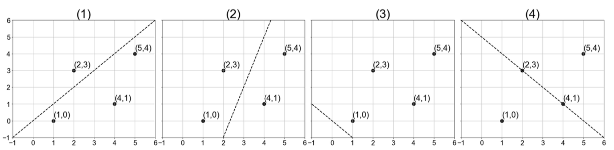

# Practice Problem Set 1 - Solutions

Consider the following matrix $X$ with four data points in $\mathbb{R}^2$. We would like to use PCA to find a rank-1 linear representation of these data.

$X = \begin{bmatrix} 4 & 1 \\ 5 & 4 \\ 1 & 2 \\ 1 & 0 \end{bmatrix}$



**Figure 2:** These plots depict data points from the four-sample dataset $X$.

## Question 1
Which line in Figure 2 represents the direction of the first principal component of $X - \mu$, where $X \in \mathbb{R}^{n \times d}$ the vector $\mu \in \mathbb{R}^d$ is the featurewise mean of $X$?

(A) Plot 1  
(B) Plot 2  
(C) Plot 3  
(D) Plot 4  

**Solution:** The answer is (A).

## Question 2
Which of the following statements about kernels is false?

(A) Kernel feature vectors $\phi(x_i)$ can be infinite-dimensional  
(B) Kernels methods scale well to large datasets because the size of the kernel matrix does not depend on the size of the dataset  
(C) Kernel matrices store the results of inner products of the data's features computed in a higher-dimensional space  
(D) Kernels allow otherwise linear models to find non-linear decision boundaries  

**Solution:** The answer is (B).

## Question 3
Suppose you have a logistic regression model for spam detection, using a dataset with a binary outcome that indicates whether an email is spam (1) or not spam (0). The predictor variables $x_1$, $x_2$, and $x_3$ are boolean values (0 or 1) that indicate whether the email contains the words "free", "order", and "homework", respectively. The model has four parameters: weights $w_1$, $w_2$, $w_3$, and offset $b$. You find that emails containing the words "free" and "order" have a higher probability of being spam, while emails containing the word "homework" have a lower probability of being spam. Given this information, which of the following signs is most likely for the weights $w_1$, $w_2$, and $w_3$?

(A) All positive  
(B) All negative  
(C) $w_1$ and $w_2$ are positive, $w_3$ is negative  
(D) $w_1$ and $w_2$ are negative, $w_3$ is positive  

## Question 4
**True/False:** Solving the k-means objective is an unsupervised learning problem.

(A) True  
(B) False  

**Solution:** The answer is (A).

## Question 5
Which of the following is typical for decision trees trained to have 0 training error?

(A) High bias, low variance  
(B) High bias, high variance  
(C) Low bias, high variance  
(D) Low bias, low variance  

**Solution:** The answer is (C).

## Question 6
When is PCA ineffective?

(A) When data has an orthogonal underlying structure.  
(B) When the data's underlying low-dimensional structure is non-linear.  
(C) When the data is standardized.  
(D) When data visualisation is needed.  

**Solution:** The answer is (B).

## Question 7
The kernel matrix $K$ is not

(A) Symmetric  
(B) Square  
(C) Positive semi-definite (defined as $x^T Kx > 0$ for every nonzero column vector $x$; a necessary condition for this is that $K$ has nonnegative eigenvalues).  
(D) Elementwise positive  

**Solution:** The answer is (D).

## Question 8
**True/False:** Ridge regression's optimal parameters $\hat{w} = (X^T X + \lambda I)^{-1} X^T y$ are a linear combination of the data points $x_i$ in $X$.

(A) True  
(B) False  

**Solution:** The answer is (A).

## Question 9
**True/False:** Solving the k-means objective with Lloyd's algorithm (shown in lecture) will always converge to the global optimum of the k-means objective.

(A) True  
(B) False  

**Solution:** The answer is (B).

## Question 10
When might it be appropriate to use ridge regression instead of (unregularized) least square regression?

(A) When the data is linearly separable.  
(B) When the number of predictor variables is very large relative to the number of observations ($d > n$).  
(C) When there are categorical or one-hot features in the input dataset.  
(D) When the data is not standardized.  

**Solution:** The answer is (B).

## Question 11
**True/False:** For PCA, the objective function can equivalently be thought of as (1) variance-maximization or (2) reconstruction error-minimization.

(A) True  
(B) False  

**Solution:** The answer is (A).

## Question 12
Which of the following activation functions can be used in the output layer of a neural network if we wish to predict the probabilities of $k$ classes $\hat{p} = (p_1, p_2,..., p_k)$ such that sum of $\hat{p}$ over all $k$ equals to 1? (Assume $k \ge 2$.)

(A) Tanh  
(B) Leaky ReLU  
(C) Sigmoid  
(D) Softmax  

**Solution:** The answer is (D).

## Question 13
**True/False:** For decision tree algorithms, small perturbation in the training data can result in large differences in the resulting classifiers.

(A) True  
(B) False  

**Solution:** The answer is (A).

## Question 14
**True/False:** The unfairness with respect to race of a model trained on a dataset can be completely resolved by removing race as a feature.

(A) True  
(B) False  

**Solution:** The answer is (B).

## Question 15
For the following code snippet on the bootstrap algorithm, determine whether it is correct or select the function that is possibly buggy.

```python
1 import random
2
3 def sample(data):
4     sample = random.sample(data, len(data)) # samples len(data) elements without replacement
5     return sample
6
7 def mean(numbers):
8     return sum(numbers) / len(numbers)
9
10 def bootstrap(data, num_samples):
11     samples = [sample(data) for _ in range(num_samples)]
12     sample_means = [mean(sample) for sample in samples]
13     return sample_means
14
15 data = [1, 2, 3, 4, 5]
16 bootstrap_means = bootstrap(data, 10)
```

(A) Code is correct.  
(B) sample function is buggy.  
(C) mean function is buggy.  
(D) bootstrap function is buggy (assuming sample function and mean function is correct).  

**Solution:** The answer is (B).

## Question 16
**True/False:** The bootstrap method can be applied to other statistics, not just variance.

(A) True  
(B) False  

**Solution:** The answer is (A).

## Question 17
**True/False:** The cluster centers that are calculated during each iteration of Lloyd's algorithm are always actual data points.

(A) True  
(B) False  

**Solution:** The answer is (B).

## Question 18
What kind of method can be used to tune models and hyperparameter selection so as to optimize the bias-variance tradeoff?

(A) Bootstrap.  
(B) $k$-means.  
(C) Cross validation.  
(D) All of the above.  

**Solution:** The answer is (C).

## Question 19
**True/False:** The expected error on unseen samples is at least the irreducible error.

(A) True  
(B) False  

**Solution:** The answer is (A).

## Question 20
Which of the following methods would not help when a model suffers from high bias?

(A) Add more input features.  
(B) Standardizing the data (to have mean 0, variance 1).  
(C) Decrease regularization.  
(D) Increase the complexity of the hypothesis class.  

**Solution:** The answer is (B).

## Question 21
Which of the following would be the most appropriate loss function to use when training a neural network on a multi-class classification problem?

(A) Mean Absolute Error  
(B) Mean Squared Error  
(C) Cross Entropy  
(D) Hinge loss  

**Solution:** The answer is (C).

## Question 22
Which of the following does not increase the complexity of a neural network?

(A) Adding more layers  
(B) Increasing the hidden layer size  
(C) Reducing the strength of the regularizer  
(D) Reducing the learning rate  

**Solution:** The answer is (D).

## Question 23
Which of the following is NOT an advantage of SVMs?

(A) SVMs can guarantee that the solution is a global minimum.  
(B) SVMs can be used for both linearly-separable and non-linearly-separable data.  
(C) The SVM objective can be solved in closed form.  
(D) SVMs can be combined with the kernel trick to learn feature mappings.  

**Solution:** The answer is (C).

## Question 24
Which of the following would be the most appropriate model for an image classification problem?

(A) Neural network with fully-connected layers  
(B) Neural network with convolutional layers  
(C) Kernel SVM  
(D) Random forest  

**Solution:** The answer is (B).

## Question 25
Assume you train a neural network with SGD with a batch size of 10 on a dataset consisting of 500 samples. How many cumulative backward passes will your neural network perform on any given epoch?

(A) 5000  
(B) 500  
(C) 50  
(D) 10  

**Solution:** The answer is (C).

```
Hidden
Input
Output
```

**Figure 3:** This figure depicts a 2-layer neural network.

## Question 26
Assuming the neural network in figure 3 has no bias parameters, how many trainable parameters does it have?

(A) 9  
(B) 20  
(C) 24  
(D) 29  

**Solution:** The answer is (B).

## Question 27
Which of the following is NOT a potential benefit of using ridge regression?

(A) It can reduce the variance of the model.  
(B) It can improve the interpretability of the model.  
(C) It can help to reduce overfitting.  

**Solution:** The answer is (B).

## Question 28
How many parameters do we need to learn a mixture of two Gaussian distributions with N samples in $\mathbb{R}^1$?

(A) 2  
(B) 4  
(C) N x 2  
(D) N  

**Solution:** The answer is actually 5 (not an answer choice). Everyone received a point for this problem.

## Question 29
Which of the following statements is true about the bootstrap method?

(A) The bootstrap estimator for prediction error offers better generalization than cross-validation.  
(B) A bootstrap sample can be obtained from the empirical distribution of the data.  
(C) All of the above.  
(D) None of the above.  

**Solution:** The answer is (B).

## Question 30
What does the generalization error of an SVM measure?

(A) How far the hyperplane is from the support vectors.  
(B) How accurately the SVM can predict outcomes for unseen data.  
(C) The threshold amount of error in an SVM.  
(D) The complexity of the decision boundary.  

**Solution:** The answer is (B).

## Question 31
**True/False:** Support vectors are the data points that lie closest to the decision boundary.

(A) True.  
(B) False.  

**Solution:** The answer is (A) or (B) (both answers accepted due to ambiguity of the question).

## Question 32
Which of the following is a potential advantage of using Lasso regression over unregularized linear regression?

(A) It can decrease the bias of the model.  
(B) It will always be more computationally efficient to train.  
(C) It always produces the best results (in terms of test error).  
(D) It can make the model more interpretable.  

**Solution:** The answer is (D).

## Question 33
Consider a neural network with $L$ layers. How many forward passes through the entire network are needed in a run of the backpropagation algorithm?

(A) $L$  
(B) $L^2$  
(C) 1  
(D) 2  

**Solution:** The answer is (C).

## Question 34
Suppose you have trained an SVM with a quadratic kernel. After training the SVM, you correctly infer that your SVM model is underfitting. Which of the following option should you consider for (re)training this SVM next time to address the underfitting?

(A) Increase the number of training data points.  
(B) Decrease the number of training data points.  
(C) Increase the degree of the kernel used (e.g., fit an SVM with a cubic kernel instead).  
(D) Decrease the degree of a kernel used (e.g., fit a linear SVM instead).  

**Solution:** The answer is (C).

## Question 35
Consider a fully connected layer with input size $M$, an offset, and output size $N$. What is the total number of parameters of this layer?

(A) $M + N$  
(B) $M^2 \times N$  
(C) $(M+1) \times N$  
(D) $M^2 \times N^2$  

**Solution:** The answer is (C).

## Question 36
You have a batch of size $N$ 512 x 512 RGB images as your input. The input tensor your neural network has the shape $(N, 3, 512, 512)$. You pass your input through a convolutional layer like below: `Conv2D(in_channels=3, out_channels=32, kernel_size=9, stride=1, padding=1)` What is the shape of your output tensor?

(A) $(N, 32, 512, 512)$  
(B) $(N, 32, 506, 506)$  
(C) $(N, 32, 505, 505)$  
(D) $(N, 32, 253, 253)$  

**Solution:** The answer is (B).

## Question 37
Which of the following sets is NOT convex?

(A) $\{\mathbf{x} \in \mathbb{R}^2 \mid ||\mathbf{x}||_2 < 1\}$  
(B) $\{(x, y) \in \mathbb{R}^2 \mid |x| > y\}$  
(C) $\{(x, y) \in \mathbb{R}^2 \mid x < y^2\}$  
(D) $\{\mathbf{x} \in \mathbb{R}^3 \mid \mathbf{x} \cdot (1, 2, 3) \geq 0\}$  

**Solution:** The answer is (C) or (B).

## Question 38
What is the correct order of a training step of a neural network?

(A) compute loss $\rightarrow$ forward pass $\rightarrow$ backward pass  
(B) backward pass $\rightarrow$ compute loss $\rightarrow$ forward pass  
(C) forward pass $\rightarrow$ compute loss $\rightarrow$ backward pass  
(D) backward pass $\rightarrow$ forward pass $\rightarrow$ compute loss  

**Solution:** The answer is (C).

## Question 39
Which of the following is true for random forest algorithm?

(A) Random forests generally have low bias and low variance.  
(B) The trees for the random forest are only trained on a subset of the training data.  
(C) Random forests can be used for both classification and regression  
(D) All of the above.  

**Solution:** The answer is (D).

## Question 40
Which of the following functions is convex on the given interval?

(A) $y = -|x|$ on $[0,2]$  
(B) $y = x^3$ on $[-1,1]$  
(C) $y = \max(-x^2, -x)$ on $[0,2]$  
(D) $y = \cos(x)$ on $[0, \pi]$.  

**Solution:** The answer is (A).

## Question 41
How does lasso regression differ from ridge regression?

(A) Lasso regression adds a penalty term to the regression equation, while ridge regression does not.  
(B) Lasso regression can achieve feature selection (by setting feature weights to exactly zero), while ridge regression can not.  
(C) Lasso regression is a type of unregularized linear regression, while ridge regression is regularized.  
(D) Lasso regression is a type of regularized linear regression, while ridge regression is unregularized.  

**Solution:** The answer is (B).

## Question 42
In which of the following situations would it be appropriate to use logistic regression?

(A) Predicting whether a credit card transaction is fraudulent based on some attributes.  
(B) Predicting the number of cars that will pass through a particular intersection during rush hour.  
(C) Predicting the annual income of a person based on their education and employment history.  
(D) Predicting the price of a stock based on historical data.  

**Solution:** The answer is (A).

## Question 43
Which of the following statements about principal component analysis (PCA) is false?

(A) All principal components are always orthogonal to each other.  
(B) Before using PCA, it's important to preprocess data by demeaning the data matrix.  
(C) The first $q$ principal components are the first $q$ eigenvectors of the demeaned data matrix  
(D) PCA produces a linear transformation of the data.  

**Solution:** The answer is (C).

## Question 44
Which of the following is NOT a convex optimization problem?

(A) Logistic regression  
(B) neural network training  
(C) Gaussian kernel SVM  
(D) minimizing least squares with polynomial features  

**Solution:** The answer is (B).

## Question 45
Which of the following facts can lead to misleading correlational statistics in criminal justice datasets?

(A) Different reported crime rates across different neighborhoods.  
(B) Different wrongful arrest rates across different demographic groups.  
(C) Difference in local laws, i.e., different laws regarding indoor and outdoor drug sales in Seattle  
(D) All of the above.  

**Solution:** The answer is (D).

## Question 46
Which of the following functions is the logistic loss for label $y = +1$?

The following plots show different functions:

(A) A graph showing a piecewise linear function. It starts at approximately $(-3, 4)$ and decreases linearly to $(1, 0)$, then remains constant at $y=0$ for $x > 1$.  
(B) A graph showing a parabolic curve opening upwards, with its vertex at $(1, 0)$. It passes through $(0, 1)$ and $(2, 1)$.  
(C) A graph showing a curve that decreases exponentially. It passes through $(0, 1)$ and approaches $y=0$ as $x$ increases. For negative $x$, the value increases, e.g., at $(-3, \approx 1.5)$.  
(D) A graph showing a curve that decreases exponentially, steeper than (C). It passes through $(0, 1)$ and approaches $y=0$ as $x$ increases. For negative $x$, the value increases significantly, e.g., at $(-3, \approx 4)$.  

**Solution:** The answer is (D).

## Question 47
Which of the following methods would **not** help when a model suffers from high variance?

(A) Reduce training data.  
(B) Decrease model size.  
(C) Increase the amount of regularization.  
(D) Perform feature selection.  

**Solution:** The answer is (A).

## Question 48
In linear regression, the loss function is $L(\alpha) = ||y - K\alpha||_2^2 + \lambda\alpha^T K\alpha$, where the kernel matrix $K$ is given by $K_{ij} = \langle\phi(x_i), \phi(x_j)\rangle$ for a kernel map $\phi$, inner product $\langle\cdot, \cdot\rangle$, and data samples $x_i, x_j \in \mathbb{R}^d$. What is the closed form solution for $\alpha$ that minimizes $L(\alpha)$?

(A) $(K^T K + \lambda I)^{-1} K^T y$  
(B) $(K + \lambda I)^{-1} y$  
(C) $K^T (K + \lambda I)^{-1} y$  
(D) $(K + \lambda I)^{-1} K^T y$  

**Solution:** The answer is (B).

**Figure 4:** This figure depicts a neural network diagram with input nodes $x_1$ and $x_2$, hidden layer nodes $z_1$ and $z_2$, a bias node $b$, and an output node $\hat{y}$. Connections are shown from $x_1$ to $z_1$ and $z_2$, from $x_2$ to $z_1$ and $z_2$, and from $z_1$, $z_2$, and $b$ to $\hat{y}$.

Use this figure to answer the following two questions.

## Question 49
Consider the following equations:

(1) $z_1(x_1,x_2) = (x_1)^2 + 4x_2$  
(2) $z_2(x_1,x_2) = (x_1+x_2)^2$  
(3) $\hat{y}(z_1, z_2, b) = b + z_1 \cdot z_2$  

which can be combined to form the network shown in Figure 4. What is the formula for $\frac{\partial \hat{y}}{\partial x_1}$?

(A) $4x_1$  
(B) $2(x_1+x_2) + 2z_1x_2$  
(C) $2z_1x_1 + 2z_2(x_1+2x_2)$  
(D) $2z_2x_1 + 2z_1(x_1+x_2)$  

**Solution:** The answer is (D). (Note that the answer choices were changed during the exam. The original answer choices are not shown here.)

## Question 50
If $x_1 = 2$ and $x_2 = -1$, then what is the value of $\frac{\partial \hat{y}}{\partial x_2}$?

(A) 0  
(B) 4  
(C) 2  
(D) 1  

**Solution:** The answer is (B).

## Question 51
When reviewing the grade for an assignment in CSE 446, TAs found out those grades follows a gamma distribution. The probability density function $f(x)$ for the gamma distribution with parameters $k$ and $\theta$ is

$f(x; k, \theta) = \frac{1}{\Gamma(k)\theta^k}x^{k-1}e^{-\frac{x}{\theta}}$, $\quad \Gamma(x) = (x - 1)!$.

What is the Maximum Likelihood Estimator (MLE) for the parameter $\theta$ in terms of the number of students $n$, the student grades $x_1, \dots, x_n$, and the parameter $k$?

(A) $\frac{1}{kn} \sum_{i=1}^{n} x_i$  
(B) $\frac{n}{(k-1)!} \sum_{i=1}^{n} x_i e^{-\frac{x_i}{k}}$  
(C) $\ln(\frac{1}{n} \sum_{i=1}^{n} x_i) - n(k-1)!$  
(D) $\frac{\ln(k)-(k-1)!}{\frac{1}{k}}$  

**Solution:** The answer is (A).

