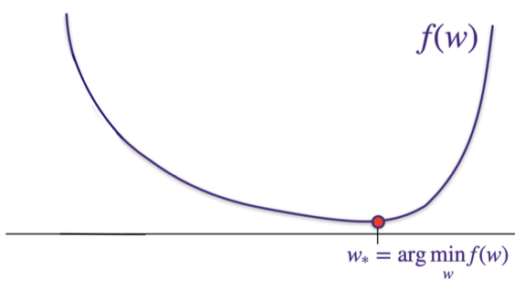

# Problem Set 1: : Train-Test Splitting, Generalized Least Squares Regression, MAP as Regularization

### 1. Biased Test Error
Is the test error unbiased for these programs? If not, how can we fix the code so it is?

#### 1.1. Program 1
```python
1 # Given dataset of 1000-by-50 feature
2 # matrix X, and 1000-by-1 labels vector
3
4 mu = np.mean(X, axis=0)
5 X = X - mu
6
7 idx = np.random.permutation(1000)
8 TRAIN = idx[0:900]
9 TEST = idx[900::]
10
11 ytrain = y[TRAIN]
12 Xtrain = X[TRAIN,:]
13
14 # solve for argmin_w ||Xtrain*w - ytrain||_2
15 w = np.linalg.solve(np.dot(Xtrain.T, Xtrain), np.dot(Xtrain.T, ytrain))
16
17 b = np.mean(ytrain)
18
19 ytest = y[TEST]
20 Xtest = X[TEST, :]
21
22 train_error = np.dot(np.dot(Xtrain, w)+b - ytrain,
23                      np.dot(Xtrain, w)+b - ytrain) / len(TRAIN)
24 test_error = np.dot(np.dot(Xtest, w)+b - ytest,
25                     np.dot(Xtest, w)+b - ytest) / len(TEST)
26
27 print('Train error = ', train_error)
28 print('Test error = ', test_error)
```

#### 1.2. Program 2
```python
1 # We are given: 1) dataset X with n=1000 samples and 50 features and 2) a vector y of length 1000 with labels.
2
3 # Consider the following code to train a model, using cross validation to perform hyperparameter tuning.
4 def fit(Xin, Yin, _lambda):
5     w = np.linalg.solve(np.dot(Xin.T, Xin) + _lambda * np.eye(Xin.shape[1]), np.dot(Xin.T, Yin))
6     b = np.mean(Yin) - np.dot(w, mu)
7     return w, b
8
9 def predict(w, b, Xin):
10     return np.dot(Xin, w) + b
11
12 idx = np.random.permutation(1000)
13 TRAIN = idx[0:800]
14 VAL = idx[800:900]
15 TEST = idx[900::]
16
17 ytrain = y[TRAIN]
18 Xtrain = X[TRAIN, :]
19 yval = y[VAL]
20 Xval = X[VAL, :]
21
22 # demean data
23 mu = np.mean(Xtrain, axis=0)
24 Xtrain = Xtrain - mu
25 Xval = Xval - mu
26
27 # use validation set to pick the best hyper-parameter to use
28 lambdas = [10 ** -5, 10 ** -4, 10 ** -3, 10 ** -2]
29 err = np.zeros(len(lambdas))
30
31 for idx, lambda_val in enumerate(lambdas):
32     w, b = fit(Xtrain, ytrain, lambda_val)
33     yval_hat = predict(w, b, Xval)
34     err[idx] = np.mean((yval_hat - yval) ** 2)
35
36 lambda_best = lambdas[np.argmin(err)]
37
38 Xtot = np.concatenate((Xtrain, Xval), axis=0)
39 ytot = np.concatenate((ytrain, yval), axis=0)
40
41 w, b = fit(Xtot, ytot, lambda_best)
42
43 ytest = y[TEST]
44 Xtest = X[TEST, :]
45
46 # demean data
47 Xtest = Xtest - mu
48
49 ytot_hat = predict(w, b, Xtot)
50 train_error = np.mean((ytot_hat - ytot) ** 2)
51 ytest_hat = predict(w, b, Xtest)
52 test_error = np.mean((ytest_hat - ytest) ** 2)
53
54 print('Train error = ', train_error)
55 print('Test error = ', test_error)
```

### 2. Gradient Descent

Like we've seen in lecture, gradient descent is an important algorithm commonly used to train machine learning models, particularly useful for when there is no closed form solution for the minimum of a loss function. Here, we'll go through short introduction to the algorithm.

Consider some function $`f(w)`$, which has some $`w_*`$ for which $`w_* = \text{arg min}_w f(w)`$:



Let $`w_0`$ be some initial guess for the minimum of $`f(w)`$. Gradient descent will allow us to improve this solution.

#### (a) For some $`w`$ that is very close to $`w_0`$, give the Taylor series approximation for $`f(w)`$ starting at $`f(w_0)`$.

#### (b) Now, let us choose some $`\eta > 0`$ that is very small. With this very small $`\eta`$, let's assume that $`w_1 = w_0 - \eta \left(\frac{df(w)}{dw}\right)_{w=w_0}`$. Using your approximation from part (a), give an expression for $`f(w_1)`$.

#### (c) Given your expression for $`f(w_1)`$ from part (b), explain why, if $`\eta`$ is small enough and if the function approximation is a good enough approximation, we are guaranteed to move in the "right" direction closer to the minimum $`w_*`$.

#### (d) Building from your answer in part (c), write a general form for the gradient descent algorithm.

### 3. Generalized Least Squares Regression

This generalizes linear regression and ridge regression. We want to find a model $`\mathbf{w} \in \mathbb{R}^d`$ that:
1. Minimizes error
2. Prevents large changes in solution from small training data changes
3. Allows for different weighting of $`\mathbf{w}`$ coordinates

We define $`\hat{\omega}_{\text{general}}`$ as:
```math
\hat{\omega}_{\text{general}} = \arg \min_{\omega} \sum_{i=1}^{n} (y_i - \mathbf{x}_i^\text{T}\omega)^2 + \lambda \sum_{i=1}^{d} D_{ii}\omega_i^2.
```

Note that $`\mathbf{D}`$ is a diagonal matrix with positive entries. If $`\mathbf{D}`$ is the identity matrix, we recover ridge regression. If $`\lambda = 0`$, we recover least squares regression. Different $`\mathbf{D}_{ii}`$ values control the magnitudes of $`\omega_i`$ differently.

#### 3.1. Closed form in the general case

Deduce the closed-form solution for $`\hat{\omega}_{\text{general}}`$. You should be comfortable with both "coordinate" and "matrix" forms of proofs.

#### 3.2. Special cases: linear regression and ridge regression

**(a) In the simple least squares case ($`\lambda = 0`$ above), what happens to the resulting $`\hat{\omega}`$ if we double all the values of $`y_i`$?**

**(b) In the simple least squares case ($`\lambda = 0`$ above), what happens to the resulting $`\hat{\omega}`$ if we double the data matrix $`X \in \mathbb{R}^{n \times d}`$?**

**(c) Suppose $`D = I`$ (that is, it is the identity matrix). That is, this is the ridge regression setting. Explain why $`\lambda > 0`$ ensures a "well-conditioned" setting.**

### 4. MAP as Regularization

Recall the regularization techniques:
(a) Ridge-Regression:
```math
\hat{w}_{\text{ridge}} = \text{arg min}_w \sum_{i=1}^n (y_i - x_i^T w)^2 + \lambda ||w||_2^2
```
(b) LASSO:
```math
\hat{w}_{\text{LASSO}} = \text{arg min}_w \sum_{i=1}^n (y_i - x_i^T w)^2 + \lambda ||w||_1
```

**Reminder:** don't ever regularize your bias term. This term doesn't add any complexity to the model (since it just shifts), so we'd like it to take on any value that best fits our training data.

These regularization types can be derived from a statistical perspective, assuming a prior belief about weights. Let $`w`$ be weights, $`Y`$ be labels, and $`X`$ be inputs.
$`p(X, Y|w)`$ represents the **likelihood function**.
A **prior distribution** over $`p(w)`$ specifies the belief about weights.
Using Bayes' Rule, the updated belief (posterior distribution) $`p(w|X, Y)`$ is given by:
```math
p(w|X,Y) = \frac{p(X,Y|w)p(w)}{p(X,Y)} = \frac{p(X,Y|w)p(w)}{\int_{w'} p(X,Y|w')p(w')dw'}
```
Here, $`p(w|X, Y)`$ is the **posterior distribution** and $`p(X, Y)`$ is the **evidence**.

**Maximum A Posteriori Estimation (MAP)** computes the weights that maximize the posterior distribution, $`p(w|X, Y)`$. It differs from MLE by incorporating the prior belief $`p(w)`$.
The MAP estimate is derived as:
```math
\hat{w}_{\text{MAP}} = \text{arg max}_w p(w|X, Y)
```
```math
= \text{arg max}_w \frac{p(X,Y|w)p(w)}{p(X, Y)}
```
```math
= \text{arg max}_w p(X, Y|w)p(w)
```
```math
= \text{arg max}_w \log p(X,Y|w) + \log p(w)
```
The denominator $`p(X, Y)`$ is disposed of because it doesn't depend on $`w`$.
This is contrasted with **MLE (Maximum Likelihood Estimation)**:
```math
\hat{w}_{\text{MLE}} = \text{arg max}_w p(X, Y|w)
```

Let us now study how we can obtain the Ridge and LASSO regression objectives from this perspective:

#### (a) Suppose the elements of $`w`$ are independently distributed according to a Laplacian distribution:
```math
p(w_i) = \frac{\lambda}{4\sigma^2} \exp\left(-\frac{|w_i|\lambda}{2\sigma^2}\right)
```
Show that under this prior on $`w`$, MAP estimation of the linear measurement model recovers the LASSO objective.

#### (b) Derive an expression for the prior on $`w`$ that corresponds to the ridge regression objective. What is the significance of this result?

